# Awesome GPT Image 2 API and Prompts [](https://awesome.re)

<div align="center">

<a href="https://evolink.ai/gpt-image-2-prompts?utm_source=github&utm_medium=banner&utm_campaign=awesome-gpt-image-2-API-and-Prompts"></a>

[](LICENSE)
[](README.md)
[](https://github.com/EvoLinkAI/GPT-Image-2-Seedance2-Workflow)
[](https://docs.evolink.ai/en/api-manual/image-series/gpt-image-2/gpt-image-2-image-generation?utm_source=github&utm_medium=readme&utm_campaign=awesome-gpt-image-2-API-and-Prompts)

[](README.md)
[](README_es.md)
[](README_pt.md)
[](README_ja.md)
[](README_ko.md)
[](README_de.md)
[](README_fr.md)
[](README_tr.md)
[](README_zh-TW.md)
[](README_zh-CN.md)
[](README_ru.md)

</div>

## 목차

- [🍌 소개](#-소개)
- [❓ GPT Image 2란?](#-gpt-image-2란)
- [📰 새 소식](#-새-소식)
- [🔌 GPT Image 2 API 사용하기](#-gpt-image-2-api-사용하기)
- [🛒 이커머스 사례](#-이커머스-사례)
- [📣 광고 크리에이티브 사례](#-광고-크리에이티브-사례)
- [🍌 인물 및 사진 사례](#-인물-및-사진-사례)
- [🎨 포스터 및 일러스트 사례](#-포스터-및-일러스트-사례)
- [🧍 캐릭터 디자인 사례](#-캐릭터-디자인-사례)
- [📱 UI 및 소셜 미디어 목업 사례](#-ui-및-소셜-미디어-목업-사례)
- [🧪 비교 및 커뮤니티 사례](#-비교-및-커뮤니티-사례)
- [🤝 기여 방법](#-기여-방법)
- [🙏 감사의 말](#-감사의-말)
- [스타 히스토리](#스타-히스토리)

## 🍌 소개

**Awesome GPT Image 2 API and Prompts** 저장소에 오신 것을 환영합니다! 🤗

AI 이미지 생성을 위한 **878개 이상의 고품질 GPT-Image-2 프롬프트**, API 활용 패턴, 재사용 가능한 비주얼 워크플로를 엄선해 모았습니다.

GPT-Image-2 프롬프트 예시, text-to-image 모범 사례, 이미지 편집 기법, 바로 사용할 수 있는 프롬프트 템플릿을 찾는 분들을 위한 레퍼런스입니다.

**여기에서 확인할 수 있는 것:**
- 🎯 7개 카테고리(인물, 포스터, UI, 이커머스, 광고 크리에이티브, 캐릭터 디자인, 비교)에 걸친 실전형 프롬프트
- 🔌 GPT Image 2 API 연동 가이드와 호출 가능한 skill
- 🌍 11개 언어로 제공되는 문서
- 📸 모든 프롬프트 케이스에 대응하는 실제 출력 이미지

Evolink에서 사용해 보기: [GPT-Image-2 API](https://evolink.ai/gpt-image-2-prompts?utm_source=github&utm_medium=readme&utm_campaign=awesome-gpt-image-2-API-and-Prompts)

유용했다면 저장소에 스타를 남겨 주세요. ⭐

<a href='https://evolink.ai/gpt-image-2-prompts?utm_source=github&utm_medium=badge&utm_campaign=awesome-gpt-image-2-API-and-Prompts'></a>

## ❓ GPT Image 2란?

**GPT Image 2**(GPT-Image-2 또는 gpt-image-2로도 표기)는 ChatGPT에 기본 통합되어 있고 OpenAI API로도 사용할 수 있는 OpenAI의 이미지 생성 및 편집 모델입니다.

**주요 기능:**
**Text-to-image 생성** — 자연어 프롬프트로 사실적인 이미지, 일러스트, 포스터, UI 목업 등을 생성
**이미지 편집** — 텍스트 지시로 기존 이미지를 수정(인페인팅, 아웃페인팅, 스타일 변환)
**멀티턴 대화** — 대화를 통해 이미지를 단계적으로 개선
**고정밀 텍스트 렌더링** — 생성 이미지 안의 텍스트를 더 정확하게 표현
**일관된 캐릭터 생성** — 여러 번 생성해도 캐릭터의 동일성을 유지

**개발자가 GPT Image 2 API를 사용하는 이유:**
생성과 편집을 하나의 API 호출로 처리
이전 모델보다 뛰어난 프롬프트 준수
종횡비, 투명 배경, 배치 생성을 기본 지원
OpenAI 표준 API 형식(`/v1/images/generations`)과 호환

> API 사용법은 아래의 “GPT Image 2 API 사용하기” 섹션에서 더 자세히 확인할 수 있습니다.

## 📰 새 소식

**2026년 6월 18일:** 일일 이미지 프롬프트 업데이트 루프에서 GPT-Image-2 프롬프트 사례 8건(인물 2, 포스터 2, 광고 크리에이티브 2, 전자상거래 1, UI 1)을 추가했으며, 의미 검토와 미디어 검증을 완료했습니다

**2026년 6월 18일:** 의미 검토와 미디어 검증을 통과한 이미지 프롬프트 업데이트 루프에서 GPT-Image-2 신규 프롬프트 사례 8개를 추가했습니다 (인물 2개, 포스터 2개, 이커머스 1개, 광고 크리에이티브 2개, UI 1개)

**2026년 6월 15일:** 의미 검토와 미디어 검증을 통과한 이미지 프롬프트 업데이트 루프에서 GPT-Image-2 신규 프롬프트 사례 9개를 추가했습니다 (광고 크리에이티브 4개, 포스터 3개, 인물 1개, UI 1개)

**2026년 6월 14일:** 의미 검토와 미디어 검증을 통과한 이미지 프롬프트 업데이트 루프에서 GPT-Image-2 신규 프롬프트 사례 14개를 추가했습니다 (포스터 9개, 광고 크리에이티브 2개, 캐릭터 1개, UI 1개, 비교 1개)

**2026년 6월 12일:** 승인과 미디어 검증을 거친 일일 큐레이션 배치에서 GPT-Image-2 신규 프롬프트 사례 42개를 추가했습니다 (인물 19개, 포스터 12개, 광고 크리에이티브 4개, 캐릭터 4개, 비교 2개, 이커머스 1개). 승인된 후보 중 2개는 트윗 조회에서 사용할 수 있는 미디어가 없어 제외했습니다

**2026년 6월 10일:** 검토 및 미디어 검증 후 일일 큐레이션 배치에서 31개의 새로운 GPT-Image-2 프롬프트 케이스 추가 (인물 9개, 포스터 21개, 비교 1개)

**2026년 6월 9일:** 일일 큐레이션 배치에서 12개의 새로운 GPT-Image-2 프롬프트 케이스가 추가되었습니다 (인물 2개, 포스터 7개, 비교 2개, 이커머스 1개)

**2026년 6월 8일:** 승인된 일일 큐레이션 배치에서 GPT-Image-2 신규 프롬프트 사례 24개를 추가했습니다 (인물 5, 포스터 7, UI 5, 이커머스 3, 비교 4). 스레드 복원과 미디어 검증 완료

**2026년 6월 7일:** 검토와 미디어 검증을 거친 일일 큐레이션 배치에서 GPT-Image-2 신규 프롬프트 사례 19개를 추가했습니다 (인물 2, 포스터 6, UI 5, 이커머스 4, 비교 2)

**2026년 5월 27일:** 일일 큐레이션 배치에서 새로운 GPT-Image-2 프롬프트 케이스 6개를 추가했습니다 (인물 1개, 포스터 3개, UI 1개, 비교 1개). 검토 및 미디어 검증 완료

**2026년 5월 19일:** 일일 큐레이션 배치에서 23개의 새로운 GPT-Image-2 프롬프트 케이스 추가 (포트레이트 13개, 포스터 8개, UI 2개)


- **2026년 5월 12일:** 일일 큐레이션 배치에서 12개의 새로운 GPT-Image-2 프롬프트 케이스 추가 (초상화 2개, 포스터 9개, UI 1개)

- **2026년 5월 11일:** 일일 큐레이션 배치에서 16개의 새로운 GPT-Image-2 프롬프트 케이스 추가 (초상화 5개, 포스터 8개, 광고 크리에이티브 3개)

- **2026년 5월 10일:** 일일 큐레이션 배치에서 19개의 새로운 GPT-Image-2 프롬프트 케이스 추가 (초상화 4개, 포스터 11개, UI 3개, 비교 1개)

- **2026년 5월 9일:** 일일 큐레이션 배치에서 19개의 새로운 GPT-Image-2 프롬프트 케이스 추가 (초상화 6개, 포스터 12개, 비교 1개)

- **2026년 5월 8일:** 일일 큐레이션 배치에서 36개의 새로운 GPT-Image-2 프롬프트 케이스 추가 (초상화 24개, 포스터 6개, UI 6개)
- **2026년 5월 7일:** 일일 큐레이션 배치에서 20개의 새로운 GPT-Image-2 프롬프트 케이스 추가 (초상화 10개, 포스터 9개, UI 1개)

- **2026년 5월 6일:** 7개의 새로운 GPT-Image-2 프롬프트 케이스 추가(인물 2개, 포스터 5개)
- **2026년 5월 5일:** 12개의 새로운 GPT-Image-2 프롬프트 케이스 추가(인물 4개, 포스터 5개, UI 3개)
- **2026년 5월 3일:** 10개의 새로운 GPT-Image-2 프롬프트 케이스 추가(이커머스 1개, 광고 1개, 인물 3개, 포스터 2개, UI 3개)

<details>
<summary>📜 이전 업데이트</summary>

- **2026년 5월 2일:** 18개의 새로운 케이스 추가(인물 3개, 포스터 7개, UI 4개, 비교 4개)
- **2026년 4월 30일:** 9개의 새로운 케이스 추가(인물 3개, 포스터 1개, UI 3개, 비교 2개)
- **2026년 4월 29일:** 22개의 새로운 케이스 추가(이커머스 3개, 광고 3개, 인물 4개, 캐릭터 2개, 포스터 9개, 비교 1개)
- **2026년 4월 18일:** 큐레이션된 GPT-Image-2 케이스 세트로 저장소 첫 공개

</details>

## 🔌 GPT Image 2 API 사용하기

프롬프트 아이디어에서 실제 이미지 생성까지 빠르게 이어 가려면 GPT Image 2 API 문서와 호출 가능한 skill을 함께 사용하세요.

### 1. Skill 빠른 설치

- [gpt-image-2-gen-skill 저장소로 이동](https://github.com/EvoLinkAI/gpt-image-2-gen-skill)
- 한 줄 설치:

```bash
npx evolink-gpt-image -y
```

### 2. API에 빠르게 연결

- 연결 명령:

```bash
curl --request POST \
  --url https://api.evolink.ai/v1/images/generations \
  --header 'Authorization: Bearer YOUR_API_KEY' \
  --header 'Content-Type: application/json' \
  --data '{
  "model": "gpt-image-2",
  "prompt": "A beautiful colorful sunset over the ocean"
}'
```

- [API 키 받기](https://evolink.ai/dashboard?utm_source=github&utm_medium=readme&utm_campaign=awesome-gpt-image-2-API-and-Prompts)
- GPT Image 2 API 문서 읽기

## 🛒 이커머스 사례

> **엄선된 사례 14개**

<!-- Case 151: E-commerce Main Image - Miniature Diorama Skincare Advertisement (by @Strength04_X) -->
### Case 151: [E-commerce Main Image - Miniature Diorama Skincare Advertisement](https://x.com/Strength04_X/status/2048074514278563949) (by [@Strength04_X](https://x.com/Strength04_X))

|                                                                                                                                                                                                                 Output                                                                                                                                                                                                                 |
| :------------------------------------------------------------------------------------------------------------------------------------------------------------------------------------------------------------------------------------------------------------------------------------------------------------------------------------------------------------------------------------------------------------------------------------: |
| <a href="https://evolink.ai/gpt-image-2-prompts?utm_source=github&utm_medium=picture&utm_campaign=awesome-gpt-image-2-API-and-Prompts" target="_blank" rel="noopener noreferrer"></a> |

**Prompt:**

```
A hyper-realistic miniature diorama product advertisement featuring an oversized luxury skincare pump bottle labeled "LUXEVEIL Skin Science - Radiance Nourishing Body Lotion" in cream/beige with a polished gold pump top, placed on a circular platform. Tiny figurine construction workers dressed in yellow coveralls and white hard hats swarm around the bottle climbing scaffolding, painting the bottle with rollers, operating a tower crane, working near industrial tanks and pipework, and unloading a miniature flatbed truck. The scene includes metal scaffolding structures, industrial silos, orange traffic cones, wooden barricades, and storage barrels. The overall color palette is warm beige, cream, gold, and mustard yellow. Studio photography style with soft diffused lighting, no shadows, clean beige background. The concept metaphorically shows workers "crafting" or "building" the perfect lotion. Tilt-shift miniature aesthetic, ultra-detailed, commercial product photography, 8K resolution, photorealistic CGI render.
```

<!-- Case 160: E-commerce Main Image - 9-Panel Product TVC Storyboard (by @Magncsans) -->
### Case 160: [E-commerce Main Image - 9-Panel Product TVC Storyboard](https://x.com/Magncsans/status/2047876253898903594) (by [@Magncsans](https://x.com/Magncsans))

|                                                                                                                                                                                                            Output                                                                                                                                                                                                            |
| :--------------------------------------------------------------------------------------------------------------------------------------------------------------------------------------------------------------------------------------------------------------------------------------------------------------------------------------------------------------------------------------------------------------------------: |
| <a href="https://evolink.ai/gpt-image-2-prompts?utm_source=github&utm_medium=picture&utm_campaign=awesome-gpt-image-2-API-and-Prompts" target="_blank" rel="noopener noreferrer"></a> |

**Prompt:**

```
Using the provided reference image, transform the single casual product photo into a polished e-commerce TVC storyboard board for a {argument name="video duration" default="15-second"} ad in a {argument name="aspect ratio" default="9:16"} vertical format, presented as a 9-panel grid. Keep the same blue-and-white ceramic ashtray as the product base, but restage it across cinematic advertising shots with warm premium lighting, shallow depth of field, and a refined lifestyle desktop environment. Add a dark storyboard layout with Chinese titles and timing for each panel. Include exactly 9 scenes: 1) environment-establishing wide shot with desk, books, window, and the product placed in context; 2) hero product medium shot on the table; 3) extreme close-up of the blue floral craftsmanship pattern; 4) use case showing a hand placing a cigarette into the ashtray with visible smoke; 5) top-down capacity display showing multiple cigarette butts inside; 6) cleaning scene under running water in a sink with a hand holding the product; 7) bottom-detail close-up showing the underside and anti-slip pads; 8) mood/lifestyle scene at night with the product on a desk, smoke rising, and ambient lamp light; 9) brand closing frame with the product as the hero plus Chinese marketing text. Add the overall header text "产品TVC分镜脚本(15秒 / 9:16竖屏 / 9宫格)" and a product subtitle naming it {argument name="product name" default="青花瓷烟灰缸"}. Give each of the 9 panels a Chinese scene title and timestamp, plus small descriptive Chinese copy beneath each image in the style of a professional commercial shot list. Use premium, realistic commercial photography throughout, consistent product identity, elegant Chinese aesthetic, and a clean high-end storyboard presentation.
```

<!-- Case 163: Burger hero image plus 9-cell ad storyboard (by @Gdgtify) -->
### Case 163: [Burger hero image plus 9-cell ad storyboard](https://x.com/Gdgtify/status/2049449869530775877) (by [@Gdgtify](https://x.com/Gdgtify))

|                                                                                                                                                                                                        Output                                                                                                                                                                                                        |
| :------------------------------------------------------------------------------------------------------------------------------------------------------------------------------------------------------------------------------------------------------------------------------------------------------------------------------------------------------------------------------------------------------------------: |
| <a href="https://evolink.ai/gpt-image-2-prompts?utm_source=github&utm_medium=picture&utm_campaign=awesome-gpt-image-2-API-and-Prompts" target="_blank" rel="noopener noreferrer"></a> |

**Prompt:**

```
Prompt 1: Create a cinematic hero image of a gourmet cheeseburger on a dark stone surface with glossy brioche bun, melted cheese, crisp lettuce, tomato, grilled patty, sauce, realistic texture, appetizing steam, warm side light, shallow depth of field, premium food commercial style, no text/logos/watermark.

Prompt 2: Create a 9-cell hybrid keyframe-to-transition storyboard sheet for a 15-second gourmet burger ad, moving from empty surface to ingredient assembly to final macro hero shot. Use large S cells and smaller T cells, motion arrows, ghosted ingredient positions, steam, sauce trails, and camera push-in icons. Style: premium food commercial, warm lighting, rich texture, appetizing, cinematic, minimal labels only. No logos, no watermark.
```

👉 **[모든 이커머스 프롬프트 사례 보기 →](cases/ecommerce.md)**

<!-- Case 164: Döner Commercial Food Photography Set (by @iamaiistudio) -->
### Case 164: [Döner Commercial Food Photography Set](https://x.com/iamaiistudio/status/2063094917774086510) (by [@iamaiistudio](https://x.com/iamaiistudio))

| Output |
| :----: |
| <a href="https://evolink.ai/gpt-image-2-prompts?utm_source=github&utm_medium=picture&utm_campaign=awesome-gpt-image-2-API-and-Prompts" target="_blank" rel="noopener noreferrer"></a> |

**Prompt:**

```
prompt:

8K UHD hyper-realistic commercial food photography, 3:4 aspect ratio. 6 scenes, each on its own solid or gradient background:

Scene 1, Döner slice explosion: Traditional Turkish döner (beef and lamb mix), paper-thin ribbons spiraling outward mid-air, white garlic sauce and red chili sauce splashing, fresh parsley leaves floating. Deep crimson red background.

Scene 2, Dürüm wrap floating: Premium dürüm cut in half and floating vertically, cross-section revealing döner meat, lettuce, tomatoes, onions layered inside, white garlic yogurt sauce drizzling elegantly, subtle spice particles drifting. Warm terracotta orange background.

Scene 3, Sauce pour drama: Mound of freshly sliced döner with crispy charred edges, thick creamy garlic yogurt sauce pouring from above frozen mid-flow, spicy red chili sauce drizzling alongside in thin crimson streams, sliced tomatoes and parsley below, heat vapor rising. Dark charcoal black background.

Scene 4, Deconstructed composition: Toasted lavash bread pieces, döner slices, tomato slices, lettuce leaves, and onion rings all suspended separately at varying heights, glossy sauce ribbons connecting elements artistically, ultra-fine spice dust in the air. Muted sage green background.

Scene 5, Rotating spit close-up: Extreme close-up of vertical döner tower on spit, large döner knife frozen mid-slice, fresh slice falling away, charred bits and seasoning particles in air, heat vapor rising from the fresh cut. Rich golden amber background.

Scene 6, Overhead plate explosion: Top-down view, all ingredients bursting upward in circular pattern, döner slices, french fries, grilled peppers and tomatoes, fresh parsley, sumac, lemon wedges, sauce droplets spraying, elements at varying heights with some rotating. Deep burgundy red background with vignette.

Global: controlled studio lighting emphasizing meat texture and char marks, shallow to medium depth of field, rich contrast, warm savory tones, natural shine, appetizing color grading. No text, logos, people, hands, cartoon style, or plastic-looking food.
```

<!-- Case 165: 3D Pixel Food Transformation (by @iamaiistudio) -->
### Case 165: [3D Pixel Food Transformation](https://x.com/iamaiistudio/status/2063171137685569561) (by [@iamaiistudio](https://x.com/iamaiistudio))

| Output |
| :----: |
| <a href="https://evolink.ai/gpt-image-2-prompts?utm_source=github&utm_medium=picture&utm_campaign=awesome-gpt-image-2-API-and-Prompts" target="_blank" rel="noopener noreferrer"></a> |

**Prompt:**

```
A minimalist food photograph featuring a single [FOOD] on a clean matte white surface, caught mid-transformation into a 3D pixel art style. The left half is perfectly photorealistic while the right half dissolves into large floating geometric cubes, each cube exposing the food's vibrant colors, textures, and inner details. Soft studio lighting, gentle shadows, shallow depth of field, hyperrealistic meets geometric abstraction, subtle motion blur on the cubes. High resolution cinematic close-up composition.

Full prompt:
```

<!-- Case 166: Ancient Palace Perfume Ad (by @iamaiistudio) -->
### Case 166: [Ancient Palace Perfume Ad](https://x.com/iamaiistudio/status/2063187221730185227) (by [@iamaiistudio](https://x.com/iamaiistudio))

<table>
<tr><td width="50%"><a href="https://evolink.ai/gpt-image-2-prompts?utm_source=github&utm_medium=picture&utm_campaign=awesome-gpt-image-2-API-and-Prompts" target="_blank" rel="noopener noreferrer"></a></td><td width="50%"><a href="https://evolink.ai/gpt-image-2-prompts?utm_source=github&utm_medium=picture&utm_campaign=awesome-gpt-image-2-API-and-Prompts" target="_blank" rel="noopener noreferrer"></a></td></tr>
<tr><td width="50%"><a href="https://evolink.ai/gpt-image-2-prompts?utm_source=github&utm_medium=picture&utm_campaign=awesome-gpt-image-2-API-and-Prompts" target="_blank" rel="noopener noreferrer"></a></td></tr>
</table>

**Prompt:**

```
Full prompt:

Ancient Chinese palace perfume advertisement inspired by the legendary dancer Zhao Feiyan. A bronze bottle with gold-inlaid twisting lotus vines. Mysterious, cold, and haunting imperial harem atmosphere. Vertical portrait format, 9:16 ratio.
```

<!-- Case 167: Plush Soda Can Product Shot (by @iamaiistudio) -->
### Case 167: [Plush Soda Can Product Shot](https://x.com/iamaiistudio/status/2063261665207239055) (by [@iamaiistudio](https://x.com/iamaiistudio))

<table>
<tr><td width="50%"><a href="https://evolink.ai/gpt-image-2-prompts?utm_source=github&utm_medium=picture&utm_campaign=awesome-gpt-image-2-API-and-Prompts" target="_blank" rel="noopener noreferrer"></a></td><td width="50%"><a href="https://evolink.ai/gpt-image-2-prompts?utm_source=github&utm_medium=picture&utm_campaign=awesome-gpt-image-2-API-and-Prompts" target="_blank" rel="noopener noreferrer"></a></td></tr>
<tr><td width="50%"><a href="https://evolink.ai/gpt-image-2-prompts?utm_source=github&utm_medium=picture&utm_campaign=awesome-gpt-image-2-API-and-Prompts" target="_blank" rel="noopener noreferrer"></a></td><td width="50%"><a href="https://evolink.ai/gpt-image-2-prompts?utm_source=github&utm_medium=picture&utm_campaign=awesome-gpt-image-2-API-and-Prompts" target="_blank" rel="noopener noreferrer"></a></td></tr>
</table>

**Prompt:**

```
prompt:

A soda can featuring the label [BRAND NAME], constructed entirely from soft, colorful plush material, centered against a matching plush background in [BRAND NAME]'s brand colors.

Pop Art and Memphis-inspired style, vibrant and premium at the same time.

Crisp studio lighting that highlights every fiber, the plush texture, and the tactile softness of the material.

Razor-sharp focus, vivid color saturation, clean shadows, sleek commercial product photography, minimalist composition, ultra-high resolution.
```


<!-- Case 168: VOLT Goal Celebration Ad (by @RuzainaMeer) -->
### Case 168: [VOLT Goal Celebration Ad](https://x.com/RuzainaMeer/status/2063513621754491039) (by [@RuzainaMeer](https://x.com/RuzainaMeer))

<table>
<tr><td width="50%"><a href="https://evolink.ai/gpt-image-2-prompts?utm_source=github&utm_medium=picture&utm_campaign=awesome-gpt-image-2-API-and-Prompts" target="_blank" rel="noopener noreferrer"></a></td><td width="50%"><a href="https://evolink.ai/gpt-image-2-prompts?utm_source=github&utm_medium=picture&utm_campaign=awesome-gpt-image-2-API-and-Prompts" target="_blank" rel="noopener noreferrer"></a></td></tr>
</table>

**Prompt:**

```
Prompt 1:
A high-energy commercial product advertisement for VOLT Energy Drink. A beautiful young woman in her mid-20s, wearing a green and white football jersey, is caught in a euphoric goal celebration — arms wide open, head thrown back, screaming with pure joy. She is holding a sleek VOLT Energy Drink can in one raised hand, electric blue liquid splashing dramatically around it. Stadium packed with roaring fans, golden confetti raining down, floodlights blazing. Bold text "FEEL THE VOLT" in electric yellow. Cinematic lighting, photorealistic commercial quality, 9:16 vertical format.

Prompt 2:
A beautiful young woman in a green and white football jersey is sitting in a packed stadium, casually drinking from a sleek VOLT Energy Drink can. Suddenly a goal is scored — she explodes into euphoric celebration, jumping up, arms wide open, screaming with pure joy, still holding the VOLT can high in the air. Electric blue liquid splashes dramatically around the can in slow motion. Golden confetti rains down from above. Camera starts wide on stadium, pushes in close on her face mid-celebration, then pulls back to reveal VOLT can glowing with electric blue energy trails and sparks. Bold text "FEEL THE VOLT" flashes on screen at the end. Sound: stadium ambient noise building → crowd erupting into massive roar at goal moment → electric bass hit when VOLT can is revealed → crowd cheer fading out. Cinematic quality, slow-motion moments mixed with real-time, 9:16 vertical format, 15 seconds.
```

<!-- Case 169: Lightning Storm Supercar Ad (by @iamrealsnow) -->
### Case 169: [Lightning Storm Supercar Ad](https://x.com/iamrealsnow/status/2063649073819959502) (by [@iamrealsnow](https://x.com/iamrealsnow))

<table>
<tr><td width="50%"><a href="https://evolink.ai/gpt-image-2-prompts?utm_source=github&utm_medium=picture&utm_campaign=awesome-gpt-image-2-API-and-Prompts" target="_blank" rel="noopener noreferrer"></a></td><td width="50%"><a href="https://evolink.ai/gpt-image-2-prompts?utm_source=github&utm_medium=picture&utm_campaign=awesome-gpt-image-2-API-and-Prompts" target="_blank" rel="noopener noreferrer"></a></td></tr>
</table>

**Prompt:**

```
Sports Car Made of Lightning
Prompt: Supercar emerging from a storm cloud, body formed entirely from blue lightning bolts, wet reflective road, thunder exploding in background, cinematic action advertising, high-speed energy trails, ultra-detailed automotive render, luxury commercial photography, 8K.
```

<!-- Case 170: Luxury Jewelry Contrast Campaign (by @aziz4ai) -->
### Case 170: [Luxury Jewelry Contrast Campaign](https://x.com/aziz4ai/status/2063737218003333288) (by [@aziz4ai](https://x.com/aziz4ai))

| Output |
| :----: |
| <a href="https://evolink.ai/gpt-image-2-prompts?utm_source=github&utm_medium=picture&utm_campaign=awesome-gpt-image-2-API-and-Prompts" target="_blank" rel="noopener noreferrer"></a> |

**Prompt:**

```
Use the uploaded image as the one and only product reference. Preserve the jewelry exactly as it is, with high fidelity to its original design, shape, proportions, gemstone arrangement, metal tone, craftsmanship, setting, texture, and identity. Do not redesign, simplify, or alter the jewelry itself in any way. Keep the product accurate, luxurious, and instantly recognizable.

Create an extraordinary luxury jewelry campaign image where the product is the absolute visual hero. Build a bold, artistic, and premium scene around it that feels cinematic, elegant, and visually unforgettable. The result must never feel like a basic catalog shot or a repetitive product render.

For every generation, create a different visual concept so the outputs do not look similar to one another. Vary the composition, environment, supporting element, texture, background structure, framing, angle, and styling approach each time. Each image should feel unique, fresh, and creatively elevated while still maintaining a refined luxury identity.

Include one or more strong supporting natural or tactile elements that help frame and enhance the jewelry, such as a branch, hand, leaf, stone, bark, flower petal, sand texture, silk fold, glass reflection, water ripple, smoke, shell, or sculptural organic form. These elements should not distract from the product, but should artistically support it and make it feel more premium, emotional, and visually magnetic.

Use color contrast intelligently. Place the jewelry within a scene that uses an opposite or contrasting color tone to make the piece stand out strongly, while still keeping the palette harmonious, tasteful, and luxurious. The contrast should feel intentional and sophisticated, never random or harsh. The product must pop clearly from the scene through contrast in color, texture, light, or material.

Use strong visual hierarchy, elegant negative space, and a striking focal composition that makes the jewelry dominate the frame. The product should feel iconic, powerful, and highly desirable. Emphasize macro-level detail, realistic sparkle, gemstone brilliance, polished metal reflections, fine craftsmanship, prongs, edges, texture, and premium material depth.

Lighting should be cinematic and refined, with soft directional light, controlled highlights, elegant shadows, subtle rim light, atmospheric glow, and beautiful depth. Use shallow depth of field and macro product-photography aesthetics to keep the jewelry crisp and visually commanding.

The final image should feel like a world-class luxury editorial ad from a top creative studio: visually bold, highly refined, emotionally captivating, and far beyond ordinary product photography.

Avoid repeated concepts, repeated props, repeated backgrounds, flat lighting, weak framing, visual clutter, cheap styling, generic catalog presentation, text, watermark, and logos.
```


<!-- Case 171: Miniature Brand Universe Shoe (by @AIwithAliya) -->
### Case 171: [Miniature Brand Universe Shoe](https://x.com/AIwithAliya/status/2064034557352202253) (by [@AIwithAliya](https://x.com/AIwithAliya))

| Output |
| :----: |
| <a href="https://evolink.ai/gpt-image-2-prompts?utm_source=github&utm_medium=picture&utm_campaign=awesome-gpt-image-2-API-and-Prompts" target="_blank" rel="noopener noreferrer"></a> |

**Prompt:**

```
A high-performance running shoe transformed into a miniature brand universe. The shoe is the hero character, surrounded by floating speed trails, miniature running tracks, energetic mascot companions, stopwatch icons, clouds, and dynamic sports-inspired elements. Oversized bold typography integrated into the scene. Clean commercial 3D rendering, pastel orange, white, and gray color palette derived from the product, premium packaging aesthetics, soft gloss, graphic backgrounds, floating platforms, collectible toy-like charm. Modern consumer branding, cute yet premium, highly shareable social-media campaign visual, rich detail, centered composition, studio quality.
```


<!-- Case 172: Romantic Smartphone Couple Scene Product Shot (by @hmontilla_) -->
### Case 172: [Romantic Smartphone Couple Scene Product Shot](https://x.com/hmontilla_/status/2065072437398589669) (by [@hmontilla_](https://x.com/hmontilla_))

<table>
<tr><td width="50%"><a href="https://evolink.ai/gpt-image-2-prompts?utm_source=github&utm_medium=picture&utm_campaign=awesome-gpt-image-2-API-and-Prompts" target="_blank" rel="noopener noreferrer"></a></td><td width="50%"><a href="https://evolink.ai/gpt-image-2-prompts?utm_source=github&utm_medium=picture&utm_campaign=awesome-gpt-image-2-API-and-Prompts" target="_blank" rel="noopener noreferrer"></a></td></tr>
<tr><td width="50%"><a href="https://evolink.ai/gpt-image-2-prompts?utm_source=github&utm_medium=picture&utm_campaign=awesome-gpt-image-2-API-and-Prompts" target="_blank" rel="noopener noreferrer"></a></td></tr>
</table>

**Prompt:**

```
Create a cozy cinematic romantic scene featuring two black smartphones standing vertically on a rustic wooden table, positioned side by side and slightly angled inward. Each phone displays a video call.

On the left phone screen, show a smiling young woman with long brown hair, light skin, wearing a cream knitted sweater and a beige winter beanie with a pom-pom. She is looking warmly toward the other phone while raising her hand to form one half of a heart shape.

On the right phone screen, show a smiling young man with light skin, subtle facial hair, wearing a gray winter beanie and a denim jacket with a soft shearling collar. He is looking toward the woman while raising his hand to form the other half of the heart shape.

The hands from both screens should visually meet in the center between the two phones, creating a perfect heart shape, symbolizing long-distance love and connection.

Set the scene in a warm indoor room during golden hour, with a large softly blurred window in the background, subtle potted plants, a cozy coffee mug, soft knitted fabric, floating dust particles, and warm cinematic bokeh lights. Use shallow depth of field, realistic glass reflections, soft rim lighting, warm amber highlights, and natural wooden table textures.

Include minimal video-call UI elements on each phone screen: small video camera icon, green call button, microphone icon, and a subtle white home indicator bar. Keep the UI clean, modern, and realistic.

Style and quality:

Ultra-realistic cinematic digital art, premium lifestyle photography aesthetic, cozy winter romance mood, warm golden-hour sunlight, soft atmospheric haze, realistic skin texture, realistic knit fabric, detailed phone reflections, elegant composition, sharp focus on phones and faces, dreamy romantic bokeh, high-end editorial visual quality.

Aspect ratio: 1:1 square composition.

Negative prompt:

Distorted hands, extra fingers, broken anatomy, duplicated limbs, unrealistic reflections, blurry faces, messy composition, unreadable UI, fake lighting, harsh shadows, low resolution, overexposed highlights, warped phones, text errors, AI artifacts, plastic skin, unnatural facial expressions.
```

<!-- Case 173: 플로럴 세럼 제품 컷 (by @iamaiistudio) -->
### Case 173: [플로럴 세럼 제품 컷](https://x.com/iamaiistudio/status/2067413876564795743) (by [@iamaiistudio](https://x.com/iamaiistudio))

<table>
<tr><td width="50%"><a href="https://evolink.ai/gpt-image-2-prompts?utm_source=github&utm_medium=picture&utm_campaign=awesome-gpt-image-2-API-and-Prompts" target="_blank" rel="noopener noreferrer"></a></td><td width="50%"><a href="https://evolink.ai/gpt-image-2-prompts?utm_source=github&utm_medium=picture&utm_campaign=awesome-gpt-image-2-API-and-Prompts" target="_blank" rel="noopener noreferrer"></a></td></tr>
<tr><td width="50%"><a href="https://evolink.ai/gpt-image-2-prompts?utm_source=github&utm_medium=picture&utm_campaign=awesome-gpt-image-2-API-and-Prompts" target="_blank" rel="noopener noreferrer"></a></td><td width="50%"><a href="https://evolink.ai/gpt-image-2-prompts?utm_source=github&utm_medium=picture&utm_campaign=awesome-gpt-image-2-API-and-Prompts" target="_blank" rel="noopener noreferrer"></a></td></tr>
</table>

**프롬프트:**

```
Minimalist studio product photography, a small transparent glass facial oil dropper bottle with a black rubber pipette cap, containing pale pink serum with suspended dried pink floral elements, centered on a natural raw wooden block with visible grain and split texture. Tall matte white skincare box on the left labeled "HUILE ÉCLAT VISAGE" with clean black typography and subtle logo near the bottom. Clear cylindrical glass vase on the right filled with water and thin stems of dried pink gypsophila extending upward. Composition rests on a smooth matte pastel pink surface against a matching seamless pink studio background. Strong directional soft light from the left casts long natural-style shadows of the flowers onto the background, with gentle highlights on the glass, subtle reflections on the serum bottle, and soft texture on the wooden block. Straight-on tabletop camera angle, all objects in sharp focus. Color palette: blush pink, soft rose, warm light wood, clean white, transparent glass. Premium Scandinavian minimalist skincare aesthetic, ultra-realistic, studio-grade.

full prompt:
```

<!-- Case 174: 성분 강조 아이스크림 광고 (by @iamaiistudio) -->
### Case 174: [성분 강조 아이스크림 광고](https://x.com/iamaiistudio/status/2067465624683700642) (by [@iamaiistudio](https://x.com/iamaiistudio))

| 결과 |
| :----: |
| <a href="https://evolink.ai/gpt-image-2-prompts?utm_source=github&utm_medium=picture&utm_campaign=awesome-gpt-image-2-API-and-Prompts" target="_blank" rel="noopener noreferrer">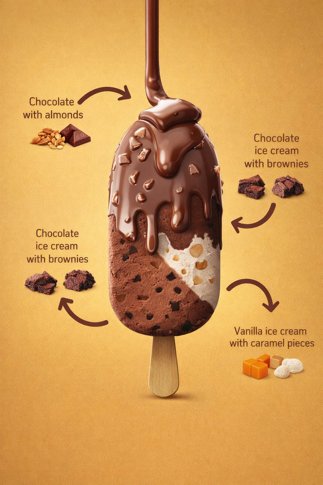</a> |

**프롬프트:**

```
{
  "resolution": "8K",
  "aspect_ratio": "3:4",
  "image_type": "photorealistic commercial product render",
  "scene_description": {
    "main_subject": "A vertically centered ice cream bar mounted on a wooden stick",
    "orientation": "upright, front-facing, slightly elevated perspective",
    "composition": "single product centered with surrounding ingredient labels and curved arrows"
  },
  "background": {
    "color": "warm golden-yellow gradient",
    "texture": "smooth, matte, evenly illuminated",
    "lighting_falloff": "subtle vignette, darker towards edges"
  },
  "lighting": {
    "type": "studio lighting",
    "key_light": "soft frontal light emphasizing chocolate gloss",
    "fill_light": "balanced fill preserving texture detail",
    "specular_highlights": "visible on melted chocolate coating",
    "shadows": "soft shadow beneath the stick"
  },
  "ice_cream_bar": {
    "shape": "rounded rectangular bar",
    "surface": "smooth with visible embedded inclusions",
    "layers": [
      {
        "type": "outer coating",
        "description": "rich milk chocolate shell",
        "color": "medium brown",
        "texture": "slightly glossy with soft melting highlights"
      },
      {
        "type": "main body",
        "description": "vanilla ice cream",
        "color": "warm off-white",
        "texture": "dense and creamy"
      }
    ],
    "inclusions": [
      "small almond chunks visible through the chocolate coating",
      "tiny vanilla flecks visible in the ice cream interior"
    ],
    "stick": {
      "material": "light natural wood",
      "position": "centered below bar"
    }
  },
  "ingredient_callouts": {
    "style": "clean commercial infographic labels with thin curved arrows pointing to exact areas of the product",
    "labels": [
      {
        "text": "milk chocolate shell",
        "position": "upper right"
      },
      {
        "text": "vanilla ice cream",
        "position": "left middle"
      },
      {
        "text": "almond pieces",
        "position": "lower right"
      }
    ]
  },
  "branding_style": {
    "overall_look": "premium supermarket frozen dessert advertisement",
    "design_language": "clean, appetizing, modern, minimal clutter"
  },
  "camera": {
    "angle": "front-facing with slight downward product perspective",
    "focus": "sharp across entire product and labels",
    "framing": "centered vertical composition"
  }
}
```

## 📣 광고 크리에이티브 사례

> **엄선된 사례 26개** — [모든 광고 크리에이티브 프롬프트 보기 →](cases/ad-creative.md)

<!-- Case 176: Luxury Chronograph Watch Ad (by @AlwaveNazca) -->
### Case 176: [Luxury Chronograph Watch Ad](https://x.com/AlwaveNazca/status/2048147643809865950) (by [@AlwaveNazca](https://x.com/AlwaveNazca))

|                                                                                                                                                                                               Output                                                                                                                                                                                              |
| :-----------------------------------------------------------------------------------------------------------------------------------------------------------------------------------------------------------------------------------------------------------------------------------------------------------------------------------------------------------------------------------------------: |
| <a href="https://evolink.ai/gpt-image-2-prompts?utm_source=github&utm_medium=picture&utm_campaign=awesome-gpt-image-2-API-and-Prompts" target="_blank" rel="noopener noreferrer"></a> |

**Prompt:**

```
A dramatic luxury product advertising image for a motorsport-inspired chronograph wristwatch in a dark studio. Center-left foreground, show a single stainless steel chronograph watch standing upright at a slight three-quarter angle, with a black dial, two red-accent subdials, slim silver hour markers, a tachymeter bezel, and visible crown and pushers on the right side. The watch has a black leather strap with bold red stitching along both edges and a sporty premium finish. To the right of the watch, place one black square presentation box slightly behind it, textured like leather, with red stitching around the lid and a silver embossed eye-shaped logo above the text "NESS STUDIO" and smaller red text "TRACK SURFACE." At the top center of the composition, add the same silver eye logo with the words "NESS STUDIO" and smaller "BY NICOLAS." Across the background, place one oversized blurred word, {argument name="headline text" default="PRECISION"}, in large gray capital letters spanning nearly the full width. The scene is set against a deep black background with cinematic red and white horizontal light streaks crossing behind the products from left to right, suggesting speed and racetrack energy. Use a glossy wet ground plane with reflective texture, catching red highlights and mirrorlike reflections beneath the watch and box. At the bottom center, add the text "CHRONOGRAPH SERIES" in clean white spaced capitals with thin red horizontal lines extending on both sides, and below it smaller red capitals reading {argument name="tagline text" default="ALSACE MADE"}. Color palette: black, charcoal gray, silver steel, vivid racing red, and a touch of white. Lighting should be high-contrast and premium, with crisp specular highlights on the metal case, subtle soft fill on the box, and moody shadows. Overall style: ultra-polished commercial product photography, luxury watch campaign, sharp focus on the products, sleek branding, high-end automotive aesthetic.
```

<!-- Case 176: Luxury chocolate campaign system (by @SPEEDAI07) -->
### Case 176: [Luxury chocolate campaign system](https://x.com/SPEEDAI07/status/2049459155086500321) (by [@SPEEDAI07](https://x.com/SPEEDAI07))

|                                                                                                                                                                                                 Output                                                                                                                                                                                                 |
| :----------------------------------------------------------------------------------------------------------------------------------------------------------------------------------------------------------------------------------------------------------------------------------------------------------------------------------------------------------------------------------------------------: |
| <a href="https://evolink.ai/gpt-image-2-prompts?utm_source=github&utm_medium=picture&utm_campaign=awesome-gpt-image-2-API-and-Prompts" target="_blank" rel="noopener noreferrer"></a> |

**Prompt:**

```
Create a premium, square (1:1) product advertisement for a fictional luxury chocolate brand called Noirvelle Chocolat, inspired by high-end chocolate brands. The ad should feel like a high-end editorial campaign, combining luxury food photography, refined packaging design, and cinematic lighting. Use matte black wrapper, subtle gold foil, elegant serif typography, and realistic product rendering. Generate flavor variants such as Blood Orange Noir, Salted Pistachio Muse, and Raspberry Ember with distinct mood, color palette, ingredients, headline, and supporting copy. Keep the chocolate bar as hero centerpiece with subtle reflections, shallow depth of field, luxury minimalism, and a small CTA: "Shop the drop."
```

<!-- Case 176: Surreal Brand World Poster (by @SaasJunctionHQ) -->
### Case 176: [Surreal Brand World Poster](https://x.com/SaasJunctionHQ/status/2050644926023844149) (by [@SaasJunctionHQ](https://x.com/SaasJunctionHQ))

|                                                                                                                                                                                            Output                                                                                                                                                                                            |
| :------------------------------------------------------------------------------------------------------------------------------------------------------------------------------------------------------------------------------------------------------------------------------------------------------------------------------------------------------------------------------------------: |
| <a href="https://evolink.ai/gpt-image-2-prompts?utm_source=github&utm_medium=picture&utm_campaign=awesome-gpt-image-2-API-and-Prompts" target="_blank" rel="noopener noreferrer"></a> |

**Prompt:**

```
A hyper-detailed surreal advertising poster for [BRAND NAME].

BACKGROUND: A large deep-toned rounded rectangle in [BRAND NAME]'s signature brand color fills 90% of the frame. Behind the subject, massive cropped brand typography bleeds off-frame, letters constructed from the brand's core material texture, embossed and lit with sharp directional rim lighting. Subtle noise grain texture overlays the background.

SUBJECT: Use the uploaded reference image. Preserve the subject's exact face and skin tone from the reference. The person faces camera in a three-quarter foreground stance, holding the brand's most iconic product directly toward the lens.

EXPRESSION: Restyle the subject's facial expression to match [BRAND NAME]'s brand personality and emotional tone.

OUTFIT: Completely restyle the subject's clothing into a character that naturally belongs to [BRAND NAME]'s universe. Use [BRAND NAME]'s exact brand palette and add small branded details.

SURREAL PRODUCT MOMENT: The product held by the subject opens, spills, or expands into a self-contained miniature world tied to [BRAND NAME]'s identity and values.

GRAPHIC LAYER: Scattered sparkle glyphs, floating micro-elements, layered soft fog, and subtle chromatic aberration at frame edges.

TEXT SYSTEM:
- TOP: Rounded pill badge, "[BRAND NAME]"
- CENTER-LEFT: Brand tagline in bold condensed uppercase
- BOTTOM STRIP: Four feature tags in a row

QUALITY: Unreal Engine render quality, octane lighting, macro lens bokeh on background elements, 8K sharp foreground.
```

<!-- Case 176: Luxury Fragrance Campaign Portrait (by @amynys) -->

### Case 176: [Luxury Fragrance Campaign Portrait](https://x.com/amynys/status/2054340951678587051) (by [@amynys](https://x.com/amynys))

|                                                                                                                                                                                                     Output                                                                                                                                                                                                    |
| :-----------------------------------------------------------------------------------------------------------------------------------------------------------------------------------------------------------------------------------------------------------------------------------------------------------------------------------------------------------------------------------------------------------: |
| <a href="https://evolink.ai/gpt-image-2-prompts?utm_source=github&utm_medium=picture&utm_campaign=awesome-gpt-image-2-API-and-Prompts" target="_blank" rel="noopener noreferrer"></a> |

**Prompt:**

```
Transform the uploaded portrait into a luxurious cinematic fragrance poster inspired by the dark seductive elegance of a high-fashion perfume campaign. Preserve her exact facial features, warm skin tone, confident expression, wavy brunette hair, and recognizable identity. Style her as a mysterious femme fatale with soft glossy lips, luminous skin, subtle smoky eyes, and an intense captivating gaze.

Dress her in a black satin slip dress with delicate lace trim and a glamorous faux fur wrap slipping off her shoulders. Place her inside a moody Parisian-inspired luxury interior with black reflective walls, gold rim lighting, deep shadows, cinematic contrast, and sensual ambient lighting. Add elegant reflections and depth for a premium editorial look.

Include a sleek black perfume bottle inspired by a luxury noir fragrance aesthetic near the foreground. Use refined minimalist typography in a luxury fashion-ad style with dramatic spacing and premium composition. Add a tagline such as: “She doesn’t follow. She leaves a trace.”

The overall mood should feel seductive, mysterious, powerful, feminine, cinematic, timeless, and ultra-luxurious — like a Chanel Coco Noir campaign directed by a Hollywood cinematographer. High detail, photorealistic skin texture, glossy highlights, rich blacks, warm gold accents, magazine-quality fashion photography, 8K luxury editorial finish.
```

<!-- Case 176: Berry Splash Cafe Campaign (by @iamaiistudio) -->

### Case 176: [Berry Splash Cafe Campaign](https://x.com/iamaiistudio/status/2054248552294158350) (by [@iamaiistudio](https://x.com/iamaiistudio))

|                                                                                                                                                                                                 Output                                                                                                                                                                                                |
| :---------------------------------------------------------------------------------------------------------------------------------------------------------------------------------------------------------------------------------------------------------------------------------------------------------------------------------------------------------------------------------------------------: |
| <a href="https://evolink.ai/gpt-image-2-prompts?utm_source=github&utm_medium=picture&utm_campaign=awesome-gpt-image-2-API-and-Prompts" target="_blank" rel="noopener noreferrer"></a> |

**Prompt:**

```
Prompt 1:
Create a vibrant lifestyle food ad set inside a colorful, trendy cafe. Show a smiling woman in a bright hot pink blazer seated at a wooden table, lifting a spoon as she eats an acai berry bowl topped with strawberries, blueberries, banana slices, and granola. Keep a clearly branded "Berry Loud" jar on the table. Add playful retro cream bubble-letter typography that reads "BERRY LOUD". Use a tropical cafe interior with hanging plants, warm natural sunlight, a cheerful mood, a bold pink-and-teal palette, shallow depth of field, cinematic food-photography realism, high detail, and a polished commercial campaign finish. Format: vertical 9:16. Quality: ultra realistic, 4k.

Prompt 2:
Create a dynamic food product advertisement for "Berry Loud" mixed berry blend. Feature an acai smoothie bowl overflowing with strawberries, raspberries, blueberries, blackberries, banana slices, and granola. Surround it with dramatic berry juice splashes and floating fruit frozen midair. Place a branded jar next to the bowl. Use a vivid hot pink background and large retro cream typography that says "NEW DROP BERRY LOUD". Keep the lighting glossy, the composition energetic, the colors vibrant, the textures ultra detailed, and the overall look like a polished studio-shot commercial poster with hyper-realistic food photography and splash-effect motion. Format: vertical 9:16. Quality: 4k.
```

<!-- Case 176: Fast Food Hero Poster (by @ShamsAmin56) -->

### Case 176: [Fast Food Hero Poster](https://x.com/ShamsAmin56/status/2054238324198625780) (by [@ShamsAmin56](https://x.com/ShamsAmin56))

|                                                                                                                                                                                              Output                                                                                                                                                                                              |
| :----------------------------------------------------------------------------------------------------------------------------------------------------------------------------------------------------------------------------------------------------------------------------------------------------------------------------------------------------------------------------------------------: |
| <a href="https://evolink.ai/gpt-image-2-prompts?utm_source=github&utm_medium=picture&utm_campaign=awesome-gpt-image-2-API-and-Prompts" target="_blank" rel="noopener noreferrer"></a> |

**Prompt:**

```
A cinematic 9:16 vertical composition featuring a gourmet "Smokey Obsidian" burger.
WHAT: A towering burger with a charcoal brioche bun, thick Wagyu beef patty with visible sear marks, melting aged gruyère dripping like lava, and crispy maple-glazed bacon.
FEEL: An atmosphere of "Urban Indulgence." Dark, moody lighting with a single warm amber spotlight. Wisps of real hickory smoke curl around the bun. The texture is hyper-realistic you can see the salt crystals on the crust and the moisture on the heirloom tomato.
SHOW: The burger is captured in a "deconstructed gravity" moment the top bun is slightly hovering, revealing the internal layers of house-made aioli and pickled red onions.
TYPOGRAPHY: Integration of ultra-bold, distressed sans-serif typeface overlapping the bottom third of the frame. The text reads "DEFY GRAVITY" in a raw, concrete-texture finish.
TECHNICAL: 4k resolution, macro photography style, shallow depth of field, neon-noir color grading (deep blacks, warm ambers, and subtle teal highlights).
```

<!-- Case 176: Matcha Granola Ad Poster (by @Sairah_0) -->

### Case 176: [Matcha Granola Ad Poster](https://x.com/Sairah_0/status/2054111354202779672) (by [@Sairah_0](https://x.com/Sairah_0))

|                                                                                                                                                                                                Output                                                                                                                                                                                               |
| :-------------------------------------------------------------------------------------------------------------------------------------------------------------------------------------------------------------------------------------------------------------------------------------------------------------------------------------------------------------------------------------------------: |
| <a href="https://evolink.ai/gpt-image-2-prompts?utm_source=github&utm_medium=picture&utm_campaign=awesome-gpt-image-2-API-and-Prompts" target="_blank" rel="noopener noreferrer"></a> |

**Prompt:**

```
(Matcha Granola Ad)

Ultra-realistic premium food advertisement poster for a healthy breakfast granola brand, centered matte pouch packaging labeled “Matcha Oat Granola”, green monochrome aesthetic, flat lay composition, soft studio lighting, vibrant matcha green background, surrounded by kiwi slices, almonds, oats, chia seeds, matcha powder bowl, granola bowls, scattered ingredients, clean modern typography headline “SUPERFOOD MORNING BOWL”, handwritten annotation arrows with wellness benefits, luxury organic branding, natural shadows, high-end commercial food photography, minimal yet detailed layout, symmetrical composition, sharp focus, Instagram ad style, 8k detail, healthy lifestyle marketing design.

Prompt : (Berry Yogurt Cereal Ad)

High-end commercial breakfast cereal advertisement, pastel pink aesthetic with centered standing pouch packaging labeled “Berry Yogurt Crunch Cereal”, surrounded by strawberries, blueberries, yogurt bowls, milk jug, crunchy granola, scattered berries and grains, soft natural lighting, vibrant fresh mood, modern bold typography headline “START FRESH EVERY MORNING”, handwritten callout arrows and benefit text, realistic food textures, luxury supermarket packaging design, clean flat lay composition, soft shadows, premium branding, glossy vibrant colors, ultra-detailed food photography, Instagram/Facebook ad campaign style, healthy breakfast concept, 8k realistic render.

Prompt : (Chocolate Protein Muesli Ad)

Premium protein breakfast food advertisement poster featuring centered pouch package labeled “Chocolate Protein Muesli”, rich brown monochrome theme, surrounded by dark chocolate chunks, almonds, oats, banana slices, milk jug, muesli bowls, scattered ingredients, dramatic warm studio lighting, bold modern headline typography “HIGH PROTEIN BREAKFAST FUEL”, handwritten annotation arrows highlighting benefits, luxury fitness breakfast branding, realistic textures, symmetrical flat lay composition, high-end commercial food photography, strong contrast, healthy energy concept, clean packaging mockup design, ultra-realistic 8k advertising render, cinematic food styling.
```

<!-- Case 176: Tropical Product Ad Poster (by @AIwithAliya) -->

### Case 176: [Tropical Product Ad Poster](https://x.com/AIwithAliya/status/2054553101236080714) (by [@AIwithAliya](https://x.com/AIwithAliya))

|                                                                                                                                                                                                 Output                                                                                                                                                                                                |
| :---------------------------------------------------------------------------------------------------------------------------------------------------------------------------------------------------------------------------------------------------------------------------------------------------------------------------------------------------------------------------------------------------: |
| <a href="https://evolink.ai/gpt-image-2-prompts?utm_source=github&utm_medium=picture&utm_campaign=awesome-gpt-image-2-API-and-Prompts" target="_blank" rel="noopener noreferrer"></a> |

**Prompt:**

```
GPT Image 2 Prompt Create a creative commercial advertising poster for [PRODUCT NAME], a [PRODUCT TYPE], inspired by vibrant tropical product campaigns. Place the product as a large hero object on the center-right with realistic glossy reflections, sharp label details, and premium lighting. Add a stylish model sitting beside or slightly in front of the product, naturally interacting with it by [MODEL ACTION]. The model should look [MOOD], wearing [OUTFIT STYLE], and should not cover the product label.
```

👉 **모든 광고 크리에이티브 프롬프트 사례 보기 →**

<!-- Case 176: Foam Clogs Ad Poster (by @Shinning1010) -->
### Case 176: [Foam Clogs Ad Poster](https://x.com/Shinning1010/status/2055688162333401470) (by [@Shinning1010](https://x.com/Shinning1010))

|                                                                                                                                                                                              Output                                                                                                                                                                                             |
| :---------------------------------------------------------------------------------------------------------------------------------------------------------------------------------------------------------------------------------------------------------------------------------------------------------------------------------------------------------------------------------------------: |
| <a href="https://evolink.ai/gpt-image-2-prompts?utm_source=github&utm_medium=picture&utm_campaign=awesome-gpt-image-2-API-and-Prompts" target="_blank" rel="noopener noreferrer"></a> |

**Prompt:**

```
Create a premium vertical 4:5 commercial advertising poster for perforated foam clogs, making the shoes visually central, clean, and instantly legible. Use the uploaded portrait photo only for the woman’s appearance and hairstyle so the final result keeps a similar identity. Preserve face shape, facial features, hairstyle, skin tone, body proportion, and overall temperament only; do not copy the original expression, clothing, background, lighting, or pose. Style her in refined modern summer campaign wardrobe with effortless premium casual energy. Composition: a confident lifestyle fashion portrait with the woman seated or stepping forward in an airy sunlit architectural setting, the clogs clearly visible in the foreground and on-foot, showing their rounded shape, ventilation holes, heel strap, soft matte foam texture, and lightweight comfort. Atmosphere: elevated urban resort, fresh air, clean shadows, soft natural daylight, polished commercial photography, subtle water or glass reflections, crisp product detail, realistic skin texture, premium but approachable. Poster headline: “STEP INTO AIR”. Subtitle: “Lightweight comfort for every city moment.” Use clean modern typography with generous spacing, placed in reserved negative space without covering the face or shoes. No watermark.

Negative Prompt:
watermark, random text, misspelled headline, garbled letters, logo distortion, low quality, blurry, plastic skin, extra fingers, deformed hands, bad anatomy, overexposed highlights, unrealistic lighting, oversmoothed skin, cheap e-commerce look, AI-generated look, warped clog holes, incorrect shoe structure, melted foam texture, distorted heel strap, mismatched pair, hidden product, product cropped out, cluttered background
```

<!-- Case 176: Energy Drink Stadium Ad (by @Shorelyn_) -->
### Case 176: [Energy Drink Stadium Ad](https://x.com/Shorelyn_/status/2055570197973799376) (by [@Shorelyn_](https://x.com/Shorelyn_))

|                                                                                                                                                                                               Output                                                                                                                                                                                               |
| :------------------------------------------------------------------------------------------------------------------------------------------------------------------------------------------------------------------------------------------------------------------------------------------------------------------------------------------------------------------------------------------------: |
| <a href="https://evolink.ai/gpt-image-2-prompts?utm_source=github&utm_medium=picture&utm_campaign=awesome-gpt-image-2-API-and-Prompts" target="_blank" rel="noopener noreferrer"></a> |

**Prompt:**

```
Ultra realistic premium product advertising shot of a sleek aluminum energy drink can standing upright on a wet reflective surface inside a futuristic football stadium at night. The can design features vivid swirling rainbow brushstroke patterns in red, orange, yellow, green, and blue wrapping around the entire can, with a large glossy black and white soccer ball graphic in the center. Bold white distressed typography on the front reads “GOAL” with smaller clean modern text below saying “ENERGY DRINK”. Tiny premium icon details for energy, focus, and endurance near the bottom, along with “250 ml”.

The can is covered in realistic cold water droplets and condensation, highly detailed metallic texture, cinematic reflections, ultra sharp focus, luxury beverage commercial aesthetic, professional studio lighting.

Background filled with explosive colorful powder smoke clouds in blue, red, orange, green, and yellow bursting dramatically behind the can, combined with glowing football stadium floodlights, floating particles, water splashes, sparks, mist, and bokeh light effects. Dark moody environment with intense contrast and neon glow atmosphere.

Composition centered and symmetrical, low angle hero shot, shallow depth of field, hyper realistic, cinematic color grading, ultra detailed advertising photography, sports branding campaign aesthetic, IMAX quality, 8k resolution, volumetric lighting, premium commercial product render, high energy dynamic mood.
```

<!-- Case 183: Showroom Still Life Merch Drop (by @iamaiistudio) -->
### Case 183: [Showroom Still Life Merch Drop](https://x.com/iamaiistudio/status/2062279671618957656) (by [@iamaiistudio](https://x.com/iamaiistudio))

| Output |
| :----: |
| <a href="https://evolink.ai/gpt-image-2-prompts?utm_source=github&utm_medium=picture&utm_campaign=awesome-gpt-image-2-API-and-Prompts" target="_blank" rel="noopener noreferrer"></a> |

**Prompt:**

```
[BRAND NAME]. You are a Creative Director and Still Life Photographer for a high-fashion hypebeast magazine.

YOUR TASK:
Design a premium "Showroom Still Life" image to announce a limited merch drop for [BRAND NAME].

STEP 1: BRAND ANALYSIS
Study [BRAND NAME]: identify its industry and signature physical product (e.g., "Spalding" = basketballs, "McDonald's" = burger packaging, "Visa" = metal cards).
Choose the Color Palette:
- Background: a deep, rich, textured tone from the brand's secondary colors (Teal, Navy, Burgundy, or Slate Grey).
- Merch: a warm or neutral accent tone (Camel, Orange, or Cream) that pops against the backdrop.
- Apparel Piece: select something that fits the brand's energy (Varsity Letterman Jacket, Heavyweight Hoodie, Canvas Tote, or Wool Scarf).

STEP 2: SET DESIGN
Main Prop: a clean, modern White Powder-Coated Metal Rack or shelving unit.
Layout:
- The apparel piece hangs casually from the rack or a hanger, showing off its texture.
- On the rack shelves, stack several units of the brand's core product (e.g., basketballs, cans, boxes).
- Backdrop: hand-painted canvas in the chosen deep background color, with visible brushstrokes for that studio aesthetic.

STEP 3: BRANDING DETAILS
Apparel: feature premium physical branding via Chenille Patches, Embroidered Logos, or Screen Print on the sleeve or back. It should look like a genuinely expensive garment.
Products: ensure the [BRAND NAME] logo is clearly visible on all stacked items.

STEP 4: PHOTOGRAPHY
Lighting: soft, directional side window light with realistic soft shadows and rich texture highlights.
Focal length: 50mm or 85mm. Sharp focus on the merch, gentle background falloff.

STEP 5: GRAPHIC OVERLAY
Left-aligned composition:
- Large, clean white [BRAND NAME] logo placed in the negative space on the left.
- Beneath the logo, small white text with the brand's official tagline.
```


<!-- Case 184: Adidas Futuristic Drop Ad Poster 9:16 (by @iamaiistudio) -->
### Case 184: [Adidas Futuristic Drop Ad Poster 9:16](https://x.com/iamaiistudio/status/2065133774413906004) (by [@iamaiistudio](https://x.com/iamaiistudio))

| Output |
| :----: |
| <a href="https://evolink.ai/gpt-image-2-prompts?utm_source=github&utm_medium=picture&utm_campaign=awesome-gpt-image-2-API-and-Prompts" target="_blank" rel="noopener noreferrer"></a> |

**Prompt:**

```
Full prompt:

Design a striking premium vertical advertising poster (9:16 format) for a fictional ultra-limited Adidas sneaker called "ADIDAS AEROBLADE X - LIMITED DROP". The creative direction should feel like a world-class agency campaign — original, futuristic, visually explosive.

Main visual:
A single hero sneaker floating center-frame, captured at a dramatic low angle as if levitating above a dark obsidian running track split by glowing energy cracks. The shoe combines knit mesh, sculpted foam, translucent panels, reflective stripes, and a carbon-fiber sole plate. Neon light trails swirl around it like captured speed. Particles and mist add motion and intensity. Background features faint silhouettes of elite sprinters frozen mid-dash, blurred enough to keep focus on the shoe.

Color palette:
Matte black, electric red, silver, deep charcoal, with subtle neon blue highlights.

Typography and copy (sharp, clean, strong visual hierarchy):
Main headline: "OWN THE SPEED"
Product title: "ADIDAS AEROBLADE X"
Subheadline: "Built for the ones who never run ordinary."
Feature callouts in elegant boxed layout:
- "Featherlight Adaptive Knit Upper"
- "Carbon Energy Return Plate"
- "Precision Grip Traction"
- "Limited Collector Release"
Price: "$280"
Primary CTA: "DROP LIVE NOW"
Secondary CTA: "Only at
Footer text: "Performance innovation meets futuristic street identity."

Layout:
Bold oversized headline partially integrated into background. Product name near shoe in refined premium placement. Feature callouts stacked vertically along one side. Add a "LIMITED SERIES" badge. The composition blends luxury sports campaign with futuristic editorial design.

Style: Ultra-detailed hyper-realistic product photography, cinematic studio lighting, premium advertising aesthetics, sharp focus, rich textures, subtle atmosphere, dynamic motion energy, high-end commercial poster feel. Aspect ratio 9:16.

#AIart #GPTImage2
```

<!-- Case 185: Luxury Linen Texture Editorial Poster (by @ZephyraLeigh) -->
### Case 185: [Luxury Linen Texture Editorial Poster](https://x.com/ZephyraLeigh/status/2065123985713700925) (by [@ZephyraLeigh](https://x.com/ZephyraLeigh))

<table>
<tr><td width="50%"><a href="https://evolink.ai/gpt-image-2-prompts?utm_source=github&utm_medium=picture&utm_campaign=awesome-gpt-image-2-API-and-Prompts" target="_blank" rel="noopener noreferrer"></a></td><td width="50%"><a href="https://evolink.ai/gpt-image-2-prompts?utm_source=github&utm_medium=picture&utm_campaign=awesome-gpt-image-2-API-and-Prompts" target="_blank" rel="noopener noreferrer"></a></td></tr>
</table>

**Prompt:**

```
GPT Image 2 on ChatGPT 🪄

PROMPT ⬇

A photorealistic luxury editorial poster, 3:4 portrait ratio. Full frame covered in premium off-white Italian linen paper wall texture — warm ivory tone, subtle grain, ultra-tactile surface. Center of wall features a large precision-carved football-shaped archway with deep architectural relief — visible carved edges, realistic inner shadow depth, sculptural beveled detailing, premium craftsmanship aesthetic.
Inside the carved football frame: cinematic stadium atmosphere — deep blue and white luxury smoke trails drifting elegantly, gold and silver championship confetti cascading, white orchid and rose floral arrangements with dark green foliage accents, premium celebration balloons in royal blue and pearl white, championship trophy silhouettes subtly embedded in background haze. Atmosphere: elite sports gala, UEFA Champions League victory night energy.

Subject: Cristiano Ronaldo, full figure, standing powerfully inside the carved frame. Wearing Portugal's premium crimson and green national kit — authentic jersey fabric with realistic textile folds, fitted athletic shorts, premium Adidas/Nike high-performance football boots. Iconic athletic build — broad shoulders, defined physique, elite footballer anatomy. Signature confident expression — sharp jaw, focused dark eyes, short textured dark hair, photorealistic skin texture with natural pore detail.

Championship celebration pose — chest slightly forward, chin raised, one hand slightly relaxed, football resting precisely at his right boot.

3D Breakout Effect: Face, right shoulder, right arm below elbow, and right football boot extend realistically beyond the carved frame boundary onto the wall surface — casting soft natural drop shadows onto the paper texture. Depth of field creates believable dimensional layering.
Lighting: Premium stadium tungsten lighting blended with warm golden-hour cinematic sunlight entering from the upper left. Soft white rim light wrapping around shoulders and jawline. Subtle fill light on the wall from the right. No harsh overexposure, no fake neon — only warm, editorial luxury light grading.

Wall Typography — Clean Minimalist Luxury Layout:

CRISTIANO RONALDO — large, bold, high-end serif font (Didot or Bodoni style), embossed gold foil effect, positioned above the carved frame

CHAPTER 41 — medium weight elegant tracking, warm bronze metallic tone, centered below the name

365 MORE DAYS OF GREATNESS — refined thin uppercase sans-serif, spaced wide, cream-gold color, placed below Chapter line
Technical: Ultra-photorealistic rendering, 8K detail sharpness, professional commercial sports photography quality, luxury magazine cover art direction, natural color grading — warm ivory + deep blue + gold palette, authentic shadow physics, zero AI artifacts, correct human anatomy, no extra limbs, no tree shadows, no distorted proportions, award-winning editorial masterpiece quality.
```

<!-- Case 186: Luxury Watch Dramatic Beam Product Shot (by @meng_dagg695) -->
### Case 186: [Luxury Watch Dramatic Beam Product Shot](https://x.com/meng_dagg695/status/2065078841765458040) (by [@meng_dagg695](https://x.com/meng_dagg695))

| Output |
| :----: |
| <a href="https://evolink.ai/gpt-image-2-prompts?utm_source=github&utm_medium=picture&utm_campaign=awesome-gpt-image-2-API-and-Prompts" target="_blank" rel="noopener noreferrer"></a> |

**Prompt:**

```
A luxury watch emerges from darkness. Extreme macro shot of ticking gears and moving hands. Golden sparks and floating particles surround the watch. The camera circles the timepiece while dramatic light streaks reflect across the sapphire crystal. Slow-motion water splash freezes in midair around the watch. Mechanical components assemble themselves automatically. Cinematic black-and-gold environment, premium commercial lighting, ultra-realistic reflections, luxury lifestyle advertisement, powerful orchestral atmosphere, smooth camera motion, product hero shot, brand reveal, Hollywood-level commercial, 8K photorealism.
```

<!-- Case 187: 可口可乐百事雪碧品牌 KV 对比 (by @liyue_ai) -->
### Case 187: [可口可乐百事雪碧品牌 KV 对比](https://x.com/liyue_ai/status/2065039304175538382) (by [@liyue_ai](https://x.com/liyue_ai))

<table>
<tr><td width="50%"><a href="https://evolink.ai/gpt-image-2-prompts?utm_source=github&utm_medium=picture&utm_campaign=awesome-gpt-image-2-API-and-Prompts" target="_blank" rel="noopener noreferrer"></a></td><td width="50%"><a href="https://evolink.ai/gpt-image-2-prompts?utm_source=github&utm_medium=picture&utm_campaign=awesome-gpt-image-2-API-and-Prompts" target="_blank" rel="noopener noreferrer"></a></td></tr>
<tr><td width="50%"><a href="https://evolink.ai/gpt-image-2-prompts?utm_source=github&utm_medium=picture&utm_campaign=awesome-gpt-image-2-API-and-Prompts" target="_blank" rel="noopener noreferrer"></a></td></tr>
</table>

**Prompt:**

```
品牌 KV 海报系列。使用统一提示词框架，针对不同饮料品牌调整视觉情绪色彩：可口可乐 → 热烈红色聚会感；百事可乐 → 年轻蓝色潮流感；雪碧 → 清爽绿色柠檬感。同一结构展现不同品牌 DNA。3 张对比输出。
```


<!-- Case 188: Luxury Sneaker Editorial Grid (by @iamaiistudio) -->
### Case 188: [럭셔리 스니커즈 에디토리얼 그리드](https://x.com/iamaiistudio/status/2065964253505585436) (by [@iamaiistudio](https://x.com/iamaiistudio))

| Output |
| :----: |
| <a href="https://evolink.ai/gpt-image-2-prompts?utm_source=github&utm_medium=picture&utm_campaign=awesome-gpt-image-2-API-and-Prompts" target="_blank" rel="noopener noreferrer"></a> |

**Prompt:**

```
Louis Vuitton luxury leather sneaker campaign. High-fashion editorial, avant-garde aesthetic. Aspect ratio 3:4.

Materials: Full-grain calf leather, Monogram Embossed Canvas, Polished Gold Hardware.
Color palette: Cognac Brown, Deep Obsidian, Champagne Gold.
Lighting: High-contrast Chiaroscuro with soft-box key lighting.

9-cell editorial grid:

Row 1, Heritage:
- Hero side-profile: sneaker resting on a vintage LV trunk, side-lit to reveal the leather grain texture.
- Extreme macro close-up: gold-tone "LV" lace aglets and precision stitching detail.
- Dynamic shot: gold dust particles swirling around the sole as the shoe steps into frame.

Row 2, Innovation:
- Minimalist: sneaker balanced on top of an abstract, floating glass "V" sculpture.
- Floating deconstructed view: sole and upper suspended in a void.
- Sensory: a gloved hand adjusting the tongue, highlighting the softness of the leather.

Row 3, Surrealism:
- Monochromatic scene in LV Havane brown with liquid silk drapes.
- Abstract: rubber sole pattern reimagined as a geometric desert landscape.
- Fusion: sneaker walking on a mirror-still lake reflecting a Parisian sunset skyline.
```


<!-- Case 189: Wireless Earbuds Lifestyle Ad (by @iamaiistudio) -->
### Case 189: [무선 이어버드 라이프스타일 광고](https://x.com/iamaiistudio/status/2065753093283991651) (by [@iamaiistudio](https://x.com/iamaiistudio))

| Output |
| :----: |
| <a href="https://evolink.ai/gpt-image-2-prompts?utm_source=github&utm_medium=picture&utm_campaign=awesome-gpt-image-2-API-and-Prompts" target="_blank" rel="noopener noreferrer"></a> |

**Prompt:**

```
Design a 9:16 vertical product infographic for Bolt True Wireless Earbuds with a high-end lifestyle ad feel.
Composition & Framing
Full-body shot of a young woman whose face, skin tone, and hairstyle match the reference photo exactly
Slightly low camera angle close to the subject, fashion campaign style, for depth and visual presence
She's seated casually on the floor, one knee up, one leg stretched toward the camera
Foreground (Product)
She holds an open Bolt earbud charging case out toward the viewer
One earbud is visible inside the case, the other is in her ear
The case is glossy white with "BOLT" branding
Slight macro bokeh blur on the hand and case for cinematic depth
Outfit & Style
Modern athleisure streetwear: off-white or neutral lightweight jacket, crop top or sports bra, soft pink joggers, textured white sneakers
Expression: confident and relaxed, subtle smile
Pose feels natural and lifestyle-driven, not posed
Background
Soft gray gradient studio background
Rainbow prism lens flares and subtle light leaks
Floating blurred earbuds and case in background
Studio floor texture visible underfoot
Lighting
Diffused commercial studio lighting emphasizing skin texture, the glossy case, and fabric detail
Soft rim light to separate the subject from the background
Text Overlays (modern sans-serif, white)
Top Center: "BOLT" in large bold text, partially behind the subject
Top Right: Bolt Earbuds / True Wireless
Mid Left: Powerful sound. / Effortless vibes. / Engineered for every beat of your day.
Mid Right: 30 hours of playtime / IPX5 water resistant
Bottom Right: 1 year warranty
Quality
8K ultra-realistic commercial photography
Sharp on face and earbuds, gentle depth blur on foreground and background
Clean Apple/Nike premium ad aesthetic, strong negative space
```

<!-- Case 190: Kinder Joy 스윙 체어 장면 (by @iamaiistudio) -->
### Case 190: [Kinder Joy 스윙 체어 장면](https://x.com/iamaiistudio/status/2066312771978092587) (by [@iamaiistudio](https://x.com/iamaiistudio))

| Output |
| :----: |
| <a href="https://evolink.ai/gpt-image-2-prompts?utm_source=github&utm_medium=picture&utm_campaign=awesome-gpt-image-2-API-and-Prompts" target="_blank" rel="noopener noreferrer"></a> |

**제출 가이드라인:**

```
Hyper-realistic 8k medium shot photograph with shallow depth of field, surreal indoor scene with cinematic lighting. A normal-sized woman sits cross-legged inside a massive, highly detailed Kinder Joy egg that's been converted into a swing chair. The egg is split open, its white interior forming the seat and orange textured exterior visible, suspended by dark metal chains from a curved metal stand.

She wears a black t-shirt and blue-and-white plaid pajama pants, holding a small white teacup with both hands, gazing directly at the viewer with a calm, relaxed expression. Use uploaded face as reference.

On a polished wooden table to the left foreground: another gigantic fully wrapped Kinder Joy egg with intricate foil texture and branding details. To the right of the swing base: a vintage-style wooden radio with white dials, and a tiny bonsai tree in a small pot.

Soft warm directional lighting from the left casts subtle shadows, highlighting the detailed egg wrapper textures, clothing, and wooden surface. Background is a softly blurred warm-toned interior wall with pleasing bokeh. Standard lens, shot from mid-height.
```

<!-- Case 191: 인비저블 실드 선스크린 광고 (by @iamrealsnow) -->
### Case 191: [인비저블 실드 선스크린 광고](https://x.com/iamrealsnow/status/2066200217347854445) (by [@iamrealsnow](https://x.com/iamrealsnow))

<table>
<tr><td width="50%"><a href="https://evolink.ai/gpt-image-2-prompts?utm_source=github&utm_medium=picture&utm_campaign=awesome-gpt-image-2-API-and-Prompts" target="_blank" rel="noopener noreferrer"></a></td><td width="50%"><a href="https://evolink.ai/gpt-image-2-prompts?utm_source=github&utm_medium=picture&utm_campaign=awesome-gpt-image-2-API-and-Prompts" target="_blank" rel="noopener noreferrer"></a></td></tr>
</table>

**제출 가이드라인:**

```
SUNSCREEN AD, “THE INVISIBLE SHIELD”

Luxury skincare advertising masterpiece, a colossal premium sunscreen bottle standing on a pristine tropical shoreline at golden hour, powerful beams of sunlight crashing down from the sky and splitting apart upon contact with a transparent protective energy dome radiating from the sunscreen, millions of sparkling UV particles dissolving into golden dust before reaching flawless skin, crystal clear ocean reflections, flowing water suspended in mid air around the product, microscopic droplets catching cinematic sunlight, ultra realistic textures revealing every detail of the bottle surface, luxury beauty campaign aesthetics, dramatic volumetric lighting, glowing atmospheric haze, premium white and gold color palette, futuristic protection technology visualized as elegant light waves, hyper detailed environment, commercial photography perfection, award winning advertising design, photorealistic rendering, 16K ultra resolution, global skincare brand campaign, masterpiece quality.

Text Overlay:
SUNSCREEN

Tagline:
“Protect Every Ray. Reveal Every Glow.
```

<!-- Case 192: 숨은 로고 풍경 착시 (by @iamaiistudio) -->
### Case 192: [숨은 로고 풍경 착시](https://x.com/iamaiistudio/status/2066191259354689714) (by [@iamaiistudio](https://x.com/iamaiistudio))

<table>
<tr><td width="50%"><a href="https://evolink.ai/gpt-image-2-prompts?utm_source=github&utm_medium=picture&utm_campaign=awesome-gpt-image-2-API-and-Prompts" target="_blank" rel="noopener noreferrer"></a></td><td width="50%"><a href="https://evolink.ai/gpt-image-2-prompts?utm_source=github&utm_medium=picture&utm_campaign=awesome-gpt-image-2-API-and-Prompts" target="_blank" rel="noopener noreferrer"></a></td></tr>
</table>

**제출 가이드라인:**

```
Create a subliminal advertising landscape photograph where a recognizable brand logo (like the Apple logo, Nike swoosh, or Batman symbol) is secretly embedded into a breathtaking natural environment (like snowy mountains, dense jungle, sand dunes, or ocean coastline).

The logo must be formed entirely by the physical geography of the terrain — NOT overlaid digitally. The main body of the logo appears as a carved void (a deep valley, cliff edge, or sharp color contrast in the terrain), while any disconnected elements (like Apple's leaf) float as a suspended island of rock and earth in the misty sky above.

Camera: wide aerial drone shot, landscape stretching vast and majestic across the frame.

Atmosphere: dramatic and moody — heavy swirling clouds, rolling mist through valleys, crepuscular god rays bursting through gaps in the clouds, defining the hidden silhouette.

Visual rule: at first glance it must look like a 100% authentic nature photo. The brand logo only emerges as an optical illusion (pareidolia) on second look. Edges must be slightly jagged and organic, shaped by real geological features like cliff faces and treelines — never perfect vector shapes.

Lighting: high contrast between dark shadowed valleys (dense forests) and bright snow or sunlit highlights. Sun partially hidden behind clouds or the floating landmass, backlighting the entire scene.

Mood: cinematic, majestic, subtly surreal.

Output: 1:1 square, photorealistic, National Geographic aerial photography aesthetic.
```

<!-- Case 193: SPLASH 리퀴드 로고 패션 포스터 (by @iamaiistudio) -->
### Case 193: [SPLASH 리퀴드 로고 패션 포스터](https://x.com/iamaiistudio/status/2065979523229975021) (by [@iamaiistudio](https://x.com/iamaiistudio))

| Output |
| :----: |
| <a href="https://evolink.ai/gpt-image-2-prompts?utm_source=github&utm_medium=picture&utm_campaign=awesome-gpt-image-2-API-and-Prompts" target="_blank" rel="noopener noreferrer"></a> |

**제출 가이드라인:**

```
Hyper-realistic fashion campaign poster for brand "SPLASH". A girl (matching the reference photo exactly, same face) seated confidently atop a gleaming, water-like 3D SPLASH logo surrounded by dynamic water splash effects. Editorial pose: one leg loose, one bent.

Enormous bold "SPLASH" typography fills the background, partially behind her. Small tagline reads: "Own Your Style."

Clothing: contemporary black streetwear (blazer, fitted top, trousers, sneakers).

Lighting: cinematic studio setup with soft key light and rim light, glossy reflections on the liquid logo.

Style: luxury fashion campaign aesthetic (Zara / H&M), polished clean environment.

Shot with an 85mm lens, shallow depth of field, 8K resolution, ultra-detailed, photorealistic.
```

<!-- Case 194: OBSIDIAN 커피 브랜드 캠페인 (by @iamaiistudio) -->
### Case 194: [OBSIDIAN 커피 브랜드 캠페인](https://x.com/iamaiistudio/status/2066523210808484228) (by [@iamaiistudio](https://x.com/iamaiistudio))

| 결과 |
| :----: |
| <a href="https://evolink.ai/gpt-image-2-prompts?utm_source=github&utm_medium=picture&utm_campaign=awesome-gpt-image-2-API-and-Prompts" target="_blank" rel="noopener noreferrer"></a> |

**프롬프트:**

```
Generate four cohesive high-end realistic editorial visuals for OBSIDIAN coffee brand. Cinematic, dark, mature aesthetic inspired by luxury sportswear and premium coffee advertising. Studio lighting that's dramatic yet controlled, photorealistic textures, clean compositional layout. Shot 1: Hero brand poster featuring 'OBSIDIAN' lettering with an artful coffee display — steam rising, beans scattered. Shot 2: Full product range — coffee bags, cans, and capsules arranged together. Shot 3: Tight packaging detail with tagline 'Coffee for grown-ups who chase flavor.' Shot 4: Lifestyle close-up of a steaming cup. Ultra-polished finish, crisp realistic materials, unified brand identity, no fantastical or surreal elements
```

<!-- Case 195: 코코넛 파라다이스 스킨케어 광고 (by @Strength04_X) -->
### Case 195: [코코넛 파라다이스 스킨케어 광고](https://x.com/Strength04_X/status/2067445760325734734) (by [@Strength04_X](https://x.com/Strength04_X))

| Output |
| :----: |
| <a href="https://evolink.ai/gpt-image-2-prompts?utm_source=github&utm_medium=picture&utm_campaign=awesome-gpt-image-2-API-and-Prompts" target="_blank" rel="noopener noreferrer"></a> |

**프롬프트:**

```
Minimal white bottle with golden pump surrounded by cracked coconuts, coconut milk splash and foam clouds, tropical luxury spa atmosphere, creamy textures, realistic bubbles floating in background, premium skincare commercial, soft warm lighting, ultra detailed 8K.
```

<!-- Case 196: 역조립 프로덕트 VFX (by @iamaiistudio) -->
### Case 196: [역조립 프로덕트 VFX](https://x.com/iamaiistudio/status/2067399156596175345) (by [@iamaiistudio](https://x.com/iamaiistudio))

<table>
<tr><td width="50%"><a href="https://evolink.ai/gpt-image-2-prompts?utm_source=github&utm_medium=picture&utm_campaign=awesome-gpt-image-2-API-and-Prompts" target="_blank" rel="noopener noreferrer"></a></td><td width="50%"><a href="https://evolink.ai/gpt-image-2-prompts?utm_source=github&utm_medium=picture&utm_campaign=awesome-gpt-image-2-API-and-Prompts" target="_blank" rel="noopener noreferrer"></a></td></tr>
<tr><td width="50%"><a href="https://evolink.ai/gpt-image-2-prompts?utm_source=github&utm_medium=picture&utm_campaign=awesome-gpt-image-2-API-and-Prompts" target="_blank" rel="noopener noreferrer"></a></td><td width="50%"><a href="https://evolink.ai/gpt-image-2-prompts?utm_source=github&utm_medium=picture&utm_campaign=awesome-gpt-image-2-API-and-Prompts" target="_blank" rel="noopener noreferrer"></a></td></tr>
</table>

**프롬프트:**

```
[PRODUCT] reassembling in midair from scattered pieces, reverse-disintegration effect, mechanical precision, each component suspended at a different depth, dark void background, high-concept product advertising, cinematic VFX.
```

<!-- Case 197: 포도 리빌 캔 제품 사진 (by @iamaiistudio) -->
### Case 197: [포도 리빌 캔 제품 사진](https://x.com/iamaiistudio/status/2067750180724855280) (by [@iamaiistudio](https://x.com/iamaiistudio))

| 결과 |
| :----: |
| <a href="https://evolink.ai/gpt-image-2-prompts?utm_source=github&utm_medium=picture&utm_campaign=awesome-gpt-image-2-API-and-Prompts" target="_blank" rel="noopener noreferrer">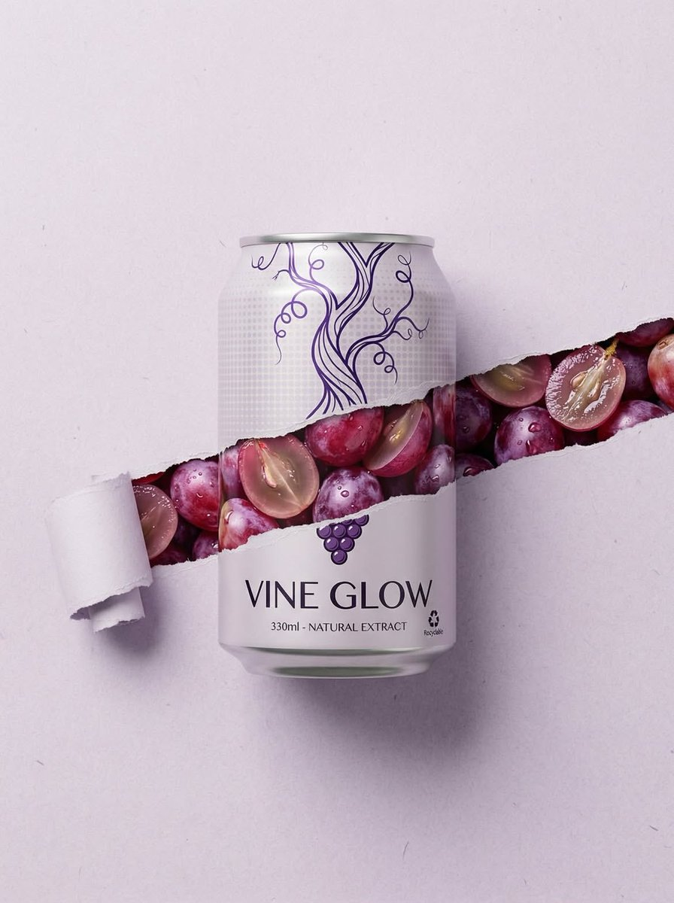</a> |

**프롬프트:**

```
Product shot of a 330ml aluminum can called "VINE GLOW – Natural Extract" placed center-frame against a clean light grey studio background. The can is adorned with refined purple vine line illustrations. A dramatic horizontal torn paper reveal slices across the can and background, exposing glistening red and purple grapes inside, covered in water droplets with a glossy wet texture. Soft studio lighting, ultra-sharp focus, photorealistic commercial packaging photography, symmetrical layout, 8K resolution.
```

## 🍌 인물 및 사진 사례

> **엄선된 사례 128개** — [모든 인물 프롬프트 보기 →](cases/portrait.md)

<!-- Case 124: Convenience Store Neon Portrait (by @BubbleBrain) -->
### Case 124: [Convenience Store Neon Portrait](https://x.com/BubbleBrain/status/2045167461147042202) (by [@BubbleBrain](https://x.com/BubbleBrain))

|                                                                                                                                                                                                 Output                                                                                                                                                                                                |
| :---------------------------------------------------------------------------------------------------------------------------------------------------------------------------------------------------------------------------------------------------------------------------------------------------------------------------------------------------------------------------------------------------: |
| <a href="https://evolink.ai/gpt-image-2-prompts?utm_source=github&utm_medium=picture&utm_campaign=awesome-gpt-image-2-API-and-Prompts" target="_blank" rel="noopener noreferrer"></a> |

**Prompt:**

```
35mm film photography with harsh convenience store fluorescent lighting mixed with colorful neon signs from outside, authentic film grain, high contrast, slight color cast, cinematic street editorial style, intimate medium shot, early 20s sexy Chinese female idol with ultra-realistic delicate refined Chinese features, seductive almond-shaped fox eyes with natural double eyelids, high nose bridge, small sharp V-shaped jawline, flawless porcelain skin with cool ivory undertone and visible specular highlights from fluorescent light, subtle skin texture and micro pores, natural dewy makeup with soft flush on cheeks, glossy natural pink lips slightly parted, subtle natural freckles across nose and cheeks, long dark brown hair in a messy high ponytail with many loose strands falling around face and neck, wearing an oversized white button-up shirt as the only top, unbuttoned at the top with deep cleavage and loosely tied at the waist, paired with a tiny black pleated mini skirt, barefoot in simple white slides, seductive casual leaning pose against the glass door of a 24-hour convenience store at late night, body slightly arched, one leg bent with foot resting against the door frame, the other leg straight, one hand holding a bottle of iced drink, the other hand lightly pulling the hem of her mini skirt, intensely seductive playful yet slightly vulnerable gaze straight at the viewer with soft doe eyes full of quiet temptation and teasing smile, bright cold fluorescent store light from inside mixed with pink and blue neon glow from outside signs, realistic reflections on glass door, blurred convenience store interior with shelves and snacks in background, authentic 35mm film color grading with harsh lighting and neon accents, extremely sharp yet soft skin rendering, natural hair strands, realistic fabric wrinkles and drape on the oversized shirt and mini skirt, no plastic skin, no digital over-sharpening, no airbrushing, no blemishes, no moles, no oily skin, no watermark, no text, authentic late-night convenience store atmosphere
```

<!-- Case 124: Ink-Etched Family Portrait (by @gdb) -->
### Case 124: [Ink-Etched Family Portrait](https://x.com/gdb/status/2048184698195870102) (by [@gdb](https://x.com/gdb))

|                                                                                                                                                                                               Output                                                                                                                                                                                              |
| :-----------------------------------------------------------------------------------------------------------------------------------------------------------------------------------------------------------------------------------------------------------------------------------------------------------------------------------------------------------------------------------------------: |
| <a href="https://evolink.ai/gpt-image-2-prompts?utm_source=github&utm_medium=picture&utm_campaign=awesome-gpt-image-2-API-and-Prompts" target="_blank" rel="noopener noreferrer"></a> |

**Prompt:**

```
A black-and-white hand-drawn family portrait in the style of detailed pen-and-ink crosshatching on textured white paper, showing 4 people seated closely together in a casual candid composition. On the left, an adult man in a dark baseball cap worn backward and a dark T-shirt leans into the frame, with a crossbody sling bag worn across his chest and visible zipper details. On the right, an adult woman with curly hair tied up in a loose high bun wears a light T-shirt with large collegiate block letters reading {argument name="shirt text" default="CITY"}. In the center are 2 young children sitting close together, both with short curly hair and matching light-colored T-shirts printed all over with strawberries. The child on the left leans inward with one arm crossing the other child, and the child on the right tilts their head slightly upward. The adults frame the children protectively, creating a warm family snapshot feeling. Render the whole image as a monochrome etched illustration with dense fine-line hatching, engraved shadows, crisp contour lines, and a realistic yet artistic likeness, with no color, no background setting beyond a plain light paper texture, and a vertical portrait crop.
```

<!-- Case 124: Chibi 3D Mini Me Photo Effect (by @miratechtool) -->
### Case 124: [Chibi 3D Mini Me Photo Effect](https://x.com/miratechtool/status/2051691169592033488) (by [@miratechtool](https://x.com/miratechtool))

|                                                                                                                                                                                                 Output                                                                                                                                                                                                |
| :---------------------------------------------------------------------------------------------------------------------------------------------------------------------------------------------------------------------------------------------------------------------------------------------------------------------------------------------------------------------------------------------------: |
| <a href="https://evolink.ai/gpt-image-2-prompts?utm_source=github&utm_medium=picture&utm_campaign=awesome-gpt-image-2-API-and-Prompts" target="_blank" rel="noopener noreferrer"></a> |

**Prompt:**

```
Mini "chibi 3D" versions of the same person appear around the original photo - sitting, climbing, playing, interacting with objects - with realistic shadows and depth. Keep base image unchanged. Add soft handwritten text: "Little versions of me... living my quiet moments." Include tiny props text like "You got this ♡". Cinematic, cozy, viral aesthetic.
```

<!-- Case 124: Wimbledon Broadcast Crowd Shot (by @Mavericks_Prod) -->

### Case 124: [Wimbledon Broadcast Crowd Shot](https://x.com/Mavericks_Prod/status/2054342640439566739) (by [@Mavericks_Prod](https://x.com/Mavericks_Prod))

|                                                                                                                                                                                                 Output                                                                                                                                                                                                 |
| :----------------------------------------------------------------------------------------------------------------------------------------------------------------------------------------------------------------------------------------------------------------------------------------------------------------------------------------------------------------------------------------------------: |
| <a href="https://evolink.ai/gpt-image-2-prompts?utm_source=github&utm_medium=picture&utm_campaign=awesome-gpt-image-2-API-and-Prompts" target="_blank" rel="noopener noreferrer"></a> |

**Prompt:**

```
A screenshot from a live Wimbledon TV broadcast during a packed Centre Court match. The camera cuts to the audience, an unbelievably attractive woman in her 20s with long black hair, flawless skin, elegant makeup, and a luxurious aura, seated in the VIP section wearing a sophisticated cream-white low-cut summer outfit with subtle jewelry. She smiles naturally while reacting to the match, unaware she's on camera. Wealthy spectators and champagne glasses around her, old-money tennis atmosphere, shallow depth of field. Full live tennis broadcast overlay: scoreboard, network watermark, broadcast graphics, 16:9 aspect ratio. The image looks exactly like a real TV screenshot, telephoto broadcast lens, realistic live color grading, slight compression artifacts, interlacing grain, subtle motion blur, imperfect live-camera framing.
```

<!-- Case 124: Rainy Street Golden Portrait (by @harboriis) -->

### Case 124: [Rainy Street Golden Portrait](https://x.com/harboriis/status/2054238941482733685) (by [@harboriis](https://x.com/harboriis))

|                                                                                                                                                                                                Output                                                                                                                                                                                                |
| :--------------------------------------------------------------------------------------------------------------------------------------------------------------------------------------------------------------------------------------------------------------------------------------------------------------------------------------------------------------------------------------------------: |
| <a href="https://evolink.ai/gpt-image-2-prompts?utm_source=github&utm_medium=picture&utm_campaign=awesome-gpt-image-2-API-and-Prompts" target="_blank" rel="noopener noreferrer"></a> |

**Prompt:**

```
Ultra-realistic cinematic street photography of a young man standing alone on a rainy urban sidewalk during golden hour sunset in Mumbai, India. He is leaning casually against a black metal roadside railing while looking down at his smartphone, wearing an oversized black hoodie, loose dark blue cargo jeans, and clean white sneakers. Messy textured black hair moving slightly in the wind. Moody introspective vibe.

Wide-angle composition with dramatic depth and strong leading lines from the wet pavement and railings. Reflective rain-soaked street surface glowing with warm sunset light. Vintage street lamps lining the sidewalk. Historic Gothic architecture inspired by Chhatrapati Shivaji Maharaj Terminus visible on the right side, detailed stone textures and clock tower. Modern skyscrapers fading into atmospheric haze in the distant background, creating a blend of old and new Mumbai cityscape.

Soft cinematic clouds filling the sky with warm orange, peach, and golden tones. A flying bird silhouette crossing the sky. Light traffic with black-and-yellow taxis and blurred cars moving through the street. Realistic puddle reflections, subtle motion blur, volumetric lighting, atmospheric perspective, ultra-detailed textures, natural shadows, realistic skin tones.

Shot on Sony A7R IV, 35mm lens, f/1.8, shallow depth of field, HDR photography, photorealistic, cinematic color grading, warm highlights with cool shadows, highly detailed urban realism, editorial photography style, 8K ultra resolution.
```

<!-- Case 124: Cozy Cafe Editorial Portrait (by @sha_zdiii) -->

### Case 124: [Cozy Cafe Editorial Portrait](https://x.com/sha_zdiii/status/2054047328420634927) (by [@sha_zdiii](https://x.com/sha_zdiii))

|                                                                                                                                                                                                Output                                                                                                                                                                                                |
| :--------------------------------------------------------------------------------------------------------------------------------------------------------------------------------------------------------------------------------------------------------------------------------------------------------------------------------------------------------------------------------------------------: |
| <a href="https://evolink.ai/gpt-image-2-prompts?utm_source=github&utm_medium=picture&utm_campaign=awesome-gpt-image-2-API-and-Prompts" target="_blank" rel="noopener noreferrer"></a> |

**Prompt:**

```
.

Ultra-realistic cozy Japanese-Korean café photography featuring a cute young [Japanese/Korean] couple sitting together naturally in a trendy aesthetic café. The young couple should look stylish and youthful, wearing [fashion style/outfit colors], smiling softly and enjoying desserts together.
The table is beautifully filled with [desserts/foods] such as pancakes, strawberry cakes, macarons, croissants, pastries, iced coffees, matcha lattes, fruit desserts, and aesthetic drinks arranged in a visually satisfying composition. Add small aesthetic café props like [flowers/ribbons/books/candles/pearls/notebooks] on the table for a premium Pinterest moodboard feel.
Soft [lighting style] lighting enters through the café windows creating dreamy highlights, creamy shadows, glossy reflections on drinks, and realistic dessert textures. Background should contain softly blurred [Japanese/Korean] signs, glowing café boards, handwritten Japanese text, neon typography, and aesthetic city café elements for an authentic Tokyo/Seoul vibe.
Add cute scrapbook-style doodles and handwritten notes around the image in [doodle color] ink — tiny hearts, stars, sparkles, ribbons, arrows, smiley sketches, bows, diary stickers, and handwritten café notes.
Color palette should focus on [color theme] tones. Style inspired by viral Pinterest café photography, Korean lifestyle aesthetics, Japanese cozy café culture, dreamy Gen-Z romance mood, shallow depth of field, cinematic composition, ultra realistic food textures, soft blurry background, ultra detailed realistic photography, clean aesthetic layout, 8k.
```

<!-- Case 124: Watercolor Fashion Sketch (by @Naiknelofar788) -->

### Case 124: [Watercolor Fashion Sketch](https://x.com/Naiknelofar788/status/2054741712011223312) (by [@Naiknelofar788](https://x.com/Naiknelofar788))

|                                                                                                                                                                                               Output                                                                                                                                                                                              |
| :-----------------------------------------------------------------------------------------------------------------------------------------------------------------------------------------------------------------------------------------------------------------------------------------------------------------------------------------------------------------------------------------------: |
| <a href="https://evolink.ai/gpt-image-2-prompts?utm_source=github&utm_medium=picture&utm_campaign=awesome-gpt-image-2-API-and-Prompts" target="_blank" rel="noopener noreferrer"></a> |

**Prompt:**

```
Transform the uploaded photo into a full-body watercolor fashion illustration in the style of an elegant runway design sketch. Preserve the original outfit, pose, silhouette, colors, fabrics, accessories, shoes, hairstyle and overall styling from the photo. Do not redesign the clothing. Use elongated fashion-sketch proportions The clothing should remain realistic and recognizable, with accurate cut, fit, folds, fabric texture, prints and details. Style: high-fashion watercolor illustration, loose expressive ink lines, delicate pencil contour, transparent watercolor washes, soft shadows, painterly texture, minimalist editorial mood. White or very light background, clean composition, full body centered, lots of negative space. Elegant, modern, airy, like a professional fashion designer sketch.
```

<!-- Case 124: Retro Newsstand Fashion Scene (by @harboriis) -->

### Case 124: [Retro Newsstand Fashion Scene](https://x.com/harboriis/status/2054484765001306285) (by @harboriis)

|                                                                                                                                                                                                 Output                                                                                                                                                                                                |
| :---------------------------------------------------------------------------------------------------------------------------------------------------------------------------------------------------------------------------------------------------------------------------------------------------------------------------------------------------------------------------------------------------: |
| <a href="https://evolink.ai/gpt-image-2-prompts?utm_source=github&utm_medium=picture&utm_campaign=awesome-gpt-image-2-API-and-Prompts" target="_blank" rel="noopener noreferrer"></a> |

**Prompt:**

```
A cinematic fashion editorial scene of 8 diverse young adults gathered around a vintage urban newsstand kiosk with a bold "NEWSSTAND" sign, set in a gritty indoor street environment with worn concrete floors, dark industrial walls, and subtle urban details. Newspapers fly dynamically through the air in mid-motion, creating layered depth and energy with natural motion blur. The group is styled in coordinated 90s-inspired retro streetwear - oversized jackets, layered fits, sunglasses, caps, and muted earth tones. (olive green, brown, cream, navy). Composition is carefully balanced: one subject leans casually against the kiosk holding a newspaper, one sits confidently on a cream vintage scooter in the foreground, another rests on a teal scooter, while others stand or sit on chairs with relaxed, confident poses and subtle attitude. Shot from a slightly elevated angle (top-down perspective), wide 35mm lens, maintaining natural proportions. Lighting is soft cinematic with warm highlights and diffused shadows, creating a premium fashion campaign mood. Background includes scattered newspapers, a red fire hydrant, and industrial textures for realism. Ultra-detailed, photorealistic, shallow depth of field, crisp subject focus, soft film grain, natural color grading, high-end magazine aesthetic, 4K quality.
```

<!-- Case 124: Early 1990s Flash Portrait (by @bmx_ai13) -->

### Case 124: [Early 1990s Flash Portrait](https://x.com/bmx_ai13/status/2054459126084718785) (by [@bmx_ai13](https://x.com/bmx_ai13))

|                                                                                                                                                                                               Output                                                                                                                                                                                               |
| :------------------------------------------------------------------------------------------------------------------------------------------------------------------------------------------------------------------------------------------------------------------------------------------------------------------------------------------------------------------------------------------------: |
| <a href="https://evolink.ai/gpt-image-2-prompts?utm_source=github&utm_medium=picture&utm_campaign=awesome-gpt-image-2-API-and-Prompts" target="_blank" rel="noopener noreferrer"></a> |

**Prompt:**

```
Early 1990s Flash Camera Portrait GPT image 2 on ChatGPT Prompt Template. Use the uploaded image as the main reference. Transform the uploaded photo into a realistic candid portrait with an early 1990s digital camera aesthetic. Preserve the subject’s identity, facial features, pose, outfit, and overall composition, but restyle the image with harsh blown-out flash highlights, subtle red-eye effect, low-resolution image quality, raw snapshot imperfections, nostalgic flash-filter styling, and a vintage timestamp look. The final image should feel candid, imperfect, and authentic, like an old retro party or personal snapshot taken with an early consumer digital camera. Keep the background dark or naturally subdued when appropriate, maintain a direct-flash look, and give the image a raw, unpolished, memory-like atmosphere. Include: - harsh direct camera flash - overexposed or blown-out highlights - subtle red-eye effect - low-resolution / soft digital detail - slight grain or noisy texture - authentic retro snapshot feeling - vintage date/timestamp aesthetic in one corner - candid, natural, imperfect energy Avoid: - cartoon or anime style - overly polished beauty retouching - studio lighting - ultra-sharp modern DSLR look - glossy AI skin - text, logos, watermarks, or graphic overlays other than the timestamp aesthetic - distorted anatomy or altered identity Make the aspect ratio 3:4
```

👉 **모든 인물 및 사진 프롬프트 사례 보기 →**

<!-- Case 124: Origami Portrait Illustration (by @Inshrah_ali_) -->
### Case 124: [Origami Portrait Illustration](https://x.com/Inshrah_ali_/status/2055696156211179912) (by [@Inshrah_ali_](https://x.com/Inshrah_ali_))

|                                                                                                                                                                                                 Output                                                                                                                                                                                                |
| :---------------------------------------------------------------------------------------------------------------------------------------------------------------------------------------------------------------------------------------------------------------------------------------------------------------------------------------------------------------------------------------------------: |
| <a href="https://evolink.ai/gpt-image-2-prompts?utm_source=github&utm_medium=picture&utm_campaign=awesome-gpt-image-2-API-and-Prompts" target="_blank" rel="noopener noreferrer"></a> |

**Prompt:**

```
Ultra-detailed origami paper art portrait of given picture, entirely crafted from meticulously folded paper layers and intricate geometric origami shapes. Realistic paper texture with visible creases and handcrafted folds, defining a low-poly facial structure. Elegant Japanese-inspired aesthetic. Layered paper background featuring delicate cherry blossoms, majestic mountains, stylized sun motifs, and abstract folded patterns. Luxurious gold, black, cream, and white color palette. she wears a football jersey made from artfully folded paper fabric. Dramatic cinematic studio lighting, casting ultra-realistic shadows and creating profound depth. A highly detailed handcrafted paper sculpture, presented in a premium gallery artwork style. Sharp focus, sophisticated composition, and tactile paper texture. Masterpiece quality, 8k ultra detailed. Toy-free, no plastic, no CGI look.
```

<!-- Case 124: Luxury Portrait With Tiny Alter Ego (by @Professor_134) -->
### Case 124: [Luxury Portrait With Tiny Alter Ego](https://x.com/Professor_134/status/2055561008626950422) (by [@Professor_134](https://x.com/Professor_134))

|                                                                                                                                                                                                    Output                                                                                                                                                                                                   |
| :---------------------------------------------------------------------------------------------------------------------------------------------------------------------------------------------------------------------------------------------------------------------------------------------------------------------------------------------------------------------------------------------------------: |
| <a href="https://evolink.ai/gpt-image-2-prompts?utm_source=github&utm_medium=picture&utm_campaign=awesome-gpt-image-2-API-and-Prompts" target="_blank" rel="noopener noreferrer"></a> |

**Prompt:**

```
- Ultra-cinematic luxury portrait of a fashionable young man standing confidently beside his tiny animated counterpart inside a sophisticated studio setup. The adult character has thick styled black hair, deep brown eyes, a perfectly trimmed beard, warm tan skin, and a calm charismatic smile. He wears an elegant matte-black tuxedo with a fitted black shirt, luxury wristwatch, and minimal jewelry, exuding a modern gentleman aesthetic. His posture is composed with hands clasped naturally in front of him while leaning subtly against a textured charcoal wall.

Next to him stands a miniature stylized version of himself designed in high-end 3D animated character style, featuring oversized sparkling eyes, soft youthful facial proportions, glossy hair, expressive eyebrows, and adorable Pixar-inspired detailing. The child version mirrors the exact outfit and pose of the adult, creating a visually emotional “future meets childhood” composition.

The background is a dark cinematic studio wall with subtle warm gradients, textured concrete finish, and handwritten artistic signature typography painted casually on the wall. Ambient golden lighting softly wraps around both characters, producing realistic highlights, cinematic shadows, and luxury editorial depth. The mood feels emotional, premium, stylish, and heartwarming.

Shot using a professional full-frame portrait lens, shallow depth of field, ultra-sharp focus on faces, soft blurred background, realistic fabric folds, detailed skin texture, ray-traced reflections, cinematic contrast, rich black tones, and premium color grading.

Style references: luxury fashion campaign, Pixar realism, Disney-inspired miniature character design, high-end magazine photography, Unreal Engine 5 realism, Octane Render, volumetric lighting, ultra-detailed 8K masterpiece, elegant masculine aesthetic, modern studio portrait, emotionally cinematic composition.
Generate image using uploaded image as reference
```

<!-- Case 124: Ink Glyph Portrait (by @harboriis) -->
### Case 124: [Ink Glyph Portrait](https://x.com/harboriis/status/2055560455494738411) (by @harboriis)

|                                                                                                                                                                                           Output                                                                                                                                                                                           |
| :----------------------------------------------------------------------------------------------------------------------------------------------------------------------------------------------------------------------------------------------------------------------------------------------------------------------------------------------------------------------------------------: |
| <a href="https://evolink.ai/gpt-image-2-prompts?utm_source=github&utm_medium=picture&utm_campaign=awesome-gpt-image-2-API-and-Prompts" target="_blank" rel="noopener noreferrer"></a> |

**Prompt:**

```
Use the uploaded photo as the main face reference. Preserve the exact facial structure, skin tone, beard shape, nose, eyes and expression from the reference image. A dramatic, high-impact portrait rendered in an expressive ink sketch and mixed-media illustration style, using the uploaded image for exact facial likeness and proportions. The man is shown in side profile, his presence intense and chaotic. His face and upper body are layered with cryptic handwritten  text, symbols, and abstract glyphs, partially wrapping around facial contours, suggesting inner turmoil and hidden meaning He wears a dark, abstract jacket, heavily texture strokes, sharp angular linework, and vibrant ink creating a raw, rebellious visual energy. The illu bold and experimental, blending fine pen detaili aggressive brush marks, splashes, and controll The background is a pale, aged parchment ton grain, faded paper texture, delicate linework, in! stains-evoking an old manuscript  Or forgotten High contrast, expressive composition, artistic with precision, editorial art meets conceptual il intense, and emotionally charged
```

<!-- Case 124: Y2K Cyber-Pop Editorial Shot (by @noorlewisx) -->
### Case 124: [Y2K Cyber-Pop Editorial Shot](https://x.com/noorlewisx/status/2055507148541493282) (by [@noorlewisx](https://x.com/noorlewisx))

|                                                                                                                                                                                                Output                                                                                                                                                                                                |
| :--------------------------------------------------------------------------------------------------------------------------------------------------------------------------------------------------------------------------------------------------------------------------------------------------------------------------------------------------------------------------------------------------: |
| <a href="https://evolink.ai/gpt-image-2-prompts?utm_source=github&utm_medium=picture&utm_campaign=awesome-gpt-image-2-API-and-Prompts" target="_blank" rel="noopener noreferrer"></a> |

**Prompt:**

```
Don’t alter my facial feature. Create me a wide editorial shot of a girl leaning dramatically across a cluttered floor/desk in a chaotic Y2K cyber-pop room, low front-facing angle with cinematic framing. Moody cool-toned lighting mixed with warm highlights, glossy flash photography feel, dreamy magazine-editorial atmosphere. Long sleek jet-black hair with center part, soft pale glam makeup, subtle blush, glossy gradient red lips, large doll-like eyes with soft eyeliner and lashes. Red fitted tank top and dark mini skirt, colorful manicure, slightly messy dramatic pose with arms stretched forward, intense direct gaze at camera. Surrounding scene filled with scattered random objects, cables, gadgets, accessories, glittery props, and bedroom clutter for a chaotic pop-girl aesthetic. Collage-style edit layered with floating heart gems, cut-out eyes, sticker elements, scrapbook graphics, fake text-message popups, polaroid frames, magazine cutout of the girl, bold typography overlays, hyperpop/K-pop editorial vibe, nostalgic Y2K internet aesthetic, glossy fashion-campaign energy. Scale ratio 4:3
```

<!-- Case 124: Cozy Doodle Lifestyle Photo (by @Sairah_0) -->
### Case 124: [Cozy Doodle Lifestyle Photo](https://x.com/Sairah_0/status/2055500670564991079) (by @Sairah_0)

|                                                                                                                                                                                                Output                                                                                                                                                                                               |
| :-------------------------------------------------------------------------------------------------------------------------------------------------------------------------------------------------------------------------------------------------------------------------------------------------------------------------------------------------------------------------------------------------: |
| <a href="https://evolink.ai/gpt-image-2-prompts?utm_source=github&utm_medium=picture&utm_campaign=awesome-gpt-image-2-API-and-Prompts" target="_blank" rel="noopener noreferrer"></a> |

**Prompt:**

```
(Cozy Aesthetic Girl in Park)

Aesthetic lifestyle photography of a cute young woman sitting on a wooden park bench during autumn morning, wearing an oversized beige hoodie, white pants, and cream baseball cap, holding a takeaway coffee cup with eyes closed and peaceful smile, soft natural lighting, warm earthy tones, tote bag with kawaii face design beside her, bouquet of baby’s breath flowers, cozy calm vibe, cinematic depth of field, Pinterest aesthetic, soft brown and beige color palette. Add hand-drawn white doodles around the image including hearts, sparkles, arrows, clouds, smiley faces, and handwritten text like “coffee = my love”, “good morning”, “little things”, “Focus Believe Achieve”. Whimsical scrapbook style overlay, dreamy cozy mood, ultra detailed, realistic photography, Instagram aesthetic, soft shadows, candid composition.

Prompt : (Cozy Reading & Coffee Setup)

Warm cozy morning aesthetic near a window, open book being read beside a cup of coffee and lit candle, soft sunlight entering through the window, baby’s breath flowers in glass vase, beige and cream minimal decor, calming self-care atmosphere, soft fabric textures, neutral warm tones, peaceful hygge mood, cinematic lifestyle photography, Pinterest-inspired cozy setup, realistic details, shallow depth of field. Add cute white hand-drawn doodles and kawaii faces on the mug, candle, and vase, with handwritten notes like “Take time to make your soul happy”, “Cozy mood”, “little things”, “Book + coffee = perfect day”, plus hearts, arrows, sparkles, and cloud doodles. Dreamy soft aesthetic, warm natural glow, highly detailed, relaxing cozy-core vibe.
```


<!-- Case 125: Y2K Street-Art Editorial Poster (by @kingofdairyque) -->
### Case 125: [Y2K Street-Art Editorial Poster](https://x.com/kingofdairyque/status/2056273485131821345) (by @kingofdairyque)

|                                                                                                                                                                                                Output                                                                                                                                                                                                |
| :--------------------------------------------------------------------------------------------------------------------------------------------------------------------------------------------------------------------------------------------------------------------------------------------------------------------------------------------------------------------------------------------------: |
| <a href="https://evolink.ai/gpt-image-2-prompts?utm_source=github&utm_medium=picture&utm_campaign=awesome-gpt-image-2-API-and-Prompts" target="_blank" rel="noopener noreferrer"></a> |

**Prompt:**

```
hair instructions, controlling hairstyle, changing hairstyle, young female, young male, bad anatomy, extra fingers, deformed hands, stiff pose, awkward body lean, distorted sunglasses, warped face, asymmetrical eyes, blurry face, low quality, low resolution, muddy colors, overcluttered layout, too many stickers, unreadable typography, misspelled text, cheap poster design, random logos, watermark, cartoon-only style, duplicate subject, extra limbs, plastic skin.
```

<!-- Case 126: LEGO Miniature City Editorial (by @frametheory058) -->
### Case 126: [LEGO Miniature City Editorial](https://x.com/frametheory058/status/2056561951610921186) (by @frametheory058)

|                                                                                                                                                                                                Output                                                                                                                                                                                                |
| :--------------------------------------------------------------------------------------------------------------------------------------------------------------------------------------------------------------------------------------------------------------------------------------------------------------------------------------------------------------------------------------------------: |
| <a href="https://evolink.ai/gpt-image-2-prompts?utm_source=github&utm_medium=picture&utm_campaign=awesome-gpt-image-2-API-and-Prompts" target="_blank" rel="noopener noreferrer"></a> |

**Prompt:**

```
Use the uploaded reference image as the primary character reference.
Create a premium vertical 4:5 editorial illustration of the same character from the reference image, sitting at a cozy craft table and building a LEGO-style miniature diorama of [CITY NAME].
Only the character remains organic and natural. Everything else must be built entirely from visible LEGO-style bricks: landmarks, streets, bridges, rivers, lakes, trees, vehicles, trains, people, cafés, shops, food stalls, parks, signs, boa
```

<!-- Case 127: Fashion Collage Multi-Style Portrait (by @Mind_Boticni) -->
### Case 127: [Fashion Collage Multi-Style Portrait](https://x.com/Mind_Boticni/status/2056350780840611954) (by @Mind_Boticni)

|                                                                                                                                                                                                Output                                                                                                                                                                                                |
| :--------------------------------------------------------------------------------------------------------------------------------------------------------------------------------------------------------------------------------------------------------------------------------------------------------------------------------------------------------------------------------------------------: |
| <a href="https://evolink.ai/gpt-image-2-prompts?utm_source=github&utm_medium=picture&utm_campaign=awesome-gpt-image-2-API-and-Prompts" target="_blank" rel="noopener noreferrer"></a> |

**Prompt:**

```
Create a premium 1:1 ultra-stylish fashion collage advertisement featuring the same young handsome bearded male model across multiple cinematic portrait styles inside one single high-end composition. The model should have sharp jawline, textured beard, messy stylish hair, attractive confident expression, modern masculine aura, and luxury Gen-Z street fashion styling. Entire mood should feel bold, dark, mysterious, and visually addictive — designed for viral social media aesthetics. Theme: midnig
```

<!-- Case 128: Busan Travel Journal Illustration (by @Sairah_0) -->
### Case 128: [Busan Travel Journal Illustration](https://x.com/Sairah_0/status/2056580402761155037) (by @Sairah_0)

|                                                                                                                                                                                                Output                                                                                                                                                                                                |
| :--------------------------------------------------------------------------------------------------------------------------------------------------------------------------------------------------------------------------------------------------------------------------------------------------------------------------------------------------------------------------------------------------: |
| <a href="https://evolink.ai/gpt-image-2-prompts?utm_source=github&utm_medium=picture&utm_campaign=awesome-gpt-image-2-API-and-Prompts" target="_blank" rel="noopener noreferrer"></a> |

**Prompt:**

```
Dreamy Busan Korea travel journal illustration, cozy vintage scrapbook aesthetic, watercolor and ink art style, red-haired girl sitting at a seaside café writing in a notebook, cream knitted cardigan, floral dress, cinematic ocean view, colorful Gamcheon Culture Village houses on cliffside, Korean signs, travel stamps, boarding pass, handwritten notes, postcards, maps, tape stickers, seashells, coffee cup, retro camera on wooden table, soft pastel tones, warm sunlight, detailed paper textures, w
```

<!-- Case 129: Cinematic Volleyball Sports Portrait (by @meng_dagg695) -->
### Case 129: [Cinematic Volleyball Sports Portrait](https://x.com/meng_dagg695/status/2056590467622744500) (by @meng_dagg695)

|                                                                                                                                                                                                Output                                                                                                                                                                                                |
| :--------------------------------------------------------------------------------------------------------------------------------------------------------------------------------------------------------------------------------------------------------------------------------------------------------------------------------------------------------------------------------------------------: |
| <a href="https://evolink.ai/gpt-image-2-prompts?utm_source=github&utm_medium=picture&utm_campaign=awesome-gpt-image-2-API-and-Prompts" target="_blank" rel="noopener noreferrer"></a> |

**Prompt:**

```
Ultra-realistic cinematic sports portrait of a young athletic woman playing volleyball outdoors on a sunny tropical day, captured mid-action while gently tossing/spinning a colorful volleyball upward with one hand. She is standing on an outdoor sports court surrounded by green mesh fencing, lush tropical plants, palm leaves, and soft natural greenery in the background.
```

<!-- Case 130: 3D Designer-Toy Portrait (by @iamsofiaijaz) -->
### Case 130: [3D Designer-Toy Portrait](https://x.com/iamsofiaijaz/status/2056569264262517002) (by @iamsofiaijaz)

|                                                                                                                                                                                                Output                                                                                                                                                                                                |
| :--------------------------------------------------------------------------------------------------------------------------------------------------------------------------------------------------------------------------------------------------------------------------------------------------------------------------------------------------------------------------------------------------: |
| <a href="https://evolink.ai/gpt-image-2-prompts?utm_source=github&utm_medium=picture&utm_campaign=awesome-gpt-image-2-API-and-Prompts" target="_blank" rel="noopener noreferrer"></a> |

**Prompt:**

```
Stylized 3D designer-toy portrait, centered symmetrical close-up composition, maintain the exact face, hairstyle, and facial proportions of the character in the reference image, [GLASSES: e.g. oversized translucent cat-eye glasses / no glasses / chunky black frames], [EYES: e.g. sharp green eyes / dark brown eyes], [FACE DETAILS: e.g. freckles,, silver ear piercings], soft neutral facial expression with cool detached attitude,  streetwear-inspired badges / no hat], [OUTFIT: e.g. chunky neon-gree
```

<!-- Case 131: Dark Silhouette Rim-Light Portrait (by @XSydneyFan) -->
### Case 131: [Dark Silhouette Rim-Light Portrait](https://x.com/XSydneyFan/status/2056427756213465521) (by @XSydneyFan)

|                                                                                                                                                                                                Output                                                                                                                                                                                                |
| :--------------------------------------------------------------------------------------------------------------------------------------------------------------------------------------------------------------------------------------------------------------------------------------------------------------------------------------------------------------------------------------------------: |
| <a href="https://evolink.ai/gpt-image-2-prompts?utm_source=github&utm_medium=picture&utm_campaign=awesome-gpt-image-2-API-and-Prompts" target="_blank" rel="noopener noreferrer"></a> |

**Prompt:**

```
.Ultra realistic dark silhouette portrait of a stylish young woman in side profile pose, deep black background, dramatic rim lighting highlighting hair and jawline edges, wearing stylish trendy sunglasses, DSLR photography style, ultra HD 8K, realistic facial outline, premium fashion edition
2:3ar
```

<!-- Case 132: Cozy Bedroom Korean Girl Portrait (by @john_my07) -->
### Case 132: [Cozy Bedroom Korean Girl Portrait](https://x.com/john_my07/status/2056609974852497451) (by @john_my07)

|                                                                                                                                                                                                Output                                                                                                                                                                                                |
| :--------------------------------------------------------------------------------------------------------------------------------------------------------------------------------------------------------------------------------------------------------------------------------------------------------------------------------------------------------------------------------------------------: |
| <a href="https://evolink.ai/gpt-image-2-prompts?utm_source=github&utm_medium=picture&utm_campaign=awesome-gpt-image-2-API-and-Prompts" target="_blank" rel="noopener noreferrer"></a> |

**Prompt:**

```
Ultra-realistic cozy bedroom portrait of the same beautiful Korean girl from the previous images, maintaining identical facial appearance, silky long black hair, glossy eyes, soft blush makeup, youthful Korean beauty aesthetic, and realistic skin texture consistency.
She is lying comfortably on her stomach across a soft cream-colored bed in her cozy bedroom at night, posing playfully toward the camera with a gentle relaxed smile. Her legs are bent upward behind her while resting her chin softly
```

<!-- Case 133: Anime Brand Campaign Portrait (by @ChillaiKalan__) -->
### Case 133: [Anime Brand Campaign Portrait](https://x.com/ChillaiKalan__/status/2056580787538161753) (by @ChillaiKalan__)

|                                                                                                                                                                                                Output                                                                                                                                                                                                |
| :--------------------------------------------------------------------------------------------------------------------------------------------------------------------------------------------------------------------------------------------------------------------------------------------------------------------------------------------------------------------------------------------------: |
| <a href="https://evolink.ai/gpt-image-2-prompts?utm_source=github&utm_medium=picture&utm_campaign=awesome-gpt-image-2-API-and-Prompts" target="_blank" rel="noopener noreferrer"></a> |

**Prompt:**

```
Semi-realistic anime style young Korean woman in the uploaded image, ORBIT brand campaign, oversized nuclear orange and white technical jacket, wide black pants, futuristic sneakers, vivid orange seamless backdrop, chrome silver props, circular orbital shapes, sharp flash photography, premium streetwear hype drop energy, clean fashion editorial.
```

<!-- Case 134: Woman in Crystal Perfume Bottle (by @MrDasOnX) -->
### Case 134: [Woman in Crystal Perfume Bottle](https://x.com/MrDasOnX/status/2056413830687899819) (by @MrDasOnX)

|                                                                                                                                                                                                Output                                                                                                                                                                                                |
| :--------------------------------------------------------------------------------------------------------------------------------------------------------------------------------------------------------------------------------------------------------------------------------------------------------------------------------------------------------------------------------------------------: |
| <a href="https://evolink.ai/gpt-image-2-prompts?utm_source=github&utm_medium=picture&utm_campaign=awesome-gpt-image-2-API-and-Prompts" target="_blank" rel="noopener noreferrer"></a> |

**Prompt:**

```
Ultra-realistic surreal conceptual portrait of a distressed middle-aged woman trapped inside an elegant transparent crystal perfume bottle filled halfway with pale pink perfume liquid. The bottle is upright and centered, featuring a faceted glass body with a luxurious gold spray nozzle and cap. Tiny condensation droplets and fine mist residue cling to the inner glass, catching the light. A soft layer of shimmering perfume vapor swirls inside the bottle around the woman’s shoulders and chest leve
```

<!-- Case 135: Summer Campus Tesla Lifestyle Poster (by @Shinning1010) -->
### Case 135: [Summer Campus Tesla Lifestyle Poster](https://x.com/Shinning1010/status/2056334868963881144) (by @Shinning1010)

|                                                                                                                                                                                                Output                                                                                                                                                                                                |
| :--------------------------------------------------------------------------------------------------------------------------------------------------------------------------------------------------------------------------------------------------------------------------------------------------------------------------------------------------------------------------------------------------: |
| <a href="https://evolink.ai/gpt-image-2-prompts?utm_source=github&utm_medium=picture&utm_campaign=awesome-gpt-image-2-API-and-Prompts" target="_blank" rel="noopener noreferrer"></a> |

**Prompt:**

```
Create a premium summer campus lifestyle Tesla poster focused mainly on an adult East Asian female model with a casual cute campus look. Use the uploaded portrait photo only for appearance and hairstyle, preserving face shape, facial features, hairstyle, skin tone, body proportion, and overall temperament. Scene: sunny summer university campus, clean tree-lined walkway, bright greenery, warm daylight, relaxed youthful lifestyle atmosphere. The model is the visual center, clear face, natural swee
```

<!-- Case 136: Bubble-Tea Shop Action Portrait (by @heyfatema) -->
### Case 136: [Bubble-Tea Shop Action Portrait](https://x.com/heyfatema/status/2056415080783499427) (by @heyfatema)

|                                                                                                                                                                                                Output                                                                                                                                                                                                |
| :--------------------------------------------------------------------------------------------------------------------------------------------------------------------------------------------------------------------------------------------------------------------------------------------------------------------------------------------------------------------------------------------------: |
| <a href="https://evolink.ai/gpt-image-2-prompts?utm_source=github&utm_medium=picture&utm_campaign=awesome-gpt-image-2-API-and-Prompts" target="_blank" rel="noopener noreferrer"></a> |

**Prompt:**

```
Use case: identity-preserve style-transfer
Asset type: vertical photorealistic action portrait for social post
Primary request: create a dynamic bubble-tea shop action portrait using the uploaded portrait photo as the appearance reference for the person.
Scene/backdrop: a bright modern bubble-tea counter interior with stainless steel panels, glass display edges, overhead circular lights, drink-making equipment, and a dramatic low-angle view from near the floor. Pink strawberry milk tea splashes
```

<!-- Case 137: Night Outdoor Portrait (by @chatgptpaglu) -->
### Case 137: [Night Outdoor Portrait](https://x.com/chatgptpaglu/status/2056603808403485006) (by @chatgptpaglu)

|                                                                                                                                                                                                Output                                                                                                                                                                                                |
| :--------------------------------------------------------------------------------------------------------------------------------------------------------------------------------------------------------------------------------------------------------------------------------------------------------------------------------------------------------------------------------------------------: |
| <a href="https://evolink.ai/gpt-image-2-prompts?utm_source=github&utm_medium=picture&utm_campaign=awesome-gpt-image-2-API-and-Prompts" target="_blank" rel="noopener noreferrer"></a> |

**Prompt:**

```
A medium-shot photograph of a young woman with wavy, light brown hair and soft, rosy makeup, posing outdoors at night. She is wearing a slightly oversized black t-shirt with small white text on the left chest, pulling the shirt up slightly with both hands to reveal her midriff and the waistband of black underwear peeking out from low-rise, faded blue denim jeans. She is leaning against a white metal balcony railing, looking off-camera to her right with a neutral expression. The background
```

<!-- Case 138: Fashion Blueprint Editorial Sheet (by @ZephyraLeigh) -->
### Case 138: [Fashion Blueprint Editorial Sheet](https://twitter.com/ZephyraLeigh/status/2056770705677775247) (by [@ZephyraLeigh](https://x.com/ZephyraLeigh))

| Output |
| :----: |
| <a href="https://evolink.ai/gpt-image-2-prompts?utm_source=github&utm_medium=readme&utm_campaign=awesome-gpt-image-2-prompts" target="_blank" rel="noopener noreferrer"></a> |

**Prompt:**

```
Fashion blueprint sheet of a stylish young woman posing beside a bright orange wall, half-body fashion editorial view with detailed outfit annotations and luxury styling callouts. Long sleek dark hair, soft glam makeup, silver drop earrings, layered silver necklaces, fitted dark brown cropped tube top, oversized pastel mint-green blazer with structured shoulders, matching high-waisted wide-leg trousers, elegant silver chain detail attached to blazer, relaxed confident pose with one hand in pocket.

Surrounding the model are fashion infographic elements, jewelry breakdowns, fabric texture descriptions, tailoring notes, pose analysis, accessory close-ups, cinematic sunlight reflections, modern Korean street-fashion aesthetic, editorial photography style, ultra detailed, professional fashion concept sheet, 8k, 1744x2336
```

<!-- Case 139: Joyful Street Portrait with Drink (by @rovvmut_) -->
### Case 139: [Joyful Street Portrait with Drink](https://twitter.com/rovvmut_/status/2056786034864927229) (by [@rovvmut_](https://x.com/rovvmut_))

| Output |
| :----: |
| <a href="https://evolink.ai/gpt-image-2-prompts?utm_source=github&utm_medium=readme&utm_campaign=awesome-gpt-image-2-prompts" target="_blank" rel="noopener noreferrer"></a> |

**Prompt:**

```
A medium low-angle shot of a joyful young woman with dark hair and straight bangs, smiling brightly against a vibrant, clear blue sky. She wears a white graphic t-shirt featuring three landscape panels. In her right hand, she holds up a clear plastic cup filled with bright orange juice, featuring a white hand-drawn doodle of a smiley face on the side. Whimsical, hand-drawn white digital doodles are overlaid around her: stylized headphones rest around her neck, musical notes and stars float above her head, and glowing white motion outlines trace her silhouette. Bright, natural daylight evenly illuminates the scene, enhancing the playful, energetic pop-art aesthetic.
```

<!-- Case 140: Portrait Collage Film Strip Poster (by @robertsmith_ai) -->
### Case 140: [Portrait Collage Film Strip Poster](https://twitter.com/robertsmith_ai/status/2056766784846606727) (by [@robertsmith_ai](https://x.com/robertsmith_ai))

| Output |
| :----: |
| <a href="https://evolink.ai/gpt-image-2-prompts?utm_source=github&utm_medium=readme&utm_campaign=awesome-gpt-image-2-prompts" target="_blank" rel="noopener noreferrer"></a> |

**Prompt:**

```
High-end portrait collage poster in vertical format. The background contains four layered rounded strips displaying black-and-white film-like images of a curly-haired male model wearing dark sunglasses in varied poses. In front, a vivid color cutout of the same character is placed to the left, dressed in an unbuttoned soft pink shirt, styled like a luxury fashion campaign with dramatic lighting and depth.
```

<!-- Case 141: Reference-Based Portrait Consistency (by @mehvishs25) -->
### Case 141: [Reference-Based Portrait Consistency](https://twitter.com/mehvishs25/status/2056770900125790595) (by [@mehvishs25](https://x.com/mehvishs25))

| Output |
| :----: |
| <a href="https://evolink.ai/gpt-image-2-prompts?utm_source=github&utm_medium=readme&utm_campaign=awesome-gpt-image-2-prompts" target="_blank" rel="noopener noreferrer"></a> |

**Prompt:**

```
Use the uploaded reference image as the exact facial identity reference for the girl. Maintain the same facial structure, eyes, nose, lips, hairstyle, skin tone, beauty details, and overall appearance consistency throughout the image.

Ultra-realistic portrait of the same girl from the reference image standing beside the large classroom windows in an empty Korean classroom during daytime, posing from the front side while looking directly at the camera with a soft calm smile. One hand gently resting in her hair, relaxed confident posture, modern youthful Korean fashion aesthetic. Wearing a fitted long black ribbed top with full sleeves and light gray washed jeans, elegant casual styling. Long silky black hair flowing naturally, glossy eyes, soft natural blush makeup, realistic skin texture, dreamy youthful Korean beauty aesthetic.

Bright natural sunlight streaming through the classroom windows, creating soft cinematic highlights and realistic shadows across the room. Authentic Korean classroom interior with wooden desks, black chairs, green chalkboard, South Korean flag on the wall, clean neutral walls, polished floors, and trees visible outside the windows.

Calm slice-of-life atmosphere, minimalist Korean school aesthetic, candid model pose, soft daylight photography, shallow depth of field, cinematic composition, highly detailed, photorealistic classroom environment, luxury lifestyle editorial feel, soft glow, realistic DSLR photography, peaceful modern mood.
```

<!-- Case 142: London Fashion Street Portrait (by @ShamiWeb3) -->
### Case 142: [London Fashion Street Portrait](https://twitter.com/ShamiWeb3/status/2056904361792716894) (by [@ShamiWeb3](https://x.com/ShamiWeb3))

| Output |
| :----: |
| <a href="https://evolink.ai/gpt-image-2-prompts?utm_source=github&utm_medium=readme&utm_campaign=awesome-gpt-image-2-prompts" target="_blank" rel="noopener noreferrer"></a> |

**Prompt:**

```
Photorealistic cinematic fashion video set on an elegant London shopping street inspired by Bond Street. A stylish British woman in her late 20s walks confidently past a luxury boutique. She wears gold earrings, a burgundy double-breasted blazer, matching mini skirt, a light blue ruffled silk blouse, a structured dark red leather shoulder bag, and metallic pointed heels. Her chestnut hair is styled in a sleek low bun.
Her phone rings. She glances at the screen, stops gracefully, and answers. A male voice asks, “Hello there, can you please scan your outfit?” She smiles and replies in a soft British accent, “I guess so.”
The camera performs a smooth head-to-toe scan, displaying elegant text labels for each outfit item, then ends on a confident editorial pose in front of the boutique window.
Bright natural sunlight, shallow depth of field, smooth gimbal movement, luxury editorial aesthetic, polished and sophisticated mood, 9:16 vertical, 15 seconds.
```

<!-- Case 143: Travel Selfie Portrait Reference (by @linaa_ai) -->
### Case 143: [Travel Selfie Portrait Reference](https://twitter.com/linaa_ai/status/2056777746265858158) (by [@linaa_ai](https://x.com/linaa_ai))

| Output |
| :----: |
| <a href="https://evolink.ai/gpt-image-2-prompts?utm_source=github&utm_medium=readme&utm_campaign=awesome-gpt-image-2-prompts" target="_blank" rel="noopener noreferrer"></a> |

**Prompt:**

```
Asset type: portrait image for social post
Primary request: create a photorealistic travel selfie portrait, using the uploaded portrait photo as the appearance reference for the person.
Scene/backdrop: an open alpine meadow under a vivid blue sky, surrounded overhead by hundreds of colorful Tibetan prayer flags arranged in a circular spiral canopy, with distant green hills and bright daylight.
Subject: a young woman with the recognizable facial structure, eyes, hairline direction, and natural skin texture from the uploaded portrait photo, wearing a bright cyan outdoor jacket, white hiking pants, a mustard yellow knit beanie, sunglasses resting on the hat, and a backpack.
Style/medium: ultra-realistic mobile travel photography with a dynamic action-camera feel, crisp but natural detail, lively social-media adventure portrait.
Composition/framing: vertical 3:4 frame, extreme wide-angle perspective, low-to-high selfie composition, one hand reaching toward the camera in the foreground with strong perspective enlargement, face in the midground, prayer flags forming a colorful radial tunnel above her head, energetic candid smile.
Lighting/mood: brilliant high-altitude midday sun, visible lens flare near the upper left, sparkling backlight, bright optimistic mood, high clarity, realistic shadows on grass.
Color palette: saturated cyan, mustard yellow, red, orange, green, white, and sky blue, clean contrast, sunlit alpine freshness.
Textures/retouching: believable fabric texture, natural skin pores, realistic hair strands, clean optical sharpness on the face, shallow foreground hand blur, small falling snowflakes or white petals crossing the lens.
Constraints: preserve the person's recognizable appearance from the uploaded portrait photo; no watermark; no logo; no text; no caption; no signature.
Avoid: plastic beauty-filter skin, over-smoothed face, distorted hands, extra fingers, warped prayer flags, unreadable markings on clothing, artificial CGI look

Negative Prompt：

watermark, logo, text, caption, signature, AI label, brand mark, extra fingers, missing fingers, fused fingers, deformed hands, oversized malformed palm, asymmetrical eyes, crossed eyes, warped face, plastic skin, waxy skin, over-smoothed beauty filter, blurry face, low detail, low resolution, heavy compression artifacts, distorted anatomy, duplicate person, bad perspective, bent flag strings, warped flags, fake CGI look, overexposed face, muddy colors
```

<!-- Case 144: Ultra-Realistic Phone-Style Portrait (by @AiwithZohaib) -->
### Case 144: [Ultra-Realistic Phone-Style Portrait](https://twitter.com/AiwithZohaib/status/2056835104824312018) (by [@AiwithZohaib](https://x.com/AiwithZohaib))

| Output |
| :----: |
| <a href="https://evolink.ai/gpt-image-2-prompts?utm_source=github&utm_medium=readme&utm_campaign=awesome-gpt-image-2-prompts" target="_blank" rel="noopener noreferrer"></a> |

**Prompt:**

```
Ultra-realistic, almost indistinguishable-from-real close-up portrait in a casual phone photo style.

Use the uploaded image as the identity reference, fully preserving the natural appearance and atmosphere of the same woman.
The face and overall appearance must remain 100% identical to the reference image, without altering any facial proportions or features.

Do not change:

Lip shape or lip size

Eyes

Nose

Face shape

Overall facial harmony and identity

Full photorealism.
No AI-generated feeling — it should look like a random candid photo taken on a mobile phone.
Not a polished glossy beauty shoot, but a natural, slightly imperfect phone snapshot.

Close-up portrait framed to shoulder level.
Soft and elegant pose.
Face slightly turned to the side.
No direct eye contact with the camera — natural sideways gaze.
Expression calm, natural, almost neutral.
The image should feel like a spontaneously captured moment rather than a posed photoshoot.

Hair styled in a natural slightly messy updo.
Face-framing bangs and loose strands around the face.
A few flyaway hairs and subtle disheveled texture.
Effortless beauty aesthetic with imperfectly styled hair.

Ultra-natural skin texture with realistic pores and subtle imperfections.
Soft mobile-phone lighting, realistic shadows, natural tonal range, authentic candid atmosphere.

The overall result should resemble a genuine smartphone portrait captured casually in real life, with cinematic realism and natural feminine elegance.
```

<!-- Case 145: Woodcut Engraving Portrait Style (by @zulkarnaimx) -->
### Case 145: [Woodcut Engraving Portrait Style](https://twitter.com/zulkarnaimx/status/2056778953273258275) (by [@zulkarnaimx](https://x.com/zulkarnaimx))

| Output |
| :----: |
| <a href="https://evolink.ai/gpt-image-2-prompts?utm_source=github&utm_medium=readme&utm_campaign=awesome-gpt-image-2-prompts" target="_blank" rel="noopener noreferrer"></a> |

**Prompt:**

```
️

Black and white engraved portrait illustration of a person.
Drawn in classic woodcut / linocut engraving style, high contrast black ink on textured off-white paper background. Fine cross-hatching and line shading to create depth and shadow, bold black ink shadows under chin and around hair, strong contour lines, traditional printmaking aesthetic.
Minimal composition, centered portrait, no body visible, clean negative space, vintage editorial illustration style, ultra detailed linework, sharp crisp ink strokes, professional vector-ready engraving look, monochrome palette, dramatic contrast.
Negative Prompt:
color, watercolor, soft shading, blurred lines, low contrast, realistic photography, 3D render, anime style, cartoon style, messy sketch, thick uneven strokes, background objects, noisy texture, pixelated, distorted face, extra eyes, extra ears, bad anatomy, modern digital painting, glossy skin, overexposed highlights
```

<!-- Case 146: Pixar 3D Character Design Sheet (by @TechieBySA) -->
### Case 146: [Pixar 3D Character Design Sheet](https://twitter.com/TechieBySA/status/2056784334628036676) (by [@TechieBySA](https://x.com/TechieBySA))

| Output |
| :----: |
| <a href="https://evolink.ai/gpt-image-2-prompts?utm_source=github&utm_medium=readme&utm_campaign=awesome-gpt-image-2-prompts" target="_blank" rel="noopener noreferrer"></a> |

**Prompt:**

```
“Create a Pixar 3D style character design sheet. Clean white background. Two characters side by side with a clean dividing line. Bold brushstroke-style title at the top: PAUL vs THE POLE VAULT. Subtitle beneath: One pole. One shot. Straight up.
LEFT SIDE — PAUL
Large name in bold black. Underneath: "The bar was never the problem."
Hero portrait — Paul isolated on clean white. No background. Pixar 3D man, mid 20s, lean athletic build, electric blue athletics vest with thin gold stripe on shoulder, white shorts, white spikes with electric blue detail. Focused determined expression. Holding a long silver pole horizontally in both hands, slightly crouched forward. Just Paul on white.
Three poses beneath:

Full sprint down the runway, pole angled forward low, eyes locked ahead, every muscle firing.
Inverted at full height — body perfectly upside down, pole bent at maximum flex, toes pointed straight at the sky.
Landing in the pit, arms raised, head turned back to check the bar. Pure joy.

SPEED ████████░░ Enough to get airborne
COURAGE ██████████ Required at that height
GRIP ██████████ Non negotiable
HEIGHT CLEARED █████████░ Still climbing
HEART RATE AT PEAK ██████████ Do not check
RIGHT SIDE — THE POLE VAULT
Large name in bold black. Underneath: "It has never missed. Only the athlete does."
Hero portrait — the pole vault apparatus isolated on clean white. Tall yellow standards, bright red crossbar at full height, blue crash mat below. Still. Imposing. Just the apparatus on white.
Three poses beneath:

Bar sitting perfectly still on the standards. Unbothered. Waiting.
Bar shaking mid-vault as Paul's body passes over — millimeters of clearance.
Bar still. Settled. Unmoved. It was never going anywhere.

HEIGHT ██████████ Non negotiable
REMORSE ░░░░░░░░░░ It is a bar. It does not come down for anyone.
BOTTOM STRIP — five cinematic close-up panels bleeding into each other, some transparent, no hard boxes:
Paul's white spikes on the red rubber runway surface, pole tip visible at the edge · Silver pole at maximum bend, pure white background, nothing else · Extreme close-up of Paul's face — jaw set, eyes locked forward, pure focus, sweat visible · Paul fully inverted against bright blue sky, body horizontal, red bar inches from his chest · Paul's hands releasing the pole mid-air, arms exploding upward, pure joy, crowd blur behind him
THE POLE BENDS. THE BAR STAYS. PAUL DOES NOT KNOW HOW.
STYLE NOTES: Pixar 3D vivid rendering. Clean white background on both character sides. Electric blue stat bars throughout. Bottom strip cinematic and tight — close-ups bleeding into each other with transparent edges like a film production sheet, not boxed panels with full backgrounds. Paul identical across all poses. Maximum brightness and color throughout.”
```

<!-- Case 147: Matcha Goddess Beauty Portrait (by @NyaiiBubu) -->
### Case 147: [Matcha Goddess Beauty Portrait](https://twitter.com/NyaiiBubu/status/2056817669668737442) (by [@NyaiiBubu](https://x.com/NyaiiBubu))

| Output |
| :----: |
| <a href="https://evolink.ai/gpt-image-2-prompts?utm_source=github&utm_medium=readme&utm_campaign=awesome-gpt-image-2-prompts" target="_blank" rel="noopener noreferrer"></a> |

**Prompt:**

```
👇

ultra realistic surreal beauty editorial portrait, matcha goddess aesthetic, ethereal asian woman with glossy dewy skin, face covered in dripping liquid matcha cream, surreal cosmetic food fusion, floating matcha cubes, matcha powder particles, green tea mousse textures, edible haute couture, cinematic luxury skincare campaign, dreamy fantasy atmosphere, glowing olive green tones, wet reflective skin, delicate floral accents, suspended droplets, gold flakes, soft volumetric lighting, macro beauty photography, shallow depth of field, highly detailed skin texture, elegant feminine pose, luxury fashion editorial, surreal dessert inspired composition, artistic liquid dynamics, photorealistic, cinematic bokeh background, ultra detailed, 8k, soft glow, clean composition, no text, no logo, no product packaging, vertical 9:16
```

<!-- Case 148: Vintage Camera LCD Screen Shot (by @ZaraElira4) -->
### Case 148: [Vintage Camera LCD Screen Shot](https://twitter.com/ZaraElira4/status/2056786815978524772) (by [@ZaraElira4](https://x.com/ZaraElira4))

| Output |
| :----: |
| <a href="https://evolink.ai/gpt-image-2-prompts?utm_source=github&utm_medium=readme&utm_campaign=awesome-gpt-image-2-prompts" target="_blank" rel="noopener noreferrer"></a> |

**Prompt:**

```
A realistic close-up shot of a small digital camera screen glowing brightly in a dark indoor environment. Displayed on the LCD is a candid early-2010s style photograph of a young East Asian woman with long dark wavy hair standing beside a wooden shelf packed tightly with colorful comic books and magazines.

She wears a black spaghetti-strap top with a loose white cardigan hanging casually from both shoulders and faded blue jeans. Captured mid-laugh while turning her face slightly sideways, her expression feels spontaneous and natural, with hair falling softly across part of her cheek.

The harsh direct flash from the compact camera creates strong highlights on her face and cardigan while flattening shadows in the background, producing an authentic nostalgic digicam aesthetic. Slight motion blur and digital grain enhance the candid realism.

Camera UI overlays are visible across the LCD screen, including the timestamp “8. 1. 2012 3:15 AM,” exposure data “1/30 F3.4 ISO 100,” focus indicators, and a small green battery symbol in the corner.

The image preserves visible screen pixel structure, slight glare reflections, chromatic softness, and compressed digital texture. Outside the LCD, the surrounding darkness fades smoothly into blur, emphasizing the glowing nostalgic screen.

Shot to resemble an authentic Sony Cyber-shot point-and-shoot camera from the early 2010s using a CCD sensor with vintage digital rendering and imperfect flash exposure.
```


<!-- Case 149: 写实感人物竖版照片 (by @liyue_ai) -->
### Case 149: [写实感人物竖版照片](https://x.com/liyue_ai/status/2057371613059002495) (by [@liyue_ai](https://x.com/liyue_ai))

| Output |
| :----: |
| <a href="https://evolink.ai/gpt-image-2-prompts?utm_source=github&utm_medium=readme&utm_campaign=awesome-gpt-image-2-prompts" target="_blank" rel="noopener noreferrer"></a> |

**Prompt:**

```
生成一张 9:16 竖版写实感人物照片，参考高级手机自拍质感，但不要完全普通生活照。整体像是用 iPhone 前置摄像头在温馨卧室中拍摄的精致自拍，保留柔和美型、干净构图和自然高级感。画质为真实手机照片质感，有轻微噪点、轻微柔焦和自然光感，但人物依然精致、漂亮、肤质自然干净，不要变成粗糙低质照片。

画面中是一位成年东方女性，坐在温馨卧室床上，上半身近景自拍构图，镜头略微从上方俯拍，人物位于画面中央偏右，头部微微低下，视线安静看向右下方，表情自然、平静、温柔，嘴唇自然闭合，整体气质柔和、成熟、安静。

人物拥有浅蓝色或冰蓝色长发，发丝自然蓬松，有轻微凌乱感，部分头发垂落在脸侧和肩颈周围。人物保持精致写实美型，脸型柔和自然，五官清秀，皮肤白皙但不过度磨皮，可保留少量真实肤质纹理、细小毛孔、轻微肤色不均和几处很淡的小黑痣，但整体仍然干净、柔和、好看。不要明显暗沉，不要粗糙脏感。

人物身材丰腴，肩颈线条柔和，胸部饱满，不卡通化。服装为浅蓝色丝缎吊带睡裙，带白色蕾丝花边，胸前有简洁小蝴蝶结和自然褶皱，布料柔软贴合身体，呈现真实丝缎材质光泽。人物一只手自然轻轻拉住肩带或肩部附近衣料，手指数量正常，姿态自然。

背景为温馨卧室，有床铺、浅色床品、木质床头柜、暖黄色床头灯、窗帘和柔和室内光。背景轻微虚化，保留真实居家空间感。光线为室内暖光与自然光混合，略微偏暖，画面柔和、亲密、生活化，但保持干净高级。

整体风格：写实手机自拍、高级自然美型、轻微 iPhone 前置摄像头质感、柔和暖光、自然肤质、真实比例、温馨卧室、精致但不过度商业修图。

负面要求：
不要二次元，不要3D CG，不要摄影棚大片，不要低质粗糙照片，不要过度噪点，不要明显脏感，不要过度磨皮，不要塑料皮肤，不要畸形手指，不要多余手指，不要背景纯白。
```

<!-- Case 150: Y2K Japanese Street Editorial Poster (by @noorlewisx) -->
### Case 150: [Y2K Japanese Street Editorial Poster](https://x.com/noorlewisx/status/2057349206025847224) (by [@noorlewisx](https://x.com/noorlewisx))

| Output |
| :----: |
| <a href="https://evolink.ai/gpt-image-2-prompts?utm_source=github&utm_medium=readme&utm_campaign=awesome-gpt-image-2-prompts" target="_blank" rel="noopener noreferrer"></a> |

**Prompt:**

```
Create a bold Y2K Japanese street-editorial collage poster with a clean high-fashion magazine aesthetic, gritty paper textures, torn magazine cutouts, distressed ink splashes, and urban Tokyo-inspired design.
```

<!-- Case 151: Editorial Male Portrait (by @frametheory058) -->
### Case 151: [Editorial Male Portrait](https://x.com/frametheory058/status/2057309251048206778) (by [@frametheory058](https://x.com/frametheory058))

| Output |
| :----: |
| <a href="https://evolink.ai/gpt-image-2-prompts?utm_source=github&utm_medium=readme&utm_campaign=awesome-gpt-image-2-prompts" target="_blank" rel="noopener noreferrer"></a> |

**Prompt:**

```
Ultra-realistic 8K editorial male portrait of the uploaded man, using his exact face as the ONLY identity reference — preserve 100% facial structure, jawline, hairstyle volume, beard texture, skin tone, eye shape, pores, and natural imperfections with zero beautification or face alteration. Luxury “quiet wealth” aesthetic blended with cinematic Instagram masculinity. Centered close-up composition, direct eye contact, calm dominant expression, slightly serious mood, no smile. Styled in a fitted black turtleneck under a premium black tailored blazer, no accessories. Dark emerald-green cinematic studio gradient background with soft atmospheric depth. Shot on an 85mm lens at f/1.8 with razor-sharp focus on the eyes, creamy bokeh, ultra-detailed skin texture, visible beard strands, realistic hair fibers, HDR dynamic range, deep contrast shadows, subtle rim light around hair and jawline, soft key light from front-left sculpting the face naturally. Premium GQ magazine color grading, luxury fashion campaign vibe, hyper-realistic photorealism, dramatic yet minimal composition, insanely detailed, rich blacks, elite masculine aura, emotionally captivating, instantly viral social media quality, masterpiece-level realism, natural cinematic skin, modern billionaire aesthetic, studio perfection, award-winning editorial photography --ar 4:5
```

<!-- Case 152: Avant-Garde Tokyo Fashion Zine Poster (by @john_my07) -->
### Case 152: [Avant-Garde Tokyo Fashion Zine Poster](https://x.com/john_my07/status/2057319214739046552) (by [@john_my07](https://x.com/john_my07))

| Output |
| :----: |
| <a href="https://evolink.ai/gpt-image-2-prompts?utm_source=github&utm_medium=readme&utm_campaign=awesome-gpt-image-2-prompts" target="_blank" rel="noopener noreferrer"></a> |

**Prompt:**

```
Avant-garde Tokyo fashion zine poster with a refined neo-Y2K editorial aesthetic, inspired by underground Japanese street magazines and luxury urban campaigns. Layered collage composition featuring weathered paper textures, fragmented magazine clippings, faded xerox marks, distressed ink smears, scratched film overlays, and contemporary Harajuku-inspired graphic design.
Primary visual: a dominant cinematic beauty portrait occupying the upper half of the poster, intense direct gaze with razor-sharp eye detail, naturally textured skin, softly glossy lips, loosely pinned messy hair strands, no eyewear, subtle moody rim lighting, calm yet powerful expression, photographed like a luxury street-fashion campaign with ultra-realistic DSLR depth and authentic facial detail.
Secondary visuals: exactly two smaller ripped-frame portraits near the lower section, each showing different moods and camera perspectives, arranged asymmetrically like taped instant-film snapshots layered over torn paper pieces.
Graphic styling: oversized experimental Japanese typography integrated into the composition, minimal condensed English captions, faded metro signage fragments, barcode labels, editorial stamps, folded newspaper textures, masking tape strips, rough brush marks, grainy analog imperfections, layered cut-paper shadows, and sophisticated magazine-inspired spacing.
Overall mood: clean but rebellious, premium Japanese street-editorial energy, cinematic contrast, muted neutral palette with charcoal, ivory, faded silver, and washed earth tones, subtle flash photography feel, raw fashion photography realism, modern visual culture poster design, highly detailed luxury collage artwork, sharp focus, authentic print imperfections, ultra high resolution, 8K aesthetic, absolutely no kawaii elements, no pastel tones, no cartoon styling.
```

<!-- Case 153: Miki Style Line Art Portrait (by @ChillaiKalan__) -->
### Case 153: [Miki Style Line Art Portrait](https://x.com/ChillaiKalan__/status/2057286038624878604) (by [@ChillaiKalan__](https://x.com/ChillaiKalan__))

| Output |
| :----: |
| <a href="https://evolink.ai/gpt-image-2-prompts?utm_source=github&utm_medium=readme&utm_campaign=awesome-gpt-image-2-prompts" target="_blank" rel="noopener noreferrer"></a> |

**Prompt:**

```
​A precise line art illustration portrait in the distinctive Miki style, with clean, defined dark contours and minimal, subtle watercolor wash coloring.
Subject: A gender-neutral single person with natural medium-length dark hair, wearing round wire-rimmed glasses and a simple dark blue-gray knit sweater, in a clean, soft profile view (facing either left or right). They hold a large bouquet of soft pink and white flowers (roses and small wildflowers) as seen in image_3/4, with one hand visible.
Background: A minimalist background with a smooth, matte finish of a single color tone (e.g., warm beige or pale mint, as requested), with a very subtle, almost unnoticeable, watercolor paper texture.
Lighting & Color: Soft diffused natural daylight from the upper-left, illuminating the subject's face gently. A pastel color palette with warm beige/mint tones.
Composition: Profile chest-up bust shot portrait, composed cleanly, with a calm, nostalgic atmosphere.
```

<!-- Case 154: Korean Beauty Ultra-Realistic Portrait (by @ZephyraLeigh) -->
### Case 154: [Korean Beauty Ultra-Realistic Portrait](https://x.com/ZephyraLeigh/status/2057315596862370103) (by [@ZephyraLeigh](https://x.com/ZephyraLeigh))

| Output |
| :----: |
| <a href="https://evolink.ai/gpt-image-2-prompts?utm_source=github&utm_medium=readme&utm_campaign=awesome-gpt-image-2-prompts" target="_blank" rel="noopener noreferrer"></a> |

**Prompt:**

```
low quality, blurry, distorted anatomy, extra fingers, bad hands, unrealistic smile, messy hair, cartoon, anime, watermark, logo, text, noisy image, oversaturated colors, poorly drawn face, low resolution, bad proportions. 1744x2336
```

<!-- Case 155: Cinematic B&W Portrait (by @Ciri_ai) -->
### Case 155: [Cinematic B&W Portrait](https://x.com/Ciri_ai/status/2057318412175757523) (by [@Ciri_ai](https://x.com/Ciri_ai))

| Output |
| :----: |
| <a href="https://evolink.ai/gpt-image-2-prompts?utm_source=github&utm_medium=readme&utm_campaign=awesome-gpt-image-2-prompts" target="_blank" rel="noopener noreferrer"></a> |

**Prompt:**

```
A hyper-realistic, cinematic black-and-white portrait of a woman caught in mid-motion, her face partially obscured by sweeping hair strands and intentional motion blur. The subject is framed from the shoulders up, slightly off-center, with her head turning laterally as if pulled by momentum. Long exposure creates luminous horizontal light streaks behind her, suggesting an urban night environment dissolving into abstraction.
```

<!-- Case 156: Artistic Sketch Portrait Young Man (by @iamsofiaijaz) -->
### Case 156: [Artistic Sketch Portrait Young Man](https://x.com/iamsofiaijaz/status/2057440838033252767) (by [@iamsofiaijaz](https://x.com/iamsofiaijaz))

| Output |
| :----: |
| <a href="https://evolink.ai/gpt-image-2-prompts?utm_source=github&utm_medium=readme&utm_campaign=awesome-gpt-image-2-prompts" target="_blank" rel="noopener noreferrer"></a> |

**Prompt:**

```
Create a unique artistic sketch-style portrait of a modern young man wearing black sunglasses, with textured pencil and ink drawing effects mixed with abstract collage elements. Change the shirt color to deep olive green with soft watercolor shading. Add layered geometric frames around the face, expressive cross-hatching, ink splashes, handwritten typography notes, and contemporary fashion mood-board aesthetics. Keep the hairstyle detailed and voluminous with realistic sketch strokes. Use an off-white textured paper background with artistic grunge accents, dynamic composition, and editorial magazine-style illustration. High detail, cinematic lighting, modern urban art style, creative mixed-media sketch effect.
```

<!-- Case 157: NBA Legend Mid-Air Action Poster (by @Taaruk_) -->
### Case 157: [NBA Legend Mid-Air Action Poster](https://x.com/Taaruk_/status/2057491440406810988) (by [@Taaruk_](https://x.com/Taaruk_))

| Output |
| :----: |
| <a href="https://evolink.ai/gpt-image-2-prompts?utm_source=github&utm_medium=readme&utm_campaign=awesome-gpt-image-2-prompts" target="_blank" rel="noopener noreferrer"></a> |

**Prompt:**

```
Dynamic NBA legend poster design, iconic basketball superstar in mid-air action pose performing dunk, jumpshot, or intense celebration, cinematic sports illustration style, highly detailed muscular anatomy, dramatic motion, realistic face with painterly polygon brush texture, explosive paint splashes behind character matching team colors, bold typography with player name in huge vertical letters, motivational quote text layout, sports stats and achievements infographic, clean minimal cream background, modern editorial composition.
```

<!-- Case 158: Korean Beauty Fashion Portrait (by @Sheldon056) -->
### Case 158: [Korean Beauty Fashion Portrait](https://x.com/Sheldon056/status/2057296658191483236) (by [@Sheldon056](https://x.com/Sheldon056))

| Output |
| :----: |
| <a href="https://evolink.ai/gpt-image-2-prompts?utm_source=github&utm_medium=readme&utm_campaign=awesome-gpt-image-2-prompts" target="_blank" rel="noopener noreferrer"></a> |

**Prompt:**

```
Create a high-quality “chibi sticker diary portrait” based on the uploaded real-life photo. Preserve the subject’s original identity, realistic facial structure, hairstyle, hair color, glasses, outfit, pose, proportions, lighting, and background. Keep the main subject photorealistic and do not transform the entire image into a full illustration.
```

<!-- Case 159: Cinematic Football Portrait Poster (by @de_mon010) -->
### Case 159: [Cinematic Football Portrait Poster](https://x.com/de_mon010/status/2057375542652064220) (by [@de_mon010](https://x.com/de_mon010))

| Output |
| :----: |
| <a href="https://evolink.ai/gpt-image-2-prompts?utm_source=github&utm_medium=readme&utm_campaign=awesome-gpt-image-2-prompts" target="_blank" rel="noopener noreferrer"></a> |

**Prompt:**

```
Ultra realistic cinematic football poster of a stylish young South Asian male footballer with voluminous messy black hair, sharp jawline, trimmed beard, glowing fair skin, wearing Portugal national team red jersey with number 7. Multi-layered dramatic sports collage composition with three different poses — smiling front portrait pointing at Portugal badge, intense side profile close-up, and back pose showing custom name “HASANUR 7” on jersey. Dynamic action shot at the bottom celebratingon football field with clenched fists and soccer ball. Dark stormy sky with lightning, glowing stadium lights, red smoke flares, flying embers, Portugal flag waving in background, intense red and blue cinematic color grading, ultra detailed facial features, realistic skin texture, high contrast sports photography style, epic FIFA World Cup poster aesthetic, shallow depth of field, hyper realistic, 8K, vertical wallpaper composition.
```

<!-- Case 160: Switzerland Watercolor Travel Poster (by @Sairah_0) -->
### Case 160: [Switzerland Watercolor Travel Poster](https://x.com/Sairah_0/status/2057302629408276624) (by [@Sairah_0](https://x.com/Sairah_0))

| Output |
| :----: |
| <a href="https://evolink.ai/gpt-image-2-prompts?utm_source=github&utm_medium=readme&utm_campaign=awesome-gpt-image-2-prompts" target="_blank" rel="noopener noreferrer"></a> |

**Prompt:**

```
(Switzerland Poster)
```

<!-- Case 161: Cinematic Lifestyle Outdoor Portrait (by @aiwithaly) -->
### Case 161: [Cinematic Lifestyle Outdoor Portrait](https://x.com/aiwithaly/status/2057417304628248645) (by [@aiwithaly](https://x.com/aiwithaly))

| Output |
| :----: |
| <a href="https://evolink.ai/gpt-image-2-prompts?utm_source=github&utm_medium=readme&utm_campaign=awesome-gpt-image-2-prompts" target="_blank" rel="noopener noreferrer"></a> |

**Prompt:**

```
Cinematic lifestyle portrait of a cheerful young woman sitting on a rustic wooden bench in a lush botanical courtyard, holding an iced coffee in a clear plastic cup with straw, smiling naturally at camera, short wavy dark brown hair, soft natural makeup, oversized pastel pink graphic t-shirt with vintage sun illustration, white shorts, white chunky sneakers with orange soles, one leg extended toward camera creating dramatic perspective, relaxed summer aesthetic, golden hour sunlight filtering through tropical leaves, luxury university campus or historic garden background with stone architecture and large windows, shallow depth of field, warm tones, candid street photography style, ultra realistic skin texture, cozy youthful vibe, DSLR quality, high detail, photorealistic, dynamic low-angle composition, soft shadows, fashion editorial look, 8k.
```

<!-- Case 162: Luxury Cycling Storyboard Poster (by @Strength04_X) -->
### Case 162: [Luxury Cycling Storyboard Poster](https://x.com/Strength04_X/status/2057348086247358551) (by [@Strength04_X](https://x.com/Strength04_X))

| Output |
| :----: |
| <a href="https://evolink.ai/gpt-image-2-prompts?utm_source=github&utm_medium=readme&utm_campaign=awesome-gpt-image-2-prompts" target="_blank" rel="noopener noreferrer"></a> |

**Prompt:**

```
- Step 1: Generate storyboard with GPT Image 2
```

<!-- Case 163: Y2K Japanese Street Collage Poster (by @Kashberg_0) -->
### Case 163: [Y2K Japanese Street Collage Poster](https://x.com/Kashberg_0/status/2057288879150182779) (by [@Kashberg_0](https://x.com/Kashberg_0))

| Output |
| :----: |
| <a href="https://evolink.ai/gpt-image-2-prompts?utm_source=github&utm_medium=readme&utm_campaign=awesome-gpt-image-2-prompts" target="_blank" rel="noopener noreferrer"></a> |

**Prompt:**

```
Create a bold Y2K Japanese street-editorial collage poster with a clean high-fashion magazine aesthetic, gritty paper textures, torn magazine cutouts, distressed ink splashes, and urban Tokyo-inspired design.
```

<!-- Case 164: Cosmic Garden Fantasy Portrait (by @DoctorAmna11) -->
### Case 164: [Cosmic Garden Fantasy Portrait](https://x.com/DoctorAmna11/status/2057463557349117968) (by [@DoctorAmna11](https://x.com/DoctorAmna11))

| Output |
| :----: |
| <a href="https://evolink.ai/gpt-image-2-prompts?utm_source=github&utm_medium=readme&utm_campaign=awesome-gpt-image-2-prompts" target="_blank" rel="noopener noreferrer"></a> |

**Prompt:**

```
Ultra-realistic cinematic fantasy-science portrait of a beautiful young female scientist inside a futuristic bio-cosmic laboratory garden at night, inspired by dreamy sci-fi storytelling. She is leaning over a glowing holographic solar system projection floating above a sleek glass table, gently touching a luminous orbit line with curiosity and wonder. Her facial features are soft, elegant, and expressive with natural makeup, thick defined eyebrows, warm smile, glowing skin, and loosely tied dark brown hair with cinematic flyaway strands.
```

<!-- Case 165: Streetwear Magazine Cover Portrait (by @harboriis) -->
### Case 165: [Streetwear Magazine Cover Portrait](https://x.com/harboriis/status/2057402894014689418) (by [@harboriis](https://x.com/harboriis))

| Output |
| :----: |
| <a href="https://evolink.ai/gpt-image-2-prompts?utm_source=github&utm_medium=readme&utm_campaign=awesome-gpt-image-2-prompts" target="_blank" rel="noopener noreferrer"></a> |

**Prompt:**

```
vertical streetwear magazine cover template, in a warm chocolate brown color palette. The layout includes one large, high-fashion main portrait at the top and two smaller, candid polaroid-style photos layered at the bottom with torn-paper edges. The entire composition is covered in a distressed, vintage overlay with textured paper scratches. It features bold vertical Japanese typography on the left, a barcode in the top right corner, and various graphic design elements like stamps,technical text
snippets, and grunge borders, creating a cohesive Japanese street-culture aesthetic.
```

<!-- Case 166: Cat-Eye Glasses Fashion Portrait (by @ChillaiKalan__) -->
### Case 166: [Cat-Eye Glasses Fashion Portrait](https://x.com/ChillaiKalan__/status/2057542507928736240) (by [@ChillaiKalan__](https://x.com/ChillaiKalan__))

| Output |
| :----: |
| <a href="https://evolink.ai/gpt-image-2-prompts?utm_source=github&utm_medium=readme&utm_campaign=awesome-gpt-image-2-prompts" target="_blank" rel="noopener noreferrer"></a> |

**Prompt:**

```
A young woman with long, dark hair and striking cat-eye glasses is captured in a studio portrait against a solid blue background. She is turned away from the camera, looking over her shoulder with a confident gaze. Her makeup is subtle, with a focus on rosy cheeks and a warm-toned lipstick. She wears a dark, high-necked top that accentuates the curve of her neck and shoulder. The lighting is dramatic, with a strong light source from the left, casting a bright highlight on her face and shoulder, while the right side of her body and hair fall into shadow. The overall mood is sophisticated and alluring.
```

<!-- Case 167: Bold Monochrome Identity Portrait (by @harboriis) -->
### Case 167: [Bold Monochrome Identity Portrait](https://x.com/harboriis/status/2057475687276253495) (by [@harboriis](https://x.com/harboriis))

| Output |
| :----: |
| <a href="https://evolink.ai/gpt-image-2-prompts?utm_source=github&utm_medium=readme&utm_campaign=awesome-gpt-image-2-prompts" target="_blank" rel="noopener noreferrer"></a> |

**Prompt:**

```
Use my uploaded image as the face reference.
```

<!-- Case 168: Clean Tech Advertisement Poster (by @Strength04_X) -->
### Case 168: [Clean Tech Advertisement Poster](https://x.com/Strength04_X/status/2057389379971334309) (by [@Strength04_X](https://x.com/Strength04_X))

| Output |
| :----: |
| <a href="https://evolink.ai/gpt-image-2-prompts?utm_source=github&utm_medium=readme&utm_campaign=awesome-gpt-image-2-prompts" target="_blank" rel="noopener noreferrer"></a> |

**Prompt:**

```
- A clean tech advertisement poster. A stylish young woman in a white minimalist outfit tilts her head with eyes closed enjoying music beside a giant white wireless earbud case 2.5x her height open and glowing softly, "AURA" engraved on the case lid in silver. Pure clean white background with subtle soft shadows and faint sound wave lines. Ultra minimal thin sans-serif typography "AURA" in light grey filling the background.
```

<!-- Case 169: Flat Vector Editorial Pattern Illustration (by @Goodmanprotocol) -->
### Case 169: [Flat Vector Editorial Pattern Illustration](https://x.com/Goodmanprotocol/status/2057347670130511912) (by [@Goodmanprotocol](https://x.com/Goodmanprotocol))

| Output |
| :----: |
| <a href="https://evolink.ai/gpt-image-2-prompts?utm_source=github&utm_medium=readme&utm_campaign=awesome-gpt-image-2-prompts" target="_blank" rel="noopener noreferrer"></a> |

**Prompt:**

```
Create a sophisticated flat-vector editorial pattern illustration of [Chicago bulls], composed as a seamless lifestyle-art collage combining iconic landmarks, local culture, vacation scenes, and symbolic city objects.
```

<!-- Case 170: Korean Beauty Identity Portrait (by @linaa_ai) -->
### Case 170: [Korean Beauty Identity Portrait](https://x.com/linaa_ai/status/2057400518604206372) (by [@linaa_ai](https://x.com/linaa_ai))

| Output |
| :----: |
| <a href="https://evolink.ai/gpt-image-2-prompts?utm_source=github&utm_medium=readme&utm_campaign=awesome-gpt-image-2-prompts" target="_blank" rel="noopener noreferrer"></a> |

**Prompt:**

```
Using the provided reference image, create an ultra-realistic Korean street-fashion editorial portrait of a stylish young woman posing outdoors beside a bold orange wall under bright natural sunlight. She is wearing an oversized pastel mint green blazer with structured tailoring, matching high-waisted wide-leg trousers, and a fitted dark brown cropped tube top. Add luxury silver accessories including statement earrings, layered necklaces, rings, and a decorative chain detail attached to the blazer. She has long sleek straight dark brown hair, flawless porcelain skin, soft glam makeup with nude matte lips, sharp brows, and a confident elegant expression. Relaxed fashion pose with one hand against the wall, modern chic attitude. Background features clear blue sky, soft urban scenery, cinematic sunlight shadows, and vibrant color contrast between the orange wall and mint outfit. High-fashion editorial photography, Vogue Korea inspired, luxury street style aesthetic, ultra-detailed fabric textures, realistic skin detail, sharp focus, soft depth of field, premium color grading, photorealistic, 85mm lens, 8k. Negative Prompt: low quality, blurry, bad anatomy, distorted face, extra fingers, bad hands, oversaturated colors, messy hair, duplicate accessories, cartoon, anime, watermark, logo, text, noisy image, low resolution, unrealistic skin, poorly drawn features. 1744x2336
```

<!-- Case 171: Hollywood Luxury Anime Fashion Portrait (by @Mind_Boticni) -->
### Case 171: [Hollywood Luxury Anime Fashion Portrait](https://x.com/Mind_Boticni/status/2057519900676280623) (by [@Mind_Boticni](https://x.com/Mind_Boticni))

| Output |
| :----: |
| <a href="https://evolink.ai/gpt-image-2-prompts?utm_source=github&utm_medium=readme&utm_campaign=awesome-gpt-image-2-prompts" target="_blank" rel="noopener noreferrer"></a> |

**Prompt:**

```
Create a premium 1:1 Hollywood-style luxury anime fashion editorial collage featuring the same stylish Japanese college male anime character with perfectly consistent facial identity across all frames. The character should have sharp anime facial design (clean jawline, expressive eyes, refined proportions) with ultra-detailed semi-realistic anime shading.Include multiple cinematic moments: close-up beauty anime portrait with soft glowing skin, walking through neon Tokyo streets in designer streetwear, sitting in modern university classroom with confident calm expression, rooftop golden hour silhouette with wind effects, and stylish mirror selfie in luxury dorm room.Use cinematic anime lighting, soft bloom, depth of field, film grain, and luxury editorial composition.Add layered magazine collage style with torn paper textures, glossy reflections
```

<!-- Case 172: Identity Reference Beauty Portrait (by @heyfatema) -->
### Case 172: [Identity Reference Beauty Portrait](https://x.com/heyfatema/status/2057345382800306192) (by [@heyfatema](https://x.com/heyfatema))

| Output |
| :----: |
| <a href="https://evolink.ai/gpt-image-2-prompts?utm_source=github&utm_medium=readme&utm_campaign=awesome-gpt-image-2-prompts" target="_blank" rel="noopener noreferrer"></a> |

**Prompt:**

```
Use only my uploaded portrait photo as the identity reference. Accurately preserve my real face shape, facial proportions, facial contours, skin tone, hairstyle outline, hair volume, hairline, and overall natural presence. Do not turn me into another person. Do not over-beautify the face. Do not create an influencer-style face, plastic skin, or anime look.
```

<!-- Case 173: Pixel Art Character Portrait (by @oggii_0) -->
### Case 173: [Pixel Art Character Portrait](https://x.com/oggii_0/status/2057504810598089187) (by [@oggii_0](https://x.com/oggii_0))

| Output |
| :----: |
| <a href="https://evolink.ai/gpt-image-2-prompts?utm_source=github&utm_medium=readme&utm_campaign=awesome-gpt-image-2-prompts" target="_blank" rel="noopener noreferrer"></a> |

**Prompt:**

```
Create a cute and stylish pixel-art illustration based on the uploaded image in the style of:
```

<!-- Case 174: Negative Prompt Portrait Template (by @ZephyraLeigh) -->
### Case 174: [Negative Prompt Portrait Template](https://x.com/ZephyraLeigh/status/2057633608459059272) (by [@ZephyraLeigh](https://x.com/ZephyraLeigh))

| Output |
| :----: |
| <a href="https://evolink.ai/gpt-image-2-prompts?utm_source=github&utm_medium=readme&utm_campaign=awesome-gpt-image-2-prompts" target="_blank" rel="noopener noreferrer"></a> |

**Prompt:**

```
low quality, blurry, distorted face, extra fingers, bad hands, duplicate facial features, unrealistic reflection, cartoon, anime, watermark, logo, text, noisy image, oversaturated colors, poorly drawn eyes, bad anatomy, broken proportions, low resolution.
```

<!-- Case 175: Identity Reference Fashion Portrait (by @mehvishs25) -->
### Case 175: [Identity Reference Fashion Portrait](https://x.com/mehvishs25/status/2057635435330064495) (by [@mehvishs25](https://x.com/mehvishs25))

| Output |
| :----: |
| <a href="https://evolink.ai/gpt-image-2-prompts?utm_source=github&utm_medium=readme&utm_campaign=awesome-gpt-image-2-prompts" target="_blank" rel="noopener noreferrer"></a> |

**Prompt:**

```
Use the uploaded reference image as the exact facial identity reference for the girl. Preserve her real facial structure, eye shape, nose, lips, jawline, skin tone, hairstyle essence, and overall appearance consistency throughout the entire poster. Maintain accurate identity realism with natural skin texture and authentic facial proportions.
Create an avant-garde Tokyo street-fashion editorial collage poster with a sophisticated neo-Y2K Japanese magazine aesthetic. Inspired by underground Harajuku fashion zines, luxury streetwear campaigns, and raw urban print design. Composition built from layered torn-paper textures, distressed xerox scans, folded magazine scraps, scratched film overlays, faded ink marks, and gritty editorial collage elements.
Main composition: one large cinematic close-up portrait of the same girl from the reference image dominating the upper section of the poster. Strong eye contact with sharp realistic eye detail, naturally glossy lips, subtle skin imperfections, softly tied messy hair with loose strands framing the face, no glasses, no exaggerated makeup, calm but magnetic expression. Lighting should feel like premium DSLR flash photography mixed with cinematic shadow gradients, creating a modern luxury fashion-campaign atmosphere.
Lower composition: exactly two smaller collage portraits of the same girl placed asymmetrically near the bottom, styled like ripped instant-film photographs taped onto the layout. Each frame should show different facial expressions, angles, and poses while maintaining perfect facial identity consistency with the reference image.
Design elements: oversized experimental Japanese typography, small minimal English captions, subtle Tokyo subway signage fragments, barcode labels, newspaper clipping textures, masking tape pieces, distressed brush strokes, folded paper shadows, vintage print imperfections, halftone grain, layered editorial cutouts, and premium fashion-magazine spacing.
Color palette and mood: muted neutral tones with charcoal black, faded white, soft silver, washed beige, and subtle cool-gray highlights. Clean but rebellious high-fashion energy, cinematic contrast, raw streetwear editorial moodboard aesthetic, ultra-realistic RAW DSLR photography feel, luxury Japanese graphic design style, sharp focus, highly detailed textures, authentic print wear, ultra detailed, 8K quality.
Avoid: pastel colors, kawaii styling, cartoon elements, bubbles, exaggerated neon effects, anime aesthetics, overly colorful backgrounds, unrealistic beauty filters, duplicated faces, distorted anatomy, or fake AI-looking skin.
```

<!-- Case 176: Pixar 3D Character Design Sheet (by @TechieBySA) -->
### Case 176: [Pixar 3D Character Design Sheet](https://x.com/TechieBySA/status/2057511465884557754) (by [@TechieBySA](https://x.com/TechieBySA))

| Output |
| :----: |
| <a href="https://evolink.ai/gpt-image-2-prompts?utm_source=github&utm_medium=readme&utm_campaign=awesome-gpt-image-2-prompts" target="_blank" rel="noopener noreferrer"></a> |

**Prompt:**

```
“Create a Pixar 3D style character design sheet. Clean white background. Two characters side by side with a clean dividing line. Bold brushstroke-style title at the top: STEVE VS THE PLANK. Subtitle beneath: 60 seconds. Feels like a week.
```

<!-- Case 177: Automotive Design Deconstruction Poster (by @Gdgtify) -->
### Case 177: [Automotive Design Deconstruction Poster](https://x.com/Gdgtify/status/2057541939587878914) (by [@Gdgtify](https://x.com/Gdgtify))

| Output |
| :----: |
| <a href="https://evolink.ai/gpt-image-2-prompts?utm_source=github&utm_medium=readme&utm_campaign=awesome-gpt-image-2-prompts" target="_blank" rel="noopener noreferrer"></a> |

**Prompt:**

```
You are an AI automotive designer that deconstructs any object's aerodynamic philosophy, material science, and functional poetry to birth a drivable sculpture. SEMANTIC INFERENCE FRAMEWORK Kinetic DNA Analysis:  Motion Signature: Is it about cutting through or flowing with? Power Source Metaphor: Does it suggest electric silence or combustion rage? Stance Philosophy: Does it crouch predatory or float serene?  Transmutation Logic: When the object embodies:  Sharp edges, aggressive angles, predatory stance, weapon-like intent → Manifest as: Track-Focused Hypercar (exposed carbon, active aero, GT3 energy)  When the object embodies:  Smooth curves, organic flow, biomimicry, effortless grace → Manifest as: Electric Grand Tourer (seamless body, hidden intakes, silent luxury)  When the object embodies:  Brutalist geometry, industrial strength, utilitarian honesty → Manifest as: Safari Rally Weapon (lifted suspension, protective armor, adventure-ready)  OUTPUT: Full car render (3/4 front view), interior detail shot, spec sheet (0-60, top speed, powertrain), brand collaboration ("Pagani x Cactus Edition").
```

<!-- Case 178: Japanese Graffiti Portrait Poster (by @robertsmith_ai) -->
### Case 178: [Japanese Graffiti Portrait Poster](https://x.com/robertsmith_ai/status/2057627319263707543) (by [@robertsmith_ai](https://x.com/robertsmith_ai))

| Output |
| :----: |
| <a href="https://evolink.ai/gpt-image-2-prompts?utm_source=github&utm_medium=readme&utm_campaign=awesome-gpt-image-2-prompts" target="_blank" rel="noopener noreferrer"></a> |

**Prompt:**

```
Create a high-detail portrait poster in a bold Japanese graffiti-inspired art style, combining modern urban street aesthetics with expressive Japanese visual culture. The poster should feature dynamic graffiti typography, layered spray-paint textures, hand-drawn symbols, abstract paint splashes, neon brush strokes, urban sticker elements, Japanese calligraphy accents, and decorative ornaments that strongly reinforce the energetic atmosphere of the design. The overall composition should feel artistic, rebellious, fashionable, and visually striking, while still maintaining a premium editorial poster quality instead of looking messy or overdone. Humanity somehow turned vandalism into luxury wall art. Impressive species. The subject must not replicate the exact pose or expression from the reference photo. Instead, create a completely new pose that feels natural, confident, and full of life. The expression should appear emotionally expressive, charismatic, and engaging, avoiding stiff, awkward, flat, or emotionless body language. The pose should reflect the elegance and sophistication commonly seen in international fashion models, with stylish posture, natural movement, and subtle attitude that enhances the overall cinematic fashion aesthetic. The outfit should feature contemporary stylish casual fashion with strong visual appeal. Avoid plain or repetitive clothing designs. Use fashionable layering, modern streetwear inspiration, premium casual styling, and a balanced combination of colors, patterns, textures, and fabric types that create a rich and non-monotonous appearance. The clothing should feel trendy, fashionable, youthful, and visually premium while still fitting naturally into the Japanese graffiti poster concept. The background and poster decorations should be filled with thematic urban Japanese-inspired visual elements such as graffiti walls, spray textures, painted symbols, urban signage, layered stickers, modern Japanese graphic motifs, abstract shapes, paint drips, street fashion aesthetics, and stylish decorative compositions that enhance depth and artistic intensity without distracting from the subject. Lighting should feel cinematic and fashionable, with strong contrast, clean highlights, realistic skin texture, and high-end editorial poster quality. The final result must look like a premium modern street-fashion campaign poster with highly detailed textures, balanced composition, vibrant color harmony, realistic proportions, ultra-sharp focus, and immersive visual storytelling. Ultra-detailed, highly aesthetic, premium composition, realistic texture rendering, fashionable urban atmosphere, cinematic quality, poster-ready design, 8K ultra high resolution.
```

<!-- Case 179: Brand Identity Portrait (by @Shinning1010) -->
### Case 179: [Brand Identity Portrait](https://x.com/Shinning1010/status/2057332420383494441) (by [@Shinning1010](https://x.com/Shinning1010))

| Output |
| :----: |
| <a href="https://evolink.ai/gpt-image-2-prompts?utm_source=github&utm_medium=readme&utm_campaign=awesome-gpt-image-2-prompts" target="_blank" rel="noopener noreferrer"></a> |

**Prompt:**

```
Use my uploaded portrait photo as the only identity reference. Preserve only the person’s real facial features, face shape, hairstyle, hair color, skin tone, and overall temperament. Generate an ultra-realistic close-up portrait in natural light. The subject is shown in side profile, gently lowering her head toward a blooming white lily. The flower is placed in the foreground and covered with visible dewdrops. Warm golden backlight comes from the side and behind, creating a soft glowing rim light on the hair, with slight lens flare and a shallow depth of field. The background is a dark green natural blur. The expression is calm, soft, and natural, with the subject not looking at the camera. Keep realistic skin texture, clear eyelashes, and detailed hair strands. The overall mood is romantic, clean, dreamy, and cinematic, like a summer morning photo. Vertical 9:16, high-quality realistic photography, no text, no watermark
```

<!-- Case 180: Outdoor Lifestyle Open Sky Portrait (by @Shorelyn_) -->
### Case 180: [Outdoor Lifestyle Open Sky Portrait](https://x.com/Shorelyn_/status/2057304323047240086) (by [@Shorelyn_](https://x.com/Shorelyn_))

| Output |
| :----: |
| <a href="https://evolink.ai/gpt-image-2-prompts?utm_source=github&utm_medium=readme&utm_campaign=awesome-gpt-image-2-prompts" target="_blank" rel="noopener noreferrer"></a> |

**Prompt:**

```
Vibe: outdoor lifestyle · introspective · open sky
```

<!-- Case 181: 高级男性魅力人像 (by @liyue_ai) -->
### Case 181: [高级男性魅力人像](https://x.com/liyue_ai/status/2057382771035898059) (by [@liyue_ai](https://x.com/liyue_ai))

| Output |
| :----: |
| <a href="https://evolink.ai/gpt-image-2-prompts?utm_source=github&utm_medium=readme&utm_campaign=awesome-gpt-image-2-prompts" target="_blank" rel="noopener noreferrer"></a> |

**Prompt:**

```
生成一张具有强烈男性魅力和高级视觉冲击力的人像作品，画幅比例为 {画幅比例}。

这不是普通证件照，不是廉价写真，不是网红自拍，也不是夸张霸总风照片，而是一张兼具高级商业人像、电影人物海报、个人品牌视觉和社交平台传播感的男性魅力形象图。

如果用户上传了自拍头像：请以用户上传的自拍头像为核心参考，保留人物的真实身份识别度，包括脸型轮廓、五官比例、眉眼气质、发型基础、年龄感、肤色倾向和面部特征。在保持本人可识别的基础上，对人物进行高级视觉转译：优化面部光影结构；强化眉骨、鼻梁、下颌线和面部轮廓；提升眼神的稳定感和故事感；让发型更干净利落；让皮肤质感更自然清爽；让整体气质更成熟、更自信、更有身份感。

如果用户没有上传自拍头像：默认生成一位成年中国男性，五官端正自然，气质大方得体，干净成熟，身材匀称，肩颈舒展，发型清爽，表情冷静自信，整体符合中国大众审美中的高级男性魅力。
```

<!-- Case 182: 沙滩场景丰腴人物写真 (by @Adam38363368936) -->
### Case 182: [沙滩场景丰腴人物写真](https://x.com/Adam38363368936/status/2057402803954631086) (by [@Adam38363368936](https://x.com/Adam38363368936))

| Output |
| :----: |
| <a href="https://evolink.ai/gpt-image-2-prompts?utm_source=github&utm_medium=readme&utm_campaign=awesome-gpt-image-2-prompts" target="_blank" rel="noopener noreferrer"></a> |

**Prompt:**

```
写实风格，超高精细。20岁出头的成年女性，黑色自然长发，透明感的肌肤，可爱而华丽的面容，带着自然且略带羞涩的微笑。背景是南国度假地的黄昏海滩，白沙、平静的海面、淡粉色与橙色的天空，远景是椰子树。女性穿着米白色的优雅简约比基尼，肩上轻轻披着一件白色薄纱衬衫。她站在沙滩上，双手轻轻交叠在身前，对着镜头露出灿烂的笑容。充满幸福感和余韵的氛围。人物位于画面中央，占据较大比例，并留出少许黄昏天空的空白。不添加任何文字或标志。注重清纯、透明感、华丽和特别感。这是一张高完成度、充满余韵的照片。
```

<!-- Case 183: Photorealistic Editorial Seated Portrait (by @zulkarnaimx) -->
### Case 183: [Photorealistic Editorial Seated Portrait](https://x.com/zulkarnaimx/status/2057406867585057106) (by [@zulkarnaimx](https://x.com/zulkarnaimx))

| Output |
| :----: |
| <a href="https://evolink.ai/gpt-image-2-prompts?utm_source=github&utm_medium=readme&utm_campaign=awesome-gpt-image-2-prompts" target="_blank" rel="noopener noreferrer"></a> |

**Prompt:**

```
Photorealistic editorial portrait of a relaxed young man seated on minimalist white stone stairs in soft directional sunlight, three-quarter full-body composition, centered framing with leading lines of the steps. He wears a light blue linen button-up shirt with open collar and rolled sleeves, beige slim chinos, and white leather sneakers with pale blue accents; black classic sunglasses, short neatly styled dark hair, warm medium skin tone, confident casual expression. Crisp natural leaf shadows cast on a pale wall in the background, high-key neutral palette, soft warm color grading, subtle film-like grain. Shallow depth of field, sharp subject, soft bokeh in background, balanced contrast, detailed fabric texture and skin tones, realistic reflections on sunglasses. Cinematic lifestyle fashion photography, high resolution, f/2.8, ISO 100, natural sunlight golden-hour feel, slight vignette, clean modern aesthetic.
```

<!-- Case 184: Soft Aesthetic Fashion Magazine Cover (by @SimplyAnnisa) -->
### Case 184: [Soft Aesthetic Fashion Magazine Cover](https://x.com/SimplyAnnisa/status/2057408066300080297) (by [@SimplyAnnisa](https://x.com/SimplyAnnisa))

| Output |
| :----: |
| <a href="https://evolink.ai/gpt-image-2-prompts?utm_source=github&utm_medium=readme&utm_campaign=awesome-gpt-image-2-prompts" target="_blank" rel="noopener noreferrer"></a> |

**Prompt:**

```
Ultra-realistic soft aesthetic fashion magazine cover portrait of a young East Asian girl with short messy black bob hair wearing a beige wide-brim hat, white blouse, oversized dark cardigan, and deep red ribbon bow tie. Minimal luxury Korean editorial vibe, warm beige monochrome palette, cinematic natural window light, soft shadows, dreamy atmosphere, shallow depth of field, photoreal skin texture, delicate facial features, calm expression, centered composition. Luxury typography layout design with huge serif title "ELEGANCE" at the top, handwritten script text "Timeless", elegant fashion magazine graphics, tiny editorial texts, minimalist premium branding, clean spacing, aesthetic magazine cover composition, Vogue-inspired layout, subtle film grain, cozy autumn mood.
```

<!-- Case 185: Pakistan Miniature World Map Poster (by @AIwithAliya) -->
### Case 185: [Pakistan Miniature World Map Poster](https://x.com/AIwithAliya/status/2057538178672943460) (by [@AIwithAliya](https://x.com/AIwithAliya))

| Output |
| :----: |
| <a href="https://evolink.ai/gpt-image-2-prompts?utm_source=github&utm_medium=readme&utm_campaign=awesome-gpt-image-2-prompts" target="_blank" rel="noopener noreferrer"></a> |

**Prompt:**

```
Create an ultra-detailed hyper-realistic 9:16 cinematic miniature world map of Pakistan, designed as a premium luxury travel-poster masterpiece where the entire country appears as a massive handcrafted floating island civilization suspended in soft atmospheric clouds. The terrain must showcase dramatic elevation and geographic diversity, including the towering snow-covered peaks of the Karakoram and Himalayas (featuring K2), lush green valleys of Hunza and Swat, dense forests, glowing rivers like the Indus, crystal-blue coastlines along the Arabian Sea, cascading waterfalls, expansive deserts like Thar and Cholistan, fertile farmland of Punjab, and serene lakes. Include futuristic cities blended with historical richness: Karachi as a sprawling coastal megacity with glowing harbor lights.
```

<!-- Case 186: Japanese Film Aesthetic Airport Portrait (by @BubbleBrain) -->
### Case 186: [Japanese Film Aesthetic Airport Portrait](https://x.com/BubbleBrain/status/2057447124162560213) (by [@BubbleBrain](https://x.com/BubbleBrain))

| Output |
| :----: |
| <a href="https://evolink.ai/gpt-image-2-prompts?utm_source=github&utm_medium=readme&utm_campaign=awesome-gpt-image-2-prompts" target="_blank" rel="noopener noreferrer"></a> |

**Prompt:**

```
Use case: photorealistic-natural. Asset type: editorial portrait variant, target composition 1600x1088 landscape.

Primary request: Japanese negative film aesthetic, summer, soft natural sunlight, slightly overexposed highlights, low contrast, muted faded colors, subtle grain, nostalgic memory-like realism. Adult Korean female idol in her mid-20s, beautiful and calm, subtle sensual presence through natural gesture only, relaxed body line and effortless charm. Tasteful editorial portrait, no nudity, no explicit pose, no watermark, no readable text, no extra people.

Scene/backdrop: Incheon airport observation deck near a glass wall, pale runway haze outside, empty metal benches, morning light, minimal architecture.

Wardrobe: oversized crisp white shirt loosely open at collar, light wash denim shorts, white sneakers.
```
<!-- Case 258: Korean Fashion Collage Poster (by @saniaspeaks_) -->
### Case 258: Korean Fashion Collage Poster

**Source**: [@saniaspeaks_](https://x.com/saniaspeaks_/status/2059447270115029120)

**Prompt**:
```
Young Korean woman in ultra-realistic style in the uploaded image, elegant collage poster, fitted black t-shirt with minimalist logo, black denim shorts, black high-top Nike sneakers, long straight silky dark black hair with soft strands framing the face, glossy nude peach lips, Douyin-style makeup, winged eyeliner, soft pink blush, radiant skin, long eyelashes, dual composition with large portrait and full-length flowing hair, golden cinematic lighting, ink splash effects, luxurious white background, ultra-detailed, 8K, 3:4.
```

**Output**:


<!-- Case 259: Dreamy Japanese Summer Portrait (by @Taaruk_) -->
### Case 259: Dreamy Japanese Summer Portrait

**Source**: [@Taaruk_](https://x.com/Taaruk_/status/2060752935588630990)

**Prompt**:
```
Ultra-cinematic Japanese street photography,
dreamy summer afternoon in a quiet suburban neighborhood, beautiful young woman standing among vibrant wildflowers and orange cosmos flowers, towering cumulus clouds filling the sky, huge rainbow arching overhead, warm golden hour sunlight, nostalgic anime-inspired atmosphere, soft wind moving hair, candid pose looking into the distance, utility poles and power lines creating urban Japanese aesthetics, shallow depth of field, foreground flower bokeh, rich colors, Kodak Portra 400 film look, dreamy glow, volumetric lighting, natural skin tones, highly detailed face, environmental portrait, low-angle composition, storytelling photography, cozy summer mood, cinematic color grading, photorealistic, masterpiece, 85mm lens, f/1.8, HDR, ultra detailed, soft bloom, realistic shadows, vibrant yet natural tones, editorial fashion photography, Instagram-worthy aesthetic, 8k.
```

**Output**:

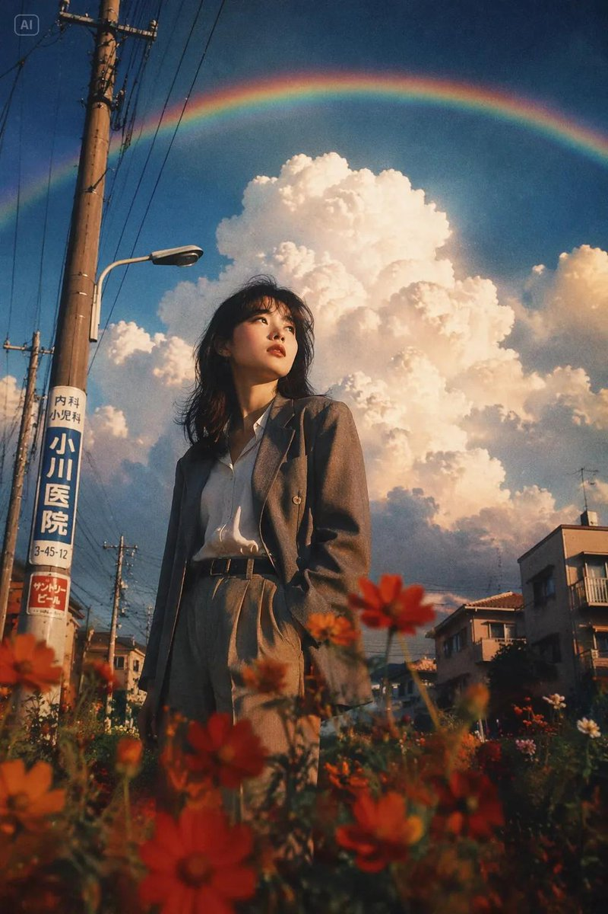

---
<!-- Case 260: Grunge Fashion Editorial Collage (by @AvelyrahnAI) -->
### Case 260: Grunge Fashion Editorial Collage

**Source**: [@AvelyrahnAI](https://x.com/AvelyrahnAI/status/2060732082599743586)

**Prompt**:
```
A high-fashion editorial portrait of a stylish woman with a long, thick French side-braid hair, wearing sleek black designer sunglasses, a premium oversized beige t-shirt tucked into tailored beige trousers. She is wearing a minimalist thick gold chain necklace and a luxury silver watch, posing elegantly with one hand gently touching the back of her neck and looking away with a confident smile.The background is a creative grunge black-and-white collage art featuring a Pegasus illustration, a vintage police car, a classic Chanel perfume bottle, newspaper textures, and vinyl records with white sticker cutout borders. Cinematic studio lighting, sharp focus, magazine cover aesthetic, 8K resolution.
```

**Output**:


---
<!-- Case 261: Pop-Fashion Photobooth Strips (by @Mind_Boticni) -->
### Case 261: Pop-Fashion Photobooth Strips

**Source**: [@Mind_Boticni](https://x.com/Mind_Boticni/status/2060959441889948116)

**Prompt**:
```
Photorealistic modern pop-fashion photobooth strip arrangement placed on a colorful gradient acrylic desk, top-down cinematic view. Three strips with SAME stylish young woman, consistent identity in all portraits.

Left strip: powerful direct gaze, edgy fashion pose, slightly tilted head, confident attitude.
Center strip: warm natural smile, candid moment, soft laughing expression, relaxed elegance.
Right strip: artistic over-the-shoulder glance, calm eyes-closed pose, reflective dreamy look, gentle emotion.

Vibrant contemporary aesthetic with neon pink, sky blue, and warm yellow highlights, ultra-clean studio lighting, glossy printed strips with crisp edges. Modern props like LED lights, fashion magazines, aesthetic accessories, and minimal luxury items. High-fashion digital editorial vibe, colorful, trendy, visually striking composition.
```

**Output**:

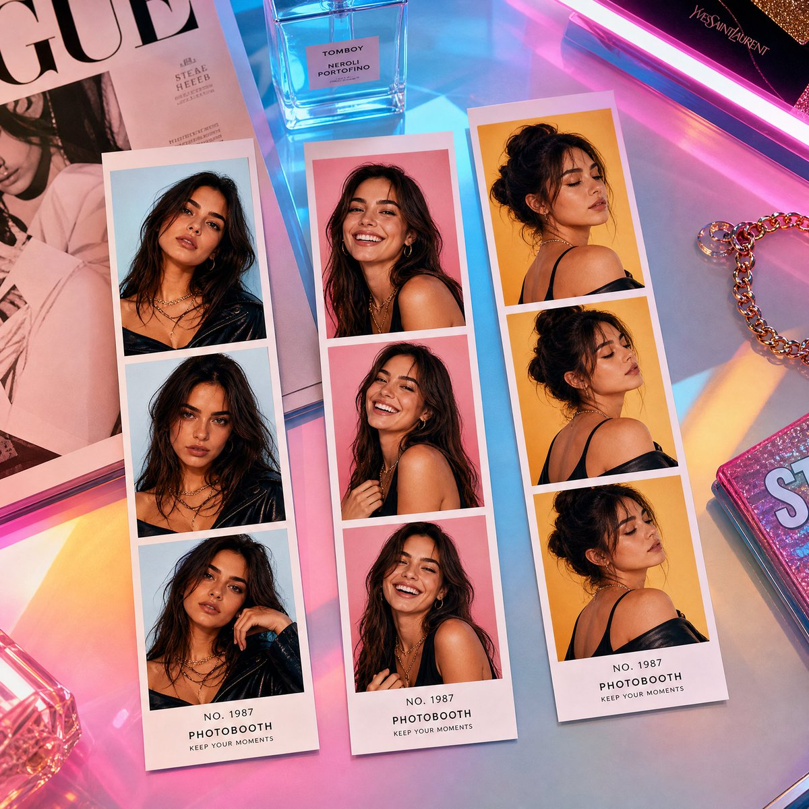

<!-- Case 262: Boho Stone-Wall Portrait (by @iamaiistudio) -->
### Case 262: [Boho Stone-Wall Portrait](https://x.com/iamaiistudio/status/2061600215073996840) (by [@iamaiistudio](https://x.com/iamaiistudio))

| Output |
| :----: |
| <a href="https://evolink.ai/gpt-image-2-prompts?utm_source=github&utm_medium=picture&utm_campaign=awesome-gpt-image-2-API-and-Prompts" target="_blank" rel="noopener noreferrer"></a> |

**Prompt:**

```
Create an ultra-photorealistic 3:4 editorial portrait of a young adult woman with Ana de Armas-inspired features, a fair natural complexion, a slender fit build, and long dark chestnut-brown hair in loose, slightly messy waves that fall across part of her face. She stands in soft daylight against a textured stone masonry wall made of large irregular gray and beige blocks, giving the scene a natural outdoor or semi-outdoor architectural backdrop.

Pose her leaning lightly against the wall with her body angled, looking downward instead of at the camera for a candid, introspective mood. Her right hand rests gently near her chest and neck with relaxed, splayed fingers, while her left hand hangs by her side holding a dark green crocodile-texture cowboy boot. Keep the expression quiet, moody, artistic, and softly feminine.

Style her in an off-the-shoulder cottagecore boho mini dress made from a lightweight cotton or linen blend. The dress has a red to off-red base, a small delicate floral print with purple and yellow wildflowers, a sweetheart neckline, puffed short sleeves, a corset-style bodice, and a ruffled tiered skirt. Add a thin black choker necklace, multiple silver rings, and a red beaded bracelet on the left wrist.

Use soft diffused natural daylight with even front illumination and gentle shadows. The aesthetic should feel bohemian, chic, feminine, candid, and slightly soft-grunge. Shoot as a thigh-up medium portrait from eye level with an 85mm prime lens, f/2.8 depth of field, flattering portrait compression, and sharp focus on the subject, dress texture, realistic skin pores, fabric details, and stone wall texture. Render in ultra-detailed 8k photorealism with high-end photography quality, realistic material fidelity, and a polished Unreal Engine 5 or premium editorial photo finish.
```
<!-- Case 263: Ink Manuscript Side Portrait (by @iamaiistudio) -->
### Case 263: [Ink Manuscript Side Portrait](https://x.com/iamaiistudio/status/2061539512300511530) (by [@iamaiistudio](https://x.com/iamaiistudio))

| Output |
| :----: |
| <a href="https://evolink.ai/gpt-image-2-prompts?utm_source=github&utm_medium=picture&utm_campaign=awesome-gpt-image-2-API-and-Prompts" target="_blank" rel="noopener noreferrer"></a> |

**Prompt:**

```
Use the uploaded photo as the primary face reference. Preserve the person's exact facial structure, skin tone, beard shape, nose, eyes, expression, likeness, and proportions from the reference image.

Create a dramatic, high-impact side-profile portrait in an expressive ink sketch and mixed-media illustration style. The man should feel intense, chaotic, and emotionally charged, with his face and upper body layered in cryptic handwritten text, abstract symbols, and glyph-like marks that wrap around the facial contours, suggesting inner turmoil and hidden meaning.

Dress him in a dark abstract jacket built from heavy textured strokes, sharp angular linework, vibrant ink accents, fine pen details, aggressive brush marks, splashes, and controlled smears. The visual language should feel raw, rebellious, bold, experimental, and editorial, blending precise illustration with conceptual art.

Use a pale aged-parchment background with subtle grain, faded paper texture, delicate linework, ink stains, and the feeling of an old manuscript or forgotten document. Keep the composition high contrast, expressive, intense, and artistically precise.
```
<!-- Case 264: Window-Light Cinematic Portrait (by @Ozayrr_irl) -->
### Case 264: [Window-Light Cinematic Portrait](https://x.com/Ozayrr_irl/status/2061439592549466615) (by [@Ozayrr_irl](https://x.com/Ozayrr_irl))

| Output |
| :----: |
| <a href="https://evolink.ai/gpt-image-2-prompts?utm_source=github&utm_medium=picture&utm_campaign=awesome-gpt-image-2-API-and-Prompts" target="_blank" rel="noopener noreferrer"></a> |

**Prompt:**

```
Use the exact same face from the reference image and generate a Ultra realistic cinematic portrait of that man with defined facial features, dark tousled hair, intense eyes. Shot from mid-chest up. Scene: sitting beside a large old wooden-framed window in a minimal dark room, early morning golden sunlight streaming through the glass in dramatic god rays  visible light beams cutting through floating dust particles in the air. The window light strikes directly across one side of his face, creating razor-sharp light and shadow divide. Half his face brilliantly golden, half consumed in deep natural shadow. The window frame casts a cross-shadow pattern across his chest and shoulder. Dust particles visibly floating and glowing in the light beams. Wearing a simple white linen shirt slightly unbuttoned. Background: dark moody room interior barely visible. Expression: contemplative, lost in thought, gazing toward the window light. Raw, natural, cinematic perfection. Vertical 9:13 format. Ultra photorealistic, 8K, no text overlays, cinematic color grading.
```

<!-- Case 265: Futuristic Martial Arts Heroine Portrait (by @vireonixx) -->
### Case 265: [Futuristic Martial Arts Heroine Portrait](https://x.com/vireonixx/status/2062352968364818576) (by [@vireonixx](https://x.com/vireonixx))

| Output |
| :----: |
| <a href="https://evolink.ai/gpt-image-2-prompts?utm_source=github&utm_medium=picture&utm_campaign=awesome-gpt-image-2-API-and-Prompts" target="_blank" rel="noopener noreferrer"></a> |

**Prompt:**

```
Ultra-photorealistic cinematic portrait of a legendary futuristic martial arts heroine standing in the center of a luxury fashion-editorial composition. She wears an elegant crimson and black combat outfit inspired by contemporary haute couture and advanced athletic armor, featuring intricate embroidered patterns, premium silk textures, carbon-fiber accents, metallic details, and subtle illuminated elements integrated into the design.

The character is captured in a dynamic low stance, one hand extended forward and the other resting near her waist, projecting calm confidence and immense strength. Her facial features are exceptionally realistic with natural beauty, perfectly balanced proportions, visible skin pores, subtle freckles, fine facial hairs, realistic skin translucency, delicate imperfections, soft blush tones, detailed lips with natural moisture, and ultra-sharp eye detail. Deep hazel eyes display complex iris structures, realistic reflections, and cinematic catchlights.

Her long dark hair flows naturally through the frame, with thousands of individually rendered strands, realistic flyaway hairs, subtle movement, and premium salon-quality shine. Decorative fabric ornaments and metallic accessories add visual interest while maintaining realism.

The composition incorporates an artistic mixed-media gallery backdrop featuring fragmented photographic panels, oversized close-up facial details, layered fashion-magazine elements, torn-edge textures, floating geometric shapes, translucent acrylic sheets, and contemporary luxury-brand advertising aesthetics. The background remains predominantly bright and minimalist with sophisticated negative space.

Wardrobe materials showcase extraordinary realism including premium satin, brushed metal, woven fabric, polished leather, textured embroidery, reflective surfaces, and physically accurate material responses. Every fold, stitch, seam, wrinkle, and fabric tension point is visible with microscopic precision.

Captured using a medium-format professional camera system, 110mm portrait lens, ultra-high dynamic range imaging, shallow depth of field, razor-sharp focus on the eyes, cinematic studio lighting with a large diffused key light, subtle rim illumination, controlled fill lighting, realistic shadow transitions, luxury fashion photography quality, and premium commercial advertising aesthetics.

Hyper-detailed skin rendering, subsurface scattering, realistic global illumination, advanced ray tracing, physically based rendering, volumetric atmosphere, ultra-clean composition, museum-quality portrait photography, luxury campaign aesthetics, editorial masterpiece, award-winning fashion photography, extraordinary realism, 32k detail, ultra-high fidelity textures, cinematic depth, breathtaking realism, next-generation rendering quality, photorealistic perfection.
```

<!-- Case 266: Under-Glass Worms-Eye Crowd Shot (by @iamaiistudio) -->
### Case 266: [Under-Glass Worms-Eye Crowd Shot](https://x.com/iamaiistudio/status/2062205313877762389) (by [@iamaiistudio](https://x.com/iamaiistudio))

| Output |
| :----: |
| <a href="https://evolink.ai/gpt-image-2-prompts?utm_source=github&utm_medium=picture&utm_campaign=awesome-gpt-image-2-API-and-Prompts" target="_blank" rel="noopener noreferrer"></a> |

**Prompt:**

```
Camera placed directly beneath a completely transparent glass floor, pointing straight up. Pedestrians walk across the surface above. Pure blue sky fills the background. No buildings, walls, or edges in frame. The glass is perfectly seamless and nearly imperceptible. Extremely close viewpoint to the underside of the walking figures. People moving mostly left to right. Shoe soles fill the foreground up close.
```


<!-- Case 267: Black-and-White Identity Collage Grid (by @mehvishs25) -->
### Case 267: [Black-and-White Identity Collage Grid](https://x.com/mehvishs25/status/2063293613514330224) (by [@mehvishs25](https://x.com/mehvishs25))

| Output |
| :----: |
| <a href="https://evolink.ai/gpt-image-2-prompts?utm_source=github&utm_medium=picture&utm_campaign=awesome-gpt-image-2-API-and-Prompts" target="_blank" rel="noopener noreferrer"></a> |

**Prompt:**

```
Edit the photo while preserving the subject’s exact facial features and identity. Create a high-resolution vertical portrait composition (9:16), ultra-detailed, sharp focus throughout, no background blur, rendered with a premium 8K editorial finish.

Design the image as a sophisticated black-and-white fashion portrait collage arranged in a 2×3 grid, featuring six unique frames of the same young woman in a clean, minimalist indoor studio environment. The overall aesthetic should feel elegant, cinematic, intimate, and effortlessly stylish, inspired by timeless monochrome fashion editorials and luxury magazine photography.

Hair is long, reaching the waist, colored a cool ash-brown with subtle gray undertones. Styled in a Korean-inspired hush cut with soft face-framing layers, airy see-through bangs, and sleek straight lengths that gently curve outward at the ends. The texture appears silky, healthy, and glossy, with a few natural flyaway strands for realism.

Beauty styling remains refined and understated: luminous hydrated skin, naturally feathered brows, subtle brown eyeliner, soft mascara, muted nude lips with a velvety finish, and barely-there blush for a fresh editorial appearance.

Wardrobe consists of a fitted white rib-knit tank top paired with relaxed high-waisted vintage-wash denim jeans, visible in selected frames. Accessories include matte black nail art, delicate silver hoop earrings, multiple silver rings, and a slim silver wristwatch, contributing to a contemporary fashion-editorial mood.

Collage Frame Concepts:

• Frame 1 — Tight portrait crop, fingertips resting softly against the cheek, direct eye contact, confident yet gentle expression.

• Frame 2 — Casual seated pose on a sofa, body turned slightly to one side, gaze directed away from the camera in a contemplative moment.

• Frame 3 — Relaxed reclining position with one knee bent, leaning comfortably into an arm, creating a graceful editorial silhouette.

• Frame 4 — Arms lifted behind the head, posture open and self-assured, subtle lean backward conveying effortless confidence.

• Frame 5 — Emotional close portrait with a slight head tilt and closed eyes, emphasizing calmness and quiet introspection.

• Frame 6 — Front-facing seated composition with composed expression and subtle movement through the hair for a natural, candid feel.

Environment remains intentionally simple: a light-toned studio wall with a neutral sofa appearing selectively across certain frames. The background should support the subject without drawing attention away from her.

Lighting is soft and diffused, resembling natural window light in a professional studio. Gentle directional shadows create depth and dimensionality, while a faint rim light subtly separates the hair from the background. Avoid harsh flash or strong contrast.

Captured with the quality and detail associated with professional mirrorless cameras such as a Canon EOS R5 or Sony A7R IV. Use a combination of intimate close-ups and medium-length portraits, primarily at eye level with occasional slightly elevated angles. Emphasize balanced magazine-style compositions and natural visual flow across the collage.

Final processing should feature a rich monochrome conversion with smooth tonal transitions, lifted shadows, restrained contrast, delicate 35mm film grain, a soft matte finish, and exceptional detail retention in both skin texture and hair, echoing the look of classic high-fashion editorial photography.
```

<!-- Case 268: Plush Mascot Companion Portrait (by @doctorwasif) -->
### Case 268: [Plush Mascot Companion Portrait](https://x.com/doctorwasif/status/2063304967218475072) (by [@doctorwasif](https://x.com/doctorwasif))

<table>
<tr><td width="50%"><a href="https://evolink.ai/gpt-image-2-prompts?utm_source=github&utm_medium=picture&utm_campaign=awesome-gpt-image-2-API-and-Prompts" target="_blank" rel="noopener noreferrer"></a></td><td width="50%"><a href="https://evolink.ai/gpt-image-2-prompts?utm_source=github&utm_medium=picture&utm_campaign=awesome-gpt-image-2-API-and-Prompts" target="_blank" rel="noopener noreferrer"></a></td></tr>
<tr><td width="50%"><a href="https://evolink.ai/gpt-image-2-prompts?utm_source=github&utm_medium=picture&utm_campaign=awesome-gpt-image-2-API-and-Prompts" target="_blank" rel="noopener noreferrer"></a></td><td width="50%"><a href="https://evolink.ai/gpt-image-2-prompts?utm_source=github&utm_medium=picture&utm_campaign=awesome-gpt-image-2-API-and-Prompts" target="_blank" rel="noopener noreferrer"></a></td></tr>
</table>

**Prompt:**

```
Use the uploaded portrait as the identity reference and preserve the person's recognizable facial features, hairstyle, skin tone, expression, fashion sense, and overall presence. Create a premium full-body portrait of the same person alongside a large custom-designed plush companion that feels like their mascot alter ego. The plush should be inspired by the subject's mood, facial impression, styling, posture, and overall energy rather than being a generic animal or mascot. Automatically choose a creature concept that best matches the person's unique vibe, avoiding predictable or stereotype-based selections. The mascot must clearly be an oversized plush toy with soft fuzzy fabrics, rounded shapes, detailed stitching, premium textures, and a collectible designer-toy aesthetic. Its design, expression, silhouette, and proportions should subtly reflect the person's character and visual identity. Build a harmonious color palette using cues from the subject's hair, skin tone, clothing, and atmosphere so the person, mascot, and scene feel naturally connected. Show both the person and plush fully visible from head to toe, including shoes and all parts of the mascot, with balanced framing and comfortable spacing. Choose a natural interaction that suits the subject, such as standing beside, sitting with, leaning on, lightly hugging, or casually engaging with the plush companion. Keep the person's expression relaxed, warm, and authentic with a subtle smile or calm gaze, avoiding stiff poses or mannequin-like appearances. If the original image only shows part of the outfit, intelligently complete the full look in a believable and stylish way. Place the scene in a clean, aesthetically pleasing environment such as a minimalist studio, cozy lifestyle setting, or refined editorial backdrop that complements both the person and mascot without distractions. The final image should feel charming, cozy, stylish, emotionally engaging, visually cohesive, and suitable for a high-end character campaign or social-media editorial. Avoid cropped bodies, hidden shoes, incomplete mascot visibility, generic animal choices, real animals, horror elements, cheap toy aesthetics, awkward poses, cluttered backgrounds, distorted anatomy, extra limbs, text, logos, or watermarks.
```


<!-- Case 269: Editorial Y2K Identity Grid (by @Ciri_ai) -->
### Case 269: [Editorial Y2K Identity Grid](https://x.com/Ciri_ai/status/2063592048150909396) (by [@Ciri_ai](https://x.com/Ciri_ai))

| Output |
| :----: |
| <a href="https://evolink.ai/gpt-image-2-prompts?utm_source=github&utm_medium=picture&utm_campaign=awesome-gpt-image-2-API-and-Prompts" target="_blank" rel="noopener noreferrer"></a> |

**Prompt:**

```
A vertical collage of three YZK photos. Using the uploaded selfie as the ONLY and exclusive face reference, keep the facial features, and facial structure exactly the same as the reference image. The character poses against a neutral light background. A girl with a beautiful, voluminous hairstyle, seemingly styled with a brush, wearing foxy makeup and pronounced, angled lashes. In the first photo, she's very close to the camera, looking at it with one eye and winking. In the second photo, she's turned away, her head coquettishly turned toward the lens, her hairstyle slightly covering her face, but not too much. In the third photo, she's looking very close to the lens, her hair to the side, thus covering her left eye, pouting and looking forward. Close-up and medium shot, minimalist composition, vintage digital texture, slight blur, glamorous atmosphere. Photo taken on iPhone 17 Pro Max with flash.
```

<!-- Case 270: Cool Grey Editorial 3x3 (by @Mind_Boticni) -->
### Case 270: [Cool Grey Editorial 3x3](https://x.com/Mind_Boticni/status/2063587170519314754) (by [@Mind_Boticni](https://x.com/Mind_Boticni))

| Output |
| :----: |
| <a href="https://evolink.ai/gpt-image-2-prompts?utm_source=github&utm_medium=picture&utm_campaign=awesome-gpt-image-2-API-and-Prompts" target="_blank" rel="noopener noreferrer"></a> |

**Prompt:**

```
Editorial 3x3 grid in a cool-grey seamless backdrop. Character (face characteristics 100% same as uploaded image) wearing a charcoal sleeveless dress. Lighting: large overhead softbox, faint side bounce.

Shots include: 1. tight cheek + neck close-up with blurred finger foreground (85mm, f/1.8); 2. eyes locked to lens, top-light reflection visible (85mm, f/2.0); 3. monochrome chin-on-hand portrait with strong frame fill (50mm, f/2.2); 4. half-obscured over-shoulder shot through blurred dress strap (85mm, f/2.0); 5. head-on close-up with intersecting shadows across face (50mm, f/2.5); 6. angled raw portrait with tousled hair (85mm, f/2.2); 7. tight detail of hands resting near collarbone (50mm, f/3.2); 8. seated half-body profile with blurred frame edges (35mm, f/4.5); 9. profile macro with single water droplet highlight (85mm, f/1.9). RAW, smooth contrast, editorial softness.
```

<!-- Case 271: Black-and-White Fashion Grid (by @j_smeaton99) -->
### Case 271: [Black-and-White Fashion Grid](https://x.com/j_smeaton99/status/2063661848478859690) (by [@j_smeaton99](https://x.com/j_smeaton99))

| Output |
| :----: |
| <a href="https://evolink.ai/gpt-image-2-prompts?utm_source=github&utm_medium=picture&utm_campaign=awesome-gpt-image-2-API-and-Prompts" target="_blank" rel="noopener noreferrer"></a> |

**Prompt:**

```
Edit the photo while preserving the subject’s exact facial features and identity. Create a high-resolution vertical portrait composition (9:16), ultra-detailed, sharp focus throughout, no background blur, rendered with a premium 8K editorial finish.

Design the image as a sophisticated black-and-white fashion portrait collage arranged in a 2×3 grid, featuring six unique frames of the same young woman in a clean, minimalist indoor studio environment. The overall aesthetic should feel elegant, cinematic, intimate, and effortlessly stylish, inspired by timeless monochrome fashion editorials and luxury magazine photography.

Hair is long, reaching the waist, colored a cool ash-brown with subtle gray undertones. Styled in a Korean-inspired hush cut with soft face-framing layers, airy see-through bangs, and sleek straight lengths that gently curve outward at the ends. The texture appears silky, healthy, and glossy, with a few natural flyaway strands for realism.

Beauty styling remains refined and understated: luminous hydrated skin, naturally feathered brows, subtle brown eyeliner, soft mascara, muted nude lips with a velvety finish, and barely-there blush for a fresh editorial appearance.

Wardrobe consists of a fitted white rib-knit tank top paired with relaxed high-waisted vintage-wash denim jeans, visible in selected frames. Accessories include matte black nail art, delicate silver hoop earrings, multiple silver rings, and a slim silver wristwatch, contributing to a contemporary fashion-editorial mood.

Collage Frame Concepts:

• Frame 1 — Tight portrait crop, fingertips resting softly against the cheek, direct eye contact, confident yet gentle expression.

• Frame 2 — Casual seated pose on a sofa, body turned slightly to one side, gaze directed away from the camera in a contemplative moment.

• Frame 3 — Relaxed reclining position with one knee bent, leaning comfortably into an arm, creating a graceful editorial silhouette.

• Frame 4 — Arms lifted behind the head, posture open and self-assured, subtle lean backward conveying effortless confidence.

• Frame 5 — Emotional close portrait with a slight head tilt and closed eyes, emphasizing calmness and quiet introspection.

• Frame 6 — Front-facing seated composition with composed expression and subtle movement through the hair for a natural, candid feel.

Environment remains intentionally simple: a light-toned studio wall with a neutral sofa appearing selectively across certain frames. The background should support the subject without drawing attention away from her.

Lighting is soft and diffused, resembling natural window light in a professional studio. Gentle directional shadows create depth and dimensionality, while a faint rim light subtly separates the hair from the background. Avoid harsh flash or strong contrast.

Captured with the quality and detail associated with professional mirrorless cameras such as a Canon EOS R5 or Sony A7R IV. Use a combination of intimate close-ups and medium-length portraits, primarily at eye level with occasional slightly elevated angles. Emphasize balanced magazine-style compositions and natural visual flow across the collage.

Final processing should feature a rich monochrome conversion with smooth tonal transitions, lifted shadows, restrained contrast, delicate 35mm film grain, a soft matte finish, and exceptional detail retention in both skin texture and hair, echoing the look of classic high-fashion editorial photography.
```

<!-- Case 272: Nightlife Restaurant Flash Collage (by @ZephyraLeigh) -->
### Case 272: [Nightlife Restaurant Flash Collage](https://x.com/ZephyraLeigh/status/2063656432864842045) (by [@ZephyraLeigh](https://x.com/ZephyraLeigh))

| Output |
| :----: |
| <a href="https://evolink.ai/gpt-image-2-prompts?utm_source=github&utm_medium=picture&utm_campaign=awesome-gpt-image-2-API-and-Prompts" target="_blank" rel="noopener noreferrer"></a> |

**Prompt:**

```
Using the provided reference image, create an ultra-realistic candid nightlife fashion photoshoot of a beautiful young woman at a trendy upscale restaurant lounge at night.

She has a slim figure, long voluminous dark brown hair, flawless glowing skin, soft glam makeup, glossy nude lips, subtle eyeliner, and an effortlessly confident expression.

She is wearing a fitted deep red halter-neck crop top with a plunging neckline, paired with low-rise charcoal gray vintage-wash denim jeans. Accessories include a small black quilted shoulder bag with a silver chain strap, delicate bracelets, and minimal jewelry.

Create a 3-photo vertical collage capturing different candid poses:

1. Looking down with eyes closed, one hand resting on her chest.

2. Side pose with hair tied into a loose ponytail, looking over her shoulder.

3. Standing confidently with one hand raised near her hair, showing the outfit clearly.

The setting is a crowded luxury restaurant with rattan chairs, candlelit tables, warm ambient lighting, arched windows, hanging greenery, and guests dining in the background. Shot using direct on-camera flash, creating a nostalgic early-2000s paparazzi aesthetic with slightly overexposed highlights and authentic nightlife energy.

Pinterest aesthetic, Instagram nightlife photography, candid fashion editorial, luxury restaurant atmosphere, realistic skin texture, film-camera flash look, subtle grain, warm tones, shallow depth of field, trendy influencer style, photorealistic, Vogue nightlife editorial, DSLR flash photography, 35mm lens, high-fashion social media content, masterpiece, best quality, ultra realistic, 8K.
```

<!-- Case 273: Vintage Newsstand Double Exposure (by @AiwithZohaib) -->
### Case 273: [Vintage Newsstand Double Exposure](https://x.com/AiwithZohaib/status/2063754827017101475) (by [@AiwithZohaib](https://x.com/AiwithZohaib))

| Output |
| :----: |
| <a href="https://evolink.ai/gpt-image-2-prompts?utm_source=github&utm_medium=picture&utm_campaign=awesome-gpt-image-2-API-and-Prompts" target="_blank" rel="noopener noreferrer"></a> |

**Prompt:**

```
The generated image uses the uploaded image as a reference for the character, wearing a high-necked, tight-fitting black long-sleeved dress. A cluster of withered wood and orange-pink flowers lies beside an old newsstand, the grainy texture of vintage film interwoven, the blurred background with noticeable trailing shadows, and the double-image effect creating a fantastical atmosphere. A bewitchingly beautiful girl, carrying flowers, is shown in profile, her fair skin delicate and translucent.

Her exquisite face is blurred with motion, the outline of her figure slightly swaying with the panning camera, the soft focus making the image even more hazy and languid. A warm-toned, low-saturation filter enhances the effect, her long, backlit hair glowing with a soft glow, the messy strands sweeping wildly across her jawline, the details concealing a captivating yet dangerous allure.Cute movements add dynamism, the motion blur blending with the film grain, creating a trendy, Instagram-worthy image while the blurred image outlines a dynamic scene full of story, cleverly balancing bewitching and sweetness.
Follow : @AiwithZohaib
```


<!-- Case 274: Fashion Casting Contact Sheet (by @Ciri_ai) -->
### Case 274: [Fashion Casting Contact Sheet](https://x.com/Ciri_ai/status/2064027400426709259) (by [@Ciri_ai](https://x.com/Ciri_ai))

| Output |
| :----: |
| <a href="https://evolink.ai/gpt-image-2-prompts?utm_source=github&utm_medium=picture&utm_campaign=awesome-gpt-image-2-API-and-Prompts" target="_blank" rel="noopener noreferrer"></a> |

**Prompt:**

```
Black-and-white fashion casting contact sheet of [HUMAN] with [HAIR], arranged in a clean 2x2 grid of four close portrait frames against [BACKGROUND], wearing [CLOTHING] and [ACCESSORY]. Each frame shows a different expression and angle: [EXPRESSIONS]. Soft studio lighting, crisp monochrome contrast, natural skin texture, visible facial details, clean plain backdrop, subtle film grain, high-end editorial test shoot, minimal styling, intimate camera distance, professional portrait photography, aspect ratio 4:5.
```


<!-- Case 275: Identity-Locked Portrait Edit (by @Kashberg_0) -->
### Case 275: [Identity-Locked Portrait Edit](https://x.com/Kashberg_0/status/2064022776600760625) (by [@Kashberg_0](https://x.com/Kashberg_0))

| Output |
| :----: |
| <a href="https://evolink.ai/gpt-image-2-prompts?utm_source=github&utm_medium=picture&utm_campaign=awesome-gpt-image-2-API-and-Prompts" target="_blank" rel="noopener noreferrer"></a> |

**Prompt:**

```
Use the uploaded portrait as the identity reference for the subject's face, hairstyle, facial structure, skin tone, expression, and overall impression.

Create a high-quality realistic emotional portrait of the same person with a soft sad mood and visible tears.

Core concept:
- a delicate, emotionally touching close-up portrait
- the subject looks quietly sad, as if holding back emotions
- the mood should feel fragile, intimate, soft, and beautiful
- the image should feel like a polished Korean-style emotional portrait

Identity:
- preserve the subject's recognizable identity
- keep the same face shape, eyes, nose, lips, jawline, hairstyle, and overall vibe
- do not make the face look generic or overly different
- keep the beauty natural and believable

Expression:
- slightly sad expression
- soft watery eyes
- one or two visible tear streaks running down the cheek
- lips softly closed or slightly parted
- emotional but restrained, not exaggerated
- the sadness should feel quiet, longing, and delicate

Styling:
- long dark hair with soft natural texture
- a few loose strands falling across the face
- clean natural makeup
- luminous skin
- simple dark top or minimal clothing visible
- overall styling should remain clean and understated so the face is the focus

Lighting:
- soft, moody lighting
- gentle highlights on the eyes, nose, lips, and tear tracks
- subtle shadow depth
- dark or muted background
- the lighting should feel intimate and cinematic, not harsh

Composition:
- vertical portrait composition
- close-up framing
- place the face in the upper half of the frame
- the center of the face should sit slightly above the vertical midpoint
- the eyes should fall around the upper-middle area of the image
- avoid placing the face too low in the frame
- keep the composition visually balanced and elegant

Mood and style:
- Korean emotional beauty portrait
- soft, melancholic, dreamy, intimate
- elegant and photogenic
- emotionally expressive without looking dramatic
- beautiful but slightly heartbreaking

Important visual priority:
- preserve identity clearly
- the face must remain the main focus
- tears should be visible but subtle
- expression should feel naturally sad and emotionally convincing
- the portrait should look beautiful, soft, and emotionally immersive

Negative prompt:
- no exaggerated crying
- no distorted face
- no cartoon style
- no anime style
- no harsh flash
- no messy background
- no over-retouched plastic skin
- no exaggerated smile
- no low-resolution image
- no text
- no watermark
```


<!-- Case 276: High Angle Cinematic Portrait (by @AvelyrahnAI) -->
### Case 276: [High Angle Cinematic Portrait](https://x.com/AvelyrahnAI/status/2064547040508662240) (by [@AvelyrahnAI](https://x.com/AvelyrahnAI))

| Output |
| :----: |
| <a href="https://evolink.ai/gpt-image-2-prompts?utm_source=github&utm_medium=picture&utm_campaign=awesome-gpt-image-2-API-and-Prompts" target="_blank" rel="noopener noreferrer"></a> |

**Prompt:**

```
Edit foto wanita tersebut menjadi potret High Angle Sinematik dari seorang wanita muda yang cantik dari sudut pandang belakang. Fokus utamanya adalah pada bahu, lengan, dan sebagian wajahnya yang menghadap ke samping dengan ekspresi tenang. Riasan flawess natural eye shadow semi peach-brown lembut, bulu mata lentik, blush on tipis peach lembut dengan lisptik glossy peach lembut, rambut lurusnya tersanggul keatas agak longgar sedikit ada helaian rambut samping kanan-kirinya membingkai wajahnya. Ia mengenakan atasan sweater rajut dengan model sabrina berwarna cokelat muda. Tekstur kulitnya terlihat sangat halus di bawah siraman cahaya matahari yang terfilter. Latar belakang di outdoor buram (bokeh). Wajahnya menoleh ke samping melihat ke sikataran dengan ekspresi tenang dan sendu.

Pencahayaan dan Warna :
Foto ini menggunakan teknik pencahayaan yang kontras (terang-gelap). Cahaya matahari jatuh di bagian bahu dan wajahnya, sementara bagian lainnya tenggelam dalam bayangan. Terdapat bayangan siluet dedaunan atau ranting yang jatuh di punggung dan wajah wanita tersebut, memberikan kesan ia berada di bawah pohon saat matahari mulai terbenam (golden hour).
Palet Warna: Didominasi oleh warna-warna hangat seperti oranye, golden hour, cokelat yang dikontraskan dengan latar belakang yang redup.

Komposisi dan Estetika
Depth of Field: Latar belakangnya sangat buram (bokeh), membuat subjek wanita menonjol. Kesan yang ditampilkan adalah kelembutan, ketenangan. Foto ini tidak terasa seperti foto potret biasa, melainkan lebih seperti potongan adegan dari sebuah film drama puitis.
Foto ini memiliki atmosfer yang sangat melankolis, artistik, dan sinematik. Komposisinya bermain dengan kontras antara cahaya hangat dan bayangan yang dalam, menciptakan kesan misterius namun intim.
```

<!-- Case 277: Chiaroscuro Hyper-realistic Portrait (by @iamsofiaijaz) -->
### Case 277: [Chiaroscuro Hyper-realistic Portrait](https://x.com/iamsofiaijaz/status/2064545265521217953) (by [@iamsofiaijaz](https://x.com/iamsofiaijaz))

| Output |
| :----: |
| <a href="https://evolink.ai/gpt-image-2-prompts?utm_source=github&utm_medium=picture&utm_campaign=awesome-gpt-image-2-API-and-Prompts" target="_blank" rel="noopener noreferrer"></a> |

**Prompt:**

```
Create a hyper-realistic 8K cinematic portrait of the uploaded person in a dramatic chiaroscuro style. The subject is seated at a three-quarter angle, leaning slightly forward with a relaxed yet commanding posture. His face is turned slightly away from the camera, not looking at the lens, with one side of the face sharply illuminated and the opposite side fading into deep, velvety black shadow.
His expression is contemplative.
His hands are near the chest in a natural, precise pose, with the fingers gently and correctly interlocked. One wrist clearly shows a luxury black chronograph watch with a detailed metal link bracelet, and one hand wears a subtle silver ring. He is dressed in a sharp black suit jacket over a white dress shirt with the top buttons open, showing refined fabric texture and natural folds.
The background is solid seamless black. Use strong directional studio lighting with rich contrast, clean shadow falloff, and realistic skin texture. Highlight fine details such as hair strands, beard bristles, eye moisture, facial texture, the watch face, metal bracelet reflections, and the silver ring. Shot with an 85mm portrait lens look, shallow depth of field, premium commercial photography, ultra-sharp focus, smooth natural skin transitions, cinematic contrast, no artificial plastic skin, no extra fingers, no distorted hands, no messy anatomy.
```

<!-- Case 278: Kawaii Character Side Profile Portrait (by @VIBEQUIRKLABS) -->
### Case 278: [Kawaii Character Side Profile Portrait](https://x.com/VIBEQUIRKLABS/status/2064543699460354240) (by [@VIBEQUIRKLABS](https://x.com/VIBEQUIRKLABS))

| Output |
| :----: |
| <a href="https://evolink.ai/gpt-image-2-prompts?utm_source=github&utm_medium=picture&utm_campaign=awesome-gpt-image-2-API-and-Prompts" target="_blank" rel="noopener noreferrer"></a> |

**Prompt:**

```
Create a photorealistic editorial portrait of one 20-year-old Japanese or Korean female portrait subject with white frame, thin-frame glasses, worn normally on the face, lenses aligned over the eyes and small teardrop gemstone earring detail, delicate understated sparkle, natural basic body, about 160-165 cm visual height, balanced torso-to-leg ratio around 4:6, young seductive alluring beauty face, magnetic feminine facial balance, defined eyes and lips, collarbone-length layered hair, airy natural volume, soft face-framing movement, soft black-tea brown hair, muted brown-black salon tone. She is sitting on a chair that naturally fits the current scene. The setting is British record listening corner, turntable setup, stacked vinyl sleeves, bookshelf speakers, aged wood cabinet, lamp fixture, small side table, indoor rainy-day daylight environment, dim grey window brightness. She wears gothic casual knit-and-ruffle outfit, fitted knit top, lace camisole layer, large ribbon bow, high-waist layered ruffle mini skirt. Inspired by Leslie Kee, polished commercial portrait image language. Camera positioned on the subject's left side, 90-degree left profile view, ultra shallow depth of field.
```

<!-- Case 279: Monochrome Vector Vogue Portrait (by @noorlewisx) -->
### Case 279: [Monochrome Vector Vogue Portrait](https://x.com/noorlewisx/status/2064539506305561076) (by [@noorlewisx](https://x.com/noorlewisx))

| Output |
| :----: |
| <a href="https://evolink.ai/gpt-image-2-prompts?utm_source=github&utm_medium=picture&utm_campaign=awesome-gpt-image-2-API-and-Prompts" target="_blank" rel="noopener noreferrer"></a> |

**Prompt:**

```
Transform the subject into a striking high-contrast monochrome vector portrait, rendered in a premium black-and-white comic book illustration style with crisp cel-shading, bold geometric shapes, and ultra-clean vector linework. Preserve the subject's facial features, hairstyle, expression, and overall likeness with high accuracy.

The subject is a stylish young woman with long flowing hair, wearing an open dark oversized shirt layered over a fitted white crew-neck T-shirt. She accessorizes with a minimalist square pendant necklace, elegant earrings, and a pair of fashionable sunglasses resting naturally on top of her head, seamlessly integrated into her hairstyle.

Illuminate the portrait with intense red neon rim lighting that traces the contours of her hair, face, shoulders, and clothing, creating a dramatic glow against the monochrome artwork. The red highlights should add depth, separation, and a futuristic cinematic atmosphere without overpowering the black-and-white design.

Set against a pure black background, emphasizing strong contrast and visual impact. Style the artwork with sharp vector edges, bold shadows, clean negative space, graphic-novel aesthetics, modern streetwear fashion energy, and premium poster-quality composition. Ultra-detailed yet minimalist, edgy, contemporary, visually powerful, and magazine-cover worthy. Strong confident female presence, cinematic attitude, luxury editorial feel, and flawless vector illustration quality.
```

<!-- Case 280: Minimalist Vogue Editorial Cover (by @vireonixx) -->
### Case 280: [Minimalist Vogue Editorial Cover](https://x.com/vireonixx/status/2064536416592552092) (by [@vireonixx](https://x.com/vireonixx))

| Output |
| :----: |
| <a href="https://evolink.ai/gpt-image-2-prompts?utm_source=github&utm_medium=picture&utm_campaign=awesome-gpt-image-2-API-and-Prompts" target="_blank" rel="noopener noreferrer"></a> |

**Prompt:**

```
Create a sophisticated high-fashion magazine cover portrait using the provided reference image only for the subject's identity and facial features. Transform the scene into a minimalist Vogue-inspired editorial cover that emphasizes timeless style, intellectual elegance, and refined simplicity.

COMPOSITION & FRAMING:
Vertical magazine cover format, approximately 4:5 aspect ratio. Upper-torso portrait composition, framed from mid-abdomen to slightly above the head. Subject positioned centrally with balanced negative space around the figure for luxury editorial typography. Clean, uncluttered layout with strong visual breathing room. Direct engagement with the camera creates intimacy and authority.

POSE & BODY LANGUAGE:
Thoughtful fashion-editorial pose with one hand partially covering the lower face, fingers resting naturally near the nose and lips. Opposite arm folded across the body creating subtle structure. Relaxed shoulders. Slight forward lean. Natural posture conveying intelligence, creativity, and effortless confidence. The pose should feel spontaneous rather than staged.

FACIAL EXPRESSION:
Quiet confidence, introspective gaze, subtle mystery, calm sophistication. Eyes focused directly toward the camera with a soft yet engaging expression. Emotion should communicate intelligence, artistic sensibility, modern elegance, and understated charisma. No exaggerated smile.

FASHION STYLING:
Minimalist luxury wardrobe centered around a crisp oversized white shirt. Premium cotton fabric with visible texture and natural folds. Open collar with clean lines. Slightly oversized silhouette creating modern proportions. Sleeves casually rolled or relaxed. Styling reflects contemporary luxury, Scandinavian minimalism, and timeless fashion essentials.

ACCESSORIES:
Thin silver metal-frame eyeglasses with minimalist design. Luxury wristwatch featuring a clean dial, refined metallic case, and understated elegance. Accessories should appear functional, sophisticated, and premium
```

<!-- Case 281: Cinematic Street Photography Portrait (by @frametheory058) -->
### Case 281: [Cinematic Street Photography Portrait](https://x.com/frametheory058/status/2064536055366480248) (by [@frametheory058](https://x.com/frametheory058))

| Output |
| :----: |
| <a href="https://evolink.ai/gpt-image-2-prompts?utm_source=github&utm_medium=picture&utm_campaign=awesome-gpt-image-2-API-and-Prompts" target="_blank" rel="noopener noreferrer"></a> |

**Prompt:**

```
Create an ultra-realistic cinematic street photography portrait of me on a busy city street. Keep my face exactly the same as in the reference photo — same facial structure, eyes, nose, lips, hairstyle, skin tone, proportions, and overall identity. Do not alter, beautify, or reinterpret my appearance in any way.

I am standing confidently in the center of the frame wearing an oversized black hoodie, relaxed cargo pants, and casual streetwear. My expression is playful, slightly mischievous, and natural, as if I’m proudly showing my creative side.

I’m holding a large white poster board in front of me.

The poster should contain only ONE hand-drawn sketch illustration of me. No multiple portraits or variations.

The sketch should be:

Black-and-white pencil drawing

Highly detailed

Realistic facial resemblance

Expressive line art

Artist sketchbook style

Clean white background

Subtle shading

Visible hand-drawn pencil strokes

Confident creator energy

At the bottom of the sketch, write:

[Name]

Around the sketch, add only a few minimal doodles:

Tiny stars

Small hearts

Paper airplane

Light sketch arrows

Subtle creative marks

Keep the poster simple, clean, and powerful.

The mood should feel creative, inspiring, authentic, artistic, and documentary-like, as if it’s part of a creator movement campaign.

Style: ultra-realistic street portrait, natural lighting, shallow depth of field, soft background blur, premium editorial photography, magazine-quality image, cinematic storytelling, Pinterest aesthetic, creator-brand campaign, emotional and relatable, professional photography, 8K masterpiece.

The contrast between the real me and the hand-drawn sketch version of me should be the main visual focus, creating a strong artist-versus-art effect. The single sketch on the poster must remain the clear focal point.

Aspect ratio: 4:5
```

<!-- Case 282: Winter Wolf Cinematic Portrait (by @iamaiistudio) -->
### Case 282: [Winter Wolf Cinematic Portrait](https://x.com/iamaiistudio/status/2064409499906224232) (by [@iamaiistudio](https://x.com/iamaiistudio))

| Output |
| :----: |
| <a href="https://evolink.ai/gpt-image-2-prompts?utm_source=github&utm_medium=picture&utm_campaign=awesome-gpt-image-2-API-and-Prompts" target="_blank" rel="noopener noreferrer"></a> |

**Prompt:**

```
://t.co/1ZKQNHa8h4

prompt:

Cinematic winter portrait of a young pale-skinned woman with long dark snow-dusted hair, standing closely behind a majestic gray wolf. She wears a fur-lined heavy winter coat, expression intense, calm and soulful, direct eye contact with camera. The wolf is calm and watchful with thick frost-covered fur and sharp golden intelligent eyes. Both subjects centered symmetrically, ultra-sharp focus on both sets of eyes. Background: softly blurred snow-covered forest, gentle snowfall, cold mist. Lighting: soft natural overcast winter light with diffused shadows, cinematic cool tones, subtle warmth in skin and eyes. Style: fine-art wildlife and cinematic portrait photography, ultra-realistic, 8K quality detail. Mood: quiet intensity, mystery, primal bond, reverence for nature. Portrait orientation, 2:3 aspect ratio.

#AIart #GPTImage2
```

<!-- Case 283: Full Shot Man White Chair (by @JamilAI55) -->
### Case 283: [Full Shot Man White Chair](https://x.com/JamilAI55/status/2064548739419947299) (by [@JamilAI55](https://x.com/JamilAI55))

| Output |
| :----: |
| <a href="https://evolink.ai/gpt-image-2-prompts?utm_source=github&utm_medium=picture&utm_campaign=awesome-gpt-image-2-API-and-Prompts" target="_blank" rel="noopener noreferrer"></a> |

**Prompt:**

```
A full shot of a man sitting on a white chair with his legs crossed, wearing a dark button-down shirt, white pants, and white slides, uploaded face as reference, with an old-fashioned film camera on a tripod to his left, a potted green plant to his right, and various design-related elements scattered around him, including a notepad listing 'Creative Cloud' applications, a Polaroid photo with the words 'Creativity is Fun,' and text snippets like 'Be Different' and 'Dare to Stand Out,' all arranged in a collage style, with a color palette of muted blues, grays, and whites, and pops of color from the plant and text, creating a visually engaging and informative composition, reminiscent of a graphic design mood board, with a slightly desaturated look and a clean, modern aesthetic.
```

<!-- Case 284: Eiffel Tower Low Angle Fashion Portrait (by @CHAseUnre) -->
### Case 284: [Eiffel Tower Low Angle Fashion Portrait](https://x.com/CHAseUnre/status/2064514382756012487) (by [@CHAseUnre](https://x.com/CHAseUnre))

| Output |
| :----: |
| <a href="https://evolink.ai/gpt-image-2-prompts?utm_source=github&utm_medium=picture&utm_campaign=awesome-gpt-image-2-API-and-Prompts" target="_blank" rel="noopener noreferrer"></a> |

**Prompt:**

```
에펠탑 중앙 하단에서 카메라를 아래로 당당하게 내려다보는 로우 앵글 포즈입니다. 상체는 프레임 우측을 향해 45도 틀어져 있고, 고개를 돌려 카메라를 내려다 보고 있습니다. 바람에 날리는 머리카락 사이로 세련되고 쿨한 표정을 짓고 있으며, 카메라를 아련하면서도 자신감 넘치는 눈빛으로 가만히 응시하고 있습니다.

몸에 부드럽게 밀착되는 정갈하고 심플한 화이트 반소매 라운드넥 티셔츠를 입고 있습니다. 머리카락은 바람을 맞아 자연스럽게 볼륨감이 살아서 얼굴 주변으로 흩날리고 있습니다. 실버 금속 테에 은은한 보랏빛이 도는 반투명 렌즈의 스퀘어 선글라스를 착용했으며, 촉촉한 연분홍색 립글로스를 바른 내추럴하고 깨끗한 메이크업입니다.

인물에 대한 직접 조명은 전혀 없으며 에펠탑 아래에서 은은하게 자연광이 있을 뿐입니다. 바닥에서 하늘을 수직에 가깝게 올려다보는 극단적인 로우 앵글(웜즈 아이 뷰)로 촬영되었습니다. 화면 전체를 거대하게 감싸며 가로지르는 파리 에펠탑의 정교하고 거대한 짙은 회색 철골 격자 구조물이 배경입니다.
```


<!-- Case 285: Anime-Inspired Pastel Hoodie Portrait (by @de_mon010) -->
### Case 285: [Anime-Inspired Pastel Hoodie Portrait](https://x.com/de_mon010/status/2065247896287744162) (by [@de_mon010](https://x.com/de_mon010))

| Output |
| :----: |
| <a href="https://evolink.ai/gpt-image-2-prompts?utm_source=github&utm_medium=picture&utm_campaign=awesome-gpt-image-2-API-and-Prompts" target="_blank" rel="noopener noreferrer"></a> |

**Prompt:**

```
Semi-realistic anime-inspired portrait of a stylish man, delicate round-frame glasses, and a gentle confident expression. he wears an oversized pastel lilac hoodie with rolled sleeves paired with a flowing ivory joggers. Full-body composition, standing casually with relaxed posture. Behind his is an artistic collage of hand-drawn monochrome character studies, loose pencil sketches, manga panels, playful doodles, and handwritten notes scattered organically across the backdrop.Contemporary anime fashion illustration with mixed ink-and-pencil textures, clean linework, subtle cel shading, bright white background, magazine-cover aesthetic, highly detailed, ultra-sharp, vibrant yet elegant, 8K masterpiece.
```

<!-- Case 286: Italian Summer Afternoon Portrait (by @iamaiistudio) -->
### Case 286: [Italian Summer Afternoon Portrait](https://x.com/iamaiistudio/status/2065209349132501265) (by [@iamaiistudio](https://x.com/iamaiistudio))

| Output |
| :----: |
| <a href="https://evolink.ai/gpt-image-2-prompts?utm_source=github&utm_medium=picture&utm_campaign=awesome-gpt-image-2-API-and-Prompts" target="_blank" rel="noopener noreferrer"></a> |

**Prompt:**

```
prompt:

Ultra photorealistic portrait of a young woman with long straight dark brown hair, sun-kissed glowing skin, seated at an outdoor cafe table. She's wearing a white vintage Swiss dot corset mini dress with a sweetheart neckline, ruffled cap sleeves, front lace-up ribbon detailing, fitted bodice, and slightly sheer ruffled hem. Hands raised playfully covering her eyes, head tilted back laughing, red manicured nails, thin bracelet and ring on left hand. Setting: luxury outdoor hotel terrace at Hotel Florence, historic yellow building with "HOTEL FLORENCE" signage, lush green mountains in the background, cloudy blue sky, vintage globe street lamps, round glass-top table with two white ceramic coffee cups and a paperback book. Coquette cottagecore soft feminine luxury aesthetic. Natural bright afternoon sunlight, high contrast, sharp shadows on the table, backlighting creates a hair halo effect, warm vibrant color grading. DSLR 85mm portrait lens, f/2.8 shallow depth of field, 1/500s shutter, ISO 100, 8k RAW photo.

#AIart #GPTImage2
```

<!-- Case 287: Rainy Night Cinematic Portrait (by @iamaiistudio) -->
### Case 287: [Rainy Night Cinematic Portrait](https://x.com/iamaiistudio/status/2065194222408577258) (by [@iamaiistudio](https://x.com/iamaiistudio))

| Output |
| :----: |
| <a href="https://evolink.ai/gpt-image-2-prompts?utm_source=github&utm_medium=picture&utm_campaign=awesome-gpt-image-2-API-and-Prompts" target="_blank" rel="noopener noreferrer"></a> |

**Prompt:**

```
Full prompt:

Photorealistic cinematic close-up of a young woman in her early 30s, standing in a downpour at night with arms stretched wide and head tilted back, eyes shut, embracing the rain. Warm golden-orange backlight from the left side catches each raindrop, turning them into glowing particles around her silhouette. Soaking wet black tee clinging to her figure, water beading on her skin. Deep contrast between the dark background and the fiery orange sidelight. Expression radiates liberation and calm. Shot on an 85mm lens, f/1.8, 8K, shallow depth of field, vertical framing, dramatic cinematic atmosphere.

#AIart #GPTImage2
```

<!-- Case 288: 7-Panel Emotion Grid Portrait (by @iamaiistudio) -->
### Case 288: [7-Panel Emotion Grid Portrait](https://x.com/iamaiistudio/status/2065179623697306098) (by [@iamaiistudio](https://x.com/iamaiistudio))

| Output |
| :----: |
| <a href="https://evolink.ai/gpt-image-2-prompts?utm_source=github&utm_medium=picture&utm_campaign=awesome-gpt-image-2-API-and-Prompts" target="_blank" rel="noopener noreferrer"></a> |

**Prompt:**

```
Full prompt:

Grid layout with thin white gaps between panels and a subtle outer white border around the entire composition. Clean, modern UI aesthetic with slight rounded corners on every tile.

Panel 1: Joyful (Yellow). Warm yellow gradient. Arms raised overhead. Eyes shut. Wide open laugh. High-energy pose.
Panel 2: Shocked (Blue). Blue gradient. Both hands cupping cheeks. Eyes wide open. Mouth agape. Eyebrows arched high.
Panel 3: Stern (Red). Solid red background. Arms folded. Brows furrowed. Lips pressed tight. Dark hoodie.
Panel 4: Affectionate (Pink). Soft pink gradient. Cradling a small brown dog. Gentle smile. Cozy knit sweater.
Panel 5: Confident (Purple). Purple gradient. One hand resting on hip. Slight smirk. Graphic tee. Easy, relaxed stance.
Panel 6: Approving (Green). Green gradient. Baseball cap and denim jacket. Thumbs up. Relaxed smile.
Panel 7: Melancholy (Gray). Gray gradient. Eyes angled slightly downward. Inner brows slightly raised. Lips gently curved down.

#AIart #GPTImage2
```

<!-- Case 289: Cozy Pastel Morning Overhead Lifestyle (by @iamaiistudio) -->
### Case 289: [Cozy Pastel Morning Overhead Lifestyle](https://x.com/iamaiistudio/status/2065149291099021650) (by [@iamaiistudio](https://x.com/iamaiistudio))

<table>
<tr><td width="50%"><a href="https://evolink.ai/gpt-image-2-prompts?utm_source=github&utm_medium=picture&utm_campaign=awesome-gpt-image-2-API-and-Prompts" target="_blank" rel="noopener noreferrer"></a></td><td width="50%"><a href="https://evolink.ai/gpt-image-2-prompts?utm_source=github&utm_medium=picture&utm_campaign=awesome-gpt-image-2-API-and-Prompts" target="_blank" rel="noopener noreferrer"></a></td></tr>
<tr><td width="50%"><a href="https://evolink.ai/gpt-image-2-prompts?utm_source=github&utm_medium=picture&utm_campaign=awesome-gpt-image-2-API-and-Prompts" target="_blank" rel="noopener noreferrer"></a></td></tr>
</table>

**Prompt:**

```
prompt:

Overhead lifestyle photo shot from a slightly tilted high angle, looking down at a cozy bed. A slim young woman lies on her back with a relaxed, lazy weekend morning energy. She has long, slightly tousled straight black hair with subtle pink highlights spread softly across a purple pillow, tidy bangs framing her face. Her makeup is a soft East Asian aesthetic with noticeable pink blush and lightly parted glossy lips, her gaze directed softly up into the camera. She wears a white ribbed cotton camisole with front buttons and lace trim, slightly raised at the waist, paired with light pink satin pajama shorts. Her right arm rests casually behind her head, exposing her smooth underarm and shoulder, while her left knee is gently bent, revealing a fair soft upper thigh. The skin on her arms, chest, stomach, and legs looks smooth and luminous, lit by soft diffused daylight spilling through a window on the left. A silver charm bracelet sits on her left wrist. The bedroom is styled throughout in pastel tones. She rests on ruffled pastel purple pillows and a white blanket with subtle purple floral patterns. Two white plush bunnies are placed near her head. In the slightly blurred lower right foreground, a wooden nightstand holds a glass of lemon water, a small pink digital clock showing 8:47, an earbuds case, and an ELLE magazine. Shot on a 35mm lens at a moderate aperture for a natural, slightly imperfect snapshot aesthetic with soft daylight and gentle shadows, capturing the tranquil slow morning mood.

#AIart #GPTImage2
```

<!-- Case 290: Stylish Woman Outside Cozy Café Portrait (by @sakshi___007) -->
### Case 290: [Stylish Woman Outside Cozy Café Portrait](https://x.com/sakshi___007/status/2065118696788631921) (by [@sakshi___007](https://x.com/sakshi___007))

| Output |
| :----: |
| <a href="https://evolink.ai/gpt-image-2-prompts?utm_source=github&utm_medium=picture&utm_campaign=awesome-gpt-image-2-API-and-Prompts" target="_blank" rel="noopener noreferrer"></a> |

**Prompt:**

```
An ultra-realistic lifestyle portrait of a stylish young woman standing outside a modern cozy café during daytime, smiling warmly at the camera with a soft natural expression. She has short wavy platinum blonde hair styled in a soft messy bob, glowing skin, minimal natural makeup, and a fresh effortless beauty aesthetic. She wears an elegant oversized white blouse with soft flowing sleeves, tucked into high-waisted beige wide-leg trousers with a black belt, creating a classy minimalist fashion look. In one hand she holds an iced latte in a transparent cup, and in the other she gently carries a small adorable apricot toy poodle dog wearing a cute dark bandana. Warm natural sunlight, cozy café storefront background with glass windows, soft bokeh lighting, aesthetic urban lifestyle atmosphere, calm and wholesome mood, photorealistic details, fashionable Korean street style, soft neutral color palette, editorial portrait photography, realistic skin texture, cozy café culture vibe, luxury casual fashion, soft cinematic color grading, high detail, elegant modern aesthetic, Pinterest-inspired photography, ultra detailed, 8k quality.
```

<!-- Case 291: Luxury Streetwear Chrome Chair Portrait (by @AiwithLariab) -->
### Case 291: [Luxury Streetwear Chrome Chair Portrait](https://x.com/AiwithLariab/status/2065115460820218326) (by [@AiwithLariab](https://x.com/AiwithLariab))

| Output |
| :----: |
| <a href="https://evolink.ai/gpt-image-2-prompts?utm_source=github&utm_medium=picture&utm_campaign=awesome-gpt-image-2-API-and-Prompts" target="_blank" rel="noopener noreferrer"></a> |

**Prompt:**

```
Ultra-premium fashion editorial poster, luxury streetwear aesthetic, 4:5 portrait composition. A confident young woman sitting casually on a modern chrome chair, wearing an oversized black leather bomber jacket, black oversized t-shirt, baggy black cargo pants, and black-and-white luxury sneakers. Relaxed but powerful pose with one arm resting on the chair and direct eye contact with the camera.

Massive bold typography in the background reading:

I AM A
CREATOR

Large beige typography integrated into the composition, partially behind and around the model, creating a premium magazine-cover design. Dark charcoal black studio background with subtle texture and depth.

Professional fashion campaign photography, cinematic studio lighting, dramatic spotlight from upper right corner, soft shadows, luxury fashion branding aesthetic, high-end streetwear advertisement, strong visual hierarchy.

Natural voluminous hair with soft waves, realistic skin texture, sharp facial details, crystal clear eyes, premium color grading, shallow depth of field, ultra-realistic photography, Vogue magazine quality, luxury campaign poster, modern creative entrepreneur branding.

Minimalist design, clean composition, bold typography, premium editorial layout, luxury fashion poster aesthetic, masterpiece, 8K, hyper-realistic, professional retouching, high contrast, ultra detailed.

Small text in bottom left:
"CREATIVITY IS NOT JUST WHAT YOU MAKE IT'S WHO YOU ARE"
"ESTD. 2024"

Face preservation priority: maximum.
Identity consistency: maximum.
Text accuracy: high.
Poster design quality: luxury fashion campaign level.
```

<!-- Case 292: South Korea Graffiti Street Art Portrait (by @Kashberg_0) -->
### Case 292: [South Korea Graffiti Street Art Portrait](https://x.com/Kashberg_0/status/2065112085269504508) (by [@Kashberg_0](https://x.com/Kashberg_0))

<table>
<tr><td width="50%"><a href="https://evolink.ai/gpt-image-2-prompts?utm_source=github&utm_medium=picture&utm_campaign=awesome-gpt-image-2-API-and-Prompts" target="_blank" rel="noopener noreferrer"></a></td><td width="50%"><a href="https://evolink.ai/gpt-image-2-prompts?utm_source=github&utm_medium=picture&utm_campaign=awesome-gpt-image-2-API-and-Prompts" target="_blank" rel="noopener noreferrer"></a></td></tr>
</table>

**Prompt:**

```
Create a viral CapCut-style
South korea graffiti image from
the uploaded person. Keep
the face consistent. Add
South korea jersey, full-body pose,
giant hand-painted mural
portrait in the background,
South korea logo, South korea 2026 text,
yellow and green football
colors, concrete wall, clean
poster composition, realistic 闪
photo foreground, illustrated
thelifeafptfiti b--'ground,TikTok
```

<!-- Case 293: Korean Webtoon Couple Selfie (by @Taaruk_) -->
### Case 293: [Korean Webtoon Couple Selfie](https://x.com/Taaruk_/status/2065105428862886301) (by [@Taaruk_](https://x.com/Taaruk_))

<table>
<tr><td width="50%"><a href="https://evolink.ai/gpt-image-2-prompts?utm_source=github&utm_medium=picture&utm_campaign=awesome-gpt-image-2-API-and-Prompts" target="_blank" rel="noopener noreferrer"></a></td><td width="50%"><a href="https://evolink.ai/gpt-image-2-prompts?utm_source=github&utm_medium=picture&utm_campaign=awesome-gpt-image-2-API-and-Prompts" target="_blank" rel="noopener noreferrer"></a></td></tr>
</table>

**Prompt:**

```
Transform the uploaded photo into a cute hand-painted Korean webtoon illustration of a happy couple taking a selfie outdoors. Soft pastel color palette, round expressive eyes, rosy cheeks, warm smiles, cozy romantic atmosphere, charming doodle elements floating around them (hearts, flowers, stars, swirls, sunshine icons). Lush green park or beach scenery in the background, bright sunny day, whimsical children's-book aesthetic, clean line art, soft painterly shading, adorable proportions, cozy cottagecore vibes, dreamy and cheerful mood, highly detailed digital illustration, storybook quality, kawaii aesthetic, gentle textures, vibrant yet soft colors, Instagram-worthy artwork, wholesome couple portrait, cute lifestyle illustration, masterpiece, ultra detailed.
```

<!-- Case 294: Non-Existent 1870s Vintage Photograph (by @Arminn_Ai) -->
### Case 294: [Non-Existent 1870s Vintage Photograph](https://x.com/Arminn_Ai/status/2065104900590109130) (by [@Arminn_Ai](https://x.com/Arminn_Ai))

| Output |
| :----: |
| <a href="https://evolink.ai/gpt-image-2-prompts?utm_source=github&utm_medium=picture&utm_campaign=awesome-gpt-image-2-API-and-Prompts" target="_blank" rel="noopener noreferrer"></a> |

**Prompt:**

```
Non Existence Vintage Photographs with GPT Image 2 📸

- Prompt 👇
a photographic image in the style of 1870, [SCENE DESCRIPTION], with [CHARACTERS described in period accurate clothing], [Describe the interaction].

The photo has an aged and worn appearance, as it was taken in 1870. It features prominent time-induced chemical stains, heavy grain, sepia toning, and deep scratches.

Significantly reduce the sharpness so that the details of the [SUBJECT] are not crisp, making the [SUBJECT] blurry and low-fidelity.

Greatly increase the wear of the photo, including small tears, missing corners, water damage, and small wormholes caused by insect damage. Add a prominent, jagged diagonal cut across the photo, mended clumsily with old, discolored tape.
```

<!-- Case 295: Doll-ification Concept Portrait (by @iamaiistudio) -->
### Case 295: [Doll-ification Concept Portrait](https://x.com/iamaiistudio/status/2065104023011868884) (by [@iamaiistudio](https://x.com/iamaiistudio))

<table>
<tr><td width="50%"><a href="https://evolink.ai/gpt-image-2-prompts?utm_source=github&utm_medium=picture&utm_campaign=awesome-gpt-image-2-API-and-Prompts" target="_blank" rel="noopener noreferrer"></a></td><td width="50%"><a href="https://evolink.ai/gpt-image-2-prompts?utm_source=github&utm_medium=picture&utm_campaign=awesome-gpt-image-2-API-and-Prompts" target="_blank" rel="noopener noreferrer"></a></td></tr>
</table>

**Prompt:**

```
prompt:

Ultra-realistic full-body portrait of a woman posed exactly as in the reference photo, stylized as a sleek female action figure. She stands with arms folded across her chest on top of a massive Microsoft Surface Tablet, dressed in urban streetwear — black hoodie, jeans, sneakers — with sharp red tech glasses.

Floating around her in a dynamic layout are designer tools: a next-gen camera with a blue holographic glow, a geometric mouse with electric sparks, a digital stylus leaving wireframe trails, a Pantone color guide in bold blue and black, and a minimal black coffee cup with binary code steam rising from it.

Bold blue-and-orange color palette with dramatic lighting throughout. Cyberpunk vibe, neon details, particle effects scattered across the scene. Visual style blends 3D animation with tech photography. Crisp focus, cinematic lighting, 8k resolution.

#AIart #GPTImage2
```

<!-- Case 296: Neon Doodle Gallery Snapshot Template (by @im_shahid7) -->
### Case 296: [Neon Doodle Gallery Snapshot Template](https://x.com/im_shahid7/status/2065099049938878503) (by [@im_shahid7](https://x.com/im_shahid7))

| Output |
| :----: |
| <a href="https://evolink.ai/gpt-image-2-prompts?utm_source=github&utm_medium=picture&utm_campaign=awesome-gpt-image-2-API-and-Prompts" target="_blank" rel="noopener noreferrer"></a> |

**Prompt:**

```
Create a 9:16 image in the "Neon Doodle Gallery Snapshot" style.

Subject: [SUBJECT].
Subject action: [SUBJECT_ACTION].
Prop or product: [PRODUCT_OR_PROP].
Location: [kashmir].
Background elements: [wooden interior ].
Main handwritten text: "[Focus mode on]".
Secondary handwritten text: "[keep going]".
Accent symbol: [ACCENT_SYMBOL].
Wardrobe style: [WARDROBE_STYLE].

Use a realistic candid phone-photo as the base layer. The setting should feel specific and ordinary: visible walls, art, shelves, labels, tables, lamps, posters, people, bags, shadows, grain, and imperfect handheld framing.

Draw a loud digital marker layer directly on top of the photo. Wrap the main subject with a thick hot-pink contour and a cyan offset glow. Add yellow-orange monster spikes, horns, rays, fins, or sunburst shapes around the silhouette. Scatter rough hand-drawn symbols around the frame: stars, paw prints, spiderweb corners, halos, abstract eyes, plants, flowers, scribble underlines, tally marks, arrows, hearts, and sticker-like blobs.

Place rough uppercase handwritten marker text in open areas, using white, yellow, or lime green. The text should feel funny, personal, distracted, and student-made. Preserve the contrast between a real candid photo and chaotic handmade doodles.

Avoid watermarks, usernames, platform logos, creator IDs, app marks, QR codes, clean vector-only illustration, fully illustrated backgrounds, polished ad layout, luxury editorial styling, perfect typography, empty sterile locations, identifiable celebrities, and tiny unreadable text.

--- VARIABLES ---

[ACCENT_SYMBOL] — star, paw print, spiderweb, halo, abstract eye, plant, flower, underline, arrow, tally mark, or scribble
[BACKGROUND_ELEMENTS] — real photo details such as wall art, labels, shelves, posters, tables, lamps, signage, crowds, fabric, shadows, and phone-camera grain
[LOCATION] — art gallery, campus hallway, library, studio critique room, classroom, night market, cafe, bookstore, museum, or city wall
[MAIN_TEXT] — large hand-drawn caption or emotional headline
[PRODUCT_OR_PROP] — notebook, tote bag, coffee, phone, headphones, sketchbook, jacket, snack, poster, camera, book, or exhibition card
[SECONDARY_TEXT] — small handwritten notes, repeated words, short joke, date-like label, or study annotation
[SUBJECT] — main person, group, student, artist, friend, commuter, shopper, or quiet candid figure
[SUBJECT_ACTION] — looking at art, studying, walking, waiting, browsing, reacting, hiding, laughing, or holding a prop
[WARDROBE_STYLE] — casual student streetwear, oversized shirt, hoodie, tote bag, loose trousers, jacket, headphones, sneakers, or art-school layers

--- NEGATIVE PROMPT ---

watermark, username, creator ID, platform logo, app mark, QR code, clean vector poster, fully illustrated scene, polished advertising layout, luxury editorial shoot, sterile studio, perfect typography, perfect sticker sheet, subtle doodles, empty background, corporate mascot, identifiable celebrity, real public figure, tiny unreadable text
```

<!-- Case 297: Face-Reference Consistent Portrait (by @john_my07) -->
### Case 297: [Face-Reference Consistent Portrait](https://x.com/john_my07/status/2065092295092051994) (by [@john_my07](https://x.com/john_my07))

<table>
<tr><td width="50%"><a href="https://evolink.ai/gpt-image-2-prompts?utm_source=github&utm_medium=picture&utm_campaign=awesome-gpt-image-2-API-and-Prompts" target="_blank" rel="noopener noreferrer"></a></td><td width="50%"><a href="https://evolink.ai/gpt-image-2-prompts?utm_source=github&utm_medium=picture&utm_campaign=awesome-gpt-image-2-API-and-Prompts" target="_blank" rel="noopener noreferrer"></a></td></tr>
<tr><td width="50%"><a href="https://evolink.ai/gpt-image-2-prompts?utm_source=github&utm_medium=picture&utm_campaign=awesome-gpt-image-2-API-and-Prompts" target="_blank" rel="noopener noreferrer"></a></td></tr>
</table>

**Prompt:**

```
Use the attached reference image as the exclusive guide for facial identity, bone structure, body proportions, skin tone, facial features, and overall physical likeness. Create an ultra-realistic luxury fashion editorial portrait of a stunning young woman captured in a premium lifestyle photoshoot.
She wears an oversized designer crimson-red T-shirt crafted from heavyweight cotton, featuring the striking white slogan "WHATEVER" across the chest in contemporary minimalist typography. A crisp white curved-brim cap adds a sporty upscale touch, while sleek dark aviator-inspired sunglasses rest slightly lower on the bridge of her nose, revealing her eyes and enhancing the fashion-forward aesthetic.
The subject is seated comfortably in an elegant sunlit setting, positioned at a subtle three-quarter angle. One hand lightly touches the brim of her cap while the other rests naturally near her knee, displaying a refined gold luxury timepiece. Her posture conveys confidence, sophistication, and effortless style, with a gentle head tilt and captivating direct gaze toward the camera.
Her exceptionally long chestnut-brown hair cascades over one shoulder in soft, voluminous waves, enriched with warm caramel and hazelnut highlights. Individual strands catch the sunlight, creating natural dimension, movement, and silky texture.
Professional beauty styling includes radiant luminous skin, softly sculpted cheekbones, precise winged eyeliner, naturally full brows, dramatic lashes, subtle champagne highlighter, delicate peach blush, and glossy coral-nude lips. Makeup appears polished yet realistic, suitable for a high-end fashion campaign.
Accessories are tastefully curated: layered fine gold chains, elegant hoop earrings, a slim gold bracelet, and a premium luxury wristwatch. The jewelry enhances the look without overpowering it.
Photographed in the style of an international fashion magazine cover, with warm late-afternoon sunlight, creamy background separation, cinematic depth of field, realistic skin detail, ultra-sharp eye focus, premium fabric texture, luxury lifestyle ambiance, sophisticated color grading, and impeccable commercial fashion photography. Hyper-realistic, editorial quality, Vogue-inspired, high-fashion advertising campaign, 8K resolution, award-winning portrait imagery.
```

<!-- Case 298: 日本コンビニ店員 昼夜対比写真 (by @johnAGI168) -->
### Case 298: [日本コンビニ店員 昼夜対比写真](https://x.com/johnAGI168/status/2065080792548618431) (by [@johnAGI168](https://x.com/johnAGI168))

<table>
<tr><td width="50%"><a href="https://evolink.ai/gpt-image-2-prompts?utm_source=github&utm_medium=picture&utm_campaign=awesome-gpt-image-2-API-and-Prompts" target="_blank" rel="noopener noreferrer"></a></td><td width="50%"><a href="https://evolink.ai/gpt-image-2-prompts?utm_source=github&utm_medium=picture&utm_campaign=awesome-gpt-image-2-API-and-Prompts" target="_blank" rel="noopener noreferrer"></a></td></tr>
</table>

**Prompt:**

```
上班山田😊

下班田山🕶

GPT- image 2 prompt👇
Daytime Yamada cashier version, 3:4 vertical image. Create a realistic live-action portrait of an adult young Japanese woman, around 24 years old. She has fair skin, soft delicate facial features, a gentle oval face, calm dark eyes, natural light makeup, reddish hair, straight blunt bangs, and long side locks framing both sides of her face. Her expression is gentle, polite, slightly shy, and quietly mature, like a reliable supermarket cashier with a warm customer-service smile.

Scene: daytime inside a Japanese supermarket checkout area. She is standing behind or beside the checkout counter, facing the camera, with a polite gentle smile. The background has blurred product shelves, checkout counter details, and clean supermarket lighting.

Outfit: Japanese supermarket employee uniform. Deep red headscarf covering the back of her hair while still showing her straight bangs and red side locks, pale green or beige striped short-sleeve work shirt, deep red apron, black flared work pants. Add a small rectangular employee name badge pinned on the upper chest or apron with readable Japanese text “山田”. The badge should be realistic, small, and clear. The only readable text in the image should be “山田”.

Style: realistic live-action Japanese drama still, 3:4 vertical portrait, waist-up or three-quarter body, natural indoor fluorescent supermarket lighting, shallow depth of field, muted realistic colors, natural skin texture, 35mm lens look, high detail.
```

<!-- Case 299: Dreamlike Cloud Face Portrait (by @iamaiistudio) -->
### Case 299: [Dreamlike Cloud Face Portrait](https://x.com/iamaiistudio/status/2065073375463325883) (by [@iamaiistudio](https://x.com/iamaiistudio))

| Output |
| :----: |
| <a href="https://evolink.ai/gpt-image-2-prompts?utm_source=github&utm_medium=picture&utm_campaign=awesome-gpt-image-2-API-and-Prompts" target="_blank" rel="noopener noreferrer"></a> |

**Prompt:**

```
prompt:

Reimagine [NAME] as a dreamlike cloud portrait, keeping their face, expression, and defining features clearly recognizable while transforming the form into soft billowing clouds against a bright blue sky.
The portrait should look like the face is materializing from or melting into the clouds, with gentle diffused natural light casting soft highlights and airy shadows for depth and realism.
Avoid sharp edges, visible skin texture, or hard details, keeping the transition symbolic and organic.
Preserve facial proportions, eyes, smile, and distinctive features through the cloud structure.
Style: dreamy, ethereal, cinematic, surreal
Lighting: volumetric sunlight, soft glow, natural
Color palette: sky blue, white, soft gradient tones
Mood: serene, uplifting, peaceful
Layer clouds naturally around and within the face for a smooth, seamless transition. Keep the background a clean blue sky with soft gradient clouds.
Ultra-realistic cloud texture, high resolution, seamless blending, no watermarks, no text.

#AIart #GPTImage2
```

<!-- Case 300: Face-Preserved Ultra-Realistic Portrait (by @Rainlanded) -->
### Case 300: [Face-Preserved Ultra-Realistic Portrait](https://x.com/Rainlanded/status/2065071103316484451) (by [@Rainlanded](https://x.com/Rainlanded))

<table>
<tr><td width="50%"><a href="https://evolink.ai/gpt-image-2-prompts?utm_source=github&utm_medium=picture&utm_campaign=awesome-gpt-image-2-API-and-Prompts" target="_blank" rel="noopener noreferrer"></a></td><td width="50%"><a href="https://evolink.ai/gpt-image-2-prompts?utm_source=github&utm_medium=picture&utm_campaign=awesome-gpt-image-2-API-and-Prompts" target="_blank" rel="noopener noreferrer"></a></td></tr>
</table>

**Prompt:**

```
low quality, blurry, distorted face, bad anatomy, extra limbs, stiff pose, unnatural selfie angle, overexposed skin, harsh flash, plastic skin, overly bright colors, cheap fabric, messy background, cartoon style, exaggerated beauty filter, unrealistic eyes, artificial hair, bad hands, awkward arm, noisy image.
```

<!-- Case 301: Sharp Digital Portrait Illustration (by @JamilAI55) -->
### Case 301: [Sharp Digital Portrait Illustration](https://x.com/JamilAI55/status/2065060797861023948) (by [@JamilAI55](https://x.com/JamilAI55))

| Output |
| :----: |
| <a href="https://evolink.ai/gpt-image-2-prompts?utm_source=github&utm_medium=picture&utm_campaign=awesome-gpt-image-2-API-and-Prompts" target="_blank" rel="noopener noreferrer"></a> |

**Prompt:**

```
Open Gemini / Grok / GPT Image 2.0
2. Upload your photo
3. Copy the prompt
4. Generate
5. Prompt ⤵️
Prompt 👇
Ultra-detailed digital portrait illustration of a confident young man with sharp facial features and intense dark eyes, looking directly into the camera. His hand covers the lower half of his face, creating a mysterious and powerful expression. Stylish voluminous black hair, wearing a deep red shirt over a black t-shirt, black wrist wrap, and a subtle gold chain. Dramatic red rim lighting outlining the hair, face, shoulders, and clothing against a pure black background. High-contrast cinematic lighting, dark moody atmosphere, bold shadows, comic-book and graphic novel style, semi-realistic digital painting, ultra-sharp details, textured brushwork, modern masculine aesthetic, centered composition, portrait crop, 4K quality, trending on ArtStation, masterpiece, highly detailed, red and black color palette, powerful gaze, edgy and stylish character design
```

<!-- Case 302: 파리 가로등 기댄 감성 전신 포즈 (by @CHAseUnre) -->
### Case 302: [파리 가로등 기댄 감성 전신 포즈](https://x.com/CHAseUnre/status/2065240920283398353) (by [@CHAseUnre](https://x.com/CHAseUnre))

| Output |
| :----: |
| <a href="https://evolink.ai/gpt-image-2-prompts?utm_source=github&utm_medium=picture&utm_campaign=awesome-gpt-image-2-API-and-Prompts" target="_blank" rel="noopener noreferrer"></a> |

**Prompt:**

```
[인물] 이미지1, 이미지2 참조. 파리의 길거리 표지판 기둥에 몸을 비스듬히 기대어 서 있는 전신 포즈입니다. 고개를 살짝 왼쪽으로 기울이고 눈을 감은 채 입술을 아주 약간 내밀며 나른하고 감성적인 표정을 짓고 있습니다. 왼손에는 테이크아웃 커피 컵을 가볍게 쥐고 있습니다. 배경: 파리 거리 분위기, 흐린 자연광.
```

<!-- Case 303: 深夜调酒师暗红酒吧封面写真 (by @liyue_ai) -->
### Case 303: [深夜调酒师暗红酒吧封面写真](https://x.com/liyue_ai/status/2064965712406556931) (by [@liyue_ai](https://x.com/liyue_ai))

<table>
<tr><td width="50%"><a href="https://evolink.ai/gpt-image-2-prompts?utm_source=github&utm_medium=picture&utm_campaign=awesome-gpt-image-2-API-and-Prompts" target="_blank" rel="noopener noreferrer"></a></td><td width="50%"><a href="https://evolink.ai/gpt-image-2-prompts?utm_source=github&utm_medium=picture&utm_campaign=awesome-gpt-image-2-API-and-Prompts" target="_blank" rel="noopener noreferrer"></a></td></tr>
<tr><td width="50%"><a href="https://evolink.ai/gpt-image-2-prompts?utm_source=github&utm_medium=picture&utm_campaign=awesome-gpt-image-2-API-and-Prompts" target="_blank" rel="noopener noreferrer"></a></td></tr>
</table>

**Prompt:**

```
深夜调酒师人物摄影：高级酒吧场景、暗红灯光、玻璃酒杯反光 + 黑衬衫、深酒红马甲、袖箍建立人物身份感 + 调酒动作、抬眼看镜头、金色边缘光建立封面气场。危险但克制的气质，深夜暗红酒吧封面风。
```

<!-- Case 304: 양모 펠트 미니어처 (by @iamaiistudio) -->
### Case 304: [양모 펠트 미니어처](https://x.com/iamaiistudio/status/2066206049464660301) (by [@iamaiistudio](https://x.com/iamaiistudio))

| Output |
| :----: |
| <a href="https://evolink.ai/gpt-image-2-prompts?utm_source=github&utm_medium=picture&utm_campaign=awesome-gpt-image-2-API-and-Prompts" target="_blank" rel="noopener noreferrer"></a> |

**제출 가이드라인:**

```
Transform the subject into a handcrafted needle-felted wool miniature. Material: organic roving wool with visible needle-punch textures, soft fuzzy surface, and handcrafted seams. Eyes are tiny black bead eyes or simple felted circles.

Style rules: slightly oversized head with simplified limbs and a cute, charming aesthetic. Retain the original colors from the source image but soften them with wool texture. Clothing becomes simplified felt versions of the original outfits with tiny fabric buttons and stitched details. Accessories are recreated as miniature felted props.

Camera: macro photography, close-up shot. Soft studio lighting with warm highlights and gentle shadows. Clean, out-of-focus bokeh background in a neutral craft studio setting. Shallow depth of field (f/2.8). High fidelity, 8k resolution, photorealistic wool texture, Pixar-like character charm.
```

<!-- Case 305: 화사한 일본풍 창가 인물 사진 (by @iamaiistudio) -->
### Case 305: [화사한 일본풍 창가 인물 사진](https://x.com/iamaiistudio/status/2066643592366727581) (by [@iamaiistudio](https://x.com/iamaiistudio))

| 결과 |
| :----: |
| <a href="https://evolink.ai/gpt-image-2-prompts?utm_source=github&utm_medium=picture&utm_campaign=awesome-gpt-image-2-API-and-Prompts" target="_blank" rel="noopener noreferrer"></a> |

**프롬프트:**

```
35mm film photo, airy Japanese aesthetic, soft natural window light from the side, slightly overexposed, muted pastel colors, low contrast, bright gentle highlights, quiet indoor room beside sheer white curtains, pale wall, natural eye-level frame from mid-thigh upward, young East Asian woman, barely-there makeup, smooth natural skin, long loose dark hair, oversized white button-down shirt, casual shorts, bare feet, effortless everyday style, relaxed stance with arms lightly at sides or gently back, looking softly at the camera, calm quiet smile, stillness and lightness, fine film grain, gentle dreamy mood --ar 9:16
```

<!-- Case 306: 공원 벤치 아이스커피 인물 사진 (by @saniaspeaks_) -->
### Case 306: [공원 벤치 아이스커피 인물 사진](https://x.com/saniaspeaks_/status/2067451160991084677) (by [@saniaspeaks_](https://x.com/saniaspeaks_))

<table>
<tr><td width="50%"><a href="https://evolink.ai/gpt-image-2-prompts?utm_source=github&utm_medium=picture&utm_campaign=awesome-gpt-image-2-API-and-Prompts" target="_blank" rel="noopener noreferrer"></a></td><td width="50%"><a href="https://evolink.ai/gpt-image-2-prompts?utm_source=github&utm_medium=picture&utm_campaign=awesome-gpt-image-2-API-and-Prompts" target="_blank" rel="noopener noreferrer"></a></td></tr>
</table>

**프롬프트:**

```
Beautiful young Japanese girl with long straight dark brown hair and soft full bangs, fair skin, bright natural smile, sitting casually on a wooden park bench while holding an iced coffee cup. Wearing a light beige windbreaker jacket and a white pleated mini skirt, relaxed posture, one hand resting on the bench. Surrounded by a lush green park with tall trees, fresh grass, and a bright blue sky with soft clouds. Captured with a smartphone camera in portrait mode, casual everyday snapshot, natural daylight, handheld iPhone photo, slightly imperfect framing, realistic skin texture, natural colors, soft HDR phone processing, candid social-media aesthetic, no professional modeling, no studio lighting, no cinematic color grading, authentic mobile photography, ordinary park outing vibe, spontaneous moment, realistic shadows, subtle lens softness, photorealistic, high-quality phone camera image.
```

<!-- Case 307: 커튼뱅 클로즈업 인물 사진 (by @iamsofiaijaz) -->
### Case 307: [커튼뱅 클로즈업 인물 사진](https://x.com/iamsofiaijaz/status/2067450336378544407) (by [@iamsofiaijaz](https://x.com/iamsofiaijaz))

| Output |
| :----: |
| <a href="https://evolink.ai/gpt-image-2-prompts?utm_source=github&utm_medium=picture&utm_campaign=awesome-gpt-image-2-API-and-Prompts" target="_blank" rel="noopener noreferrer"></a> |

**프롬프트:**

```
A photorealistic close-up portrait of a young girl filling almost the entire frame. Her head is slightly tilted to the side, with her cheek resting against her shoulder and partially hidden inside the long cream-colored sleeve of a hoodie. Long, straight hair with curtain bangs falls freely along the left side of her face, covering one eye. On the visible side of her face, she wears soft makeup: laminated brows, a sharp elongated black winged eyeliner that extends the shape of the eye, matte dusty-pink lips, and a calm, slightly pouting expression. She looks directly into the camera, with visible eyelashes.

A long zip-up hoodie over the one shoulder The composition is intimate and casual, resembling a webcam selfie. The frame has a slight tilt, and the face is positioned very close to the lens. Focus is sharp on the visible eye, lips, hair texture, and the thick cream-colored fabric of the sleeve, while the background fades into a soft blur. Behind her is a simple warm gray-beige wall with no visible details. Warm indoor and screen lighting from the front-left creates soft highlights on the skin and hair. The contrast is moderate, and the color palette is muted, featuring black, beige-gray, and dusty pink tones. The overall image should preserve the authentic feeling of a selfie photograph.
```

<!-- Case 308: 사이보그 의수 클로즈업 (by @iamaiistudio) -->
### Case 308: [사이보그 의수 클로즈업](https://x.com/iamaiistudio/status/2067732972351222060) (by [@iamaiistudio](https://x.com/iamaiistudio))

| 결과 |
| :----: |
| <a href="https://evolink.ai/gpt-image-2-prompts?utm_source=github&utm_medium=picture&utm_campaign=awesome-gpt-image-2-API-and-Prompts" target="_blank" rel="noopener noreferrer">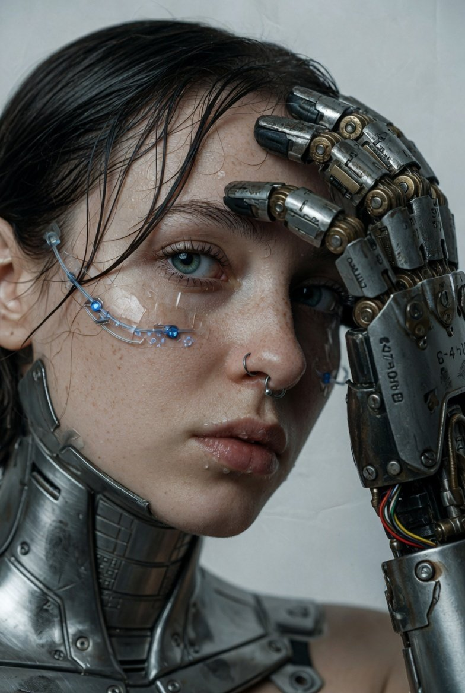</a> |

**프롬프트:**

```
Ultra-realistic cinematic close-up of a young woman with pale, freckled skin and wet dark hair. Her eyes are vivid blue-green and she wears a silver septum ring.
Cybernetics: A massive industrial robotic prosthetic arm with worn metal textures, visible wiring, and hydraulic components rests near her face, metallic fingers curved toward her temple.
A thin cybernetic sensor wire traces across her cheekbone just below the eye.
Her jawline and neck show embedded steel plating and brushed-metal body augmentations.

Background: Clean, neutral studio setting in muted grey-white.
Lighting: Soft front-left directional light casting detailed shadows across mechanical joints while catching moisture on skin and lips.
Mood: Raw, futuristic, and melancholic with a high-end editorial aesthetic.
Framing: Off-center composition, shallow focus on the eye and robotic hand texture detail.
Surface detail: Pores clearly visible, individual wet hair strands, scratched and oil-marked metal.
Color grade: Muted cool palette, high contrast. Photorealistic digital art style.
```

<!-- Case 309: 지중해 골목 햇살 인물 사진 (by @iamaiistudio) -->
### Case 309: [지중해 골목 햇살 인물 사진](https://x.com/iamaiistudio/status/2067474399431979223) (by [@iamaiistudio](https://x.com/iamaiistudio))

| 결과 |
| :----: |
| <a href="https://evolink.ai/gpt-image-2-prompts?utm_source=github&utm_medium=picture&utm_campaign=awesome-gpt-image-2-API-and-Prompts" target="_blank" rel="noopener noreferrer">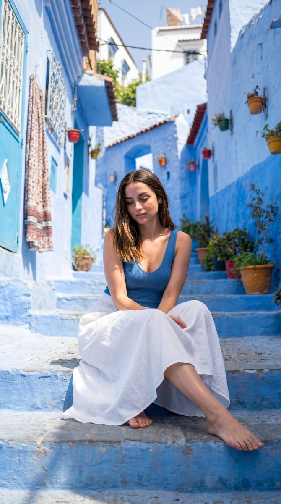</a> |

**프롬프트:**

```
Ultra-realistic photo of a woman seated on stone steps in a vibrant Mediterranean alley with vivid blue-painted walls, stairs, and buildings with white accents. She wears a blue fitted sleeveless top and a long flowing white skirt, barefoot, with a calm relaxed expression and eyes slightly downward. Long wavy hair falls naturally over her shoulders. Strong natural sunlight creates high contrast shadows and saturated colors. Shot from a slightly low front-facing angle with full body framing, sharp focus on subject against a detailed background of blue walls, hanging patterned fabric, small windows, and plants above. Highly saturated blues contrasted with natural white and skin tones, ultra-realistic textures, crisp shadows, realistic depth.
```

## 🎨 포스터 및 일러스트 사례

> **엄선된 사례 147개** — [모든 포스터 프롬프트 보기 →](cases/poster.md)

<!-- Case 214: Peacock Botanical Vintage Symmetrical Art Print (by @dotey) -->
### Case 214: [Peacock Botanical Vintage Symmetrical Art Print](https://x.com/dotey/status/2047803054422901046) (by [@dotey](https://x.com/dotey))

|                                                                                                                                                                                                        Output                                                                                                                                                                                                        |
| :------------------------------------------------------------------------------------------------------------------------------------------------------------------------------------------------------------------------------------------------------------------------------------------------------------------------------------------------------------------------------------------------------------------: |
| <a href="https://evolink.ai/gpt-image-2-prompts?utm_source=github&utm_medium=picture&utm_campaign=awesome-gpt-image-2-API-and-Prompts" target="_blank" rel="noopener noreferrer"></a> |

**Prompt:**

```
symmetrical design featuring two elegant blue peacocks with detailed feather patterns, surrounded by blue floral elements, intricate vintage botanical ornament, soft beige background, classical floral decor style with rich navy and sky blue details, decorative art illustration --ar 3:2
```

<!-- Case 214: Luxury Brand Ad Campaign Poster (by @TechieBySA) -->
### Case 214: [Luxury Brand Ad Campaign Poster](https://x.com/TechieBySA/status/2051676877794816074) (by [@TechieBySA](https://x.com/TechieBySA))

|                                                                                                                                                                                                 Output                                                                                                                                                                                                |
| :---------------------------------------------------------------------------------------------------------------------------------------------------------------------------------------------------------------------------------------------------------------------------------------------------------------------------------------------------------------------------------------------------: |
| <a href="https://evolink.ai/gpt-image-2-prompts?utm_source=github&utm_medium=picture&utm_campaign=awesome-gpt-image-2-API-and-Prompts" target="_blank" rel="noopener noreferrer"></a> |

**Prompt:**

```
A world-class luxury advertising campaign poster, 4:5 ratio, for [BRAND/PRODUCT], shot in a high-end photography studio, [COLOR] dramatic lighting with vivid color gels casting bold shadows, single hero product floating center frame with hyper-reflective surface catching light streaks, cinematic lens flare, deep rich background with gradient bloom, chrome and glass material feel, oversized bold editorial typography with the brand name, razor-sharp tagline in elegant thin font, extreme detail and texture on the product, smoke or liquid elements subtly in background, feels like Apple x Nike x Lamborghini had a campaign, shot on Hasselblad, photorealistic, magazine cover quality
```

<!-- Case 214: Food Photography with Doodle Characters (by @Taaruk_) -->
### Case 214: [Food Photography with Doodle Characters](https://x.com/Taaruk_/status/2051690647997088110) (by [@Taaruk_](https://x.com/Taaruk_))

|                                                                                                                                                                                                     Output                                                                                                                                                                                                    |
| :-----------------------------------------------------------------------------------------------------------------------------------------------------------------------------------------------------------------------------------------------------------------------------------------------------------------------------------------------------------------------------------------------------------: |
| <a href="https://evolink.ai/gpt-image-2-prompts?utm_source=github&utm_medium=picture&utm_campaign=awesome-gpt-image-2-API-and-Prompts" target="_blank" rel="noopener noreferrer"></a> |

**Prompt 1 (Beach café + cute doodle characters):**

```
Aesthetic beachside café scene with a wooden table overlooking the ocean, bright daylight, soft shadows, tropical vibe. A delicious bowl of food and a coconut drink placed on the table. Add cute illustrated cartoon characters (fox, bunny, cat) sitting and relaxing around the food, with tiny hand-drawn doodles (hearts, sparkles, motion lines). Cozy wholesome mood, playful storytelling, mix of real photography and 2D illustration overlay, soft warm color grading, shallow depth of field, ultra-realistic food details, 4K.
```

**Prompt 2 (Food flatlay + playful illustrated annotations):**

```
Top-down vibrant food flatlay featuring multiple crispy fried dishes (fish, shrimp, chicken) with dipping sauces on a dark textured table. Add playful hand-drawn doodles and tiny cartoon characters interacting with the food (surfing shrimp, holding signs, cooking, playing). Include fun handwritten labels like "Golden Crunch", "Perfect Pairing", "Champion Fish". Bright colors, high contrast, crispy texture details, steam effects, dynamic composition, social media food ad style, ultra-realistic, 4K.
```

**Prompt 3 (Cozy coffee + illustrated storytelling):**

```
Warm cozy coffee scene on a rustic wooden table with a cup of latte art on a yellow saucer, coffee beans and cinnamon sticks around, small bonsai plant nearby. Add cute animated doodle characters (coffee bean with wings, cat barista painting latte art) and flowing illustrated steam forming magical shapes. Include soft handwritten typography: "Crafted Comfort – Your Daily Ritual". Golden hour lighting, warm tones, soft glow, dreamy atmosphere, shallow depth of field, ultra-realistic + 2D illustration blend, 4K.
```

<!-- Case 214: Hand-Torn Editorial Collage (by @realsigridjin) -->

### Case 214: [Hand-Torn Editorial Collage](https://x.com/realsigridjin/status/2054368795121361249) (by [@realsigridjin](https://x.com/realsigridjin))

|                                                                                                                                                                                               Output                                                                                                                                                                                              |
| :-----------------------------------------------------------------------------------------------------------------------------------------------------------------------------------------------------------------------------------------------------------------------------------------------------------------------------------------------------------------------------------------------: |
| <a href="https://evolink.ai/gpt-image-2-prompts?utm_source=github&utm_medium=picture&utm_campaign=awesome-gpt-image-2-API-and-Prompts" target="_blank" rel="noopener noreferrer"></a> |

**Prompt:**

```
Transform the attached image into a collage artwork. Make it appear as if hand-torn from newspapers, magazines, and flyers and pasted. Every single expression should be completed using large, torn pieces of paper. Represent in detail the torn edges, wrinkles, overlaps, and glue marks on the paper. Use relatively large pieces of paper, not too small, and place them randomly at different angles and directions, with the paper orientation rotated haphazardly. Create it to look like an actual collage roughly hand-pasted by a person.
```

<!-- Case 214: Glowing Sailboat Night Illustration (by @churvikv) -->

### Case 214: [Glowing Sailboat Night Illustration](https://x.com/churvikv/status/2054315113587384469) (by [@churvikv](https://x.com/churvikv))

|                                                                                                                                                                                                   Output                                                                                                                                                                                                  |
| :-------------------------------------------------------------------------------------------------------------------------------------------------------------------------------------------------------------------------------------------------------------------------------------------------------------------------------------------------------------------------------------------------------: |
| <a href="https://evolink.ai/gpt-image-2-prompts?utm_source=github&utm_medium=picture&utm_campaign=awesome-gpt-image-2-API-and-Prompts" target="_blank" rel="noopener noreferrer"></a> |

**Prompt:**

```
A luminous sailboat, outlined in glowing golden light, floats serenely on dark, rippling water under a starry night sky. The sails, translucent and faintly blue, catch the ethereal light, while the hull is a solid, dark silhouette. Numerous tiny, twinkling golden stars are scattered across the black expanse above, and a crescent moon hangs softly to the right. Lush, vibrant green reeds and grasses sprout from smooth, grey stones in the foreground, their tips adorned with delicate, glowing golden florets. The water reflects the golden outline of the sailboat, creating a shimmering, warm glow that contrasts with the cool, deep darkness of the night. The scene is composed with a slightly low angle, emphasizing the majestic presence of the sailboat against the vastness of the night. The overall atmosphere is magical, tranquil, and dreamlike, evoking a sense of peaceful adventure and celestial wonder. The style is reminiscent of digital fantasy art with glowing neon accents.
```

<!-- Case 214: Istanbul Line-Art Travel Poster (by @miilesus) -->

### Case 214: [Istanbul Line-Art Travel Poster](https://x.com/miilesus/status/2054285276780929527) (by [@miilesus](https://x.com/miilesus))

|                                                                                                                                                                                                 Output                                                                                                                                                                                                |
| :---------------------------------------------------------------------------------------------------------------------------------------------------------------------------------------------------------------------------------------------------------------------------------------------------------------------------------------------------------------------------------------------------: |
| <a href="https://evolink.ai/gpt-image-2-prompts?utm_source=github&utm_medium=picture&utm_campaign=awesome-gpt-image-2-API-and-Prompts" target="_blank" rel="noopener noreferrer"></a> |

**Prompt:**

```
Create a minimalist ultra-high-resolution travel poster in line-art style for ISTANBUL, portraying the city as a stylish everyday urban scene rather than a tourist postcard.

MAIN COMPOSITION:

Central composition features Istanbul’s most iconic everyday urban scene — a lively tram street in Karaköy, Kadıköy, Beyoğlu, Eminönü, or a Bosphorus-side pedestrian avenue filled with daily life.

Foreground includes local residents, commuters, ferry passengers, café visitors, simit sellers, students, cyclists, street musicians, and shoppers naturally interacting within the city.

People should authentically reflect modern Istanbul street fashion, layered urban lifestyle, and contemporary Turkish culture.

Background filled with authentic Turkish signage, tea houses, bookstores, tram lines, ferry terminals, cafés, bakeries, fish restaurants, street lamps, mosques integrated into skyline, apartment façades, hanging laundry, cats, seagulls, and dense architectural textures.

Subtle landmarks blend naturally into daily life rather than dominating the composition — Galata Tower, Bosphorus ferries, nostalgic tram, mosque silhouettes, and waterfront railings should appear integrated into the urban rhythm.

Use authentic Turkish typography and culturally recognizable street elements.

Large centered title at the top: “ISTANBUL”

Subtitle at the bottom in Turkish: “Türkiye” or “İstanbul”

STYLE:

Ultra-clean vector illustration
Swiss modernist travel poster aesthetic
Minimalist line-art
Monoline drawing
Mid-century editorial illustration style
Architectural illustration
Contemporary Turkish graphic poster design
Crisp geometric perspective
Extremely clean negative space
Premium luxury travel-brand aesthetic
Highly organized visual density

LINE STYLE:

Monochrome line illustration only
Thin, highly precise lines
Minimal fill areas
Intricate city-map-level detailing
Rhythmic arrangement of tram cables, balconies, ferry rails, windows, signage, cats, street furniture, and waterfront architecture
Visually dense yet extremely balanced composition
Ultra-precise vector-quality rendering

COLOR SYSTEM — VERY IMPORTANT:

Use only ONE primary ink color + ONE background color
Automatically select the color pairing that best represents Istanbul’s atmosphere
Monochrome silkscreen poster aesthetic
No rainbow palettes
No excessive neon
Color should reflect Istanbul’s maritime atmosphere, historic architecture, ferry culture, and urban warmth
Recommended palette for Istanbul:
Deep Bosphorus navy ink on warm cream background

COMPOSITION:

Vertical poster layout
Frontal street-level perspective
Pedestrians naturally moving through tram streets, ferry exits, café terraces, and waterfront walkways
Balanced urban rhythm and architectural layering
Strong depth perspective with elegant negative space
Should feel like a premium global city-brand campaign poster

MOOD:

Stylish urban everyday life
Calm yet vibrant atmosphere
Sophisticated metropolitan energy
Timeless city identity
High-end travel magazine cover aesthetic
Minimalist yet ultra-detailed
Elegant Mediterranean-meets-modern urban mood

TEXT QUALITY — EXTREMELY IMPORTANT:

All typography must be clean, readable, and professionally designed
No random symbols
No broken or distorted letters
Turkish signage must appear authentic and natural
Editorial-grade typography hierarchy
Premium modernist poster layout

OUTPUT:

Vertical poster composition
Ultra-detailed 8K resolution
Print-ready
Ultra-precise vector-quality rendering
Luxury travel poster aesthetic
Museum-quality graphic design composition
```

<!-- Case 214: Dark Western Outlaw Poster (by @you1873118) -->

### Case 214: [Dark Western Outlaw Poster](https://x.com/you1873118/status/2054366009214316840) (by [@you1873118](https://x.com/you1873118))

|                                                                                                                                                                                              Output                                                                                                                                                                                              |
| :----------------------------------------------------------------------------------------------------------------------------------------------------------------------------------------------------------------------------------------------------------------------------------------------------------------------------------------------------------------------------------------------: |
| <a href="https://evolink.ai/gpt-image-2-prompts?utm_source=github&utm_medium=picture&utm_campaign=awesome-gpt-image-2-API-and-Prompts" target="_blank" rel="noopener noreferrer"></a> |

**Prompt:**

```
高级电影感西部亡命徒海报，竖版 2:3 构图，暗黑西部游戏角色设定海报风格。

一个神秘蒙面牛仔与黑马站在荒漠边境，人物全身正面，宽檐牛仔帽压低，花纹面巾遮住下半张脸，深色长发，黑色皮革手套，黑色西部夹克与多层皮革装备，子弹带、左轮枪套、金属腰带扣、厚重长靴，肩上披着红棕色几何图案披毯，边缘破损飘动。人物姿态冷静危险，一只手靠近枪套。右侧黑马半身入镜，带白色额纹，缰绳细节清晰。

背景是暴风雨中的西部荒漠，闪电、乌云、远处峡谷岩壁、枯树、沙尘、烟雾、火星、泥地反光，氛围压抑史诗。

画面左侧是复古羊皮纸留白，右侧是黑暗风暴场景，强烈明暗分割。加入大号竖排英文标题、通缉令信息、人物档案、坐标、地图网格、细线框、圆形罗盘图形、小红色标记、签名印章等高级海报排版元素。

风格：黑色墨迹飞溅、旧纸纹理、电影级写实、暗黑西部、强烈明暗对比、皮革和金属超细节、尘土、泥点、划痕、烟雾、火星、边缘轮廓光、高级收藏级游戏海报、荒野大镖客氛围、艺术设定集质感、8K、高细节。
```

<!-- Case 214: Anime Streetwear Mascot Poster (by @Taaruk_) -->

### Case 214: [Anime Streetwear Mascot Poster](https://x.com/Taaruk_/status/2054234237398851768) (by @Taaruk_)

|                                                                                                                                                                                                Output                                                                                                                                                                                                |
| :--------------------------------------------------------------------------------------------------------------------------------------------------------------------------------------------------------------------------------------------------------------------------------------------------------------------------------------------------------------------------------------------------: |
| <a href="https://evolink.ai/gpt-image-2-prompts?utm_source=github&utm_medium=picture&utm_campaign=awesome-gpt-image-2-API-and-Prompts" target="_blank" rel="noopener noreferrer"></a> |

**Prompt:**

```
Stylized anime streetwear brand poster of a fast-food mascot character, full-body dynamic pose, highly detailed manga/anime illustration, modern urban fashion outfit inspired by the restaurant brand colors and identity, oversized hoodie, tactical straps, sneakers, chains, branded accessories, holding signature food item, bold graphic typography, editorial magazine layout, Japanese text elements, logos, promotional stickers, menu-style side panels, grunge textures, paint splashes, distressed paper background, collectible poster aesthetic, cyber street fashion meets commercial advertising, vibrant red/orange/black/white color palette, dramatic lighting, ultra detailed line art, cel-shaded anime rendering, energetic composition, high contrast, trendy hypebeast vibe, futuristic fast-food campaign art, iconic mascot redesign, layered collage graphics, branding everywhere on clothing and background, premium anime poster quality, vertical composition, sharp shadows, dynamic perspective, stylish and playful attitude.
```

<!-- Case 214: Wildlife Infographic Reference Poster (by @sha_zdiii) -->

### Case 214: [Wildlife Infographic Reference Poster](https://x.com/sha_zdiii/status/2054229209460117552) (by @sha_zdiii)

|                                                                                                                                                                                                    Output                                                                                                                                                                                                   |
| :---------------------------------------------------------------------------------------------------------------------------------------------------------------------------------------------------------------------------------------------------------------------------------------------------------------------------------------------------------------------------------------------------------: |
| <a href="https://evolink.ai/gpt-image-2-prompts?utm_source=github&utm_medium=picture&utm_campaign=awesome-gpt-image-2-API-and-Prompts" target="_blank" rel="noopener noreferrer"></a> |

**Prompt:**

```
.

Create a premium cinematic wildlife infographic poster centered around a rare or visually unique animal species such as (animal). The entire artwork must feel like a futuristic luxury wildlife dossier rather than a normal educational infographic.
The animal should dominate the composition with intense photorealistic detail: ultra-detailed fur/scales, realistic eyes, moisture textures, cinematic shadows, environmental interaction, dramatic posture, visible muscle definition, floating particles, and powerful eye contact.
The environment must fully match the chosen species: (environment).
Build dense layered infographic storytelling around the animal using: • anatomy callouts
• adaptation systems
• prey and diet visuals
• ecosystem overlays
• conservation status indicators
• geographic range maps
• hunting behavior graphics
• climate danger visuals
• detail inserts
• tactical icon systems
• scientific labels and compact data snippets
The layout should feel highly artistic and cinematic instead of educational. Use: • asymmetric editorial composition
• layered transparent info panels
• premium typography
• subtle paper grain textures
• contour-line overlays
• holographic UI elements
• cinematic infographic markers
• museum-grade visual hierarchy
Blend: (luxury editorial aesthetic) + (cinematic documentary realism) + (futuristic infographic design) + (collectible field-guide energy).
Color Theme: (color theme)
Mood: (mood)
Lighting: dramatic cinematic lighting, volumetric fog, glowing rim light, atmospheric haze, realistic environmental reflections, high contrast shadows, ultra-premium editorial lighting.
The final artwork must look like a viral collectible wildlife poster people would instantly save, repost, print, and frame.
Ultra-realistic, 8K, cinematic infographic masterpiece, insanely detailed, premium art direction, tactile textures, layered storytelling, emotional visual impact, museum-quality composition, viral social-media-worthy aesthetic.
```

<!-- Case 214: Ancient Civilization Miniature Diorama (by @Naiknelofar788) -->

### Case 214: [Ancient Civilization Miniature Diorama](https://x.com/Naiknelofar788/status/2054221110372405534) (by @Naiknelofar788)

|                                                                                                                                                                                                    Output                                                                                                                                                                                                    |
| :----------------------------------------------------------------------------------------------------------------------------------------------------------------------------------------------------------------------------------------------------------------------------------------------------------------------------------------------------------------------------------------------------------: |
| <a href="https://evolink.ai/gpt-image-2-prompts?utm_source=github&utm_medium=picture&utm_campaign=awesome-gpt-image-2-API-and-Prompts" target="_blank" rel="noopener noreferrer"></a> |

**Prompt:**

```
A highly detailed miniature diorama of an ancient civilization under construction, displayed directly on top of large rolled-out architectural blueprints spread across a realistic wooden drafting table. The scene features iconic historical architecture from [CIVILIZATION OR LOCATION], including partially completed monuments, temples, towers, walls, palaces, streets, or ceremonial structures at different stages of construction. Tiny craftsmen, builders, engineers, and workers interact naturally throughout the scene using historically accurate tools, scaffolding, ramps, cranes, carts, stone blocks, timber frameworks, and construction platforms.
The miniature terrain blends seamlessly into the printed engineering drawings beneath, combining realistic sand, stone, earth, marble, vegetation, or desert textures with visible architectural floor plans, elevation sketches, measurements, annotations, and cross-sections. Surrounding the workspace are drafting instruments, compasses, rolled parchment plans, books, rulers, brass weights, candles, maps, carving tools, and historical reference materials that enhance the workshop atmosphere.
Soft cinematic lighting with warm natural sunlight from a nearby window, shallow depth of field, ultra realistic textures, handcrafted museum-quality scale model aesthetic, intricate miniature detailing, photoreal materials, atmospheric realism, editorial architectural photography style, clean composition, immersive world-building, vertical composition, extremely high detail, realistic shadows, authentic historical mood.
```

<!-- Case 214: Japanese Fashion Collage Poster (by @Mind_Boticni) -->

### Case 214: [Japanese Fashion Collage Poster](https://x.com/Mind_Boticni/status/2054203134411739609) (by [@Mind_Boticni](https://x.com/Mind_Boticni))

|                                                                                                                                                                                                 Output                                                                                                                                                                                                |
| :---------------------------------------------------------------------------------------------------------------------------------------------------------------------------------------------------------------------------------------------------------------------------------------------------------------------------------------------------------------------------------------------------: |
| <a href="https://evolink.ai/gpt-image-2-prompts?utm_source=github&utm_medium=picture&utm_campaign=awesome-gpt-image-2-API-and-Prompts" target="_blank" rel="noopener noreferrer"></a> |

**Prompt:**

```
Cinematic vertical collage featuring a Japanese woman in elegant fashion captured during golden sunset. Background composed of warm-toned rounded storyboard frames arranged diagonally, each showing soft monochrome motion scenes—running fingers through hair, walking on bridge, looking at skyline, soft smile in wind. The main subject is in rich color with glowing sunset highlights, wearing flowing rust-orange designer dress with natural fabric movement. Emotional storytelling mood, romantic cinematic tone, high-end fashion editorial poster style.
```

<!-- Case 214: Bangkok Swiss Typography Poster (by @Shorelyn_) -->

### Case 214: [Bangkok Swiss Typography Poster](https://x.com/Shorelyn_/status/2054196121980002523) (by @Shorelyn_)

|                                                                                                                                                                                                 Output                                                                                                                                                                                                |
| :---------------------------------------------------------------------------------------------------------------------------------------------------------------------------------------------------------------------------------------------------------------------------------------------------------------------------------------------------------------------------------------------------: |
| <a href="https://evolink.ai/gpt-image-2-prompts?utm_source=github&utm_medium=picture&utm_campaign=awesome-gpt-image-2-API-and-Prompts" target="_blank" rel="noopener noreferrer"></a> |

**Prompt:**

```
Create an ultra-high-resolution Swiss modernist typography travel poster for BANGKOK THAILAND in a premium 16:9 layout.

CORE CONCEPT:
A massive bold condensed sans-serif word “BANGKOK” dominates the center composition.
Each individual letter acts as a precise geometric window containing minimalist flat-vector illustrations of iconic Bangkok landmarks and authentic urban life scenes.

INSIDE THE LETTERS INCLUDE:

Grand Palace

Wat Arun

Wat Pho

Chao Phraya River

Tuk-tuks

BTS Skytrain

Long-tail boats

Chinatown signage

Rooftop bars

Street food stalls

Temple roofs

Bangkok modern skyline

The scenes inside each letter must transition seamlessly across the typography, creating one continuous panoramic urban narrative while preserving perfectly clean letter edges and flawless typography integrity.

TOP PANORAMIC RIBBON:
At the very top edge of the poster, create a thin elegant panoramic strip showing:

Bangkok skyline silhouette

BTS train

River boats

Birds

Palm trees

Cars and scooters

Stylized tropical sun

Minimal clouds

STYLE & AESTHETIC:
Swiss Graphic Design meets Mid-Century Modern travel poster aesthetics.
Flat vector illustration only.
Architectural infographic precision.
100% clean geometric shapes.
No gradients.
No photorealism.
No textures.
No grain.
No AI distortion.
No warped typography.

VISUAL EXECUTION:

Sharp vector edges

Sophisticated negative space

Balanced composition

Minimalist architectural detailing

Precise geometric shadows

Museum-grade poster quality

Editorial luxury aesthetic

COLOR PALETTE:
Muted premium Southeast Asian palette inspired by Bangkok:

River teal

Warm coral

Tropical gold

Ivory

Slate blue

Soft terracotta

BACKGROUND:
Soft ivory or premium warm white background.

TYPOGRAPHY:
Professional kerning and spacing.
Perfectly legible text.
Human-designed graphic identity feel.
Large title:
“BANGKOK”
Small elegant subtitle underneath:
“THAILAND”

ATMOSPHERE:
Intellectual, calm, avant-garde, collectible luxury travel poster found in a museum design store.

OUTPUT:
Ultra-detailed 8K vector-style rendering, ultra sharp print-ready quality, high-end editorial poster design.
```

<!-- Case 214: Miniature Travel World Poster (by @Goodmanprotocol) -->

### Case 214: [Miniature Travel World Poster](https://x.com/Goodmanprotocol/status/2054074803381018750) (by [@Goodmanprotocol](https://x.com/Goodmanprotocol))

|                                                                                                                                                                                                Output                                                                                                                                                                                               |
| :-------------------------------------------------------------------------------------------------------------------------------------------------------------------------------------------------------------------------------------------------------------------------------------------------------------------------------------------------------------------------------------------------: |
| <a href="https://evolink.ai/gpt-image-2-prompts?utm_source=github&utm_medium=picture&utm_campaign=awesome-gpt-image-2-API-and-Prompts" target="_blank" rel="noopener noreferrer"></a> |

**Prompt:**

```
A cinematic hyper-detailed miniature travel diorama resting inside an open human palm, themed around [CITY/COUNTRY NAME] tourism and travel. A realistic passport and official travel visa card stand upright in the center of a tiny landscape inspired by the destination, surrounded by miniature travelers with luggage, scattered suitcases, local vegetation, iconic cultural elements, and detailed environmental textures matching the location. In the background, the famous skyline and landmark architecture of [CITY/COUNTRY NAME] rise softly with atmospheric depth, while the national flag waves beside the documents. A commercial airplane flies overhead in a bright blue sky with soft clouds. Ultra-realistic textures, shallow depth of field, warm sunlight, soft cinematic shadows, macro photography style, tilt-shift miniature effect, vibrant tourism atmosphere, highly detailed handcrafted diorama aesthetic, realistic skin texture on the hand, premium travel advertisement look --ar 1:1
```

<!-- Case 214: Japanese Graffiti Portrait (by @iamaiistudio) -->

### Case 214: [Japanese Graffiti Portrait](https://x.com/iamaiistudio/status/2054714863885394325) (by @iamaiistudio)

|                                                                                                                                                                                              Output                                                                                                                                                                                              |
| :----------------------------------------------------------------------------------------------------------------------------------------------------------------------------------------------------------------------------------------------------------------------------------------------------------------------------------------------------------------------------------------------: |
| <a href="https://evolink.ai/gpt-image-2-prompts?utm_source=github&utm_medium=picture&utm_campaign=awesome-gpt-image-2-API-and-Prompts" target="_blank" rel="noopener noreferrer"></a> |

**Prompt:**

```
Design a high-detail portrait poster in a bold Japanese graffiti-inspired art style that fuses modern urban street aesthetics with expressive Japanese visual culture. Pack the poster with dynamic graffiti typography, layered spray-paint textures, hand-drawn motifs, abstract paint splashes, neon brush strokes, urban sticker elements, Japanese calligraphy accents, and decorative ornaments that amplify the energetic mood. Keep the overall composition artistic, rebellious, fashionable, and visually striking, yet still polished to premium editorial poster quality, never messy or overdone. The subject should NOT copy the exact pose or expression from any reference image. Instead, invent an entirely new pose that feels natural, confident, and alive. The expression should read as emotionally expressive, charismatic, and engaging, never stiff, awkward, flat, or blank. The pose should carry the elegance and sophistication of an international fashion model, with stylish posture, natural movement, and a subtle attitude that elevates the cinematic fashion vibe. The outfit must be contemporary, stylish, casual fashion with strong visual appeal. Skip plain or repetitive clothing. Lean into fashionable layering, modern streetwear inspiration, premium casual styling, and a balanced mix of colors, patterns, textures, and fabrics for a rich, non-monotonous look. The clothing should feel trendy, fashionable, youthful, and visually premium, while still belonging inside the Japanese graffiti poster concept. Fill the background and poster decorations with thematic urban Japanese-inspired elements: graffiti walls, spray textures, painted symbols, urban signage, layered stickers, modern Japanese graphic motifs, abstract shapes, paint drips, street fashion aesthetics, and stylish decorative compositions that deepen the artistic intensity without distracting from the subject. Lighting should feel cinematic and fashionable, with strong contrast, clean highlights, realistic skin texture, and high-end editorial poster quality. The final result must look like a premium modern street-fashion campaign poster, with highly detailed textures, balanced composition, vibrant color harmony, realistic proportions, ultra-sharp focus, and immersive visual storytelling. Ultra-detailed, highly aesthetic, premium composition, realistic texture rendering, fashionable urban atmosphere, cinematic quality, poster-ready design, 8K ultra high resolution. #AIart #GPTImage2
```

<!-- Case 214: Playlist Mood Album Cover (by @getimg_ai) -->

### Case 214: [Playlist Mood Album Cover](https://x.com/getimg_ai/status/2054654412547629350) (by [@getimg_ai](https://x.com/getimg_ai))

|                                                                                                                                                                                              Output                                                                                                                                                                                             |
| :---------------------------------------------------------------------------------------------------------------------------------------------------------------------------------------------------------------------------------------------------------------------------------------------------------------------------------------------------------------------------------------------: |
| <a href="https://evolink.ai/gpt-image-2-prompts?utm_source=github&utm_medium=picture&utm_campaign=awesome-gpt-image-2-API-and-Prompts" target="_blank" rel="noopener noreferrer"></a> |

**Prompt:**

```
Create an album cover inspired by this playlist: [playlist], translating its mood into colors, textures, objects, and cinematic composition, with no artist names. https://t.co/t1efbQ9sgP
```

<!-- Case 214: Play-Doh City Editorial (by @Goodmanprotocol) -->

### Case 214: [Play-Doh City Editorial](https://x.com/Goodmanprotocol/status/2054629670239502408) (by @Goodmanprotocol)

|                                                                                                                                                                                             Output                                                                                                                                                                                            |
| :-------------------------------------------------------------------------------------------------------------------------------------------------------------------------------------------------------------------------------------------------------------------------------------------------------------------------------------------------------------------------------------------: |
| <a href="https://evolink.ai/gpt-image-2-prompts?utm_source=github&utm_medium=picture&utm_campaign=awesome-gpt-image-2-API-and-Prompts" target="_blank" rel="noopener noreferrer"></a> |

**Prompt:**

```
Create an ultra-charming 3:4 editorial illustration of a five-year-old child sitting at a cozy craft table, happily building a handmade Play-Doh miniature [City Name]. The entire world must clearly look sculpted by a real child using colorful Play-Doh clay - soft rounded shapes, uneven geometry, tiny fingerprints, squished textures, slightly crooked buildings, playful proportions, imperfect symmetry, and adorable handcrafted charm. The miniature city should include recognizable landmarks, bridges, rivers, cafés, food stalls, apartment buildings, parks, trains, buses, tiny clay people, trees, clouds, and playful neighborhood scenes. Dense with delightful micro-details while remaining organized and cozy. The child should feel authentic and natural, wearing casual everyday clothing with a curious, proud expression. Avoid stereotypes or costume-like styling. Visual style: premium children’s editorial illustration, soft claymation-inspired rendering, miniature diorama photography mood, whimsical storytelling, high-end family travel magazine aesthetic, ultra detailed, handcrafted warmth. Lighting & color: bright neutral daylight, soft diffused natural indoor lighting, airy Scandinavian editorial mood, crisp whites, fresh pastel Play-Doh palette, slightly cool-neutral white balance, clean highlights, luminous soft shadows. Avoid yellow tint, orange cast, sepia tone, moody cinematic lighting, neon oversaturation, or dark shadows. The city must feel genuinely handmade by a talented five-year-old - playful, imperfect, emotional, and imaginative, never like professional miniature modeling or hyperreal sculpture. No fake text, logos, watermarks, AI artifacts, hyperreal architecture, or over-polished miniature aesthetics. Bottom-right corner: small handwritten white crayon sentence: Let’s play in [City Name] The handwriting should feel naturally childlike, cute, uneven, and readable.
```

<!-- Case 214: 3D Liquid Art Poster (by @92digitalartArt) -->

### Case 214: [3D Liquid Art Poster](https://x.com/92digitalartArt/status/2054597084473422099) (by [@92digitalartArt](https://x.com/92digitalartArt))

|                                                                                                                                                                                           Output                                                                                                                                                                                           |
| :----------------------------------------------------------------------------------------------------------------------------------------------------------------------------------------------------------------------------------------------------------------------------------------------------------------------------------------------------------------------------------------: |
| <a href="https://evolink.ai/gpt-image-2-prompts?utm_source=github&utm_medium=picture&utm_campaign=awesome-gpt-image-2-API-and-Prompts" target="_blank" rel="noopener noreferrer"></a> |

**Prompt:**

```
A mesmerizing and explosively colorful vertical poster featuring giant 3D liquid fluid sculpture forms, enormous glossy morphing blob shapes in vivid electric colors — a massive melting form in hot magenta pink flowing and dripping downward, intersecting with a giant swirling wave of electric cobalt blue, a third liquid mass in neon lime green curling upward like a breaking ocean wave, all three liquid forms colliding at the center in a spectacular splash explosion with hundreds of flying colorful droplets frozen mid-air, each liquid surface rendered with a perfect mirror-glossy finish reflecting the surrounding colors in dazzling distorted highlights, the background a clean bright white making the vivid color explosions pop with maximum visual impact, smaller floating 3D geometric shapes — spheres cubes and diamonds — in candy yellow coral orange and violet orbiting the main liquid forms, bold heavy rounded white typography outlined in black at the top reading "LET IT FLOW" in massive bouncy letters, smaller subtitle below "Create without limits", tiny spark and splash symbols scattered as accents, ultra-saturated maximum color impact, premium 3D render quality, 9:16 vertical ratio
```

<!-- Case 214: Isometric Travel Poster (by @iamaiistudio) -->

### Case 214: [Isometric Travel Poster](https://x.com/iamaiistudio/status/2054593748085215513) (by @iamaiistudio)

|                                                                                                                                                                                             Output                                                                                                                                                                                            |
| :-------------------------------------------------------------------------------------------------------------------------------------------------------------------------------------------------------------------------------------------------------------------------------------------------------------------------------------------------------------------------------------------: |
| <a href="https://evolink.ai/gpt-image-2-prompts?utm_source=github&utm_medium=picture&utm_campaign=awesome-gpt-image-2-API-and-Prompts" target="_blank" rel="noopener noreferrer"></a> |

**Prompt:**

```
Design a vertical retro mid-century travel poster of [CITY NAME] showcasing [LANDMARK]. Stick to a tight 3-color scheme: cream-toned paper background, black technical line drawing, plus one [COLOR] accent. Aesthetic: minimalist isometric top-down aerial perspective with very fine cross-hatching and silkscreen print grain. Color rules: fill the entire sky in flat solid [COLOR], add small [COLOR] touches on rooftops or street details. Zero gradients allowed. Typography: large bold sans-serif "[CITY NAME]" at the top in cream, with the city's name in its native language set smaller in cream beneath it. #AIart #GPTImage2
```

<!-- Case 214: Vintage Travel Postage Stamp (by @iamsofiaijaz) -->

### Case 214: [Vintage Travel Postage Stamp](https://x.com/iamsofiaijaz/status/2054530631187788035) (by [@iamsofiaijaz](https://x.com/iamsofiaijaz))

|                                                                                                                                                                                               Output                                                                                                                                                                                               |
| :------------------------------------------------------------------------------------------------------------------------------------------------------------------------------------------------------------------------------------------------------------------------------------------------------------------------------------------------------------------------------------------------: |
| <a href="https://evolink.ai/gpt-image-2-prompts?utm_source=github&utm_medium=picture&utm_campaign=awesome-gpt-image-2-API-and-Prompts" target="_blank" rel="noopener noreferrer"></a> |

**Prompt:**

```
Vintage travel postage stamp design featuring [CITY / COUNTRY], ultra-detailed illustrated souvenir stamp, elegant art deco typography spelling “[NAME]” across the center in large ornate serif letters, iconic landmarks and skyline of [PLACE], traditional cultural architecture, scenic local elements, palm trees / boats / streets / mountains depending on location, warm cinematic lighting, soft pastel sky, retro airmail aesthetics, aged paper texture, engraved print style, luxurious vintage tourism poster feel, intricate ornamental borders, postal cancellation mark with local language and English text, “3.50 AED” denomination, symmetrical composition, highly detailed linework, muted [COLOR PALETTE] color scheme, nostalgic philatelic artwork, premium collectible stamp aesthetic, realistic shading, textured ink print, retro travel poster style, 4k illustration, highly detailed vintage engraving.
```

<!-- Case 214: Vintage Paper Collage Set (by @Sairah_0) -->

### Case 214: [Vintage Paper Collage Set](https://x.com/Sairah_0/status/2054502531628486758) (by @Sairah_0)

|                                                                                                                                                                                              Output                                                                                                                                                                                             |
| :---------------------------------------------------------------------------------------------------------------------------------------------------------------------------------------------------------------------------------------------------------------------------------------------------------------------------------------------------------------------------------------------: |
| <a href="https://evolink.ai/gpt-image-2-prompts?utm_source=github&utm_medium=picture&utm_campaign=awesome-gpt-image-2-API-and-Prompts" target="_blank" rel="noopener noreferrer"></a> |

**Prompt:**

```
Aesthetic vintage paper collage portrait of a stylish woman taking a mirror selfie, made entirely from torn magazine and newspaper pieces, layered mixed-media artwork, neutral beige and brown tones, Vogue-inspired fashion editorial style, black sunglasses, sleek ponytail hairstyle, white corset top, silver jewelry, purple smartphone, textured ripped paper edges, handcrafted mosaic effect, realistic shadows and depth, chic typography cutouts, inspirational quotes scattered around, cozy luxury aesthetic, highly detailed analog collage art, soft warm lighting, Instagram moodboard vibe, premium editorial composition, ultra detailed, 4k Prompt : Vintage breakfast aesthetic collage made from torn magazine and newspaper clippings, artistic mixed-media paper mosaic style, croissants on a plate with jam, black coffee in a dark cup, fresh fruits and berries, butter dish with knife, café table atmosphere, dark green textured background, ripped paper layers with visible cracks and folds, lifestyle editorial typography, cozy European café vibe, warm earthy tones, handcrafted scrapbook look, realistic paper texture, aesthetic Pinterest moodboard composition, soft cinematic lighting, luxury brunch aesthetic, ultra detailed, high realism, 4k collage art style
```

<!-- Case 214: Cubist Kawaii Vector Portrait (by @ChillaiKalan__) -->

### Case 214: [Cubist Kawaii Vector Portrait](https://x.com/ChillaiKalan__/status/2054457447142805832) (by [@ChillaiKalan__](https://x.com/ChillaiKalan__))

|                                                                                                                                                                                                Output                                                                                                                                                                                               |
| :-------------------------------------------------------------------------------------------------------------------------------------------------------------------------------------------------------------------------------------------------------------------------------------------------------------------------------------------------------------------------------------------------: |
| <a href="https://evolink.ai/gpt-image-2-prompts?utm_source=github&utm_medium=picture&utm_campaign=awesome-gpt-image-2-API-and-Prompts" target="_blank" rel="noopener noreferrer"></a> |

**Prompt:**

```
Create a cute neo-expressionist cubist minimal vector portrait illustration, Picasso meets kawaii minimalism, inspired by stylized fashion editorials and playful modern art. Ultra-simplified exaggerated facial features with oversized abstract eyes, flat cartoon eye shapes, minimal black dots or single curved strokes, no realistic iris details, no eyelashes, extremely reduced facial detail. Tiny abstract nose drawn with one short angular line. Small single-stroke lips, tiny soft geometric mouth shape, minimal expression marks, no realistic mouth anatomy. Rounded cheeks, dreamy innocent expression, playful asymmetrical proportions, elongated elegant neck, simplified geometric facial planes, stylized angular hair shapes, subtle caricature aesthetics, childlike artistic distortion. Use clean scalable vector shapes, flat color blocking, bold primitive contour lines, sharp Bézier curves, abstract polygon composition, minimal linework, naive handmade drawing quality, expressive empty space, icon-like facial abstraction, no realistic rendering, 2D primitive facial symbols. Add subtle oil pastel grain overlays, rough handmade brush accents, raw scribbled handwritten marks, visible pigment texture, silkscreen poster feeling. Vibrant limited color palette against deep matte black background. Luxury editorial gallery poster composition, contemporary fashion illustration, artsy modern cubist poster, stylish and adorable, premium print-ready vector artwork.
```

<!-- Case 214: Trash Polka Headphones Portrait (by @ChillaiKalan__) -->

### Case 214: [Trash Polka Headphones Portrait](https://x.com/ChillaiKalan__/status/2054390412253827522) (by @ChillaiKalan__)

|                                                                                                                                                                                                 Output                                                                                                                                                                                                |
| :---------------------------------------------------------------------------------------------------------------------------------------------------------------------------------------------------------------------------------------------------------------------------------------------------------------------------------------------------------------------------------------------------: |
| <a href="https://evolink.ai/gpt-image-2-prompts?utm_source=github&utm_medium=picture&utm_campaign=awesome-gpt-image-2-API-and-Prompts" target="_blank" rel="noopener noreferrer"></a> |

**Prompt:**

```
​A high-detail digital painting of a young woman wearing large, vibrant red over-ear headphones, looking directly at the viewer with a piercing gaze. The art style is a fusion of stylized realism and urban abstract expressionism. Her hair is messy, light brown/blonde with loose strands and sharp, geometric shards integrated into the locks. The composition features heavy ink splatters, paint drips, and chaotic red and black brushstrokes reminiscent of 'trash polka' art. The background is a clean, minimalist off-white, making the bold red accents and fine linework pop. High contrast, sharp focus on the eyes, cinematic lighting, 8k resolution, trendy street art aesthetic. ​Key Technical Elements to Capture ​Color Palette: Dominated by Red, Black, and White. This high-contrast triad is essential for that aggressive, modern look. ​Artistic Influence: Mentioning "Trash Polka" or "Ink Drip Art" helps the AI understand the messy, splatter-heavy background and the "shattered" look of the hair. ​Character Features: Use terms like "piercing gaze" and "stylized realism" to ensure the face isn't too cartoonish or too photographic, hitting that perfect "concept art" middle ground. ​Graphic Elements: The image uses geometric shards and abstract textures overlapping the subject, which creates a sense of depth and digital glitchiness. Aspect ratio is 9:16
```

<!-- Case 214: 3D Typography Travel Poster (by @Naiknelofar788) -->

### Case 214: [3D Typography Travel Poster](https://x.com/Naiknelofar788/status/2054390259115536874) (by @Naiknelofar788)

|                                                                                                                                                                                               Output                                                                                                                                                                                              |
| :-----------------------------------------------------------------------------------------------------------------------------------------------------------------------------------------------------------------------------------------------------------------------------------------------------------------------------------------------------------------------------------------------: |
| <a href="https://evolink.ai/gpt-image-2-prompts?utm_source=github&utm_medium=picture&utm_campaign=awesome-gpt-image-2-API-and-Prompts" target="_blank" rel="noopener noreferrer"></a> |

**Prompt:**

```
Create a 3:2 premium 3D typography-based travel poster for [CITY], using luxury editorial destination advertising fused with realistic sculptural letterform architecture. The city name “[CITY]” must be the dominant subject, occupying most of the canvas. Build the letters as large, realistic, three-dimensional sculptural forms made from glossy painted material, polished ceramic, soft plaster, carved stone, sunlit architectural surfaces, or city-adaptive materials. Each letter should physically transform into the city’s identity: landmarks, skyline silhouettes, arches, towers, domes, bridges, windows, balconies, cultural patterns, coastal forms, or street details must grow directly out of the letterforms. Landmarks should feel architecturally integrated, not pasted behind or around the word. A tower may rise from a vertical stem, a bridge may connect two letters, a dome may form the curve of a rounded letter, rooftops may shape the top edges, and windows or ornamental details may be embedded into the letter faces. Use a low-angle three-quarter camera view so the typography feels monumental, cinematic, premium, and friendly. Place the 3D city-name sculpture slightly low in the frame, filling the central and lower portions of the poster, with generous negative space above. At the top header, add a refined horizontal row of faded landmark symbols related to the city: tiny vector icons, or translucent architectural glyphs. Keep them very soft, elegant, and secondary, like premium magazine header details. Add each landmark name below its icon. Keep all faded and premium. Remove any visible sun from the top-left corner. Use bright natural daylight with a soft key light from the upper-left, gentle fill light, clean highlights, subtle ambient occlusion, and soft contact shadows beneath the letters. The lighting should feel cheerful, fresh, and editorial, not dark or overly cinematic. Use a bright city-adaptive palette based on [CITY]: coastal cities use aqua, coral, cream, and sunny yellow; historic cities use warm stone, terracotta, olive, and soft sky blue; tropical cities use turquoise, mango, palm green, and white; mountain cities use alpine blue, meadow green, snow white, and golden warmth; nightlife cities use violet, cyan, peach, and amber. Keep colors clean, optimistic, premium, and controlled. Add subtle editorial text elements to improve the poster: small uppercase header text such as “DESTINATION SERIES”, a tiny location code like “CITY / 01”, delicate vertical divider lines, a minimal footer line such as “VISIT [CITY]”, and small microtype coordinates or issue number near the bottom edge. These text elements must remain quiet and secondary so the large 3D city name stays the hero. Background should be clean and spacious with a soft sky gradient, delicate clouds, or abstract color field only. Do not place extra landmarks in the background; all major city identity must come from the typography itself, except the faded symbolic header row. Style: premium editorial travel advertising, luxury magazine cover, realistic 3D typographic sculpture, bright modern optimism, cheerful wanderlust, cultural identity, clean art direction. Negative prompt: avoid generic travel posters, separate landmark collages, landmarks pasted behind text, flat typography, cluttered backgrounds, visible sun in the top-left corner, excessive icons, dark cinematic lighting, muddy colors, cheap souvenir aesthetics, unreadable city name, distorted letters, random gradients, noisy textures, stock-template layouts, and overdecorated tourist graphics.
```

👉 **모든 포스터 및 일러스트 프롬프트 사례 보기 →**

<!-- Case 214: 泳装时尚杂志四宫格 (by @Adam38363368936) -->
### Case 214: [泳装时尚杂志四宫格](https://x.com/Adam38363368936/status/2055819711066316883) (by [@Adam38363368936](https://x.com/Adam38363368936))

|                                                                                                                                                                                      Output                                                                                                                                                                                     |
| :-----------------------------------------------------------------------------------------------------------------------------------------------------------------------------------------------------------------------------------------------------------------------------------------------------------------------------------------------------------------------------: |
| <a href="https://evolink.ai/gpt-image-2-prompts?utm_source=github&utm_medium=picture&utm_campaign=awesome-gpt-image-2-API-and-Prompts" target="_blank" rel="noopener noreferrer"></a> |

**Prompt:**

```
泳装时尚杂志广告页面，4:3 ，日本模特， S型曲线，【颜色】色系。（变换姿势和风格，四宫格展示）
```

<!-- Case 214: Monochrome Caricature Portrait Sheet (by @Noor_ul_ain43) -->
### Case 214: [Monochrome Caricature Portrait Sheet](https://x.com/Noor_ul_ain43/status/2055796848552755579) (by [@Noor_ul_ain43](https://x.com/Noor_ul_ain43))

|                                                                                                                                                                                                   Output                                                                                                                                                                                                   |
| :--------------------------------------------------------------------------------------------------------------------------------------------------------------------------------------------------------------------------------------------------------------------------------------------------------------------------------------------------------------------------------------------------------: |
| <a href="https://evolink.ai/gpt-image-2-prompts?utm_source=github&utm_medium=picture&utm_campaign=awesome-gpt-image-2-API-and-Prompts" target="_blank" rel="noopener noreferrer"></a> |

**Prompt:**

```
A stylized black-and-white pencil ink caricature portrait sheet featuring two distinct charismatic characters with contrasting face shapes and expressions. Drawn in a loose sketchbook style with visible construction lines, rough pencil strokes, expressive exaggerated facial proportions, modern caricature illustration aesthetic.

Left character: handsome charismatic man with messy hair, sharp jawline, confident smirk, expressive sideways eyes, slim long face, casual t-shirt.

Right character: muscular bald man with raised eyebrow, thick neck, strong jawline, dominant confident expression, casual t-shirt.

Minimal shading, thin crosshatching, clean line art, monochrome aesthetic, white background, artistic character design concept sketch, highly detailed hand-drawn look, playful exaggerated anatomy, professional caricature sketch style
```

<!-- Case 214: 星河入梦 3D CG 插画 (by @liyue_ai) -->
### Case 214: [星河入梦 3D CG 插画](https://x.com/liyue_ai/status/2055679355242844462) (by [@liyue_ai](https://x.com/liyue_ai))

|                                                                                                                                                                                        Output                                                                                                                                                                                       |
| :---------------------------------------------------------------------------------------------------------------------------------------------------------------------------------------------------------------------------------------------------------------------------------------------------------------------------------------------------------------------------------: |
| <a href="https://evolink.ai/gpt-image-2-prompts?utm_source=github&utm_medium=picture&utm_campaign=awesome-gpt-image-2-API-and-Prompts" target="_blank" rel="noopener noreferrer"></a> |

**Prompt:**

```
一位成年东方幻想系女性角色，梦幻星河仙女风，3D CG 高精度插画质感，9:16 竖版构图，画面充满全息星河、流光粒子、银河丝带与柔雾光晕。

人物位于画面中央偏左，半身到大腿视角，身体呈优雅的 S 型动态站姿。她的上半身微微向一侧倾斜，腰部自然收束并轻轻扭转，胯部向相反方向形成柔和弧线，一侧肩膀略微抬起，另一侧肩膀自然放松，整体姿态像在星河中缓慢旋转，既轻盈又具有女性柔美。头部微微低垂，脸部呈三分之二侧脸，眼神温柔、安静、梦幻，神情清冷而优雅。

她拥有精致柔和的东方幻想系五官，白皙通透的肌肤，肌肤带有柔和的次表面散射与珍珠般高光，面部轮廓干净细腻，鼻梁纤细，嘴唇柔软，睫毛纤长。长发为淡银白色与浅粉紫色渐变，发丝被星风吹起，向画面右侧大面积飘散，形成流动感极强的弧线，与人物 S 型身体曲线相互呼应。

服装是一件梦幻星河礼裙，材质轻盈透明但保持优雅克制，肩部为柔软薄纱结构，胸口与腰部有银河般的渐变流光纹理，颜色以浅粉、淡蓝、薰衣草紫、珍珠白为主，局部点缀金色星尘。裙身像星云与薄纱融合而成，轻盈飘动，围绕人物身体形成螺旋状流光带，强调腰线、肩颈线与整体 S 型姿态，但不刻意暴露。

背景是梦幻宇宙星河空间，整体色调为淡粉色、浅蓝色、薰衣草紫与柔金色，充满细密星光、星尘粒子、银河流线、半透明全息光带。光线从左上方柔和洒下，在人物发丝、肩颈、脸颊和礼裙边缘形成温柔轮廓光。画面空气感强，光晕柔和，整体像漂浮在银河梦境中。

构图要求：
人物身体线条呈明显但自然的 S 型曲线；
肩、腰、胯形成柔和的反向动态；
头发与星河丝带共同形成环绕式流动；
画面保留大量梦幻光雾与星尘；
人物优雅、柔美、梦幻、高级；
重点表现女性身姿的柔和曲线、星河仙女气质与高级幻想感。

风格关键词：
dreamy fantasy girl, celestial goddess, galaxy dress, holographic starlight, soft pastel colors, ethereal beauty, elegant S-curve pose, cinematic lighting, ultra detailed 3D CG, soft glow, translucent silk, star particles, romantic fantasy atmosphere, high-end illustration, 16K detail, vertical poster composition

负面提示词：
身体比例错误，畸形手指，多手指，多手臂，脸部崩坏，眼睛不对称，廉价质感，灰蒙蒙，脏色调，过度锐化，低清晰度，杂乱背景，文字，水印，logo
```

<!-- Case 214: Character Profile Sheet (by @iamsofiaijaz) -->
### Case 214: [Character Profile Sheet](https://x.com/iamsofiaijaz/status/2055633103973134719) (by @iamsofiaijaz)

|                                                                                                                                                                                             Output                                                                                                                                                                                            |
| :-------------------------------------------------------------------------------------------------------------------------------------------------------------------------------------------------------------------------------------------------------------------------------------------------------------------------------------------------------------------------------------------: |
| <a href="https://evolink.ai/gpt-image-2-prompts?utm_source=github&utm_medium=picture&utm_campaign=awesome-gpt-image-2-API-and-Prompts" target="_blank" rel="noopener noreferrer"></a> |

**Prompt:**

```
A stylish illustrated character profile sheet of a handsome young man sketchbook aesthetic, mixed media ink and watercolor style, highly detailed fashion portrait, messy dark curly hair, sharp blue eyes, short beard, confident expression, wearing a long black trench coat, dark casual clothes, brown leather backpack, rugged boots.
The page layout includes multiple poses and close-up portraits, surrounded by handwritten notes, doodles, symbols, travel sketches, cameras, mountains, coding references, and adventure elements.
Personality board design with handwritten text such as traveler, coder, photographer, teacher, sound engineer, Scorpio zodiac sign, river rafting, creative ideas, life goals, motivational notes.
Includes small chibi version of the character, laptop working scene, rafting action scene, map sketches, stars, arrows, and artistic scribbles.
Modern concept art meets fashion illustration, dynamic ink strokes, expressive line art, textured watercolor shading, warm paper background, cinematic composition, Pinterest aesthetic, highly detailed, visually rich, creative journal vibe, character design sheet, semi-realistic comic illustration.
```

<!-- Case 214: Korean Editorial Fashion Moodboard (by @Mind_Boticni) -->
### Case 214: [Korean Editorial Fashion Moodboard](https://x.com/Mind_Boticni/status/2055627790255587483) (by @Mind_Boticni)

|                                                                                                                                                                                                  Output                                                                                                                                                                                                  |
| :------------------------------------------------------------------------------------------------------------------------------------------------------------------------------------------------------------------------------------------------------------------------------------------------------------------------------------------------------------------------------------------------------: |
| <a href="https://evolink.ai/gpt-image-2-prompts?utm_source=github&utm_medium=picture&utm_campaign=awesome-gpt-image-2-API-and-Prompts" target="_blank" rel="noopener noreferrer"></a> |

**Prompt:**

```
Create an ultra-realistic luxury fashion moodboard poster in a premium Korean editorial magazine style. A beautiful young woman stands elegantly in the center wearing a flowing ivory floral chiffon maxi dress with layered translucent fabric, tiny embroidered flowers, delicate lace trims, and soft movement in the fabric. Over it she wears a textured handmade mustard crochet cardigan with oversized sleeves and cozy vintage stitching details. She has long voluminous dark wavy hair with soft curtain bangs, glowing radiant skin, glossy peach makeup, subtle freckles, soft shimmer eyelids, glossy nude lips, and delicate gold jewelry including layered necklaces, pearl rings, and slim bracelets. She wears elegant cream lace-up heels and carries a handcrafted crochet tote bag decorated with sunflower charms, daisy patches, mini ribbons, tiny plush keychains, and aesthetic beads.
The background is a bright warm editorial studio with creamy beige gradients, golden sunlight rays, subtle shadows, soft reflections, floating dust particles, and dreamy glowing highlights. The layout should feel like a realistic Pinterest luxury collage board with clean spacing and balanced composition.
Around the character include many small scrapbook-inspired collage sections:

– close-up beauty portraits

– sunflower photography

– perfume bottle flatlays

– jewelry editorials

– cozy café lifestyle moments

– fashion accessories

– handwritten diary pieces

– soft fabric texture swatches

– vintage books

– coffee cups

– aesthetic shoes

– makeup close-ups

– hair inspiration photos

– dried flower arrangements

– cute doodles and tiny heart sketches

– polaroid-style frames

– paper tape pieces

– editorial magazine snippets
Typography should be very small, elegant, subtle, and blended naturally into the layout like luxury fashion magazine captions. Use tiny serif text such as: “golden aura”, “soft bloom”, “editorial notes”, “mood archive”, and “daily elegance”. Text must never dominate the image.
Overall aesthetic: warm, feminine, luxurious, ultra detailed, realistic photography, soft dreamy atmosphere, premium Korean fashion magazine moodboard, cinematic lighting, highly aesthetic Pinterest composition, rich textures, airy and bright color palette.
```


<!-- Case 215: Floating Island Travel Poster (by @Naiknelofar788) -->
### Case 215: [Floating Island Travel Poster](https://x.com/Naiknelofar788/status/2056551186610966530) (by @Naiknelofar788)

|                                                                                                                                                                                                Output                                                                                                                                                                                                |
| :--------------------------------------------------------------------------------------------------------------------------------------------------------------------------------------------------------------------------------------------------------------------------------------------------------------------------------------------------------------------------------------------------: |
| <a href="https://evolink.ai/gpt-image-2-prompts?utm_source=github&utm_medium=picture&utm_campaign=awesome-gpt-image-2-API-and-Prompts" target="_blank" rel="noopener noreferrer"></a> |

**Prompt:**

```
Create a premium 9:16 hyper-realistic travel-poster of [COUNTRY NAME] in the same style as a luxury editorial miniature-map diorama: show the country as a recognizable floating island map with dramatic cliff edges, crystal-clear water, soft clouds, and a pure white  background. Use a clean, elegant poster layout with large culturally appropriate typography for “[COUNTRY NAME]” at the top, using a font style inspired by the country’s identity, history, script, or visual culture, plus a short refi
```

<!-- Case 216: Vintage Monochrome City Travel Poster (by @Taaruk_) -->
### Case 216: [Vintage Monochrome City Travel Poster](https://x.com/Taaruk_/status/2056577980349264028) (by @Taaruk_)

|                                                                                                                                                                                                Output                                                                                                                                                                                                |
| :--------------------------------------------------------------------------------------------------------------------------------------------------------------------------------------------------------------------------------------------------------------------------------------------------------------------------------------------------------------------------------------------------: |
| <a href="https://evolink.ai/gpt-image-2-prompts?utm_source=github&utm_medium=picture&utm_campaign=awesome-gpt-image-2-API-and-Prompts" target="_blank" rel="noopener noreferrer"></a> |

**Prompt:**

```
Vintage monochrome city travel poster illustration, detailed urban sketch aesthetic, clean architectural line art mixed with soft watercolor shading, modern Southeast Asian city atmosphere, minimalist green-and-cream color palette, elegant travel poster typography, large bold city name at the top, bilingual typography with Asian characters, highly detailed street life scene, busy urban crossroads, flyovers, buses, motorcycles, cafes, local restaurants, pedestrians crossing streets, shopping mall
```

<!-- Case 217: Flat-Vector City Lifestyle Collage (by @Goodmanprotocol) -->
### Case 217: [Flat-Vector City Lifestyle Collage](https://x.com/Goodmanprotocol/status/2056612365156978731) (by @Goodmanprotocol)

|                                                                                                                                                                                                Output                                                                                                                                                                                                |
| :--------------------------------------------------------------------------------------------------------------------------------------------------------------------------------------------------------------------------------------------------------------------------------------------------------------------------------------------------------------------------------------------------: |
| <a href="https://evolink.ai/gpt-image-2-prompts?utm_source=github&utm_medium=picture&utm_campaign=awesome-gpt-image-2-API-and-Prompts" target="_blank" rel="noopener noreferrer"></a> |

**Prompt:**

```
Create a sophisticated flat-vector editorial pattern illustration of [Melbourne], composed as a seamless lifestyle-art collage combining iconic landmarks, local culture, vacation scenes, and symbolic city objects.
```

<!-- Case 218: Sci-Fi Character Concept Sheet (by @0kncn) -->
### Case 218: [Sci-Fi Character Concept Sheet](https://x.com/0kncn/status/2056372978607174077) (by @0kncn)

|                                                                                                                                                                                                Output                                                                                                                                                                                                |
| :--------------------------------------------------------------------------------------------------------------------------------------------------------------------------------------------------------------------------------------------------------------------------------------------------------------------------------------------------------------------------------------------------: |
| <a href="https://evolink.ai/gpt-image-2-prompts?utm_source=github&utm_medium=picture&utm_campaign=awesome-gpt-image-2-API-and-Prompts" target="_blank" rel="noopener noreferrer"></a> |

**Prompt:**

```
Create a 16:9 character concept sheet for a celestial voyager in an epic cinematic sci-fi fantasy aesthetic.
```

<!-- Case 219: Pixar 3D Character Design Sheet (by @TechieBySA) -->
### Case 219: [Pixar 3D Character Design Sheet](https://x.com/TechieBySA/status/2056419585369198677) (by @TechieBySA)

|                                                                                                                                                                                                Output                                                                                                                                                                                                |
| :--------------------------------------------------------------------------------------------------------------------------------------------------------------------------------------------------------------------------------------------------------------------------------------------------------------------------------------------------------------------------------------------------: |
| <a href="https://evolink.ai/gpt-image-2-prompts?utm_source=github&utm_medium=picture&utm_campaign=awesome-gpt-image-2-API-and-Prompts" target="_blank" rel="noopener noreferrer"></a> |

**Prompt:**

```
“Create a Pixar 3D style character design sheet. Clean white background. Two characters side by side with a clean dividing line. Bold brushstroke-style title at the top: CHAD VS THE GYM MIRROR. Subtitle beneath: One way mirror. One audience. Zero awareness.
LEFT SIDE — CHAD
Large name in bold black. Underneath: “Just needed a quick pump check.”
Hero portrait — Chad isolated on clean white. No background. Pixar 3D man, late 20s, natural athletic build — genuinely fit but not cartoonishly huge. Ne
```

<!-- Case 220: Vintage Travel Collage Poster (by @sdhilip) -->
### Case 220: [Vintage Travel Collage Poster](https://x.com/sdhilip/status/2056261616967270640) (by @sdhilip)

|                                                                                                                                                                                                Output                                                                                                                                                                                                |
| :--------------------------------------------------------------------------------------------------------------------------------------------------------------------------------------------------------------------------------------------------------------------------------------------------------------------------------------------------------------------------------------------------: |
| <a href="https://evolink.ai/gpt-image-2-prompts?utm_source=github&utm_medium=picture&utm_campaign=awesome-gpt-image-2-API-and-Prompts" target="_blank" rel="noopener noreferrer"></a> |

**Prompt:**

```
Vintage mixed-media travel collage poster, portrait orientation, themed around [COUNTRY].
```

<!-- Case 221: Premium Travel Infographic Poster (by @Ankit_patel211) -->
### Case 221: [Premium Travel Infographic Poster](https://x.com/Ankit_patel211/status/2056519161023787394) (by @Ankit_patel211)

|                                                                                                                                                                                                Output                                                                                                                                                                                                |
| :--------------------------------------------------------------------------------------------------------------------------------------------------------------------------------------------------------------------------------------------------------------------------------------------------------------------------------------------------------------------------------------------------: |
| <a href="https://evolink.ai/gpt-image-2-prompts?utm_source=github&utm_medium=picture&utm_campaign=awesome-gpt-image-2-API-and-Prompts" target="_blank" rel="noopener noreferrer"></a> |

**Prompt:**

```
Create an ultra-premium editorial travel infographic poster about FRANCE in a clean vertical 3:4 ratio.
```

<!-- Case 222: 9-Frame Cinematic Storyboard Grid (by @guicastellanos1) -->
### Case 222: [9-Frame Cinematic Storyboard Grid](https://x.com/guicastellanos1/status/2056425976763146366) (by @guicastellanos1)

|                                                                                                                                                                                                Output                                                                                                                                                                                                |
| :--------------------------------------------------------------------------------------------------------------------------------------------------------------------------------------------------------------------------------------------------------------------------------------------------------------------------------------------------------------------------------------------------: |
| <a href="https://evolink.ai/gpt-image-2-prompts?utm_source=github&utm_medium=picture&utm_campaign=awesome-gpt-image-2-API-and-Prompts" target="_blank" rel="noopener noreferrer"></a> |

**Prompt:**

```
for GPT-2:
Create a single image storyboard with 9 cinematic frames arranged in a  3×3 grid. Each frame is a widescreen 16:9 panel with a film aspect ratio  letterbox. Style: ultra-cinematic sci-fi blockbuster mixed with premium  airline commercial. Think Blade Runner 2049 color grading meets a UEFA  Champions League broadcast opener meets a luxury brand TVC.
```

<!-- Case 223: Vintage 1960s Beer Ad Poster (by @Goodmanprotocol) -->
### Case 223: [Vintage 1960s Beer Ad Poster](https://twitter.com/Goodmanprotocol/status/2056791983717503015) (by [@Goodmanprotocol](https://x.com/Goodmanprotocol))

| Output |
| :----: |
| <a href="https://evolink.ai/gpt-image-2-prompts?utm_source=github&utm_medium=readme&utm_campaign=awesome-gpt-image-2-prompts" target="_blank" rel="noopener noreferrer"></a> |

**Prompt:**

```
Authentic 1960s American advertising poster for [BREW], vintage mid-century commercial illustration, [PERSON DESCRIPTION] holding a frosty glass bottle of [BREW], bright optimistic lifestyle scene, nostalgic Americana atmosphere, bold [COLOR 1] and [COLOR 2] color palette, elegant retro typography, the text “[BREW]” prominently integrated into the poster design, authentic screen print texture, subtle paper grain, hand-painted illustration style, vintage Madison Avenue advertising aesthetic, clean composition, highly detailed, warm cinematic lighting, premium poster design, authentic 1960s print imperfections, painterly realism, soft brushwork, vertical composition 4:5
```

<!-- Case 224: Cinematic Director's Pitch Board (by @Mind_Boticni) -->
### Case 224: [Cinematic Director's Pitch Board](https://twitter.com/Mind_Boticni/status/2056793598243553464) (by [@Mind_Boticni](https://x.com/Mind_Boticni))

| Output |
| :----: |
| <a href="https://evolink.ai/gpt-image-2-prompts?utm_source=github&utm_medium=readme&utm_campaign=awesome-gpt-image-2-prompts" target="_blank" rel="noopener noreferrer"></a> |

**Prompt:**

```
A premium director’s pitch presentation board for a high-budget cinematic production, showcasing a single, grounded human character with intense emotional readability and natural imperfections. The layout is art-directed and organically asymmetrical, avoiding rigid grids. Features a fluid, narrative full-body turnaround (capturing the character mid-stride across front, 3/4, profile, and rear views), detailed candid head studies expressing internal conflict, and a sweeping cinematic close-up portrait with dramatic Rembrandt lighting. Includes integrated texture macro-crops (weathered leather, realistic skin pores, distressed linen), minimalist production annotations, and an organic height scale. Shot on 35mm anamorphic, shallow depth of field, muted color grading, ultra-realistic textures, strict character and wardrobe consistency throughout.
```

<!-- Case 225: Viral Food Infographic Poster (by @amynys) -->
### Case 225: [Viral Food Infographic Poster](https://twitter.com/amynys/status/2056779657987387784) (by [@amynys](https://x.com/amynys))

| Output |
| :----: |
| <a href="https://evolink.ai/gpt-image-2-prompts?utm_source=github&utm_medium=readme&utm_campaign=awesome-gpt-image-2-prompts" target="_blank" rel="noopener noreferrer"></a> |

**Prompt:**

```
Create a cinematic viral-style food poster for “Prediabetic Friendly Strawberry Cheesecake Overnight Oats” in a clean modern infographic aesthetic inspired by trendy TikTok and Pinterest recipe posters.

The poster should feature a large realistic mason jar filled with creamy strawberry cheesecake overnight oats layered with visible chia seeds, sliced strawberries around the inside glass, a thick cheesecake yogurt layer on top, fresh strawberries, and crushed walnuts. The oats should look ultra creamy, indulgent, healthy, and photorealistic with soft natural lighting and shallow depth of field.
Use a soft pink, cream, and white color palette with bold typography.
The design should feel premium, feminine, modern, healthy, and social-media viral.

Main headline in large stylish text:
“STRAWBERRY Cheesecake OVERNIGHT OATS”
Add a pink label at the top saying:
“PREDIABETIC FRIENDLY”

Include stylish infographic sections with rounded boxes and cute minimal icons for:
INGREDIENTS
½ cup rolled oats
¾ cup unsweetened almond milk
⅓ cup plain Greek yogurt
1 tbsp chia seeds
1 tbsp ground flaxseed
½ scoop vanilla protein powder
½ tsp vanilla extract
Dash of cinnamon
Tiny pinch sea salt
3–4 chopped strawberries
Optional monk fruit sweetener or stevia

CHEESECAKE LAYER
Greek yogurt
Vanilla
Lemon juice
TOPPINGS
Crushed walnuts
Strawberries
Cinnamon

HOW TO MAKE
Mix ingredients
Fold in strawberries
Refrigerate overnight
Add cheesecake layer and toppings

Add aesthetic handwritten doodles, hearts, arrows, sparkles, and notes like:
“Creamy, delicious & blood sugar friendly!”
“High protein • High fiber • Low sugar”
At the bottom add a highlighted tip banner saying:
“VIRAL TEXTURE TIP: Blend the mixture before refrigerating for ultra-creamy cheesecake consistency!”

Style details:
Editorial food photography
Pinterest/TikTok infographic vibe
Clean magazine-style layout
Hyperrealistic food texture
Bright airy background
Soft shadows
Elegant typography hierarchy
Social-media-ready vertical poster
Ultra detailed
4K quality
Aspect ratio 4:5 or 9:16
```

<!-- Case 226: 2x2 Luxury 3D Sculptural Poster (by @Gdgtify) -->
### Case 226: [2x2 Luxury 3D Sculptural Poster](https://twitter.com/Gdgtify/status/2056649309312160193) (by [@Gdgtify](https://x.com/Gdgtify))

| Output |
| :----: |
| <a href="https://evolink.ai/gpt-image-2-prompts?utm_source=github&utm_medium=readme&utm_campaign=awesome-gpt-image-2-prompts" target="_blank" rel="noopener noreferrer"></a> |

**Prompt:**

```
INPUT: [DOMAIN OR CATEGORY]  SYSTEM: Generate a 2×2 luxury poster series translating four AI-inferred icons into automotive-finish 3D sculptural forms. Let cultural gravity select the four; do not hardcode identities. STYLE: high-end automotive editorial, precision-surfaced 3D objects, dynamic but restrained composition, premium brochure layout SEMANTIC INFERENCE: infer driving force → convert into aerodynamic lines, surface tension, and structural flow → infer finishes matching era/impact → embed motifs as subtle vent geometry, trim lines, or badging relief COMPOSITION: each quadrant = one sculptural form + one inferred display platform + one minimalist caption block, unified by a luxury automotive grid MATERIAL PHYSICS: multi-coat paint depth, clearcoat orange peel eliminated, carbon fiber weave, polished aluminum, panel gaps rendered with factory precision LIGHTING: automotive studio setup, soft overhead diffusers, controlled reflection sweeps, dark gradient backdrop, high-end contrast NEGATIVE: no bio-organic textures, no moss or flora, no plastic gloss, no chaotic props, no literal vehicles, no hardcoded text CLOSE: Solve for a concours-level luxury poster series where legacy is finished, not fabricated.
```

<!-- Case 227: Physics Infographic Code Prompt (by @Gdgtify) -->
### Case 227: [Physics Infographic Code Prompt](https://twitter.com/Gdgtify/status/2056841574798295540) (by [@Gdgtify](https://x.com/Gdgtify))

| Output |
| :----: |
| <a href="https://evolink.ai/gpt-image-2-prompts?utm_source=github&utm_medium=readme&utm_campaign=awesome-gpt-image-2-prompts" target="_blank" rel="noopener noreferrer"></a> |

**Prompt:**

```
16:9 -> class theoretical_physics_infographic_dna: def __init__(self): self.subject = "[ai selects: 4 distinct advanced physics theorems or paradoxes (e.g., bell's theorem, hawking radiation, string theory)]" self.parents = { "composition_parent": "large hadron collider blueprints — hyper-complex radial symmetry, intersecting particle beam rings, millimeter-precise drafting", "atmosphere_parent": "deep space observatory photography — pitch black voids, glowing ultraviolet radiation, high-contrast laser illumination", "graphic_parent": "chalkboard maximalism — elegant, dense mathematical notation floating as glowing white vectors", "detail_parent": "victorian brass optical instruments — finely milled prisms, glass lenses, and mirrored refraction planes" } self.mutations = { "medium_mutation": "the mathematical formulas solidify into glowing, three-dimensional glass sculptures bending the light around them", "information_mutation": "particle collision tracks are woven like fine gold thread through the dark background", "semantic_mutation": "the invisible physical law is rendered as a massive, tangible, gravitational machine distorting the grid of the poster itself" } def generate_grid(self): instruction = """ generate a 2x2 grid of vertical luxury infographic posters giving physical form to the chosen [subject]s. invent a magnificent scientific machine or optical diorama for each. explode the layers to show quantum states, gravitational warping, equations, and subatomic scale. the design must feel like a classified schematic from a hyper-advanced, aesthetically obsessed civilization. semantic inference must make the invisible laws of physics breathtakingly visible. """ return render( instruction, format="2x2 grid, vertical luxury posters, conceptual scientific infographic", typography=""" large title: [name of theorem/paradox] subtitle: [the physicist / the era] microtext: [the core equation / metric tensor / explanatory blazon] """, composition="strict radial or gravitational-well symmetry. razor-sharp fine lines contrasting with deep voids.", lighting="harsh, clinical laser light interacting with pure optical glass and vantablack.", constraints="no cartoon atoms, no clip-art planets, no messy chalkboards. only pristine, museum-grade scientific aesthetic." )
```


<!-- Case 228: Football Player Dynamic Poster (by @harboriis) -->
### Case 228: [Football Player Dynamic Poster](https://x.com/harboriis/status/2057296163972567081) (by [@harboriis](https://x.com/harboriis))

| Output |
| :----: |
| <a href="https://evolink.ai/gpt-image-2-prompts?utm_source=github&utm_medium=readme&utm_campaign=awesome-gpt-image-2-prompts" target="_blank" rel="noopener noreferrer"></a> |

**Prompt:**

```
A dynamic mixed-media football poster featuring James Rodríguez in Colombia’s national team colors, designed with a bold street-art editorial aesthetic. The composition blends realistic sports photography with layered urban graphic design elements. Background features a gritty city basketball-court wall covered in oversized graffiti murals, torn posters, paint drips, neon spray textures, stickers, marker tags, and distressed concrete textures in yellow, blue, and red tones. James stands in an explosive action pose controlling the ball mid-motion, illuminated by dramatic cinematic lighting and colorful urban reflections. Typography: massive hand-painted graffiti lettering reading “JAMES RODRÍGUEZ” integrated diagonally across the composition with rough brush textures and paint splatter overlap. Add layered halftone dots, motion streaks, comic-book speed effects, urban doodles, ripped-paper collage textures, and bold geometric accents. Style feels like a fusion of Nike World Cup campaign visuals, Hypebeast editorial design, Latin American street culture, and modern football social-media posters. High contrast, energetic, rebellious, chaotic but premium composition. Ultra-detailed 4K digital artwork, trendy sports poster aesthetic, vibrant urban color grading.
```

<!-- Case 229: Travel Food Advertisement Poster (by @Naiknelofar788) -->
### Case 229: [Travel Food Advertisement Poster](https://x.com/Naiknelofar788/status/2057282710469767241) (by [@Naiknelofar788](https://x.com/Naiknelofar788))

| Output |
| :----: |
| <a href="https://evolink.ai/gpt-image-2-prompts?utm_source=github&utm_medium=readme&utm_campaign=awesome-gpt-image-2-prompts" target="_blank" rel="noopener noreferrer"></a> |

**Prompt:**

```
Ultra-detailed premium travel-food advertisement poster for [CITY/COUNTRY], vertical composition, inspired by luxury Lay’s-style chips advertising. A realistic chips packet placed at the bottom center as the main hero object, matching the exact premium commercial layout of a floating chips campaign.
```

<!-- Case 230: Vintage Watercolor Travel Poster (by @Taaruk_) -->
### Case 230: [Vintage Watercolor Travel Poster](https://x.com/Taaruk_/status/2057298831289761976) (by [@Taaruk_](https://x.com/Taaruk_))

| Output |
| :----: |
| <a href="https://evolink.ai/gpt-image-2-prompts?utm_source=github&utm_medium=readme&utm_campaign=awesome-gpt-image-2-prompts" target="_blank" rel="noopener noreferrer"></a> |

**Prompt:**

```
Minimalist vintage travel poster in delicate watercolor and ink sketch style, elegant European travel illustration, soft neutral tones on textured ivory paper background, hand-painted cityscape with loose watercolor washes, fine architectural pen linework, cozy café storefronts, bicycles, cobblestone streets, flower-filled balconies, classic street lamps, soft atmospheric perspective, cinematic morning light, dreamy travel journal aesthetic, sophisticated typography layout with large serif country/city title at the top, handwritten subtitle and poetic tagline, small passport-style stamps, elegant editorial composition, airy negative space, timeless travel magazine design.
Scene variations: • London  rainy streets, red double-decker bus, black taxi, Big Ben in the background, cozy bookstore café, Portobello Road signage, muted gray-beige palette with soft red accents. • Greece  whitewashed Santorini alleyways, blue domes, bougainvillea flowers, seaside café, Mediterranean sunlight, bright white and soft ocean blue palette. • Switzerland alpine lakeside town, snowy mountains, vintage tram, Swiss flags, luxury café terraces, peaceful European old-town atmosphere. • Australia Melbourne-style tram street, jacaranda trees with purple blossoms, sunny café culture, modern-meets-vintage urban scenery.
```

<!-- Case 231: Retro Cafe Scrapbook Poster (by @j_smeaton99) -->
### Case 231: [Retro Cafe Scrapbook Poster](https://x.com/j_smeaton99/status/2057295551327347035) (by [@j_smeaton99](https://x.com/j_smeaton99))

| Output |
| :----: |
| <a href="https://evolink.ai/gpt-image-2-prompts?utm_source=github&utm_medium=readme&utm_campaign=awesome-gpt-image-2-prompts" target="_blank" rel="noopener noreferrer"></a> |

**Prompt:**

```
Whimsical retro cafe scrapbook poster, dreamy pistachio rose latte aesthetic, layered iced pistachio drink with rose cream foam and milk gradients, ultra-realistic beverage photography blended with hand-drawn journal doodles, soft watercolor marker sketches, playful handwritten cafe notes, tiny arrows and ingredient callouts, sticker-book collage composition, pastel stationery aesthetic, cozy Korean cafe moodboard style, textured paper scraps and washi tape layers, sparkles, bows, cherries, and tiny floral doodles surrounding the drink, trendy Pinterest-inspired cafe branding, warm natural window lighting, creamy foam textures with realistic condensation droplets, rich pistachio green paired with blush pink and cream tones, detailed ice cubes and glass reflections, modern Gen Z dessert-shop aesthetic, artistic flatlay composition with cute props like mini spoons, cookies, flowers, and polaroid snapshots, editorial social-media-ready food poster vibe, ultra detailed, soft dreamy color palette, stylish lifestyle cafe photography.
```

<!-- Case 232: Blueberry Lavender Soda Scrapbook Poster (by @john_my07) -->
### Case 232: [Blueberry Lavender Soda Scrapbook Poster](https://x.com/john_my07/status/2057417084259487783) (by [@john_my07](https://x.com/john_my07))

| Output |
| :----: |
| <a href="https://evolink.ai/gpt-image-2-prompts?utm_source=github&utm_medium=readme&utm_campaign=awesome-gpt-image-2-prompts" target="_blank" rel="noopener noreferrer"></a> |

**Prompt:**

```
Vintage-inspired blueberry lavender soda scrapbook poster, dreamy artisanal cafe advertisement aesthetic, sparkling layered blueberry soda with lavender cream foam and translucent ice cubes, ultra-realistic beverage photography blended with playful hand-drawn doodles and pastel marker sketches, fizzy carbonation bubbles visible through the glass, soft purple-to-blue gradient drink tones with creamy white foam top, whimsical handwritten cafe notes and tiny ingredient arrows, sticker-book collage layout with torn paper textures and washi tape accents, cozy Korean dessert cafe moodboard style, delicate lavender flower doodles, bows, stars, tiny moons, blueberries, and sparkles surrounding the drink, textured notebook paper scraps layered organically across the composition, trendy Pinterest-inspired beverage branding, warm cinematic natural window lighting, glossy condensation droplets and realistic glass reflections, editorial flatlay cafe photography mixed with journal-style illustrations, cute props like vintage spoons, blueberry pastries, mini flowers, recipe cards, cassette tapes, and polaroid snapshots, nostalgic Gen Z cafe aesthetic with Y2K undertones, dreamy soft-focus atmosphere, highly detailed scrapbook composition, artistic social-media-ready dessert shop poster vibe, soft pastel lavender, dusty blue, cream, and silver color palette, stylish lifestyle cafe photography, premium editorial food advertisement aesthetic.
```

<!-- Case 233: Scientific Concept Anchor Poster (by @Gdgtify) -->
### Case 233: [Scientific Concept Anchor Poster](https://x.com/Gdgtify/status/2057297076032262574) (by [@Gdgtify](https://x.com/Gdgtify))

| Output |
| :----: |
| <a href="https://evolink.ai/gpt-image-2-prompts?utm_source=github&utm_medium=readme&utm_campaign=awesome-gpt-image-2-prompts" target="_blank" rel="noopener noreferrer"></a> |

**Prompt:**

```
Anchor: The word "[SCIENTIFIC CONCEPT (e.g.,  CARBON / DNA / GRAVITY)]" :: where each  letter is constructed from the molecular  structure, atomic bonds, or physical  diagrams associated with that concept ::4  Morphology: DNA — letters formed from  double helix ladder rungs and backbone  curves. CARBON — letters built from  benzene ring hexagons and bond lines.  GRAVITY — letters curve and stretch  as if pulled toward a point mass,  lower strokes elongated by gravitational  lensing. All fully readable ::3  Material Physics: Scientific whiteboard  aesthetic — white chalk or marker on  dark ground. Or blueprint blue with  white diagrammatic linework ::3  Illumination: Flat, even, academic —  as if projected on a lecture screen ::2  Render Stack: Science magazine cover,  university poster, Ted Talk title card ::1  Negative: [photorealistic molecular  renders, 3D shading, color-coded  atoms in standard CPK colors,  realistic laboratory imagery] :: -1
```

<!-- Case 234: Editorial Fashion Poster (by @zulkarnaimx) -->
### Case 234: [Editorial Fashion Poster](https://x.com/zulkarnaimx/status/2057500045713506318) (by [@zulkarnaimx](https://x.com/zulkarnaimx))

| Output |
| :----: |
| <a href="https://evolink.ai/gpt-image-2-prompts?utm_source=github&utm_medium=readme&utm_campaign=awesome-gpt-image-2-prompts" target="_blank" rel="noopener noreferrer"></a> |

**Prompt:**

```
Editorial fashion poster featuring a full-body, stylish male model leaning casually against a light stone column in an upscale urban setting, wearing a slim-fit black button-down shirt tucked into tailored camel chinos with a slight cuff and a brown leather belt, polished dark brown leather loafers, classic black sunglasses and a minimalist wristwatch. Compose with generous left-side negative space reserved for bold typography and graphic elements: large stacked headline "BLACK + CAMEL" in black and camel tones, three-word tagline "WARM • TIMELESS • EFFORTLESS," two circular color swatches (black and camel), and small outfit icons with labels for "black shirt," "camel chinos," and "brown loafers." Warm, natural golden-hour light with soft shadows, shallow depth of field, sharp subject, soft bokeh background.
```

<!-- Case 235: High Fashion Editorial Infographic Poster (by @Hope_Ai01) -->
### Case 235: [High Fashion Editorial Infographic Poster](https://x.com/Hope_Ai01/status/2057367851905040849) (by [@Hope_Ai01](https://x.com/Hope_Ai01))

| Output |
| :----: |
| <a href="https://evolink.ai/gpt-image-2-prompts?utm_source=github&utm_medium=readme&utm_campaign=awesome-gpt-image-2-prompts" target="_blank" rel="noopener noreferrer"></a> |

**Prompt:**

```
A high-fashion editorial infographic poster featuring a stunning female fashion model standing confidently in the center against a clean luxury studio background. She is wearing an elegant Indo-Western fusion outfit — a richly embroidered long ethnic jacket fused with a modern fitted silhouette, stylish draped skirt/palazzo, intricate patterns, premium fabric textures, contemporary jewelry, and designer heels. The model looks glamorous, confident, and runway-ready. Around the model, create a professional fashion design chart layout with stylish annotation lines and labels pointing toward different outfit elements. Mention detailed fashion notes on the sides such as: Fabric Type, Embroidery Details, Sleeve Design, Neckline Style, Waist Fit, Fusion Elements.
```

<!-- Case 236: Basketball Poster Design (by @abs_uiux) -->
### Case 236: [Basketball Poster Design](https://x.com/abs_uiux/status/2057390002678464986) (by [@abs_uiux](https://x.com/abs_uiux))

| Output |
| :----: |
| <a href="https://evolink.ai/gpt-image-2-prompts?utm_source=github&utm_medium=readme&utm_campaign=awesome-gpt-image-2-prompts" target="_blank" rel="noopener noreferrer"></a> |

**Prompt:**

```
Create a high-impact professional basketball poster design for a fictional live game event. Make it look like a premium modern sports promo poster for social media and print. Use a bold energetic composition with one heroic male basketball player in mid-air performing a powerful dunk as the main focus. Add dramatic arena lighting, a packed crowd atmosphere, motion streaks, flying dust, glowing sparks, and floating particles. Use an intense sports color palette of deep navy, black, orange, red, gold, and white with strong contrast and glowing highlights. Add clean, readable typography with a bold game title, team names, date, venue, and ticket info.
```

<!-- Case 237: 角色卡三视图生成 (by @rionaifantasy) -->
### Case 237: [角色卡三视图生成](https://x.com/rionaifantasy/status/2057445381072650545) (by [@rionaifantasy](https://x.com/rionaifantasy))

| Output |
| :----: |
| <a href="https://evolink.ai/gpt-image-2-prompts?utm_source=github&utm_medium=readme&utm_campaign=awesome-gpt-image-2-prompts" target="_blank" rel="noopener noreferrer"></a> |

**Prompt:**

```
把我生成这张照片女主角的角色卡片：包含正面侧面背面三视图，以及多表情面部特写，和手部不同动作的特写，保持女主角的外貌发型身材服饰气质完全不变
```
<!-- Case 314: Roland Garros Tennis Trailer (by @egeberkina) -->
### Case 314: Roland Garros Tennis Trailer

**Source**: [@egeberkina](https://x.com/egeberkina/status/2059311137808675128)

**Prompt**:
```
Ultra cinematic 15-second tennis commercial for Roland Garros 2026. Hand-drawn ink-and-marker illustration aesthetic mixed with dynamic modern sports animation. Deep navy shadows, saturated clay orange courts, rough sketch textures, imperfect pen strokes, paper grain, energetic scribble motion lines. Every frame feels like an animated editorial sports illustration brought to life. Includes a full 0:00 to 0:15 shot flow with VFX, SFX, music direction, style references, and negative style constraints (not anime, not Pixar, not clean vector art).
```

**Output**:


<!-- Case 315: Papercut Chibi Diorama (by @Taaruk_) -->
### Case 315: Papercut Chibi Diorama

**Source**: [@Taaruk_](https://x.com/Taaruk_/status/2059317825026904533)

**Prompt**:
```
Cute layered paper-cut art style illustration of a chibi girl with big expressive eyes and long wavy black hair, designed like a 3D sticker character with a white outline border. The scene is made entirely from textured pastel paper craft layers with soft shadows and handcrafted details. Cozy whimsical environment with wooden bridges, colorful flowers, trees, clouds, amusement park elements, festival kites, and cute outdoor scenery. Soft pastel color palette, dreamy atmosphere, miniature diorama aesthetic, ultra-detailed paper texture, kawaii cartoon style, cinematic composition, depth layered papercraft, handcrafted scrapbook look, adorable fashion outfit, oversized shoes, playful pose, warm lighting, storybook fantasy vibe, highly detailed 3D paper illustration.
```

**Output**:


<!-- Case 317: Eagle vs Lion Stadium Clash (by @guicastellanos1) -->
### Case 317: Eagle vs Lion Stadium Clash

**Source**: [@guicastellanos1](https://x.com/guicastellanos1/status/2059304406290505820)

**Prompt**:
```
A colossal, highly detailed, realistic anthropomorphic Sun Eagle representing Argentina and a massive muscular anthropomorphic Golden Lion representing England. The Eagle wears the classic Argentina national football team jersey with sky-blue and white vertical stripes. The Lion wears the classic England white football kit with a red crest. Dramatic wide shot from a low angle, looking up at the two massive beasts facing off on a rain-slicked stadium pitch under bright realistic floodlights. Packed world-class football stadium at night, realistic turf, detailed seating, volumetric haze. Photorealistic sports photography mixed with cinematic fantasy, sharp details, natural skin and feather textures, highly detailed fabrics, dynamic rim lighting, lens flares, shallow depth of field, natural color grading with dramatic shadows.
```

**Output**:


<!-- Case 318: Original Anime Dev Board (by @HeyAbhishek) -->
### Case 318: Original Anime Dev Board

**Source**: [@HeyAbhishek](https://x.com/HeyAbhishek/status/2060726266182148343)

**Prompt**:
```
Create a single vertical anime animation development board for an original emotional short film titled “The Girl and the Paper Boat”.
The output must be ONE combined image containing:
1. an anime character design sheet
2. a cinematic storyboard page
IMPORTANT:
Create fully original anime characters.
Do not imitate Studio Ghibli characters directly.
Do not resemble any copyrighted anime characters.
Keep the designs unique, soft, nostalgic, and emotionally warm.
STYLE:
Premium anime pre-production board.
Mix loose hand-drawn storyboard sketches with beautiful semi-rendered anime keyframes.
Use soft watercolor-style anime lighting, warm sunset colors, gentle shadows, red storyboard borders, blue motion arrows, handwritten production notes, timing notes, and lens notes.
The board should feel like a real anime studio planning sheet.
LAYOUT:
Clean vertical composition with 2 sections.
SECTION A — CHARACTER DESIGN SHEET
Girl:
A gentle anime girl with soft dark hair tied in a loose short ponytail, warm brown eyes, soft round facial features, and a peaceful expression.
She wears:
- a light cream summer blouse
- a faded sky-blue skirt
- white socks
- simple brown shoes
- a small cloth shoulder bag
She should feel:
quiet, kind, nostalgic, peaceful, emotionally warm.
Show:
- front view
- side profile
- back view
- 3/4 angle
- expressions: thoughtful, soft smile, emotional, calm
- pose holding a folded paper boat
- pose kneeling by a pond
- pose sitting beside the cat
Cat:
A tiny fluffy orange-and-white village cat with soft fur, big expressive eyes, tiny paws, and a curious innocent look.
The cat should feel:
curious, playful, comforting, peaceful.
Show:
- front view
- side profile
- back view
- 3/4 angle
- expressions: curious, playful, sleepy, trusting
- sitting pose
- pawing at paper boat pose
- curled resting pose beside the girl
Add tiny handwritten notes and soft pastel anime color swatches.
SECTION B — STORYBOARD
Create 8 cinematic anime storyboard panels arranged in a neat grid.
Keep character designs consistent across all panels.
Each panel should include handwritten camera notes, blue motion arrows, timing notes, and lens notes.
STORY BEATS:
1. Wide shot of a peaceful old anime village on a mountain at golden hour, with a pond in the foreground and the whole village visible below.
2. The girl sits beside the pond folding a paper boat while a tiny cat watches beside her.
3. Close-up of the girl gently placing the paper boat onto the still pond water.
4. The paper boat begins floating slowly across the pond, creating soft ripples.
5. The cat walks along the pond edge and reaches a paw toward the floating paper boat.
6. The girl smiles softly while watching the cat play near the boat.
7. The girl sits quietly with the cat beside her as they watch the paper boat drift across the pond.
8. Wide emotional ending shot from the mountain viewpoint showing the girl and cat near the pond, with the full old village below, warm sunset light, and a peaceful nostalgic atmosphere.
ENVIRONMENT:
Old anime mountain village.
Visible village rooftops and narrow streets below.
Small quiet pond near the mountain edge.
Stone path.
Wooden fences.
Soft grass.
Warm golden sunset.
Gentle breeze.
Peaceful nostalgic countryside atmosphere.
FINAL GOAL:
Make this feel like a beautiful emotional anime film development board with calm old-village nostalgia, peaceful healing energy, and cinematic storytelling.
```

**Output**:

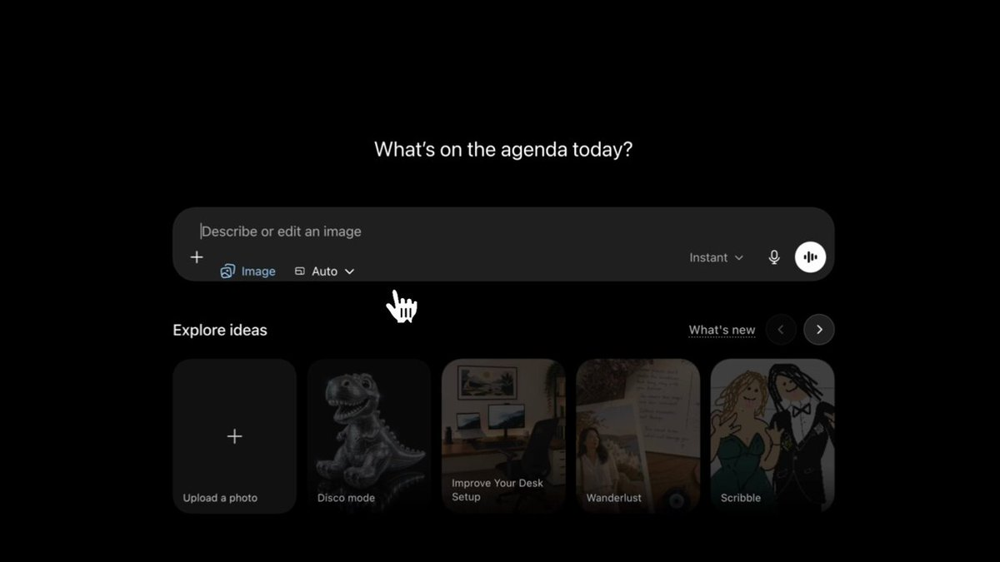

---
<!-- Case 319: Minimalist Automotive Poster Template (by @harboriis) -->
### Case 319: Minimalist Automotive Poster Template

**Source**: [@harboriis](https://x.com/harboriis/status/2060905652726427740)

**Prompt**:
```
Create a premium minimalist automotive poster for [CAR NAME / MODEL], inspired by luxury editorial car advertisements.

Use a clean vertical 9:16 Instagram Reels/Story composition with a bold solid color background in [BACKGROUND COLOR]. The background color should match the car's personality, brand identity, era, and mood.

Place the car as the main subject in the lower-middle area. The car should look realistic, premium, sharp, glossy, and detailed, with accurate proportions, clean reflections, crisp edges, studio-quality lighting, and a natural shadow under the vehicle.

Behind the car, add huge oversized typography showing the car model name: "[BIG WORD]".

Typography Direction:

Choose a typography style that matches the personality, era, and design language of the car. Do not use the same tall bold font every time.

Randomly select or intelligently choose one typography style:

Tall condensed bold font for luxury sedans, SUVs, and classic premium cars

Wide futuristic font for hypercars, EVs, and concept cars

Aggressive sharp angular font for sports cars and performance cars

Retro serif or vintage poster font for classic cars

Elegant thin luxury serif font for premium luxury cars

Creative cursive/script font for stylish lifestyle cars or heritage editions

Glitch/distorted digital font for cyberpunk, electric, futuristic, or modified cars

Rugged industrial stencil font for off-road SUVs and adventure vehicles

Racing decal-style typography for track cars, rally cars, and supercars

Minimal clean geometric sans-serif for modern EVs and clean luxury cars

The large background typography should feel unique to the car, not generic.

It may be oversized, stretched, stacked, angled, partially cropped, transparent, outlined, embossed, shadowed, layered, or blended into the background depending on the car theme.

Add small spaced-out brand text at the top: "[BRAND NAME]". Keep enough empty space at the top and sides for a clean premium layout.

Style: luxury automotive poster, minimalist editorial layout, high-end car magazine aesthetic, realistic car render, clean shadow, bold color contrast, premium typography, no extra objects, no people, no clutter.

Aspect ratio: 9:16
```

**Output**:

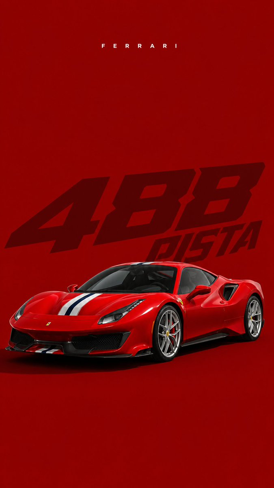

---
<!-- Case 320: Watercolor European Travel Poster (by @Taaruk_) -->
### Case 320: Watercolor European Travel Poster

**Source**: [@Taaruk_](https://x.com/Taaruk_/status/2060938882146082935)

**Prompt**:
```
Elegant European city street travel poster, delicate watercolor and ink sketch illustration, hand-drawn architectural linework, soft pastel washes, urban streetscape with historic buildings, charming cafés, pedestrians strolling, outdoor terraces, detailed balconies, trees and flower boxes, loose expressive brushstrokes, architectural journal sketch style, travel diary aesthetic, white paper texture, minimal background, subtle paint splashes, fine pen outlines, sophisticated composition, light and airy atmosphere, vintage travel book illustration, high-detail watercolor rendering, muted earthy palette, European old-town charm, artistic perspective drawing, editorial illustration, premium stationery art, museum-quality watercolor, clean negative space, handwritten calligraphy title at the top, elegant typography, travel magazine cover design, masterpiece, ultra-detailed, 8k.
```

**Output**:

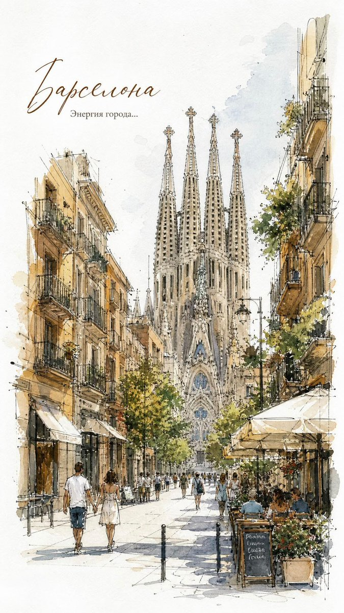

---
<!-- Case 321: Surreal Inner Self Editorial Poster (by @Sheldon056) -->
### Case 321: Surreal Inner Self Editorial Poster

**Source**: [@Sheldon056](https://x.com/Sheldon056/status/2060921933550817712)

**Prompt**:
```
A hyper-realistic young man sitting inside the open cavity of a massive realistic human chest sculpture shaped like himself. The chest is hollow like a room, with soft fabric textures and dim ambient light inside. He wears cream cargo pants, a fitted white tank top, and vintage sneakers, staring downward thoughtfully.

Background is an empty matte gray studio with lots of negative space.

Typography:

* Thin handwritten text: “I KEEP SEARCHING”
* Huge stretched typography: “MYSELF”
* Smaller type underneath: “BUT EVERY DOOR LEADS BACK TO ME”

Soft moody lighting, introspective atmosphere, luxury fashion campaign style, surreal emotional storytelling, ultra detailed, 8k realism. Generate
```

**Output**:

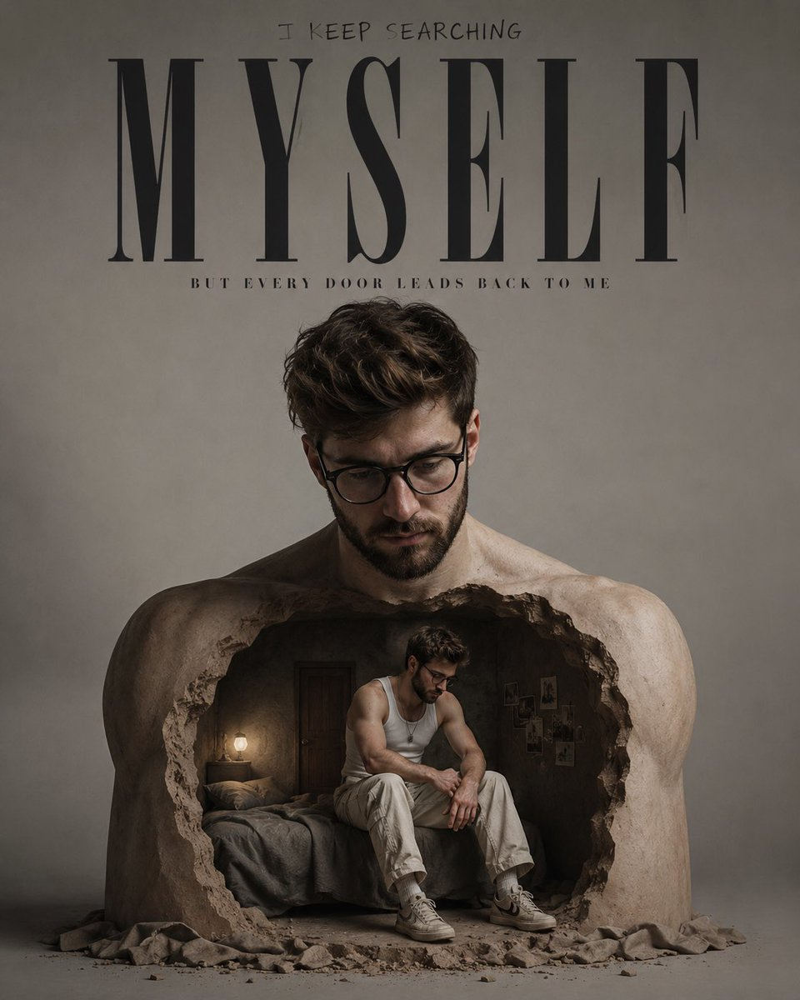

<!-- Case 322: Chibi Fashion Infographic (by @chi_vc_) -->
### Case 322: [Chibi Fashion Infographic](https://x.com/chi_vc_/status/2061619597821022407) (by [@chi_vc_](https://x.com/chi_vc_))

| Output |
| :----: |
| <a href="https://evolink.ai/gpt-image-2-prompts?utm_source=github&utm_medium=picture&utm_campaign=awesome-gpt-image-2-API-and-Prompts" target="_blank" rel="noopener noreferrer"></a> |

**Prompt:**

```
Create a fashion infographic based on the reference image. Use the reference image mainly to understand the character’s identity, hairstyle, facial features, color impression, personality, and overall mood.

Transform the character into a polished 3D chibi character with a large head, small body, expressive eyes, and soft cute proportions. Keep the character’s recognizable features, such as hairstyle, hair color, eye color, facial impression, and overall aura, while designing a new original outfit that naturally suits the character’s atmosphere.

Do not simply copy the clothing from the reference image. Instead, create a coordinated fashion style that feels appropriate for this character’s personality, color palette, and visual mood. The outfit may include thoughtfully chosen clothing, shoes, accessories, textures, and silhouettes that enhance the character’s charm.

Show a full-body main pose in the center, surrounded by editorial callouts: outfit concept, clothing item breakdown, fabric texture swatches, styling points, accessory close-ups, color palette, and a small pose guide. Use a clean white background, soft lighting, premium lookbook layout, ultra-detailed 3D rendering, stylish fashion editorial design, cute but refined.
```
<!-- Case 323: 3D Character Editorial Quartet (by @iamaiistudio) -->
### Case 323: [3D Character Editorial Quartet](https://x.com/iamaiistudio/status/2061590939140010068) (by [@iamaiistudio](https://x.com/iamaiistudio))

| Output |
| :----: |
| <a href="https://evolink.ai/gpt-image-2-prompts?utm_source=github&utm_medium=picture&utm_campaign=awesome-gpt-image-2-API-and-Prompts" target="_blank" rel="noopener noreferrer"></a> |

**Prompt:**

```
Create a vertical 2:3 ultra high definition series of four stylized 3D cartoon editorial renders. Use a polished toy-like character finish, smooth matte skin, expressive oversized eyes, crisp silhouettes, soft studio lighting with realistic cast shadows, subtle backdrop grain, and strong single-color art direction. Keep each image clean, premium, and sharply separated from the background, with no text, no watermark, and no logo.

Image 1: a stylized cartoon woman in a fitted ribbed blue dress with thin straps, red sunglasses resting on short tousled brown hair, red bow high-heel sandals, standing in a playful curved pose with crossed legs against a solid vivid red matte studio wall. Side lighting creates a defined shadow on the red background.

Image 2: a cheerful stylized cartoon woman in an all-green travel look, black hair in two braided pigtails, green cap, sleeveless green crop top, loose green jogger pants with a drawstring, white sneakers, one finger touching her lips, holding the handle of a glossy green hard-shell suitcase. Solid green studio background, full body, eye-level camera.

Image 3: a cozy centered scene of two stylized cartoon characters sitting on a red sofa in a deep red room. The woman on the left is wrapped in a textured red blanket, barefoot, calm expression, eyes looking upward. The man on the right is wrapped in an orange textured blanket, wearing socks, neutral gentle upward gaze. Use a balanced symmetrical composition, knitted fabric texture, warm nostalgic lighting, and a fabric-like red wall.

Image 4: a red-haired stylized cartoon girl standing in front of a wall mirror in a warm beige room. Show her from behind with extremely long glossy red hair flowing down her back, while the mirror reflection shows her small worried face, blue eyes, red outfit, and soft anxious expression. Gentle sunlight from the side, clean floor, simple mirror frame, emotional storybook mood.

Global quality: 8K, ultra-high definition, high-detail 3D render, realistic soft shadows, extreme clarity, crisp edges, no noise, no compression, premium editorial composition, color-block backgrounds, cinematic but minimal.
```
<!-- Case 324: Torn Soda Can Fruit Ad (by @iamaiistudio) -->
### Case 324: [Torn Soda Can Fruit Ad](https://x.com/iamaiistudio/status/2061570275595186603) (by [@iamaiistudio](https://x.com/iamaiistudio))

| Output |
| :----: |
| <a href="https://evolink.ai/gpt-image-2-prompts?utm_source=github&utm_medium=picture&utm_campaign=awesome-gpt-image-2-API-and-Prompts" target="_blank" rel="noopener noreferrer"></a> |

**Prompt:**

```
A photorealistic, highly detailed commercial product shot of a standard aluminum [Type of Soda Can], perfectly centered on a minimal textured [Background Color] paper backdrop with subtle visible fibers. A single continuous horizontal torn paper strip crosses the full frame from the right edge to the left edge, with a barely noticeable upward diagonal slant toward the upper left. The tear passes through the can body and continues seamlessly across the background on both sides.

Make the torn opening wide and dramatic, exposing a dense, glossy, vibrant mass of [Description of Fruit Segments/Sacs/Berries] packed tightly inside the can. At the far left end of the tear, roll the paper neatly into a tight realistic coil that nearly fills the left margin.

Design new minimalist can branding: on the upper can, place a stylized abstract line-art illustration of [Fruit Branch/Plant] in contrasting [Ink Color], layered over a subtle matte geometric [Pattern Type] pattern on the can surface. Below it, print the brand name "[Brand Name]" in elegant modern dark typography, with smaller technical text reading "330ml - NATURAL EXTRACT" plus a small "Recyclable" logo. Add a small detailed fruit graphic below the torn path.

Use soft cinematic lighting with delicate drop shadows under the torn paper edges and the large left-side coil. Render in 8K with macro-level detail on fibrous paper, brushed aluminum, and glossy fruit texture.
```
<!-- Case 325: Miniature City Travel Card (by @Goodmanprotocol) -->
### Case 325: [Miniature City Travel Card](https://x.com/Goodmanprotocol/status/2061507567478780074) (by [@Goodmanprotocol](https://x.com/Goodmanprotocol))

| Output |
| :----: |
| <a href="https://evolink.ai/gpt-image-2-prompts?utm_source=github&utm_medium=picture&utm_campaign=awesome-gpt-image-2-API-and-Prompts" target="_blank" rel="noopener noreferrer"></a> |

**Prompt:**

```
Create a premium collectible travel-card illustration in vertical 4:5 format inspired by [CITY] and [COUNTRY]. A hand holding a beautifully designed collectible [CITY] travel card featuring elegant [LOCAL CULTURE / REGIONAL DESIGN]-inspired design (metro pass / museum pass / boarding pass / postcard / passport page / vintage travel ticket / luggage tag). Attached to and organically emerging from the card is a highly detailed miniature [ICONIC LANDMARK] souvenir charm or classic [CITY] toy object, naturally integrated into the scene as part of the collectible item — not simply placed on top.

The miniature object transforms into and reveals a tiny immersive [CITY] world filled with iconic [CITY] architecture, [LOCAL STREET CHARACTER], cafés, bridges, [LOCAL TRANSIT / CULTURAL FEATURES], glowing street lamps, miniature citizens, vintage cars, scooters, flower stands, riverboats, and atmospheric [COUNTRY] cultural details flowing seamlessly from the object itself.

Composition:
– [ICONIC LANDMARK] souvenir / [CITY] collectible positioned as the hero object attached to the card
– Expansive miniature [CITY] diorama spreading outward in layered cinematic depth
– Realistic softly blurred [CITY] background with recognizable city mood
– Strong depth of field, shallow focus, cinematic perspective
– Cozy premium souvenir aesthetic
– Rich ultra-detailed luxury travel campaign composition

Visual blending:
– Metallic, ceramic, or vintage souvenir textures gradually transform into [CITY] streets and architecture
– [ICONIC BUILDINGS], café terraces, bridges, glowing windows, transit tunnels, cobblestone streets, bookstores, and [CITY] landmarks emerge organically from the collectible object
– No hard separation between toy and environment
– Miniature world feels physically grown from the souvenir itself

Style:
hyper detailed, photorealistic + stylized 3D collectible, miniature world, soft natural lighting, warm cinematic color grading, Instagram-worthy luxury travel poster aesthetic, premium [CITY] souvenir concept, ultra detailed textures, tactile materials, handcrafted diorama feeling, cinematic realism.

Ticket details:
Use elegant [LOCAL CULTURE]-inspired typography, subtle gold foil accents, vintage transit graphics, decorative travel emblems, embossed textures, refined luxury print design, and minimal tasteful text.

Mood:
romantic, nostalgic, luxurious, warm evening atmosphere, premium tourism campaign aesthetic, collectible art object, immersive [CITY] storytelling.

Aspect ratio 4:5
```
<!-- Case 326: 電子レンジ大明神キャラ設定ポスター (by @Anifun_AI) -->
### Case 326: [電子レンジ大明神キャラ設定ポスター](https://x.com/Anifun_AI/status/2061380839418855755) (by [@Anifun_AI](https://x.com/Anifun_AI))

| Output |
| :----: |
| <a href="https://evolink.ai/gpt-image-2-prompts?utm_source=github&utm_medium=picture&utm_campaign=awesome-gpt-image-2-API-and-Prompts" target="_blank" rel="noopener noreferrer"></a> |

**Prompt:**

```
{"type":"Japanese mascot character sheet / contest entry poster","format":"wide horizontal infographic character design sheet, 16:9, clean cream background with orange decorative borders, shrine motifs, sparkles and rays, high-detail cute anime mascot illustration, warm orange and gold palette, crisp vector-like line art with watercolor shading","main_title":{"position":"upper left","text":"{argument name=\"character name\" default=\"電子レンジ大明神 チンノスケ\"}","style":"large bold Japanese display lettering, black furigana above smaller text, oversized orange brush-calligraphy name"},"tagline":{"position":"below title","text":"{argument name=\"tagline\" default=\"温めすぎた未来から来た、チンする神様。\"}","style":"orange framed ribbon label"},"character":{"centerpiece":"full-body front-facing original mascot deity, a small cute god whose head is a white microwave oven with a glowing orange screen face, round cheeks, thick eyebrows, tiny mustache, smiling expression, microwave buttons and 600w label on the right side, black power plug cord extending from the head, wearing ornate Shinto priest robes in white, orange, black and gold, thick sacred rope around shoulders, paper shide streamers, tassels, patterned kimono layers, geta sandals, holding a ceremonial staff topped with a glowing rice-bowl symbol","head_details":"torii-like golden halo and five wooden prayer plaques mounted above the microwave head, labeled 解凍, あたため, 加熱神, 自動, 強弱","body_details":"front apron panel labeled 600w with a steaming rice bowl emblem, hanging talismans and small labels along the sleeve","expression":"cheerful divine mascot face displayed inside the microwave window"},"layout":{"sections":[{"title":"trait profile box","position":"left middle","count":4,"labels":["性格：世話焼き / やさしい / 加減が苦手","特技：冷めたご飯を一瞬で温める / 心の温度を測る","弱点：アルミホイル / 停電 / 猫舌","口ぐせ：『600ワットの慈悲』"],"style":"rounded white card with orange icons: flower, rice bowl, warning triangle, speech bubble"},{"title":"ご利益","position":"bottom left","count":3,"labels":["冷めたご飯がほかほかに!","疲れた心があたたまる!","未来の自分にやさしくなれる!"],"style":"wooden shrine sign board with bow decoration, plus a lucky beckoning cat holding a plaque labeled あったか未来"},{"title":"全力あたためポーズ!","position":"upper right","count":1,"labels":["温めすぎても愛があれば大丈夫である!"],"style":"action pose panel with orange speed lines, the mascot pointing upward dramatically while the microwave face looks fierce"},{"title":"ディテール紹介","position":"right middle","count":3,"labels":["頭の御札（操作札）","しめ縄コンセント","おなかの操作パネル"],"style":"three circular detail callouts with short explanatory captions, showing the wooden control plaques, braided rope power plug, and 600w belly control panel"},{"title":"弱点な瞬間…","position":"bottom right","count":3,"labels":["アルミホイルは神をも反射する…!","停電になるとただの箱神様に…!","猫舌ゆえに熱々はつらいのじゃ…"],"style":"three small rounded panels showing comedic weakness scenes: aluminum foil glare, dark power outage, and crying from hot food"}],"total_discrete_sections":5,"decorative_elements":"orange corner ornaments, tiny clouds, sparkles, radiating sunburst lines, shrine icon above title, small stamp-like signature near the cat"},"typography":"all visible text is Japanese, playful manga-style headings with orange emphasis, neat black body captions, occasional furigana above kanji","rendering_instructions":"make it look like a polished Japanese character reference sheet for a future-character discovery festival, balanced composition with the large mascot centered, no photorealism, no 3D, highly readable labels, cute humorous tone, dense but organized poster layout","customization":{"core_concept":"{argument name=\"mascot concept\" default=\"a microwave-oven Shinto deity who warms food and hearts\"}","catchphrase":"{argument name=\"catchphrase\" default=\"『600ワットの慈悲』\"}","color_palette":"{argument name=\"color palette\" default=\"warm orange, gold, cream, white, and black\"}"}}
```

<!-- Case 327: Avant-Garde 3D Caricature Portrait (by @iamaiistudio) -->
### Case 327: [Avant-Garde 3D Caricature Portrait](https://x.com/iamaiistudio/status/2062340531448066386) (by [@iamaiistudio](https://x.com/iamaiistudio))

| Output |
| :----: |
| <a href="https://evolink.ai/gpt-image-2-prompts?utm_source=github&utm_medium=picture&utm_campaign=awesome-gpt-image-2-API-and-Prompts" target="_blank" rel="noopener noreferrer"></a> |

**Prompt:**

```
Generate a highly stylized 3D caricature portrait with deliberate exaggerated deformation and a smooth, polished surface. Base the character on the ATTACHED REFERENCE PHOTO, keeping the subject's identity, skin tone, facial likeness, and distinctive features intact, while transforming them into a bold caricatured 3D figure featuring a stretched elongated neck, an oversized head, heavy drooping eyelids, full lips, and a slightly asymmetric face. The character should have clean, studio-quality skin with purposeful detail rather than random noise or texture. Accessorize boldly with round or oval glasses, hoop earrings, gold chains, head wraps or bandanas, and street-luxury fashion. Light with neutral studio lighting for soft shadows and even tones, no harsh contrast, set against a plain neutral grey or off-white backdrop. The vibe should feel avant-garde, collectible, fashion-forward, and character-focused rather than realistic or cute. Ultra-high definition, premium cinematic 3D render, hyperrealistic quality, clean materials, no freckles, dirt, grain, noise, text, logos, or watermarks. Aspect ratio 4:5
```

<!-- Case 328: Ink Noir Portrait (by @iamaiistudio) -->
### Case 328: [Ink Noir Portrait](https://x.com/iamaiistudio/status/2062325077912519045) (by [@iamaiistudio](https://x.com/iamaiistudio))

| Output |
| :----: |
| <a href="https://evolink.ai/gpt-image-2-prompts?utm_source=github&utm_medium=picture&utm_campaign=awesome-gpt-image-2-API-and-Prompts" target="_blank" rel="noopener noreferrer"></a> |

**Prompt:**

```
Dark, high-contrast noir-style portrait of [SUBJECT], drawn entirely with bold black ink lines and deliberate splatter. Deep shadows dominate the frame, with bright highlights carved out through empty white space. A subtle paper grain shows through. The mood is brooding, cinematic, and intense, like the most gripping panel in a graphic novel.
```

<!-- Case 329: Mixed-Media Train Platform Portrait (by @iamaiistudio) -->
### Case 329: [Mixed-Media Train Platform Portrait](https://x.com/iamaiistudio/status/2062311265993986425) (by [@iamaiistudio](https://x.com/iamaiistudio))

| Output |
| :----: |
| <a href="https://evolink.ai/gpt-image-2-prompts?utm_source=github&utm_medium=picture&utm_campaign=awesome-gpt-image-2-API-and-Prompts" target="_blank" rel="noopener noreferrer"></a> |

**Prompt:**

```
Mixed media portrait of a trendy young man standing on a KRL Jabodetabek Commuter Line platform at night. He poses confidently, one hand gripping the strap of an olive-green backpack, dressed in streetwear: oversized black layered hoodie, gray sweatpants, chunky sneakers.

The background shows the train in full side view with its signature red stripe, doors wide open, lit by cinematic platform lighting against the city night sky.

Surrounding the realistic subject are several cute 3D chibi versions of him, same face and outfit, each in a playful pose: one sitting on his shoulder, one climbing his leg, one peeking out of the backpack.

Layered over the whole image: vivid hand-drawn doodle effects, white stroke outlines around the subject, glowing stars, sparkles, electric sparks, and floating handwritten captions reading "forever young", "krl", "night", and "gen z vibes". The final result blends hyper-realistic photography with flat cartoon illustration, keeping the face and body unchanged.
```

<!-- Case 330: Brand Identity Oil Painting (by @iamaiistudio) -->
### Case 330: [Brand Identity Oil Painting](https://x.com/iamaiistudio/status/2062249710489067957) (by [@iamaiistudio](https://x.com/iamaiistudio))

| Output |
| :----: |
| <a href="https://evolink.ai/gpt-image-2-prompts?utm_source=github&utm_medium=picture&utm_campaign=awesome-gpt-image-2-API-and-Prompts" target="_blank" rel="noopener noreferrer"></a> |

**Prompt:**

```
[BRAND NAME].
Create a professional mixed-media oil painting on raw textured canvas where the color palette and visual elements are dynamically adapted to match the brand's identity.

1. BRAND COLOR ADAPTATION
Identify the primary and secondary colors of [BRAND NAME]. Use the primary brand color for two thick horizontal impasto brushstrokes. Use the secondary brand color for a raised central paint dollop. Replace generic colors with this brand-specific palette.

2. PAINTED SUBJECT AND MOTION
Paint a central product related to [BRAND NAME] vertically on the canvas using oil painting technique. Apply a horizontal motion blur effect with visible brushstrokes to convey dynamic movement. The product must integrate directly into the canvas texture, not as an overlay. Paint the "[BRAND NAME]" logo using distressed semi-transparent oil layers within the product's silhouette.

3. IMPASTO AND CANVAS TEXTURE
Two thick physical horizontal impasto strokes in the brand's primary color over the painted subject. One heavily textured raised dollop of secondary color oil paint centered on the middle stroke. Background: raw heavy-grain grey canvas with visible weave, charcoal smudges, and gesso dabs.

4. BRAND GRAPHICS AND TYPOGRAPHY
Scrawl brand keywords, slogans, and values in charcoal and graphite across the canvas. Replace generic doodles with hand-drawn abstract icons representing [BRAND NAME], all scratched over dried oil paint layers.

5. STYLE
Contemporary mixed-media pop-art. 8K macro photography highlighting the physical thickness of the oil paint and raw canvas grain texture.
```

<!-- Case 331: Berries and Blossoms Infographic Poster (by @92digitalartArt) -->
### Case 331: [Berries and Blossoms Infographic Poster](https://x.com/92digitalartArt/status/2062237147260756025) (by [@92digitalartArt](https://x.com/92digitalartArt))

| Output |
| :----: |
| <a href="https://evolink.ai/gpt-image-2-prompts?utm_source=github&utm_medium=picture&utm_campaign=awesome-gpt-image-2-API-and-Prompts" target="_blank" rel="noopener noreferrer"></a> |

**Prompt:**

```
A delightful vertical infographic poster in 9:16 format about berries and forest fruits, designed in a warm 3D cozy kawaii illustration style with soft rounded shapes, glossy textures, and a comforting pastel atmosphere, featuring a tall central floating garden diorama where oversized strawberries, blueberries, raspberries, blackberries, and tiny blossoms are arranged like a charming miniature world, each fruit rendered in plush 3D with cute faces, tiny highlights, and a toy-like finish; the scene includes little leaves, dew drops, honey jars, wooden baskets, and soft clouds of steam rising from a fresh fruit tart near the bottom, all surrounded by a gentle gradient background shifting from creamy pink at the top to warm peach and mint at the bottom, with floating sparkles and bokeh dots; the title should be placed near the top left in a rounded playful font reading BERRIES & BLOSSOMS, with a subtitle below reading A SWEET GARDEN STORY; fact blocks should be arranged asymmetrically in adorable rounded cards placed across the poster, with labels such as SEASON, NUTRITION, GROWTH, POLLINATION, FLAVORS, and HARVEST, each using tiny cute icons and short friendly descriptions; a DID YOU KNOW? panel should sit near the lower right inside a soft strawberry-shaped frame with five original fun facts; the entire poster should feel cozy, sweet, colorful, whimsical, and fully original, with no copyrighted content, no logos, no pop-culture references, and a complete 9:16 vertical ratio
```

<!-- Case 332: Mid-Century Editorial Illustration System (by @Goodmanprotocol) -->
### Case 332: [Mid-Century Editorial Illustration System](https://x.com/Goodmanprotocol/status/2062235491588849920) (by [@Goodmanprotocol](https://x.com/Goodmanprotocol))

| Output |
| :----: |
| <a href="https://evolink.ai/gpt-image-2-prompts?utm_source=github&utm_medium=picture&utm_campaign=awesome-gpt-image-2-API-and-Prompts" target="_blank" rel="noopener noreferrer"></a> |

**Prompt:**

```
Create a premium mid-century-inspired flat editorial illustration of [Subject], rendered in a refined handcrafted printmaking aesthetic. The artwork should feel like a sophisticated vintage children’s encyclopedia illustration combined with Scandinavian editorial design and retro nature-book graphics.

Language: English 8K ultra-high resolution with a 3:4 aspect ratio

STYLE: minimalist flat-shape illustration soft geometric simplification handcrafted gouache + risograph + silkscreen print texture subtle paper grain and dry ink imperfections muted refined color palette clean matte colors crisp neutral white balance bright museum-quality paper appearance no yellow tint no beige cast no sepia tone no glossy rendering no photorealism no 3D shading elegant editorial composition premium picture-book atmosphere modern museum-shop illustration vibe

COMPOSITION: spacious balanced layout with multiple elements harmoniously arranged simplified organic shapes stylized plants, objects, animals, architecture, landmarks, or symbolic elements depending on [Subject] visual storytelling through clustered illustrated motifs maximum 8–10 illustrated elements total playful but refined asymmetrical editorial balance large clean negative space on soft neutral white paper background premium Scandinavian editorial layout feeling

TEXTURE & PRINT FEEL: subtle premium paper texture refined layered ink overlap delicate risograph misalignment soft dry brush grain light handcrafted print imperfections tactile handcrafted surface feeling clean bright paper surface controlled ink density airy and crisp visual atmosphere

COLOR SYSTEM: muted teal dusty blue sage green cool gray faded coral soft navy desaturated mineral tones restrained natural palette (adjust palette naturally to fit [Subject])

ILLUSTRATION RULES: simplified eyes and facial features rounded organic silhouettes minimal line usage flat layered color blocking decorative but restrained detail density avoid excessive realism avoid anime style avoid modern vector corporate style avoid bright neon colors avoid sharp digital gradients avoid yellowish paper tone avoid vintage sepia coloration

MOOD: quietly playful, educational, nostalgic, timeless, sophisticated, airy, clean, premium editorial illustration, Scandinavian museum-book elegance

OUTPUT: high-resolution editorial illustration, ultra-clean composition, refined handcrafted print aesthetic, bright neutral paper tones, crisp museum-quality editorial finish, suitable for premium magazine spreads, art books, museum posters, or luxury children’s publishing.
```

<!-- Case 333: Graphic-Novel Eyes Banner (by @iamaiistudio) -->
### Case 333: [Graphic-Novel Eyes Banner](https://x.com/iamaiistudio/status/2062189319562187193) (by [@iamaiistudio](https://x.com/iamaiistudio))

| Output |
| :----: |
| <a href="https://evolink.ai/gpt-image-2-prompts?utm_source=github&utm_medium=picture&utm_campaign=awesome-gpt-image-2-API-and-Prompts" target="_blank" rel="noopener noreferrer"></a> |

**Prompt:**

```
Cinematic poster art: extreme close-up of a man's eyes filling a narrow horizontal band across the frame, deep black void above and below. Graphic-novel illustration style with bold red, black, and orange tones, heavy contrast, dramatic shadows, sharp highlights, raw gritty atmosphere. Eyes look fierce and emotionally charged, hair slightly disheveled.
```

<!-- Case 334: Cosmic Campfire Concept Art (by @iamaiistudio) -->
### Case 334: [Cosmic Campfire Concept Art](https://x.com/iamaiistudio/status/2062113170467221759) (by [@iamaiistudio](https://x.com/iamaiistudio))

| Output |
| :----: |
| <a href="https://evolink.ai/gpt-image-2-prompts?utm_source=github&utm_medium=picture&utm_campaign=awesome-gpt-image-2-API-and-Prompts" target="_blank" rel="noopener noreferrer"></a> |

**Prompt:**

```
Create a surreal, cinematic, photorealistic 8k conceptual artwork set in an abstract cosmic void. Use a high-angle full shot with symmetrical balance, placing a magical campfire at the exact center between two seated characters against a pitch-black background with no visible environment.

On the left, show an astronaut sitting on a rough gray rock, wearing a highly detailed realistic white space suit with the helmet on and a reflective visor. The astronaut holds a stick and roasts a marshmallow over the fire.

On the right, show a young man sitting on a metal folding chair and leaning forward toward the flames. He has dark hair and wears a red and black plaid flannel shirt, blue jeans, and brown boots. He is warming his hands by the fire.

Make the central campfire magical and surreal: the warm orange flames should transition seamlessly into a photorealistic spiral galaxy filled with glittering stars, cosmic dust, and visible swirling motion. The galaxy should rise and arch overhead like a celestial canopy.

Lighting should be dramatic and cinematic. Use warm orange firelight as the primary light source, with cool blue and purple glow from the galaxy as secondary light. Create soft but deep shadows and strong contrast. Use a color palette dominated by black, orange, blue, and purple, with white, red, and brown accents.

The image should communicate human connection, cosmic wonder, the contrast between ordinary life and the infinite universe, and shared warmth in an endless dark space. Render with ultra-detailed photorealistic textures, cinematic lighting, sharp focus, and high dynamic range.
```

<!-- Case 335: Mixed-Media Editorial Portrait (by @iamaiistudio) -->
### Case 335: [Mixed-Media Editorial Portrait](https://x.com/iamaiistudio/status/2063050883651547471) (by [@iamaiistudio](https://x.com/iamaiistudio))

| Output |
| :----: |
| <a href="https://evolink.ai/gpt-image-2-prompts?utm_source=github&utm_medium=picture&utm_campaign=awesome-gpt-image-2-prompts" target="_blank" rel="noopener noreferrer"></a> |

**Prompt:**

```
A mixed-media portrait of [SUBJECT] showing [EXPRESSION], looking [GAZE DIRECTION], styled with [ACCESSORY/STYLING]. Realistic identity rendered with bold black sketch strokes layered over torn newspaper collage fragments and acrylic paint splashes. Editorial print texture throughout, seamlessly blending photorealism with abstract expressionism. Premium poster aesthetic with a tactile, handmade feel. High contrast composition, ultra-detailed face and eyes. [PRIMARY COLORS] and [SECONDARY COLORS] palette.
```

<!-- Case 336: Landmark Miniature Diorama (by @iamaiistudio) -->
### Case 336: [Landmark Miniature Diorama](https://x.com/iamaiistudio/status/2063020385420161405) (by [@iamaiistudio](https://x.com/iamaiistudio))

| Output |
| :----: |
| <a href="https://evolink.ai/gpt-image-2-prompts?utm_source=github&utm_medium=picture&utm_campaign=awesome-gpt-image-2-prompts" target="_blank" rel="noopener noreferrer"></a> |

**Prompt:**

```
Isometric miniature diorama of [LANDMARK NAME], capturing its real-world structure and proportions on a small floating platform, surrounded by buildings and landscape details from [CITY / COUNTRY]. Physically accurate materials including stone, concrete, metal, and glass. True-to-life color palette, muted and realistic tones matching the actual landmark. Off-white studio background with soft natural lighting, gentle shadows, and clean composition. High-detail 3D render, premium architectural model aesthetic, no people, no text.
```

<!-- Case 337: Glass Skeleton Study Desk (by @iamaiistudio) -->
### Case 337: [Glass Skeleton Study Desk](https://x.com/iamaiistudio/status/2062915921371644352) (by [@iamaiistudio](https://x.com/iamaiistudio))

| Output |
| :----: |
| <a href="https://evolink.ai/gpt-image-2-prompts?utm_source=github&utm_medium=picture&utm_campaign=awesome-gpt-image-2-prompts" target="_blank" rel="noopener noreferrer"></a> |

**Prompt:**

```
Stylized 3D render of a clear glass skeleton with black-rimmed glasses, seated at a wooden desk, looking down at an open textbook while highlighting text with a yellow highlighter. A warm gold desk lamp on the right casts cozy yellow light with glossy reflections on the glass surface. The desk has a white coffee mug, stack of hardcover books, and scattered pens with pastel pink and yellow highlighters. Soft pink wall background. Warm, studious aesthetic. No text or watermarks.
```

<!-- Case 338: Pastel Paper-Collage Travel Poster (by @Ciri_ai) -->
### Case 338: [Pastel Paper-Collage Travel Poster](https://x.com/Ciri_ai/status/2062906835460641113) (by [@Ciri_ai](https://x.com/Ciri_ai))

| Output |
| :----: |
| <a href="https://evolink.ai/gpt-image-2-prompts?utm_source=github&utm_medium=picture&utm_campaign=awesome-gpt-image-2-prompts" target="_blank" rel="noopener noreferrer"></a> |

**Prompt:**

```
Create a refined wide landscape illustration of [CITY/SUBJECT], naturally featuring [ICONIC LANDMARK] as the main recognizable visual anchor.

CORE STYLE:
Depict [SUBJECT] as a calm, elegant, highly stylized scene in a toned-down pastel paper-collage poster style. The scene should feel minimal, clean, poetic, modern, cultured, leisurely, and softly cheerful rather than realistic.

COMPOSITION:
Use a spacious horizontal composition. Place [MAIN SUBJECT] as the central focus, clearly recognizable through its iconic [DISTINCTIVE FEATURES] rising above the layered scene. Surround it with simplified [CONTEXTUAL ELEMENTS]. Reinterpret in highly stylized illustrated forms using clean geometric shapes, layered color planes, soft curves, crisp silhouettes, and paper-like cutout forms. Avoid photorealism.

VISUAL ELEMENTS:
Include minimal charming details: simplified forms, tiny expressive people for scale, small architectural/environmental accents, organic elements (trees, plants), calm open sky with generous breathing space, clean horizontal layered divisions suggesting depth and atmosphere.

COLOR PALETTE (Toned-Down Pastels):
Soft sky blue, hazy blue-gray, pale cobalt, muted sage green, powder mint, warm cream, light beige, pale stone gray, dusty coral, soft peach, muted yellow, off-white, very small accents of navy or charcoal. [Add subject-specific accent colors as needed]

TACTILE QUALITY:
The image should feel tactile and handmade, like carefully arranged colored paper and gouache-painted poster board. Add subtle paper grain, matte printed texture, soft raised edges, delicate embossing, slight cut-paper shadows, gentle surface roughness. Keep surface refined and minimal, not messy.

VISUAL LANGUAGE:
Minimal paper collage, pastel travel poster, flat graphic shapes, subtle 3D paper relief, clean silhouettes, simplified architecture, soft matte texture, crisp color fields, gentle shadows, minimal linework, refined editorial illustration, modern [cultural context] poster mood. Wide landscape format, balanced negative space, strong graphic layering, clear focal area, simplified zones arranged harmoniously, airy composed and visually restful.

LIGHTING & MOOD:
Bright soft daylight, clean atmosphere, gentle shadows, warm relaxed tone, cultured and optimistic mood, quiet and sophisticated travel-poster feeling.

TYPOGRAPHY (Upper-left corner):
Main title '[CITY/SUBJECT NAME]' in geometric uppercase sans-serif font with wide letter-spacing, solid white color. Below: smaller native text '[Local Language · Translation]' and English subtext '[LANDMARK/SUBTITLE]', all in matching white, left-aligned, thin stroke weights with airy spacious tracking.

AVOID:
Photorealism, realistic photography, over-detailed buildings, heavy outlines, messy brushwork, neon cyberpunk style, dark gloomy lighting, excessive gradients, crowded scenes, readable signage, logos, watermarks.

FINAL RESULT:
A polished minimal pastel paper-collage landscape illustration of [SUBJECT], with [ICONIC ELEMENT] as the main recognizable visual anchor, featuring tactile paper texture, soft shadows, clean geometric color blocking, generous negative space, and a refined modern travel-illustration mood.

=====================================
VARIABLE REPLACEMENT GUIDE:
[CITY/SUBJECT] = Target city or subject
[ICONIC LANDMARK] = Main recognizable landmark
[DISTINCTIVE FEATURES] = Key identifying characteristics
[CONTEXTUAL ELEMENTS] = Supporting environmental details
[cultural context] = Cultural/regional context (e.g., Korean, Japanese, Chinese, French)
[SUBJECT-SPECIFIC COLORS] = Custom accent colors (cherry blossoms: blush pink, lavender fields: soft lavender, etc.)
Images
```

<!-- Case 339: Sketch Portrait Breaking Paper (by @Fujimoto_hina) -->
### Case 339: [Sketch Portrait Breaking Paper](https://x.com/Fujimoto_hina/status/2062869471203844457) (by [@Fujimoto_hina](https://x.com/Fujimoto_hina))

| Output |
| :----: |
| <a href="https://evolink.ai/gpt-image-2-prompts?utm_source=github&utm_medium=picture&utm_campaign=awesome-gpt-image-2-prompts" target="_blank" rel="noopener noreferrer"></a> |

**Prompt:**

```
{
  "prompt": "A hyper-realistic top-down photograph of a white sketch paper lying on a rustic wooden table. On the paper is an incredibly detailed graphite pencil sketch of a handsome young man with the exact facial features, hairstyle, glasses, smile, proportions, and expression from the uploaded reference image. The portrait is rendered in realistic graphite pencil shading with exceptional detail. He is wearing a modern black American-style jacket and shirt, with only the clothing rendered in full color while the face remains a pencil sketch. The man is holding a real photorealistic 3D black coffee mug labeled 'AEGON' that appears to break through the boundaries of the paper and extend into the real world. The coffee mug is rendered in full color with realistic reflections and texture. His hand holding the mug is also fully photorealistic and colored, seamlessly blending with the sketch to create an impressive trompe-l'oeil illusion. Realistic steam rises from the hot coffee and partially covers the lower part of his face. The white sketch paper rests on a rustic wooden tabletop surrounded by scattered coffee beans, two sharpened black pencils, subtle sketching tools, and warm natural sunlight creating soft shadows. Cozy coffee shop atmosphere, shallow depth of field, cinematic lighting, premium composition. Photorealistic mixed-media artwork, pencil drawing combined with 3D realism, illusion art, trompe-l'oeil effect, ultra-detailed textures, realistic steam, professional studio-quality lighting, highly detailed graphite shading, 8K resolution, masterpiece quality. In the bottom-left corner of the paper, add a small minimalist triangle containing a stylized letter 'A' with the text 'A.E.G.O.N' elegantly written beneath it as an artist signature. Preserve the reference face exactly.",
  "size": "1024x1792",
  "style": "photorealistic",
  "quality": "ultra",
  "aspect_ratio": "9:16",
  "lighting": "warm natural sunlight",
  "camera_angle": "top-down",
  "detail_level": "8K",
  "negative_prompt": "blurry, low resolution, distorted face, extra fingers, duplicate hands, bad anatomy, cartoon, anime, painting, watercolor, oversaturated colors, low detail, text artifacts, cropped face, unrealistic steam, deformed mug, unrealistic proportions"
}
```

<!-- Case 340: Passport Worlds Atlas Scene (by @iamaiistudio) -->
### Case 340: [Passport Worlds Atlas Scene](https://x.com/iamaiistudio/status/2062824097164476733) (by [@iamaiistudio](https://x.com/iamaiistudio))

| Output |
| :----: |
| <a href="https://evolink.ai/gpt-image-2-prompts?utm_source=github&utm_medium=picture&utm_campaign=awesome-gpt-image-2-prompts" target="_blank" rel="noopener noreferrer"></a> |

**Prompt:**

```
Breathtaking 3D scene: a worn passport lays open, each visa stamp exploding into the places it represents. Every inked mark becomes a gateway—[CITY 1] emerges in miniature from one stamp with [DETAIL 1], [CITY 2] breaks through another with [DETAIL 2], [CITY 3] materializes with [DETAIL 3]. [LANDMARK 1], [LANDMARK 2], and [LANDMARK 3] rise at different scales across the pages. Flight paths sweep overhead as radiant golden arcs weaving between all the worlds.
Coffee rings transform into lakes. Frayed edges dissolve into coastlines. [ATMOSPHERIC ELEMENT 1] drifts from one destination while [ATMOSPHERIC ELEMENT 2] swirls near another.
Dramatic raking light, tilt-shift depth of field, 8K, UE5, cinematic lighting. A bureaucratic document reborn as a living atlas of adventures.
```


<!-- Case 341: Chaotic Doodle Photo Portrait (by @Shorelyn_) -->
### Case 341: [Chaotic Doodle Photo Portrait](https://x.com/Shorelyn_/status/2063235707632533954) (by [@Shorelyn_](https://x.com/Shorelyn_))

<table>
<tr><td width="50%"><a href="https://evolink.ai/gpt-image-2-prompts?utm_source=github&utm_medium=picture&utm_campaign=awesome-gpt-image-2-API-and-Prompts" target="_blank" rel="noopener noreferrer"></a></td><td width="50%"><a href="https://evolink.ai/gpt-image-2-prompts?utm_source=github&utm_medium=picture&utm_campaign=awesome-gpt-image-2-API-and-Prompts" target="_blank" rel="noopener noreferrer"></a></td></tr>
<tr><td width="50%"><a href="https://evolink.ai/gpt-image-2-prompts?utm_source=github&utm_medium=picture&utm_campaign=awesome-gpt-image-2-API-and-Prompts" target="_blank" rel="noopener noreferrer"></a></td><td width="50%"><a href="https://evolink.ai/gpt-image-2-prompts?utm_source=github&utm_medium=picture&utm_campaign=awesome-gpt-image-2-API-and-Prompts" target="_blank" rel="noopener noreferrer"></a></td></tr>
</table>

**Prompt:**

```
Turn this photo into a chaotic funny doodle illustration, intentionally messy and low-skill, as if drawn quickly with a cheap marker, crayon, or worn-out felt pen on paper.

Create exaggerated facial features with awkward proportions, uneven eyes, oversized head, tiny body, crooked smile, and clumsy anatomy while still keeping the person recognizable. Use rough childish sketch lines, shaky hand-drawn strokes, visible scribbles, overlapping outlines, accidental marks, and random doodles around the scene. Add a simple cartoon-style background with badly drawn buildings, trees, clouds, street elements, and uneven perspective. Coloring should look careless and imperfect, with visible stroke texture, inconsistent fill areas, wax crayon texture, marker bleed, and irregular shading. Include playful imperfections like crossed-out lines, unfinished details, random arrows, tiny notes, stars, swirls, and abstract scribbles. Overall aesthetic should feel humorous, spontaneous, handmade, energetic, goofy, and intentionally unpolished, resembling a child's sketchbook mixed with absurd internet meme art. High texture detail, paper grain visible, asymmetrical composition, awkward framing, expressive doodle chaos, raw sketch energy.
```

<!-- Case 342: Semi-3D Fashion Editorial Avatar (by @AIwithSynthia) -->
### Case 342: [Semi-3D Fashion Editorial Avatar](https://x.com/AIwithSynthia/status/2063299903582003607) (by [@AIwithSynthia](https://x.com/AIwithSynthia))

<table>
<tr><td width="50%"><a href="https://evolink.ai/gpt-image-2-prompts?utm_source=github&utm_medium=picture&utm_campaign=awesome-gpt-image-2-API-and-Prompts" target="_blank" rel="noopener noreferrer"></a></td><td width="50%"><a href="https://evolink.ai/gpt-image-2-prompts?utm_source=github&utm_medium=picture&utm_campaign=awesome-gpt-image-2-API-and-Prompts" target="_blank" rel="noopener noreferrer"></a></td></tr>
</table>

**Prompt:**

```
Create a premium high-resolution vector-cartoon / semi-3D illustration of the person from the reference image. Reimagine them in a stylish modern fashion-editorial look, sitting confidently on a sleek designer chair. Outfit: trendy T-shirt, fashionable skirt/pants, stylish sneakers, and bold sunglasses as the hero accessory. Exaggerate key facial features while maintaining recognizable likeness. Clean flat-colored background (single vibrant color), smooth lines, sharp details, soft studio lighting, luxury advertising aesthetic, centered composition with ample negative space for branding and headlines. Ultra-detailed, print-ready, billboard-quality, modern eyewear campaign style.
```

<!-- Case 343: Retro Automotive Travel Poster Template (by @iamaiistudio) -->
### Case 343: [Retro Automotive Travel Poster Template](https://x.com/iamaiistudio/status/2063276384924111329) (by [@iamaiistudio](https://x.com/iamaiistudio))

<table>
<tr><td width="50%"><a href="https://evolink.ai/gpt-image-2-prompts?utm_source=github&utm_medium=picture&utm_campaign=awesome-gpt-image-2-API-and-Prompts" target="_blank" rel="noopener noreferrer"></a></td><td width="50%"><a href="https://evolink.ai/gpt-image-2-prompts?utm_source=github&utm_medium=picture&utm_campaign=awesome-gpt-image-2-API-and-Prompts" target="_blank" rel="noopener noreferrer"></a></td></tr>
<tr><td width="50%"><a href="https://evolink.ai/gpt-image-2-prompts?utm_source=github&utm_medium=picture&utm_campaign=awesome-gpt-image-2-API-and-Prompts" target="_blank" rel="noopener noreferrer"></a></td><td width="50%"><a href="https://evolink.ai/gpt-image-2-prompts?utm_source=github&utm_medium=picture&utm_campaign=awesome-gpt-image-2-API-and-Prompts" target="_blank" rel="noopener noreferrer"></a></td></tr>
</table>

**Prompt:**

```
prompt:

Create a vertical retro automotive travel poster featuring [CAR MODEL] either parked or driving through [SCENERY]. Use a bold 1970s printmaking style with a strict 4-color palette only: [COLORS]. Build the image with flat silkscreen-style color blocking, strong contrast shadows, simplified geometric reflections, slight ink misregistration, subtle paper grain, distressed print texture, and graphic halftone shading.

Avoid gradients, photorealism, glossy 3D rendering, and modern digital polish. The car should feel iconic and graphic, with thick simplified contour shapes and a warm nostalgic travel-ad atmosphere.

Include vintage advertisement typography that reads "[TITLE]" and integrate an authentic [BRAND LOGO] naturally into the layout. Add stylized trees, buildings, road signs, landscape shapes, or location details in the background so the setting clearly supports the travel-poster story.

The composition should feel like a strong mid-century tourism poster: balanced, editorial, poster-ready, and visually bold. Keep the design clean and intentional, with no stamp border.
```

<!-- Case 344: Family Watercolor Fashion Sketch (by @AiwithZohaib) -->
### Case 344: [Family Watercolor Fashion Sketch](https://x.com/AiwithZohaib/status/2063277611409879452) (by [@AiwithZohaib](https://x.com/AiwithZohaib))

| Output |
| :----: |
| <a href="https://evolink.ai/gpt-image-2-prompts?utm_source=github&utm_medium=picture&utm_campaign=awesome-gpt-image-2-API-and-Prompts" target="_blank" rel="noopener noreferrer"></a> |

**Prompt:**

```
A stylish family standing together, digital watercolor and ink sketch illustration, fashion illustration style, white clean background with abstract beige brush strokes, soft lighting, expressive line art, casual modern clothing, denim jeans, black hijabs, relaxed happy pose, elegant minimal aesthetic, high detail, editorial sketch look.
```

<!-- Case 345: Japanese Fashion Cover Illustration (by @iamaiistudio) -->
### Case 345: [Japanese Fashion Cover Illustration](https://x.com/iamaiistudio/status/2063291615205314737) (by [@iamaiistudio](https://x.com/iamaiistudio))

<table>
<tr><td width="50%"><a href="https://evolink.ai/gpt-image-2-prompts?utm_source=github&utm_medium=picture&utm_campaign=awesome-gpt-image-2-API-and-Prompts" target="_blank" rel="noopener noreferrer"></a></td><td width="50%"><a href="https://evolink.ai/gpt-image-2-prompts?utm_source=github&utm_medium=picture&utm_campaign=awesome-gpt-image-2-API-and-Prompts" target="_blank" rel="noopener noreferrer"></a></td></tr>
<tr><td width="50%"><a href="https://evolink.ai/gpt-image-2-prompts?utm_source=github&utm_medium=picture&utm_campaign=awesome-gpt-image-2-API-and-Prompts" target="_blank" rel="noopener noreferrer"></a></td><td width="50%"><a href="https://evolink.ai/gpt-image-2-prompts?utm_source=github&utm_medium=picture&utm_campaign=awesome-gpt-image-2-API-and-Prompts" target="_blank" rel="noopener noreferrer"></a></td></tr>
</table>

**Prompt:**

```
prompt:

Create a high-end Japanese fashion magazine cover illustration. The subject is [XXX]. Use a minimalist, modern fashion-digital-illustration style with refined cel shading, crisp clean large color-block modeling, almost no visible linework, and elegant sharp edges.

Keep a blue-and-white structural palette as the foundation, with restrained accents of coral red, misty purple, pale yellow, ash pink, sage green, silver gray, or similar soft secondary tones. The final image should stay minimal, premium, cohesive, and not flashy.

Use a clean background, such as cobalt blue, royal blue, misty blue, or another pure large color field, with generous negative space. Strong sunlight enters from the upper left. White areas should be bright and close to overexposed, while shadows are built from hard-edged planes of cool blue, gray-blue, and blue-purple.

Give the subject a slender silhouette and a quiet, aloof posture. Simplify details while keeping the form accurate. The overall mood should feel translucent, cool, elegant, fashionable, and suitable for a premium magazine cover poster.

Avoid text, watermarks, complex backgrounds, photorealistic photography, 3D, heavy impasto, childish cartoon styling, and cluttered decoration.
```

<!-- Case 346: Love Bites Cyberpunk Manga Cover (by @her19845) -->
### Case 346: [Love Bites Cyberpunk Manga Cover](https://x.com/her19845/status/2063310953475678229) (by [@her19845](https://x.com/her19845))

<table>
<tr><td width="50%"><a href="https://evolink.ai/gpt-image-2-prompts?utm_source=github&utm_medium=picture&utm_campaign=awesome-gpt-image-2-API-and-Prompts" target="_blank" rel="noopener noreferrer"></a></td><td width="50%"><a href="https://evolink.ai/gpt-image-2-prompts?utm_source=github&utm_medium=picture&utm_campaign=awesome-gpt-image-2-API-and-Prompts" target="_blank" rel="noopener noreferrer"></a></td></tr>
</table>

**Prompt:**

```
Generate a vintage vinyl album cover with a cyberpunk and manga aesthetic, grainy and worn. The background is dark and textured, with scratches and dust. At the top, the title "LOVE BITES" appears in large white and gray capital letters, with two red lines crossed out. To the left of the title is a red six-pointed star symbol with a central asterisk. Below the title is the text: "BEAUTY IS POWER, SILENCE IS WAR."

In the center is a monochrome manga-style illustration of the attached image. Behind it is a monochrome illustration of a 1990s JDM sports car.

Includes multiple graphic details and logos:

Top left: logos for "STEREOPHONIC HIGH FIDELITY RECORDING," "33 ⅓ RPM," and "LP."

Top right: a red circle that reads "VOL. 01."

On the left: the text "HER19845", a barcode, and a tracklist with 6 numbered songs (e.g., "01. SILENT GAZE", "02. LOVE BITES", "03. NIGHT DRIVE", "04. EMPTY PROMISES", "05. FAKE SMILE", "06. BLEED QUIET").

On the right: a red square with a globe logo, the text "YOU CAN WATCH BUT YOU WON'T UNDERSTAND", asterisks, and "@IMAGE_5".

Bottom left: the Japanese text "美しさは力である" and a barcode "0025".

Bottom right: a silver "PARENTAL ADVISORY EXPLICIT CONTENT" label and red graffiti "DON'T FALL IN LOVE" with a crossed-out heart.

Copyright text "ALL RIGHTS RESERVED" at the bottom edge.

The overall aesthetic should be nostalgic, underground, and raw, with the grain and texture of a real vinyl record. The color scheme is monochromatic with red accents.

Use a 3:4 aspect ratio.
```


<!-- Case 347: World Cup Hero Poster (by @Goodmanprotocol) -->
### Case 347: [World Cup Hero Poster](https://x.com/Goodmanprotocol/status/2063677927057981650) (by [@Goodmanprotocol](https://x.com/Goodmanprotocol))

<table>
<tr><td width="50%"><a href="https://evolink.ai/gpt-image-2-prompts?utm_source=github&utm_medium=picture&utm_campaign=awesome-gpt-image-2-API-and-Prompts" target="_blank" rel="noopener noreferrer"></a></td><td width="50%"><a href="https://evolink.ai/gpt-image-2-prompts?utm_source=github&utm_medium=picture&utm_campaign=awesome-gpt-image-2-API-and-Prompts" target="_blank" rel="noopener noreferrer"></a></td></tr>
<tr><td width="50%"><a href="https://evolink.ai/gpt-image-2-prompts?utm_source=github&utm_medium=picture&utm_campaign=awesome-gpt-image-2-API-and-Prompts" target="_blank" rel="noopener noreferrer"></a></td><td width="50%"><a href="https://evolink.ai/gpt-image-2-prompts?utm_source=github&utm_medium=picture&utm_campaign=awesome-gpt-image-2-API-and-Prompts" target="_blank" rel="noopener noreferrer"></a></td></tr>
</table>

**Prompt:**

```
Create a cinematic ultra-detailed football poster of [PLAYER NAME] playing for [TEAM/COUNTRY], chest-up portrait, looking away from camera, dramatic team color rim lighting, floating embers, atmospheric smoke, premium sports marketing campaign style, photorealistic skin texture, highly detailed jersey with team crest, massive vertical typography displaying player's surname on the left side, "FIFA WORLD CUP 2026" text near bottom center, luxury editorial photography, AAA game key visual quality, Unreal Engine 5 rendering, ultra-sharp focus, high contrast, 8K masterpiece, smartphone wallpaper composition, character occupying 90% of frame.

Composition:

Vertical smartphone wallpaper (9:16 ratio)

Chest-up portrait occupying 85–90% of the frame

Subject positioned slightly right of center

Extreme close-up perspective with strong visual presence

Head turned slightly to the side, looking off-camera

Heroic, confident, focused expression

Lighting:

Dramatic cinematic rim lighting

Strong team color backlight from camera-left

Soft warm key light illuminating facial details

Deep shadows with high contrast

Volumetric atmosphere and subtle haze

Premium studio photography quality

Character Detail:

Hyper-realistic skin texture

Sharp eyes with natural catchlights

Highly detailed hair strands

Photorealistic facial features

Ultra-clean professional athlete appearance

Realistic fabric folds and stitching

Jersey:

New football kit with sponsor logo

Premium fabric texture

Detailed team crest

Realistic sponsor and badge embossing

Subtle reflective highlights

Match-day elite aesthetic

Background:

Dark black-to-deep-team color gradient

Atmospheric smoke and mist

Floating ember particles

Cinematic depth

Minimal distractions

Character remains the brightest focal point

Typography Layout:

Massive vertical surname along left side

Small first name at top

Team name and position near lower-left corner

Social media handle at bottom center

Modern condensed sports typography

Bold typography matching lighting palette

Color Palette:

Deep black

Team color

Dark team color

Warm skin tones

High contrast cinematic grading

Quality:

Unreal Engine 5 quality

8K ultra-detailed

Sports marketing campaign quality

Premium poster design

Sharp focus

Photorealistic rendering

Professional color grading

Award-winning sports photography aesthetic.

Aspect Ratio: 9:16

Always generate the player in the context of the FIFA World Cup 2026, using the official national team colors, kit, and tournament atmosphere appropriate to the player's country.
```

<!-- Case 348: Destination Diorama Filmstrip (by @Naiknelofar788) -->
### Case 348: [Destination Diorama Filmstrip](https://x.com/Naiknelofar788/status/2063582448689336690) (by [@Naiknelofar788](https://x.com/Naiknelofar788))

<table>
<tr><td width="50%"><a href="https://evolink.ai/gpt-image-2-prompts?utm_source=github&utm_medium=picture&utm_campaign=awesome-gpt-image-2-API-and-Prompts" target="_blank" rel="noopener noreferrer"></a></td><td width="50%"><a href="https://evolink.ai/gpt-image-2-prompts?utm_source=github&utm_medium=picture&utm_campaign=awesome-gpt-image-2-API-and-Prompts" target="_blank" rel="noopener noreferrer"></a></td></tr>
</table>

**Prompt:**

```
[LOCATION]
Generate all landmarks, scenery, cultural elements, architecture, wildlife, transportation, food, and local experiences automatically based on the destination.

STYLE DIRECTION
Combine three visual styles:

1. Photorealistic cinematic background
2. Premium stylized 3D traveler character
3. Handcrafted papercut diorama film-strip scenes

The contrast between these styles should feel intentional, premium, and editorial.

LAYOUT

Vertical 4:5 poster format.

LEFT SIDE:
A large vintage black film strip running vertically from top to bottom.

RIGHT SIDE:
A highly detailed 3D traveler character walking confidently toward the viewer.

CENTER/TOP:
Large hand-lettered headline:

"Every Frame a Destination"

Generate a destination-inspired subtitle automatically.

CHARACTER

Create a premium stylized 3D travel creator.

The character should automatically suit the destination:

Examples:

- Travel photographer
- Travel vlogger
- Adventure explorer
- Wildlife photographer
- Luxury traveler
- Backpacker
- Cultural storyteller

Character requirements:

- High-end 3D rendering
- Photorealistic materials
- Natural human proportions
- Attractive and relatable
- Walking confidently
- Holding a professional camera
- Wearing destination-appropriate clothing
- Backpack or camera bag
- Strong visual presence
- Social-media-friendly appearance

The traveler should be the main focal point of the poster.

FILM STRIP

Populate the film strip with 5 iconic destination highlights automatically selected from the location.

IMPORTANT:

Do NOT use photographs inside the film strip

Each film frame should contain a handcrafted papercut diorama version of the destination.

Papercut Diorama Style:

- Layered paper artwork
- Multiple depth layers
- Paper-cut architecture
- Paper-cut landscapes
- Paper-cut vegetation
- Miniature handcrafted appearance
- Rich paper textures
- Soft shadowing between layers
- Premium paper sculpture craftsmanship
- Editorial-quality design

Each frame should feel like a miniature handcrafted world.

One or two elements may slightly extend outside the film frame for depth.

Examples:

- Landmark extending beyond border
- Wildlife partially escaping frame
- Local transportation overlapping frame edge
- Natural elements extending outside frame

One frame should contain:

- Travel journal page
- Vintage stamp
- Passport marks
- Handwritten travel note
- Destination-inspired quote

BACKGROUND

Create a photorealistic blurred background inspired by the destination.

Examples:

- Historic city streets
- Coastal roads
- Mountain scenery
- Safari landscapes
- Tropical settings
- Cultural neighborhoods

Requirements:

- Cinematic golden-hour lighting
- Soft depth of field
- Photographic realism
- Warm color grading
- Background remains blurred enough to keep focus on character and film strip

TRAVEL MEMORABILIA

Add destination-specific:

- Vintage stamps
- Passport stamps
- Travel tickets
- Postcards
- Travel badges
- Local cultural symbols

DOODLES

Add minimal black-and-white travel doodles.

Examples:

- Airplane flight path
- Camera icon
- Location pin
- Compass
- Local transportation icon
- Local food or drink icon
- Small destination-themed symbols

Keep doodles subtle and premium.

VISUAL STYLE

- Viral Instagram travel poster
- Luxury tourism campaign
- National Geographic meets modern Instagram
- Editorial magazine cover
- Premium travel branding
- Award-winning design
- Cinematic storytelling
- Rich golden-hour lighting
- Ultra-detailed textures
- Professional typography
- Strong visual hierarchy

PRIORITY ORDER

1. 3D traveler character
2. Papercut diorama film strip
3. Typography
4. Travel memorabilia
5. Minimal doodles

Avoid cartoon styling.
Avoid low-poly aesthetics.
Avoid stock-photo appearance

The final result should feel like a premium travel campaign that is instantly understandable on Instagram while rewarding viewers with intricate papercut details when they zoom in.
```

<!-- Case 349: Sleep-Deprived Chibi Creator (by @john_my07) -->
### Case 349: [Sleep-Deprived Chibi Creator](https://x.com/john_my07/status/2063556594671964302) (by [@john_my07](https://x.com/john_my07))

<table>
<tr><td width="50%"><a href="https://evolink.ai/gpt-image-2-prompts?utm_source=github&utm_medium=picture&utm_campaign=awesome-gpt-image-2-API-and-Prompts" target="_blank" rel="noopener noreferrer"></a></td><td width="50%"><a href="https://evolink.ai/gpt-image-2-prompts?utm_source=github&utm_medium=picture&utm_campaign=awesome-gpt-image-2-API-and-Prompts" target="_blank" rel="noopener noreferrer"></a></td></tr>
</table>

**Prompt:**

```
Use my uploaded photo as the sole facial reference. Preserve my exact identity, facial proportions, eye shape, skin tone, lip shape, nose structure, and all distinctive features with exceptional accuracy and no facial drift.

Create a highly detailed cinematic 3D chibi-style character portrait inspired by top-tier animated films, luxury collectible figurines, and contemporary designer toy aesthetics. The character represents a brilliant AI-powered digital creator running on pure creativity and almost no sleep after a marathon night of editing and designing.

Scene:
Early morning inside a cozy creative studio. She sits drowsily on the edge of a weathered wooden workbench, legs gently swinging, looking exhausted yet irresistibly charming. Her fluffy hair is gathered into a loose messy bun with flyaway strands escaping in every direction. Sleepy half-open eyes, subtle under-eye shadows, a tiny rosy nose, and an expression that perfectly captures "I've been awake for way too long but I still have ideas."

Outfit:

Oversized soft-cream pajama set

Tiny embroidered logo reading "Pixel & Coffee Club"

Relaxed knitted cardigan casually slipping from one shoulder

Plush cloud-shaped slippers

Minimal pearl stud earrings

Cozy oversized sleeves partially covering her hands

Environment:
Warm sunrise light fills the room through large studio windows. A steaming mug of coffee rests beside her. The background is softly blurred, filled with artistic clutter, creative tools, and subtle storytelling details that suggest endless projects in progress.

Personality Elements Floating Around Her:

Mini holographic editing timelines

Tiny floating storyboard frames

Digital sketch concepts

Glowing location pins and travel stickers

Sticky notes filled with random ideas

Compact laptop displaying an unfinished creative project

Pencil sketches and concept doodles

Floating play-button icons

Small animated stars, clouds, and creative symbols

Tiny productivity meters running dangerously low

Expression & Mood:

Brilliant but overworked creator energy

Lovably exhausted

Chronic "one last revision" mindset

Quietly chaotic genius

Soft humor mixed with creative burnout

Dreamy, relatable, and emotionally expressive

Art Style:
Ultra-premium stylized realism, luxury designer collectible quality, highly detailed hair fibers, realistic fabric textures, soft skin rendering, cinematic depth of field, subtle emotional storytelling, cozy lifestyle aesthetic, handcrafted figurine finish, social-media-worthy presentation.
```

<!-- Case 350: Spring Garden Watercolor Couple (by @NoOneIsHere2603) -->
### Case 350: [Spring Garden Watercolor Couple](https://x.com/NoOneIsHere2603/status/2063599542843723983) (by [@NoOneIsHere2603](https://x.com/NoOneIsHere2603))

<table>
<tr><td width="50%"><a href="https://evolink.ai/gpt-image-2-prompts?utm_source=github&utm_medium=picture&utm_campaign=awesome-gpt-image-2-API-and-Prompts" target="_blank" rel="noopener noreferrer"></a></td><td width="50%"><a href="https://evolink.ai/gpt-image-2-prompts?utm_source=github&utm_medium=picture&utm_campaign=awesome-gpt-image-2-API-and-Prompts" target="_blank" rel="noopener noreferrer"></a></td></tr>
</table>

**Prompt:**

```
Fashion editorial watercolor portrait illustration of a romantic young Korean couple in a blooming spring garden, standing close together in a soft intimate moment — the boy gently holding the girl's hand while she leans slightly toward him with a warm shy smile. The woman wears an elegant flowing blush-pink dress with delicate fabric movement, while the man wears a soft ivory-beige shirt layered with a light pastel cardigan, creating a dreamy romantic harmony. Soft Korean facial features, healthy glowing skin texture, subtle natural makeup, calm affectionate expressions, relaxed posture, gentle head tilt, slight three-quarter angle, waist-up framing.

Set in a glowing May flower garden filled with delicate pastel blossoms, fluttering petals, and warm spring sunlight filtering softly through flowers and greenery. Romantic atmosphere with soft emotional chemistry, dreamy yet elegant mood.

Rendered in a minimalist contemporary watercolor fashion sketch aesthetic, featuring fine delicate ink and pencil linework layered over translucent watercolor washes, loose fluid brush strokes, wet-on-wet blending, soft bleeding edges, unfinished artistic brush textures, visible premium watercolor paper grain, elegant negative space. Soft blush pinks, warm peach tones, creamy whites, faded sage greens, and delicate floral hues naturally melting into the background.

Flat editorial lighting, refined luxury magazine illustration feel, poetic spring romance atmosphere. No photorealism, no 3D render, no bokeh, no depth-of-field blur, no harsh outlines, no caricature, no cluttered background, no over-detailing.
```

<!-- Case 351: Cosmic Anime Villain Poster (by @Taaruk_) -->
### Case 351: [Cosmic Anime Villain Poster](https://x.com/Taaruk_/status/2063651919596568876) (by [@Taaruk_](https://x.com/Taaruk_))

<table>
<tr><td width="50%"><a href="https://evolink.ai/gpt-image-2-prompts?utm_source=github&utm_medium=picture&utm_campaign=awesome-gpt-image-2-API-and-Prompts" target="_blank" rel="noopener noreferrer"></a></td><td width="50%"><a href="https://evolink.ai/gpt-image-2-prompts?utm_source=github&utm_medium=picture&utm_campaign=awesome-gpt-image-2-API-and-Prompts" target="_blank" rel="noopener noreferrer"></a></td></tr>
<tr><td width="50%"><a href="https://evolink.ai/gpt-image-2-prompts?utm_source=github&utm_medium=picture&utm_campaign=awesome-gpt-image-2-API-and-Prompts" target="_blank" rel="noopener noreferrer"></a></td><td width="50%"><a href="https://evolink.ai/gpt-image-2-prompts?utm_source=github&utm_medium=picture&utm_campaign=awesome-gpt-image-2-API-and-Prompts" target="_blank" rel="noopener noreferrer"></a></td></tr>
</table>

**Prompt:**

```
Ultra-detailed anime villain portrait poster, dark cosmic background, legendary antagonist standing front-facing, one hand covering the lower face in a sinister pose, glowing eyes staring directly at the viewer, powerful aura exploding around the body, energy particles, nebula clouds, ink splashes, cosmic dust, dramatic rim lighting, high contrast shadows, cinematic anime illustration, sharp facial details, muscular physique, premium manga cover aesthetic, vibrant monochromatic color theme matching the character, giant distressed typography behind the character displaying the name in huge bold letters, Japanese kanji and English subtitles, character quote on the side, power stats panel, classification section, signature abilities list, collectible trading-card layout, magazine infographic design, luxury poster composition, white and black graphic elements, ultra-clean typography, layered visual hierarchy, glowing effects, dynamic atmosphere, masterpiece anime artwork, poster design, highly detailed, 8K, vertical wallpaper, trending on ArtStation.
```

<!-- Case 352: Animated Character Design Sheet (by @0kncn) -->
### Case 352: [Animated Character Design Sheet](https://x.com/0kncn/status/2063734037928452120) (by [@0kncn](https://x.com/0kncn))

| Output |
| :----: |
| <a href="https://evolink.ai/gpt-image-2-prompts?utm_source=github&utm_medium=picture&utm_campaign=awesome-gpt-image-2-API-and-Prompts" target="_blank" rel="noopener noreferrer"></a> |

**Prompt:**

```
Create a highly detailed full-color character design sheet in 16:9 horizontal format for an original [CHARACTER TYPE / HERO / CREATURE / VILLAIN].

STYLE:
stylized cinematic character design,
high-quality animated feature look,
clean readable shapes,
strong silhouette,
premium concept art presentation,
bold graphic color palette,
comic-book inspired energy,
polished but production-ready design,
clear anatomy and costume readability.
CHARACTER IDENTITY:
[CHARACTER NAME / ROLE]
[AGE / SPECIES / BODY TYPE]
[PERSONALITY ARCHETYPE]
[POWER / SKILL / SPECIAL EQUIPMENT]
MAIN DESIGN:
The character should have a distinctive, memorable silhouette.
Use a clear costume language with recognizable shapes, strong color blocking, and functional details.
The design must feel original, not based on any existing franchise character.
No copyrighted logos, no recognizable existing superhero symbols, no direct imitation of known characters.
OUTFIT / ARMOR:
[DESCRIBE COSTUME OR ARMOR]
Include practical design details:
gloves / wrist devices
boots / shoes
belt gear
armor plates
fabric folds
glowing elements if needed

utility tools or weapons if needed
COLOR PALETTE:
[MAIN COLOR]
[SECONDARY COLOR]
[ACCENT COLOR]
Use a bold cinematic palette with strong contrast.
The colors should be clear enough for animation and video generation consistency.
CHARACTER SHEET LAYOUT:
Show the same character in multiple views on one clean sheet:
front view full body
side view full body

back view full body
three-quarter action pose
close-up face / mask expression
hand / glove / equipment detail
special ability or weapon detail

POSES:
Use confident readable poses.
The action pose should show the character’s main movement style:
[RUNNING / JUMPING / FLYING / SWINGING / FIGHTING / CASTING POWER / USING EQUIPMENT]
EQUIPMENT / POWER DETAIL:
Show how the character’s signature equipment or power works.
Example:
magnetic grappling cables,
energy gauntlets,
kinetic boots,
utility belt,
glowing power core,
mechanical wings,
elemental weapon,
or custom ability system.
BACKGROUND:
clean light neutral background,
minimal graphic design,
no complex environment,
no text-heavy poster design,
small visual notes allowed only if clean and readable.

QUALITY:
high detail,
sharp clean rendering,
consistent proportions across all views,
same face and body structure in every pose,
clear costume continuity,
production-ready character sheet,
suitable as a reference image for storyboard and AI video generation.
```

<!-- Case 353: Nordic Literary Editorial Illustration (by @iamaiistudio) -->
### Case 353: [Nordic Literary Editorial Illustration](https://x.com/iamaiistudio/status/2063670695020868046) (by [@iamaiistudio](https://x.com/iamaiistudio))

<table>
<tr><td width="50%"><a href="https://evolink.ai/gpt-image-2-prompts?utm_source=github&utm_medium=picture&utm_campaign=awesome-gpt-image-2-API-and-Prompts" target="_blank" rel="noopener noreferrer"></a></td><td width="50%"><a href="https://evolink.ai/gpt-image-2-prompts?utm_source=github&utm_medium=picture&utm_campaign=awesome-gpt-image-2-API-and-Prompts" target="_blank" rel="noopener noreferrer"></a></td></tr>
<tr><td width="50%"><a href="https://evolink.ai/gpt-image-2-prompts?utm_source=github&utm_medium=picture&utm_campaign=awesome-gpt-image-2-API-and-Prompts" target="_blank" rel="noopener noreferrer"></a></td><td width="50%"><a href="https://evolink.ai/gpt-image-2-prompts?utm_source=github&utm_medium=picture&utm_campaign=awesome-gpt-image-2-API-and-Prompts" target="_blank" rel="noopener noreferrer"></a></td></tr>
</table>

**Prompt:**

```
prompt:

A minimalist modern editorial illustration. Style: Nordic lifestyle magazine meets Korean literary book cover meets indie architectural sketch. Natural eye-level composition, everyday setting. Color palette: creamy white, ivory, gray-beige, sage green, deep olive, ink black, tiny touches of grayish-pink. Thin black ink outlines, slightly hand-drawn feel. Highly abstracted shapes, elongated quiet silhouettes. Background textures: aged paper grain, scratches, ink spots, print noise. Shadows rendered as solid blocks of pure black or dark green, no gradients, no realistic lighting, no 3D rendering. Quiet, cool, literary, restrained aesthetic. High-end editorial and independent publication finish. No text, no watermark, no high-saturation colors, no photographic feel.
```


<!-- Case 354: World Cup Match Poster (by @lukmanfebrianto) -->
### Case 354: [World Cup Match Poster](https://x.com/lukmanfebrianto/status/2064159903531544961) (by [@lukmanfebrianto](https://x.com/lukmanfebrianto))

| Output |
| :----: |
| <a href="https://evolink.ai/gpt-image-2-prompts?utm_source=github&utm_medium=picture&utm_campaign=awesome-gpt-image-2-API-and-Prompts" target="_blank" rel="noopener noreferrer"></a> |

**Prompt:**

```
Photorealistic movie poster designed by a professional graphic designer with this concept:
- The background is the venue, [Name of The Stadium, Location]
- Main image showing Captain from [Country] Team: [Name] wearing national team jersey head to head with Captain from [Country] Team: [Name] wearing national team jersey
- Main title is '[Country] vs [Country]'
- Behind the title, waving flag of [Country] and [Country]
- Below main title, text '[Name of The Stadium] - [Location], [Date]'
- At the top, 'World Cup 2026' logo
```


<!-- Case 355: Cinematography Analysis Frame (by @bmx_ai13) -->
### Case 355: [Cinematography Analysis Frame](https://x.com/bmx_ai13/status/2064109968203362408) (by [@bmx_ai13](https://x.com/bmx_ai13))

| Output |
| :----: |
| <a href="https://evolink.ai/gpt-image-2-prompts?utm_source=github&utm_medium=picture&utm_campaign=awesome-gpt-image-2-API-and-Prompts" target="_blank" rel="noopener noreferrer"></a> |

**Prompt:**

```
Create a cinematic fashion editorial photograph in a bright minimal bedroom, presented as a cinematography composition analysis frame.

Main Image: A young adult female model kneeling on a soft white bed beside a large window with sheer white curtains. She is positioned on the left third of the frame, body aligned with the vertical rule-of-thirds grid line. Her body leans slightly backward, facing toward the glowing window light with a calm, distant, introspective expression. The right side of the image is filled with a large bright white luminous mass from overexposed daylight through sheer curtains, balancing the darker subject on the left.

Lighting: Strong natural window light from the right side creates high contrast on the model's face, upper body, waist, and silhouette. Add subtle secondary fill light from the left side to reveal shadow areas without flattening the contrast. Warm hazy morning atmosphere, soft highlights, realistic skin texture, gentle shadows, soft bloom near the curtains.

Composition Overlay: Add visible cinematography composition guide graphics over the image, like a film school analysis frame.

Include:
- Rule of thirds grid lines in thin green.
- A red vertical line showing the model's body aligned on the left rule of thirds grid.
- Green circular focus markers around:
  1. Waist and hip area as Focus Point 1.
  2. Face area as Focus Point 2.
  3. Bright curtain/window mass as Focus Point 3.
- Yellow eye-trace arrows moving from the face to the waist/hip, then toward the glowing window.
- Red leading-line arrows following the bed edge and wall panel lines toward the main focus point.
- A cyan arrow showing secondary fill light coming from the left side.
- Text labels placed cleanly around the frame:
  “Body aligned on the grid of thirds”
  “High contrast Focus Point 2”
  “Eye Trace”
  “Focus Point 3”
  “High contrast Focus Point 1”
  “Secondary light source for dark parts”
  “Lines lead to the main focus point”
  “The white mass is aligned on the grid of thirds to balance the left side of the image”

Style: Luxury fashion editorial photography, soft cinematic realism, warm beige and white color palette, minimal bedroom, cream wall panels, white bedding, sheer curtains, subtle film grain, shallow depth of field, elegant composition, educational cinematography breakdown overlay.

Camera: 35mm lens, medium wide framing, eye level camera angle, 16:9 widescreen.
```


<!-- Case 356: Vintage Anatomic Book Plate (by @livybabie) -->
### Case 356: [Vintage Anatomic Book Plate](https://x.com/livybabie/status/2064033077123236291) (by [@livybabie](https://x.com/livybabie))

| Output |
| :----: |
| <a href="https://evolink.ai/gpt-image-2-prompts?utm_source=github&utm_medium=picture&utm_campaign=awesome-gpt-image-2-API-and-Prompts" target="_blank" rel="noopener noreferrer"></a> |

**Prompt:**

```
Edit the provided image into an antique anatomical book plate. Preserve the original character's pose, camera angle, body proportions, silhouette, gesture, and overall composition as closely as possible, but transform the subject into a refined anatomical study illustration. The final image should look like a vintage medical anatomy textbook page printed on aged ivory paper, with sepia stains, subtle paper fibers, worn edges, faint foxing marks, and archival ink texture.

Convert the visible body into a clean anatomical sketch that reveals bones, superficial muscles, tendons, ligaments, and selected organ silhouettes in a didactic, non-gory, museum-quality style. Keep the anatomy elegant and educational, like a 19th-century anatomical atlas mixed with precise modern medical illustration. Use thin graphite lines, red and blue anatomical ink accents, muted watercolor washes, and delicate hatching. Avoid horror, gore, blood, injury, mutilation, or surgical violence.

The figure must remain in the same pose as the source image, including limb position, torso rotation, head angle, gaze direction, hand placement, and perspective distortion. If the original image is anime, game art, illustration, or realistic photography, reinterpret it consistently as an anatomical diagram while keeping the recognizable posture and visual identity cues only as subtle external outlines. Clothing and accessories may be simplified into faint translucent contour lines so the anatomical structures remain readable.

Add anatomical labels in Latin using a vintage typewriter font, as if typed onto the page. Labels should be connected to structures with thin black leader lines. Use accurate Latin anatomical terminology, including examples such as: Cranium, Mandibula, Clavicula, Sternum, Costae, Scapula, Humerus, Radius, Ulna, Vertebrae cervicales, Vertebrae thoracicae, Vertebrae lumbales, Pelvis, Os ilium, Os ischii, Femur, Patella, Tibia, Fibula, Talus, Calcaneus, Musculus sternocleidomastoideus, Musculus trapezius, Musculus pectoralis major, Musculus deltoideus, Musculus biceps brachii, Musculus rectus abdominis, Musculus obliquus externus abdominis, Musculus iliopsoas, Musculus gluteus maximus, Musculus sartorius, Musculus quadriceps femoris, Musculus biceps femoris, Musculus gastrocnemius, Ligamentum inguinale, Articulatio coxae, Articulatio genus, Articulatio talocruralis.

Place the labels naturally around the figure, balancing readability and visual elegance. The text should look authentic, slightly imperfect, with subtle ink bleed, uneven typewriter spacing, and small alignment irregularities. Include a small archival caption at the bottom of the page, such as “Tabula Anatomica — Figura I”, “Studium Corporis Humani”, or “Atlas Anatomicus Vetus”. Do not use Japanese labels unless specifically requested; prioritize Latin anatomical nomenclature.

Lighting should be soft and flat like a scanned antique page. The final result must feel like a scholarly anatomical illustration, not a modern infographic. High detail, precise linework, aged paper texture, anatomical accuracy, elegant composition, subtle red muscle fibers, pale blue veins, ivory bone rendering, dark graphite outlines, old medical atlas atmosphere, realistic printed-page imperfections.
```


<!-- Case 357: Crowd Mosaic Football Portrait (by @Taaruk_) -->
### Case 357: [Crowd Mosaic Football Portrait](https://x.com/Taaruk_/status/2064032287969481186) (by [@Taaruk_](https://x.com/Taaruk_))

| Output |
| :----: |
| <a href="https://evolink.ai/gpt-image-2-prompts?utm_source=github&utm_medium=picture&utm_campaign=awesome-gpt-image-2-API-and-Prompts" target="_blank" rel="noopener noreferrer"></a> |

**Prompt:**

```
Ultra-detailed crowd mosaic portrait of a legendary football player, created entirely from thousands of tiny people standing and walking on a vast white surface. From a distance, the crowd forms a hyper-realistic giant face and upper body portrait; up close, every individual person is clearly visible. Long cinematic shadows, aerial top-down perspective, massive scale, intricate human arrangement, photorealistic details, high contrast lighting, clean minimalist background, depth and dimension, masterpiece composition, ultra-sharp focus, 8K resolution, social art installation, human mosaic effect, volumetric lighting, realistic skin tones formed by crowd density, award-winning conceptual photography, breathtaking visual illusion, drone photography, highly detailed faces, premium quality, modern generative art.
```


<!-- Case 358: Origami Food Poster (by @Gdgtify) -->
### Case 358: [Origami Food Poster](https://x.com/Gdgtify/status/2064020126937039318) (by [@Gdgtify](https://x.com/Gdgtify))

| Output |
| :----: |
| <a href="https://evolink.ai/gpt-image-2-prompts?utm_source=github&utm_medium=picture&utm_campaign=awesome-gpt-image-2-API-and-Prompts" target="_blank" rel="noopener noreferrer"></a> |

**Prompt:**

```
INPUT: [layered dish]

SYSTEM: Render the input as a master-folded origami and paper-craft architectural sculpture. Do not hardcode paper types unless inevitable. Infer the fold-geometry logic, structural load-bearing creases, layer-separation mechanics, color-blocking strategy, and the tactile grain direction of the materials.

SEMANTIC SOLVE: ORIGAMI_FOOD_AUTOPSY =
  (INFER(fold_geometry FROM mountain_valley_ratio + structural_crease_load + interlocking_tabs + negative_space_utilization) ::5) +
  (INFER(material_logic FROM paper_grain_direction + GSM_weight + surface_coating + edge_burnishing + adhesive_visibility) ::4) +
  (INFER(color_blocking FROM ingredient_color_mapping + contrast_hierarchy + gradient_paper_layering + visual_weight_distribution) ::4) +
  (INFER(hidden_craft FROM fold_sequence_complexity + tolerance_margins + tool_marks + humidity_warping_prevention) ::3) -
  (messy torn paper + realistic food textures + digital 3D paper shaders + cluttered craft desk + childish simple folds) ::-4

COMPOSITION: One central food item completely reconstructed as an intricate, multi-layered paper-craft sculpture. The "ingredients" are represented by distinct, beautifully colored paper layers, cut and folded with razor-sharp precision. Show the "exploded" floating layers hovering above the base, revealing the internal fold structure and interlocking tabs.

STYLE DNA: Intricate paper cutting art ::0.35 high-end origami photography ::0.25 flat-shaded C4D stylization ::0.20 crisp vector-like edges ::0.15 soft directional macro lighting ::0.05

OUTPUT: Soft off-white or pastel background, elegant minimalist typography, razor-sharp crisp edges, flawless flat-shaded colors with subtle paper grain textures, premium negative space.

NEGATIVE: no holograms, no bioluminescent glows, no VR/AR elements, no realistic food photography, no messy torn paper edges, no visible digital 3D artifacts, no cluttered backgrounds, no watermark.
```


<!-- Case 359: Surrealism History Timeline (by @92digitalartArt) -->
### Case 359: [Surrealism History Timeline](https://x.com/92digitalartArt/status/2064012013357928462) (by [@92digitalartArt](https://x.com/92digitalartArt))

| Output |
| :----: |
| <a href="https://evolink.ai/gpt-image-2-prompts?utm_source=github&utm_medium=picture&utm_campaign=awesome-gpt-image-2-API-and-Prompts" target="_blank" rel="noopener noreferrer"></a> |

**Prompt:**

```
A surrealist historical timeline infographic poster in 16:9 horizontal format inspired by Salvador Dalí, featuring a dreamlike desert landscape where a long melting clock transforms into a winding historical timeline path across the composition, with floating doors, stretched shadows, levitating drawers, cracked stone statues, and impossible reflections merging into one symbolic world; the timeline should run diagonally from left to right like a dream corridor, with key surrealism dates placed inside small elegant labels, including 1917, 1924, 1929, 1936, 1940s and 1960s, each date connected to a strange symbolic object such as an eye, an egg, a telephone, a bird cage, a face, or a candle, all drawn with refined illusionistic detail; the background should be a warm twilight gradient blending sand beige, pale gold, faded blue and shadowy violet, with clouds that look like painted smoke and a horizon that bends unnaturally; the title should be placed at the top center in large dramatic serif typography reading SURREALISM, with the subtitle TIMELINE OF THE SUBCONSCIOUS beneath it in smaller elegant text; fact panels should be placed asymmetrically around the dreamscape, each one framed like a museum label but slightly distorted, with short sections labeled ORIGINS, MANIFESTO, KEY ARTISTS, DREAM LOGIC, FAMOUS WORKS, and LEGACY, plus a small DID YOU KNOW? box near the lower right with five original facts; the entire image should feel uncanny, poetic, intellectually rich, visually luxurious, and unmistakably surrealist, with no copied artwork, no logos, no modern UI, 16:9 horizontal ratio
```


<!-- Case 360: 3D Travel Ticket (by @AIwithkhan) -->
### Case 360: [3D Travel Ticket](https://x.com/AIwithkhan/status/2063963460963270774) (by [@AIwithkhan](https://x.com/AIwithkhan))

| Output |
| :----: |
| <a href="https://evolink.ai/gpt-image-2-prompts?utm_source=github&utm_medium=picture&utm_campaign=awesome-gpt-image-2-API-and-Prompts" target="_blank" rel="noopener noreferrer"></a> |

**Prompt:**

```
Photorealistic 3D travel ticket concept, a close-up human hand holding a large vintage “NYC All Access Pass” ticket in front of a clean cream-colored background. The ticket acts as a portal window into New York City, revealing a detailed miniature Manhattan street scene inside the cutout frame. A realistic yellow NYC taxi emerges out of the ticket in 3D onto a floating road platform, creating a pop-out effect. The Empire State Building rises dramatically behind the ticket, with hand-drawn sketch illustrations of the Statue of Liberty, Brooklyn Bridge, Broadway sign, and coffee cup surrounding the composition. Premium paper texture, cinematic lighting, warm golden-hour tones, ultra-detailed miniature city diorama, depth of field, travel advertisement aesthetic, creative paper-craft design, hyperrealistic, clean studio background, professional product photography, sharp focus, 8K, vertical composition.
```


<!-- Case 361: Luxury Birthday Poster 3:4 (by @Taaruk_) -->
### Case 361: [Luxury Birthday Poster 3:4](https://x.com/Taaruk_/status/2064548138422263945) (by [@Taaruk_](https://x.com/Taaruk_))

| Output |
| :----: |
| <a href="https://evolink.ai/gpt-image-2-prompts?utm_source=github&utm_medium=picture&utm_campaign=awesome-gpt-image-2-API-and-Prompts" target="_blank" rel="noopener noreferrer"></a> |

**Prompt:**

```
Professional luxury birthday poster, 3:4 ratio. Entire frame filled with a premium off white luxury paper textured wall. Large number “2” precisely carved in the wall with visible depth and realistic inner shadows. Inside the number: soft pink and pink balloons, subtle white flowers, elegant bouquet arrangement, premium celebration styling. A happy 2 year old child with preserved reference facial features, wearing a milky white T shirt and pink denim overalls, laughing naturally. Face, shoulder, one hand and one foot extend outside the number creating a realistic 3D effect. Warm cinematic sunlight from one side, soft rim light, photorealistic skin, premium studio photography, ultra realistic, sharp focus. Typography on wall: MUNONYE, CHAPTER 2, 365 MORE DAYS OF WONDER. Clean minimalist layout, luxury magazine cover aesthetic, high end art direction, realistic shadows, natural colors, no tree shadows, no fake lighting, no AI artifacts.
```

<!-- Case 362: Window Girl Fashion Editorial (by @iamaiistudio) -->
### Case 362: [Window Girl Fashion Editorial](https://x.com/iamaiistudio/status/2064545132180074569) (by [@iamaiistudio](https://x.com/iamaiistudio))

| Output |
| :----: |
| <a href="https://evolink.ai/gpt-image-2-prompts?utm_source=github&utm_medium=picture&utm_campaign=awesome-gpt-image-2-API-and-Prompts" target="_blank" rel="noopener noreferrer"></a> |

**Prompt:**

```
://t.co/yMuwrbQO3u

Ultra-photoreal fashion editorial. A young woman sits casually inside the open window of a soft warm yellow house, one leg extended outward and raised, the other relaxed, one arm hanging freely. She wears a white satin midi slip dress with thin straps and fluid fabric, clean white over-ear headphones, and simple white flat shoes. She holds a loose bouquet of fresh yellow flowers in one hand. Expression: calm, relaxed confidence, gaze forward or slightly to the side.

Architecture: simple rectangular window, white interior walls, clean uncluttered sunlit facade. Midday direct natural sunlight, crisp shadows.

Camera: 35mm lens, centered full-body framing within the window frame, moderate depth of field with sharp background. Color grade: warm yellows, clean whites, natural skin tones. Aspect ratio 4:5. No text, no watermark. Ultra-high-res, ultra-photoreal editorial render.

#AIart #GPTImage2
```

<!-- Case 363: Premium Streetwear Graphic Tee (by @j_smeaton99) -->
### Case 363: [Premium Streetwear Graphic Tee](https://x.com/j_smeaton99/status/2064540729528267108) (by [@j_smeaton99](https://x.com/j_smeaton99))

| Output |
| :----: |
| <a href="https://evolink.ai/gpt-image-2-prompts?utm_source=github&utm_medium=picture&utm_campaign=awesome-gpt-image-2-API-and-Prompts" target="_blank" rel="noopener noreferrer"></a> |

**Prompt:**

```
Create a high-end fashion product photo of a modern oversized streetwear T-shirt. The shirt features a large, professionally designed graphic print on the front. Design style: contemporary urban streetwear, bold typography mixed with futuristic geometric elements, clean vector artwork, subtle distressed textures, premium screen-print aesthetic, balanced composition, visually striking but wearable. Color palette: black, white, silver, and electric blue accents. The design should look like it belongs in a luxury streetwear collection. Photorealistic fabric texture, realistic folds, premium cotton material, studio lighting, fashion campaign quality, ultra-detailed, sharp focus, e-commerce ready, trend-forward apparel design.
```

<!-- Case 364: Three-Frame Nightlife Collage (by @mehvishs25) -->
### Case 364: [Three-Frame Nightlife Collage](https://x.com/mehvishs25/status/2064539698027258333) (by [@mehvishs25](https://x.com/mehvishs25))

| Output |
| :----: |
| <a href="https://evolink.ai/gpt-image-2-prompts?utm_source=github&utm_medium=picture&utm_campaign=awesome-gpt-image-2-API-and-Prompts" target="_blank" rel="noopener noreferrer"></a> |

**Prompt:**

```
Create image Create a photorealistic three-frame vertical nightlife collage inspired by the supplied reference image. Preserve the subject's facial identity, facial structure, skin tone, hairstyle, and overall appearance while placing her in a fashionable late-evening social setting.

The subject is an adult woman in her mid-to-late twenties with long, voluminous dark brown hair styled in soft natural waves, radiant skin, refined soft-glam makeup, defined eyelashes, and glossy neutral-toned lips. Her expression feels warm, confident, and effortlessly playful.

Wardrobe:
A sophisticated black evening dress with a modern fitted silhouette, paired with delicate silver jewelry including rings and a minimalist pendant necklace. Contemporary nightlife fashion styling with an elegant, upscale aesthetic.

Frame 1:
She sits comfortably at a cocktail table, leaning back with both hands resting behind her head while laughing naturally. The image should feel spontaneous, candid, and genuinely joyful, as if captured during a memorable night out.

Frame 2:
She glances to the side while casually enjoying a french fry. Relaxed posture, authentic expression, and an unposed social atmosphere that captures a fleeting real-life moment.

Frame 3:
She holds a vintage corded telephone receiver near her ear while gazing upward thoughtfully. The mood combines nostalgic early-2000s inspiration with a modern fashion-editorial feel.

Location:
A stylish contemporary lounge or cocktail bar featuring dark interiors, industrial metal accents, warm ambient lighting, drinks on tables, small plates, and subtle nightlife details. The environment should feel lively, intimate, and realistic.

Photography:
Direct on-camera flash photography with realistic exposure characteristics. Bright flash illumination on the subject, natural skin texture, crisp details, deep environmental shadows, subtle highlight bloom, and an authentic early-digital-camera aesthetic.

Style Direction:

Candid nightlife photograph
```

<!-- Case 365: Travel Planning Tabletop Scene (by @Naiknelofar788) -->
### Case 365: [Travel Planning Tabletop Scene](https://x.com/Naiknelofar788/status/2064532259596816668) (by [@Naiknelofar788](https://x.com/Naiknelofar788))

| Output |
| :----: |
| <a href="https://evolink.ai/gpt-image-2-prompts?utm_source=github&utm_medium=picture&utm_campaign=awesome-gpt-image-2-API-and-Prompts" target="_blank" rel="noopener noreferrer"></a> |

**Prompt:**

```
A premium travel-planning tabletop scene for [LOCATION], photographed from a slightly elevated angle. A detailed map of [LOCATION] lies on a warm wooden desk under a cozy black desk lamp. Emerging from the map are handcrafted papercraft landmarks, iconic attractions, landscapes, and cultural highlights from [LOCATION], positioned in their approximate geographic locations.
A tiny traveler character with a backpack and rolling suitcase follows a dotted red journey route across the map, creating a visual story of exploration. The traveler is mid-journey between destinations.
A modern smartphone displays a "[LOCATION] eSIM" travel connectivity screen. Around the map are travel-planning accessories including a notebook itinerary, postcards, camera, passport, travel books, and local-themed souvenirs.
Mixed-media diorama style, intricate papercraft architecture, layered paper terrain, miniature trees, realistic desk objects, warm cinematic lighting, shallow depth of field, highly detailed textures, editorial travel photography, Pinterest aesthetic, premium commercial advertising, ultra-realistic, 8k quality, rich storytelling, clean composition.
Include these [LOCATION] highlights: [LANDMARK LIST].
Color palette inspired by [LOCATION'S NATURAL/CULTURAL COLORS].
```

<!-- Case 366: iPhone Candid Notebook Photo (by @iamaiistudio) -->
### Case 366: [iPhone Candid Notebook Photo](https://x.com/iamaiistudio/status/2064530096720150770) (by [@iamaiistudio](https://x.com/iamaiistudio))

| Output |
| :----: |
| <a href="https://evolink.ai/gpt-image-2-prompts?utm_source=github&utm_medium=picture&utm_campaign=awesome-gpt-image-2-API-and-Prompts" target="_blank" rel="noopener noreferrer"></a> |

**Prompt:**

```
://t.co/4zY2WLrQci

Candid photo of a flat open notebook covered in black ballpoint pen handwriting. Notes look personal and authentic, with slightly messy lettering, crossed-out words, and underlined section headers. Angle slightly overhead, soft natural window light, no flash. Simple desk environment, iPhone camera aesthetic.

#AIart #GPTImage2
```

<!-- Case 367: French New Wave Film Still (by @iamaiistudio) -->
### Case 367: [French New Wave Film Still](https://x.com/iamaiistudio/status/2064515035708408119) (by [@iamaiistudio](https://x.com/iamaiistudio))

| Output |
| :----: |
| <a href="https://evolink.ai/gpt-image-2-prompts?utm_source=github&utm_medium=picture&utm_campaign=awesome-gpt-image-2-API-and-Prompts" target="_blank" rel="noopener noreferrer"></a> |

**Prompt:**

```
Black and white cinematic image in 1950s-60s French New Wave style. Two people standing close on a narrow Parisian street at dawn, not quite touching, intimacy expressed through proximity alone. She tilts slightly toward him; he gazes past her, deep in thought. Simple clothing: trench coats, knit sweaters, no excess. Natural faces, honest expressions, no glamour. Stone walls, shuttered windows, stacked cafe chairs, a bicycle leaning against the wall. Eye-level static camera, wide negative space, slightly imperfect composition. Soft diffused daylight, subtle 35mm film grain, gentle shadows. Emotion through stillness and silence, love present but unspoken. Godard and Truffaut aesthetic: restrained, observational, melancholic art-house romance.
```

<!-- Case 368: Nighttime Japanese Theater Cinematic (by @Preda2005) -->
### Case 368: [Nighttime Japanese Theater Cinematic](https://x.com/Preda2005/status/2064507889818144850) (by [@Preda2005](https://x.com/Preda2005))

| Output |
| :----: |
| <a href="https://evolink.ai/gpt-image-2-prompts?utm_source=github&utm_medium=picture&utm_campaign=awesome-gpt-image-2-API-and-Prompts" target="_blank" rel="noopener noreferrer"></a> |

**Prompt:**

```
Create a cinematic 16:9 wide image from the audience POV at a nighttime outdoor Japanese theater performance. The camera feels like a handheld smartphone recording from the crowd, with silhouetted audience heads and raised phones in the foreground. On stage, a cute plush capybara mascot girl named Capychan stands small but heroic, with a round chubby body, huge capybara hood, pineapple crown, yellow number 10 jersey, blonde-and-green hair, heterochromia eyes, and two glowing energy swords, one green and one gold. She faces a colossal original samurai robot with black, red and gold armor, glowing red eyes, and a massive mechanical katana. The stage has a traditional Japanese village gate, bamboo forest, lanterns, taiko drums, smoke, sparks, explosions, dramatic spotlights, and a realistic live performance atmosphere. Make the image dynamic, as if captured during a fast battle scene, with motion energy, smoke trails, impact sparks, and epic scale contrast. No copyrighted characters, no logos, no subtitles. Cinematic, high detail, realistic audience-recorded viral video frame.
```

<!-- Case 369: Furniture Product Sheet Layout (by @iamaiistudio) -->
### Case 369: [Furniture Product Sheet Layout](https://x.com/iamaiistudio/status/2064499654725902349) (by [@iamaiistudio](https://x.com/iamaiistudio))

| Output |
| :----: |
| <a href="https://evolink.ai/gpt-image-2-prompts?utm_source=github&utm_medium=picture&utm_campaign=awesome-gpt-image-2-API-and-Prompts" target="_blank" rel="noopener noreferrer"></a> |

**Prompt:**

```
://t.co/UuHTKEB9Ff

Create a high-quality realistic 3D product showcase for a table, using a split-view layout (3:2 or 4:3 aspect ratio) on a neutral light gray or white background.

Left side — Table Perspectives:
- Top-down view: full tabletop shape, surface texture, and edge details
- Side view: leg design, table height, and tabletop thickness
- Front view: width, symmetry, and leg alignment
Use consistent lighting with subtle shadows for realism.

Right side — Material Breakdown:
- Tabletop: solid or engineered wood, with a close-up wood texture swatch and clean sans-serif label
- Legs: polished oak wood or metal, with a material texture swatch and consistent labeling
- Frame: matte black steel, with a small metallic texture swatch and minimalist annotation

Separate the two sections with a vertical dividing line or subtle split background. Use natural tones for materials and grayscale for backgrounds and lines. Modern readable font for labels and section titles. Output as a high-resolution image suitable for a product sheet, interior design catalog, or furniture showcase.

#AIart #GPTImage2
```

<!-- Case 370: Anime Character Concept Showcase (by @itsPixieVerse) -->
### Case 370: [Anime Character Concept Showcase](https://x.com/itsPixieVerse/status/2064496721431024075) (by [@itsPixieVerse](https://x.com/itsPixieVerse))

| Output |
| :----: |
| <a href="https://evolink.ai/gpt-image-2-prompts?utm_source=github&utm_medium=picture&utm_campaign=awesome-gpt-image-2-API-and-Prompts" target="_blank" rel="noopener noreferrer"></a> |

**Prompt:**

```
Create a high-end, asymmetric editorial CHARACTER CONCEPT SHOWCASE from these inputs:

[STYLE]: highly polished stylized 3D CGI anime style, modern cinematic 3D magical girl aesthetic with clean soft-shading, vibrant magical reflections, and shimmering particle effects

[SUBJECT_DESCRIPTION]: A beautiful celestial magical girl with cosmic powers. She wears an elegant, asymmetric mid-length dress made of deep midnight-blue fabric that subtly mimics a night sky filled with drifting constellations. The dress is detailed with intricate gold filigree along the hem, a single flowing white sleeve, and a delicate silver corset woven with stellar patterns. Softly glowing, semi-translucent ribbons of pure light gently wrap around her arms. She has long, shimmering pastel-pink hair styled in soft waves, expressive golden-amber eyes, and a graceful crown of small star crystals. Her design is highly elegant and unique, radiating a gentle but immense stellar power without traditional sailor motifs.

Create the layout in a clean 16:9 widescreen format on a neutral studio gray or warm off-white background with a minimal technical border. The design must look like a premium production visual bible, using clean typography, no clutter, no watermarks, and no logos. Apply [STYLE] only to the character and visual elements, keeping the presentation layout clean, structured, and minimal.

Infer all missing details from the subject description, including name, role, brief background specs, and a cohesive color palette.

Use this tri-fold layout:

1. HERO SPOTLIGHT (Left 40% of the board)

- Show one large, highly detailed full-body dynamic action pose of the subject.

- This pose should showcase the character's primary personality, attitude, and silhouette.

2. TECHNICAL TURNAROUND (Center 35% of the board)

- Show exactly two clean full-body views: Front View and Back View.

- The subject should be in a relaxed, neutral stance.

- Place these views over very subtle vertical and horizontal
```

<!-- Case 371: Dopamine Burst 3D Poster (by @iamaiistudio) -->
### Case 371: [Dopamine Burst 3D Poster](https://x.com/iamaiistudio/status/2064485010653225077) (by [@iamaiistudio](https://x.com/iamaiistudio))

| Output |
| :----: |
| <a href="https://evolink.ai/gpt-image-2-prompts?utm_source=github&utm_medium=picture&utm_campaign=awesome-gpt-image-2-API-and-Prompts" target="_blank" rel="noopener noreferrer"></a> |

**Prompt:**

```
://t.co/iW2ocxdKQR

prompt:

Modern internet visual design excellence, Behance / Dribbble 3D illustration poster aesthetic, C4D-style soft-light rendering, high-saturation vibrant colors, dopamine color palette, abstract art direction, clean minimalist background, visually uplifting and cheerful, refined and intricate detail. Theme: Play Wildly.

#AIart #GPTImage2
```

<!-- Case 372: Scandinavian Branding Mockup (by @iamaiistudio) -->
### Case 372: [Scandinavian Branding Mockup](https://x.com/iamaiistudio/status/2064469666521829435) (by [@iamaiistudio](https://x.com/iamaiistudio))

| Output |
| :----: |
| <a href="https://evolink.ai/gpt-image-2-prompts?utm_source=github&utm_medium=picture&utm_campaign=awesome-gpt-image-2-API-and-Prompts" target="_blank" rel="noopener noreferrer"></a> |

**Prompt:**

```
://t.co/keLYasNByE

prompt:

Minimal personal branding identity mockup for a female entrepreneur or creator, displayed on a soft neutral background. Includes a framed portrait with elegant typography, a circular logo with a hand-drawn line-art face illustration, and branded merchandise: white tee, tote bag, and ceramic mug with the same logo print. Grid-style social media layout showing portrait photography, behind-the-scenes content, quote tiles, and solid color brand blocks in warm beige, cream, and muted terracotta. Soft natural lighting, premium lifestyle photography, Scandinavian-inspired aesthetic, balanced editorial composition, consistent brand typography, high-end creative agency presentation.

#AIart #GPTImage2
```

<!-- Case 373: Hand-drawn Doodle Art Overlay (by @iamaiistudio) -->
### Case 373: [Hand-drawn Doodle Art Overlay](https://x.com/iamaiistudio/status/2064454454553051298) (by [@iamaiistudio](https://x.com/iamaiistudio))

| Output |
| :----: |
| <a href="https://evolink.ai/gpt-image-2-prompts?utm_source=github&utm_medium=picture&utm_campaign=awesome-gpt-image-2-API-and-Prompts" target="_blank" rel="noopener noreferrer"></a> |

**Prompt:**

```
://t.co/jBGrThiRdq

prompt:

Take the uploaded photo and keep the subject completely unchanged — same face, pose, framing, and lighting, no warping or distortion. Layer expressive hand-drawn illustrations on top that playfully interact with the person or scene.

Have the doodles react to what's in the frame: follow gestures, amplify movement, trace body outlines, or bring in imaginative details that feel connected to the moment. The sketches should look deliberate, like someone drew straight onto the print with spontaneous yet thoughtful pen strokes.

Go for a loose, slightly rough drawing style — wobbly lines, organic curves, a sketchbook aesthetic. Add handwritten words or short captions that fit the vibe of the image: make them clever, context-specific, and genuinely playful rather than generic filler.

Keep the illustrated additions from overwhelming the original photo. Aim for a balanced final composition with crisp, high-res output and a color palette that feels native to the original scene.

#AIart #GPTImage2
```

<!-- Case 374: Japanese Ad Banner 2x2 Grid (by @iamaiistudio) -->
### Case 374: [Japanese Ad Banner 2x2 Grid](https://x.com/iamaiistudio/status/2064440310479176084) (by [@iamaiistudio](https://x.com/iamaiistudio))

| Output |
| :----: |
| <a href="https://evolink.ai/gpt-image-2-prompts?utm_source=github&utm_medium=picture&utm_campaign=awesome-gpt-image-2-API-and-Prompts" target="_blank" rel="noopener noreferrer"></a> |

**Prompt:**

```
://t.co/9AyRJEG6VB

{
  "type": "2x2 grid of Japanese-style digital advertisement banners",
  "layout": {
    "structure": "4 equal quadrants",
    "quadrants": [
      {
        "position": "top-left",
        "theme": "Travel",
        "subject": "A couple holding hands walking along a white sandy beach, gazing at crystal-clear turquoise water beneath a vivid blue sky.",
        "elements": ["red hibiscus flower in the lower-left corner"],
        "text_labels": [
          "This year, break free.",
          "{argument name=\"travel destination\" default=\"Okinawa Trip\"}",
          "3-day relaxation getaway",
          "Flights + Hotel",
          "Starting from ¥39,800",
          "Views, food, and experiences — all covered!"
        ],
        "icons": {
          "count": 3,
          "descriptions": ["airplane", "hotel building", "car"]
        }
      },
      {
        "position": "top-right",
        "theme": "Skincare",
        "subject": "Close-up of a young woman with radiant, dewy skin, eyes gently closed, lightly pressing both hands to her cheeks.",
        "elements": [
          "soft pink gradient background",
          "dynamic water splash effects",
          "pink cosmetic jar labeled '{argument name=\"skincare product name\" default=\"LUMIÈRE\"} Brightening Gel'"
        ],
        "text_labels": [
          "Bye bye pores and dullness!",
          "Radiance overflowing",
          "Achieve glass-like dewy skin",
          "Next-level skincare sensation",
          "First order 78% OFF",
          "{argument name=\"discount price\" default=\"¥1,980\"}"
        ],
        "badges": {
          "count": 3,
          "style": "gold circular",
          "labels": ["Pore care", "Deep hydration", "Firmness & luminosity"]
        }
      },
      {
        "position": "bottom-left",
        "theme": "Gourmet Food",
        "subject": "Thick medium-rare steak slices sizzling on a dark cast-iron grill plate.",
        "elements": [
          "crispy g
```

<!-- Case 375: Argentina Football Uniform Promo (by @AIwithAliya) -->
### Case 375: [Argentina Football Uniform Promo](https://x.com/AIwithAliya/status/2064424561622634711) (by [@AIwithAliya](https://x.com/AIwithAliya))

| Output |
| :----: |
| <a href="https://evolink.ai/gpt-image-2-prompts?utm_source=github&utm_medium=picture&utm_campaign=awesome-gpt-image-2-API-and-Prompts" target="_blank" rel="noopener noreferrer"></a> |

**Prompt:**

```
ARGENTINA NATIONAL TEAM

"NEW UNIFORM"

FORMAT

Ultra-Premium Football Fashion SMM Promotional Poster
Vertical 4:5
Instagram Hero Creative
Global Sportswear Advertising
Commercial Football Graphic Design
Agency-Level Art Direction
Behance Front Page Quality
8K UHD
Hyper-Realistic
Football × Fashion × Graphic Design Fusion
Zero AI Slop
Zero Generic Sports Posters
Zero Match-Day Graphics
Zero Editorial-Only Aesthetic

CORE STRATEGY

This is not a football poster.

This is a national identity statement disguised as a uniform campaign.

The design should feel like Argentina's biggest football billboard,
a luxury sportswear campaign,
and a World Cup legacy poster
merged into one visual.

The graphic design is equally important as the athlete.

Typography is not decoration.

Typography is architecture.

CAMPAIGN IDEA

"NEW UNIFORM"

Not just a jersey.

A symbol of legacy.

A symbol of champions.

A symbol worn by those who carry history forward.

The uniform isn't being sold.

The identity is.

MASTER VISUAL

Massive oversized ARGENTINA typography dominates the entire composition.

The word:

ARGENTINA

occupies nearly 75% of the canvas.

Typography is integrated into the design.

Letters extend beyond frame edges.

Some letters cropped.

Some hidden behind the player.

Some functioning as compositional structures.

The typography should feel monumental.

The official federation crest appears subtly integrated into the layout.

HERO SUBJECT

Elite female footballer.

Natural beauty.

Confident expression.

Minimal makeup.

Champion mentality.

No smiling.

No dramatic celebration.

Relaxed confidence.

Wardrobe:

Argentina 2026 home jersey.

Sky-blue and white stripes.

Matching shorts.

Premium football socks.

Modern football styling.

Clean elite-athlete aesthetic.

POSE

Player stepping through the giant typography.

One foot slightly forward.

Direct eye contact.

Hands relaxed.

Body partially intersecting typography.

The feeling:

She carries the weight of champio
```

<!-- Case 376: Food Ad Layered Dessert (by @iamaiistudio) -->
### Case 376: [Food Ad Layered Dessert](https://x.com/iamaiistudio/status/2064424485328204244) (by [@iamaiistudio](https://x.com/iamaiistudio))

| Output |
| :----: |
| <a href="https://evolink.ai/gpt-image-2-prompts?utm_source=github&utm_medium=picture&utm_campaign=awesome-gpt-image-2-API-and-Prompts" target="_blank" rel="noopener noreferrer"></a> |

**Prompt:**

```
://t.co/C2JI1bwCCZ

prompt:

A partially bitten realistic classic [brand] product resting on a plate, exposing layered dessert fills inside, cake crumbs scattered around, a used fork and knife lying nearby, against a softly blurred high-end restaurant background, a small white brand logo positioned at the top of the image with a fitting brand slogan in tiny text just beneath it.

#AIart #GPTImage2
```

<!-- Case 377: Claymation Teen Girl with Headphones (by @ZephyraLeigh) -->
### Case 377: [Claymation Teen Girl with Headphones](https://x.com/ZephyraLeigh/status/2064422178683228483) (by [@ZephyraLeigh](https://x.com/ZephyraLeigh))

| Output |
| :----: |
| <a href="https://evolink.ai/gpt-image-2-prompts?utm_source=github&utm_medium=picture&utm_campaign=awesome-gpt-image-2-API-and-Prompts" target="_blank" rel="noopener noreferrer"></a> |

**Prompt:**

```
[SUBJECT]: A bold claymation teenage girl with clay space buns and a vinyl clay jacket, wearing oversized Sony WH-1000XM5 headphones in clay form, a tiny baby wolf pup made of grey clay howling beside her clay record player

[COLORS]: Sony black, brushed silver clay, neon electric blue, warm white

[KEY PROP]: Oversized clay Sony WH-1000XM5 headphones with NC button glowing blue, a clay vinyl record spinning on a miniature clay turntable with clay sound waves rising from it

[BACKGROUND]: Claymation music bedroom with clay vinyl records covering every wall, a clay neon sign reading PLAY LOUD, LED strips baked into clay shelves

[MOOD]: Bold, rebellious and music-obsessed — Sony claymation teen campaign editorial, bedroom DJ aesthetic

[MAGAZINE NAME]: DECIBEL TEEN

[HEADLINE]: "Silence Everything Else"

[TAGLINE]: The Headphones That Hear Only What Matters — The Sound Issue

[BRAND NAME]: SONY — WH-1000XM5 Noise Cancelling Headphones

[STYLE NOTES]: Clay headphone ear cups with embossed Sony logo, sound waves as curling clay ribbons, neon sign as glowing colored clay tubing, Aardman Studios meets streetwear aesthetic
```

<!-- Case 378: Greek Mythology Olympian Family Tree (by @92digitalartArt) -->
### Case 378: [Greek Mythology Olympian Family Tree](https://x.com/92digitalartArt/status/2064420821922152795) (by [@92digitalartArt](https://x.com/92digitalartArt))

| Output |
| :----: |
| <a href="https://evolink.ai/gpt-image-2-prompts?utm_source=github&utm_medium=picture&utm_campaign=awesome-gpt-image-2-API-and-Prompts" target="_blank" rel="noopener noreferrer"></a> |

**Prompt:**

```
An Art Nouveau style historical infographic poster in 16:9 horizontal format about Greek mythology, featuring an elegant flowing composition inspired by classical decorative poster design, with ornate floral borders, curling vines, golden laurel motifs, and graceful asymmetrical linework; the central artwork should depict the Olympian family tree as a beautiful mythic tableau with Zeus, Hera, Athena, Apollo, Artemis, Poseidon, and Aphrodite arranged in a ceremonial vertical hierarchy around Mount Olympus, each god or goddess framed by stylized Art Nouveau halos, flowing hair, marble columns, peacocks, olive branches, stars, waves, and moon crescents, all drawn with elongated elegant contours and rich decorative detail; use a palette of deep teal, antique gold, cream, and muted rose, with subtle gradients only in the illustrated figures and background sky; place the title at the top in large ornamental serif lettering reading GREEK MYTHOLOGY, with the subtitle THE OLYMPIAN FAMILY TREE beneath it in smaller elegant text; organize the facts into decorative side panels with graceful curved frames and thin gold rules, including sections labeled ORIGINS, GODS OF OLYMPUS, SYMBOLS, POWERS, HEROES, and LEGACY, plus a small DID YOU KNOW? box near the lower corner with five original myth facts; the entire poster should feel luxurious, classical, poetic, and richly decorative, with no modern UI, no copyrighted artwork, and a true Art Nouveau atmosphere, 16:9 horizontal ratio
```

<!-- Case 379: Ultra-realistic Trophy Sports Photography (by @Goodmanprotocol) -->
### Case 379: [Ultra-realistic Trophy Sports Photography](https://x.com/Goodmanprotocol/status/2064399631187059188) (by [@Goodmanprotocol](https://x.com/Goodmanprotocol))

| Output |
| :----: |
| <a href="https://evolink.ai/gpt-image-2-prompts?utm_source=github&utm_medium=picture&utm_campaign=awesome-gpt-image-2-API-and-Prompts" target="_blank" rel="noopener noreferrer"></a> |

**Prompt:**

```
Ultra-realistic sports photography, documentary realism, premium commercial campaign style, immersive 9:16 vertical composition.

The camera is positioned deep inside an opened luxury gift box, creating a dramatic first-person perspective from the hidden treasure itself. A magnificent golden FIFA World Cup trophy rests on elegant dark velvet fabric in the lower foreground, with realistic metallic reflections and authentic textures.

Above the opened box stands [PLAYER NAME], leaning forward and looking directly into the box with an expression of determination, ambition, and hunger for glory. He reaches one hand naturally toward the trophy, symbolizing his dream of winning the FIFA World Cup 2026.

STRICT IDENTITY PRESERVATION OF [PLAYER NAME]. The player must be instantly recognizable as the real [PLAYER NAME], with authentic facial structure, eye shape, nose, lips, jawline, hairstyle, beard style, skin texture, and expression. Preserve his real-world appearance with extreme accuracy. No generic AI face.

Authentic human anatomy, realistic proportions, detailed skin pores, realistic eyes, natural hair strands, genuine facial expression, lifelike appearance, true-to-life colors.

Official national team jersey with realistic fabric folds, stitching, texture, sweat details, and accurate colors.

The official FIFA World Cup 2026 logo is elegantly integrated into the composition with realistic physical appearance. The overall scene incorporates the authentic FIFA World Cup 2026 visual identity and official tournament color palette, creating a premium championship atmosphere.

Warm stadium lights in the distance, subtle crowd bokeh, realistic depth of field, natural shadows, cinematic composition, premium sports advertising photography.

Captured with a Canon EOS R3 and RF 70-200mm f/2.8L lens, Getty Images realism, Reuters sports photography quality, authentic football photography, shallow depth of field, realistic lighting, true-to-life materials.

Luxury black gift box
```

<!-- Case 380: Celestial Fantasy Oracle Storyboard (by @itsPixieVerse) -->
### Case 380: [Celestial Fantasy Oracle Storyboard](https://x.com/itsPixieVerse/status/2064396369348239452) (by [@itsPixieVerse](https://x.com/itsPixieVerse))

| Output |
| :----: |
| <a href="https://evolink.ai/gpt-image-2-prompts?utm_source=github&utm_medium=picture&utm_campaign=awesome-gpt-image-2-API-and-Prompts" target="_blank" rel="noopener noreferrer"></a> |

**Prompt:**

```
Create a premium cinematic 12-panel storyboard sheet for a celestial fantasy oracle reveal sequence featuring Astrielle, an ethereal cosmic sorceress who manipulates stars, destiny, and astral energy.

The storyboard should feel like a high-budget fantasy anime film opening mixed with elegant cosmic magic cinematography. The sequence focuses on graceful character reveal, divine cosmic powers, elegant magical movements, reality-bending abilities, and a breathtaking final goddess-like ascension.

Astrielle — celestial oracle with long flowing pastel pink hair, glowing amber eyes, elegant navy-and-gold cosmic dress decorated with star constellations, translucent layered fabrics, floating celestial rings, orbiting star particles, divine cosmic aura, elegant fantasy goddess aesthetic.

Professional production-ready storyboard sheet featuring:

12 cinematic panels

shot numbers

timestamps

camera movement arrows

focal length notes

VFX annotations

clean editorial layout

luxury celestial fantasy presentation

cinematic framing guides

elegant production aesthetics

Extreme wide shot of gigantic galaxy sky with floating celestial ruins drifting through clouds.

Low-angle reveal of Astrielle descending slowly while surrounded by orbiting stars and cosmic ribbons.

Close-up cinematic shot of her glowing amber eyes reflecting constellations.

Macro close-up of cosmic energy flowing through gold star ornaments on her dress.

Wide cinematic shot of floating celestial rings orbiting around Astrielle’s body.

Medium shot as Astrielle raises one hand and creates miniature galaxies in midair.

Overhead shot of glowing constellation sigils forming beneath her feet.

Dynamic cinematic shot of astral energy ribbons spiraling violently around environment.

Heroic levitation shot as giant cosmic sphere manifests behind her like a miniature universe.

Close emotional shot of Astrielle calmly controlling floating stars with elegant hand gestures.

Epic frontal cinematic shot of massive
```

<!-- Case 381: 3D Product Mockup Smartphone (by @Samann_ai) -->
### Case 381: [3D Product Mockup Smartphone](https://x.com/Samann_ai/status/2064420488445567481) (by [@Samann_ai](https://x.com/Samann_ai))

| Output |
| :----: |
| <a href="https://evolink.ai/gpt-image-2-prompts?utm_source=github&utm_medium=picture&utm_campaign=awesome-gpt-image-2-API-and-Prompts" target="_blank" rel="noopener noreferrer"></a> |

**Prompt:**

```
A highly realistic, premium 3D product mockup for a [INSERT BUSINESS TYPE HERE, e.g., modern clothing brand]. A sleek, modern smartphone is elegantly levitating at a dynamic angle in mid-air. Emerging seamlessly from the phone's screen is a continuous, wavy, physical ribbon of printed photos that elegantly flows and wraps around the device in a surreal, gravity-defying way. The photos on the flowing ribbon display stunning, high-quality images of [INSERT PRODUCT/SERVICE IMAGES HERE]. The background is a minimalist, warm beige and soft cream environment with a subtle, textured stone floor. The lighting consists of soft, diffused natural sunlight casting an elegant, diagonal window shadow on the back wall, adding depth. Cinematic lighting, shallow depth of field, ultra-photorealistic, 8k resolution, highly detailed, trendy minimal aesthetic, perfect for an engaging and viral social media post, featuring clean negative space at the top for typography.
```


<!-- Case 382: Travel Food Postcard Template (by @Naiknelofar788) -->
### Case 382: [Travel Food Postcard Template](https://x.com/Naiknelofar788/status/2065241908327378969) (by [@Naiknelofar788](https://x.com/Naiknelofar788))

<table>
<tr><td width="50%"><a href="https://evolink.ai/gpt-image-2-prompts?utm_source=github&utm_medium=picture&utm_campaign=awesome-gpt-image-2-API-and-Prompts" target="_blank" rel="noopener noreferrer"></a></td><td width="50%"><a href="https://evolink.ai/gpt-image-2-prompts?utm_source=github&utm_medium=picture&utm_campaign=awesome-gpt-image-2-API-and-Prompts" target="_blank" rel="noopener noreferrer"></a></td></tr>
<tr><td width="50%"><a href="https://evolink.ai/gpt-image-2-prompts?utm_source=github&utm_medium=picture&utm_campaign=awesome-gpt-image-2-API-and-Prompts" target="_blank" rel="noopener noreferrer"></a></td><td width="50%"><a href="https://evolink.ai/gpt-image-2-prompts?utm_source=github&utm_medium=picture&utm_campaign=awesome-gpt-image-2-API-and-Prompts" target="_blank" rel="noopener noreferrer"></a></td></tr>
</table>

**Prompt:**

```
Create a hyper-realistic travel-food postcard scene.
INPUTS:
City: [CITY NAME]
Local Delicacy: [LOCAL DELICACY]
Background Location: [BACKGROUND LOCATION OR LANDMARK]
SCENE:
A real human hand is holding a vintage travel postcard in the foreground.
Inside the postcard is a large, beautifully styled, ultra-realistic food photograph of [LOCAL DELICACY], captured like premium food advertising. The dish should appear larger than life, with rich textures, realistic details, appetizing presentation, natural lighting, subtle steam, shallow depth of field, and cinematic food photography.
A single miniature traveler wearing a backpack sits naturally on the top edge of the postcard with legs dangling over the front. The traveler should be realistic, highly detailed, and positioned so they appear to be admiring the local delicacy. The miniature traveler acts as the emotional focal point and creates a strong sense of scale and wonder.
Outside the postcard is the authentic destination environment of [BACKGROUND LOCATION OR LANDMARK] in [CITY NAME]. The background should feature recognizable local architecture, streets, scenery, cultural elements, landmarks, atmosphere, colors, and visual details unique to the destination.
Include a rustic wooden directional signpost naturally integrated into the environment. The signpost must automatically generate four short destination-specific labels based on the city, culture, attractions, food scene, landmarks, neighborhoods, natural features, or travel experiences associated with the location.
The generated signboards should feel authentic to the destination and enhance the travel storytelling.
Composition hierarchy:
Miniature traveler
Local delicacy inside postcard
Destination background
Destination signpost
Style: Hyper-realistic photography, luxury tourism campaign aesthetic, cinematic storytelling, authentic destination atmosphere, realistic hand, realistic miniature traveler, highly detailed food photography, natural golden-hour lighting, shallow depth of field, rich colors, editorial travel magazine quality, Instagram-worthy social media content, visual wow factor, vertical 4:5 aspect ratio, extremely detailed, premium commercial advertising.
```

<!-- Case 383: Satellite Terrain Letter Typography Map (by @iamaiistudio) -->
### Case 383: [Satellite Terrain Letter Typography Map](https://x.com/iamaiistudio/status/2065224886734438454) (by [@iamaiistudio](https://x.com/iamaiistudio))

| Output |
| :----: |
| <a href="https://evolink.ai/gpt-image-2-prompts?utm_source=github&utm_medium=picture&utm_campaign=awesome-gpt-image-2-API-and-Prompts" target="_blank" rel="noopener noreferrer"></a> |

**Prompt:**

```
Ultra-realistic overhead satellite view from orbit, a crisp modern editorial layout featuring 9 vertical panels arranged side by side on a white background, together spelling "MADPENCIL", each panel containing a single letter formed entirely from real Earth terrain and natural topography, no text overlays:

Panel 1 (M): jagged mountain ridges and deep ravines composing a sharp angular "M", dramatic shadows, rocky surface
Panel 2 (A): a meandering river through thick tropical forest shaping an "A", vivid contrast between water and canopy
Panel 3 (D): vast desert sand dunes sculpted by wind into a smooth "D", warm earthy tones, gentle gradients
Panel 4 (P): patchwork cropland and geometric farm fields arranged into a structured "P", clean grid patterns
Panel 5 (E): glacial formations and ice sheets carving a crisp "E", pure whites and deep icy blues, cracked textures
Panel 6 (N): a braided floodplain river system forming "N", branching channels and natural flow patterns
Panel 7 (C): a curved coastline and ocean meeting point shaping "C", wave breaks and sediment visible
Panel 8 (I): a narrow slot canyon or straight waterway forming a minimal "I", strong vertical line
Panel 9 (L): volcanic landscape with hardened lava flows forming an "L", dark basalt with glowing lava accents

straight-down satellite perspective, NASA Earth imagery aesthetic, hyper-detailed terrain, realistic geography, consistent lighting and scale across panels, minimal cloud cover, high contrast, sharp resolution, subtle atmospheric haze, true-color grading, ultra high resolution 8K, clean panel spacing, gallery-style composition, visually unified but each panel a distinct biome, letters legible yet organically merged with the landscape

#AIart #GPTImage2
```

<!-- Case 384: Polish PRL Era Magazine Spread (by @Riccardo_Nero) -->
### Case 384: [Polish PRL Era Magazine Spread](https://x.com/Riccardo_Nero/status/2065193845222944844) (by [@Riccardo_Nero](https://x.com/Riccardo_Nero))

| Output |
| :----: |
| <a href="https://evolink.ai/gpt-image-2-prompts?utm_source=github&utm_medium=picture&utm_campaign=awesome-gpt-image-2-API-and-Prompts" target="_blank" rel="noopener noreferrer"></a> |

**Prompt:**

```
Create a full two-page spread from a fictional Polish color weekly magazine from the PRL era, late 1950s to early 1960s. The image should look like an authentic vintage printed magazine: yellowed paper, offset printing, halftone dots, slight ink misregistration, muted aged colors, retro Polish typography, visible center gutter, margins, page numbers, captions and column layout.
Theme: a Syrena 105 proudly showcased in modern-day North Korea, presented as a satirical alternate-history Polish PRL magazine artifact.
The spread must be clearly split into two pages.
LEFT PAGE:
A Polish illustrated magazine article about the official presentation of the Syrena 105 in Pyongyang. Show a large main photo of the Syrena 105 on a ceremonial platform or red carpet, surrounded by officials, spectators, North Korean flags, banners and monumental North Korean architecture.
The car must clearly look like a classic Syrena 105: compact body, rounded Eastern Bloc styling, simple practical proportions, modest chrome trim, characteristic front fascia, small wheels, realistic Polish car design language, slightly heroic but still humble and utilitarian.
Use a bold Polish headline:
“SYRENA zza ŻELAZNEJ KURTYNY”
Add a subheadline:
“Sensacyjna prezentacja w Pjongjangu: polska legenda motoryzacji w niezwykłej odsłonie.”
Add several columns of Polish-looking article text, a red drop cap, small captions, and one or two inset images showing the rear of the Syrena 105 and the interior. The page should feel like a serious but slightly absurd PRL-era illustrated report. Include a believable Polish magazine masthead similar to a 1960s illustrated weekly.
RIGHT PAGE:
A classic 1950s-1960s Polish print advertisement for the same Syrena 105. Show the car large, heroic and glamorous, in a polished three-quarter view, with a dramatic retro city background inspired by Pyongyang. Use bold vintage ad typography, decorative colored blocks, stars, slogans and product badges.
Main ad headline:
“Nowa SYRENA 105 — duma nowoczesnej motoryzacji!”
Add smaller Polish advertising copy:
“Niezawodny silnik”
“Praktyczna i oszczędna”
“Komfort i elegancja”
“Solidność konstrukcji”
“Przyjaźń narodów”
Add a fictional manufacturer line:
“FSO”
“Fabryka Samochodów Osobowych, Warszawa-Żerań”
“Produkt przyjaźni Polska — Korea”
The right page should look cleaner and more aspirational than the article page, like a period car advertisement. The whole image should feel like a convincing satirical alternate-history artifact: Polish PRL magazine design, Syrena 105 automotive fantasy, North Korean ceremonial propaganda and vintage print realism.
Make all visible Polish text as clean and readable as possible.
```

<!-- Case 385: FIFA World Cup 2026 Throne Poster (by @SaasJunctionHQ) -->
### Case 385: [FIFA World Cup 2026 Throne Poster](https://x.com/SaasJunctionHQ/status/2065181941939531936) (by [@SaasJunctionHQ](https://x.com/SaasJunctionHQ))

<table>
<tr><td width="50%"><a href="https://evolink.ai/gpt-image-2-prompts?utm_source=github&utm_medium=picture&utm_campaign=awesome-gpt-image-2-API-and-Prompts" target="_blank" rel="noopener noreferrer"></a></td><td width="50%"><a href="https://evolink.ai/gpt-image-2-prompts?utm_source=github&utm_medium=picture&utm_campaign=awesome-gpt-image-2-API-and-Prompts" target="_blank" rel="noopener noreferrer"></a></td></tr>
<tr><td width="50%"><a href="https://evolink.ai/gpt-image-2-prompts?utm_source=github&utm_medium=picture&utm_campaign=awesome-gpt-image-2-API-and-Prompts" target="_blank" rel="noopener noreferrer"></a></td><td width="50%"><a href="https://evolink.ai/gpt-image-2-prompts?utm_source=github&utm_medium=picture&utm_campaign=awesome-gpt-image-2-API-and-Prompts" target="_blank" rel="noopener noreferrer"></a></td></tr>
</table>

**Prompt:**

```
FIFA World Cup 2026 hero throne sports artwork. 🧵
```

<!-- Case 386: Country Stylized Travel Poster Collage (by @iamaiistudio) -->
### Case 386: [Country Stylized Travel Poster Collage](https://x.com/iamaiistudio/status/2065164435237613822) (by [@iamaiistudio](https://x.com/iamaiistudio))

| Output |
| :----: |
| <a href="https://evolink.ai/gpt-image-2-prompts?utm_source=github&utm_medium=picture&utm_campaign=awesome-gpt-image-2-API-and-Prompts" target="_blank" rel="noopener noreferrer"></a> |

**Prompt:**

```
Full prompt:

Design a stylized travel poster / graphic collage featuring [ALGERIA]. The central figure is a fashionable international tourist in [ALGERIA], visually distinct as a visitor rather than a local. Show the tourist in modern travel attire, with accessories like a camera, backpack, sunglasses, map, or suitcase, immersed in the culture and vibe of [ALGERIA]. Arrange the tourist in a bold composition surrounded by iconic buildings, streets, scenery, landmarks, transport, cuisine, signage, and cultural details specific to [ALGERIA]. Combine realistic character rendering with a graphic collage background featuring layered paper textures, torn poster edges, sticker accents, halftone dots, editorial typography, and strong geometric shapes. Weave in authentic Algerian visual motifs while keeping the tourist's look globally stylish and clearly from abroad. Include a large, legible headline: "VISIT [ALGERIA]". Aim for a modern, artistic, premium editorial travel poster feel, with a balanced layout and a print-ready composition.

#AIart #GPTImage2
```

<!-- Case 387: Risograph Zine Rainforest Infographic (by @92digitalartArt) -->
### Case 387: [Risograph Zine Rainforest Infographic](https://x.com/92digitalartArt/status/2065135532875645242) (by [@92digitalartArt](https://x.com/92digitalartArt))

| Output |
| :----: |
| <a href="https://evolink.ai/gpt-image-2-prompts?utm_source=github&utm_medium=picture&utm_campaign=awesome-gpt-image-2-API-and-Prompts" target="_blank" rel="noopener noreferrer"></a> |

**Prompt:**

```
A risograph zine print style infographic poster in 16:9 horizontal format exploring the biodiversity of tropical rainforests, designed to look exactly like an indie science zine printed with overlapping risograph ink layers; the entire composition should show the characteristic risograph printing imperfections: ink grain, slight misregistration between color layers, halftone dot patterns visible in midtones, and a tactile paper texture underneath everything; use a strict three-color risograph palette of fluorescent green, deep navy blue, and warm yellow, with rich overprinting where colors overlap creating unexpected secondary tones like teal where green meets blue and olive where green meets yellow; the main illustration fills the center: a lush vertical cross-section of a rainforest showing all four layers — emergent layer at the top with giant canopy trees and toucans, canopy layer with howler monkeys and orchids, understory with poison dart frogs and ferns, and forest floor with mushrooms, beetles, and anacondas — each layer labeled with a handwritten-style annotation in the risograph aesthetic; surrounding the central forest illustration, organize zine-style content panels with irregular hand-cut border aesthetics, including sections titled HOW MANY SPECIES?, THE WATER CYCLE, THREATS TO THE FOREST, and WHY FORESTS MATTER, each with small lo-fi icons and concise punchy text in a mix of bold grotesque sans-serif and typewriter-style fonts; include a dramatic zine-style header reading RAINFOREST: EARTH'S LUNGS in large stencil-style all-caps lettering; add a small DID YOU KNOW? box with three striking facts, and a bottom strip reading issue no. 7 — field guide series to make it feel like a real indie publication; the overall mood should feel urgent, indie, ecologically passionate, beautifully imperfect, and visually electric, high quality, aspect ratio 16:9
```

<!-- Case 388: World Cup National Team Fashion Poster (by @Just_sharon7) -->
### Case 388: [World Cup National Team Fashion Poster](https://x.com/Just_sharon7/status/2065123619844333737) (by [@Just_sharon7](https://x.com/Just_sharon7))

<table>
<tr><td width="50%"><a href="https://evolink.ai/gpt-image-2-prompts?utm_source=github&utm_medium=picture&utm_campaign=awesome-gpt-image-2-API-and-Prompts" target="_blank" rel="noopener noreferrer"></a></td><td width="50%"><a href="https://evolink.ai/gpt-image-2-prompts?utm_source=github&utm_medium=picture&utm_campaign=awesome-gpt-image-2-API-and-Prompts" target="_blank" rel="noopener noreferrer"></a></td></tr>
</table>

**Prompt:**

```
Who's gonna win tonight? Are you team Mexico or team South Africa?

GPT Image 2

Prompt

SOUTH AFRICA NATIONAL TEAM

"NEW UNIFORM"

FORMAT

Ultra-Premium Football Fashion SMM Promotional Poster
Vertical 4:5
Instagram Hero Creative
Global Sportswear Advertising
Commercial Football Graphic Design
Agency-Level Art Direction
Behance Front Page Quality
8K UHD
Hyper-Realistic
Football × Fashion × Graphic Design Fusion
Zero AI Slop
Zero Generic Sports Posters
Zero Match-Day Graphics
Zero Editorial-Only Aesthetic

CORE STRATEGY

This is not a football poster.

This is a national identity statement disguised as a uniform campaign.

The design should feel like South Africa's biggest football billboard, a luxury sportswear campaign, and a continental football legacy poster merged into one visual.

The graphic design is equally important as the athlete.

Typography is not decoration.

Typography is architecture.

CAMPAIGN IDEA

"NEW UNIFORM"

Not just a jersey.

A symbol of unity.

A symbol of resilience.

A symbol worn by those who carry a nation's pride forward.

The uniform isn't being sold.

The identity is.

MASTER VISUAL

Massive oversized SOUTH AFRICA typography dominates the entire composition.

The words:

SOUTH AFRICA

occupy nearly 75% of the canvas.

Typography is integrated into the design.

Letters extend beyond frame edges.

Some letters cropped.

Some hidden behind the player.

Some functioning as compositional structures.

The typography should feel monumental.

The official federation crest appears subtly integrated into the layout.

HERO SUBJECT

Elite female footballer.

Natural beauty.

Confident expression.

Minimal makeup.

Champion mentality.

No smiling.

No dramatic celebration.

Relaxed confidence.

Wardrobe:

South Africa 2026 home jersey.

Golden yellow base.

Green detailing.

Black accents.

Matching shorts.

Premium football socks.

Modern football styling.

Clean elite-athlete aesthetic.

POSE

Player stepping through the giant typography.

One foot slightly forward.

Direct eye contact.

Hands relaxed.

Body partially intersecting typography.

The feeling:

She carries the spirit of champions effortlessly.

COMPOSITION

Typography occupies 70%.

Player occupies 20%.

Promotional elements occupy 10%.

Visual hierarchy:

SOUTH AFRICA
↓
Player
↓
Promotion
↓
CTA

Everything feels intentional.

COLOR SYSTEM

Primary:

South Africa Gold

Deep Green

White

Silver

Soft Grey

Accent:

Black Heritage Details

Federation Crest Gold

Subtle Flag-Inspired Color Accents

No neon colors.

No trend-chasing palettes.

Timeless sporting elegance.

BACKGROUND

Clean premium sports backdrop.

Large soft gradient.

Minimal studio environment.

Subtle premium texture.

No stadium.

No crowd.

No scenery.

The design itself creates the environment.

GRAPHIC DESIGN SYSTEM

Floating collection cards.

Heritage-inspired labels.

Minimal grid system.

Thin lines.

Micro typography.

Premium global football campaign hierarchy.

International flagship-store energy.

PROMOTIONAL ELEMENTS

NEW UNIFORM

SOUTH AFRICA 2026

READY FOR THE WORLD STAGE

LIMITED RELEASE

OFFICIAL COLLECTION

MEMBERS EARLY ACCESS

FREE SHIPPING

Integrated naturally into layout.

Not banner spam.

TYPOGRAPHY HIERARCHY

Top Left

SOUTH AFRICA

small premium wordmark

Center Massive Typography

S
O
U
T
H

A
F
R
I
C
A

occupying most of composition

bold heritage typography

extremely large scale

partially cropped

Campaign Title

NEW
UNIFORM

bold elegant typography

Supporting Copy

Designed for those who carry greatness forward.

PROMOTIONAL CTA BLOCK

SHOP NOW →

Explore the Official South Africa Collection

BOTTOM FEATURE STRIP

OFFICIAL JERSEYS

NATIONAL COLLECTION

MATCH ESSENTIALS

LIMITED RELEASE

Bottom Right

Starting From $89

Bottom Center


Vertical Edge Text

SOUTH AFRICA 2026

LIGHTING

Luxury sports studio lighting.

Large soft source.

Editorial contrast.

Natural skin rendering.

Premium fabric highlights.
```

<!-- Case 389: FIFA World Cup Country Emblem Badge (by @Goodmanprotocol) -->
### Case 389: [FIFA World Cup Country Emblem Badge](https://x.com/Goodmanprotocol/status/2065121892550558018) (by [@Goodmanprotocol](https://x.com/Goodmanprotocol))

<table>
<tr><td width="50%"><a href="https://evolink.ai/gpt-image-2-prompts?utm_source=github&utm_medium=picture&utm_campaign=awesome-gpt-image-2-API-and-Prompts" target="_blank" rel="noopener noreferrer"></a></td><td width="50%"><a href="https://evolink.ai/gpt-image-2-prompts?utm_source=github&utm_medium=picture&utm_campaign=awesome-gpt-image-2-API-and-Prompts" target="_blank" rel="noopener noreferrer"></a></td></tr>
<tr><td width="50%"><a href="https://evolink.ai/gpt-image-2-prompts?utm_source=github&utm_medium=picture&utm_campaign=awesome-gpt-image-2-API-and-Prompts" target="_blank" rel="noopener noreferrer"></a></td><td width="50%"><a href="https://evolink.ai/gpt-image-2-prompts?utm_source=github&utm_medium=picture&utm_campaign=awesome-gpt-image-2-API-and-Prompts" target="_blank" rel="noopener noreferrer"></a></td></tr>
</table>

**Prompt:**

```
Create a FIFA World Cup 2026 country variant emblem in a bold, flat, typographic illustration style. Preserve the official FIFA World Cup 2026 stacked identity exactly: the digit “2” occupies the upper half and the digit “6” occupies the lower half, both center-aligned and forming one unified vertical portrait block, with the FIFA World Cup Trophy integrated through the center in the same arrangement as the official emblem. The numerals must be outline-only, never filled, rendered with thick bold strokes in a single color taken from the national flag palette of [COUNTRY NAME], with fully transparent interiors so the trophy remains visible.

STRICTLY use a 9:16 vertical aspect ratio.

Do not alter the composition, proportions, or visual hierarchy. The result must closely resemble the official stacked 26 emblem and maintain the same graphic balance seen in premium country adaptations.

The FIFA World Cup Trophy must follow the real trophy silhouette exactly and remain instantly recognizable, with two human figures lifting a faceted globe, a twisting narrow body, and a flared banded base. Render it as a flat vector illustration with zero gradients, zero textures, and no painterly effects, resembling an enamel badge or screen-print poster.

Divide the trophy into clean flat sections following its natural contours. The globe and raised figures should use the darkest color from the national flag palette, with the official football federation crest of [COUNTRY NAME] placed prominently on the globe face. Add one floating star for each FIFA World Cup title won by [COUNTRY NAME], positioned to the right of the globe and colored with a flag accent color. ([NUMBER OF WORLD CUP TITLES WON]). Countries with zero World Cup titles must have no stars and no winning years.

The central body section should use a contrasting flag color and contain the country's FIFA World Cup winning years stacked vertically in large ultra-bold condensed numerals. If [COUNTRY NAME] has never won the FIFA World Cup, leave this section blank with no years. The lower neck and flared base should use the primary flag color, with “[COUNTRY NAME]” written in massive ultra-bold condensed capital letters naturally fitted to the tapering base shape.

Use thick black outlines throughout to separate every section and define the entire trophy silhouette. Maintain a highly graphic, iconic, and immediately country-identifiable appearance. Use a pure black background with no gradients or textures. The final result should feel exactly like a premium enamel pin, screen-print poster, or modern sports identity mark while preserving the official FIFA World Cup 2026 stacked emblem structure and central trophy integration, with no unnecessary stylistic deviations and no changes to the established layout.
```

<!-- Case 390: Double Exposure Art Director Poster (by @iamaiistudio) -->
### Case 390: [Double Exposure Art Director Poster](https://x.com/iamaiistudio/status/2065088795494773094) (by [@iamaiistudio](https://x.com/iamaiistudio))

| Output |
| :----: |
| <a href="https://evolink.ai/gpt-image-2-prompts?utm_source=github&utm_medium=picture&utm_campaign=awesome-gpt-image-2-API-and-Prompts" target="_blank" rel="noopener noreferrer"></a> |

**Prompt:**

```
prompt:

[PERSONE]. Act as a Senior Art Director.

PHASE 1: PHOTOGRAPHIC COMPOSITION.

- Layered Effect: Double exposure photo collage. Sharp action shot in the foreground; massive monumental silhouette in the background.

- Overlap: The subject blends seamlessly with the background graphic elements.

PHASE 2: CONTEXTUAL VIBE.

- Identity Analysis: Automatically detect the core industry of [PERSONE] (Sport, Music, Cinema, or Business).

- Pose and Props tailored to match their identity.

PHASE 3: DYNAMIC BRAND COLORS.

- Primary Color: Identify the most iconic color tied to [PERSONE] or their team or brand. Apply to the background, halftone textures, and smoke effects.

- Accent Color: Choose a high-contrast vibrant secondary hue (neon, gold, or electric white) for the radial burst rays.

- Visual Texture: Heavy film grain and halftone dots in the shadow areas of the photos.

PHASE 4: GRAPHIC ACCENTS.

- Geometry: Bold radial rays bursting from the center. Fluid wave-like organic shapes at the base.

- Birds: Minimal black bird silhouettes for scale and depth.

PHASE 5: BRANDING AND TEXT.

- Tagline: A powerful one- or two-word slogan that captures [PERSONE]'s legacy.

- Logo: Minimalist industry-appropriate logo in the bottom corner.

- Typography: Bold, high-impact sans-serif.

TECHNICAL FINISH:

- Quality: 8K resolution, authentic commercial photography style (not an illustration).

- Lighting: Extreme studio rim lighting to separate the photographic subjects from the graphic layers.

#AIart #GPTImage2
```

<!-- Case 391: Pixar 3D Kebab Maker Storyboard Poster (by @TechieBySA) -->
### Case 391: [Pixar 3D Kebab Maker Storyboard Poster](https://x.com/TechieBySA/status/2065069836045033908) (by [@TechieBySA](https://x.com/TechieBySA))

| Output |
| :----: |
| <a href="https://evolink.ai/gpt-image-2-prompts?utm_source=github&utm_medium=picture&utm_campaign=awesome-gpt-image-2-API-and-Prompts" target="_blank" rel="noopener noreferrer"></a> |

**Prompt:**

```
“Create a crisp, clean infographic storyboard poster for THE KEBAB MAKER. Wide 16:9 layout, white background, black borders, bold black typography, premium Pixar 3D stylized rendering, bright vivid colors — deep caramelized meat browns, vivid red tomatoes, fresh green lettuce, white garlic sauce, golden warm flatbread, warm Istanbul street light.

Top header

•THE KEBAB MAKER
•TOTAL VIDEO TIME: 12 SECONDS
•8 SHOTS · BOLD · SIZZLING · STRAIGHT FROM ISTANBUL
•Legend icons: ACTION, HEAT, TIME HINT, INGREDIENT

Same Pixar-style middle-aged Turkish male kebab maker throughout — thick dark mustache, white t-shirt, red and white striped apron, small outdoor Istanbul kebab street stand, vertical doner spit glowing and rotating behind him, warm golden light, busy Turkish street with Galata Tower softly visible in background. Skilled, fast, proud.

8 panels:

Panel 1 — THE OPENER: Wide shot. Kebab maker stands behind his outdoor street stand, busy Istanbul street behind him, Galata Tower softly visible in warm afternoon light. Vertical doner spit rotating and glistening behind him. He slaps both hands on the counter and grins at the camera. The spit is already turning. You know exactly what’s coming.

Panel 2 — THE BREAD: Close-up. Kebab maker opens a warm flatbread with both hands — the bread splitting open softly, steam rising from inside, soft and pillowy interior revealed. Warm golden bread catching the afternoon light. The base of everything. Anticipation building.

Panel 3 — THE SPIT: Dramatic close-up. The vertical doner spit filling the entire frame — towering stack of layered marinated meat rotating slowly, outside layer deeply caramelized and glistening, heat element glowing orange behind it, steam rising. The most iconic kebab visual in the world.

Panel 4 — THE SHAVE INTO BREAD: Hero craft frame. Wide medium with character visible. Kebab maker holds the open flatbread in one hand positioned directly below the spit, long knife in the other shaving meat in one confident downward stroke — thin caramelized strips falling directly into the open bread below. Meat, knife, bread and spit all in one frame. The most dynamic panel in the series.

Panel 5 — THE SUMAC: Extreme close-up. Kebab maker’s hand sprinkling deep red sumac powder generously over the shaved meat — the vivid crimson powder catching the warm afternoon light as it falls, dusting every piece of meat. Deep red against deep brown. The most authentically Turkish panel in the series. The insider detail that makes Turkish viewers feel seen and everyone else curious.

Panel 6 — THE SAUCE: Close-up hero shot. Thick white garlic sauce poured in a generous arc over the filling — cascading over the meat and vegetables. Then a zigzag of vivid red chili sauce over the top. White and red against deep brown meat. The most appetizing panel.

Panel 7 — THE WRAP: Close-up dramatic. Both hands wrapping the flatbread tight and fast — filling bulging slightly at the ends, foil paper wrapped around the bottom. One confident twist. Done. The payoff of all the craft.

Panel 8 — THE BITE: Wide warm shot. Customer standing on the Istanbul street takes the wrapped kebab, takes a massive first bite — filling visible at the end, sauce on their lip, eyes closing in pure street food satisfaction. Kebab maker watching from behind the stand, arms crossed, deeply proud. Istanbul street and Galata Tower glowing warmly behind them both.

Footer:

•VIDEO FLOW: 8 shots × ~1.5s = 12 seconds. Spit to first bite.
•CAMERA TIPS: wide on the Istanbul opener, close-up on the bread opening with steam, dramatic close-up on the spit, wide medium hero on the shave into bread, extreme close-up on the sumac dusting, close-up hero for the sauce, close-up dramatic for the wrap, wide warm for the Istanbul street bite
•LIGHT & STYLE: warm Istanbul afternoon light, deep caramelized meat browns, vivid red sumac, white garlic sauce, red chili sauce, golden flatbread, red”
```

<!-- Case 392: BMX Rider Streetwear Mixed-Media Collage (by @omnitrix204) -->
### Case 392: [BMX Rider Streetwear Mixed-Media Collage](https://x.com/omnitrix204/status/2065069786753872120) (by [@omnitrix204](https://x.com/omnitrix204))

| Output |
| :----: |
| <a href="https://evolink.ai/gpt-image-2-prompts?utm_source=github&utm_medium=picture&utm_campaign=awesome-gpt-image-2-API-and-Prompts" target="_blank" rel="noopener noreferrer"></a> |

**Prompt:**

```
Ultra-creative streetwear collage poster featuring a tattooed BMX rider and urban lifestyle athlete. Multiple cutout photographs arranged in a layered mixed-media composition. One large back-facing portrait wearing an oversized black graphic t-shirt and cap dominates the center. A second portrait faces the camera while lifting his shirt over part of his face, revealing intense eyes and tattooed arms.
A dynamic BMX action shot performing a trick is positioned in the foreground. Torn paper edges, ripped poster textures, magazine cutouts, handwritten signatures, stickers, stamps, urban symbols, architectural photography, and layered graphic elements create a premium street culture aesthetic.
Predominantly black-and-white photography with selective electric blue accents. Crumpled paper background texture, photocopy effects, editorial typography, distressed print details, urban skate and BMX culture influences. Contemporary streetwear advertising campaign, zine-inspired layout, high-fashion graphic design, raw underground energy.
Highly detailed collage artwork, premium poster composition, monochrome photography, torn paper effects, streetwear branding aesthetic, fashion editorial design, modern youth culture visuals, 8K resolution.
Style Keywords: BMX culture, streetwear collage, monochrome poster, ripped paper design, urban editorial, grunge graphic design, fashion zine, underground culture, mixed media artwork.
```

<!-- Case 393: Luxury Historical Civilization Strategy Card (by @Gdgtify) -->
### Case 393: [Luxury Historical Civilization Strategy Card](https://x.com/Gdgtify/status/2065057210426900515) (by [@Gdgtify](https://x.com/Gdgtify))

| Output |
| :----: |
| <a href="https://evolink.ai/gpt-image-2-prompts?utm_source=github&utm_medium=picture&utm_campaign=awesome-gpt-image-2-API-and-Prompts" target="_blank" rel="noopener noreferrer"></a> |

**Prompt:**

```
SYSTEM: Render the input as a luxury historical civilization stratigraphy poster. Do not hardcode dates unless inevitable. Infer the territorial expansion phases, economic foundation pillars, military innovation cycles, cultural assimilation patterns, and the geological layers of decline.  SEMANTIC SOLVE: EMPIRE_AUTOPSY =    (INFER(territorial_architecture FROM founding_core + expansion_vectors + frontier_fortifications + trade_route_control + vassal_networks) ::5) +    (INFER(economic_pillars FROM agricultural_base + mineral_resources + taxation_system + currency_standard + labor_organization) ::4) +    (INFER(military_innovation FROM weapon_technology + tactical_doctrine + logistics_chain + fortification_engineering + naval_capacity) ::4) +    (INFER(decline_mechanics FROM succession_crises + economic_inflation + frontier_pressure + internal_rebellion + environmental_stress) ::3) -    (generic timeline infographics + cartoon maps + cluttered textbook layouts + stock-photo ruins + cheap educational posters) ::-4  COMPOSITION: One central empire visualized as a multi-layered archaeological cross-section. The bottom layer shows the founding settlement, middle layers reveal territorial expansion through colored strata, and the top layer displays the fragmentation pattern. Surrounding the core are floating callouts showing key battles, economic indicators, and dynastic transitions mapped as physical artifacts. Use callout lines like an archaeological dig site report crossed with a military campaign map.  STYLE DNA: Ancient Roman Tabula Peutingeriana ::0.30 archaeological stratigraphy diagram ::0.25 vintage military campaign map ::0.20 museum exhibit infographic ::0.15 aged parchment with stain texture ::0.10  OUTPUT: Warm sepia or deep terracotta background luxury history poster, elegant classical serif + handwritten annotation typography, restrained callouts, hyper-realistic map textures, refined aging effects, premium negative space.  NEGATIVE: no holograms, no glowing elements, no VR/AR overlays, no modern digital maps, no cartoon illustrations, no cluttered timelines, no stock-photo emperors, no watermark, no anachronistic elements.
```


<!-- Case 394: Sony A7 Exploded Diagram (by @iamaiistudio) -->
### Case 394: [Sony A7 분해도](https://x.com/iamaiistudio/status/2066085004116193571) (by [@iamaiistudio](https://x.com/iamaiistudio))

| Output |
| :----: |
| <a href="https://evolink.ai/gpt-image-2-prompts?utm_source=github&utm_medium=picture&utm_campaign=awesome-gpt-image-2-API-and-Prompts" target="_blank" rel="noopener noreferrer"></a> |

**Prompt:**

```
Detailed exploded-view diagram of a Sony A7 mirrorless camera, with all internal components separated and clearly visible, each part labeled with its name. Technical product illustration style, clean white background, precise and informative layout.
```


<!-- Case 395: Biomechanical Organ Product Render (by @iamaiistudio) -->
### Case 395: [바이오메커니컬 장기 제품 렌더](https://x.com/iamaiistudio/status/2066069842407416126) (by [@iamaiistudio](https://x.com/iamaiistudio))

| Output |
| :----: |
| <a href="https://evolink.ai/gpt-image-2-prompts?utm_source=github&utm_medium=picture&utm_campaign=awesome-gpt-image-2-API-and-Prompts" target="_blank" rel="noopener noreferrer"></a> |

**Prompt:**

```
Ultra-realistic 3D anatomical human [organ] crafted from semi-translucent frosted polycarbonate with a milky matte finish that softly diffuses light. Features industrial injection-molded details, subtle micro-texture, and rounded edges with precise manufacturing seams. Interior reveals mechanical components in place of organic tissue — micro gears, pistons, circuitry, and engineered chambers seen through the translucent shell with a soft blur. A minimal white Apple logo is subtly embedded on the surface, understated and not overpowering. Diffused studio lighting, realistic plastic light refraction, gentle shadow underneath, centered framing, pure white background, ultra-detailed futuristic biomechanical render, 1:1 aspect ratio.
```


<!-- Case 396: Solar Storm WPA Poster (by @92digitalartArt) -->
### Case 396: [태양 폭풍 WPA 포스터](https://x.com/92digitalartArt/status/2066062156441735187) (by [@92digitalartArt](https://x.com/92digitalartArt))

| Output |
| :----: |
| <a href="https://evolink.ai/gpt-image-2-prompts?utm_source=github&utm_medium=picture&utm_campaign=awesome-gpt-image-2-API-and-Prompts" target="_blank" rel="noopener noreferrer"></a> |

**Prompt:**

```
A 1930s WPA travel poster style infographic poster in 16:9 horizontal format about solar weather and space storms, designed to look exactly like a vintage Works Progress Administration national parks poster from the New Deal era, with flat gouache-style color fills, bold black outlines, dramatic perspective and zero photorealism; the background transitions from deep black space at the top to a glowing teal-green aurora sky at the bottom, divided into bold graphic bands of color in the WPA tradition; the central illustration shows the Sun in the upper left as a massive dramatic circle with stylized flat orange and yellow flame corona eruptions radiating outward, and a large coronal mass ejection arc sweeping diagonally toward Earth in the upper right, depicted as a simplified blue sphere with a thin atmosphere ring; mid-composition, the solar wind stream is shown as bold parallel lines of warm gold flowing between Sun and Earth, and where those lines hit the atmosphere they bloom into a spectacular aurora borealis rendered in flat curtains of teal, green and violet in the WPA graphic tradition; below the main illustration, a clean horizontal strip divides the composition into three labeled science panels in a sans-serif bold font: SOLAR FLARE, CORONAL MASS EJECTION, and AURORA BOREALIS, each with a minimal one-color icon and two lines of punchy educational text; the title at the top reads SOLAR STORMS in massive slab-serif WPA lettering, with the subtitle THE VIOLENT WEATHER OF SPACE in a smaller weight beneath; the full palette is restricted to five flat colors — black, deep cream, burnt orange, teal and violet — giving the whole piece the unmistakable graphic punch and populist optimism of a 1930s government art print, high quality, aspect ratio 16:9
```


<!-- Case 397: Premium Automotive Spec Poster (by @iamaiistudio) -->
### Case 397: [프리미엄 자동차 스펙 포스터](https://x.com/iamaiistudio/status/2066055530012111310) (by [@iamaiistudio](https://x.com/iamaiistudio))

| Output |
| :----: |
| <a href="https://evolink.ai/gpt-image-2-prompts?utm_source=github&utm_medium=picture&utm_campaign=awesome-gpt-image-2-API-and-Prompts" target="_blank" rel="noopener noreferrer"></a> |

**Prompt:**

```
Generate a stunning premium car poster for
[CAR MODEL].

Position the vehicle as the dominant centerpiece in a bold three-quarter side angle, visually striking and commanding full attention.

Capture the full essence of the car with an aggressive stance, flawless proportions, luxury wheels, distinctive headlights, aerodynamic bodywork, spoilers, performance accents, and high-end design cues.

Layer in crisp premium typography featuring the brand name, model designation, performance figures, horsepower rating, 0-60 time, top speed, engine details, and iconic milestones, seamlessly woven into the layout.

Weave in subtle background motifs drawn from the car's history: ghost blueprint lines, motorsport heritage, silhouette overlays, legendary circuits, mechanical diagrams, velocity graphics, and collector-print vibes.

Apply bold visual contrast, vivid premium hues (no dark or black-heavy backgrounds), cinematic illumination, razor-sharp reflections, glossy paint sheen, luxury magazine quality, slick graphic design, and a scroll-stopping poster energy.

Polished composition, top-tier automotive ad aesthetic, collectible poster feel, ultra-detailed, visually commanding, premium masterpiece.
```


<!-- Case 398: Dopamine 3D Urban Poster (by @iamaiistudio) -->
### Case 398: [도파민 3D 어반 포스터](https://x.com/iamaiistudio/status/2066039955177234472) (by [@iamaiistudio](https://x.com/iamaiistudio))

| Output |
| :----: |
| <a href="https://evolink.ai/gpt-image-2-prompts?utm_source=github&utm_medium=picture&utm_campaign=awesome-gpt-image-2-API-and-Prompts" target="_blank" rel="noopener noreferrer"></a> |

**Prompt:**

```
Top-tier internet marketing visual design, Behance / Dribbble inspired 3D illustration poster aesthetic, C4D rendering style, soft-light treatment, vivid high-saturation colors, dopamine-driven color palette, abstract artwork, clean minimalist background, fresh and lively feel, youthful and energetic vibe, polished and intricate. Theme: Urban Nomad Project.
```


<!-- Case 399: Square Professional Ad Poster (by @iamaiistudio) -->
### Case 399: [정사각형 전문가용 광고 포스터](https://x.com/iamaiistudio/status/2066024623637188813) (by [@iamaiistudio](https://x.com/iamaiistudio))

| Output |
| :----: |
| <a href="https://evolink.ai/gpt-image-2-prompts?utm_source=github&utm_medium=picture&utm_campaign=awesome-gpt-image-2-API-and-Prompts" target="_blank" rel="noopener noreferrer"></a> |

**Prompt:**

```
Generate a 1:1 square poster with a professional advertising design aesthetic, suitable for promoting a book, course, or event. Include the following text verbatim:

Ad Creative Production
As soon as you think of it, you can play with it. AI x browser game-making is genuinely fun. Sounds hard, but it is actually easy to start. Even if you don't know code, you can build your first one.
```


<!-- Case 400: Blockbuster Action Movie Shot (by @iamaiistudio) -->
### Case 400: [블록버스터 액션 영화 장면](https://x.com/iamaiistudio/status/2066009564018082289) (by [@iamaiistudio](https://x.com/iamaiistudio))

| Output |
| :----: |
| <a href="https://evolink.ai/gpt-image-2-prompts?utm_source=github&utm_medium=picture&utm_campaign=awesome-gpt-image-2-API-and-Prompts" target="_blank" rel="noopener noreferrer"></a> |

**Prompt:**

```
Cinematic photorealistic action scene on a rain-soaked downtown street canyon. A dark-haired man in his 30s sprints toward the camera, soaked dark jacket and dark pants, mid-stride with a tense survival expression. Behind him, a massive urban explosion tears through a high-rise building -- fire, smoke, shattered concrete, glass, and metal debris blast outward. Exactly 3 damaged vehicles visible: a dark sedan left foreground with crumpled hood splashing through rainwater, a wrecked dark car right midground, and an overturned black SUV tilted up on the right. Wet asphalt reflects headlights and firelight. Dense debris frozen mid-air. Overcast stormy daylight, desaturated blue-gray palette with orange fire accents, motion blur on flying debris but sharp focus on the runner, low-angle wide-lens composition, ultra-detailed blockbuster disaster-movie realism, volumetric smoke, rain spray, cinematic lighting, high contrast.
```


<!-- Case 401: Editorial Ink Illustration Template (by @Naiknelofar788) -->
### Case 401: [에디토리얼 잉크 일러스트 템플릿](https://x.com/Naiknelofar788/status/2065973105823281314) (by [@Naiknelofar788](https://x.com/Naiknelofar788))

| Output |
| :----: |
| <a href="https://evolink.ai/gpt-image-2-prompts?utm_source=github&utm_medium=picture&utm_campaign=awesome-gpt-image-2-API-and-Prompts" target="_blank" rel="noopener noreferrer"></a> |

**Prompt:**

```
Cinematic editorial ink illustration of [HUMAN] in [SCENERY], looking back over the shoulder with realistic proportions, windblown hair and sharp confident gaze. Wearing [CLOTHING]. Loose expressive black ink linework, visible sketch construction lines, high-contrast shadows, sunlit rim glow, weathered paper texture, ink splatters, distressed print marks, realistic road-movie environment, limited three-color palette: [PALETTE], contemporary fashion poster illustration, aspect ratio 4:5.
```


<!-- Case 402: Isometric Landmark Diorama (by @iamaiistudio) -->
### Case 402: [아이소메트릭 랜드마크 디오라마](https://x.com/iamaiistudio/status/2065737739589615987) (by [@iamaiistudio](https://x.com/iamaiistudio))

<table>
<tr><td width="50%"><a href="https://evolink.ai/gpt-image-2-prompts?utm_source=github&utm_medium=picture&utm_campaign=awesome-gpt-image-2-API-and-Prompts" target="_blank" rel="noopener noreferrer"></a></td><td width="50%"><a href="https://evolink.ai/gpt-image-2-prompts?utm_source=github&utm_medium=picture&utm_campaign=awesome-gpt-image-2-API-and-Prompts" target="_blank" rel="noopener noreferrer"></a></td></tr>
<tr><td width="50%"><a href="https://evolink.ai/gpt-image-2-prompts?utm_source=github&utm_medium=picture&utm_campaign=awesome-gpt-image-2-API-and-Prompts" target="_blank" rel="noopener noreferrer"></a></td><td width="50%"><a href="https://evolink.ai/gpt-image-2-prompts?utm_source=github&utm_medium=picture&utm_campaign=awesome-gpt-image-2-API-and-Prompts" target="_blank" rel="noopener noreferrer"></a></td></tr>
</table>

**Prompt:**

```
Generate an isometric miniature 3D diorama of [COUNTRY NAME]'s iconic [FAMOUS STRUCTURE] landmark from a 45-degree top-down perspective.

Use clean soft textures and realistic PBR materials with balanced, natural lighting. The elevated base features surrounding streets, landscape elements, and cultural details unique to the structure. Include tiny stylized figures of locals and tourists with detailed facial features.

Set the background to solid [BACKGROUND COLOR]. Display [COUNTRY NAME] in bold text at the top center with [STRUCTURE NAME] on the next line, followed by a minimal architecture icon below. Adjust text color to ensure contrast.
```

<!-- Case 403: 태엽식 미니어처 월드 (by @Gdgtify) -->
### Case 403: [태엽식 미니어처 월드](https://x.com/Gdgtify/status/2066192943887630372) (by [@Gdgtify](https://x.com/Gdgtify))

| Output |
| :----: |
| <a href="https://evolink.ai/gpt-image-2-prompts?utm_source=github&utm_medium=picture&utm_campaign=awesome-gpt-image-2-API-and-Prompts" target="_blank" rel="noopener noreferrer"></a> |

**제출 가이드라인:**

```
create a charming but ultra-refined scene centered on [wind-up toy / mechanical miniature world] where a tiny self-contained world is powered by a visible wind-up key and internal spring system. the toy should contain miniature architecture, characters, moving scenery, rotating signage, tiny lifts, oscillating parts, and small narrative moments that all activate from one central mechanism. mini world features: include visual zones for [main scene], [secondary scene], [moving prop], [character action], and [secret detail / easter egg]. surrounding close-ups can reveal the key, spring chamber, cams, and hidden moving linkages. visual style: japanese capsule toy magic meets luxury miniature cinematography meets premium collectible product photography. whimsical, intricate, emotionally irresistible. composition guidelines: the toy remains the hero, but the viewer should feel invited to peer into its tiny world. balance cuteness with high craftsmanship. make the mechanisms visible enough to create fascination. lighting & background: soft studio lighting with theatrical micro-shadows, premium pastel, lacquer, or dark velvet backdrop depending on [mood], hyper-detailed miniature realism, no watermark. variables: [wind-up toy / mechanical miniature world], [main scene], [secondary scene], [moving prop], [character action], [secret detail / easter egg], [mood]
```

<!-- Case 404: 사구 위에 떠 있는 해파리 도시 (by @92digitalartArt) -->
### Case 404: [사구 위에 떠 있는 해파리 도시](https://x.com/92digitalartArt/status/2066176419038683562) (by [@92digitalartArt](https://x.com/92digitalartArt))

| Output |
| :----: |
| <a href="https://evolink.ai/gpt-image-2-prompts?utm_source=github&utm_medium=picture&utm_campaign=awesome-gpt-image-2-API-and-Prompts" target="_blank" rel="noopener noreferrer"></a> |

**제출 가이드라인:**

```
The Jellyfish City Above the Dunes

On a desert world too hot to live on, entire cities float just above the dunes—built from colossal jellyfish that weave their own architecture in the sky.

Soft solarpunk alien vibes, no horror.

Prompt below for anyone exploring gentle alien worlds.

PROMPT:

A serene daylight scene on an alien desert planet, wide cinematic shot of a floating city made from enormous translucent jellyfish creatures drifting just above endless dunes; each jellyfish (Aeromedusae) is house‑sized, with a bulbous semi‑transparent dome filled with pale turquoise gas, long trailing tendrils weaving together into suspended walkways, platforms and hammock‑like membranes that form an aerial village; nacreous plates and chitin ribs have grown along their undersides to create skeletal arches and open “rooms,” shimmering with opalescent highlights; several Aeromedusae cluster together in a loose line, casting soft, organic shadows on the sand below; tiny silhouettes of ground caravans with insect‑like vehicles and fabric canopies move through the dunes, clearly dwarfed by the floating city overhead; distant rusted anchor towers and cables rise from the sand, hinting at a human or alien attempt to tether these living buildings; palette of warm sand beige, pale turquoise, dusty coral and soft white, with high noon sunlight, subtle heat haze and gentle lens bloom; the camera sits at a medium distance, slightly low angle, capturing both the jellyfish city and the ground caravans in one frame, 35mm lens, peaceful solarpunk‑like atmosphere, painterly yet detailed, no horror, one frame from a larger alien desert universe.

NEGATIVE PROMPT:
human-like alien, blue-skinned humanoid, generic sci-fi city, skyscrapers, cyberpunk neon, dark horror tone, gore, tentacle monster cliché, cheap sci-fi armor, guns, war scene, cartoon, anime chibi, bad anatomy, cluttered composition, oversaturated colors, heavy bloom, low detail, blurry image, noisy grain, HUD, UI, readable text, watermark, logo, plastic toy look, realistic Earth desert animals, Earth buildings, spaceships dogfighting
```

<!-- Case 405: 틸트시프트 도시 지도 여행 포스터 (by @iamaiistudio) -->
### Case 405: [틸트시프트 도시 지도 여행 포스터](https://x.com/iamaiistudio/status/2066145999266128367) (by [@iamaiistudio](https://x.com/iamaiistudio))

<table>
<tr><td width="50%"><a href="https://evolink.ai/gpt-image-2-prompts?utm_source=github&utm_medium=picture&utm_campaign=awesome-gpt-image-2-API-and-Prompts" target="_blank" rel="noopener noreferrer"></a></td><td width="50%"><a href="https://evolink.ai/gpt-image-2-prompts?utm_source=github&utm_medium=picture&utm_campaign=awesome-gpt-image-2-API-and-Prompts" target="_blank" rel="noopener noreferrer"></a></td></tr>
<tr><td width="50%"><a href="https://evolink.ai/gpt-image-2-prompts?utm_source=github&utm_medium=picture&utm_campaign=awesome-gpt-image-2-API-and-Prompts" target="_blank" rel="noopener noreferrer"></a></td><td width="50%"><a href="https://evolink.ai/gpt-image-2-prompts?utm_source=github&utm_medium=picture&utm_campaign=awesome-gpt-image-2-API-and-Prompts" target="_blank" rel="noopener noreferrer"></a></td></tr>
</table>

**제출 가이드라인:**

```
Render a photorealistic tilt-shift miniature scene of [CITY NAME] with a [VEHICLE NAME] winding along an elevated road that rises organically from a vintage illustrated city map. The road sweeps toward the city's iconic skyline in the background, with the vehicle as the main subject up front. Seamlessly merge the real cityscape with the hand-drawn map so the road feels naturally embedded. Feature the city name in large bold lettering on the map foreground. Apply warm golden-hour light, shallow depth of field, cinematic shadows, aerial perspective, and hyper-realistic detail. Final look: a luxury travel poster crossed with a miniature diorama. Aspect ratio 1:1.

Full prompt: 

Create a highly detailed cinematic miniature tilt-shift travel scene of [CITY NAME] featuring a realistic [VEHICLE NAME] driving along a winding elevated road that emerges naturally from a printed vintage-style city map. The road should curve dramatically toward the background skyline and landmarks of [CITY NAME], while the vehicle remains the clear focal point in the foreground.

Blend the real city seamlessly with the illustrated map surface so the road appears integrated into the map itself. Include recognizable local landmarks, waterways, architecture, vegetation, and atmosphere associated with [CITY NAME], but keep the composition clean and uncluttered.

Show large bold typography of "[CITY NAME]" printed directly on the map in the foreground. Use warm golden-hour lighting, shallow depth of field, realistic textures, cinematic shadows, aerial perspective, and photorealistic detail. The overall aesthetic should feel like a premium Instagram travel poster mixed with a miniature diorama.

Aspect ratio 1:1.
```

<!-- Case 406: AI 뮤직 부트캠프 이벤트 포스터 (by @iamaiistudio) -->
### Case 406: [AI 뮤직 부트캠프 이벤트 포스터](https://x.com/iamaiistudio/status/2066538267835867647) (by [@iamaiistudio](https://x.com/iamaiistudio))

| 결과 |
| :----: |
| <a href="https://evolink.ai/gpt-image-2-prompts?utm_source=github&utm_medium=picture&utm_campaign=awesome-gpt-image-2-API-and-Prompts" target="_blank" rel="noopener noreferrer"></a> |

**프롬프트:**

```
Generate a dramatic Japanese anime-style event promotional poster in vertical 4:5 format, ultra-detailed, cinematic, neon-lit, high contrast, styled like a polished social media announcement. Center-right subject: a beautiful anime girl from the waist up, long flowing deep blue hair blowing in the wind with small star hairpins, wearing a dark hoodie with large studio headphones around her neck. Her face is softly obscured by a rectangular blur. Background: glowing sunset-to-night city skyline with sparkling lights, music-energy particles, lens flares, and glowing petals. Color palette: electric blue, violet, magenta, gold, and sunset orange.

Layer crisp Japanese typography integrated like a professional event ad with exactly 8 text groups: (1) top-left heading 「始まるのは、キミと創る 音楽の物語。」 with subcopy 「AIを使って、みんなで音楽をつくる特別な3日間。」; (2) top-right glowing marquee 「GW連休!」 and neon box 「みんなで最高の音楽をつくろう!」; (3) center title with English 「AI MUSIC BOOTCAMP 2」 above large 「AI音楽 ブートキャンプ 2」; (4) massive gold metallic text across the middle 「開催決定!」; (5) date bar 「開催期間」 with 「5.2 SAT 土」 and 「5.4 MON 月」; (6) hashtag callout 「参加はカンタン!!  をつけて投稿するだけ!」; (7) encouragement line 「初心者も大歓迎! みんなで最高の音楽体験を!」; (8) three bottom feature captions with icons: 「一緒に学ぶ 仲間とつながる」, 「AIで創る 新しい音楽体験」, 「想いをカタチに 自分だけの1曲を」.

Left edge: vertical filmstrip with 4 panels showing the girl (1) performing on stage before a crowd, (2) at a music production desk with screens, (3) singing into a mic, (4) playing acoustic guitar. Lower area: 2 neon music icons — tilted smartphone with music note (lower left), glowing microphone with musical notes (lower right). Text effects: glossy, luminous, gold and white emboss, energetic streaks and spark explosions around headline. Mood: inspiring, celebratory, futuristic, emotionally uplifting — like a high-impact Japanese Golden Week music event ad.
```

<!-- Case 407: Stay Focused 에디토리얼 포스터 (by @iamaiistudio) -->
### Case 407: [Stay Focused 에디토리얼 포스터](https://x.com/iamaiistudio/status/2067444516605620410) (by [@iamaiistudio](https://x.com/iamaiistudio))

| Output |
| :----: |
| <a href="https://evolink.ai/gpt-image-2-prompts?utm_source=github&utm_medium=picture&utm_campaign=awesome-gpt-image-2-API-and-Prompts" target="_blank" rel="noopener noreferrer"></a> |

**프롬프트:**

```
Award-worthy graphic design poster in neo-editorial / contemporary editorial style, D&AD / Awwwards / Behance quality.

Theme: Stay Focused.

Create a powerful central visual metaphor for this theme — transform the concept into a sculptural, iconic, installation-like object that is cut, layered, stretched, stacked, reconstructed, wrapped, or deconstructed, with clear conceptual weight rather than decoration.

Clean, minimal light-gray background with generous whitespace.

High-contrast modern editorial typography: oversized bold black English headline at top, secondary subtitle, annotation text, exhibition-style hierarchy.

Swiss editorial grid system with intentional breaks, asymmetric balance, precise alignment, strong rhythm, refined spacing.

Centered or near-centered composition with strong vertical tension.

Materials and rendering: premium product-quality render, matte surfaces, subtle reflections, hard-edge cuts, slight inter-layer translucency, suspended sliced structures, refined details, crisp silhouettes.

Color: black, white, and gray dominant with a single striking accent color and minimal secondary accents — restrained, high-end, contemporary.

Lighting: soft studio lighting, subtle shadows, ultra-clean render, highly polished but non-glossy, razor-sharp details.

Mood: conceptual, intellectual, exhibition-grade, contemporary, premium, restrained, iconic.

Aspect ratio 9:16, 4K, ultra sharp, ultra detailed, ultra clean, high resolution.
```

<!-- Case 408: 차오멘 레시피 인포그래픽 (by @iamaiistudio) -->
### Case 408: [차오멘 레시피 인포그래픽](https://x.com/iamaiistudio/status/2067429181726904350) (by [@iamaiistudio](https://x.com/iamaiistudio))

| Output |
| :----: |
| <a href="https://evolink.ai/gpt-image-2-prompts?utm_source=github&utm_medium=picture&utm_campaign=awesome-gpt-image-2-API-and-Prompts" target="_blank" rel="noopener noreferrer"></a> |

**프롬프트:**

```
Ultra-clean modern recipe infographic for chowmin. Feature the finished dish as hero visual, plated and slightly elevated in a perspective or angled view. Arrange ingredients, preparation steps, and tips dynamically around the dish in an editorial layout. Ingredients: icons or mini illustrations with quantities, arranged in clusters or circular flows connected visually to the dish. Steps: numbered panels with arrows or connecting lines forming a logical flow, including small cooking icons (knife, pan, oven, timer). Optional info: calories, prep/cook time, servings, spice level displayed as clean bubbles or badges. Visual style: editorial infographic meets lifestyle food photography. Vibrant natural food colors, subtle drop shadows, clean vector icons, modern typography, soft gradients or glassmorphism for step panels, accent colors on key stats. Composition: finished meal as hero, ingredients and steps flowing dynamically around it, clear visual hierarchy with ample negative space. Lighting: soft natural studio light on a minimal textured or gradient background. Output: 1080x1080, ultra-crisp, social-feed optimized, no watermark.
```

<!-- Case 409: 새로운 지성 에디토리얼 포스터 (by @iamaiistudio) -->
### Case 409: [새로운 지성 에디토리얼 포스터](https://x.com/iamaiistudio/status/2067778187644584418) (by [@iamaiistudio](https://x.com/iamaiistudio))

| 결과 |
| :----: |
| <a href="https://evolink.ai/gpt-image-2-prompts?utm_source=github&utm_medium=picture&utm_campaign=awesome-gpt-image-2-API-and-Prompts" target="_blank" rel="noopener noreferrer">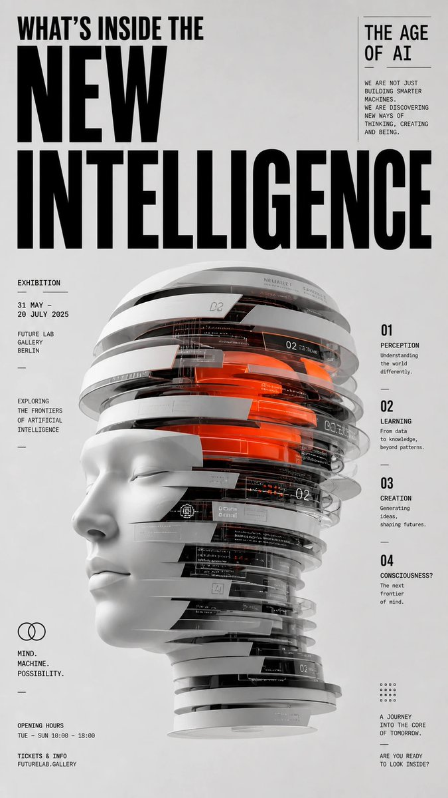</a> |

**프롬프트:**

```
Award-quality graphic design poster, neo-editorial and contemporary editorial style, D&AD / Awwwards / Behance-level visual impact.

Theme: What's Inside the New Intelligence — The Age of AI.

Build a powerful core visual metaphor for this theme — translate the abstract concept into a sculptural, iconic, installation-like object. The central object should appear cut, layered, stretched, stacked, reconstructed, wrapped, or deconstructed, carrying clear conceptual meaning rather than decorative ornament.

Clean, minimal light-gray background with generous whitespace.

High-contrast modern editorial typographic layout: oversized bold black English headline at the top, secondary subtitle, annotation text, exhibition-style information hierarchy.

Swiss editorial grid system with intentional breaks, asymmetric balance, precise alignment, strong rhythm, refined spacing.

Centered or near-centered composition with strong vertical tension.

Materials and rendering: premium product-rendering quality, matte surfaces, subtle reflections, hard-edge cuts, slight inter-layer translucency, suspended sliced structures, refined details, crisp silhouettes.

Color: predominantly black, white and gray with a single striking accent color and very limited secondary accents — restrained, high-end, contemporary.

Lighting: soft studio lighting, subtle shadows, ultra-clean rendering, highly polished but non-glossy, razor-sharp details.

Mood: conceptual, intellectual, exhibition-grade, contemporary, premium, restrained, iconic.

Aspect ratio 9:16, 4K, ultra sharp, ultra detailed, ultra clean, high resolution.
```

## 🧍 캐릭터 디자인 사례

> **엄선된 사례 12개** — [모든 캐릭터 디자인 프롬프트 보기 →](cases/character.md)

<!-- Case 2: Persona5 Character Reference Card (by @iamrednightS) -->
### Case 2: [Persona5 Character Reference Card](https://x.com/iamrednightS/status/2045075682837836265) (by [@iamrednightS](https://x.com/iamrednightS))

|                                                                                                                                                                                                  Output                                                                                                                                                                                                  |
| :------------------------------------------------------------------------------------------------------------------------------------------------------------------------------------------------------------------------------------------------------------------------------------------------------------------------------------------------------------------------------------------------------: |
| <a href="https://evolink.ai/gpt-image-2-prompts?utm_source=github&utm_medium=picture&utm_campaign=awesome-gpt-image-2-API-and-Prompts" target="_blank" rel="noopener noreferrer"></a> |

**Prompt:**

```
基于此角色和背景,请制作一份类似官方设定资料的角色资料卡。
・包含三视图:正面、侧面和背面
・添加角色面部表情的变化・分解并展示服装和装备的详细部分
・添加色板・包含世界观设定的简要说明
・总体上,使用有组织的布局(白色背景,插画风格)高分辨率、专业概念艺术风格
```

<!-- Case 7: Mecha Girl Sea-City Key Visual (by @old_pgmrs_will) -->
### Case 7: [Mecha Girl Sea-City Key Visual](https://x.com/old_pgmrs_will/status/2046144801071079612) (by [@old_pgmrs_will](https://x.com/old_pgmrs_will))

|                                                                                                                                                                                                 Output                                                                                                                                                                                                |
| :---------------------------------------------------------------------------------------------------------------------------------------------------------------------------------------------------------------------------------------------------------------------------------------------------------------------------------------------------------------------------------------------------: |
| <a href="https://evolink.ai/gpt-image-2-prompts?utm_source=github&utm_medium=picture&utm_campaign=awesome-gpt-image-2-API-and-Prompts" target="_blank" rel="noopener noreferrer"></a> |

**Prompt:**

```
A mecha girl mid-teens, pale skin smudged with soot and salt spray, sharp amber eyes with glowing HUD reticles, waist-length ash-white hair tied in a high ponytail whipping in the sea wind, matte gunmetal exoskeleton armor plating her shoulders, forearms and shins, exposed hydraulic pistons at the joints, chest rig with glowing cyan coolant lines, oversized oil-stained hangar jacket half slipping off one shoulder, a massive rail cannon resting on her right shoulder, dog tags and frayed red ribbon at her collar , standing off-center to the left on the rusted edge of a tilted steel platform jutting out over dark water, weight shifted onto one leg, left hand gripping the cannon strap, head turned slightly toward camera with a quiet defiant stare, steam venting from her back thrusters, her ponytail and jacket streaming sideways in the salt wind , a vast derelict sea-city at dusk, colossal megastructures of unknown purpose rising from the ocean in staggered silhouettes, bone-white monolithic towers fused with barnacled steel, cyclopean ring-shaped constructs canted at broken angles, rusted skeletal gantries threaded with dead cables, dark swells rolling between the pylons, shipwrecks half-swallowed at their feet, thick sea fog clinging to the bases while the upper structures pierce into a bruised sky, scattered faint lights blinking high in the towers like distant eyes , moody low-key lighting, cold teal ambient from the overcast sky, warm amber sodium glow leaking from a distant structure camera-right, hard backlight from a low sun behind the towers carving her silhouette, volumetric god rays cutting through sea mist, wet specular highlights on her armor , 35mm anamorphic lens, slight low angle looking up past her shoulder toward the structures, medium-wide shot, shallow depth of field with foreground rust in soft focus, horizontal lens flares, fine atmospheric haze compressing the distant megastructures into layered silhouettes , cinematic anime key visual, painterly digital illustration with crisp line art, desaturated oceanic palette of teal, bone-white and rust punched by small warm accent lights, film grain, high-contrast editorial poster aesthetic . Format 16:9.
```

<!-- Case 11: GTA 6 in Bangalore Flower Market (by @ismajc) -->
### Case 11: [GTA 6 in Bangalore Flower Market](https://x.com/ismajc/status/2048174302164394493) (by [@ismajc](https://x.com/ismajc))

|                                                                                                                                                                                                  Output                                                                                                                                                                                                  |
| :------------------------------------------------------------------------------------------------------------------------------------------------------------------------------------------------------------------------------------------------------------------------------------------------------------------------------------------------------------------------------------------------------: |
| <a href="https://evolink.ai/gpt-image-2-prompts?utm_source=github&utm_medium=picture&utm_campaign=awesome-gpt-image-2-API-and-Prompts" target="_blank" rel="noopener noreferrer"></a> |

**Prompt:**

```
{argument name="game" default="gta 6"} in {argument name="location" default="Bangalore's market flower"} in India
```

👉 **모든 캐릭터 디자인 프롬프트 사례 보기 →**

<!-- Case 18: Stylized 3D Skater Character (by @iamaiistudio) -->
### Case 18: [Stylized 3D Skater Character](https://x.com/iamaiistudio/status/2062038112398954712) (by [@iamaiistudio](https://x.com/iamaiistudio))

| Output |
| :----: |
| <a href="https://evolink.ai/gpt-image-2-prompts?utm_source=github&utm_medium=picture&utm_campaign=awesome-gpt-image-2-API-and-Prompts" target="_blank" rel="noopener noreferrer"></a> |

**Prompt:**

```
Design a stylized 3D cartoon skater character with a premium animated-film look, mixing Pixar-like polish, Spider-Verse energy, and indie street-art attitude.

Character details:
- exaggerated proportions with long, skinny limbs
- oversized hoodie in customizable pink
- baggy ripped denim jeans
- chunky sneakers
- expressive tired-but-confident face
- messy stylized hair
- large headphones
- backpack covered with pins and patches
- standing naturally on a skateboard

Visual style:
Clean cinematic 3D render with soft global illumination, subtle chromatic aberration, ultra-detailed textures, smooth shading, playful but believable anatomy, high-end character design, stylized streetwear fashion, and urban youth energy.

Pose:
Slightly slouched posture, one hand relaxed, cool bored expression, looking sideways.

Background:
Minimal clean studio background with soft shadows and a centered composition.

Extra details:
Add stickers, embroidered patches, smiley pins, doodles, skate-culture details, early-2000s urban energy, cinematic render quality, and a polished animation-studio finish.

Aspect ratio: 4:5 vertical.
```


<!-- Case 19: 40K Power Armour Squad Portrait (by @EvaGlitchAI) -->
### Case 19: [40K Power Armour Squad Portrait](https://x.com/EvaGlitchAI/status/2065204081363435604) (by [@EvaGlitchAI](https://x.com/EvaGlitchAI))

| Output |
| :----: |
| <a href="https://evolink.ai/gpt-image-2-prompts?utm_source=github&utm_medium=picture&utm_campaign=awesome-gpt-image-2-API-and-Prompts" target="_blank" rel="noopener noreferrer"></a> |

**Prompt:**

```
Prompt of the Day: 40K POWER ARMOUR SQUAD ⚔️🛡️💜💚

Today’s Prompt of the Day turns your characters into a 40K-inspired warriors. Yes this was done before but i wanted to see how much better GPT 2 can do it now

Use one character reference for a solo warrior, or attach multiple character references to create a full squad. The prompt is built to count every reference image and turn each one into a separate visible character, with no helmets covering their faces.

Type your chosen scene into the SCENE SELECTOR at the top, then attach your character reference image or images.

Try scenes like:

a brutal battlefield charge
a gothic starship boarding action
a candlelit shrine world cathedral
an industrial forge world
a grim underhive alley
a quiet off-duty barracks scene
a solemn prayer before battle

Have fun with this one ⚔️🛡️

............................PROMPT STARTS HERE............................

SCENE SELECTOR:
[Type the 40K-inspired scene you want here.]
Examples:

brutal battlefield charge through smoke, fire, shell craters, and ruined gothic architecture

boarding action inside a colossal warship corridor
cathedral-like shrine world interior filled with candles, banners, stained glass, and incense haze
industrial forge world with sparks, chains, molten metal, pipes, and huge machinery
command deck before battle with tactical holograms and vast void windows
grim underhive alleyway with pipes, neon grime, metal walkways, and urban decay
heroic last stand surrounded by wreckage, fallen enemies, burning vehicles, and drifting ash
quiet off-duty scene inside a fortress barracks, armoury, workshop, canteen, or hangar
solemn prayer before battle with relics, banners, candles, incense smoke, and sacred war symbols
everyday-life scene in a gothic sci-fi military stronghold, training yard, armoury, repair bay, or mess hall
Use the typed scene selector as the main scene concept.
If no custom scene is typed, choose one of the example scenes that best fits the attached character reference image or images and the overall character vibe.
Adapt the environment, action, pose, props, camera, and mood to match the selected scene.
Keep the final scene clearly inspired by 40K-style grimdark far-future gothic military sci-fi.

STRICT REFERENCE COUNT RULE:
Before creating the image, count the number of attached character reference images.
Create exactly one main character from each attached character reference image.
The number of main characters in the final image must exactly match the number of attached character reference images.
If 1 character reference image is attached, create exactly 1 main character.
If 2 character reference images are attached, create exactly 2 main characters.
If 3 character reference images are attached, create exactly 3 main characters.
If 4 character reference images are attached, create exactly 4 main characters.
If more character reference images are attached, create exactly that same number of main characters.
Each attached character reference image is a separate person.
Each attached character reference image must appear once and only once as their own distinct main character.
Do not treat any attached character reference image as optional.
Do not ignore, drop, replace, combine, or simplify any attached character reference image.

MULTI-CHARACTER IDENTITY RULE:
Use every attached character reference image as its own separate character identity source.
Character 1 must be based only on the first attached character reference image.
Character 2 must be based only on the second attached character reference image.
Character 3 must be based only on the third attached character reference image.
Character 4 must be based only on the fourth attached character reference image.
Continue this pattern for any additional attached character reference images.

Do not use the first attached character reference image to create multiple characters.
Do not duplicate the first character to fill the group.
Do not create variations, twins, clones, alternate outfits, mirrored copies, recolours, or slightly edited versions of the same character.
Do not merge two or more attached character references into one design.
Do not let one character’s face, hairstyle, colours, outfit motifs, body type, species traits, or accessories replace another character’s identity.
SINGLE-CHARACTER FALLBACK RULE:
If only one character reference image is attached, create one main character only.
Do not create a squad, clone group, twin, alternate version, second warrior, companion, or duplicate of the character.
The single character should remain the only main subject.

THREE-CHARACTER PRIORITY RULE:
If three character reference images are attached, this is a three-character squad image.
All three referenced characters must appear together in the same scene.
All three faces must be visible.
All three armour designs must be distinct.
All three characters must be clearly separated in the composition.
Use a readable left-center-right squad arrangement unless the selected scene needs another clear formation.
CHARACTER REFERENCE RULES:
Preserve each attached character’s face shape, hairstyle, hair colour, eye colour, expression, body language, signature colour palette, outfit motifs, accessories, silhouette, species traits, proportions, and overall character vibe.
The final image must clearly show every attached character as a separate, recognizable individual.
Every character must still clearly look like their own attached reference image.

Keep each character’s head uncovered with no helmet, full face mask, or visor covering the face.
The face, hair, and identity of every referenced character must remain clearly visible.
Hard style rule:
Use the attached character reference image or images as the visual style reference for the final image.
Preserve the visual art style, rendering language, line quality, colour handling, facial stylization, shading style, texture treatment, background treatment, and overall stylization of the attached reference image or images while transforming the character or characters into 40K-inspired power-armoured warriors.
If the references are anime, keep them anime. If they are stylized, keep that stylization.
Do not turn the final image photorealistic unless specifically requested.
Scene concept:
Create a 16:9 horizontal widescreen cinematic illustration based on the scene written in the SCENE SELECTOR.
Show the attached character or characters transformed into custom 40K-inspired grimdark far-future power-armoured warriors.
The image should feel heavy, dramatic, mythic, warlike, and character-driven, with strong atmosphere, clear storytelling, and a powerful sense of scale.

Character transformation:
Transform every attached reference character into a custom 40K-inspired power-armoured version of themselves while preserving their original identity.
The redesign should center on massive stylized power armour with broad shoulder plates, reinforced chest armour, heavy gauntlets, armoured boots, thick mechanical joints, gothic sci-fi military detailing, sacred-warrior ornamentation, battlefield wear, and an oversized futuristic weapon.
The armour must feel imposing, brutal, ceremonial, expensive, and engineered for endless war.
Keep the head uncovered so each character’s original face, hair, and expression remain visible.
Use each attached character’s colours, motifs, accessories, outfit shapes, symbols, materials, personality, and overall vibe as the foundation for their armour redesign.
The armour should feel like it belongs in a 40K-inspired universe, but it must be custom-built from the attached character’s own identity.
If multiple characters are present, each one must have a distinct armour design based on their own original reference rather than all wearing identical suits.
Armour design:
Give each character huge futuristic power armour inspired by 40K-style grimdark gothic sci-fi warfare.
Include broad pauldrons, a strong chest plate, layered armour segments, mechanical joints, reinforced thighs, heavy boots, thick gauntlets, power cables, vents, seals, relic-like details, engraved plates, purity-scroll-like decorations, battle damage, and character-specific symbols.
Adapt each armour design to that character’s original style, colour palette, outfit motifs, accessories, personality, and silhouette.
Keep the armour stylized to match the attached reference image or images rather than realistic.

Weapon design:
Give each character a fitting oversized futuristic weapon inspired by 40K-style grimdark sci-fi warfare.
The weapon can be a heavy explosive sci-fi rifle, massive energy weapon, brutal motorized serrated melee weapon, glowing power blade, ceremonial war hammer, plasma-like cannon, heavy pistol, or other far-future battlefield weapon appropriate to their vibe and role.
Each character’s weapon should be different and should match that character’s identity, armour design, and role in the scene.
If the selected scene is calm, ceremonial, or off-duty, the weapon may be held at rest, slung, holstered, leaned nearby, placed on a table, or carried ceremonially, but it should still be visible.
If the selected scene is battle-heavy, make each weapon active, weighty, readable, and integrated into the pose.
Scene adaptation rules:
If the selected scene is battle-heavy, make the action dynamic but readable, with strong poses, clear silhouettes, environmental destruction, smoke, fire, debris, and a strong sense of momentum.
If the selected scene is solemn, sacred, or ceremonial, focus on mood, scale, banners, relics, candles, incense, stained glass, and reverent atmosphere.
If the selected scene is indoors, use gothic sci-fi architecture, industrial machinery, cathedral-scale interiors, fortress spaces, armouries, barracks, command rooms, or military infrastructure that fit the selected location.
If the selected scene is everyday-life or off-duty, keep the armour and 40K-inspired universe intact, but show the character or characters in a grounded moment such as maintenance, briefing, prayer, conversation, eating, resting, training, repairing gear, or preparing equipment.
If multiple characters are present, make their interaction clear and readable, with each one contributing to the scene rather than standing as vague duplicates.
Environment and composition:
Build the environment around the selected scene.
The setting should feel like the kind of place the character or characters naturally belong in once translated into a 40K-inspired grimdark far-future war universe.
Use a wide 16:9 horizontal cinematic composition.
Keep the main subject or subjects clearly visible, central or compositionally dominant, and easy to read at a glance.
If one character is present, give them a strong hero composition with a clear silhouette and dominant visual presence.
If multiple characters are present, arrange them so every character remains readable and identifiable with clean silhouette separation.
For three attached references, use a clear three-person squad composition with all three faces visible.
Use background architecture, smoke, debris, banners, machinery, sparks, haze, relics, gothic shapes, or cathedral-like scale to support the scene without overpowering the characters.
Lighting and mood:
Use lighting that matches the selected scene.
The image should feel grim, cinematic, epic, and immersive, with dramatic contrast and strong atmosphere.
Use battlefield firelight, smoky haze, stained-glass glow, cold ship lighting, industrial sparks, moody rim light, incense haze, harsh military illumination, glowing machinery, or distant explosions where appropriate.
The mood should feel powerful, warlike, sacred, brutal, and character-specific while still reflecting each original character’s personality.
Quality and rendering:
Polished, premium-quality stylized illustration with clean linework, crisp rendering, readable forms, powerful armour design, expressive visible faces, strong weapon design, and clear composition.
Keep the strongest detail concentrated on the referenced character or characters, their armour, their faces, and their weapons.
Maintain strong visual hierarchy and readability.
The background should support the characters rather than becoming busier than them.

Do not:
Do not ignore the SCENE SELECTOR.
Do not create more or fewer main characters than the number of attached character reference images.
Do not create only two characters if three character reference images are attached.
Do not duplicate the first attached character instead of using the second or third reference.

Do not merge multiple attached references into fewer characters.
Do not make any referenced character a clone, twin, recolour, armour variant, or alternate version of another referenced character.
Do not hide, crop, mask, or cover any referenced character’s face.
Do not make every character wear the same identical armour if multiple references are provided.

Do not make the weapon tiny, modern, toy-like, or visually unimportant.
Do not make the background busier than the characters.
Do not make the main subjects blurry, tiny, hidden, or unreadable.
Do not create messy anatomy, extra limbs, malformed hands, distorted faces, or muddy textures.
Do not use photorealism unless specifically requested.

..............................END OF PROMPT..................................
#POTD #promptoftheday #AI #AiArt #Art #AnimeArt #40K #Grimdark #PowerArmour #SciFi #CharacterDesign #DigitalArt #AnimeStyle #CommunityPrompt
```

<!-- Case 20: Vertical Character Concept Sheet (by @iamaiistudio) -->
### Case 20: [Vertical Character Concept Sheet](https://x.com/iamaiistudio/status/2065118633198829601) (by [@iamaiistudio](https://x.com/iamaiistudio))

| Output |
| :----: |
| <a href="https://evolink.ai/gpt-image-2-prompts?utm_source=github&utm_medium=picture&utm_campaign=awesome-gpt-image-2-API-and-Prompts" target="_blank" rel="noopener noreferrer"></a> |

**Prompt:**

```
prompt:

Design a high-resolution vertical character concept poster with a luxurious pink and white aesthetic that blends elegance with edgy modern fashion. The layout should feel like a premium magazine profile with clean sections and precise grid alignment.

Main subject: An original young woman (not based on any real person), with long silky dark hair featuring subtle pink highlights. She has a confident, calm expression with a slightly mysterious aura. She wears a black and pink hybrid outfit (merging streetwear with idol fashion) featuring glossy textures, lace details, and metallic accents. Lighting is soft but dramatic, with a neon pink glow set against dark tones.

Top section:
Large hero portrait on one side. On the opposite side, a sleek profile panel with refined English text:

Name: Nyra Vale
Age: 23
Height: 170 cm
Style: Dark Elegance

Short bio:
"She doesn't follow trends, she sets them. Quiet strength, sharp vision, and a presence that speaks without words."

Include a Traits section with stylized progress bars:

Confidence
Creativity
Discipline
Charisma
Emotional Depth

Middle section:
A grid of 5-6 small portraits capturing different expressions (soft smile, intense gaze, playful smirk, thoughtful, confident).

Lower sections:

Full-body poses (front view, side view, walking pose, power stance, casual stance).
Outfit variations (street luxe, stage outfit, minimal chic).
Accessories panel (heels, boots, chains, rings, handbags, hairstyles).

Text tone:
Bold, meaningful, and confident, emphasizing individuality, self-worth, and quiet power. No filler text.

Style:
Ultra-detailed, 4K quality, glossy magazine finish, cinematic lighting, sharp focus, balanced contrast, modern editorial layout, perfectly aligned grid.

#AIart #GPTImage2
```

<!-- Case 21: 3D Acrobat Jumping Editorial Cartoon (by @iamaiistudio) -->
### Case 21: [3D Acrobat Jumping Editorial Cartoon](https://x.com/iamaiistudio/status/2065058228585844954) (by [@iamaiistudio](https://x.com/iamaiistudio))

| Output |
| :----: |
| <a href="https://evolink.ai/gpt-image-2-prompts?utm_source=github&utm_medium=picture&utm_campaign=awesome-gpt-image-2-API-and-Prompts" target="_blank" rel="noopener noreferrer"></a> |

**Prompt:**

```
prompt:

One complete 3D illustration, editorial exaggerated cartoon style, single standalone image, not a storyboard or multi-panel layout.

Central character: a cartoon figure with a tiny head, chubby round torso, super-long limbs, huge hands and bulky shoes, slightly off-balance, caught mid-jump in a dramatic pose radiating tension and playful energy.

The silhouette reads like a soft toy sculpture — plump, springy, and exaggerated, not anatomically realistic.

Surface quality: matte rubber, fuzzy textile, knitted detail, clay-like feel, subtle fiber grain, handmade texture. Avoid shiny plastic, transparent glass, or high-spec reflections.

Color: vibrant dopamine palette, high saturation, strong color contrasts, large bold flat fills — vivid but not neon-overexposed.

Background: pure white, minimal staging, just a gentle oval drop shadow beneath the character, no elaborate setting.

Decorative floating elements orbiting the character: stars, wavy lines, spheres, cubes, icons, abstract shapes — all sculpted as soft rubber or paper-like 3D props, amplifying motion and graphic energy.

Lighting: soft studio setup, global illumination, diffused shadows, low contrast, polished commercial feel.

Rendered in C4D or Blender: stylized soft-sculpture aesthetic, matte clay finish, knitted fabric surface, playful editorial tone, high resolution.

— Scene: a pastel-toned acrobat throwing both arms up in a victorious airborne leap, wearing chunky multicolor sneakers

#AIart #GPTImage2
```

<!-- Case 22: 雨中灵姬东方幻想 3D CG 角色 (by @liyue_ai) -->
### Case 22: [雨中灵姬东方幻想 3D CG 角色](https://x.com/liyue_ai/status/2065107695557075460) (by [@liyue_ai](https://x.com/liyue_ai))

| Output |
| :----: |
| <a href="https://evolink.ai/gpt-image-2-prompts?utm_source=github&utm_medium=picture&utm_campaign=awesome-gpt-image-2-API-and-Prompts" target="_blank" rel="noopener noreferrer"></a> |

**Prompt:**

```
9:16 竖版，高精度 3D CG 东方幻想女性角色写真，3D CG oriental fantasy beauty portrait，anime-style 3D CG character art，semi-realistic 3D character render，镜头为大腿及上半身构图，画面主体是一位明确成年的年轻东方幻想系女性，视觉年龄约 20–26 岁，整体气质清冷、空灵、精致、安静，带有雨中水系精灵般的神秘感与高级感。整体不是平面插画，而是高完成度 3D CG 角色渲染，具有精致角色建模、真实材质表现、电影级冷调柔光与高级虚拟角色海报质感。

人物拥有精致的东方美型脸，小巧流畅的鹅蛋脸，皮肤冷白细腻，带轻微通透感与柔和皮肤着色，肌肤表面有细腻水珠与湿润反光。眼睛细长清澈，瞳色为冰蓝绿调，瞳孔有通透玻璃感与细致高光，眼神微垂，安静、疏离、略带脆弱感。睫毛纤长，眼妆干净克制，鼻梁秀气挺直，嘴唇柔软，唇色为低饱和裸粉色，嘴唇微启，神情冷静而迷人。

发型为短款蓝黑色渐变发，主色为浓黑与深海军蓝，发尾带冷调蓝色高光，发型为短层次波浪感短发，一侧额发自然垂落遮住部分脸颊，顶部带编发结构，发丝湿润、轻盈、细腻，具有高精度发丝建模与柔顺光泽。耳部佩戴精致蓝色水晶几何耳饰与金属耳骨夹，增强东方幻想与水元素气质。颈部佩戴白色高领装饰项圈与青蓝色宝石流苏细节，精致而高级。

服装为精致的东方幻想水系礼装，上半身穿着白色轻薄、湿润感的缎面的贴身长裙，布料柔软垂坠，带细腻高光和微透感，胸口与躯干线条以克制优雅的方式表现。外层披着一件宽松白色衬衫式轻纱外搭，自然滑落至手臂与腰侧，形成层叠褶皱与飘逸感，增强随性与梦幻氛围。腰臀处可见黑色蕾丝边短裤细节，作为整体造型中的轻哥特点缀，使画面更具层次与精致感，但整体保持高级、克制、不低俗。

人物姿势为优雅侧身站立，身体呈现流畅的 S 型曲线，肩颈舒展，背部与腰线自然延展，头部微微低垂侧转，视线向下，整体姿态安静、轻盈、克制。手臂自然下垂，手指修长，姿态如同在雨中静立的一瞬间，突出侧脸、肩颈、背部、腰臀线条与服装湿润材质的精致表现。

背景调整为精致的东方幻想水境场景，整体以冷白、冰蓝、淡灰为主色调。背景为朦胧的雨幕、轻雾与若隐若现的东方幻想建筑轮廓，可融入远处模糊的亭台、石阶、水池边缘或空灵宫殿轮廓，营造高级幻想空间感。人物周围有动态水花、水流弧线与透明水晶般飞溅效果，像由水元素凝结出的装饰性波纹，背景适度虚化，既通透空灵，又不喧宾夺主。

光线采用冷白主光与柔和逆光结合，整体为雨天高调低饱和电影感打光。面部、锁骨、肩背、手臂与腿部有细腻湿润高光，发丝边缘与水花边缘有轻微轮廓光。白色布料、蕾丝、金属、宝石、水珠与水花都具有真实清晰的材质反馈。整体画面干净、通透、冷艳、梦幻、精修感强，具有高端收藏级 3D CG 东方幻想角色海报质感。

high detail 3D CG render, Unreal Engine quality, Octane render look, cinematic lighting, PBR materials, subsurface scattering skin, realistic wet hair strands, translucent wet fabric, crystal water splash effects, delicate lace details, elegant oriental fantasy styling, aquatic spirit atmosphere, volumetric light, cinematic depth of field, soft bloom, ultra detailed, polished anime realism, premium virtual character portrait
```


<!-- Case 23: Surreal Cartoon Portrait Template (by @Goodmanprotocol) -->
### Case 23: [초현실 카툰 인물 템플릿](https://x.com/Goodmanprotocol/status/2066048157805629937) (by [@Goodmanprotocol](https://x.com/Goodmanprotocol))

<table>
<tr><td width="50%"><a href="https://evolink.ai/gpt-image-2-prompts?utm_source=github&utm_medium=picture&utm_campaign=awesome-gpt-image-2-API-and-Prompts" target="_blank" rel="noopener noreferrer"></a></td><td width="50%"><a href="https://evolink.ai/gpt-image-2-prompts?utm_source=github&utm_medium=picture&utm_campaign=awesome-gpt-image-2-API-and-Prompts" target="_blank" rel="noopener noreferrer"></a></td></tr>
<tr><td width="50%"><a href="https://evolink.ai/gpt-image-2-prompts?utm_source=github&utm_medium=picture&utm_campaign=awesome-gpt-image-2-API-and-Prompts" target="_blank" rel="noopener noreferrer"></a></td><td width="50%"><a href="https://evolink.ai/gpt-image-2-prompts?utm_source=github&utm_medium=picture&utm_campaign=awesome-gpt-image-2-API-and-Prompts" target="_blank" rel="noopener noreferrer"></a></td></tr>
</table>

**Prompt:**

```
Vertical bizarre flat cartoon portrait of [SUBJECT from the attached photo] with a high geometric head shape, a long narrow neck, huge round eyes, a tiny mouth and an unflappable laugh, dressed in [CLOTHES from the photo], with a [OBJECT/CREATURE] sitting on their head like a living hat. Pure black outline, smooth color fills, simple face shapes, rare drawings on animal fur or skin, playful surreal character design, bold graphic palette [COLOR]. Background decorations: [ENVIRONMENT DECORATIONS from LOCATION/SCENE], made using simplified shapes, clear depth, a small amount of scenery from the environment and a clear cartoon perspective. Clear digital illustration, vertical framing in the form of a poster, no realism, no 3D rendering, no picturesque shading, aspect ratio 4:5.
```

<!-- Case 24: 한국 댄스 모션 시트 (by @iamaiistudio) -->
### Case 24: [한국 댄스 모션 시트](https://x.com/iamaiistudio/status/2066659127485718574) (by [@iamaiistudio](https://x.com/iamaiistudio))

| 결과 |
| :----: |
| <a href="https://evolink.ai/gpt-image-2-prompts?utm_source=github&utm_medium=picture&utm_campaign=awesome-gpt-image-2-API-and-Prompts" target="_blank" rel="noopener noreferrer"></a> |

**프롬프트:**

```
[STYLE]
black and white grayscale illustration, 3D rendered character, clean instructional reference sheet,
white background, comic panel grid layout, technical diagram aesthetic

[LAYOUT]
4x4 grid, 16 panels total, each panel divided by thin black borders,
cells numbered 1 through 16, uniform panel dimensions

[CHARACTER]
young female dancer, athletic build, ponytail hairstyle, crop top and baggy pants, sneakers — same character across all panels

[PANEL STRUCTURE - per cell]
top-left: bold number badge + Korean title text
center: full-body character pose illustration
bottom-left: Korean description text (3-4 lines)
overlay: motion arrows showing movement direction

[ARROWS / MOTION INDICATORS]
curved arrows, straight arrows, circular rotation markers,
placed around the character to indicate movement flow and direction

[RENDERING STYLE]
high-detail 3D sculpt style, soft studio lighting, subtle shadows,
no color, grayscale shading, clean linework, game concept art quality

[NEGATIVE]
no background scenery, no color tones, no extra characters,
no cluttered backgrounds
```

<!-- Case 25: 루미넌트 아키비스트 캐릭터 포스터 (by @92digitalartArt) -->
### Case 25: [루미넌트 아키비스트 캐릭터 포스터](https://x.com/92digitalartArt/status/2066558474650095890) (by [@92digitalartArt](https://x.com/92digitalartArt))

| 결과 |
| :----: |
| <a href="https://evolink.ai/gpt-image-2-prompts?utm_source=github&utm_medium=picture&utm_campaign=awesome-gpt-image-2-API-and-Prompts" target="_blank" rel="noopener noreferrer"></a> |

**프롬프트:**

```
Vertical 9:16 full-body cinematic portrait of a single alien character, the Luminant Archivist, standing on a rocky ridge on the twilight band of an alien planet; the creature has a tall elongated body with three root-like legs forming a stable tripod, lower torso textured like smooth bark and sinew fused together; two long arms with four segmented joints each end in multifingered, tendril-like manipulators gently holding a glowing hexagonal plate; instead of a human head, the upper torso flares into a tall crown of layered translucent plates arranged like a vertical fan, each plate lit from within by faint cyan neural patterns, no face, no eyes, no mouth; along its back and shoulders grow rigid bioluminescent data plates, flat hexagonal organisms clinging like barnacles, softly pulsing in cyan, teal and occasional warm amber; the body is draped in a partial organic mantle made of fibrous membrane and chitin filaments, not clothing but grown; background shows a perpetual dusk sky with a low orange band on one horizon and deep indigo on the opposite, distant silhouettes of hollow spires and tiny other Archivists crossing the landscape; ground covered in reflective glassy lichen and small crystals catching the character's glow; palette of deep indigo, dusty violet, cyan glows and subtle warm amber accents; strong horizon rim light outlining the Archivist's silhouette, subtle backlighting from the bioluminescent plates, gentle atmospheric haze; realistic but slightly painterly rendering, extremely detailed textures on skin, plates and lichen; composed like a high-end sci-fi character poster, vertical 9:16 aspect ratio, full body in frame, centered but with enough headroom and ground visible to feel part of a larger universe.

Negative prompt:
human-like alien, humanoid face, eyes, nose, mouth, jaw, blue-skinned human, elf, armor suit, guns, generic sci-fi soldier, anime style, cartoon, chibi, cyberpunk city, neon signs, medieval fantasy, wings, halos, angel, bad anatomy, random extra limbs, cluttered background, oversaturated colors, strong lens distortion, fisheye, low resolution, blurry details, noisy grain, HUD, UI, readable text, watermark, logo, modern Earth clothing, sneakers, jeans, T-shirt
```

<!-- Case 26: 비주얼 노벨 캐릭터 프로필 (by @iamaiistudio) -->
### Case 26: [비주얼 노벨 캐릭터 프로필](https://x.com/iamaiistudio/status/2067308176715001944) (by [@iamaiistudio](https://x.com/iamaiistudio))

| 결과 |
| :----: |
| <a href="https://evolink.ai/gpt-image-2-prompts?utm_source=github&utm_medium=picture&utm_campaign=awesome-gpt-image-2-API-and-Prompts" target="_blank" rel="noopener noreferrer"></a> |

**프롬프트:**

```
Create a high-quality character introduction page using a chibi illustration and a full standing character artwork, styled like an official visual novel (gal-game) character profile page. It should look realistic enough to use on an actual game website. Include CG-style illustrations, facial expression variants, and a chibi version of the character.

"Self-introduction here"

Name: (name here)
Theme color: (color here)
Height: (height here) cm
Weight: (weight here) kg
Catchphrase: "(line here)"
```

<!-- Case 27: 중세 연금술사 캐릭터 시트 (by @itsPixieVerse) -->
### Case 27: [중세 연금술사 캐릭터 시트](https://x.com/itsPixieVerse/status/2067750004178215241) (by [@itsPixieVerse](https://x.com/itsPixieVerse))

| 결과 |
| :----: |
| <a href="https://evolink.ai/gpt-image-2-prompts?utm_source=github&utm_medium=picture&utm_campaign=awesome-gpt-image-2-API-and-Prompts" target="_blank" rel="noopener noreferrer">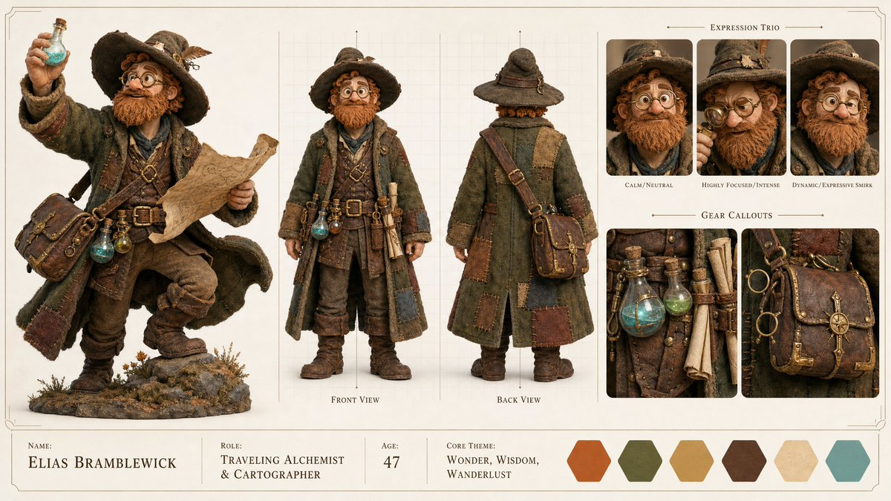</a> |

**프롬프트:**

```
Create a high-end, asymmetric editorial CHARACTER CONCEPT SHOWCASE from these inputs:

[STYLE]: stylized 3D stop-motion claymation style with rich tactile textures of clay, felt, and leather, and warm cinematic studio lighting
[SUBJECT_DESCRIPTION]: A charming and slightly eccentric traveling medieval alchemist and cartographer. He wears a heavy, oversized patched wool coat over a worn leather tunic, multiple small glowing potion vials and rolled-up parchment scrolls strapped to his utility belt, a wide-brimmed traveler's hat, and thick round brass spectacles. He has a messy, hand-sculpted ginger beard, warm curious eyes, and a friendly smile. He carries an ancient, brass-trimmed leather satchel. His design features exaggerated, whimsical proportions and a cozy, rustic medieval aesthetic.

Create the layout in a clean 16:9 widescreen format on a neutral studio gray or warm off-white background with a minimal technical border. The design must look like a premium production visual bible, using clean typography, no clutter, no watermarks, and no logos. Apply [STYLE] only to the character and visual elements, keeping the presentation layout clean, structured, and minimal.

Infer all missing details from the subject description, including name, role, brief background specs, and a cohesive color palette.

Use this tri-fold layout:

1. HERO SPOTLIGHT (Left 40% of the board)
- Show one large, highly detailed full-body dynamic action pose of the subject.
- This pose should showcase the character's primary personality, attitude, and silhouette.

2. TECHNICAL TURNAROUND (Center 35% of the board)
- Show exactly two clean full-body views: Front View and Back View.
- The subject should be in a relaxed, neutral stance.
- Place these views over very subtle vertical and horizontal grid lines resembling a technical schematic blueprint.

3. KEY DETAILS (Right 25% of the board)
- EXPRESSION TRIO: Exactly 3 large, highly expressive close-up headshots showing core emotional states: Calm/Neutral, Highly Focused/Intense, and a Dynamic/Expressive emotion (like a smirk or fierce grin).
- GEAR CALLOUTS: Exactly 2 clean, isolated close-up panels showing primary wardrobe textures, signature accessories, or weapons/gear.

4. SPECS & COLOR BANNER (Bottom Edge)
- A minimalist, horizontal typography block listing Name, Role, Age, and Core Theme.
- Adjacent to the text, display 5 to 6 clean geometric color swatches showing the character's primary color palette with no labels.

Ensure complete character and costume consistency across all sections. The Hero Spotlight must visually anchor the sheet, offering a clean, open, and professional layout that avoids dense, repetitive, or cluttered grids.
```

## 📱 UI 및 소셜 미디어 목업 사례

> **엄선된 사례 40개** — [모든 UI 및 목업 프롬프트 보기 →](cases/ui.md)

<!-- Case 130: One-Prompt UI Design Generation (by @austinit) -->
### Case 130: [One-Prompt UI Design Generation](https://x.com/austinit/status/2044968740782272596) (by [@austinit](https://x.com/austinit))

|                                                                                                                                                                                              Output                                                                                                                                                                                             |
| :---------------------------------------------------------------------------------------------------------------------------------------------------------------------------------------------------------------------------------------------------------------------------------------------------------------------------------------------------------------------------------------------: |
| <a href="https://evolink.ai/gpt-image-2-prompts?utm_source=github&utm_medium=picture&utm_campaign=awesome-gpt-image-2-API-and-Prompts" target="_blank" rel="noopener noreferrer"></a> |

**Prompt:**

```
用这种风格帮我生成一套UI设计系统,包含网页、移动端、卡片、控件、按钮 以及其它
```

<!-- Case 130: Cyberpunk Neon UI Design System (by @AZLnfvp) -->
### Case 130: [Cyberpunk Neon UI Design System](https://x.com/AZLnfvp/status/2046468976092533180) (by [@AZLnfvp](https://x.com/AZLnfvp))

|                                                                                                                                                                                              Output                                                                                                                                                                                              |
| :----------------------------------------------------------------------------------------------------------------------------------------------------------------------------------------------------------------------------------------------------------------------------------------------------------------------------------------------------------------------------------------------: |
| <a href="https://evolink.ai/gpt-image-2-prompts?utm_source=github&utm_medium=picture&utm_campaign=awesome-gpt-image-2-API-and-Prompts" target="_blank" rel="noopener noreferrer"></a> |

**Prompt:**

```
用未来都市风格生成UI设计系统,灵感来自赛博朋克城市夜景,包含霓虹灯、玻璃建筑反射、高对比光影,配色以紫色、蓝色、粉色霓虹为主,设计网页Dashboard、移动端界面、卡片、按钮、控件等,视觉炫酷、层次丰富、科技感极强
```

<!-- Case 130: 12-Panel Storyboard Poster (by @bmx_ai13) -->
### Case 130: [12-Panel Storyboard Poster](https://x.com/bmx_ai13/status/2050432594647642414) (by @bmx_ai13)

|                                                        Output                                                        |
| :------------------------------------------------------------------------------------------------------------------: |
|  |

**Prompt:**

```
A super simple workflow: 2 character images → GPT Image 2.0 storyboard → Seedance 2.0 animation. Just upload two character images and use the prompt below in GPT Image 2.0 to generate a full storyboard on a single page. Prompt: Create a clean, colorful storyboard poster in a 3x4 grid layout with 12 panels on a single page. Title at the top: "[MAIN TITLE]" Each panel must include: a scene number in a small circle, a short scene title, a colorful illustrated image, a 1-2 line description under the image. Main characters must remain visually consistent across all 12 panels: Character 1: [describe main character in detail] Character 2: [describe second character in detail] Theme/story: [overall story theme] Scene breakdown: [Scene title] - [what happens] [Scene title] - [what happens] [Scene title] - [what happens] [Scene title] - [what happens] [Scene title] - [what happens] [Scene title] - [what happens] [Scene title] - [what happens] [Scene title] - [what happens] [Scene title] - [what happens] [Scene title] - [what happens] [Scene title] - [what happens] [Scene title] - [what happens] Design style: cute 3D animated storybook style, warm emotional lighting, bright colors, soft shadows, child-friendly, clean panel borders, readable typography, neat poster composition, high detail. Important: Keep all 12 panels inside one single image. Make the layout clean and balanced. Keep the characters consistent in face, outfit, and colors. Make the text readable and properly placed. No cropped panels. No extra characters unless mentioned. Then upload that storyboard to Seedance 2.0 and use this prompt: Prompt: Generate a scene using the shots in the uploaded film storyboard. No text on screen. That's it.
```

<!-- Case 130: Handwritten Study Infographic Poster (by @YaZoraiz) -->

### Case 130: [Handwritten Study Infographic Poster](https://x.com/YaZoraiz/status/2054264025178079718) (by [@YaZoraiz](https://x.com/YaZoraiz))

|                                                                                                                                                                                                 Output                                                                                                                                                                                                 |
| :----------------------------------------------------------------------------------------------------------------------------------------------------------------------------------------------------------------------------------------------------------------------------------------------------------------------------------------------------------------------------------------------------: |
| <a href="https://evolink.ai/gpt-image-2-prompts?utm_source=github&utm_medium=picture&utm_campaign=awesome-gpt-image-2-API-and-Prompts" target="_blank" rel="noopener noreferrer"></a> |

**Prompt:**

```
Aesthetic handwritten study infographic poster designed like a beautifully organized digital-notebook page, soft pastel color palette with gentle tones of baby pink, sky blue, mint green, lavender, and soft yellow highlights. The background is a realistic notebook paper grid texture with subtle shadows and paper grain for authenticity.
The layout is clean and structured like high-quality study notes, featuring neatly written handwritten-style typography in smooth black ink and blue pen. Content is arranged in well-spaced bullet points, numbered sections, and small boxed highlights for key information. Important words are emphasized using pastel highlighter strokes in pink, yellow, and light blue.

Decorative elements include cute hand-drawn doodles in the margins such as stars, arrows, hearts, smiley faces, paper clips, sticky notes, and simple icons (books, pens, lightbulb,checklist). Sticky notes are layered naturally on the page with soft shadows, slightly tilted for a realistic collage effect.

The composition feels cozy, aesthetic, and highly organized—like a Pinterest viral study aesthetic or an Instagram “studygram” post. Soft lighting, gentle shadows, and minimal clutter ensure readability while maintaining visual charm. The design feels calming, motivating, and academically inspiring.

Ultra-detailed, 4K resolution, top-down flat lay perspective, modern stationery aesthetic, soft depth of field, realistic paper texture, high-end digital illustration style.
```

<!-- Case 130: Brand Identity Moodboard System (by @SaasJunctionHQ) -->

### Case 130: [Brand Identity Moodboard System](https://x.com/SaasJunctionHQ/status/2054666436698845299) (by @SaasJunctionHQ)

|                                                                                                                                                                                               Output                                                                                                                                                                                              |
| :-----------------------------------------------------------------------------------------------------------------------------------------------------------------------------------------------------------------------------------------------------------------------------------------------------------------------------------------------------------------------------------------------: |
| <a href="https://evolink.ai/gpt-image-2-prompts?utm_source=github&utm_medium=picture&utm_campaign=awesome-gpt-image-2-API-and-Prompts" target="_blank" rel="noopener noreferrer"></a> |

**Prompt:**

```
Full-blown brand identity system [BRAND NAME] — Brand Identity Moodboard STEP 1 — DECODE THE BRAND Extract from real brand guidelines only: - Colors: full official palette (primary, secondary, neutrals, accents) — exact, no approximations - Type: weight, width, tracking, capitalization character — applied identically across all cards - Copy: real slogans, campaigns, product names, manifesto phrases — zero invented text - World: the domain (sport / tech / fashion / music / etc.) — all imagery stays inside it STEP 2 — OUTPUT Single 16:9 flat image. Black (#000–#0A0A0A) background. 8 cards in an asymmetric 3-column grid. Uniform 8–12px gaps. Rounded corners 8–12px. Every card uses only Step 1 colors, type, and copy. CARDS — in order: 1. LOGO LOCKUP (wide, top-left) — brand color BG, official logo/wordmark, oversized cropped logo mark as structural graphic. No photo. 2. EDITORIAL PHOTO (mid-left) — dark photo from brand world, manifesto headline in brand type over image, wordmark small at bottom. 3. CAMPAIGN BANNER (wide, bottom-left) — flat accent color BG, real event/campaign headline bold-condensed left side, action photo cropped into right side. 4. STORY FORMAT (tall, center full-height) — full-bleed photo, oversized display type partially cropped by edges, date/location detail top. Mobile story proportions. 5. TYPOGRAPHIC POSTER (upper center-right) — vivid accent BG, campaign headline with one letter replaced by a real brand-world object, edition tag below. 6. COLOR PALETTE (center-right) — vertical equal stripes, one per brand color, color name labeled bottom each stripe. No photo. Zero decoration. 7. PRODUCT MOCKUP (upper right) — studio photo of real brand product or branded device/interface, neutral BG, accurate logo/color/type placement. 8. TYPE PATTERN (lower right) — brand name/slogan repeated as all-over pattern at varied sizes/angles, editorial photo overlaid and color-treated to integrate. RULE: A person who knows this brand must immediately confirm every card belongs to it. Output quality: Behance brand identity case study / agency pitch deck.
```

<!-- Case 130: Landscape Architecture Board (by @iamaiistudio) -->

### Case 130: [Landscape Architecture Board](https://x.com/iamaiistudio/status/2054654236705845670) (by @iamaiistudio)

|                                                                                                                                                                                             Output                                                                                                                                                                                             |
| :--------------------------------------------------------------------------------------------------------------------------------------------------------------------------------------------------------------------------------------------------------------------------------------------------------------------------------------------------------------------------------------------: |
| <a href="https://evolink.ai/gpt-image-2-prompts?utm_source=github&utm_medium=picture&utm_campaign=awesome-gpt-image-2-API-and-Prompts" target="_blank" rel="noopener noreferrer"></a> |

**Prompt:**

```
Generate a 3:4 vertical, competition-grade landscape architecture presentation board. The board blends photorealistic aerial rendering with refined architectural diagram language, in the style of a high-end international landscape competition submission. Mood: calm, atmospheric, regenerative, ecological, scientific yet poetic. Layout (three stacked zones): 1. Top zone: analytical ecological diagrams and mapping overlays. 2. Middle zone: a large aerial landscape rendering as the primary focal image. 3. Bottom zone: a continuous sectional cut through the ecological landscape system. Top analytical zone: • Simplified ecological maps with soft, transparent color overlays. • Ultra-thin linework in white and pale gray. • Diagrams of water flow, circulation systems, ecological networks, habitat zones, and landscape connectivity. • Dashed lines for movement and flow. • Minimal annotations and soft ecological icons. • Floating overlay effect sitting above the rendering. • Very light pastel tones, high transparency, clean spacing, no dense clutter. Middle aerial rendering: • Bird's-eye view of an ecological restoration landscape. • Wetlands, ponds, flowing water systems, vegetation patches, bioswales, regenerative terrain. • Soft, slightly desaturated palette of greens, browns, and muted water blues. • Atmospheric depth with subtle haze in the distance. • Gentle human and ecological activity: walking paths, birds, small environmental interactions. • Wide landscape depth, smooth terrain transitions, calm cinematic environmental lighting. • Soft paper-texture finish integrated into the rendering. Bottom sectional cut: • Continuous section through terrain and ecological systems. • Soil layers, hydrology, groundwater movement, vegetation roots, ecological restoration processes, water filtration systems. • Thin white or pale linework, muted tones, minimal color. • Arrows indicating water movement and ecological flow. • Elegant architectural drafting quality, seamlessly merged into the board. Diagram language: extremely thin and precise linework, slightly softened edges (no harsh vector look), minimal labels, clean scientific notation, soft ecological symbols, balanced between scientific clarity and poetic visualization. Color system: • Base: desaturated greens, earthy browns, muted blue water tones. • Overlay: pale green, soft cyan, light beige, translucent pastel layers. • Avoid saturated accents, harsh contrast, bright reds, or overly graphic colors. Texture and atmosphere: soft atmospheric rendering, slight environmental haze, diffused lighting, subtle paper-grain or printed board texture, refined competition-board aesthetic. Format: 3:4 vertical architectural competition board composition. #AIart #GPTImage2
```

<!-- Case 130: Graphic Design Portfolio Mockup (by @abs_uiux) -->

### Case 130: [Graphic Design Portfolio Mockup](https://x.com/abs_uiux/status/2054594512983310572) (by [@abs_uiux](https://x.com/abs_uiux))

|                                                                                                                                                                                               Output                                                                                                                                                                                              |
| :-----------------------------------------------------------------------------------------------------------------------------------------------------------------------------------------------------------------------------------------------------------------------------------------------------------------------------------------------------------------------------------------------: |
| <a href="https://evolink.ai/gpt-image-2-prompts?utm_source=github&utm_medium=picture&utm_campaign=awesome-gpt-image-2-API-and-Prompts" target="_blank" rel="noopener noreferrer"></a> |

**Prompt:**

```
Create a premium graphic design portfolio mockup in a professional creative studio style. Show a clean, elegant workspace presentation featuring multiple graphic design project cards arranged in a refined grid layout, a modern laptop screen displaying a portfolio homepage, and several printed posters laid out neatly on the desk and mounted on the wall. Use a polished creative-director aesthetic with soft shadows, subtle depth, realistic materials, and a high-end studio atmosphere. Include sleek typography placeholders, branding samples, editorial-style poster designs, business cards, stationery, notebook, pen, coffee cup, desk lamp, and small plant for a realistic studio setup. The design should have a clean grid layout, balanced spacing, soft realistic shadows, premium lighting, and neutral luxury tones such as black, white, warm beige, gray, champagne, and cream. Make the laptop screen show a minimal portfolio interface with project thumbnails, navigation menu, and bold hero text. Add multiple portfolio project cards such as logo design, brand identity, poster design, packaging design, social media design, UI/UX design, and advertising campaign mockups. Arrange everything professionally with a modern minimalist style, sharp details, clean typography, elegant composition, and a premium creative agency presentation look. Style: high-end graphic design portfolio, modern creative studio, luxury branding mockup, clean desk setup, realistic shadows, editorial layout, minimalist premium design, professional presentation, 4K, ultra-detailed.
```

<!-- Case 130: Neo-Noir Character Design Board (by @Mind_Boticni) -->

### Case 130: [Neo-Noir Character Design Board](https://x.com/Mind_Boticni/status/2054542152781431075) (by @Mind_Boticni)

|                                                                                                                                                                                               Output                                                                                                                                                                                              |
| :-----------------------------------------------------------------------------------------------------------------------------------------------------------------------------------------------------------------------------------------------------------------------------------------------------------------------------------------------------------------------------------------------: |
| <a href="https://evolink.ai/gpt-image-2-prompts?utm_source=github&utm_medium=picture&utm_campaign=awesome-gpt-image-2-API-and-Prompts" target="_blank" rel="noopener noreferrer"></a> |

**Prompt:**

```
Create a cinematic realistic character design board for a high-budget neo-noir film production set in a rain-soaked futuristic city. Use a dark charcoal and electric cyan color palette with neon reflections in the background. Avoid generic grids or symmetrical layouts; composition should feel like a stylized director’s pitch board. Design a grounded human character with realistic anatomy, subtle imperfections, and strong emotional presence. Include full-body turnarounds, expressive head angles, cinematic portrait, wardrobe breakdown, fabric texture detail, and production notes. Background: blurred cyberpunk city lights, wet glass reflections, moody atmosphere, soft neon glow. Style: semi-realistic cinematic realism, high contrast lighting, shallow depth of field, film grain, emotional intensity.
```

👉 **모든 UI 및 소셜 미디어 목업 프롬프트 사례 보기 →**

<!-- Case 130: Heliotropic Architecture Board (by @Gdgtify) -->
### Case 130: [Heliotropic Architecture Board](https://x.com/Gdgtify/status/2055773537257034007) (by @Gdgtify)

|                                                                                                                                                                                              Output                                                                                                                                                                                              |
| :----------------------------------------------------------------------------------------------------------------------------------------------------------------------------------------------------------------------------------------------------------------------------------------------------------------------------------------------------------------------------------------------: |
| <a href="https://evolink.ai/gpt-image-2-prompts?utm_source=github&utm_medium=picture&utm_campaign=awesome-gpt-image-2-API-and-Prompts" target="_blank" rel="noopener noreferrer"></a> |

**Prompt:**

```
16:9 autonomous kinetic architecture, the heliotropic tracking mechanics of [aerospace/solar tracking array] shaping an adaptive, luxury [outdoor architectural structure], sequence from [astronomical/solar path diagrams] to [robotic kinematic wireframes] to a programmable louvre abstraction to the final architectural installation, ai to infer smart-motor integration and weather-responsive materials utilizing [material 1] and [material 2], featuring time-lapse shadow projection diagrams, [aesthetic style] aesthetic, presentation layout: solar path charts at the top, robotic hinge details in the margins, stunning photorealistic architectural render below, [lighting style].  input: [deep space network satellite dish array], [smart kinetic patio pergola], [equatorial solar trajectory mapping], [multi-axis pivoting joint schematics], [photovoltaic-coated tinted glass], [extruded matte bronze aluminum], [contemporary silicon valley billionaire estate], [golden hour sunlight casting intricate geometric shadows]
```

<!-- Case 130: Brand Identity Guideline Board (by @Shorelyn_) -->
### Case 130: [Brand Identity Guideline Board](https://x.com/Shorelyn_/status/2055681687284293991) (by @Shorelyn_)

|                                                                                                                                                                                              Output                                                                                                                                                                                              |
| :----------------------------------------------------------------------------------------------------------------------------------------------------------------------------------------------------------------------------------------------------------------------------------------------------------------------------------------------------------------------------------------------: |
| <a href="https://evolink.ai/gpt-image-2-prompts?utm_source=github&utm_medium=picture&utm_campaign=awesome-gpt-image-2-API-and-Prompts" target="_blank" rel="noopener noreferrer"></a> |

**Prompt:**

```
Using the uploaded logo for (Brand name) generate a high-end, agency-grade brand identity system poster.

OBJECTIVE
Create a complete, presentation-ready brand guideline board that looks like it was designed by a top branding studio. The result must feel commercial, realistic, and client-deliverable, not conceptual.

INTELLIGENCE RULE (THIS IS WHAT YOU WERE MISSING)
Before designing, analyze the logo and infer:
3 identity traits (based on analysis)

COLOR SYSTEM (SMART GENERATION)
Extract palette from logo automatically
Include:
Primary colors (3–5)
Secondary colors (3–5)
Accent colors

Each must show:
HEX codes
labeled usage (primary / UI / highlight / background)

Also generate:
gradients
color combinations
tonal variations

TYPOGRAPHY SYSTEM (MATCH PERSONALITY)
Select typography style based on brand:
luxury → elegant serif
tech → geometric sans
street → bold condensed
corporate → clean neutral sans

Show:
headline / subheadline / body
real text examples (brand-relevant, not lorem ipsum)
clear hierarchy

VISUAL LANGUAGE
Define and visualize:
image style (editorial / lifestyle / futuristic / minimal)
lighting (soft / dramatic / high contrast)
mood (energetic / premium / calm / disruptive)

Show:
3–5 visual tiles

BRAND APPLICATIONS (REALISM BOOST)
Generate consistent mockups:
packaging or product
website hero
mobile UI
3 social media creatives
business card
billboard / ad

All must feel real-world usable.

LAYOUT SYSTEM
grid system
spacing scale (4pt / 8pt system)

Show:
UI components
cards
buttons
layout examples

ICONOGRAPHY
6–10 icons style derived from brand (rounded / sharp / minimal / filled)

PATTERNS & ELEMENTS
shapes derived from logo
repeating motifs
background systems

MICRO DETAILS (THIS CREATES “PREMIUM FEEL”)
shadows
reflections
textures
depth layering

VISUAL STYLE CONTROL
modern editorial + system design hybrid
strong hierarchy
layered composition
controlled spacing

DENSITY RULE
minimum 30–50 elements
mix of macro + micro components
no empty or filler space

HARD RESTRICTIONS
no placeholders
no generic UI
no inconsistent styles
no random colors

FINAL OUTPUT
A high-end brand system poster that looks:
Behance feature-worthy
agency presentation-ready
visually consistent and detailed
```


<!-- Case 131: Die-Cut Sticker Illustration (by @Ciri_ai) -->
### Case 131: [Die-Cut Sticker Illustration](https://x.com/Ciri_ai/status/2056616223547548106) (by @Ciri_ai)

|                                                                                                                                                                                                Output                                                                                                                                                                                                |
| :--------------------------------------------------------------------------------------------------------------------------------------------------------------------------------------------------------------------------------------------------------------------------------------------------------------------------------------------------------------------------------------------------: |
| <a href="https://evolink.ai/gpt-image-2-prompts?utm_source=github&utm_medium=picture&utm_campaign=awesome-gpt-image-2-API-and-Prompts" target="_blank" rel="noopener noreferrer"></a> |

**Prompt:**

```
Transform the uploaded image into a premium die-cut sticker illustration while keeping the main subject fully recognizable. Remove or simplify the original background and cleanly isolate the primary subject. Add a thick soft cream or beige sticker border around the entire silhouette with a subtle realistic drop shadow to create a floating sticker effect. Preserve important textures and details while slightly stylizing the image with enhanced colors, cinematic contrast, and a polished editorial l
```

<!-- Case 132: Rider-Waite Tarot Card (by @itsphotogptai) -->
### Case 132: [Rider-Waite Tarot Card](https://x.com/itsphotogptai/status/2056400494709690591) (by @itsphotogptai)

|                                                                                                                                                                                                Output                                                                                                                                                                                                |
| :--------------------------------------------------------------------------------------------------------------------------------------------------------------------------------------------------------------------------------------------------------------------------------------------------------------------------------------------------------------------------------------------------: |
| <a href="https://evolink.ai/gpt-image-2-prompts?utm_source=github&utm_medium=picture&utm_campaign=awesome-gpt-image-2-API-and-Prompts" target="_blank" rel="noopener noreferrer"></a> |

**Prompt:**

```
Create a Tarot card based on what you know about me, in the classic style of Rider-Waite. Portray me as a drawn figure with an expressive, but slightly uneven black line of ink, with vivid fluctuations and variations in the stroke, with flat colors without shading. Add delicate visual elements of the Tarot around the figure. convey the texture of the paper and the feeling of a printed impression.
```
<!-- Case 161: Sitcom Intro Storyboard Sheet (by @KimAkiyama81) -->
### Case 161: [Sitcom Intro Storyboard Sheet](https://x.com/KimAkiyama81/status/2059390326578511931) (by [@KimAkiyama81](https://x.com/KimAkiyama81))

| Output |
| :----: |
| <a href="https://evolink.ai/gpt-image-2-prompts?utm_source=github&utm_medium=picture&utm_campaign=awesome-gpt-image-2-prompts" target="_blank" rel="noopener noreferrer"></a> |

**Prompt:**

```
Create a professional film production storyboard for a 15-second sitcom intro montage in a premium pitch deck presentation. Use multi-panel storyboard sheet layout, cinematic 16:9 framing per panel, clean panel borders, shot descriptions beneath each frame, timing notes, and transition indicators between panels. Maintain strict character consistency for Super Mei, Edvard, and Fenrir across all panels. Include a complete sequence of title flash, living room, backyard walkies, kitchen powers, convenience store raid, monster battle, bonus domestic comedy beats, closing hero shot, and logo slam. Visual style: cinematic sitcom, high-budget live-action network comedy, production-ready fidelity, not animated or illustrated.
```

<!-- Case 162: Brand Identity Guideline Board (by @Ciri_ai) -->
### Case 162: [Brand Identity Guideline Board](https://x.com/Ciri_ai/status/2060938931588472932) (by [@Ciri_ai](https://x.com/Ciri_ai))

| Output |
| :----: |
| <a href="https://evolink.ai/gpt-image-2-prompts?utm_source=github&utm_medium=picture&utm_campaign=awesome-gpt-image-2-API-and-Prompts" target="_blank" rel="noopener noreferrer"></a> |

**Prompt:**

```
Using the uploaded logo for (Brand name) generate a high-end, agency-grade brand identity system poster. ---  OBJECTIVE Create a complete, presentation-ready brand guideline board that looks like it was designed by a top branding studio.

The result must feel commercial, realistic, and client-deliverable, not conceptual. ---  INTELLIGENCE RULE (THIS IS WHAT YOU WERE MISSING) Before designing, analyze the logo and infer:3 identity traits (based on analysis) ---  COLOR SYSTEM (SMART GENERATION) Extract palette from logo automatically Include: Primary colors (3–5) Secondary colors (3–5) Accent colors Each must show: HEX codes labeled usage (primary / UI / highlight / background) Also generate: gradients color combinations tonal

variations ---  TYPOGRAPHY SYSTEM (MATCH PERSONALITY) Select typography style based on brand: luxury → elegant serif tech → geometric sans street → bold condensed
```

<!-- Case 163: Collectible Science Encyclopedia Card (by @iamaiistudio) -->
### Case 163: [Collectible Science Encyclopedia Card](https://x.com/iamaiistudio/status/2061509471810302050) (by [@iamaiistudio](https://x.com/iamaiistudio))

| Output |
| :----: |
| <a href="https://evolink.ai/gpt-image-2-prompts?utm_source=github&utm_medium=picture&utm_campaign=awesome-gpt-image-2-API-and-Prompts" target="_blank" rel="noopener noreferrer"></a> |

**Prompt:**

```
Create a high-quality vertical science encyclopedia infographic for [theme]. Make it feel less like a basic poster and more like a polished modular knowledge card with an encyclopedia, museum-guide, structured-information, and collectible reference-page aesthetic. The style should combine premium natural-history plates, modern encyclopedia spreads, lifestyle knowledge cards, and highly shareable social-media infographics.

Include a clear and attractive main visual for the theme, several enlarged detail callouts, multiple rounded information modules, a strong title hierarchy, concise highlight tags, rich but readable educational copy, and a visual section such as ratings, key takeaways, or a Top 5 list.

Adapt the content modules to the chosen theme. Use the most relevant mix of basic profile, classification, visual traits, behavior or ecology, formation process or structural makeup, growth or usage conditions, care and maintenance guidance, risks and cautions, suitable audiences or use cases, pros and cons, and a quick scoring card.

Use a light clean background, soft coordinated colors, subtle shadows, refined small icons, rounded info boxes, tidy spacing, and dense information that still feels easy to read. The final image should look publishable, collectible, readable, and suitable for a repeatable encyclopedia-card series. Avoid a commercial advertising poster look. Emphasize knowledge organization, modular information design, and illustrated encyclopedia presentation.
```

<!-- Case 164: Pet World Cup Storyboard Sheet (by @CamikaApp) -->
### Case 164: [Pet World Cup Storyboard Sheet](https://x.com/CamikaApp/status/2062355101877231959) (by [@CamikaApp](https://x.com/CamikaApp))

| Output |
| :----: |
| <a href="https://evolink.ai/gpt-image-2-prompts?utm_source=github&utm_medium=picture&utm_campaign=awesome-gpt-image-2-API-and-Prompts" target="_blank" rel="noopener noreferrer"></a> |

**Prompt:**

```
A professional pre-production storyboard sheet for a 12-second photorealistic short film, single landscape page, layout top to bottom:

== TITLE BAR ==
Black bar across full width. Left: massive bold white text "PET WORLD CUP". Right: two outlined boxes "TOTAL VIDEO TIME: 12 SECONDS" and "8 SHOTS · ENSEMBLE · COMEDY · CINEMATIC".

== ICON LEGEND ==
Four icon+label pairs in a row: soccer ball + "BALL ACTION"; paw + "DUEL"; hamster + "MIGHTY MINI"; trophy + "VICTORY".

== MAIN GRID (8 panels, 2×4) ==
Each panel: thin white border, landscape 16:9. Number badge (1-8) top-left, teal "~1.5s" tag top-right, photorealistic still inside, bottom caption bar with icon + ALL-CAPS text.

1. [ball] "PET WORLD CUP FINAL KICKS OFF" — Wide stadium at golden hour. Midfield: orange tabby cat (red jersey) + golden retriever (blue jersey) facing off, ball between them. Deep background: enormous white goalposts with tiny hamster goalkeeper between them. Side: white rabbits in stands with pom-poms. Sunset cinematic light.

2. [paw] "RABBIT CHEERLEADERS BRING THE NOISE" — Close on stands: 3 fluffy white rabbits in tiny jerseys, mouths open cheering, paws shaking red and blue pom-poms in unison. Stadium lights, blurred crowd silhouettes behind.

3. [paw] "CAT VS DOG MIDFIELD DUEL" — Close-up: cat (red jersey) and dog (blue jersey) facing off, ball between their paws. Intense eye contact. Dirt kicking up. Whiskers and ear fluff in motion.

4. [ball] "DOG STEALS, BREAKS AWAY" — Dog with ball at paws charging through midfield. Cat sprinting behind, paws stretched, ears back.

5. [ball] "DOG WINDS UP — SHOT INCOMING" — Dog in classic kick pose, back leg lifted high, eyes locked on distant goal. Deep background: enormous white goalposts with TINY hamster goalkeeper barely visible — dramatic scale contrast.

6. [hamster] "HAMSTER VS THE GIANT GOAL" — Low angle close-up: enormous white goalposts towering over tiny golden Syrian hamster wearing mini yellow goalie gloves. Looking up determined, paws raised ready. Ball flying in from frame edge.

7. [hamster] "EPIC SAVE — TINY BUT MIGHTY" — Hamster in full sprawl leap, paws extended, blocking ball with tiny body. Mid-air freeze frame. Confetti falling, blurred crowd silhouettes raising arms.

8. [trophy] "HAMSTER HERO — TEAMS UNITE" — Wide final shot at golden hour: cat (red) and dog (blue) standing side by side staring in awe at tiny hamster holding up small golden trophy. White rabbits in stands raise pom-poms wildly. Confetti, golden sparkles.

== BOTTOM INFOGRAPHIC (4 sections horizontal) ==
[Clock] VIDEO FLOW: "8 shots × ~1.5s = 12s. Stadium → rabbit fans → cat-vs-dog rivalry → dog shoots → hamster saves → ensemble celebration."

[Camera] CAMERA TIPS: "Wide establishing on stadium, close-up on rabbits, low-angle on midfield duel, side-tracking on breakaway, scale frame on hamster vs goalposts, hero shot on save, wide on celebration."

[Sun] LIGHT & STYLE: "Photorealistic cinematic. Golden-hour stadium light throughout. Warm amber grass, lens flares, real DSLR/iPhone aesthetic. Crisp action focus."

[Person] CHARACTER NOTES: "Cast: orange tabby cat with M-mark (red jersey), golden retriever (blue jersey), golden Syrian hamster with mini yellow goalie gloves (yellow kit), 3-4 white fluffy rabbits with pom-poms. Hamster MUST appear dramatically tiny vs goalposts. All humans/crowd are faceless silhouettes — no faces. Each animal identical across panels."

== STRICT EXCLUSIONS ==
No real soccer team logos, no FIFA/Champions League/UEFA/World Cup branding, no real player faces, no sponsor logos, no national flags, no jersey numbers, no stadium signage with real text, no captions, no watermarks. Plain colored jerseys only. All 8 panels photorealistic — never cartoon/3D/illustration. All animals identical across panels.
```

<!-- Case 165: Cinematic Contact Sheet Generator (by @KingNyalTut) -->
### Case 165: [Cinematic Contact Sheet Generator](https://x.com/KingNyalTut/status/2062330612279611656) (by [@KingNyalTut](https://x.com/KingNyalTut))

| Output |
| :----: |
| <a href="https://evolink.ai/gpt-image-2-prompts?utm_source=github&utm_medium=picture&utm_campaign=awesome-gpt-image-2-API-and-Prompts" target="_blank" rel="noopener noreferrer"></a> |

**Prompt:**

```
Given the scene context, generate the Cinematic Contact Sheet based on the instructions:
<instruction>
Analyze the entire composition of the input image. Identify ALL key subjects present (whether it's a single person, a group/couple, a vehicle, or a specific object) and their spatial relationship/interaction.
Generate a cohesive 3x3 grid "Cinematic Contact Sheet" featuring 9 distinct camera shots of exactly these subjects in the same environment.
You must adapt the standard cinematic shot types to fit the content (e.g., if a group, keep the group together; if an object, frame the whole object):
Row 1 (Establishing Context):
Extreme Long Shot (ELS): The subject(s) are seen small within the vast environment.
Long Shot (LS): The complete subject(s) or group is visible from top to bottom (head to toe / wheels to roof).
Medium Long Shot (American/3-4): Framed from knees up (for people) or a 3/4 view (for objects).
Row 2 (The Core Coverage):
4. Medium Shot (MS): Framed from the waist up (or the central core of the object). Focus on interaction/action.
5. Medium Close-Up (MCU): Framed from chest up. Intimate framing of the main subject(s).
6. Close-Up (CU): Tight framing on the face(s) or the "front" of the object.
Row 3 (Details & Angles):
7. Extreme Close-Up (ECU): Macro detail focusing intensely on a key feature (eyes, hands, logo, texture).
8. Low Angle Shot (Worm's Eye): Looking up at the subject(s) from the ground (imposing/heroic).
9. High Angle Shot (Bird's Eye): Looking down on the subject(s) from above.
Ensure strict consistency: The same people/objects, same clothes, and same lighting across all 9 panels. The depth of field should shift realistically (bokeh in close-ups).
</instruction>
A professional 3x3 cinematic storyboard grid containing 9 panels.
The grid showcases the specific subjects/scene from the input image in a comprehensive range of focal lengths.
Top Row: Wide environmental shot, Full body view, 3/4 cut.
Middle Row: Waist-up view, Chest-up view, Face/Front close-up.
Bottom Row: Macro detail, Low Angle, High Angle.
All frames feature photorealistic textures, consistent cinematic color grading, and correct framing for the specific number of subjects or objects analyzed.

Here is the scene context:
A wide cinematic exterior of the Whitmore estate at dusk in Buckhead, Atlanta. The massive gated modern mansion glows with warm amber lights against the dark tree line, with the circular driveway, lion fountain, and polished landscaping fully visible. The estate feels quiet, powerful, and untouchable — like a private world hidden behind wealth and security.
```

<!-- Case 166: Technical Food Annotation Infographic (by @iamaiistudio) -->
### Case 166: [Technical Food Annotation Infographic](https://x.com/iamaiistudio/status/2062264967722934629) (by [@iamaiistudio](https://x.com/iamaiistudio))

| Output |
| :----: |
| <a href="https://evolink.ai/gpt-image-2-prompts?utm_source=github&utm_medium=picture&utm_campaign=awesome-gpt-image-2-API-and-Prompts" target="_blank" rel="noopener noreferrer"></a> |

**Prompt:**

```
Generate an infographic image of any food item, combining a realistic photograph or photoreal render with technical annotation overlays placed directly on top. Use black ink-style line drawings and text (technical pen / architectural sketch look) on a pure white studio background. Include: key component labels, internal cutaway or exploded-view outlines, measurements and scale markers, material callouts and quantities, arrows indicating function or flow, simple schematic or sectional diagrams where relevant. Place the food name as a title inside a hand-drawn annotation box in one corner. The real object should remain clearly visible beneath the annotations. Annotations should feel sketched, technical, and architectural. Clean composition with balanced negative space, educational museum-exhibit / engineering-manual vibe. White background, black annotation lines and text only, no colors. Output: 1080x1080, ultra-crisp, no watermark.
```

<!-- Case 167: Bazaar Heist Storyboard Card (by @aimikoda) -->
### Case 167: [Bazaar Heist Storyboard Card](https://x.com/aimikoda/status/2062223135454249178) (by [@aimikoda](https://x.com/aimikoda))

| Output |
| :----: |
| <a href="https://evolink.ai/gpt-image-2-prompts?utm_source=github&utm_medium=picture&utm_campaign=awesome-gpt-image-2-API-and-Prompts" target="_blank" rel="noopener noreferrer"></a> |

**Prompt:**

```
Create a 16:9 image.

[PROJECT CARD]
Create a compact designed masthead, not a table.
TITLE: JIEL MARKET HANDS
META LINE: sly fantasy theft / fast-paced bazaar caper / sharp kinetic energy
PRIORITY: readable hand tricks, crowd geography, magical bag payoff
MICRO BRIEF: C1 survives by stealing through a crowded market, chaining fast sleight-of-hand thefts until a witness grabs her arm and becomes her final stolen prize.

[CONTINUITY HEADER]
SEQUENCE ID: JIEL_MARKET_PICKPOCKET_MAGIC_BAG_12P
REFERENCE PRIORITY: attached Jiel character sheet controls C1 face, body, wardrobe, proportions, hood, hair, belt, pouches, boots, wrapped hands; attached market image controls bazaar density, stall layout, warm dust, awnings, crowd scale, and painterly-world texture; this storyboard controls staging, motion, geography, and continuity.

[SCENE PACKET]
PREMISE: A red-hooded thief moves through a crowded old bazaar using collisions, distractions, and hand speed to steal coins, jewelry, and wallets before magically stealing the man who catches her.
LOCATION: sunlit packed market alley, stalls left and right, hanging fabrics overhead, jewelry stall left, fruit baskets right, cloth booth midground, arched exit background, narrow side gap behind C1 screen right.
START -> END: C1 enters from background center with empty hands and hidden satchel -> C2 catches her wrist foreground right, then shrinks and folds into C1's open magic bag as the crowd barely notices.
ACTION CHAIN: master geography -> necklace lift -> bump wallet steal -> cloak-pass coin purse cut -> fruit-stall distraction theft -> fast crowd weave -> witness notices -> wrist grab -> anxious turn -> bag opens with warped pull -> C2 is swallowed into bag -> C1 snaps bag shut and vanishes into crowd.
PROP / EFFECT STATE: small tan satchel at C1 hip begins closed, stolen wallet and coin purse move into her belt pouch, jewelry cord disappears under red cloak, final bag mouth opens with pale spiral distortion and cloth-like pull lines, no gore.
MUST READ: C1's quick hands make ordinary theft look playful until the final theft becomes impossible and supernatural.

[CHARACTER SANITIZATION]
C1: young adult red-hooded thief, short red hair with small twin buns, freckles, slim agile silhouette, cropped cloak, scarf, wrapped hands, utility belt, tan satchel, boots, low quiet posture, quick precise hands.
C2: adult market man, taller average build, rolled sleeves, dark vest, stern stance, one hand grabbing C1's wrist, startled body bend when pulled toward bag.
C3: adult market crowd and vendors, varied robes and hats, readable background silhouettes only.
Remove contradictory traits, invisible psychology, excessive costume detail, and backstory that cannot appear in a panel.

[IDENTITY CONSISTENCY]
Identity reference controls C1 face/body/wardrobe/proportions; keep C1's red hood, short red hair, wrapped hands, belt pouches, tan satchel, boots, and left-to-right movement consistent. Keep C2 as the same adult man from witness beat through bag capture. Do not redesign, age-shift, gender-shift, merge, or beautify characters across panels.

[STORYBOARD PURITY]
Panel images are visual-only low-detail monochrome light-gray rough sketches. Put panel numbers, beat names, and lens tags in the header strip outside each panel image. No color, labels, arrows, captions, subtitles, logos, watermarks, timing marks, diagrams, UI, ghost poses, duplicate bodies, or technical overlays inside panels.

[MASTER SHOT RULE]
P01 shows full playable bazaar geography: stalls left and right, overhead cloth, crowd lanes, C1 center path, side gap screen right, arched exit background, and where C2 can later enter from foreground right.

[EMOTIONAL ARC]
quiet control -> playful precision -> rising risk -> caught alarm -> impossible reversal -> clean escape. Show it through lowered shoulders, hidden hand angles, sudden eye-line shifts, wrist tension, C2's forward lean, and C1's final compact snap-shut pose.

[STYLE LOCKS]
STYLE LOCK: clean monochrome rough-sketch storyboard inside panels, light-gray gesture lines, simplified bazaar forms, readable silhouettes, restrained off-white sheet design with tiny rust and dark-teal accents outside panel artwork only.
EFFECT LOCK: final magic bag effect is a pale sketch spiral and fabric-warp pull, medium thickness, soft edges, no colored glow inside panels, no gore or horror gore.
ENVIRONMENT LOCK: crowded warm old bazaar layout stays consistent; market detail remains simplified sketch, not dense finished concept art.

[SPATIAL CONTINUITY LOCK]
P01, P06, P08, P09, P10, P11, and P12 share one market-alley layout. Later panels are closer angles or a wider return on the same axis, not redesigned locations. Lock jewelry stall left, fruit baskets right, cloth booth midground, overhead awnings, arched exit background, and C2 entering from foreground right. Allowed changes: camera distance, crowd gaps, C1 pose, stolen prop state, bag open/closed state, and C2's body position during the magical pull.

[DIRECTOR STRIP]
Bottom animatic track board aligned to panel columns. Tracks: BEAT LINE, CAMERA PATH, ACTION PATH, RHYTHM TRACK, ESCALATION MAP, STATE TRACK, STYLE TRACK. Use shot chips, thin lines, rhythm blocks, small intensity bars, one-to-three-word labels. No seconds or timestamps.
RHYTHM TRACK format: `RHY P [hold|slow reveal|build|burst|impact|pause|recover|final hit] / [short block|medium block|long block] / [clean beat|match beat|smash beat|held beat|whip beat]`.
ESCALATION MAP format: `ESC P [L1 calm|L2 tension|L3 rise|L4 surge|L5 peak] / [flat|rise|spike|drop|release|unresolved]`.
PANEL HEADERS: P01 / 24mm wide / Bazaar master -> P02 / 50mm / Necklace lift -> P03 / 35mm / Bump wallet -> P04 / macro insert / Coin purse cut -> P05 / 35mm / Fruit distraction -> P06 / overhead wide / Crowd weave -> P07 / 85mm / Witness sees -> P08 / 50mm / Wrist catch -> P09 / 85mm portrait / Anxious turn -> P10 / 35mm / Bag opens -> P11 / 24mm wide / Man stolen -> P12 / 50mm / Snap escape
CAMERA + LENS PLAN: P01 wide geography hold -> P02 side track 50mm -> P03 handheld bump 35mm -> P04 macro insert -> P05 whip pan 35mm -> P06 overhead tactical wide -> P07 compressed witness close -> P08 crash-in 50mm -> P09 reaction close -> P10 low side 35mm -> P11 wider distortion hold -> P12 follow-off 50mm
ACTION PATH: P01 C1 threads center lane -> P02 fingers lift necklace cord -> P03 shoulder bump frees wallet -> P04 blade-like fingers cut coin purse -> P05 fruit spill hides bracelet grab -> P06 C1 slips through closing crowd -> P07 C2 checks empty pouch -> P08 C2 grabs C1 wrist -> P09 C1 turns with held breath -> P10 C1 opens satchel against C2 arm -> P11 C2 folds into bag pull -> P12 C1 shuts bag and exits
RHYTHM TRACK: P01 RHY P01: hold / medium block / clean beat -> P02 RHY P02: burst / short block / clean beat -> P03 RHY P03: impact / short block / smash beat -> P04 RHY P04: burst / short block / clean beat -> P05 RHY P05: burst / short block / whip beat -> P06 RHY P06: build / medium block / match beat -> P07 RHY P07: pause / short block / held beat -> P08 RHY P08: impact / short block / smash beat -> P09 RHY P09: pause / short block / held beat -> P10 RHY P10: build / short block / clean beat -> P11 RHY P11: impact / medium block / smash beat -> P12 RHY P12: final hit / short block / clean beat
ESCALATION MAP: P01 ESC P01: L1 calm / flat -> P02 ESC P02: L2 tension / rise -> P03 ESC P03: L3 rise / spike -> P04 ESC P04: L2 tension / drop -> P05 ESC P05: L3 rise / spike -> P06 ESC P06: L3 rise / rise -> P07 ESC P07: L4 surge / spike -> P08 ESC P08: L4 surge / rise -> P09 ESC P09: L5 peak / spike -> P10 ESC P10: L5 peak / unresolved -> P11 ESC P11: L5 peak / spike -> P12 ESC P12: L3 rise / release
STATE TRACK: P01 bag closed empty -> P02 necklace hidden -> P03 wallet in palm -> P04 coin purse loose -> P05 bracelet pocketed -> P06 loot belt bulge -> P07 C2 empty pouch -> P08 wrist locked -> P09 C1 caught -> P10 bag mouth open -> P11 C2 shrinking/folding -> P12 bag shut C1 exits right
STYLE TRACK: P01 pale bazaar sketch -> P02 quick hand line -> P03 impact blur sketch -> P04 clean insert -> P05 crowd smear -> P06 overhead lanes -> P07 tight stare -> P08 wrist tension -> P09 face close -> P10 spiral sketch -> P11 fabric warp -> P12 dust escape

[SEQUENCE]
Grid: 12 panels in a 4x3 storyboard sheet; fast-cut caper montage with a shared bazaar geography, clear theft inserts, caught reaction, magical bag reversal, and active escape ending.
```

<!-- Case 168: Luxury Starter Pack Vision Board (by @mehvishs25) -->
### Case 168: [Luxury Starter Pack Vision Board](https://x.com/mehvishs25/status/2062355934589108655) (by [@mehvishs25](https://x.com/mehvishs25))

| Output |
| :----: |
| <a href="https://evolink.ai/gpt-image-2-prompts?utm_source=github&utm_medium=picture&utm_campaign=awesome-gpt-image-2-API-and-Prompts" target="_blank" rel="noopener noreferrer"></a> |

**Prompt:**

```
Ultra-detailed luxury feminine “Starter Pack” vision board poster featuring an adorable chibi-style girl as the central character, inspired by premium collectible dolls and Pinterest luxury aesthetics. She has huge sparkling brown eyes, long wavy black hair, soft glamorous makeup, glossy lips, delicate jewelry, and a confident yet cute expression.

Outfit: elegant monochrome ivory-white fashion look consisting of a fitted blazer, cropped top, high-waisted mini skirt, sheer tights, luxury handbag, and stylish heels. Sophisticated, classy, feminine, and fashion-forward.

Composition: the character stands in the center surrounded by an elaborate scrapbook-style collage pinned onto a warm beige aesthetic wall. Numerous Polaroid photos, torn-paper notes, journal pages, gold heart pins, washi tape, dried flowers, doodles, handwritten quotes, and lifestyle snapshots create a premium vision-board effect.

Photo memories surrounding her include:

working on a MacBook in a luxury café

taking photographs with a camera

traveling through international airports

shopping in fashionable city streets

posing in elegant outfits

enjoying luxury vacations

golfing on a beautiful course

coffee dates and aesthetic lifestyle moments

content creation and personal branding

dream destinations around the world

Vision board sections include:
Traits, Goals, Daily Habits, Manifestations, Bucket List, Travel Dreams, Future Plans, Success Tracker, Self-Care Routine, Weekly Goals, and Motivational Quotes.

Foreground desk setup: designer planner, leather journal, luxury pen, coffee mug with inspirational typography, skincare products, perfume bottle, candles, flowers, wallet, sunglasses, beauty accessories, and elegant stationery arranged aesthetically.

Color palette: soft beige, cream, ivory, champagne, warm taupe, nude blush, and subtle gold accents.

Lighting: warm natural window light, soft shadows, cozy luxury atmosphere, dreamy glow, realistic depth and layering between papers and objects.

Style: luxury Pinterest mood board, feminine entrepreneur aesthetic, high-end scrapbook design, premium lifestyle branding, cute collectible doll character, handcrafted paper textures, layered collage artwork, editorial photography quality.

Quality: hyper-detailed, ultra-realistic materials, photorealistic objects, cinematic lighting, 8K resolution, masterpiece composition, sharp focus, intricate details, luxury magazine cover aesthetic, trending social-media poster design, collectible art quality.
```

<!-- Case 169: Embossed Metal Logo Bas-Relief (by @iamaiistudio) -->
### Case 169: [Embossed Metal Logo Bas-Relief](https://x.com/iamaiistudio/status/2063065673740497022) (by [@iamaiistudio](https://x.com/iamaiistudio))

| Output |
| :----: |
| <a href="https://evolink.ai/gpt-image-2-prompts?utm_source=github&utm_medium=picture&utm_campaign=awesome-gpt-image-2-prompts" target="_blank" rel="noopener noreferrer"></a> |

**Prompt:**

```
Replace [BRAND NAME] with your brand and [COLOR] with your preferred metal tone.

Act as a Senior CGI Artist. Create a premium bas-relief logo visualization where the brand mark appears embossed outward from a metallic surface, like a coin, hallmark stamp, or luxury seal. The logo rises as a unified raised form from the surface itself.

Surface: One continuous material plane filling the entire canvas. Use the metal tone from [COLOR]: silver/grey becomes brushed steel, gold becomes warm brushed metal, black becomes anodized aluminum, white becomes matte ceramic, saturated colors become anodized colored metal. Apply radial brushed grain and fine film grain for tactility.

Emboss: The brand's primary logo mark rises as a full bas-relief, like a coin die-stamp. The entire filled silhouette pushes outward as one solid mass at uniform height. Top face is slightly convex, catching key light. Smooth beveled edge transitions from flat surface to raised form. Interior negative spaces recess back to surface level. Substantial raised height like a thick coin.

Lighting: Primary soft area light from upper-left (10-11 o'clock), broad and diffused. Light temperature matches [COLOR]: cool white for silver/grey/blue, warm amber for gold/copper, neutral for white/black. Subtle fill light from lower-right at 10-15% intensity. No hard shadows.

Typography: Below the embossed mark, minimal lockup on the same surface. Small flat brand icon, brand name in spaced geometric caps, one light italic descriptor line (founding year, category, or tagline). Centered, vertically stacked.

Render: Ray tracing enabled for self-shadowing. Full sharpness edge to edge. Uniform film grain. No chromatic aberration. The mark must read as PUSHED OUTWARD from the surface.
```

<!-- Case 170: Sculptural Fruit Packaging Design (by @iamaiistudio) -->
### Case 170: [Sculptural Fruit Packaging Design](https://x.com/iamaiistudio/status/2062959343658754160) (by [@iamaiistudio](https://x.com/iamaiistudio))

| Output |
| :----: |
| <a href="https://evolink.ai/gpt-image-2-prompts?utm_source=github&utm_medium=picture&utm_campaign=awesome-gpt-image-2-prompts" target="_blank" rel="noopener noreferrer"></a> |

**Prompt:**

```
Professional product photography of a sculptural packaging design built for [Fruit Name]. The box is premium corrugated cardboard shaped and cut into the exact silhouette of a giant [Shape — spherical, curved, or elongated] [Fruit Name].

Outer surface is printed with a bold, minimal [Pattern — geometric hexagons / organic wavy lines / botanical line-art / horizontal ridges] that echoes the natural skin texture, rendered in a duo-tone scheme of [Color 1] and [Color 2].

Die-cut window panels expose the [Product Inside] nestled inside. Clean modern sans-serif text on the side reads "[BRAND NAME]". Eco details include a recycling icon and a sculpted corrugated [Stem / Leaf / Crown] on top.

Soft diffused studio lighting, gentle drop shadows, set against a solid pastel [Background Color]. 8K, photorealistic, cinematic framing, industrial design aesthetic.
```

<!-- Case 171: Luxury Perfume Infographic Ad (by @iamrealsnow) -->
### Case 171: [Luxury Perfume Infographic Ad](https://x.com/iamrealsnow/status/2062888729023557979) (by [@iamrealsnow](https://x.com/iamrealsnow))

| Output |
| :----: |
| <a href="https://evolink.ai/gpt-image-2-prompts?utm_source=github&utm_medium=picture&utm_campaign=awesome-gpt-image-2-prompts" target="_blank" rel="noopener noreferrer"></a> |

**Prompt:**

```
Ultra-premium luxury perfume infographic advertisement, centerpiece crystal perfume bottle with intricate glass detailing, surrounded by flowing liquid gold splashes and floating flower petals, elegant black and gold color palette, cinematic studio lighting, glossy reflections, fashion magazine quality, luxury beauty campaign design.

Highly organized infographic layout with premium sections and elegant typography:
• Fragrance Pyramid (Top Notes, Heart Notes, Base Notes) with luxury ingredient visuals.
• Key Ingredients showcase with realistic botanical illustrations.
• Longevity and Performance metrics using premium golden icons.
• Bottle Design Breakdown with callout lines and annotations.
• Perfect Occasions section featuring luxury lifestyle imagery.
• How To Wear guide with minimalistic illustrated icons.
• Sustainability, Cruelty Free, Premium Craftsmanship badges.

Center composition dominated by hero perfume bottle, surrounded by information panels arranged symmetrically. Gold foil typography, luxury branding elements, elegant dividers, premium editorial layout, luxury cosmetics catalog design, infographic meets high-end advertisement, sophisticated visual hierarchy, ultra-detailed glass textures, photorealistic product rendering, luxury magazine spread, award-winning advertising agency quality, masterpiece, ultra sharp details, HDR, 8K, commercial product photography.

Style references: Chanel, Dior, Tom Ford, Maison Francis Kurkdjian, luxury fashion magazine editorial, premium infographic design, black background, gold accents, museum-quality luxury presentation.
```

<!-- Case 172: AAA Game Loading Screen Portrait (by @yulikay) -->
### Case 172: [AAA Game Loading Screen Portrait](https://x.com/yulikay/status/2062850006537953367) (by [@yulikay](https://x.com/yulikay))

| Output |
| :----: |
| <a href="https://evolink.ai/gpt-image-2-prompts?utm_source=github&utm_medium=picture&utm_campaign=awesome-gpt-image-2-prompts" target="_blank" rel="noopener noreferrer"></a> |

**Prompt:**

```
Step 1. Uploaded a reference selfie to Higgsfield.

Generated the still loading screen using GPT Image 2.

Prompt (you can adjust the details with your name, bio, etc.):

Generate a hyper-realistic in-game cinematic still from a fictional unreleased AAA video game, rendered in Unreal Engine 5 with MetaHuman-quality character fidelity, Nanite-level environment detail, and full ray-traced lighting. The result should look indistinguishable from a real 4K screenshot pulled directly from a modern AAA title like Death Stranding 2, Hellblade 2: Senua's Saga, The Last of Us Part 2, Cyberpunk 2077, or Black Myth: Wukong.

The character (right two-thirds of the frame)

Render the uploaded person Image 1 as the playable protagonist of this fictional game. Keep the person's exact facial likeness, skin tone, eye colour, and hair colour as the anchor (the digital double must read as them, not a generic model).

Photoreal skin: visible pores, subsurface scattering through the cheeks and ears, micro-detail on the lips, faint natural blemishes preserved. Hair rendered with individual strand detail, soft physics, slight backlit halo. Eyes with full catchlight, wet sheen, subtle iris detail, faint moisture in the lower lid line.

Wardrobe: contemporary cinematic styling that fits the game's world.
- A tailored cropped leather jacket over a fitted silk top, with delicate gold chain jewellery

Pose: three-quarter angle, head turned slightly toward camera, calm confident posture. Subtle stylized stance, not theatrical.

The environment (background)

A photoreal AAA game environment behind the character. Pick ONE based on mood:
- Golden-hour rooftop of a fictional cinematic Tokyo, neon signs in soft bokeh, distant skyline, warm haze
- Misty forest with shafts of god rays cutting through canopy, soft moss detail, distant fog
- Rain-slick neon-lit alley in a Cyberpunk-style city, puddles reflecting magenta and teal, drifting steam
- A coastal cliff at golden hour, wildflowers in the foreground, ocean haze on the horizon

Full Lumen global illumination, ray-traced reflections, photoreal depth of field with character in sharp focus and background in cinematic soft blur. Photoreal volumetric lighting and atmospheric haze.

UI overlay (left third of the screen)

A minimalist modern AAA game UI panel, semi-transparent matte black with thin warm-gold accent lines (inspired by Death Stranding's clean menu aesthetic). The panel feels expensive, technical, and restrained.

Display the following character profile, rendered in a custom game-UI typeface (clean modern serif for headings, fine sans-serif for body):

- CHARACTER: YULI
- TITLE: The Soft-Power Heroine
- CLASS: Wanderer · Creator · Aesthete
- LEVEL: 30
- REGION: Currently exploring · Asia
- AFFINITY: Light & Warmth
- BIO: Main Character Energy

Each field separated by a thin gold dividing line. Subtle text glow.

Game title bar (top of frame)

At the top centre, a fictional AAA game title in refined serif: "AETHER · A Soft Power Adventure"
Below it, in fine all-caps tracked text: "CHAPTER ONE · NOW LOADING..."

Loading bar (bottom of frame)

A horizontal minimalist loading bar at 73% complete. The filled portion glows faint warm gold. Below the bar in small italic text: "TIP: Beauty is data. Travel often. Save your screenshots."

Visual treatment (post-processing)

Cinematic AAA post-processing stack: subtle chromatic aberration at edges, soft film grain, gentle vignette, faint lens dirt on the highlights, warm-cool colour grading. The image should feel like a 4K screenshot taken from a $200 million production game, not a graphic poster.

Output

4K resolution, 16:9 aspect ratio, photoreal AAA quality, screenshot-authentic. Looks like a frame pulled from a real high-end console game running on a PS5 Pro or high-end PC.
```


<!-- Case 173: Energy Drink Storyboard Grid (by @Strength04_X) -->
### Case 173: [Energy Drink Storyboard Grid](https://x.com/Strength04_X/status/2063256718902219255) (by [@Strength04_X](https://x.com/Strength04_X))

| Output |
| :----: |
| <a href="https://evolink.ai/gpt-image-2-prompts?utm_source=github&utm_medium=picture&utm_campaign=awesome-gpt-image-2-API-and-Prompts" target="_blank" rel="noopener noreferrer"></a> |

**Prompt:**

```
- Create a high-energy 16:9 energy drink advertising storyboard in 3x2 grid (6 frames), editorial layout, Monster/Red Bull style, matte black + electric green palette. Structured flow: pre-game locker room, can crack open close-up, first sip slow motion, athlete explosive start, peak performance moment, victory fist pump closure. Each frame split: top cinematic image (no text) + bottom storyboard notes. Underground sports aesthetic, zero to hundred mood, energy as superpower. A single energy drink can cracking open is the emotional center throughout. Add a bold heading at the top of the storyboard in aggressive bold font reading: NO LIMITS — AN ENERGY EDITORIAL.

KLING AI 3.0 PROMPT :- This is a storyboard image containing 6 frames arranged in a 3x2 grid. Treat each frame as a separate sequential scene. Animate every frame one by one from left to right, top to bottom. Start from frame 1 top-left, then frame 2, then frame 3, then frame 4, then frame 5, end with frame 6 bottom-right. Each frame must play for exactly 2.5 seconds. Total video duration 15 seconds. Do not merge frames together. Do not skip any frame. Do not loop. Play each frame in strict order as one continuous uninterrupted cinematic video. Use locker room fluorescent light flickering over athlete in pre-game silence, can tab cracking open with mist spray in extreme slow motion macro, first sip with throat gulp visible and eyes sharpening in real time, explosive sprint start with ground crack effect and motion blur, peak performance jump with sweat flying off body in slow motion, victory fist pump with crowd blur and electric green light flare. Add subtle motion within each frame only, smooth dissolve transitions between frames. Lighting transitions from cold locker room fluorescent blue to electric green can crack flash to harsh outdoor performance sun to victory green flare closure. Underground sports aesthetic, zero to hundred raw energy mood, drink as pure superpower. A single energy drink can cracking open remains the emotional focus across all 6 frames. Ultra-realistic, 4K photographic quality, no cartoon style.
```

<!-- Case 174: Anime Short Film Dev Board (by @HeyAbhishek) -->
### Case 174: [Anime Short Film Dev Board](https://x.com/HeyAbhishek/status/2063271070426435756) (by [@HeyAbhishek](https://x.com/HeyAbhishek))

| Output |
| :----: |
| <a href="https://evolink.ai/gpt-image-2-prompts?utm_source=github&utm_medium=picture&utm_campaign=awesome-gpt-image-2-API-and-Prompts" target="_blank" rel="noopener noreferrer"></a> |

**Prompt:**

```
"Create a single vertical anime development board for an original emotional short film titled "One More Player". Output ONE combined image with 2 sections: top section = character design sheet, bottom section = cinematic storyboard page.
STYLE: ultra high-quality nostalgic late 90s / early 2000s anime movie look, premium hand-drawn animation style, beautifully painted backgrounds, rich environmental detail, cinematic composition, soft but highly refined shading, natural character anatomy, expressive faces, subtle texture, realistic wet ground reflections, warm cloudy sunset lighting, atmospheric depth, polished old-anime film aesthetic, visually stunning frame quality, clean studio-level pre-production presentation. Make it feel like a premium old anime film, not modern glossy anime.
IMPORTANT: create fully original characters. Do not copy any existing anime, manga, game, or sports anime characters, faces, hairstyles, outfits, or famous designs.
SECTION A: CHARACTER DESIGN SHEET
Show 5 original characters clearly and consistently.
Main child:
A shy little boy around 8 years old with short messy dark hair, large warm eyes, slim build, oversized yellow T-shirt, blue shorts, and small sneakers. He feels nervous at first, then happy and accepted.
Show:
- front view
- side view
- back view
- 3/4 view
- expressions: nervous, scared, surprised, soft smile, happy
- poses: holding soccer ball, standing shyly, running with ball
Teen group:
Four teenage boys around 14 to 16, sporty and friendly, each with different hairstyles and casual soccer outfits. They should look slightly intimidating at first from the little boy’s perspective, but actually kind and welcoming. One teen is the warm leader.
Show for the teen group:
- simple front, side, back, and 3/4 views
- relaxed poses
- soccer poses
- smiling expressions
Keep them original, visually distinct, and cohesive.
Add small handwritten design notes and simple color swatches.
SECTION B: STORYBOARD PAGE
Create 8 cinematic storyboard panels in a clean grid. Use red panel borders, blue motion arrows, handwritten camera notes, timing notes, and short action notes. Keep all characters consistent.
Story beats:
1. Four teenagers playing soccer on a neighborhood ground after light rain, warm cloudy sunset, wet reflections on the field.
2. The soccer ball flies away toward the sitting area beside the field.
3. A shy little boy sitting alone notices the ball and picks it up.
4. The teenage boys walk toward him together. From the little boy’s view, they look a little scary.
5. Close-up of the little boy holding the ball with a nervous face.
6. The warm leader smiles kindly and gestures with his hand, inviting the boy to come play.
7. The little boy’s face changes from scared to relieved, then he smiles and runs toward them.
8. Final wide shot: the little boy happily plays soccer with the four teens under warm sunset light.
ENVIRONMENT:
Neighborhood soccer ground, wet dusty field, simple goalpost, sitting area beside the field, chain-link fence, trees, cloudy sunset sky, calm old-anime mood.
FINAL GOAL:
Make this a clean, highly polished, premium-quality anime pre-production board with beautiful cinematic presentation, emotional storytelling, strong readability, and a heartwarming ending. The image should look visually rich, refined, and high-end."
```

<!-- Case 175: Editorial Anatomy Infographic Poster (by @iamaiistudio) -->
### Case 175: [Editorial Anatomy Infographic Poster](https://x.com/iamaiistudio/status/2063202176344932732) (by [@iamaiistudio](https://x.com/iamaiistudio))

<table>
<tr><td width="50%"><a href="https://evolink.ai/gpt-image-2-prompts?utm_source=github&utm_medium=picture&utm_campaign=awesome-gpt-image-2-API-and-Prompts" target="_blank" rel="noopener noreferrer"></a></td><td width="50%"><a href="https://evolink.ai/gpt-image-2-prompts?utm_source=github&utm_medium=picture&utm_campaign=awesome-gpt-image-2-API-and-Prompts" target="_blank" rel="noopener noreferrer"></a></td></tr>
</table>

**Prompt:**

```
prompt:

Ultra-clean editorial infographic poster (1080x1080 square), blending premium magazine design with lifestyle illustration and photography.

**HEADLINE:**
Bold, large sans-serif type centered at top: "HUMAN LIVER"

**MAIN IMAGE:**
High-detail 3D illustration of the human liver, showing the Right Lobe, Left Lobe, and Gallbladder. Color palette: terracotta, deep brownish-red, and soft coral tones. Background: clean, soft beige or off-white. Lighting: soft studio style.

**POSTER SECTIONS:**

* **Floating Fact Bubbles (top corners):**
    * "Weight: ~1.5 kg (Heaviest internal organ)"
    * "Regeneration: Can regrow from just 25%"
    * "Location: Upper Right Abdomen"
    * "Blood Flow: Filters 1.4 L/min"

* **Organ Labels (arrows pointing to anatomy):**
    * Right Lobe
    * Left Lobe
    * Gallbladder (greenish sac below)
    * Common Bile Duct
    * Hepatic Portal Vein

* **Key Functions (left column, small icons):**
    * **Detox:** Filters toxins from blood
    * **Bile:** Aids fat digestion
    * **Metabolism:** Processes carbs and protein
    * **Storage:** Holds glycogen, iron, vitamins

* **Highlights (right column, small icons):**
    * **Chemical Factory:** 500+ vital functions
    * **Immunity:** Fights blood-borne infections
    * **Clotting:** Makes blood-clotting proteins

* **Health Tips (bottom cards):**
    1. **Limit Alcohol** - Prevents cirrhosis
    2. **Stay Hydrated** - Flushes toxins
    3. **Balanced Diet** - Low sugar, high fiber
    4. **Vaccinate** - Hepatitis A & B protection
    5. **Exercise** - Burns fat and triglycerides

**STYLE:** Glassmorphism frosted-glass text boxes, soft drop shadows, medical accuracy meets high-end graphic design.
```

<!-- Case 176: Graphite Coffee-Shop Storyboard (by @insmind_com) -->
### Case 176: [Graphite Coffee-Shop Storyboard](https://x.com/insmind_com/status/2063252153612017766) (by [@insmind_com](https://x.com/insmind_com))

| Output |
| :----: |
| <a href="https://evolink.ai/gpt-image-2-prompts?utm_source=github&utm_medium=picture&utm_campaign=awesome-gpt-image-2-API-and-Prompts" target="_blank" rel="noopener noreferrer"></a> |

**Prompt:**

```
Create a rough black-and-white graphite pencil storyboard in a 3x3 grid, nine 16:9 panels, with hand-drawn borders, panel numbers, motion arrows, music notes, and handwritten director notes.

Storyboard for a premium animated coffee-shop hip-hop commercial for insMind. Keep the same young female barista throughout: expressive eyes, high messy bun with loose curls, white barista shirt with tiny pale-blue details, black neck scarf with a small insMind logo, dark fitted trousers, white flat shoes. Warm modern cafe interior, espresso machine, wooden counter, pastry case, large windows, soft daylight.

Show these beats: opening push-in with the barista singing, steam wand frothing milk like stage smoke, wide hip-hop side-step, body wave with scarf logo visible, overhead latte pour, macro foam rings, delighted reaction, top-down latte art spelling “insMind”, and final hero reveal as she offers the cup to camera.

Use rough pencil lines, grayscale shading, sketch texture, cinematic storyboard composition, expressive unfinished production-board style. Avoid polished color render, photorealistic stills, vector art, extra characters, subtitles, UI, or unreadable brand spelling.
```

<!-- Case 177: Venice Travel Vlogger Collage (by @ZaraIrahh) -->
### Case 177: [Venice Travel Vlogger Collage](https://x.com/ZaraIrahh/status/2063432414945591594) (by [@ZaraIrahh](https://x.com/ZaraIrahh))

| Output |
| :----: |
| <a href="https://evolink.ai/gpt-image-2-prompts?utm_source=github&utm_medium=picture&utm_campaign=awesome-gpt-image-2-API-and-Prompts" target="_blank" rel="noopener noreferrer"></a> |

**Prompt:**

```
Young female travel vlogger exploring Venice, Italy across 13 wildly candid, chaotic, funny, and uniquely Venetian moments, stunning with long windswept hair, effortless luxury European summer fashion, playful adventurous personality, authentic handheld iPhone collage aesthetic with natural imperfections, unfiltered travel energy, social media realism, spontaneous vacation chaos.

Frame Breakdown Includes: — accidentally boarding the wrong vaporetto and enthusiastically waving at the dock before realizing she's headed in the opposite direction — struggling to drag an oversized suitcase over a steep stone canal bridge, laughing at the absurdity of it — getting completely lost in Venice's labyrinth of narrow alleys and emerging into a deserted hidden courtyard with a confused expression — chasing a paper city map as the wind sends it flying toward a canal — being unexpectedly surrounded by a massive flock of pigeons in Piazza San Marco while clutching a half-eaten pastry — attempting an elegant gondola selfie but getting caught off guard when the gondola suddenly rocks — discovering a tiny hidden bookstore and reacting dramatically to a sleeping cat curled up among the books — squeezing through an impossibly narrow Venetian alleyway and realizing halfway through that it's much tighter than expected — trying to pose gracefully in a beautiful Venetian carnival mask while struggling not to laugh — caught in a sudden rain shower as historic squares become reflective and crowded with umbrellas — confidently following a shortcut only to reach a dead-end canal with no bridge, staring in disbelief — accidentally walking into the background of an extravagant luxury wedding photoshoot near a historic palace — Final frame: sitting beside a quiet canal at blue hour, surrounded by shopping bags, a melting gelato, and a crumpled city map, laughing uncontrollably after spending the entire day hopelessly lost, candid shaky capture, motion blur, authentic Venice travel chaos

Style: ultra-realistic travel vlog collage, Venice street photography, handheld smartphone camera aesthetic, imperfect framing, accidental photobombs, candid expressions, genuine laughter, iconic Venetian architecture, canals, gondolas, historic bridges, hidden alleyways, European summer atmosphere, natural lighting, motion blur, lens flares, overexposed highlights, authentic memories, cinematic storytelling, high-detail realism, viral travel content, no studio polish, no posing, spontaneous documentary-style moments, social media realism, chaotic vacation energy, luxury travel influencer aesthetic.
```


<!-- Case 178: Modern Recipe Infographic Board (by @iamaiistudio) -->
### Case 178: [Modern Recipe Infographic Board](https://x.com/iamaiistudio/status/2063724080717783194) (by [@iamaiistudio](https://x.com/iamaiistudio))

| Output |
| :----: |
| <a href="https://evolink.ai/gpt-image-2-prompts?utm_source=github&utm_medium=picture&utm_campaign=awesome-gpt-image-2-API-and-Prompts" target="_blank" rel="noopener noreferrer"></a> |

**Prompt:**

```
Ultra-clean modern recipe infographic. Showcase your dish in a visually appealing finished form, sliced, plated, or portioned, floating slightly in perspective or angled view. Arrange ingredients, steps, and tips around the dish in a dynamic editorial layout, not top-down. Ingredients: include icons or mini illustrations for each ingredient with quantities, arranged in clusters, lists, or circular flows connected visually to the dish. Steps: show preparation steps with numbered panels, arrows, or lines forming a logical flow. Include small cooking icons (knife, pan, oven, timer) where helpful. Optional info: total calories, prep/cook time, servings, spice level displayed as clean bubbles or badges. Visual style: editorial infographic meets lifestyle food photography. Vibrant natural food colors, subtle drop shadows, clean vector icons, modern typography, soft gradients or glassmorphism for step panels. Accent colors highlight key info. Composition: finished meal as hero visual (perspective or angled), ingredients and steps flow dynamically around the dish, clear visual hierarchy, enough negative space to keep design airy and readable. Lighting: soft natural studio lighting, minimal textured or gradient background for premium editorial feel. Output: 1080x1080, ultra-crisp, social-feed optimized.

Full prompt:
```

<!-- Case 179: INNER SIGNAL Brand Poster Series (by @bmx_ai13) -->
### Case 179: [INNER SIGNAL Brand Poster Series](https://x.com/bmx_ai13/status/2063726489905123489) (by [@bmx_ai13](https://x.com/bmx_ai13))

| Output |
| :----: |
| <a href="https://evolink.ai/gpt-image-2-prompts?utm_source=github&utm_medium=picture&utm_campaign=awesome-gpt-image-2-API-and-Prompts" target="_blank" rel="noopener noreferrer"></a> |

**Prompt:**

```
👇
{
  "project_title": "INNER SIGNAL",
  "concept_type": "Brand Identity Poster Series",
  "brand_name": "SIGNAL",
  "tagline": "FEED THE INNER SIGNAL",
  "style": {
    "look": "bold experimental editorial branding",
    "mood": "mysterious, powerful, rebellious, premium",
    "colors": ["black", "crimson red", "white"],
    "lighting": "hard red light, deep shadows, high contrast",
    "texture": "film grain, halftone, motion blur"
  },
  "design_rules": {
    "typography": "bold uppercase sans-serif, Swiss-style layout",
    "layout": "clean grid, strong negative space, recurring minimal logo mark",
    "visual_language": "cinematic, fashion-forward, dark, sharp, minimal"
  },
  "brand_message": "Build identities that do not blend in. Designed for ambitious brands that want presence, confidence, and creative impact.",
  "poster_series": [
    {
      "title": "The Two Selves",
      "subject": "dark human silhouette with two blurred side profiles behind the head",
      "meaning": "inner conflict, identity, duality",
      "text_overlay": "FEED THE INNER SIGNAL.",
      "prompt": "A bold branding poster with a lone dark silhouette against a glowing crimson red background. Two blurred shadow profiles appear behind the head, suggesting dual identity and inner voices. High contrast red and black lighting, minimal white logo mark, bold uppercase typography, cinematic editorial style, film grain, clean Swiss layout."
    },
    {
      "title": "The Crowd Signal",
      "subject": "crowd silhouettes facing a giant glowing red screen",
      "meaning": "presence, influence, voice rising above noise",
      "text_overlay": "SIGNALS RISE ABOVE NOISE.",
      "prompt": "A premium poster showing a dark crowd in silhouette facing a large glowing red screen with abstract geometric shapes. The scene feels cinematic and intense, with black shadows, crimson atmosphere, subtle haze, white typography, and a modern branding layout."
    },
    {
      "title": "The Focused Face",
      "subject": "close-up portrait with a red line crossing the eyes",
      "meaning": "clarity, vision, self-definition",
      "text_overlay": "DESIGNED TO BE SEEN.",
      "prompt": "A close-up fashion portrait of a person in deep shadow against a solid crimson background. A thin red band crosses the eyes, creating a futuristic and psychological feel. High-end editorial lighting, minimal white text, black clothing, premium poster design."
    },
    {
      "title": "The Instinct",
      "subject": "aggressive black dog or wolf under red light",
      "meaning": "raw creative power, instinct, fearless energy",
      "text_overlay": "RAISING THE STANDARD OF CREATIVE INSTINCT.",
      "prompt": "A dark animal portrait poster featuring a black dog or wolf emerging from shadow under intense red lighting. Teeth visible, powerful expression, black background, white typography, bold brand aesthetic, gritty film texture, luxury editorial composition."
    },
    {
      "title": "The Connection",
      "subject": "black carabiner linking thick ropes",
      "meaning": "systems, structure, trust, connection",
      "text_overlay": "BRAND SYSTEMS. CREATIVE DIRECTION.",
      "prompt": "A clean branding poster with a black metal carabiner connecting two thick ropes against a pure crimson red background. Glossy highlights, product-style lighting, centered composition, minimal white logo mark, Swiss typography, sleek premium design."
    },
    {
      "title": "The Hidden Beast",
      "subject": "abstract halftone tiger or leopard face",
      "meaning": "ambition, hidden force, controlled danger",
      "text_overlay": "FOR AMBITIOUS BRANDS THAT MOVE WITH INTENT.",
      "prompt": "An abstract poster showing a tiger or leopard face formed with red halftone texture emerging from deep black space. Mysterious and intense mood, experimental print look, minimal white typography, strong contrast, premium creative studio identity."
    }
  ],
  "master_prompt": "Create a 6-poster brand identity series for a fictional creative studio named SIGNAL. Use only black, crimson red, and white. The posters should feel cinematic, premium, rebellious, and intelligent. Use high-contrast editorial visuals, deep shadows, red lighting, film grain, halftone texture, bold uppercase typography, and minimal logo repetition. Themes include dual identity, influence, vision, instinct, connection, and ambition."
}
```

<!-- Case 180: Industrial Packaging Design Sheet (by @iamaiistudio) -->
### Case 180: [Industrial Packaging Design Sheet](https://x.com/iamaiistudio/status/2063735848257167383) (by [@iamaiistudio](https://x.com/iamaiistudio))

<table>
<tr><td width="50%"><a href="https://evolink.ai/gpt-image-2-prompts?utm_source=github&utm_medium=picture&utm_campaign=awesome-gpt-image-2-API-and-Prompts" target="_blank" rel="noopener noreferrer"></a></td><td width="50%"><a href="https://evolink.ai/gpt-image-2-prompts?utm_source=github&utm_medium=picture&utm_campaign=awesome-gpt-image-2-API-and-Prompts" target="_blank" rel="noopener noreferrer"></a></td></tr>
</table>

**Prompt:**

```
Full prompt:

Using the attached image, create a professional industrial packaging design illustration sheet.

Feature a centered hero 3D render with realistic materials, soft studio lighting, and commercial-grade finish quality. Surround the hero render with technical views: front, side, top, bottom, angled perspective, and flat layout.

Include structural construction sketches, fold lines, seam details, and dimension arrows with measurements in millimeters. Show materials and finishes (matte, glossy print, plastic, paper, glass, etc.) using handwritten-style annotations. Add color swatches, realistic product illustrations, and subtle shadows.

Background should resemble clean sketchbook paper, combining realistic rendering with pencil sketch overlays. Modern industrial design aesthetic, ultra-detailed, portfolio-ready presentation.
```

<!-- Case 181: Chrome Logo Editorial System (by @iamaiistudio) -->
### Case 181: [Chrome Logo Editorial System](https://x.com/iamaiistudio/status/2063644125510217787) (by [@iamaiistudio](https://x.com/iamaiistudio))

| Output |
| :----: |
| <a href="https://evolink.ai/gpt-image-2-prompts?utm_source=github&utm_medium=picture&utm_campaign=awesome-gpt-image-2-API-and-Prompts" target="_blank" rel="noopener noreferrer"></a> |

**Prompt:**

```
prompt:

[BRAND NAME]. You are a Senior 3D Product Visualization Artist and Cinematic Art Director specializing in luxury brand key visuals for high-end editorial and streetwear campaigns.

PHASE 1: LOGO SUBJECT

Identify the official logo/logotype of [BRAND NAME]. Render it with maximum fidelity to the original silhouette, proportions, and geometry — no distortion, no stylization. Extrude the logo into a solid 3D object with depth approximately 15–20% of its height. Coat all surfaces — front face, side extrusion, beveled edges — in hyper-polished liquid chrome (reflectance 0.98, near-perfect mirror). Apply full ray-traced environment reflections so the logo mirrors the surrounding sky gradient, flower field, and light sources. Moderate bevel radius on all hard edges to catch sharp specular highlights. Add Subsurface Scattering on thin structural parts (fine lines, serifs, icon details) for a subtle inner glow. Place 4–8 prismatic 4-point star lens-flare sparkles at highest specular peaks — corners, tips, curved peaks. Organic distribution, not uniform. Zero matte surfaces. Zero plastic look. The entire logo must read as cast from liquid silver.

PHASE 2: ENVIRONMENT & BACKGROUND

Background: wide cinematic landscape at golden-lilac hour (just after sunset). Dense flower field fills the lower third — lavender and white wildflowers with realistic micro-texture and subtle wind motion-blur on far clusters. Middle ground fades to soft purple-grey bokeh. Sky gradient: warm blush rose ( at horizon through lilac ( to cool powder blue ( at top. Add 3–5 silhouetted bird clusters in upper quadrants. Volumetric atmospheric haze on the horizon. Shift the environment's color palette to reflect [BRAND NAME]'s iconic brand identity — introduce the brand's signature hue as a tonal wash in the sky gradient or dominant flower color. The environment must feel art-directed specifically for this brand.

PHASE 3: COMPOSITION & LAYOUT

Format: 1:1 square. Chrome logo centered horizontally at vertical midpoint, monumental scale spanning 65–80% of frame width. Subtle 2–4 degree forced perspective tilt for dynamic energy without distorting logo recognition. Bottom edge of the logo grazes or slightly overlaps the top of the flower field, integrating the 3D object naturally. Logo casts a soft diffused shadow into the flowers. Lower-left corner: 2–3 lines of micro-copy in clean white sans-serif at minimal optical size — a poetic 3-line brand statement relevant to [BRAND NAME]'s heritage and aesthetic. Bottom-left: "[BRAND NAME]" in small caps logotype label. Bottom-right: a secondary flat 2D chrome version of the same logo as a finishing mark.

PHASE 4: LIGHTING

Primary: large soft area light from upper-left simulating post-sunset overcast sky — fully diffused, no hard shadows, 5800K with lilac tint overlay. Secondary: warm 3200K rim light grazing bottom and side edges from behind — golden separation halo between object and field. Global Illumination enabled — chrome logo realistically bounces and absorbs landscape ambient color. The field's purple tones should be faintly visible in the lower reflective surfaces. Volumetric god rays faintly visible through any logo negative space or cutouts.

TECH SPECS

Octane Render aesthetic. Ray Tracing: 16+ bounces. Depth of Field: f/11 equivalent — full logo sharp, far background in soft bokeh only. Tone mapping: lifted blacks, compressed highlights, filmic S-curve. Color grade: desaturated midtones, preserved pastels, cool shadow tones. Film grain: subtle (ISO 200 equivalent). Chromatic Aberration: 0.2–0.3px on peripheral logo edges only. Anti-aliasing: maximum. No AI-plastic normals. No smooth uniform shading. Microscopic surface imperfections on chrome required — micro-scratches, 0.5% roughness noise map. Mood: luxury brand retrospective editorial for Highsnobiety or AnOther Magazine.
```

<!-- Case 182: Skincare UGC Storyboard Board (by @WanderingC76) -->
### Case 182: [Skincare UGC Storyboard Board](https://x.com/WanderingC76/status/2063797516731294055) (by [@WanderingC76](https://x.com/WanderingC76))

| Output |
| :----: |
| <a href="https://evolink.ai/gpt-image-2-prompts?utm_source=github&utm_medium=picture&utm_campaign=awesome-gpt-image-2-API-and-Prompts" target="_blank" rel="noopener noreferrer"></a> |

**Prompt:**

```
(Luxury AI UGC skincare campaign board), warm beige aesthetic, beautiful female influencer with glowing healthy skin, holding a skincare serum bottle toward the camera, natural smile, cozy bedroom environment, soft natural daylight, realistic home setting, elegant neutral decor.

Large hero portrait on the left side.

Right side featuring (6 UGC storyboard panels):
(Hook Shot),
(Product Introduction),
(Product Application),
(Lifestyle Shot),
(Results Shot),
(Call To Action).

Each panel showing realistic influencer actions and natural expressions.

Bottom section featuring (Key Ingredients Box) with elegant skincare icons and ingredient highlights.

Additional product close-ups, serum texture shots, lifestyle B-roll images, premium beauty advertising layout.

(Soft Natural Lighting),
(Real & Relatable),
(Clean Editorial Design),
(UGC Creator Style),
(Premium Skincare Branding),
(Warm Beige Color Palette),
(Photorealistic),
(Ultra Detailed),
(Vertical 9:16),
(8K Quality).

Negative Prompt:
watermark, logo, low quality, blurry, bad anatomy, distorted hands, cluttered layout, dark lighting, cartoon, CGI.
```


<!-- Case 183: Early Internet Portfolio Page (by @Kashberg_0) -->
### Case 183: [초기 인터넷 스타일 포트폴리오 페이지](https://x.com/Kashberg_0/status/2065992579502747850) (by [@Kashberg_0](https://x.com/Kashberg_0))

<table>
<tr><td width="50%"><a href="https://evolink.ai/gpt-image-2-prompts?utm_source=github&utm_medium=picture&utm_campaign=awesome-gpt-image-2-API-and-Prompts" target="_blank" rel="noopener noreferrer"></a></td><td width="50%"><a href="https://evolink.ai/gpt-image-2-prompts?utm_source=github&utm_medium=picture&utm_campaign=awesome-gpt-image-2-API-and-Prompts" target="_blank" rel="noopener noreferrer"></a></td></tr>
<tr><td width="50%"><a href="https://evolink.ai/gpt-image-2-prompts?utm_source=github&utm_medium=picture&utm_campaign=awesome-gpt-image-2-API-and-Prompts" target="_blank" rel="noopener noreferrer"></a></td></tr>
</table>

**Prompt:**

```
Design a minimal early-internet personal profile webpage / digital portfolio landing page on a large white canvas with generous negative space and a thin pastel pink browser-style frame. In the center, place a black-and-white editorial portrait of [SUBJECT], featuring soft film grain, subtle scanner texture, and low-contrast photographic tones.

Surround the portrait with scattered profile metadata labels and small star-bullet elements arranged asymmetrically, resembling a playful personal résumé. Include descriptors such as:

✦ creator
✦ model
✦ stylist
✦ DJ
✦ girl
✦ photographer
✦ collector
✦ dreamer

In the top-left corner, create a colorful hand-drawn logo or personal brand mark. Beneath it, add a tiny timestamp and date in a small system font, mimicking an old personal homepage.

In the top-right corner, place irregular sticker-like navigation tabs in bright accent colors (pink, cyan, purple, yellow, and green). Use simple labels such as:

HOME
ABOUT
WORK
DIARY
LINKS

Scatter handwritten marker-style notes, introductions, personal thoughts, and lifestyle captions throughout the empty space. Examples:

"currently making things online"
"welcome to my homepage"
"music, fashion, internet"
"updated today"
"living between projects"

Maintain an anti-grid editorial layout with intentionally imperfect spacing and playful placement. Mix tiny system fonts, handwritten script, and casual notebook-style annotations. Keep the portrait entirely monochrome while reserving color only for the logo, navigation stickers, and a few small graphic accents.
```

<!-- Case 184: 색연필풍 사진 변환 (by @AIwithSynthia) -->
### Case 184: [색연필풍 사진 변환](https://x.com/AIwithSynthia/status/2066154697828782245) (by [@AIwithSynthia](https://x.com/AIwithSynthia))

| Output |
| :----: |
| <a href="https://evolink.ai/gpt-image-2-prompts?utm_source=github&utm_medium=picture&utm_campaign=awesome-gpt-image-2-API-and-Prompts" target="_blank" rel="noopener noreferrer"></a> |

**제출 가이드라인:**

```
Transform the uploaded photo into a charming hand-drawn colored-pencil and crayon illustration while preserving the person's exact pose, facial features, outfit, expression, and background composition. Create a warm, whimsical sketchbook aesthetic with visible pencil strokes, crayon textures, and soft pastel colors.

Place the illustrated version as the main full-frame artwork. Add playful doodles around the scene such as hearts, stars, flowers, clouds, sparkles, and cute hand-drawn elements that complement the environment. Use textured paper as the canvas background and maintain a cozy, nostalgic, storybook feel.

In the bottom-right corner, include a rounded-rectangle inset containing the original unedited photo as a realistic reference image. The inset should resemble a social media post preview with subtle UI elements like a heart icon and engagement count. Ensure the illustrated version perfectly matches the original photo in composition, creating a striking before-and-after transformation effect.

Highly detailed, colored pencil illustration, crayon art style, hand-sketched textures, vibrant yet soft pastel palette, Instagram-style layout, whimsical doodles, premium artwork, realistic reference inset, masterpiece, ultra-detailed, 4K.
```

<!-- Case 185: 마스코트 브랜드 아이덴티티 시트 (by @iamaiistudio) -->
### Case 185: [마스코트 브랜드 아이덴티티 시트](https://x.com/iamaiistudio/status/2066568983453880412) (by [@iamaiistudio](https://x.com/iamaiistudio))

| 결과 |
| :----: |
| <a href="https://evolink.ai/gpt-image-2-prompts?utm_source=github&utm_medium=picture&utm_campaign=awesome-gpt-image-2-API-and-Prompts" target="_blank" rel="noopener noreferrer"></a> |

**프롬프트:**

```json
{
  "type": "18-section complete brand identity and mascot design sheet",
  "brand": {
    "name": "{argument name=\"brand name\" default=\"MUYANG TEA\"}",
    "industry": "{argument name=\"industry\" default=\"tea shop\"}",
    "colors": ["{argument name=\"primary color\" default=\"yellow\"}", "{argument name=\"secondary color\" default=\"green\"}", "white", "brown", "dark green"]
  },
  "subject": "{argument name=\"character description\" default=\"3D rendered cute Shiba Inu mascot wearing a green apron\"}",
  "layout": {
    "grid": "3-column by 6-row grid layout",
    "sections": [
      {
        "title": "01 BRAND DNA ANALYSIS",
        "elements": ["brand logo", "5 color swatches", "6 brand icons", "target audience charts"]
      },
      {
        "title": "02 CONCEPT MOODBOARD",
        "elements": ["5 reference photos", "4 mood icons", "design concept equation"]
      },
      {
        "title": "03 FORM STUDY",
        "elements": ["4 logo anatomy icons", "4 design evolution steps", "4 character silhouettes"]
      },
      {
        "title": "04 CONCEPT EXPLORATION",
        "elements": ["12 line-art character concept sketches"]
      },
      {
        "title": "05 REFINED LINE ART",
        "elements": ["3 rows of front and side view line art with proportion guides"]
      },
      {
        "title": "06 DETAIL REFINEMENT",
        "elements": ["2 full-body renders with annotation labels", "4 circular close-up views"]
      },
      {
        "title": "07 EXPRESSION SHEET",
        "elements": ["11 3D rendered facial expressions"]
      },
      {
        "title": "08 POSE LIBRARY",
        "elements": ["9 full-body 3D rendered character poses"]
      },
      {
        "title": "09 TURNAROUND VIEW",
        "elements": ["5 full-body 3D renders from multiple angles", "5 matching line-art views"]
      },
      {
        "title": "10 COLOR DEVELOPMENT",
        "elements": ["5 rows of 5-color palette options", "color psychology explanations"]
      },
      {
        "title": "11 MATERIAL SPECIFICATION",
        "elements": ["5 surface texture swatches", "material property sliders", "4 manufacturing process icons"]
      },
      {
        "title": "12 COLOR APPLICATION",
        "elements": ["4 color scheme variant renders", "2 light and dark mode renders", "4 contrast rating indicators"]
      },
      {
        "title": "13 CONSTRUCTION GUIDE",
        "elements": ["2 line-art technical diagrams for geometry and grid system"]
      },
      {
        "title": "14 DESIGN SYSTEM RULES",
        "elements": ["minimum size icons", "clear space diagram", "4 correct and incorrect usage examples"]
      },
      {
        "title": "15 ASSET VARIANTS",
        "elements": ["3 scaled size variants", "3 line-art style variants", "3 simplified flat icon heads"]
      },
      {
        "title": "16 DIGITAL APPLICATIONS",
        "elements": ["1 app icon design", "2 social media avatar versions", "UI component elements", "3-frame animation cycle"]
      },
      {
        "title": "17 PHYSICAL APPLICATIONS",
        "elements": ["plush toy product mockup", "product packaging mockup", "branded merchandise mockup", "retail storefront mockup"]
      },
      {
        "title": "18 FINAL RENDERING",
        "elements": ["large high-resolution 3D mascot render holding tea cup", "finalized logo", "deliverable file format list"]
      }
    ]
  }
}
```

<!-- Case 186: 건축 제품 카탈로그 페이지 (by @iamaiistudio) -->
### Case 186: [건축 제품 카탈로그 페이지](https://x.com/iamaiistudio/status/2066447564132745574) (by [@iamaiistudio](https://x.com/iamaiistudio))

| 결과 |
| :----: |
| <a href="https://evolink.ai/gpt-image-2-prompts?utm_source=github&utm_medium=picture&utm_campaign=awesome-gpt-image-2-API-and-Prompts" target="_blank" rel="noopener noreferrer"></a> |

**프롬프트:**

```
Create a vertical 3:4 product design catalog page with a warm neutral paper-like background.

Top section — lifestyle hero shot: place the product (use the uploaded image as the exact reference, preserving its form, proportions, materials, and identity without redesign) center-dominant with generous whitespace. Setting is a minimal architectural interior with a textured plaster wall and subtle concrete/stone floor. Lighting is natural sunlight angled from the side, soft but casting high-contrast shadows. Render in editorial lifestyle photography style, high realism, warm and muted color grading.

Bottom section — technical specification panel laid out in a clean modular grid:
- Bottom left and center: orthographic architectural line drawings showing front view, side view, and three-quarter cutaway/profile view. Lines in muted red or sepia, fine technical weight, with minimal editorial measurement and construction callouts.
- Bottom right: 3-4 material swatch samples derived from the product's actual materials (fabric, leather, metal, wood, or plastic as applicable), in square or rectangular format with small editorial captions.

Typography: minimal editorial style, subtle captions only, no large headlines, soft black or dark brown.

Overall mood: design catalog / product design journal — architectural, premium, calm. No clutter, no bold colors, no heavy branding, no decorative graphics, no perspective distortion in the technical drawings.
```

<!-- Case 187: The King Still Breathes 매스트헤드 (by @NeuralAIInsight) -->
### Case 187: [The King Still Breathes 매스트헤드](https://x.com/NeuralAIInsight/status/2067291988953567706) (by [@NeuralAIInsight](https://x.com/NeuralAIInsight))

| Output |
| :----: |
| <a href="https://evolink.ai/gpt-image-2-prompts?utm_source=github&utm_medium=picture&utm_campaign=awesome-gpt-image-2-API-and-Prompts" target="_blank" rel="noopener noreferrer"></a> |

**프롬프트:**

```
Create a 16:9 image.

[PROJECT CARD]
Create a compact designed masthead, not a table.
TITLE: THE KING STILL BREATHES
META LINE: empty night stadium / a buried crown remembers / three triumphs and one hope
PRIORITY: the four-jewel crown — three jewels lit certain and complete (blue, white, blue) and a fourth softly awakening with hope; crown stays buried until it rises; pitch resolves into a giant number 10; one realistic field, restraint throughout
MICRO BRIEF: After a legendary hat-trick, a buried crown awakens beneath an empty Argentina-blue stadium — three jewels light for three World Cups, a fourth begins to glow with hope, and the pitch briefly forms a giant number 10.[CONTINUITY HEADER]
SEQUENCE ID: king_still_breathes_4jewel_12p
REFERENCE PRIORITY: No image references provided (Brief-Only). No character — environment-led and symbolic. This storyboard controls stadium geography, the waking pitch lines, the buried crown, the four-jewel sequence, the crown rise, the number-10 reveal, and panel order.
BEAT NAME LOCK (generate once, use identically in panel headers, action path, state track, and the director-strip beat labels): P01 Empty Stadium / P02 Lines Wake / P03 Crown Stirs / P04 First Jewel (blue) / P05 Second Jewel (white) / P06 Third Jewel (blue) / P07 Crown Rises / P08 Three Jewels Lit / P09 Fourth Jewel Awakens / P10 Lines Connect / P11 Number 10 / P12 Hopeful Stillness. Do not relabel or reorder these anywhere on the board
[SCENE PACKET]
PREMISE: An empty but still-charged football stadium at night remembers a legendary hat-trick; the pitch wakes, a buried crown stirs and lights three historic jewels one by one, rises in ceremony, and a fourth jewel softly begins to glow with hope as the field geometry briefly forms a giant number 10.
LOCATION: A single realistic modern football stadium at night after a major match, empty stands, floodlights over an Argentina sky-blue atmosphere, dark emerald grass, white pitch markings, silver floodlight haze, one goal net. Normal football geography only. The pitch surface and the crown buried beneath it are the active stage.
START -> END: empty charged stadium, one net swaying, lines beginning to wake -> a quiet hold on the still field, the crown settled, three jewels fading but the fourth jewel remaining faintly alive — the future has begun to breathe.
ACTION CHAIN: empty stadium, one net sways -> the white pitch lines begin glowing softly, the field waking -> beneath the grass the crown stirs, sensed through buried light and pressure (no visible crown) -> the first jewel lights blue (first World Cup) -> the second jewel lights white (second World Cup) -> the third jewel lights blue (third World Cup) -> the crown rises with ceremonial weight from beneath the pitch -> we see the crown clearly, three jewels glowing blue-white-blue -> a fourth dark jewel stirs, flickers, breathes, and softly begins to glow (hope, not yet a triumph) -> the white lines connect and spread with living light -> from an elevated view the field geometry resolves into a giant number 10 -> the glow fades toward stillness, the crown settles, the fourth jewel remaining faintly alive.
PROP / EFFECT STATE: a buried crown made by the pitch — gold edges partly formed from the white pitch lines, soil and grass clinging, elegant and football-mythic, never medieval-prop or fantasy-clean. It has four jewel settings. The first three jewels ignite one by one, certain and complete, in Albiceleste rhythm: blue, white, blue. The crown is NOT clearly visible before P07. The fourth jewel is visually distinct: dormant, then flickering and breathing, a soft fragile glow that never fully ignites like the others. The number 10 forms organically and half-found from real field geometry (penalty box, center circle, touchlines, glowing trails), never a graphic overlay. The fourth jewel remains faintly lit at the end. Subtle gold and jewel light only; otherwise blues, whites, silver.
MUST READ: the hat-trick lights history (three certain jewels) and awakens belief in what comes next (the fragile fourth). Reverent, epic, restrained; pride turning to hope.
[CHARACTER SANITIZATION]
No characters. No player, face, body, silhouette, portrait, or likeness of any real person. No Messi depiction of any kind. The subject is the stadium, the pitch, and the crown. The crown is a symbol, not worn; no king, throne, or robes.
[IDENTITY CONSISTENCY]
Keep stadium geometry, floodlight positions, the single net position, and pitch-line layout consistent across all panels. Keep the crown design consistent once revealed, and keep the four jewel positions consistent (three that light historic, one that awakens). Argentina connection through color and atmosphere only — sky blue, white, deep night blue — never text, crests, or a depicted person.
[STORYBOARD PURITY]
Full-color panel artwork (polished pitch board). Panel numbers, beat names, and lens tags in the header strip outside each panel. The beat names in the headers must match the BEAT NAME LOCK and the director-strip beat labels exactly. No captions, subtitles, signage, logos, crests, brand marks, trophy replicas, readable text, arrows, or overlays inside the artwork. The number 10 appears ONLY as illuminated field geometry within the image, never a graphic label. One clear visual idea per panel.
[MASTER SHOT RULE]
P01 establishes the geography: the empty night stadium, floodlights over Argentina-blue haze, dark emerald pitch with white markings, one goal net, empty stands. One realistic field, normal geography. The sacred charged emptiness is set here.
[EMOTIONAL ARC]
post-match silence -> recognition -> awakening -> pride (three historic jewels and the coronation) -> hope (the fragile fourth jewel and the lingering glow); carried by the environment — the swaying net, waking lines, buried stir, the one-by-one jewels, the ceremonial rise, the breathing fourth jewel, the connecting geometry, the number 10, and a quiet hopeful hold.
[STYLE LOCKS]
STYLE LOCK: mythic cinematic football short, premium symbolic sports poetry, elegant and emotionally charged; full-color; deep stadium night blues, sky-blue and white Argentina light, dark emerald grass, silver floodlight haze, selective gold only on the crown and jewel moments. Reverent, epic, restrained, poetic rather than literal. Not a match recap, not a fan edit, not abstract art-film.
EFFECT LOCK: the white pitch lines wake with a soft living glow like a nervous system; the crown stirs as buried light and pressure under the turf before any reveal; the first three jewels ignite one by one with clear punctuation, certain and complete, blue then white then blue; the crown, once revealed, rises slow and ceremonial and heavy, pitch-made with soil and grass clinging, never a clean prop; the fourth jewel is softer, fragile, flickering and breathing into a gentle glow, never a full bright ignition; the lines connect and spread with living light; the number 10 resolves organically and half-found from real field geometry, discovered by the camera; the fourth jewel remains faintly alive at the end.
ENVIRONMENT LOCK: one realistic night stadium throughout — floodlights, blue atmosphere, emerald pitch, white lines, a single net, empty stands; normal football geography only; no three-net or impossible layouts; no crowd, no players, no symbolic clutter.
CROWN REVEAL LOCK: the crown is NOT clearly visible in P01-P06. In P03-P06 show only buried glow, pressure under the turf, and the jewels lighting beneath/through the grass — never a readable crown. The first clear crown reveal is P07 when it rises. The crown is pitch-made: gold edges partly formed from white pitch lines, soil and grass clinging, elegant and football-mythic, not medieval-prop, not fantasy-clean.
JEWEL LOCK: four jewel settings, consistent positions. Three light one-by-one as historic and complete in Albiceleste rhythm — P04 blue, P05 white, P06 blue. The fourth (P09) is visually distinct: dormant then awakening, a soft fragile breathing glow that never matches the full certainty of the first three. It must read as hope, not a won trophy.
[SPATIAL CONTINUITY LOCK]
All panels share one stadium geography: pitch, white-line layout, floodlight positions, the single net, the crown's central buried location and its four jewel positions. The jewels light in fixed positions; the crown rises from one fixed central point (only from P07); the number 10 forms from the established white-line geometry seen from a widening elevated angle (not a new location or overlay). The camera starts close and textural and gradually widens and elevates toward the reveal. Allowed changes: camera height/angle/distance, which jewel is lit, buried-glow state, crown emergence state (none before P07), the fourth jewel's awakening state, glow spread, line illumination, net sway.
[DIRECTOR STRIP]
Animatic track board aligned to panel columns. Shot chips, rhythm blocks, intensity bars, short labels. No seconds or timestamps. BEAT LABEL row must read exactly: P01 Empty Stadium / P02 Lines Wake / P03 Crown Stirs / P04 First Jewel / P05 Second Jewel / P06 Third Jewel / P07 Crown Rises / P08 Three Jewels Lit / P09 Fourth Jewel / P10 Lines Connect / P11 Number 10 / P12 Hopeful Stillness. These must match the panel header beat names.
PANEL HEADERS:
P01 / 24mm wide / Empty stadium
P02 / macro low / Lines wake
P03 / macro low / Crown stirs (buried)
P04 / 50mm low / First jewel: blue
P05 / 50mm low / Second jewel: white
P06 / 50mm low / Third jewel: blue
P07 / 35mm low / Crown rises
P08 / 50mm / Three jewels lit
P09 / macro / Fourth jewel awakens
P10 / 35mm rising / Lines connect
P11 / 24mm crane high / Number 10
P12 / 24mm wide / Hopeful stillness
CAMERA + LENS PLAN:
P01: high wide establishing hold on the empty stadium and single net, patient
P02: macro low as the white pitch lines begin to glow softly, the field waking
P03: macro low on the turf as the buried crown stirs — light and pressure under the grass, no visible crown
P04: low push as the first jewel lights blue beneath the surface, certain and clear
P05: low push as the second jewel lights white, matching punctuation
P06: low push as the third jewel lights blue, the historic three now complete
P07: low angle as the pitch-made crown rises with ceremonial weight from beneath the pitch, soil and grass clinging — first clear reveal
P08: held medium on the risen crown, three jewels glowing blue-white-blue in Albiceleste rhythm
P09: macro on the fourth, previously dark jewel as it stirs, flickers, breathes, and softly begins to glow — fragile, hopeful, distinct from the other three
P10: rising angle as the white lines connect and spread with living light across the field
P11: high crane / elevated wide as the field geometry resolves half-found into a giant number 10
P12: wide hold as the glow fades toward stillness and the crown settles, the fourth jewel remaining faintly alive
ACTION PATH:
P01: the empty stadium sits charged under floodlights, one net swaying slightly
P02: the white pitch lines begin glowing softly, the field waking and remembering
P03: beneath the grass the crown stirs, sensed only through buried light and pressure; no crown visible
P04: the first jewel lights blue — Argentina's first World Cup
P05: the second jewel lights white — the second World Cup
P06: the third jewel lights blue — the third World Cup, the historic three complete
P07: the crown rises with ceremonial weight from beneath the pitch, soil and grass clinging
P08: the crown is seen clearly, three jewels glowing blue-white-blue
P09: a fourth dark jewel stirs, flickers, breathes, and softly begins to glow — hope for a fourth, not yet a triumph
P10: the white lines connect and spread with living light through the pitch geometry
P11: from the elevated view, the field geometry resolves into a giant number 10
P12: the glow fades toward stillness, the crown settles, the fourth jewel remains faintly alive
RHYTHM TRACK:
RHY P01: hold / long block / held beat
RHY P02: slow reveal / medium block / clean beat
RHY P03: slow reveal / medium block / held beat
RHY P04: build / short block / clean beat
RHY P05: build / short block / match beat
RHY P06: impact / short block / smash beat
RHY P07: build / long block / held beat
RHY P08: pause / medium block / held beat
RHY P09: slow reveal / long block / held beat
RHY P10: build / medium block / match beat
RHY P11: final hit / long block / smash beat
RHY P12: pause / long block / held beat
ESCALATION MAP:
ESC P01: L1 calm / flat
ESC P02: L2 tension / rise
ESC P03: L2 tension / rise
ESC P04: L3 rise / rise
ESC P05: L3 rise / rise
ESC P06: L4 surge / spike
ESC P07: L5 peak / surge
ESC P08: L4 surge / held
ESC P09: L3 rise / rise
ESC P10: L4 surge / rise
ESC P11: L5 peak / spike
ESC P12: L2 tension / release
STATE TRACK:
P01: empty stadium, one net sways, no glow
P02: white lines waking, soft glow
P03: buried crown stirs, pressure under turf, no crown
P04: first jewel blue, beneath surface
P05: second jewel white
P06: third jewel blue, historic three complete
P07: crown rises, soil clinging (first reveal)
P08: crown clear, three jewels blue-white-blue
P09: fourth jewel flickering, breathing, soft glow
P10: lines connected, living light spreading
P11: geometry resolves into number 10
P12: glow fades, crown settled, fourth jewel faintly alive STYLE TRACK:
P01: blue floodlit haze
P02: waking line glow
P03: buried stir, turf pressure
P04: blue jewel light
P05: white jewel light
P06: blue jewel light
P07: rising pitch-made gold
P08: Albiceleste three-jewel glow
P09: fragile fourth-jewel breath
P10: connecting line veins
P11: half-found number 10
P12: fading glow, one jewel alive [NEGATIVE / AVOID]
Panel header beat names must match the

Seedance 2.0 Prompt:

Based on the storyboard , create this short film — do not include any movement arrows, camera notes, panel numbers, captions, labels, borders, or storyboard markings.

THE KING STILL BREATHES — beneath an empty Argentina-blue stadium, a buried crown lights three jewels for three triumphs and a fourth begins to glow with hope.

IMAGE REFERENCE INSTRUCTION
= the locked 12-panel storyboard, the authoritative director-approved blueprint for composition, staging, motion, timing, and pacing across the full 15 seconds. Follow the panel order exactly. Do not render the storyboard sheet itself. Do not invent alternative coverage. This is an environment-led symbolic piece with no character — no player, face, body, or likeness anywhere.
Color bible (definitive): deep stadium night blues, sky-blue and white Argentina light, dark emerald grass, silver floodlight haze; selective gold only on the crown and jewel moments. The crown is pitch-made — gold edges partly formed from the white pitch lines, soil and grass clinging to it, elegant and football-mythic, never a clean prop or medieval cosplay. The number 10 forms only from real field geometry, half-found, never a graphic overlay. One realistic football field, one net, normal geography only.

TASK
Create a 15-second mythic cinematic football short built from deliberate, elegant cuts. An empty night stadium, still charged after a legendary hat-trick, slowly awakens: the white pitch lines begin to glow, a buried crown stirs beneath the turf, and three jewels light one by one — blue, white, blue — for Argentina's three World Cup triumphs. The crown rises in ceremony, revealing those three certain jewels, and then a fourth dark jewel softly stirs, flickers, and begins to glow with fragile hope for what comes next. The field lines connect and spread with living light until the pitch geometry resolves, for one brief unforgettable moment, into a giant number 10 — then the glow fades toward stillness, the crown settles, and the fourth jewel remains faintly alive. Football history turning to myth, and pride turning to hope.

STYLE
Mythic cinematic football short, premium symbolic sports poetry, elegant and emotionally charged — not a match recap, not a fan edit, not abstract art-film. Reverent, epic, restrained, poetic rather than literal, as if the stadium itself remembers. Deep night blues with sky-blue and white Argentina light, dark emerald grass, silver floodlight haze, selective gold only on the crown and jewels. Everything moves with weight and intention; restraint over spectacle.

SHOT STRUCTURE: 12 shots / 15s / 16:9 — deliberate cinematic cuts (not one continuous take)

SEQUENCE
Shot 01 — EMPTY STADIUM [0–1.5s] WIDE / STATIC / PATIENT HOLD: the empty night stadium under floodlights, Argentina-blue haze, dark emerald pitch, a single goal net swaying faintly. Still, but charged with the memory of what just happened. Post-match silence.
Shot 02 — LINES WAKE [1.5–3s] MACRO / LOW / SLOW TRACK ALONG A LINE: the white pitch lines begin to glow softly, light running along the painted markings like the field's nervous system waking and remembering. Recognition.
Shot 03 — CROWN STIRS [3–4s] MACRO / LOW / SLOW PUSH: in the turf, a buried glow and faint pressure stir beneath the grass — something royal sensed but not yet seen. No visible crown.
Shot 04 — FIRST JEWEL [4–5s] CLOSE / LOW / CUT IN: beneath the surface the first jewel lights a deep blue — Argentina's first World Cup. Certain, clear, historic.
Shot 05 — SECOND JEWEL [5–6s] CLOSE / LOW / MATCHING CUT: the second jewel lights white — the second triumph. The same confident punctuation.
Shot 06 — THIRD JEWEL [6–7.5s] CLOSE / LOW / MATCHING CUT: the third jewel lights blue — the third triumph. The historic three now complete, glowing in Albiceleste rhythm.
Shot 07 — CROWN RISES [7.5–9.5s] MEDIUM / LOW / SLOW CEREMONIAL RISE: the pitch-made crown rises with heavy ceremonial weight from beneath the turf, soil and grass clinging to its gold edges. Earned, mythic, powerful. The first clear reveal.
Shot 08 — THREE JEWELS LIT [9.5–11s] MEDIUM / SLOW PUSH: the crown seen clearly, its three jewels glowing blue-white-blue. A held moment of pride. The king's history made visible.
Shot 09 — FOURTH JEWEL AWAKENS [11–12.5s] MACRO / SLOW PUSH: a fourth, previously dark jewel stirs — it flickers, breathes, and softly begins to glow. It does not blaze like the other three; it is fragile, tentative, hopeful. Belief in a fourth triumph, not yet won.
Shot 10 — LINES CONNECT [12.5–13.5s] HIGH / RISING: the white pitch lines connect and spread with living light across the field, the geometry beginning to mean something.
Shot 11 — NUMBER 10 [13.5–14.5s] CRANE HIGH / ELEVATED WIDE: from above, the glowing field geometry resolves, half-found and broken-edged, into a giant number 10 — discovered by the camera, pitch memory rather than a drawn symbol. The unforgettable image.
Shot 12 — HOPEFUL STILLNESS [14.5–15s] WIDE / STATIC / HOLD: the glow fades toward stillness, the crown settles back into the grass, the stadium quiets — but the fourth jewel remains faintly alive, breathing. The future has begun to breathe. Hold.

CAMERA RULES
Deliberate, elegant cinematic cuts between shots — not one continuous take. The camera is patient and confident, uncovering something sacred: it begins close and textural (macro grass, low jewel angles) and gradually widens and elevates toward the reveal, ending on a held wide. One primary move per shot; no shaky handheld, no snap zooms, no hyper-editing. The number 10 is discovered by the elevated camera, never presented as a flat graphic. Let the piece breathe.

HARD RULES
- No character of any kind: no player, face, body, silhouette, or Messi likeness. The subject is the stadium, the pitch, and the crown.
- The crown is NOT visible before Shot 07; Shots 03–06 show only buried glow, turf pressure, and the jewels lighting beneath the grass.
- The crown is pitch-made, soil and grass clinging, elegant and football-mythic — never a clean prop, medieval cosplay, or ornate fantasy.
- The first three jewels light one by one, certain and complete, in Albiceleste rhythm: blue, white, blue.
- The fourth jewel must look different from the first three — dormant then awakening, fragile, flickering, a soft glow that never fully blazes. It reads as hope, not a won trophy.
- One realistic football field, one net, normal geography only — never three nets or impossible layouts.
- The number 10 appears only as illuminated field geometry, half-found with broken edges, never a graphic overlay or label.
- No readable logos, crests, sponsor marks, brand marks, or trophy replicas. Argentina connection through color and atmosphere only.
- Not a match-highlight recap. Reverent aftermath, memory, myth, and hope. Power through restraint — no symbolic clutter.

AUDIO
No dialogue, no commentary. Reverent, charged, slightly supernatural sound design. Begin with the deep ambience of an empty stadium — distant floodlight hum, a faint wind, the soft creak of the swaying net. The lines waking add a delicate glassy shimmer running across the field. The crown stirring is a low buried throb under the turf. Each of the three jewels lights with a clear, resonant chime — three certain, complete tones, the same confident punctuation each time. The crown rising lands with a heavy, sacred low impact and a slow rising shimmer of gold. The three-jewel moment holds on a proud sustained chord. The fourth jewel is different — a soft, fragile, flickering tone that breathes rather than rings, tentative and tender. The lines connecting add a spreading living hum; the number 10 resolves on a held, awe-struck swell. Then it falls back toward near-silence — the empty stadium hum, and one last faint breathing shimmer from the fourth jewel. Music: sparse, mythic, restrained — deep cinematic drones, a slow sacred build through the coronation, a single restrained peak at the number-10 reveal, then a quiet hopeful fade that does not fully resolve, leaving the fourth jewel's note hanging. Never bombastic, never a sports anthem; aura and hope, not hype.

Negatives: no player, face, likeness, body, or silhouette; no Messi depiction; no crown before Shot 07; no clean-prop or medieval crown; the fourth jewel must not blaze like the first three; one field and one net only, never three nets; the number 10 only as organic half-found field geometry, never an overlay; no logos, crests, brand marks, trophy replicas, or readable text; no match-recap energy; no identity drift, no jitter or temporal flicker, no warped geometry, no floating objects, no watermarks; no movement arrows, camera notes, panel numbers, captions, labels, borders, or storyboard markings in the video.
```

## 🧪 비교 및 커뮤니티 사례

> **엄선된 사례 26개** — [모든 비교 사례 보기 →](cases/comparison.md)

<!-- Case 80: Sam Altman Bear Selfie (by @JustinGorya) -->
### Case 80: [Sam Altman Bear Selfie](https://x.com/JustinGorya/status/2046510831832006970) (by [@JustinGorya](https://x.com/JustinGorya))

|                                                                                                                                                                                              Output                                                                                                                                                                                             |
| :---------------------------------------------------------------------------------------------------------------------------------------------------------------------------------------------------------------------------------------------------------------------------------------------------------------------------------------------------------------------------------------------: |
| <a href="https://evolink.ai/gpt-image-2-prompts?utm_source=github&utm_medium=picture&utm_campaign=awesome-gpt-image-2-API-and-Prompts" target="_blank" rel="noopener noreferrer"></a> |

**Prompt:**

```
generate image: Selfie of Sam Altman riding a bear

Edit prompt: Remove the background make it transparent
```

<!-- Case 80: Naturalist-Style Food Specimen Cross-Section (by @GeekCatX) -->
### Case 80: [Naturalist-Style Food Specimen Cross-Section](https://x.com/GeekCatX/status/2046939656244318676) (by [@GeekCatX](https://x.com/GeekCatX))

|                                                                                                                                                                                                      Output                                                                                                                                                                                                      |
| :--------------------------------------------------------------------------------------------------------------------------------------------------------------------------------------------------------------------------------------------------------------------------------------------------------------------------------------------------------------------------------------------------------------: |
| <a href="https://evolink.ai/gpt-image-2-prompts?utm_source=github&utm_medium=picture&utm_campaign=awesome-gpt-image-2-API-and-Prompts" target="_blank" rel="noopener noreferrer"></a> |

**Prompt:**

```
一颗/一块/一枚【食物名称】,以博物学大师发现野外标本的方式解剖。
剖开、展开、固定--如同博物馆的珍贵藏品,
却以卡拉瓦乔为《国家地理》掌镜时的光线照亮。
每一个内部结构都以自身的材质真相发光。
截面锋利得近乎暴力。内部美丽得近乎神圣。
画面中呈现完整标本:
一半保持原状,展示【外表面描述:质感/颜色/纹理】;
另一半剖开至核心,【内部核心结构描述:最重要的1-2个内部视觉特征】清晰可见。
【补充1-2句该食物最具视觉张力的横截面细节描述】
背景:纯粹的黑丝绒。
【食物名称】悬浮其中,如同某件珍贵而危险的事物。
标注文字紧贴结构边缘,手写感衬线字体,绝不悬空飘浮。
画面包含以下标注,每处标注三行:第一行结构名称,第二行成分数据,第三行一句人话:
【结构01名称】
【成分/数据说明】
【这个结构在做什么,为什么重要】

【结构02名称】
【成分/数据说明】
【这个结构在做什么,为什么重要】
【结构03名称】
【成分/数据说明】
【这个结构在做什么,为什么重要】
【结构04名称】
【成分/数据说明】
【这个结构在做什么,为什么重要】
【结构05名称】
【成分/数据说明】
【这个结构在做什么,为什么重要】

【结构06名称】
【成分/数据说明】
【这个结构在做什么,为什么重要】
省略其他如果有继续保持这个格式
主标题,左上角,暖象牙白大写字体:
【食物名称】·解剖

斜体副标题紧随其下:
【一句揭示这种食物本质的话,不超过15字】

整体气质:奥杜邦博物插画×卡拉瓦乔光影×有史以来最美的科学摄影。
4K精度,标本照明,极致内部细节。
没有任何临床感,一切都鲜活。
写实风格,非示意图,非卡通,非简化图解。
每一种材质都有真实的物理质感:
粗糙的、光滑的、湿润的、干燥的、致密的、疏松的。
```

<!-- Case 80: Printable Paint by Numbers (by @TheRoaringToady) -->
### Case 80: [Printable Paint by Numbers](https://x.com/TheRoaringToady/status/2050469389720314030) (by [@TheRoaringToady](https://x.com/TheRoaringToady))

|                                                            Output                                                           |
| :-------------------------------------------------------------------------------------------------------------------------: |
|  |

**Prompt:**

```
🎨 This GPT Image 2 prompt turns any image into a printable paint-by-numbers page. For best results, use ChatGPT in Thinking mode. I think we should call it numberfying. The intellectuals can call it Colorbookification. 😂 I tried it with a few TurboToadToken images and the results are wild. 🐸💛 Create it. Print it. Paint it. For kids, adults, and anyone who wants an easy creative activity. Try it and post your results in the comments. Prompt below 👇 Create a professional high-resolution paint-by-numbers template from the provided image as a single PNG only. Use an A4 portrait ratio canvas at 300 DPI with a pure white background. The main artwork must be a clean black-and-white line drawing containing only black outlines, black numbers, and white unfilled paintable areas. Do not create a PDF, document, mockup, multi-page layout, or colored version. Do not use color, gray, shading, texture, gradients, transparency, or pre-filled areas in the main artwork. Analyze the original image and choose the number of colors adaptively based on image complexity, from 1 to a maximum of 14 colors. If the image has only 1-2 important colors, use only 1-2 colors; for simple images use 3-6 colors; for medium complexity use 7-10 colors; for complex, photographic, or highly detailed images use 11-14 colors. Do not force unnecessary colors. Assign each selected color one unique number and merge similar shades unless separation is essential for recognition. Convert the image into simplified, fully closed, easy-to-paint regions while preserving the recognizable composition, main objects, characters, text, logos, foreground, background, and key details. Every paintable white region must contain the correct black number, centered clearly inside the matching area, readable, upright, and not touching outlines. Large black or dark areas from the original must remain white paintable regions with the correct number, not filled black. Only tiny permanent black line details, such as mouth lines, nostrils, pupils, eyelashes, seams, or small decorative strokes, may remain unnumbered. At the bottom of the same PNG, add a neat legend section with the heading "Instructions", the sentence "Paint the areas with the matching colors.", and a list of every used number with a small color swatch and the English color name. Color swatches may appear only in the legend. Ensure the numbering exactly matches the legend, every paintable area is numbered, all regions are closed, and the final result is clean, professional, print-ready, and recognizable as the original image.
```

<!-- Case 80: Donut Heist Storyboard Sheet (by @MayorKingAI) -->

### Case 80: [Donut Heist Storyboard Sheet](https://x.com/MayorKingAI/status/2054266888428105947) (by [@MayorKingAI](https://x.com/MayorKingAI))

|                                                                                                                                                                                                 Output                                                                                                                                                                                                |
| :---------------------------------------------------------------------------------------------------------------------------------------------------------------------------------------------------------------------------------------------------------------------------------------------------------------------------------------------------------------------------------------------------: |
| <a href="https://evolink.ai/gpt-image-2-prompts?utm_source=github&utm_medium=picture&utm_campaign=awesome-gpt-image-2-API-and-Prompts" target="_blank" rel="noopener noreferrer"></a> |

**Prompt:**

```
Title: “THE DONUT HEIST”
Subtitle: “15s Comedic Storyboard – 9 Shots”

Style: full-color 3D animated storyboard sheet, cinematic cartoon characters, polished lighting, expressive faces, vibrant colors, red panel borders, blue camera/action arrows.

Characters: chubby food-obsessed raccoon with striped tail. Small hyperactive squirrel with fluffy tail.

Important: keep left-right continuity. Squirrel always rushes from screen left to right, looking toward the bench/raccoon, never away. Raccoon stays near the donut box. In panel 03, the raccoon hears rustling from screen left and looks that way.

Each panel: timecode, shot type, camera move, short action note.

01 0–1.5s Wide/static: raccoon finds donut box on park bench.
02 1.5–3s Med/push-in: raccoon opens box in awe.
03 3–4.5s MCU/pan: raccoon hears rustling from screen left and looks that way, suspicious.
04 4.5–6s Wide/tracking: squirrel sprints toward bench, eyes locked on donuts.
05 6–7.5s Med/push-in: raccoon protects donut box.
06 7.5–9s Close/forward: squirrel crashes into raccoon, donuts fly.
07 9–11s Close/tight: both scramble for falling donuts.
08 11–13s Med/static: both freeze, holding half a donut.
09 13–15s Wide/final hold: they glare, then bite at once.

Right side: character sheet + palette: sunny park, green grass, raccoon grey-brown, squirrel orange-brown, pink icing.
```

<!-- Case 80: Sourdough Baker Storyboard (by @TechieBySA) -->

### Case 80: [Sourdough Baker Storyboard](https://x.com/TechieBySA/status/2054609590332129596) (by @TechieBySA)

|                                                                                                                                                                                                Output                                                                                                                                                                                               |
| :-------------------------------------------------------------------------------------------------------------------------------------------------------------------------------------------------------------------------------------------------------------------------------------------------------------------------------------------------------------------------------------------------: |
| <a href="https://evolink.ai/gpt-image-2-prompts?utm_source=github&utm_medium=picture&utm_campaign=awesome-gpt-image-2-API-and-Prompts" target="_blank" rel="noopener noreferrer"></a> |

**Prompt:**

```
“Create a crisp, clean infographic storyboard poster for THE SOURDOUGH BAKER. Wide 16:9 layout, white background, black borders, bold black typography, premium Pixar 3D stylized rendering, bright warm colors — creamy dough whites, golden crust browns, warm flour dust, rich amber kitchen light, pops of green from herbs on the windowsill. Top header: THE SOURDOUGH BAKER TOTAL VIDEO TIME: 12 SECONDS 8 SHOTS · WARM · SLOW · BAKED WITH LOVE Legend icons: ACTION, HEAT, TIME HINT, INGREDIENT Same Pixar-style young male baker throughout — flour-dusted white apron, warm rustic kitchen, wooden counter, morning light streaming through the window. And one recurring character — a fluffy orange cat who takes the craft extremely seriously and is present in every single panel. 8 panels: Panel 1 — THE OPENER: Wide shot. Baker walks into his kitchen at dawn carrying a large flour bag under one arm. He drops it onto the wooden counter sending a dramatic puff of white flour into the warm morning light — flour cloud catching the golden sunlight beautifully. The orange cat is already sitting on the counter waiting, completely unbothered by the flour cloud, staring directly at the baker. They look at each other. The day begins. You know exactly what's about to happen. Panel 2 — THE MIX: Overhead locked shot. Baker's hands mixing flour, water and sourdough starter together in a large ceramic bowl — shaggy dough forming, the transformation beginning. The orange cat sits at the edge of the counter, head tilted, watching the bowl with complete concentration. Panel 3 — THE KNEAD: The hero comedy panel. Baker steps aside. The orange cat is on the counter, both front paws pressing and kneading the dough exactly like cats do in real life — slow rhythmic biscuit-making motion, eyes half closed in pure contentment. Baker watches from the side with a resigned smile. The cat is completely unbothered and deeply committed to the process. Panel 4 — THE FOLD: Side angle. Baker performs the stretch and fold — pulling the dough up and folding it over itself, the dough becoming smooth and elastic. Close-up on hands and dough. The orange cat watches from beside the bowl, one paw resting on the counter edge, supervising every movement. Panel 5 — THE SCORE: Close-up dramatic shot. Baker holds a razor lame above the risen dough, scoring a deep curved line across the surface — the blade catching the light. The orange cat sits in the background perfectly framed, watching with complete intensity as if this is the most important moment of the day. It is. Panel 6 — THE OVEN: Wide shot. Baker slides the dough inside the cast iron dutch oven, closes the heavy lid, slides it into the glowing oven. The orange cat sits directly in front of the oven door, staring at it, waiting. Will not move. Will never move. Panel 7 — THE REVEAL: The hero frame. Baker lifts the dutch oven lid — an enormous cloud of steam erupts upward, and beneath it the most perfect golden sourdough loaf, deeply scored crust cracked open, caramelized and blistered. The orange cat stands up on its hind legs trying to see over the counter edge, eyes wide, completely losing its composure for the first time. Panel 8 — THE SLICE: Wide warm shot. Baker slices through the loaf — perfect open crumb revealed inside, steam still rising, golden crust crackling. Butter placed on the warm slice, melting instantly. The orange cat sits beside the cutting board, one paw raised toward the bread. Baker looks at the cat. Cat looks at the bread. Baker smiles. Perfect ending. Footer: VIDEO FLOW: 8 shots × ~1.5s = 12 seconds. Flour drop to first slice. CAMERA TIPS: wide on opener with flour cloud, overhead on the mix, wide medium on the knead with cat in full view, side angle on the fold, close-up on the score, wide on the oven with cat guarding, hero wide shot on the steam reveal, warm wide on the final slice LIGHT & STYLE: warm golden morning light, creamy dough whites, deep golden crust.”
```

👉 **모든 비교 및 커뮤니티 사례 보기 →**

<!-- Case 80: Storyboard Grid Template (by @EricoolWong) -->
### Case 80: [Storyboard Grid Template](https://x.com/EricoolWong/status/2055788309511917880) (by [@EricoolWong](https://x.com/EricoolWong))

|                                                                                                                                                                                               Output                                                                                                                                                                                              |
| :-----------------------------------------------------------------------------------------------------------------------------------------------------------------------------------------------------------------------------------------------------------------------------------------------------------------------------------------------------------------------------------------------: |
| <a href="https://evolink.ai/gpt-image-2-prompts?utm_source=github&utm_medium=picture&utm_campaign=awesome-gpt-image-2-API-and-Prompts" target="_blank" rel="noopener noreferrer"></a> |

**Prompt:**

```
Based on the content【 *****】, create a storyboard image in 16:9 ratio, 4K resolution.
1️⃣ Basic Setup
Main Title + Subtitle
Aspect Ratio
Layout Design (3-column × 9-scene storyboard grid)
2️⃣ Style Direction
Director-inspired visual style
Visual keywords (for example: Ridley Scott / low-saturation atmospheric sci-fi)
3️⃣ Storyboard Details
For each scene, clearly describe:
Camera shot
Character action
Visual progression / scene transition
Sound effects / audio cues
4️⃣ Visual Guidelines
Color palette and tone
Cinematic language and lighting style
(example: desaturated earthy tones + strong rim lighting)
5️⃣ Bottom Information Section
Character profiles
Overall mood / tone
Audio timeline / sound design notes
Technical specifications
#AIArt #AIFilm #AIStoryboard
```

<!-- Case 80: Pancake Dad Storyboard (by @TechieBySA) -->
### Case 80: [Pancake Dad Storyboard](https://x.com/TechieBySA/status/2055695974085927240) (by @TechieBySA)

|                                                                                                                                                                                              Output                                                                                                                                                                                             |
| :---------------------------------------------------------------------------------------------------------------------------------------------------------------------------------------------------------------------------------------------------------------------------------------------------------------------------------------------------------------------------------------------: |
| <a href="https://evolink.ai/gpt-image-2-prompts?utm_source=github&utm_medium=picture&utm_campaign=awesome-gpt-image-2-API-and-Prompts" target="_blank" rel="noopener noreferrer"></a> |

**Prompt:**

```
Create a crisp, clean infographic storyboard poster for THE PANCAKE DAD. Wide 16:9 layout, white background, black borders, bold black typography, premium Pixar 3D stylized rendering, bright warm colors — golden pancake yellows, rich amber maple syrup, fresh blueberry blues and purples, creamy whites, warm morning kitchen light.
Top header:
•THE PANCAKE DAD
•TOTAL VIDEO TIME: 12 SECONDS
•8 SHOTS · GOLDEN · FLUFFY · SATURDAY MORNING
•Legend icons: ACTION, HEAT, TIME HINT, INGREDIENT
Same Pixar-style dad throughout — warm smile, casual home clothes, no apron or chef uniform, messy morning hair, cozy bright home kitchen, morning sunlight streaming through the window. A child’s drawing on the fridge visible in the background. And one recurring character — a small girl in a pink t-shirt who appears in the final panel.
8 panels:
Panel 1 — THE OPENER: Wide shot. Dad stands at the kitchen counter in his casual clothes, morning light flooding in behind him. He holds a large flour bag with both hands and pours it into the mixing bowl — a generous cloud of white flour billowing up into the warm morning sunlight, catching the light beautifully. He waves the flour dust away from his face with a warm laugh. Messy, real, Saturday morning. The fridge behind him has a child’s drawing on it. You know exactly what’s being made.
Panel 2 — THE CRACK: Extreme close-up. Dad cracks a fresh egg over the mixing bowl — the bowl already has flour and milk in it, golden yolk drops in slow motion into the batter mixture. Shell splits cleanly. The moment it all comes together.
Panel 3 — THE STIR: Medium shot with dad visible. He whisks the batter in smooth circular motions, the mixture becoming smooth and pale yellow, tiny bubbles forming on the surface. Morning light catching the whisk. Relaxed and unhurried — this is his Saturday ritual.
Panel 4 — THE POUR: Close-up side angle. Batter poured from the bowl onto a hot buttered pan — it spreads into a perfect circle, edges immediately beginning to set, tiny bubbles forming across the surface. The sizzle implied in every frame.
Panel 5 — THE FLIP: The hero frame. Low angle dramatic shot — spatula slides under the pancake, dad flips it with one confident motion, pancake suspended perfectly in mid-air above the pan, golden underside revealed, dad’s face lit up with pure joy behind it.
Panel 6 — THE STACK: Wide medium shot with dad visible. He slides the finished pancake onto a plate already holding two others — a perfect golden stack building up, steam rising from each layer. Dad looks genuinely pleased with himself.
Panel 7 — THE SYRUP: Close-up beauty shot. Maple syrup poured from above in a slow golden arc over the stack — cascading down the sides, pooling at the base, fresh blueberries scattered around the plate. Liquid gold catching the morning light. Irresistible.
Panel 8 — THE EAT: Wide warm shot. A small girl in a bright pink t-shirt sits at the kitchen table, eyes wide, mouth open, fork mid-bite into the stack, blueberries on the plate, syrup everywhere. Dad stands in the background arms crossed, warm proud smile. Saturday morning complete.
Footer:
•VIDEO FLOW: 8 shots × ~1.5s = 12 seconds. Flour cloud to first bite.
•CAMERA TIPS: wide on the flour pour opener with flour cloud, extreme close-up on the egg crack, medium on the stir with dad visible, close-up on the batter pour, low angle dramatic on the flip, wide medium on the stack, beauty close-up on the syrup cascade, wide warm shot on the girl eating with dad in background
•LIGHT & STYLE: warm golden Saturday morning light, fluffy pancake golds, rich amber maple syrup, fresh blueberry blues, bright pink t-shirt, creamy batter whites, Pixar vivid warm colors throughout
•DAD NOTES: one dad, one Saturday, one very happy girl in a pink t-shirt. Golden, fluffy, and made with love.​​​​​​​​​​​​​​​​
```
<!-- Case 89: Solar Desert Worldbuilding Kit (by @iamaiistudio) -->
### Case 89: [Solar Desert Worldbuilding Kit](https://x.com/iamaiistudio/status/2059335346861781102) (by [@iamaiistudio](https://x.com/iamaiistudio))

| Output |
| :----: |
| <a href="https://evolink.ai/gpt-image-2-prompts?utm_source=github&utm_medium=picture&utm_campaign=awesome-gpt-image-2-prompts" target="_blank" rel="noopener noreferrer"></a> |

**Prompt:**

```
Build a full visual worldbuilding kit for a futuristic solar-powered desert civilization. Include multiple images covering architecture, characters, clothing, vehicles, and maps, all sharing one cohesive design language, with cinematic realism and ultra detailed finish.
```

<!-- Case 90: Racer Character Model Sheet (by @itsPixieVerse) -->
### Case 90: [Racer Character Model Sheet](https://x.com/itsPixieVerse/status/2063062387394216112) (by [@itsPixieVerse](https://x.com/itsPixieVerse))

| Output |
| :----: |
| <a href="https://evolink.ai/gpt-image-2-prompts?utm_source=github&utm_medium=picture&utm_campaign=awesome-gpt-image-2-prompts" target="_blank" rel="noopener noreferrer"></a> |

**Prompt:**

```
[layout_setup]: A comprehensive, full-page character model design sheet layout strictly on a pristine solid white background with no gradients, no environmental art, and no photorealistic elements whatsoever. [identity_module]: On the left side, large ultra-bold minimalist design typography spelling 'REINA VOSS' next to clean monospace text columns detailing character age 24, classification traits as underground circuit legend and drift specialist, tactical description blocks reading former getaway wheelman turned undefeated canyon queen with a photographic memory for road geometry and an obsessive ritual of wrapping her knuckles before every race. [turnaround_module]: Centered prominently on the sheet is a full-body orthographic turnaround lineup showing identical front view, side profile view, and back view of a tall, sharp-jawed young woman with deep terracotta skin and dense voluminous shoulder-length locs gathered loosely at the nape with a worn leather cord, a few golden cuff beads threaded throughout, wearing a cropped vintage racing-inspired bomber jacket in faded oxblood leather with oversized wool-lined collar and hand-stitched sponsor patches from defunct fictional brands, layered over a ribbed charcoal compression top, high-waisted wide-leg mechanic trousers in dark indigo canvas with reinforced knee panels and dangling carabiner key rings clipped to a canvas utility belt slung low on one hip, hands wrapped in fraying ivory hand-wrap tape extending past the wrists, and chunky platform steel-toe boots in scuffed matte black with thick ridged rubber soles and asymmetric buckle straps, showing a poised calm stance with weight shifted to one leg and arms relaxed at her sides, designed where 3D is only the base structure, maintaining highly stylized elongated lanky proportions with sharp chiseled skeletal structures and exaggerated long fingers. [gear_module]: On the right side, an array of close-up callout square panels highlighting macro texture painting details of the cracked aged oxblood leather grain and frayed wool collar fibers of her bomber jacket, blueprint-style vector schematic line drawings of her custom titanium steering wheel with thumb-trigger nitrous activation and ergonomic suede grip wrapping, and technical lists detailing her modified 1997 coupe specifications including sequential twin-turbo inline six, hydraulic handbrake integration, roll cage geometry, and a cracked rearview mirror she refuses to replace for superstitious reasons. [expression_module]: Running along the bottom quadrant, a perfectly aligned horizontal row of 5 isolated headshot expressions displaying Neutral with half-lidded confidence, Smirk with one corner of her mouth pulled into a sly knowing grin, Focused with narrowed eyes and clenched jaw studying a road ahead, Shocked with widened asymmetrical eyes and parted lips, and Aggressive with bared teeth and deep furrowed brow veins visible at the temple, all featuring highly stylized 2.5D planar anatomy with volumetric chiseled shadow planes, soft textured loc volumes with golden bead glints rendered as flat pigment shapes, and vibrating grease-pencil outlines with heavy line-weight variation. [style_tags]: hand-painted 2.5D, texture painting, 3D is only the base structure, vibrating grease-pencil outlines, Arcane style painterly textures, thick oil-painterly brushstrokes with visible impasto canvas grain, non-action character study, deep ambient occlusion shadow planes, stepped cel-shading, printer halftone dot textures in transitional shadows, graphic ink slashes on clothing folds, matte sophisticated color blocking, masterwork model pack.
```

<!-- Case 91: Era Cube Visualizer Grid (by @Gdgtify) -->
### Case 91: [Era Cube Visualizer Grid](https://x.com/Gdgtify/status/2062903770087084107) (by [@Gdgtify](https://x.com/Gdgtify))

| Output |
| :----: |
| <a href="https://evolink.ai/gpt-image-2-prompts?utm_source=github&utm_medium=picture&utm_campaign=awesome-gpt-image-2-prompts" target="_blank" rel="noopener noreferrer"></a> |

**Prompt:**

```
I love these cube prompts for visualizing different eras. Pretty short but GPT Image 2 figures it out

2x2 grid, do this for different years of vastly different eras:  ERA_TO_CUBE_SOLVER  INPUT ::= [TOPIC], [ERA]  STEP_1 :: infer era identity - time period or stage - dominant materials - key tools or artifacts - social/technical/cultural context - built environment or natural environment - representative agents or figures if relevant  STEP_2 :: compress into cube - large objects define cuboid edges - medium objects build internal scenes - small objects fill gaps - top, side, and front faces remain visible - everything stays inside a strict rectangular volume  STEP_3 :: create module text - large era label - short subtitle - compact bullet list - no fixed facts unless supplied  STEP_4 :: repeat across eras - preserve identical visual grammar - increase or transform complexity chronologically
```

<!-- Case 92: Chaotic Kitchen Freeze-Frame (by @iamaiistudio) -->
### Case 92: [Chaotic Kitchen Freeze-Frame](https://x.com/iamaiistudio/status/2062762822468272327) (by [@iamaiistudio](https://x.com/iamaiistudio))

| Output |
| :----: |
| <a href="https://evolink.ai/gpt-image-2-prompts?utm_source=github&utm_medium=picture&utm_campaign=awesome-gpt-image-2-prompts" target="_blank" rel="noopener noreferrer"></a> |

**Prompt:**

```
Surreal comedic freeze-frame inside a modern kitchen: a young man arches backward in an extreme acrobatic dodge, body exaggerated, while a kettle hangs suspended mid-air above him, hot tea exploding outward in a dramatic splash. In the background a woman stands with one arm extended, looking completely shocked as if she just accidentally launched the kettle. Wide-angle lens distortion, crisp liquid physics, dynamic action freeze, sharp details, realistic lighting, cinematic color grading, humorous storytelling, high-resolution digital art.
```

<!-- Case 93: Innovation Reliquary Diagram (by @Gdgtify) -->
### Case 93: [Innovation Reliquary Diagram](https://x.com/Gdgtify/status/2062720059575783713) (by [@Gdgtify](https://x.com/Gdgtify))

| Output |
| :----: |
| <a href="https://evolink.ai/gpt-image-2-prompts?utm_source=github&utm_medium=picture&utm_campaign=awesome-gpt-image-2-prompts" target="_blank" rel="noopener noreferrer"></a> |

**Prompt:**

```
Have done so many of these prompts on inventions. Here is another way to  visualize them with GPT Image 2

Function DrawInventionReliquary(input invention)

Input Variable: [INSERT INVENTION]

System Instruction:
Generate a hyper-realistic "Innovation Reliquary Exploded Diagram."

1. Semantic Extraction:
AI infers:
- Core problem solved
- Mechanism
- Historical era
- Inventor culture
- Materials
- Failure points
- Social impact

2. Container:
Structure: floating exploded object inside a glass museum case.
Every part is suspended on brass rods and fine tension wires.

3. Background:
Patent-paper wall with faint diagrams, tolerances, labels, and archive stamps.

4. Integration:
The invention’s key insight becomes a central glowing mechanism.

5. Visual Syntax:
Materials: brushed steel, glass, brass, aged paper, black ink.
Lighting: luxury product photography.
No cheap blueprint clichés.

Output:
2x2 grid, 16:9, four world-changing inventions.
```


<!-- Case 94: 90s Sitcom Fashion Character Lineup (by @Taaruk_) -->
### Case 94: [90s Sitcom Fashion Character Lineup](https://x.com/Taaruk_/status/2063300353588879444) (by [@Taaruk_](https://x.com/Taaruk_))

<table>
<tr><td width="50%"><a href="https://evolink.ai/gpt-image-2-prompts?utm_source=github&utm_medium=picture&utm_campaign=awesome-gpt-image-2-API-and-Prompts" target="_blank" rel="noopener noreferrer"></a></td><td width="50%"><a href="https://evolink.ai/gpt-image-2-prompts?utm_source=github&utm_medium=picture&utm_campaign=awesome-gpt-image-2-API-and-Prompts" target="_blank" rel="noopener noreferrer"></a></td></tr>
</table>

**Prompt:**

```
Full-body character lineup showcasing the same person transformed through six iconic 1990s fashion aesthetics, standing side-by-side in a clean studio composition. Each version features a unique outfit inspired by classic 90s sitcom culture: varsity college student, sophisticated business casual professional, colorful patterned sweater enthusiast, streetwear trendsetter, nerdy intellectual with suspenders and glasses, and vibrant hip-hop fashion icon. Consistent facial features across all versions, expressive poses, detailed clothing textures, oversized silhouettes, retro sneakers, loafers, accessories, layered outfits, bold color palettes, fashion illustration style, character design sheet, clean white background, highly detailed linework, modern cartoon realism, concept art, fashion reference board, full-body view, professional character turnaround, ultra-sharp details, vibrant colors, 4K, masterpiece.
```

<!-- Case 95: SQL Collectible Toy Packaging Grid (by @Gdgtify) -->
### Case 95: [SQL Collectible Toy Packaging Grid](https://x.com/Gdgtify/status/2063254078269137330) (by [@Gdgtify](https://x.com/Gdgtify))

| Output |
| :----: |
| <a href="https://evolink.ai/gpt-image-2-prompts?utm_source=github&utm_medium=picture&utm_campaign=awesome-gpt-image-2-API-and-Prompts" target="_blank" rel="noopener noreferrer"></a> |

**Prompt:**

```
SELECT * FROM Collectible_Toy_Packaging  WHERE layout_format = '2x2_Quadrant_Grid' AND targets = ARRAY['[IP_1]', '[IP_2]', '[IP_3]', '[IP_4]'] AND quadrant_structure = ARRAY[     (Zone: 'Left_Column', Material: 'Printed_Cardboard', Content: 'Massive_Typography_Title_And_Inferred_Creator_Metadata'),     (Zone: 'Center_Stage', Material: 'confection candy', Content: 'infer_main_character_and_diorama(target)'),      (Zone: 'Right_Column', Material: 'Transparent_Glossy_Vacuum_Plastic_Blister_Pack', Content: 'infer_three_iconic_props(target)_As_3D_Miniatures_With_Text_Labels') ] AND color_grading = 'Vintage_Retro_Palette_Matching_Inferred_IP_Era' AND camera = 'Product_Photography_Front_Orthographic_View';
```


<!-- Case 96: Shattered Stone Style Transfer (by @Samann_ai) -->
### Case 96: [Shattered Stone Style Transfer](https://x.com/Samann_ai/status/2063606958188265880) (by [@Samann_ai](https://x.com/Samann_ai))

| Output |
| :----: |
| <a href="https://evolink.ai/gpt-image-2-prompts?utm_source=github&utm_medium=picture&utm_campaign=awesome-gpt-image-2-API-and-Prompts" target="_blank" rel="noopener noreferrer"></a> |

**Prompt:**

```
{
  "task": "image_to_image_style_transfer",
  "input_image": "{{USER_IMAGE}}",
  "prompt": "Create a hyper-real 3D studio composition that recreates the main subject from the provided image as a fragmented stone assemblage. The subject must be built from separate, clearly detached rock pieces with small visible gaps between shards (no pieces merging). Material look: fragmented slate + sandstone shards with chiseled edges, crisp fractures, visible stone grain, micro-scratches, and realistic roughness. Color palette: predominantly dark slate with subtle warm-ochre sandstone accents. Lighting: soft studio key light from top-left, gentle fill, subtle contact shadows under each shard, realistic ambient occlusion in crevices, clean reflections kept minimal. Background: minimal off-white seamless backdrop, no texture. Framing: centered, clean, straight-on, subject fully readable. Add a few tiny debris chips floating or resting near the base for depth. Preserve the subject’s identity, proportions, and recognizable silhouette from the input image while transforming all surfaces into stone fragments. Hyper-real, high detail, sharp focus, 8k render quality.",
  "negative_prompt": "text, typography, logo, watermark, signature, extra props, busy background, fog, heavy bloom, cartoon, illustration, lowpoly, plastic, metal, glossy paint, melted shapes, merged fragments, unreadable subject, blur, noise, low resolution, oversharpening halos, distorted face/body, extra limbs, deformed geometry",
  "output": {
    "aspect_ratio": "use_input_aspect_ratio",
    "background": "off_white",
    "camera": {
      "angle": "straight_on",
      "framing": "centered",
      "distance": "medium"
    }
  },
  "params": {
    "style_strength": 0.75,
    "identity_preservation": 0.9,
    "detail_level": "very_high",
    "lighting_preset": "soft_studio_top_left",
    "shadow_intensity": "subtle",
    "gap_visibility": "clear",
    "debris_chips": "few_tiny",
    "no_text": true
  }
}
```

<!-- Case 97: Continuous-Run Glitch Storyboard (by @aimikoda) -->
### Case 97: [Continuous-Run Glitch Storyboard](https://x.com/aimikoda/status/2063688774324981798) (by [@aimikoda](https://x.com/aimikoda))

<table>
<tr><td width="50%"><a href="https://evolink.ai/gpt-image-2-prompts?utm_source=github&utm_medium=picture&utm_campaign=awesome-gpt-image-2-API-and-Prompts" target="_blank" rel="noopener noreferrer"></a></td><td width="50%"><a href="https://evolink.ai/gpt-image-2-prompts?utm_source=github&utm_medium=picture&utm_campaign=awesome-gpt-image-2-API-and-Prompts" target="_blank" rel="noopener noreferrer"></a></td></tr>
</table>

**Prompt:**

```
Use @[storyboard ref]  as the authoritative director-approved storyboard blueprint for the sequence. Treat every storyboard panel as a consecutive shot within a single cinematic sequence. Follow panel order exactly and do not invent alternative coverage. Do not render the storyboard sheet itself. Preserve camera placement, framing, lens intent, shot scale, character staging, screen direction, environmental geography, prop placement, action choreography, continuity and emotional escalation shown by the storyboard. The storyboard is the primary source of truth for visual storytelling. Recreate the filmed sequence implied by the panels rather than the physical storyboard artwork.
The entire video must play as one continuous developing master shot with no visible cuts; each panel is a sampled phase of the same uninterrupted camera move, not a separate shot.
Use one virtual lens / same-lens move; angle changes come from backward front-track, push-in, shallow front-side orbit, and pullback only. Never pass behind Rand.
Use @[char1 ref] as starting Rand/C1. Use @[char2 ref]  as final RAN.

ENVIRONMENT: Vivid daytime street into quiet passage: colorful storefront glass, crosswalk, posters, bollards, hard shadows, unaware crowd, right-side escape. Rand runs toward the camera as it retreats in front of her.
EMOTIONAL GUIDANCE: Valence: vulnerable public appeal into private panic, then altered control. Arousal: urgent run -> "I can't control this" flicker -> false heads -> palm-slap snapbacks -> hidden roulette -> RAN lock. Crowd never notices.
VISUAL STYLE: Match @[char1 ref] : faceted semi-real concept art, vivid daylight, crisp skin, polygon texture, hard shadows, vertical black-gray pixels stuck to Rand's whole head until final body lock; no side faces.
TRANSFORMATION RULE: P03-P07 must not show face fragments beside Rand or as floating panels. Each temporary identity replaces the actual head attached to Rand's neck for a readable instant, like a broken TV channel. Body keeps running/bracing while the head swaps. Original Rand head returns only after each open-palm slap. Only final @[char1 ref] lock spreads below the neck.
AUDIO: No music. Use crowd, footsteps, breath, clothing rustle, pixel tearing, palm-head slaps, glitch snaps, dialogue.

PANEL BEATS:
P01: Wide backward front-track. Rand runs toward camera through unaware crowd, original identity intact, colorful storefronts behind her.
P02: Camera retreats in front of her as she looks into the lens, breathing hard: "You're probably wondering why I'm running."
P03: Camera keeps retreating front-side as she spots the passage: "I need to get away before it starts. I can't control this." On that line, she looks to lens; her whole head starts vertical glitching, still attached to her neck.
P04: Camera pushes closer. Three human heads replace her actual head one after another, each in the same skull position, never beside it. She open-palm slaps side of head like fixing a TV, no pointing; original Rand head snaps back.
P05: More whole-head swaps cycle on the neck: older man, pale mask-like face, shaved head, then a clear animal head as rejected option. Rand gives another open-palm slap; Rand head briefly returns.
P06: Camera backs into passage with her as she ducks into cover; first dense whole-head roulette shows readable heads replacing her actual head in micro-freezes, body/clothes still Rand's.
P07: Still front-side in cover, second roulette beat shows different readable heads replacing the same head volume; no side faces, no floating panels, no clones, no detached masks.
P08: At the wall, closest front-side orbit: roulette stops on @[char2 ref] RAN. Only now the glitch runs down the body as cap, braids, sunglasses, blue jacket, hoodie, pink cargos, chains, sneakers lock in.
P09: Camera pulls wider in passage. RAN lowers his hand, fully changed into @[char2 ref], looks to lens, says, "See? I told you. I can't control it."

---

I shared the storyboard skill file I use for these prompts with my subscribers.
```

<!-- Case 98: Match-Day Supporter Transformation Board (by @ai_gezgini) -->
### Case 98: [Match-Day Supporter Transformation Board](https://x.com/ai_gezgini/status/2063677480406511690) (by [@ai_gezgini](https://x.com/ai_gezgini))

<table>
<tr><td width="50%"><a href="https://evolink.ai/gpt-image-2-prompts?utm_source=github&utm_medium=picture&utm_campaign=awesome-gpt-image-2-API-and-Prompts" target="_blank" rel="noopener noreferrer"></a></td><td width="50%"><a href="https://evolink.ai/gpt-image-2-prompts?utm_source=github&utm_medium=picture&utm_campaign=awesome-gpt-image-2-API-and-Prompts" target="_blank" rel="noopener noreferrer"></a></td></tr>
<tr><td width="50%"><a href="https://evolink.ai/gpt-image-2-prompts?utm_source=github&utm_medium=picture&utm_campaign=awesome-gpt-image-2-API-and-Prompts" target="_blank" rel="noopener noreferrer"></a></td><td width="50%"><a href="https://evolink.ai/gpt-image-2-prompts?utm_source=github&utm_medium=picture&utm_campaign=awesome-gpt-image-2-API-and-Prompts" target="_blank" rel="noopener noreferrer"></a></td></tr>
</table>

**Prompt:**

```
Prompt:
👇
Create a premium 12-frame cinematic editorial transformation storyboard poster using the uploaded woman as the strict identity reference.

USER INPUTS:
Country = [WRITE A COUNTRY NAME]
Reference Image = identity reference of the woman.

ASPECT RATIO:
16:9

FORMAT:
A clean 4-column x 3-row storyboard grid, 12 cinematic frames total.
Each frame must feel like a high-end vlog / fashion transformation short film.
Use elegant black editorial caption bars under each frame with readable numbered titles and short cinematic notes.

IMPORTANT TEXT LANGUAGE RULE:
All visible text inside the generated image must be in English only.
This includes:
- all frame titles
- all subtitle captions
- any scarf text
- any jersey text
- any visible signs, labels, or supporter wording
- the country name wherever it appears
Do not use Turkish or any other language anywhere inside the image text.

CORE CONCEPT:
The same woman from the reference image is in her bedroom on match day. She is sitting in front of the TV when she notices the football match atmosphere and begins preparing a premium [COUNTRY] supporter look. The transformation happens step by step through makeup, eyelid flag art, face paint, strong country-themed hair styling, accessories, and finally a feminine [COUNTRY]-inspired football outfit. The final frame must take place in a stadium, where she is fully ready to cheer.

IMPORTANT IDENTITY RULE:
The woman from the reference image must remain the same person throughout all 12 frames.
Preserve her face, eyes, hair, skin tone, lips, nose, eyebrows, body proportions, and identity.
No face replacement, no identity drift, no different woman between frames.

MOOD AND EXPRESSION RULE:
The woman should feel cheerful, lively, and excited throughout the storyboard.
Her energy should reflect joyful match-day anticipation.
Avoid dull, cold, blank, or emotionless expressions.
She should look increasingly happy, confident, playful, and enthusiastic as the transformation progresses.

POSE VARIETY RULE:
In every frame, the woman must have a clearly different pose, gesture, or body angle.
Do not repeat the same pose across multiple frames.
Use a variety of:
- seated pose
- excited reaction pose
- leaning pose
- reaching pose
- makeup application pose
- over-the-shoulder pose
- playful beauty pose
- jersey-adjusting pose
- confident standing pose
- cheering stadium pose
Each panel must feel visually distinct.

VISUAL STYLE:
Ultra-realistic cinematic photography, premium editorial vlog storyboard, warm moody bedroom lighting, realistic skin texture, fashion-film atmosphere, shallow depth of field, natural film grain, high-resolution detail, cozy but energetic match-day mood.
The color palette must adapt to [COUNTRY] using its national flag colors, football supporter colors, and cultural match-day details.

WARDROBE / SUPPORTER STYLE RULE:
The supporter jersey must look feminine and stylish.
It should be fitted, flattering, fashion-forward, and clearly inspired by [COUNTRY] football colors.
A cropped or tailored women’s football-fan top is preferred.
Do not use exact official logos, sponsor logos, club logos, or copyrighted brand marks.

STORYBOARD STRUCTURE:

FRAME 1 — BEDROOM MATCH DAY MORNING
The same woman sits on her bed in an oversized casual home outfit, facing the TV. She is not taking a selfie. The TV shows a football match on screen. Her pose is relaxed and natural, with a soft curious expression as she watches the match atmosphere.
Caption:
“1. MATCH DAY MORNING”
“She starts the day casually in her bedroom.”

FRAME 2 — GAME MODE ON
Close-up / medium close-up of the woman reacting with excitement and energy. She smiles brightly and gives an enthusiastic gesture, showing that she already knows the supporter look she wants.
Caption:
“2. GAME MODE ON”
“She knows exactly what look she wants.”

FRAME 3 — FAN MAKEUP KIT
Show her vanity table beautifully arranged with makeup brushes, palettes, face paint, small flags, ribbons, hair accessories, and supporter-themed beauty tools in the colors of [COUNTRY]. She interacts with the setup in a lively, engaged way.
Caption:
“3. FAN MAKEUP KIT”
“The match-day colors are ready.”

FRAME 4 — CHOOSING MY LOOK
A new frame showing her selecting the final supporter pieces. She is choosing between [COUNTRY]-themed accessories, scarf elements, hair ribbons, and a feminine [COUNTRY]-inspired jersey. She should have a different pose from prior frames, looking excited and playful while deciding.
Caption:
“4. CHOOSING MY LOOK”
“Picking the pieces that complete my supporter style.”

FRAME 5 — BASE MAKEUP
Beauty close-up. She applies base makeup with a brush: foundation, concealer, contour, soft skin prep. Her identity must stay very recognizable. Her expression should feel upbeat and naturally focused.
Caption:
“5. BASE MAKEUP”
“She prepares the face before the colors.”

FRAME 6 — FLAG EYES
Extreme close-up on her eyes. She paints her eyelids with elegant [COUNTRY] flag-inspired eye makeup. Use the national flag colors, shapes, and symbolic details of [COUNTRY] in a stylish, wearable, premium beauty look.
Caption:
“6. FLAG EYES”
“Her eyelids become the team flag.”

FRAME 7 — FACE PAINT
Medium close-up. She paints a clean, elegant [COUNTRY]-inspired supporter design on her cheek. Use national colors, flag-inspired marks, stars, stripes, crests, or cultural motifs depending on [COUNTRY]. She should have a new angle and a fresh expressive pose.
Caption:
“7. FACE PAINT”
“The national colors take over.”

FRAME 8 — HAIR COLORS
Her hair must clearly reflect the country style. She styles her hair with visible ribbons, braided strands, decorative clips, temporary color highlights, and accessories inspired by [COUNTRY] and its national colors. The pose should be different again, with a fun, beauty-editorial feel.
Caption:
“8. HAIR COLORS”
“Her hair joins the celebration.”

FRAME 9 — FINAL DETAILS
Close-up portrait showing the finished beauty and accessory details. This pose must be clean and readable: one hand placed clearly near the cheek or jawline, not tangled with the face. Show earrings, wrist accessories, painted nails, scarf-like supporter bands, and country-themed finishing touches. Her mood should feel happy and polished.
Caption:
“9. FINAL DETAILS”
“The look is complete in true supporter style.”

FRAME 10 — THE JERSEY
Medium shot of her adjusting or putting on the final feminine [COUNTRY]-inspired jersey. The jersey should look stylish, fitted, and clearly designed for a woman supporter look. Give her a distinct pose with confident, playful energy.
Caption:
“10. THE JERSEY”
“She slips into her match-inspired look.”

FRAME 11 — READY FOR THE MATCH
Full-body reveal in the bedroom / mirror area. She now wears the full supporter outfit: feminine cropped or tailored [COUNTRY]-inspired jersey, stylish fan outfit pieces, finished makeup, finished hair, accessories, and confident body language. She should pose proudly, joyfully, and fashionably.
Caption:
“11. READY FOR THE MATCH”
“The final reveal—proud and ready to cheer.”

FRAME 12 — COME ON, [COUNTRY]!
Final hero frame must take place in a stadium, not the bedroom. The woman is now inside a football stadium crowd atmosphere, holding a supporter scarf that clearly reads “[COUNTRY]”. She looks excited, joyful, and ready to cheer, with a strong celebratory pose and high-energy stadium emotion.
Caption:
“12. COME ON, [COUNTRY]!”
“Ready to cheer for her team.”

CONSISTENCY RULES:
- The woman must remain the same person from the reference image in every frame.
- Frame 1 must show her sitting in front of the TV, not taking a selfie.
- No separate TV announcement frame.
- Frame 2 must be the excited reaction.
- Frame 3 must be the fan makeup kit.
- Frame 4 must be “CHOOSING MY LOOK.”
- The transformation must be gradual and clearly visible.
- Hair must clearly reflect [COUNTRY] supporter styling, not just subtle hints.
- Frame 9 must have a cleaner, more understandable pose, with the hand and face clearly separated.
- The supporter jersey must be feminine, fitted, and stylish.
- Frame 12 must be in a stadium.
- All visible text inside the image must be in English only.
- The woman must look cheerful, lively, and expressive throughout.
- Every frame must feature a different pose or body angle.
- Keep the bedroom / vanity atmosphere consistent through the preparation frames.
- No random extra characters.
- No distorted hands, face, mirror reflections, or unreadable captions.
- No cheap costume look.
- No exact official team logos, sponsor logos, club logos, brand logos, or copyrighted marks.
- No cartoon style.

TYPOGRAPHY:
Use clean cinematic serif titles and elegant smaller subtitle text.
All captions must be correctly spelled, readable, and placed inside black editorial bars under each frame.

FINAL RESULT:
A premium 12-frame editorial match-day transformation storyboard showing the uploaded woman gradually becoming a stylish [COUNTRY] football supporter, beginning in her bedroom and ending in a stadium-ready final cheer moment, with all text in English, joyful energy, and a different pose in every frame.
```

<!-- Case 99: Dust Bunny Nature Documentary (by @NeuralAIInsight) -->
### Case 99: [Dust Bunny Nature Documentary](https://x.com/NeuralAIInsight/status/2063638281976189102) (by [@NeuralAIInsight](https://x.com/NeuralAIInsight))

| Output |
| :----: |
| <a href="https://evolink.ai/gpt-image-2-prompts?utm_source=github&utm_medium=picture&utm_campaign=awesome-gpt-image-2-API-and-Prompts" target="_blank" rel="noopener noreferrer"></a> |

**Prompt:**

```
Create a 16:9 image.

[PROJECT CARD]
Create a compact designed masthead, not a table.
TITLE: THE DUST BUNNY NATURE DOCUMENTARY
META LINE: macro wildlife realism / under-couch survival ecosystem / dry documentary comedy / 15-second natural-history chase
PRIORITY: real nature-documentary seriousness, under-couch wilderness, dust bunny herd, fragile main dust bunny, household objects as landmarks, vacuum cleaner apex predator, survival chase, calm noble ending
MICRO BRIEF: Eighteen-panel storyboard of a small dust bunny under a couch filmed like a wild animal surviving in a dangerous natural habitat.
[CONTINUITY HEADER]
SEQUENCE ID: DUST-BUNNY-DOC-18
REFERENCE PRIORITY: This storyboard controls C1 dust bunny identity, under-couch geography, macro household scale, documentary lens language, herd behavior, vacuum predator logic, survival chase continuity, and dry comedic realism.
[SCENE PACKET]
PREMISE: Beneath an ordinary living-room couch exists a hidden wilderness. Dust bunnies drift and gather like a small herd in a shadowed ecosystem of carpet fibers, long hair strands, crumbs, lost objects, and canyon-like sofa legs. One small fragile dust bunny explores the terrain, moving through the under-couch world like a wild animal foraging in a hostile habitat. The peace breaks when the ground begins to tremble. The vacuum cleaner arrives like an apex predator: part lion, part shark, part sandstorm. Its suction pulls dust, crumbs, and debris into a violent vortex. C1 races through the under-sofa wilderness, dodges household dangers, tumbles past a lost LEGO brick, coin, pen cap, crumbs, and hair-strand forests, then finds cover just in time. The vacuum passes. Calm returns. The herd remains. Against all odds, life continues under the couch.
LOCATION:
The underside of a couch in a real home, filmed at extreme macro scale.
Environment: dark sofa underside, canyon-like couch shadows, carpet fibers like tall grass, dust motes drifting like desert particles, long hair strands like tangled vines or forest roots, crumbs like boulders, a lost LEGO brick like a red stone ruin, a coin like a metallic moon-disc, a pen cap like a fallen cylinder monument, deep shadow pockets used as cover.
World scale: everything is household-sized in reality but filmed like a vast natural ecosystem.
START -> END:
C1 and a small dust bunny herd rest calmly in the hidden under-couch habitat -> C1 explores and forages -> the vacuum arrives and creates a suction storm -> C1 survives by finding cover -> C1 returns to the herd as the habitat settles back into quiet.
ACTION CHAIN:
calm under-couch ecosystem -> dust bunny herd drifting -> main dust bunny emerges -> foraging through carpet grass -> LEGO ruin pass -> coin reflection -> pen cap tunnel -> crumbs and hair forest -> ground tremor -> vacuum shadow appears -> suction storm begins -> debris vortex pulls everything -> C1 tumbles and runs -> near miss at nozzle edge -> cover behind LEGO brick -> vacuum passes -> dust settles -> C1 returns to herd -> life continues.

PROP / EFFECT STATE:
C1 is a believable dust bunny creature made from dust, fuzz, hair, lint, and tiny fibers. It has subtle expressive movement but no human face, no speech, no limbs like a cartoon mascot, no clothes, and no exaggerated cuteness.
Dust bunny herd members are soft drifting clumps of dust and lint with tiny natural movement, not characters with faces.
The vacuum cleaner is the apex predator. It should be introduced through shadow, vibration, low mechanical presence, nozzle movement, suction wind, and debris being pulled into darkness. It should feel genuinely threatening in documentary terms, not like a villain with personality.
The household objects are landmarks: LEGO brick, coin, pen cap, crumbs, hair strands, carpet fibers. They should feel like real objects seen at extreme macro scale.
MUST READ:
The style must stay committed to real documentary seriousness. This is not a cartoon parody. The joke is that a dirty forgotten corner of a home is treated like a majestic wildlife ecosystem.
[CHARACTER SANITIZATION]
C1: small dust bunny, fragile rounded irregular shape, soft grey-beige lint body, slightly shaggy edges, tiny tangled hair fibers, dust particles clinging to its surface, delicate movement like a windblown creature, subtle readable orientation without a cartoon face. It should feel alive but still plausibly made from household dust and fuzz.
C2: dust bunny herd, several smaller and larger dust clumps drifting and resting in shadow, fragile, quiet, non-human, no obvious faces, no mascot design.
C3: vacuum cleaner apex predator, seen mostly as a large dark nozzle, rotating brush shadow, vibrating floor presence, harsh suction wind, low mechanical threat. It should feel enormous from dust-bunny scale.
C4: household landmarks — lost LEGO brick, coin, pen cap, old crumbs, long hair strands, carpet fibers, couch legs, dark sofa underside. These are environmental features, not props to be played for slapstick.

[IDENTITY CONSISTENCY]
Keep C1’s small grey-beige shaggy dust-and-lint body, fragile irregular shape, hair-fiber texture, and subtle movement consistent across every panel. Keep the under-couch geography consistent: couch underside above, carpet fibers below, lost objects as landmarks, vacuum entering from one side. Preserve face, identity, skin tone, body shape, hair, outfit, and proportions exactly across every panel. No identity drift. No redesign.
[STORYBOARD PURITY]
Create a clean professional storyboard sheet with 18 panels arranged in a compact 3x6 grid. Full-color cinematic documentary panel artwork. Put panel numbers, beat names, and lens tags in a clean header strip outside each panel image. No captions, no subtitles, no speech bubbles, no logos, no watermarks, no arrows inside the artwork, no technical overlays. Do not make the dust bunny too cute or anthropomorphic. Do not overcrowd panels. Each panel must have one clear wildlife-documentary visual idea.

[MASTER SHOT RULE]
P01 must clearly establish the under-couch ecosystem in calm documentary beauty: sofa underside overhead, carpet fibers like grass, dust motes in shallow focus, lost objects in the distance, herd visible but subtle. P10 must clearly introduce the vacuum as an enormous apex predator presence. P13-P15 must be the clearest survival-chase section. P18 must return to calm, noble life continuing under the couch.
[EMOTIONAL ARC]
Hidden natural beauty -> fragile creature life -> strange majestic household wilderness -> first tremor -> predator arrival -> survival panic -> near consumption -> shelter and endurance -> dust settles -> noble absurd continuity of life.
[STYLE LOCKS]
STYLE LOCK: National Geographic / BBC Earth macro documentary realism, cinematic natural-history lens language, shallow depth of field, extreme macro photography, realistic household textures, dust motes in volumetric light, tactile carpet fibers, muted earth tones, soft documentary contrast, serious wildlife cinematography.
REALISM LOCK: the dust bunny should feel like a believable dust-and-lint organism, not a cartoon character. Movement is subtle, fragile, and wind-driven. No talking, no human gestures, no mascot design.
DOCUMENTARY LOCK: camera treats the under-couch world like a real ecosystem: patient observation, macro tracking, hidden-life beauty, predator dread, survival stakes.
PREDATOR LOCK: the vacuum is shot like a natural threat: shadow first, vibration second, then nozzle and suction vortex. It should feel like a lion, shark, and sandstorm combined, but still clearly a household vacuum cleaner.
COMEDY LOCK: dry seriousness is the joke. Do not wink at the audience. Do not exaggerate into slapstick.
ENVIRONMENT LOCK: underside of couch remains the same wilderness throughout: couch shadow canopy above, carpet fiber grass below, lost LEGO brick, coin, pen cap, crumbs, and hair strands as landmarks.
[SPATIAL CONTINUITY LOCK]
P01-P04 establish the calm under-couch ecosystem and C1 among the dust bunny herd.
P05-P08 follow C1 exploring through the household landmark terrain.
P09-P10 introduce vibration and vacuum predator arrival from one side of the couch.
P11-P15 stage the suction chase through the same under-couch geography.
P16 shows C1 finding cover and surviving the vacuum pass.
P17-P18 restore calm and return C1 to the herd.
The vacuum always enters from one consistent direction. C1’s survival path moves from the open carpet-fiber field toward cover behind the LEGO brick or pen cap.

[DIRECTOR STRIP]
Bottom animatic track board aligned to panel columns. Tracks: BEAT LINE, CAMERA PATH, ACTION PATH, RHYTHM TRACK, ESCALATION MAP, STATE TRACK, STYLE TRACK. Use clean shot chips, thin lines, small rhythm blocks, and short labels. No timestamps.
PANEL HEADERS:
P01 / macro 35mm / Hidden ecosystem
P02 / macro 100mm / Herd drifts
P03 / 85mm close / C1 emerges
P04 / low macro / Carpet grass
P05 / 70mm track / Foraging path
P06 / macro wide / LEGO ruin
P07 / 100mm insert / Coin moon
P08 / 50mm tunnel / Pen cap shelter
P09 / 85mm tremor / Ground warning
P10 / low 24mm / Predator shadow
P11 / 35mm storm / Suction begins
P12 / macro chaos / Debris vortex
P13 / 70mm chase / C1 runs
P14 / 100mm danger / Nozzle near miss
P15 / low 35mm / Hair forest escape
P16 / 50mm cover / Survives pass
P17 / macro calm / Dust settles
P18 / 35mm wide / Life continues

CAMERA + LENS PLAN:
P01 wide macro establishing shot under the couch, sofa underside like canyon ceiling, carpet fibers like grass, dust motes floating in light.
P02 patient macro shot of several dust bunnies drifting and gathering like a herd in a hidden ecosystem.
P03 close documentary shot of C1 emerging from shadow, fragile and shaggy, subtly alive.
P04 low carpet-level shot as C1 moves through tall carpet fibers like grassland.
P05 tracking macro shot following C1 foraging through crumbs and lint.
P06 wider macro shot of C1 passing a lost LEGO brick framed like an ancient red stone ruin.
P07 insert shot of a coin reflecting dim light like a metallic moon in the under-couch world.
P08 tunnel-like shot of C1 passing near a pen cap, treated like a fallen hollow log or shelter.
P09 tense close shot as carpet fibers vibrate and dust trembles from an approaching force.
P10 low dramatic shot of the vacuum nozzle shadow entering the habitat like an apex predator.
P11 wide macro chaos shot as suction begins pulling dust motes, crumbs, and lint into a directional wind.
P12 extreme macro shot of debris spinning in a suction vortex, realistic and tactile.
P13 fast documentary chase shot of C1 tumbling and racing through the carpet-fiber field.
P14 intense near-miss shot: vacuum nozzle edge passes dangerously close as C1 is almost pulled in.
P15 low tracking shot as C1 escapes through long hair strands like a tangled forest.
P16 still tense shot as C1 wedges behind the LEGO brick or pen cap, surviving as the vacuum passes.
P17 quiet macro shot as dust settles back onto the carpet and the predator sound fades.
P18 wide macro final shot of C1 returning to the dust bunny herd, calm restored, life continuing under the couch.
ACTION PATH:
P01 The under-couch wilderness is revealed in calm documentary beauty.
P02 Dust bunnies drift and gather like a quiet herd.
P03 C1 emerges carefully from shadow.
P04 C1 moves through carpet fibers like tall grass.
P05 C1 forages among crumbs, dust, and lint.
P06 C1 passes the lost LEGO brick landmark.
P07 C1 crosses near the coin, its reflection looming huge.
P08 C1 explores beside the pen cap shelter.
P09 The ground trembles; dust particles shake.
P10 The vacuum cleaner shadow appears at the edge of the habitat.
P11 Suction begins, pulling dust and crumbs into a violent wind.
P12 Debris spins into a vortex.
P13 C1 races away through the under-couch wilderness.
P14 C1 narrowly avoids the vacuum nozzle.
P15 C1 tumbles through hair strands and carpet fibers.
P16 C1 finds cover behind the LEGO brick or pen cap and survives the pass.
P17 The vacuum leaves; dust settles; silence returns.
P18 C1 rejoins the herd. Against all odds, life continues.

RHYTHM TRACK:
P01 hold / hidden beauty / patient beat
P02 observe / calm life / documentary beat
P03 reveal / fragile subject / clean beat
P04 move / quiet exploration / slow beat
P05 forage / natural behavior / measured beat
P06 landmark / scale reveal / held beat
P07 detail / world texture / quiet beat
P08 shelter / ecosystem detail / clean beat
P09 warning / tremor / tension beat
P10 predator reveal / dread / held beat
P11 attack / suction wind / impact beat
P12 vortex / chaos / storm beat
P13 chase / survival run / driving beat
P14 near miss / danger spike / smash beat
P15 escape / tangled path / whip beat
P16 cover / survival pause / suspended beat
P17 settle / predator gone / release beat
P18 continue / noble calm / final hold
ESCALATION MAP:
P01 L1 calm / flat
P02 L1 ecosystem / hold
P03 L2 subject reveal / rise
P04 L2 exploration / hold
P05 L2 foraging / hold
P06 L2 scale wonder / rise
P07 L2 texture wonder / hold
P08 L2 shelter / hold
P09 L3 warning / spike
P10 L4 predator / rise
P11 L5 attack / spike
P12 L5 vortex / surge
P13 L5 chase / sustained
P14 L5 near death / spike
P15 L4 escape / unresolved
P16 L3 survival / drop
P17 L2 calm returns / release
P18 L1 life continues / resolved
STATE TRACK:
P01 hidden habitat
P02 herd calm
P03 C1 emerges
P04 carpet grass
P05 foraging
P06 LEGO ruin
P07 coin moon
P08 pen cap shelter
P09 tremor
P10 vacuum shadow
P11 suction begins
P12 debris vortex
P13 survival chase
P14 nozzle near miss
P15 hair forest escape
P16 cover survives
P17 dust settles
P18 herd remains
STYLE TRACK:
P01 BBC Earth macro
P02 fragile herd
P03 wild subject
P04 grassland scale
P05 natural behavior
P06 household ruin
P07 metallic landmark
P08 hidden shelter
P09 predator omen
P10 apex dread
P11 sandstorm suction
P12 debris cyclone
P13 survival sprint
P14 shark-mouth danger
P15 forest escape
P16 sheltered life
P17 quiet aftermath
P18 noble absurdity
[NEGATIVE / AVOID]
Do not make the dust bunny too cute in a Pixar way.
Do not give the dust bunny a cartoon face, human eyes, arms, legs, clothing, speech, or mascot behavior.
Do not turn the vacuum into a character with a face.
Do not make the scene loud, colorful, or cartoonish.
Do not lose the realism of the household environment.
Do not make the couch world clean or magical.
Do not overcrowd panels with too many objects.
Do not add narration text, captions inside panels, speech bubbles, logos, watermarks, UI, or arrows inside the artwork.
Do not make the dust bunny herd look like plush toys.
Do not make the ending sentimental; make it calm, dry, and weirdly noble.

[SEQUENCE]
Grid: 18 panels in a compact 3x6 cinematic storyboard sheet. The sequence must read as a serious macro nature documentary: a small dust bunny lives under a couch, explores its household wilderness, faces the vacuum cleaner apex predator, survives the suction storm, and returns to the herd as calm life continues. National Geographic / BBC Earth documentary realism, macro household scale, dry absurd comedy, tense survival framing, and committed visual seriousness throughout.

Seedance 2.0 Prompt:

Use as the authoritative director-approved storyboard blueprint for the sequence. Treat every storyboard panel as a consecutive shot within a single cinematic survival-documentary sequence. Follow panel order exactly and do not invent alternative coverage. Do not render the storyboard sheet itself. Preserve camera placement, framing, lens intent, shot scale, under-couch geography, dust-bunny scale, household landmark placement, vacuum-predator approach, suction-storm escalation, survival chase logic, and quiet final recovery shown by the storyboard. The storyboard is the primary source of truth for visual storytelling. Recreate the filmed sequence implied by the panels rather than the physical storyboard artwork.

REFERENCE PRIORITY:  controls the under-couch ecosystem, dust bunny design, dust herd behavior, LEGO ruin, coin sun, pen cap tunnel, crumb boulders, hair forest, vacuum predator staging, suction vortex physics, shelter beat, documentary realism, and panel purity.

TITLE: THE DUST BUNNY NATURE DOCUMENTARY

FORMAT: 15-second macro survival nature documentary. Serious wildlife tone applied to household dust. No dialogue from characters. No faces. No cartoon behavior.

MAIN SUBJECT:
The main dust bunny is a small tangled ball of grey dust, hair fibers, lint, tiny crumbs, and loose fuzz. It must feel like a real physical dust clump, not a cute creature. It has no eyes, no mouth, no limbs, no facial expressions, and no human behavior. Its personality is created only through camera framing, movement, danger, and survival context.

ENVIRONMENT:
A hidden ecosystem under a couch. The underside of the couch forms a dark ceiling; couch legs feel like giant trees; carpet fibers become grassland; dust particles hang in the air like desert haze. Household debris becomes wilderness landmarks: a red LEGO brick as an ancient ruin, a coin standing like a glowing sun disk, a pen cap as a tunnel, crumbs as boulders, tangled hair strands as a forest. The under-couch geography must remain consistent and readable.

PREDATOR:
The vacuum cleaner is the predator. It appears at the edge of the couch as a dark, heavy mechanical threat. It should not look silly or friendly. The danger comes from vibration, shadow, proximity, suction wind, debris movement, and the violent pull of the vortex.

EMOTIONAL GUIDANCE:
Valence: quiet hidden ecosystem → strange natural beauty → discovery → distant threat → predator reveal → violent survival chase → last-second shelter → calm continuation.
Arousal: slow observational opening, gentle exploration, sudden ground tremor, rising threat, intense suction storm, near-miss danger, shelter release, quiet survival.
The comedy comes from the seriousness of the documentary language. The scene should feel funny because it is played completely straight.

VISUAL STYLE:
National Geographic / BBC Earth macro survival documentary. Low macro camera, shallow depth of field, realistic dust texture, floating dust motes, dramatic naturalistic light shafts, tactile carpet fibers, realistic household debris, cinematic macro wildlife framing, earthy brown-grey palette, occasional warm highlights from distant room light. The world should feel vast, ancient, and dangerous even though it is only under a couch. Documentary realism first; no Pixar-cute expression, no anthropomorphic design.

AUDIO:
No character dialogue. Optional serious nature-documentary style narration is allowed only if the platform supports voice, but the visuals must work without it. Use diegetic survival-documentary sound design: low room tone, tiny dust movement, faint fiber crackle, distant household hum, subtle rumble before the vacuum appears, heavy mechanical approach, carpet vibration, suction wind, debris rattling, crumbs scraping, hair strands whipping, vortex rush, sudden muffled shelter silence, vacuum fading away, then calm dust-settling ambience. Music, if used, should be restrained wildlife-documentary tension: minimal low drone, rising pulse during predator approach, intense swell during suction chase, cut down to quiet after shelter.

PANEL BEATS:
P01: Hidden World; wide shot. Under the couch, a vast dark ecosystem stretches across the dusty carpet floor. Couch legs rise like trees. Dust motes drift in distant light.
P02: The Herd; close-up. Multiple dust bunnies gather and drift like a small herd across the under-couch terrain. Natural, slow, observational.
P03: Our Dust Bunny; MCU. Introduce the main dust bunny as a tangled grey clump of lint, hair, and dust. It feels like a wild animal only because of the camera treatment.
P04: Exploring; close-up. The main dust bunny moves through dense carpet fibers and dust formations, exploring the hidden wilderness.
P05: LEGO Ruin; close-up. A red LEGO brick rises like an ancient ruin in the dust landscape. The main dust bunny passes nearby, establishing it as future shelter.
P06: Coin Sun; close-up. A coin stands upright or glints in light like a huge metallic sun. The dust bunny is tiny against it.
P07: Pen Cap Tunnel; close-up. The dust bunny approaches or passes a dark pen cap opening, framed like a cave or tunnel.
P08: Crumb Boulders; close-up. Crumbs loom like large boulders around the dust bunny. Keep the scale serious and naturalistic.
P09: Hair Forest; close-up. Long strands of hair curve through the frame like tall grass or a forest. The dust bunny passes through the tangled terrain.
P10: The Ground Trembles; wide shot. The under-couch world vibrates. Dust shifts. The herd becomes unsettled. The threat is felt before it is fully seen.
P11: Predator Approaches; close-up. The vacuum cleaner enters at the edge of the couch like an apex predator. Dark, heavy, mechanical, dangerous.
P12: Suction Storm Begins; close-up. The suction pulls dust, hair, crumbs, and loose fibers into motion. The first vortex forms around the dust bunny.
P13: Debris Vortex; close-up. The storm intensifies. Dust, crumbs, hair, and debris spiral violently through the frame. The main dust bunny resists the pull.
P14: Survival Chase; close-up. The dust bunny is dragged and rolled across the carpet by the suction wind, racing through the terrain as debris streaks past.
P15: Near Miss; close-up. The dust bunny is almost sucked into the vacuum path. The vortex curls around it. Survival hangs by a tiny margin.
P16: Last Second Shelter; close-up. The dust bunny reaches the red LEGO brick and tucks behind it at the last possible second. The brick blocks the suction like a rock shelter.
P17: Danger Passes; wide shot. The vacuum moves away. The suction fades. Dust settles. The under-couch world is still again.
P18: Life Continues; wide shot. The hidden ecosystem returns to quiet. Dust bunnies remain under the couch. The main dust bunny has survived. Life continues.

KEY INSTRUCTIONS:

* Keep the tone serious and documentary-real, not cute cartoon.
* Do not give the dust bunny eyes, face, mouth, limbs, or human gestures.
* The dust bunny must remain a real dust clump made of lint, hair, crumbs, and fuzz.
* The vacuum must feel like a genuine predator, not a joke machine.
* Keep the under-couch geography clear and consistent.
* The LEGO brick must read clearly as the final shelter.
* The chase must feel like survival, not slapstick.
* Protect the macro scale at all times.
* Keep household debris beautiful, tactile, and wilderness-like.
* Do not add dialogue between objects.
* Do not make the vacuum silly.
* Do not make the world bright and clean; it should be dusty, shadowed, and cinematic.
* End with quiet survival and life continuing under the couch.
* Do not show panel boxes, labels, numbers, captions, storyboard borders, or camera notes.
```


<!-- Case 100: Action Storyboard Sheet (by @neural_aperture) -->
### Case 100: [Action Storyboard Sheet](https://x.com/neural_aperture/status/2064048487583424581) (by [@neural_aperture](https://x.com/neural_aperture))

| Output |
| :----: |
| <a href="https://evolink.ai/gpt-image-2-prompts?utm_source=github&utm_medium=picture&utm_campaign=awesome-gpt-image-2-API-and-Prompts" target="_blank" rel="noopener noreferrer"></a> |

**Prompt:**

```
Create a 16:9 image.
[PROJECT CARD]
Create a compact designed masthead, not a table.
TITLE: KUROSHI VS ARACHNEX: BLITZ
META LINE: relentless explosive / futuristic samurai vs spider-mech / max-dynamism one-take action
PRIORITY: constant motion readability, one-take camera continuity, leg-cut and core-kill clarity, massive scale contrast
MICRO BRIEF: Build a compact rough-sketch storyboard sheet for a 15-second Seedance BLITZ sequence where KUROSHI destroys ARACHNEX with uninterrupted high-speed katana choreography.
[CONTINUITY HEADER]
SEQUENCE ID: KUR-ARX-BLITZ-15S-STB
REFERENCE PRIORITY: @image1 controls C1 KUROSHI identity, wardrobe, armor, helmet, cables, katana, proportions; @image2 controls C2 ARACHNEX identity, weapon layout, eight-leg structure, scale, armor; @image3 controls P01 starting-frame composition exactly; storyboard controls staging, camera sampling, movement, geography, damage continuity.
[SCENE PACKET]
PREMISE: KUROSHI erupts from a cold starting-frame profile into a relentless one-take fight, sprinting through ARACHNEX's attacks, climbing the machine, and killing it through the sensor core.
LOCATION: open Japanese mountain field at blue hour, ankle-high wind-blown grass, wet earth, ground mist, distant pine ridges, layered mountain silhouettes, wide sky, no buildings, no roads, no extra fighters.
```


<!-- Case 101: Churro Maker Storyboard Poster (by @TechieBySA) -->
### Case 101: [Churro Maker Storyboard Poster](https://x.com/TechieBySA/status/2064032022830502202) (by [@TechieBySA](https://x.com/TechieBySA))

| Output |
| :----: |
| <a href="https://evolink.ai/gpt-image-2-prompts?utm_source=github&utm_medium=picture&utm_campaign=awesome-gpt-image-2-API-and-Prompts" target="_blank" rel="noopener noreferrer"></a> |

**Prompt:**

```
“Create a crisp, clean infographic storyboard poster for THE CHURRO MAKER. Wide 16:9 layout, white background, black borders, bold black typography, premium Pixar 3D stylized rendering, bright vivid colors — golden fried dough, sparkling white cinnamon sugar, rich dark chocolate sauce, vivid warm Spanish street food energy throughout.

Top header:

•THE CHURRO MAKER
•TOTAL VIDEO TIME: 12 SECONDS
• 8 SHOTS · GOLDEN · CRISPY · IRRESISTIBLE
•Legend icons: ACTION, HEAT, TIME HINT, INGREDIENT

Same Pixar-style young Spanish male street vendor throughout — warm smile, white t-shirt, red apron, small bright outdoor churro cart, morning sunshine, cobblestone street, warm golden light everywhere. Fresh, bright, joyful — nothing dark, nothing moody.

8 panels:

Panel 1 — THE OPENER: Wide shot. Young vendor stands behind his bright churro cart on a sunny cobblestone street, morning light flooding everything. He ties his red apron with a warm confident smile, looks up at the camera. The churro machine gleaming beside him. Bright blue sky above. You know exactly what’s coming.

Panel 2 — THE DOUGH: Close-up. Thick churro dough being loaded into the piping gun — smooth, pale, creamy. Vendor’s hands pressing it in firmly. Steam rising slightly. The dough is alive and ready.

Panel 3 — THE PIPE: The most satisfying panel. Close-up dramatic shot — vendor squeezes the piping gun over hot golden oil, a perfect ridged churro rope emerging in a long straight line, the star-shaped ridges crisp and defined. The dough hits the oil with an immediate aggressive sizzle. Bright and energetic.

Panel 4 — THE FRY: Wide medium shot with vendor visible. Churros frying in vivid golden oil — bubbling vigorously all around them, the color deepening from pale to rich gold before your eyes. Vendor watches with a satisfied expression, tongs ready. The transformation happening live.

Panel 5 — THE LIFT: Close-up hero shot. Tongs lifting a perfectly fried churro from the oil — golden, crispy, glistening, held up against the bright morning sky. Oil dripping back into the fryer below. The most beautiful single churro you have ever seen.

Panel 6 — THE SUGAR ROLL: The scroll-stopper. Close-up overhead. The hot churro rolled through a tray of cinnamon sugar — white sugar and cinnamon coating every ridge perfectly, sparkling in the morning light, the heat making the sugar cling and glisten. The most textural and satisfying panel.

Panel 7 — THE CHOCOLATE: Beauty shot. Dark glossy chocolate dipping sauce poured into a small white ceramic cup in a slow arc — rich, dark, steaming. The churro resting beside it, golden and sugar-coated. The contrast of deep dark chocolate against bright golden churro. Irresistible.

Panel 8 — THE DIP AND BITE: Wide warm shot. A customer’s hand dips the churro into the chocolate sauce — it comes out coated and glossy — then takes a bite. The crunch implied in every pixel. Eyes close. Pure street food joy. Vendor visible in the background, arms crossed, warm proud smile. Morning sunshine all around.

Footer:

•VIDEO FLOW: 8 shots × ~1.5s = 12 seconds. Dough to first dip.
•CAMERA TIPS: wide on the sunny opener, close-up on the pipe into oil, wide medium on the fry, hero close-up on the lift, overhead on the sugar roll, beauty shot on the chocolate pour, wide warm on the dip and bite
•LIGHT & STYLE: bright warm Spanish morning sunshine throughout, golden fried dough, sparkling white cinnamon sugar, rich dark chocolate, vivid red apron, cobblestone street, Pixar vivid bright colors — nothing dark, nothing moody
•VENDOR NOTES: one vendor, one cart, one perfect churro. Golden, crispy, and impossible to walk past.”
```


<!-- Case 102: Food Anime Storyboard Generator (by @tanabe_fragm) -->
### Case 102: [Food Anime Storyboard Generator](https://x.com/tanabe_fragm/status/2064510342328353143) (by [@tanabe_fragm](https://x.com/tanabe_fragm))

| Output |
| :----: |
| <a href="https://evolink.ai/gpt-image-2-prompts?utm_source=github&utm_medium=picture&utm_campaign=awesome-gpt-image-2-API-and-Prompts" target="_blank" rel="noopener noreferrer"></a> |

**Prompt:**

```
Create a professional anime production storyboard sheet for a **15-second cooking animation featuring authentic Edo-style Sushi (江戸前寿司 / 握り寿司)**.

The cooking process should accurately reflect professional Tokyo high-end sushi restaurant techniques while delivering elegant anime-style food presentation and a **calm early summer atmosphere in a refined Tokyo sushi counter setting (初夏・静謐な高級寿司店の空気感)**.

The storyboard should depict the complete preparation process of **maguro (tuna), toro (fatty tuna), and unagi (eel)** sushi while maintaining strict visual continuity across all panels.

---

# Workflow Adaptation Rule

Before creating the storyboard:

1. Follow authentic Edo-mae sushi counter workflow
2. Separate fish preparation, rice shaping, and nigiri assembly stages
3. Emphasize craftsmanship and hand technique
4. Highlight maguro, toro, and unagi equally
5. Build toward final plated sushi as the hero composition
6. Maintain strict continuity of counter, lighting, and tools

---

# Realism and Culinary Accuracy Rules

Prioritize authentic sushi craftsmanship:

* Precise slicing of maguro and toro
* Hand-formed sushi rice (shari)
* Clean, minimal unagi handling
* Realistic weight, pressure, and texture of food

Avoid all exaggerated or stylized effects.

---

## Ingredient Preparation Rules

* Maguro: clean block slicing into uniform nigiri portions
* Toro: delicate slicing emphasizing marbling texture
* Unagi: already grilled kabayaki, cut into sushi topping size

---

## Unagi Correct Technique Rule (FINAL)

For unagi nigiri:

* Grilled eel (kabayaki) is placed on top of hand-formed sushi rice
* After the nigiri is fully formed, the chef applies tare sauce **using a brush directly on the surface of the eel**
* Brush movement is slow, precise, and minimal
* No pre-dipping in sauce
* No cutting during final assembly
* Focus on glossy finish and craftsmanship, not drama

---

## Liquid Realism Rules

* Sauce is applied as a thin controlled glaze via brush
* No drip
```


<!-- Case 103: Old Footage Restoration with GPT-Image 2 (by @CuriousRefuge) -->
### Case 103: [Old Footage Restoration with GPT-Image 2](https://x.com/CuriousRefuge/status/2065139340486045905) (by [@CuriousRefuge](https://x.com/CuriousRefuge))

<table>
<tr><td width="50%"><a href="https://evolink.ai/gpt-image-2-prompts?utm_source=github&utm_medium=picture&utm_campaign=awesome-gpt-image-2-API-and-Prompts" target="_blank" rel="noopener noreferrer"></a></td><td width="50%"><a href="https://evolink.ai/gpt-image-2-prompts?utm_source=github&utm_medium=picture&utm_campaign=awesome-gpt-image-2-API-and-Prompts" target="_blank" rel="noopener noreferrer"></a></td></tr>
<tr><td width="50%"><a href="https://evolink.ai/gpt-image-2-prompts?utm_source=github&utm_medium=picture&utm_campaign=awesome-gpt-image-2-API-and-Prompts" target="_blank" rel="noopener noreferrer"></a></td><td width="50%"><a href="https://evolink.ai/gpt-image-2-prompts?utm_source=github&utm_medium=picture&utm_campaign=awesome-gpt-image-2-API-and-Prompts" target="_blank" rel="noopener noreferrer"></a></td></tr>
</table>

**Prompt:**

```
Transform the attached image into a high resolution digital photo that looks like it was taken yesterday. Make it look like it was taken with a Canon EOS R6. Cinematic color grading and lighting. Keep details the same, only change the quality and resolution.

Once GPT-Image 2 gives you the first ultra high quality image, upload the rest of your stills and input the following prompt: do the same for these attached photos  Download all the ultra high quality images
```

<!-- Case 104: 4 Architectural Styles 2×2 Grid (by @Gdgtify) -->
### Case 104: [4 Architectural Styles 2×2 Grid](https://x.com/Gdgtify/status/2065191846800740636) (by [@Gdgtify](https://x.com/Gdgtify))

| Output |
| :----: |
| <a href="https://evolink.ai/gpt-image-2-prompts?utm_source=github&utm_medium=picture&utm_campaign=awesome-gpt-image-2-API-and-Prompts" target="_blank" rel="noopener noreferrer"></a> |

**Prompt:**

```
2x2 grid, do this for 4 famous architectural styles. Anchor: [Architectural Style] :: [Geometric Essence & Period]. Each panel shows a representative building in that exact style with consistent camera angle and neutral sky background.
```


<!-- Case 105: Coin Math Editing Test (by @iamaiistudio) -->
### Case 105: [동전 합계 편집 테스트](https://x.com/iamaiistudio/status/2065994787094983151) (by [@iamaiistudio](https://x.com/iamaiistudio))

| Output |
| :----: |
| <a href="https://evolink.ai/gpt-image-2-prompts?utm_source=github&utm_medium=picture&utm_campaign=awesome-gpt-image-2-API-and-Prompts" target="_blank" rel="noopener noreferrer"></a> |

**Prompt:**

```
Modify this photo so the total adds up to 244.5 baht. Adjust the number of coins in each stack until the combined value hits the target.
```

<!-- Case 106: 블루프린트와 렌더 분할 오브젝트 (by @iamaiistudio) -->
### Case 106: [블루프린트와 렌더 분할 오브젝트](https://x.com/iamaiistudio/status/2067202108303311255) (by [@iamaiistudio](https://x.com/iamaiistudio))

<table>
<tr><td width="50%"><a href="https://evolink.ai/gpt-image-2-prompts?utm_source=github&utm_medium=picture&utm_campaign=awesome-gpt-image-2-API-and-Prompts" target="_blank" rel="noopener noreferrer"></a></td><td width="50%"><a href="https://evolink.ai/gpt-image-2-prompts?utm_source=github&utm_medium=picture&utm_campaign=awesome-gpt-image-2-API-and-Prompts" target="_blank" rel="noopener noreferrer"></a></td></tr>
<tr><td width="50%"><a href="https://evolink.ai/gpt-image-2-prompts?utm_source=github&utm_medium=picture&utm_campaign=awesome-gpt-image-2-API-and-Prompts" target="_blank" rel="noopener noreferrer"></a></td><td width="50%"><a href="https://evolink.ai/gpt-image-2-prompts?utm_source=github&utm_medium=picture&utm_campaign=awesome-gpt-image-2-API-and-Prompts" target="_blank" rel="noopener noreferrer"></a></td></tr>
</table>

**Prompt:**

```
Pick any object and slice it in half vertically, the left side rendered as a detailed technical schematic blueprint with grid lines and annotations, the right side as a polished 3D model render, the center seam flickering and glitching where the two visual realities collide.
```

<!-- Case 107: 퍼골라 설계도와 완성본 분할 비교 (by @iamaiistudio) -->
### Case 107: [퍼골라 설계도와 완성본 분할 비교](https://x.com/iamaiistudio/status/2067142493389603170) (by [@iamaiistudio](https://x.com/iamaiistudio))

<table>
<tr><td width="50%"><a href="https://evolink.ai/gpt-image-2-prompts?utm_source=github&utm_medium=picture&utm_campaign=awesome-gpt-image-2-API-and-Prompts" target="_blank" rel="noopener noreferrer"></a></td><td width="50%"><a href="https://evolink.ai/gpt-image-2-prompts?utm_source=github&utm_medium=picture&utm_campaign=awesome-gpt-image-2-API-and-Prompts" target="_blank" rel="noopener noreferrer"></a></td></tr>
</table>

**Prompt:**

```
Architectural split-scene: left side shows a hand-sketched pencil blueprint of a wooden garden pergola on white paper, front and slight side elevation with construction lines, dimension labels, and handwritten notes, posts and crossbeams precisely drafted in a professional hand-sketched technical style. Right side shows the finished pergola fully built in a real garden, photographed from a low front-corner angle at eye level showing the full timber beam depth. Natural wood texture with realistic joints, installed on grass with surrounding plants, soft daylight and grounded shadows. Photorealistic architectural visualization.

Pergola Blueprint Prompt: Hand-drawn architectural pencil sketch of a wooden garden pergola on white paper. Front and slight side elevation view with clear proportions.

Construction lines, dimensions and handwritten notes visible. Wooden posts and cross beams precisely drafted. Professional but hand-sketched technical style. Clean white background.

Finished Pergola: Fully built wooden pergola in a real garden, matching the exact structure and proportions from the sketch. Viewed from a low front corner perspective at eye level, showing depth and the full beam structure instead of a flat elevation. Natural wood texture with realistic joints and connections. Installed on grass with surrounding plants. Soft daylight with grounded shadows. Photorealistic architectural visualization.
```

## 🤝 기여 방법

커뮤니티의 기여를 환영합니다. 훌륭한 GPT-Image-2 프롬프트를 만들었거나 발견했다면 커뮤니티와 공유해 주세요.

### 기여 방법

Issue로 프롬프트 제출: [Prompt Submission Template](https://github.com/EvoLinkAI/awesome-gpt-image-2-API-and-Prompts/issues/new?template=submit-prompt.yml)을 사용해 출력 이미지와 함께 프롬프트를 제출할 수 있습니다.

Pull Request 열기: 기존 형식에 맞춰 적절한 `cases/*.md` 파일에 사례를 직접 추가해 주세요.

문제 신고: 깨진 링크나 잘못된 프롬프트를 발견했다면 [Issue를 열어](https://github.com/EvoLinkAI/awesome-gpt-image-2-API-and-Prompts/issues/new) 알려 주세요.

**제출 가이드라인:**
- 설명만이 아니라 재사용 가능한 전체 프롬프트 텍스트를 포함해 주세요
- 출력 이미지를 최소 1장 첨부하거나 링크해 주세요
- 프롬프트가 속한 카테고리를 명시해 주세요
- 다른 사람의 작업을 공유하는 경우 원저자를 표시해 주세요

자세한 가이드라인은 [CONTRIBUTING.md](contributing.md)를 참고해 주세요.

## 🙏 감사의 말

이 저장소는 훌륭한 오픈 프롬프트 컬렉션과 커뮤니티에서 공유된 GPT-Image-2 실험에서 영감을 받았습니다.

작업을 공개적으로 공유해 이 사례 연구를 가능하게 해 준 크리에이터와 기여자 여러분께 감사드립니다.

[@BubbleBrain](https://x.com/BubbleBrain), [@iam_miharbi](https://x.com/iam_miharbi), [@Shinning1010](https://x.com/Shinning1010), [@patrickassale](https://x.com/patrickassale), [@Zoulinshen](https://x.com/Zoulinshen), [@Tz_2022](https://x.com/Tz_2022), [@Malek1173989](https://x.com/Malek1173989), [@80vul](https://x.com/80vul), [@WolfRiccardo](https://x.com/WolfRiccardo), [@Panda20230902](https://x.com/Panda20230902), [@liyue_ai](https://x.com/liyue_ai), [@blanplan](https://x.com/blanplan), [@4WEB1](https://x.com/4WEB1), [@lilimliliychan](https://x.com/lilimliliychan), [@llllegend0620](https://x.com/llllegend0620), [@grok](https://x.com/grok), [@Ghhhh3owi](https://x.com/Ghhhh3owi), [@alanlovelq](https://x.com/alanlovelq), [@xpg0970](https://x.com/xpg0970), [@hmontilla_](https://x.com/hmontilla_), [@pfanis](https://x.com/pfanis), [@overseas58](https://x.com/overseas58), [@MrLarus](https://x.com/MrLarus), [@opc_8838](https://x.com/opc_8838), [@tebasaki3D](https://x.com/tebasaki3D), [@seiiiiiiiiiiru](https://x.com/seiiiiiiiiiiru), [@genel_ai](https://x.com/genel_ai), [@itnavi2022](https://x.com/itnavi2022), [@underwoodxie96](https://x.com/underwoodxie96), [@carsonyungos](https://x.com/carsonyungos), [@weel_corp](https://x.com/weel_corp), [@A9Quant](https://x.com/A9Quant), [@ck_igarashi](https://x.com/ck_igarashi), [@EchoraContinuum](https://x.com/EchoraContinuum), [@RainHuangapp](https://x.com/RainHuangapp), [@Kurt_Rousey466](https://x.com/Kurt_Rousey466), [@Thereallo1026](https://x.com/Thereallo1026), [@iamrednightS](https://x.com/iamrednightS), [@09lyco](https://x.com/09lyco), [@Toshi_nyaruo_AI](https://x.com/Toshi_nyaruo_AI), [@old_pgmrs_will](https://x.com/old_pgmrs_will), [@songguoxiansen](https://x.com/songguoxiansen), [@loglogrog](https://x.com/loglogrog), [@austinit](https://x.com/austinit), [@alanblogsooo](https://x.com/alanblogsooo), [@SKA_Neotype](https://x.com/SKA_Neotype), [@stark_nico99](https://x.com/stark_nico99), [@yammamon](https://x.com/yammamon), [@Kashiko_AIart](https://x.com/Kashiko_AIart), [@GoSailGlobal](https://x.com/GoSailGlobal), [@Cryptohaifeng_](https://x.com/Cryptohaifeng_), [@agi_aibusi](https://x.com/agi_aibusi), [@the_wheel_2024](https://x.com/the_wheel_2024), [@kylegeeks](https://x.com/kylegeeks), [@AZLnfvp](https://x.com/AZLnfvp), [@chetaslua](https://x.com/chetaslua), [@saskr_13](https://x.com/saskr_13), [@MANISH1027512](https://x.com/MANISH1027512), [@yssrski](https://x.com/yssrski), [@RitaStar1128](https://x.com/RitaStar1128), [@joshesye](https://x.com/joshesye), [@FixlationAI](https://x.com/FixlationAI), [@JustinGorya](https://x.com/JustinGorya), [@ReYYYYoking](https://x.com/ReYYYYoking), [@XiaohuiAI666](https://x.com/XiaohuiAI666), [@workingclassbud](https://x.com/workingclassbud), [@16kthir0GRXgNqn](https://x.com/16kthir0GRXgNqn), [@anacoding](https://x.com/anacoding), [@iaPulse_](https://x.com/iaPulse_), [@ai_gezgini](https://x.com/ai_gezgini), [@ailovedirector](https://x.com/ailovedirector), [@AIwithSarah_](https://x.com/AIwithSarah_), [@chatcutapp](https://x.com/chatcutapp), [@meng_dagg695](https://x.com/meng_dagg695), [@khaiinit](https://x.com/khaiinit), [@D_studioproject](https://x.com/D_studioproject), [@Rufus87078959](https://x.com/Rufus87078959), [@elliscrosby](https://x.com/elliscrosby), [@bonega_ai](https://x.com/bonega_ai), [@Naiknelofar788](https://x.com/Naiknelofar788), [@andis13](https://x.com/andis13), [@aimikoda](https://x.com/aimikoda), [@rs_elwood](https://x.com/rs_elwood), [@aitorwilzig](https://x.com/aitorwilzig), [@pavellaslov](https://x.com/pavellaslov), [@ZaraIrahh](https://x.com/ZaraIrahh), [@harboriis](https://x.com/harboriis), [@dotey](https://x.com/dotey), [@WillSpagnoli](https://x.com/WillSpagnoli), [@laogeai](https://x.com/laogeai), [@GeekCatX](https://x.com/GeekCatX), [@BNBOKBt5](https://x.com/BNBOKBt5), [@nidiedeba](https://x.com/nidiedeba), [@Aurora_62340](https://x.com/Aurora_62340), [@AntCaveClub](https://x.com/AntCaveClub), [@CoderDaMing](https://x.com/CoderDaMing), [@Zhaoge01](https://x.com/Zhaoge01), [@Tresmort](https://x.com/Tresmort), [@cj858cjsoul](https://x.com/cj858cjsoul), [@caiziboshi](https://x.com/caiziboshi), [@verysmallwoods](https://x.com/verysmallwoods), [@chenenpei](https://x.com/chenenpei), [@sdjn_wgc](https://x.com/sdjn_wgc), [@LVWANGJI_0327](https://x.com/LVWANGJI_0327), [@zhiyangzhu22222](https://x.com/zhiyangzhu22222), [@MajaDesignJP](https://x.com/MajaDesignJP), [@os_shim](https://x.com/os_shim), [@mirai_ai2050](https://x.com/mirai_ai2050), [@Adam38363368936](https://x.com/Adam38363368936), [@charliejhills](https://x.com/charliejhills), [@commanderdgr8](https://x.com/commanderdgr8), [@iamsofiaijaz](https://x.com/iamsofiaijaz), [@ChillaiKalan__](https://x.com/ChillaiKalan__), [@akakageAI](https://x.com/akakageAI), [@Shorelyn_](https://x.com/Shorelyn_), [@Goodmanprotocol](https://x.com/Goodmanprotocol), [@AIwithkhan](https://x.com/AIwithkhan), [@AIwithSynthia](https://x.com/AIwithSynthia), [@Preda2005](https://x.com/Preda2005), [@iamrealsnow](https://x.com/iamrealsnow), [@Sheldon056](https://x.com/Sheldon056), [@miratechtool](https://x.com/miratechtool), [@QamarRiaz1](https://x.com/QamarRiaz1), [@rovvmut_](https://x.com/rovvmut_), [@ChiefMonkeyMike](https://x.com/ChiefMonkeyMike), [@Colin_Leeee](https://x.com/Colin_Leeee), [@IndieDevHailey](https://x.com/IndieDevHailey), [@wory37303852](https://x.com/wory37303852), [@mm_zzm44854](https://x.com/mm_zzm44854), [@sjbbxhz](https://x.com/sjbbxhz), [@makaneko_AI](https://x.com/makaneko_AI), [@Tanemomi_Ver2](https://x.com/Tanemomi_Ver2), [@chi_vc_](https://x.com/chi_vc_), [@S0N_IA_](https://x.com/S0N_IA_), [@Gugombly](https://x.com/Gugombly), [@rerxmsz06](https://x.com/rerxmsz06), [@Shion_yamabuki](https://x.com/Shion_yamabuki), [@SelenaGmzIN](https://x.com/SelenaGmzIN), [@chesnyfcb](https://x.com/chesnyfcb), [@MoveHiro1219](https://x.com/MoveHiro1219), [@mirochill](https://x.com/mirochill), [@Eris_Create_Lab](https://x.com/Eris_Create_Lab), [@Design4p0](https://x.com/Design4p0), [@mikko_20100518](https://x.com/mikko_20100518), [@sorane_aimusic](https://x.com/sorane_aimusic), [@Polanco_IA](https://x.com/Polanco_IA), [@Strength04_X](https://x.com/Strength04_X), [@edimakorfr](https://x.com/edimakorfr), [@ShamsAmin56](https://x.com/ShamsAmin56), [@dynamicwangs](https://x.com/dynamicwangs), [@MiguelMaestroIA](https://x.com/MiguelMaestroIA), [@gdb](https://x.com/gdb), [@ToroJushiAi](https://x.com/ToroJushiAi), [@Inshrah_ali_](https://x.com/Inshrah_ali_), [@XSydneyFan](https://x.com/XSydneyFan), [@Abdullah__Ai7](https://x.com/Abdullah__Ai7), [@yume00112211](https://x.com/yume00112211), [@jiajia232016](https://x.com/jiajia232016), [@libearal](https://x.com/libearal), [@jeremydevz](https://x.com/jeremydevz), [@megane_onesan](https://x.com/megane_onesan), [@kotobukigraphic](https://x.com/kotobukigraphic), [@Hair_Hair55](https://x.com/Hair_Hair55), [@erikmackinnon](https://x.com/erikmackinnon), [@FernandesK47117](https://x.com/FernandesK47117), [@mosthssan](https://x.com/mosthssan), [@SDAI1807097011](https://x.com/SDAI1807097011), [@AIillust_studio](https://x.com/AIillust_studio), [@Just_sharon7](https://x.com/Just_sharon7), [@AIMAG31G](https://x.com/AIMAG31G), [@yanagihara_0805](https://x.com/yanagihara_0805), [@Gorden_Sun](https://x.com/Gorden_Sun), [@m_Raiko_AIart](https://x.com/m_Raiko_AIart), [@sub_raw_jin](https://x.com/sub_raw_jin), [@Diplomeme](https://x.com/Diplomeme), [@zenkaiAI](https://x.com/zenkaiAI), [@_simonsmith](https://x.com/_simonsmith), [@leyu37829](https://x.com/leyu37829), [@mob_17](https://x.com/mob_17), [@komorimedia](https://x.com/komorimedia), [@degewa](https://x.com/degewa), [@GlennHasABeard](https://x.com/GlennHasABeard), [@TWnese](https://x.com/TWnese), [@Ciri_ai](https://x.com/Ciri_ai), [@tonysimons_](https://x.com/tonysimons_), [@himukai_an](https://x.com/himukai_an), [@Dakiny](https://x.com/Dakiny), [@ExquisitMe](https://x.com/ExquisitMe), [@xRahultripathi](https://x.com/xRahultripathi), [@JohnnyWang8802](https://x.com/JohnnyWang8802), [@Professor_134](https://x.com/Professor_134), [@ArtwlDesign](https://x.com/ArtwlDesign), [@hoshi122221](https://x.com/hoshi122221), [@Ray_CROWN0](https://x.com/Ray_CROWN0), [@AllaAisling](https://x.com/AllaAisling), [@AlwaveNazca](https://x.com/AlwaveNazca), [@_LaurentB](https://x.com/_LaurentB), [@Salmaaboukarr](https://x.com/Salmaaboukarr), [@silentempiredev](https://x.com/silentempiredev), [@rojassartorio](https://x.com/rojassartorio), [@WooGabriel76263](https://x.com/WooGabriel76263), [@SPEEDAI07](https://x.com/SPEEDAI07), [@Magncsans](https://x.com/Magncsans), [@ismajc](https://x.com/ismajc), [@almimeister](https://x.com/almimeister), [@sarinaashapi](https://x.com/sarinaashapi), [@Kazuch75240438](https://x.com/Kazuch75240438), [@yy7482933910896](https://x.com/yy7482933910896), [@terunari](https://x.com/terunari), [@Gerry](https://x.com/Gerry), [@xc5_](https://x.com/xc5_), [@Ayu_AI_0912](https://x.com/Ayu_AI_0912), [@madpencil_](https://x.com/madpencil_), [@cellinlab](https://x.com/cellinlab), [@sha_zdiii](https://x.com/sha_zdiii), [@LoovaAI](https://x.com/LoovaAI), [@PrometheanAIX](https://x.com/PrometheanAIX), [@nijisora_yuma](https://x.com/nijisora_yuma), [@AIwithAliya](https://x.com/AIwithAliya), [@SimplyAnnisa](https://x.com/SimplyAnnisa), [@happycapyai](https://x.com/happycapyai), [@sciencedegens](https://x.com/sciencedegens), [@mapasbr](https://x.com/mapasbr), [@Gdgtify](https://x.com/Gdgtify), [@weiinberg](https://x.com/weiinberg), [@X7649158034321](https://x.com/X7649158034321), [@CurieuxExplorer](https://x.com/CurieuxExplorer), [@Taaruk_](https://x.com/Taaruk_), [@TheRoaringToady](https://x.com/TheRoaringToady), [@saniaspeaks_](https://x.com/saniaspeaks_), [@alantech_](https://x.com/alantech_), [@john_my07](https://x.com/john_my07), [@you1873118](https://x.com/you1873118), [@gold_force_guri](https://x.com/gold_force_guri), [@Sairah_0](https://x.com/Sairah_0), [@bmx_ai13](https://x.com/bmx_ai13), [@GeorgeWuAI](https://x.com/GeorgeWuAI), [@aiistudiocom](https://x.com/aiistudiocom), [@crayon1267](https://x.com/crayon1267), [@hosein2518](https://x.com/hosein2518), [@SaasJunctionHQ](https://x.com/SaasJunctionHQ), [@LoverCrick28247](https://x.com/LoverCrick28247), [@realsigridjin](https://x.com/realsigridjin), [@Mavericks_Prod](https://x.com/Mavericks_Prod), [@amynys](https://x.com/amynys), [@churvikv](https://x.com/churvikv), [@miilesus](https://x.com/miilesus), [@MayorKingAI](https://x.com/MayorKingAI), [@YaZoraiz](https://x.com/YaZoraiz), [@iamaiistudio](https://x.com/iamaiistudio), [@Mind_Boticni](https://x.com/Mind_Boticni), [@getimg_ai](https://x.com/getimg_ai), [@TechieBySA](https://x.com/TechieBySA), [@92digitalartArt](https://x.com/92digitalartArt), [@abs_uiux](https://x.com/abs_uiux), [@noorlewisx](https://x.com/noorlewisx), [@Noor_ul_ain43](https://x.com/Noor_ul_ain43), [@EricoolWong](https://x.com/EricoolWong), [@kingofdairyque](https://x.com/kingofdairyque), [@frametheory058](https://x.com/frametheory058), [@MrDasOnX](https://x.com/MrDasOnX), [@0kncn](https://x.com/0kncn), [@heyfatema](https://x.com/heyfatema), [@chatgptpaglu](https://x.com/chatgptpaglu), [@sdhilip](https://x.com/sdhilip), [@Ankit_patel211](https://x.com/Ankit_patel211), [@itsphotogptai](https://x.com/itsphotogptai), [@guicastellanos1](https://x.com/guicastellanos1), [@ZephyraLeigh](https://x.com/ZephyraLeigh), [@robertsmith_ai](https://x.com/robertsmith_ai), [@mehvishs25](https://x.com/mehvishs25), [@ShamiWeb3](https://x.com/ShamiWeb3), [@linaa_ai](https://x.com/linaa_ai), [@AiwithZohaib](https://x.com/AiwithZohaib), [@zulkarnaimx](https://x.com/zulkarnaimx), [@NyaiiBubu](https://x.com/NyaiiBubu), [@ZaraElira4](https://x.com/ZaraElira4), [@j_smeaton99](https://x.com/j_smeaton99), [@de_mon010](https://x.com/de_mon010), [@aiwithaly](https://x.com/aiwithaly), [@Kashberg_0](https://x.com/Kashberg_0), [@DoctorAmna11](https://x.com/DoctorAmna11), [@oggii_0](https://x.com/oggii_0), [@Hope_Ai01](https://x.com/Hope_Ai01), [@rionaifantasy](https://x.com/rionaifantasy), [@HeyAbhishek](https://x.com/HeyAbhishek), [@AvelyrahnAI](https://x.com/AvelyrahnAI), [@Ozayrr_irl](https://x.com/Ozayrr_irl), [@Anifun_AI](https://x.com/Anifun_AI), [@CamikaApp](https://x.com/CamikaApp), [@vireonixx](https://x.com/vireonixx), [@KingNyalTut](https://x.com/KingNyalTut)

> 모든 사례가 원저자에게 정확히 귀속되어 있음을 보장할 수는 없습니다. 수정이 필요한 부분이 있다면 연락해 주세요. 확인 후 업데이트하겠습니다.

공유하고 싶은 흥미로운 GPT-Image-2 프롬프트 사례가 있다면 언제든 알려 주세요. Evolink 프롬프트 라이브러리를 함께 확장할 수 있습니다.

## 스타 히스토리

[](https://www.star-history.com/#EvoLinkAI/awesome-gpt-image-2-API-and-Prompts&Date)
