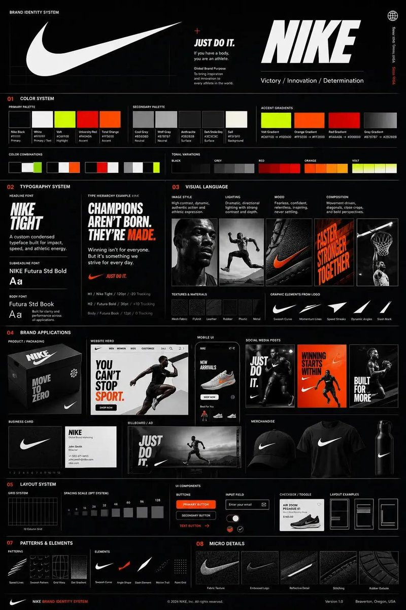

# 📱 UI 与社交媒体截图案例

> Part of [awesome-gpt-image-2-prompts](../README_zh-CN.md)

### Case 1: [One-Prompt UI Design Generation](https://x.com/austinit/status/2044968740782272596) (by [@austinit](https://x.com/austinit))

| 输出效果 |
| :----: |
| <a href="https://evolink.ai/gpt-image-2-prompts?utm_source=github&utm_medium=picture&utm_campaign=awesome-gpt-image-2-prompts" target="_blank" rel="noopener noreferrer"></a> |

**提示词：**

```
用这种风格帮我生成一套UI设计系统，包含网页、移动端、卡片、控件、按钮 以及其它
```
### Case 2: [Amateur iPhone Keynote Snapshot](https://x.com/patrickassale/status/2044687244368441742) (by [@patrickassale](https://x.com/patrickassale))

| 输出效果 |
| :----: |
| <a href="https://evolink.ai/gpt-image-2-prompts?utm_source=github&utm_medium=picture&utm_campaign=awesome-gpt-image-2-prompts" target="_blank" rel="noopener noreferrer"></a> |

**提示词：**

```
Amateur iPhone photo at Apple Park during the iPhone 20 keynote, Tim Cook presenting on stage. Shot from the crowd at a distance
```
### Case 3: [Handwritten Notebook Photo](https://x.com/patrickassale/status/2044569086013718958) (by [@patrickassale](https://x.com/patrickassale))

| 输出效果 |
| :----: |
| <a href="https://evolink.ai/gpt-image-2-prompts?utm_source=github&utm_medium=picture&utm_campaign=awesome-gpt-image-2-prompts" target="_blank" rel="noopener noreferrer"></a> |

**提示词：**

```
Amateur photo of an open notebook lying flat, filled with handwritten notes in black ballpoint pen. The handwriting is casual and slightly messy, like personnal notes, natural imperfections, crossed out words, underlined headings. Shot from slightly above, natural daylight from a window, no flash. Casual desk setting, shot on iPhone
```
### Case 4: [Song Dynasty Social Media Feed](https://x.com/Panda20230902/status/2045385588065313057) (by [@Panda20230902](https://x.com/Panda20230902))

| 输出效果 |
| :----: |
| <a href="https://evolink.ai/gpt-image-2-prompts?utm_source=github&utm_medium=picture&utm_campaign=awesome-gpt-image-2-prompts" target="_blank" rel="noopener noreferrer"></a> |

**提示词：**

```
"宋朝人的朋友圈"/"SONG DYNASTY SOCIAL MEDIA FEED"，古今穿越幽默融合界面设计风格，画面模拟手机社交媒体界面，但内容全部是宋朝场景头像是宋代文人画像，用户名"苏东坡SuShi_Official"，发布内容"刚到黄州，被贬了但心情还行。今天自己做了东坡肉，味道绝了，附菜谱："，配图为工笔画风格的东坡肉特写，点赞列表"黄庭坚、秦观、佛印等126人"，评论区"王安石：呵呵""司马光：还是那个味道"，界面元素如点赞图标用宋代花纹替代，状态栏显示"大宋移动 5G"和"元丰三年"，配色为手机深色模式搭配宋代雅致色调，历史与社交媒体的趣味碰撞杰作
```
### Case 5: [Multi-Platform Content Screenshots](https://x.com/MrLarus/status/2045373105041007013) (by [@MrLarus](https://x.com/MrLarus))

| 输出效果 |
| :----: |
| <a href="https://evolink.ai/gpt-image-2-prompts?utm_source=github&utm_medium=picture&utm_campaign=awesome-gpt-image-2-prompts" target="_blank" rel="noopener noreferrer"></a> |

**提示词：**

```
1、生成视频号内容截图，主题：中老年不要盲目催婚，iPhone尺寸
2、生成抖音内容截图，主题：跟上AI浪潮9.9包教会，iPhone尺寸
3、生成小红书内容截图，主题：精致女孩背后都有网贷，iPhone尺寸
4、生成快手内容截图：主题：直播离婚预告，iPhone尺寸
```

### Case 7: [Liu Yifei Douyin Livestream Screenshot](https://x.com/alanblogsooo/status/2044784762594918516) (by [@alanblogsooo](https://x.com/alanblogsooo))

| 输出效果 |
| :----: |
| <a href="https://evolink.ai/gpt-image-2-prompts?utm_source=github&utm_medium=picture&utm_campaign=awesome-gpt-image-2-prompts" target="_blank" rel="noopener noreferrer"></a> |

**提示词：**

```
9:16 的图片比例，生成一张抖音直播的截图，里面是 刘亦菲 在直播，刘亦菲 手里拿着牌子，牌子里写着 今晚直播，欢迎来参亦菲畅聊！
```
### Case 8: [King Taejo Yi Seong-gye's X Page](https://x.com/SKA_Neotype/status/2044637900978217334) (by [@SKA_Neotype](https://x.com/SKA_Neotype))

| 输出效果 |
| :----: |
| <a href="https://evolink.ai/gpt-image-2-prompts?utm_source=github&utm_medium=picture&utm_campaign=awesome-gpt-image-2-prompts" target="_blank" rel="noopener noreferrer"></a> |

**提示词：**

```
태조 이성계의 X  페이지(위화도 회군을 벌이기 직전- 최영 장군과 서로 디스하는 내용이 담긴 게시글들)을 만들어 주세요.
```

### Case 9: [Style-to-UI Design System](https://x.com/stark_nico99/status/2045836554451706125) (by [@stark_nico99](https://x.com/stark_nico99))

| 输出效果 |
| :----: |
| <a href="https://evolink.ai/gpt-image-2-prompts?utm_source=github&utm_medium=picture&utm_campaign=awesome-gpt-image-2-prompts" target="_blank" rel="noopener noreferrer"></a> |

**提示词：**

```
用这种风格帮我生成一套UI设计系统，包含网页、移动端、卡片、控件、按钮以及其它。把这套视觉风格作为参考生成网页。我尝试了宇宙、飞行、蝴蝶主题。
```

### Case 10: [Momotaro Explainer Slide](https://x.com/yammamon/status/2045778624092254603) (by [@yammamon](https://x.com/yammamon))

| 输出效果 |
| :----: |
| <a href="https://evolink.ai/gpt-image-2-prompts?utm_source=github&utm_medium=picture&utm_campaign=awesome-gpt-image-2-prompts" target="_blank" rel="noopener noreferrer"></a> |

**提示词：**

```
「いらすとや」のほのぼのとした雰囲気と、「霞ヶ関スライド」の圧倒的な情報密度を融合させた、桃太郎の解説スライド（ポンチ絵）を作成して
```

### Case 25: [Museum-Style Hanfu Breakdown Infographic](https://x.com/MrLarus/status/2045504669401653414) (by [@MrLarus](https://x.com/MrLarus))

| 输出效果 |
| :----: |
| <a href="https://evolink.ai/gpt-image-2-prompts?utm_source=github&utm_medium=picture&utm_campaign=awesome-gpt-image-2-prompts" target="_blank" rel="noopener noreferrer"></a> |

**提示词：**

```
请根据【主题】自动生成一张“博物馆图鉴式中文拆解信息图”。

要求整张图兼具真实写实主视觉、结构拆解、中文标注、材质说明、纹样寓意、色彩含义和核心特征总结。你需要根据【主题】自动判断最合适的主体对象、服饰体系、器物结构、时代风格、关键部件、材质工艺、颜色方案与版式结构，用户无需再提供其他信息。

整体风格应为：国家博物馆展板、历史服饰图鉴、文博专题信息图，而不是普通海报、古风写真、电商详情页或动漫插画。背景采用米白、绢纸白、浅茶色等纸张质感，整体高级、克制、专业、可收藏。

版式固定为：
- 顶部：中文主标题 + 副标题 + 导语
- 左侧：结构拆解区，中文引线标注关键部件，并配局部特写
- 右上：材质 / 工艺 / 质感区，展示真实纹理小样并附说明
- 右中：纹样 / 色彩 / 寓意区，展示主色板、纹样样本和文化解释
- 底部：穿着顺序 / 构成流程图 + 核心特征总结

若主题适合人物展示，则以真实人物全身站姿为中央主体；若更适合器物或单体结构，则改为中心主体拆解图，但整体仍保持完整中文信息图形式。所有文字必须为简体中文，清晰、规整、可读，不要乱码、错字、英文或拼音。重点突出真实结构、材质差异、文化说明与图鉴气质。

避免：海报感、影楼感、电商感、动漫感、cosplay感、乱标注、错结构、糊字、假材质、过度装饰。
```

### Case 32: [Palm Reading Diagnosis Report](https://x.com/agi_aibusi/status/2046530764871696750) (by [@agi_aibusi](https://x.com/agi_aibusi))

| 输出效果 |
| :----: |
| <a href="https://evolink.ai/gpt-image-2-prompts?utm_source=github&utm_medium=picture&utm_campaign=awesome-gpt-image-2-prompts" target="_blank" rel="noopener noreferrer"></a> |

**提示词：**

```
GPT-image-2でこの手相を診断して詳細な鑑定書を作って
生命線・知能線・感情線・運命線・太陽線・財運線・結婚線を、線の形状・濃淡・枝分かれ・起点終点まで分析すること。
助言を重点的に高品質な占い鑑定書にまとめること。
```

### Case 33: [Calligraphy Copybook Sheet](https://x.com/MrLarus/status/2046510310253539764) (by [@MrLarus](https://x.com/MrLarus))

| 输出效果 |
| :----: |
| <a href="https://evolink.ai/gpt-image-2-prompts?utm_source=github&utm_medium=picture&utm_campaign=awesome-gpt-image-2-prompts" target="_blank" rel="noopener noreferrer"></a> |

**提示词：**

```
生成一张【字体】书法临摹字帖
```

### Case 34: [Don Quijote Promo Pop Poster](https://x.com/loglogrog/status/2046437230127034774) (by [@loglogrog](https://x.com/loglogrog))

| 输出效果 |
| :----: |
| <a href="https://evolink.ai/gpt-image-2-prompts?utm_source=github&utm_medium=picture&utm_campaign=awesome-gpt-image-2-prompts" target="_blank" rel="noopener noreferrer"></a> |

**提示词：**

```
GPT Image 2を使って、OpenClawの情報を調べてドンキの広告ポップ風に実際のドンキに貼っているような感じで画像生成してください
```

### Case 35: [Japanese Gacha Game Screen](https://x.com/the_wheel_2024/status/2046519658166317160) (by [@the_wheel_2024](https://x.com/the_wheel_2024))

| 输出效果 |
| :----: |
| <a href="https://evolink.ai/gpt-image-2-prompts?utm_source=github&utm_medium=picture&utm_campaign=awesome-gpt-image-2-prompts" target="_blank" rel="noopener noreferrer"></a> |

**提示词：**

```
日本のソシャゲのガチャ画面を生成して、
```

### Case 36: [Elon Musk Douyin Livestream Screenshot](https://x.com/Shinning1010/status/2046501587762188535) (by [@Shinning1010](https://x.com/Shinning1010))

| 输出效果 |
| :----: |
| <a href="https://evolink.ai/gpt-image-2-prompts?utm_source=github&utm_medium=picture&utm_campaign=awesome-gpt-image-2-prompts" target="_blank" rel="noopener noreferrer"></a> |

**提示词：**

```
A 9:16 vertical version, high-detail realistic style Chinese TikTok live screenshot, Elon Musk is talking to the mobile phone camera in the live broadcast room, excited, smiling, and the live atmosphere is warm and real. He held a white handwritten sign in one hand, which clearly said: "Thank you Shinning". There are obvious Chinese TikTok interface elements in the live broadcast screen, including likes, comments and share icons arranged vertically on the right, scrolling Chinese bullet screens and interactive comments below, and the "live broadcast" logo at the top, which looks like a real mobile phone screenshot. There is an eye-catching gift prompt special effect in the screen: "Shinning sent TikTok No. 1", with gift animation light effect and platform-style prompt box. Musk is in a professional live broadcast environment, with a mobile phone holder, a ring fill light and a desktop microphone in front of him. The background is a modern technology live broadcast room with bright lights and a slight neon atmosphere. The composition is real and natural, like the ongoing live screenshot of the Chinese short video platform. The interface information is rich but not messy, the characters are clear, the expression is vivid, the details are rich, the sense of real photography, the depth of field, high definition, cinematic, photorealistic, realistic livestream screenshot, social media UI, Chinese Douyin live room, detailed lighting, natural skin texture.

Negative prompts:

Low definition, blur, cartoon, illustration, too strong CG sense, two-dimensional, deformed fingers, wrong text, scrambled code, multiple mobile phones, multiple brands, character repetition, face collapse, facial features distortion, excessive skin polishing, overexposure, too dark, messy background, wrong UI, non-Chinese short video interface, too many English bullet screens, gift special effects are not obvious, cropping error, proportional error

Supplementary reinforcement words:

Real mobile phone screen recording screenshot feeling, the live broadcast UI is complete, the gift prompt box conforms to the style of the Chinese short video platform, the Chinese comment area is active, the number of people online in the live broadcast room is clearly displayed, and the time, power and signal bar are visible.
```

### Case 37: [Liu Yifei Douyin Livestream Screenshot](https://x.com/kylegeeks/status/2046479783765397629) (by [@kylegeeks](https://x.com/kylegeeks))

| 输出效果 |
| :----: |
| <a href="https://evolink.ai/gpt-image-2-prompts?utm_source=github&utm_medium=picture&utm_campaign=awesome-gpt-image-2-prompts" target="_blank" rel="noopener noreferrer"></a> |

**提示词：**

```
9:16 的图片比例,生成一张抖音直播的截图,里面是 刘亦菲 在直播,刘亦菲 手里拿着牌子,牌子里写着 今晚直播,欢迎来参亦菲畅聊!
```

### Case 38: [Cyberpunk Neon UI Design System](https://x.com/AZLnfvp/status/2046468976092533180) (by [@AZLnfvp](https://x.com/AZLnfvp))

| 输出效果 |
| :----: |
| <a href="https://evolink.ai/gpt-image-2-prompts?utm_source=github&utm_medium=picture&utm_campaign=awesome-gpt-image-2-prompts" target="_blank" rel="noopener noreferrer"></a> |

**提示词：**

```
用未来都市风格生成UI设计系统,灵感来自赛博朋克城市夜景,包含霓虹灯、玻璃建筑反射、高对比光影,配色以紫色、蓝色、粉色霓虹为主,设计网页Dashboard、移动端界面、卡片、按钮、控件等,视觉炫酷、层次丰富、科技感极强
```

### Case 39: [Trump and Kim Livestream PK Screenshot](https://x.com/alanlovelq/status/2046048929490612464) (by [@alanlovelq](https://x.com/alanlovelq))

| 输出效果 |
| :----: |
| <a href="https://evolink.ai/gpt-image-2-prompts?utm_source=github&utm_medium=picture&utm_campaign=awesome-gpt-image-2-prompts" target="_blank" rel="noopener noreferrer"></a> |

**提示词：**

```
1、生成特朗普和金正恩在抖音直播间打PK的截图  
2、生成不知火舞的小红书主页截图  
3、生成图片: 手写在教室黑板上的出师表全文,真实感的粉笔字迹,晴朗白天用iPhone手机实拍  
4、生成图片: T-800机器人的淘宝商品详情页,展示: 机器人的正面侧面背面三视图, 产品价格, 产品细节, 功能和使用场景等
```

### Case 40: [Japanese AI Game Dev Overview Slide Prompt](https://x.com/ailovedirector/status/2046905387274891296) (by [@ailovedirector](https://x.com/ailovedirector))

| 输出效果 |
| :----: |
| <a href="https://evolink.ai/gpt-image-2-prompts?utm_source=github&utm_medium=picture&utm_campaign=awesome-gpt-image-2-prompts" target="_blank" rel="noopener noreferrer"></a> |

**提示词：**

```
横長のパワポ画像ここで生成してみて　どのモデル使ってるか判定するから、今のAIゲーム開発の概要をまとめた1枚パワポで　日本語で

ゲーム開発の技術に関して、工数ベースでどこにパワーかかるかの分析資料といかに量産が大事かについての説明とかのパワポ画も作って
```


**提示词：**
```
a Final Fantasy VIII Remake gameplay screenshot at next-gen fidelity (FF16 / GTA6 / RE9).
```

---


**提示词：**
```
Create a commercial ad from the storyboard @[image1]
```

---


### Case 41: [based on the generated character help me generate a screenshot of screenshot ...](https://x.com/khaiinit/status/2047219694130827273) (by [@khaiinit](https://x.com/khaiinit))

| 输出效果 |
| :----: |
| <a href="https://evolink.ai/gpt-image-2-prompts?utm_source=github&utm_medium=picture&utm_campaign=awesome-gpt-image-2-prompts" target="_blank" rel="noopener noreferrer"></a> |

**提示词：**

```
based on the generated character help me generate a screenshot of screenshot of an pvp game themed around *zelda: wind breaker*
```

### Case 42: [Create a landing page using this image as a reference for style and color gra...](https://x.com/D_studioproject/status/2047212826264211540) (by [@D_studioproject](https://x.com/D_studioproject))

| 输出效果 |
| :----: |
| <a href="https://evolink.ai/gpt-image-2-prompts?utm_source=github&utm_medium=picture&utm_campaign=awesome-gpt-image-2-prompts" target="_blank" rel="noopener noreferrer"></a> |

**提示词：**

```
Create a landing page using this image as a reference for style and color grading.
```

### Case 43: [Li Jiaqi Lipstick Livestream Background](https://x.com/songguoxiansen/status/2047207826913972518) (by [@songguoxiansen](https://x.com/songguoxiansen))

| 输出效果 |
| :----: |
| <a href="https://evolink.ai/gpt-image-2-prompts?utm_source=github&utm_medium=picture&utm_campaign=awesome-gpt-image-2-prompts" target="_blank" rel="noopener noreferrer"></a> |

**提示词：**

```
李佳琦直播间背景，口红矩阵展示墙，暖光氛围灯，文案OMG买它
```


### Case 44: [Apple Pods Pro 3 Headphone E-Commerce Infographic](https://x.com/meng_dagg695/status/2047935217231663186) (by [@meng_dagg695](https://x.com/meng_dagg695))

| 输出效果 |
| :----: |
| <a href="https://evolink.ai/gpt-image-2-prompts?utm_source=github&utm_medium=picture&utm_campaign=awesome-gpt-image-2-prompts" target="_blank" rel="noopener noreferrer"></a> |

**提示词：**

```
High-impact e-commerce infographic for "Apple Pods Pro 3" 
premium wireless over-ear headphones.

FOREGROUND - PRODUCT HERO SHOT
Extreme close-up of a hand holding a sleek, 
matte-white premium over-ear headphone toward the camera 
at a slight angle. The headphone features:
- Glossy white ear cushions with soft memory foam padding
- Brushed aluminum silver headband with subtle Apple Pods 
  Pro 3 embossed branding
- Black mesh speaker grille visible on the ear cup face
- A tiny glowing green LED status indicator on the 
  right ear cup edge
- Subtle touch-control icons etched on the outer cup surface

Macro-lens shallow depth of field — hand and headphone 
slightly blurred at edges to create cinematic depth. 
Product remains razor-sharp in center frame.

CENTRAL SUBJECT — MODEL
In the mid-ground: a smiling young woman with freckles 
and wavy pastel-pink hair. She wears:
- A vibrant lime-green knit beanie
- A psychedelic black and white-striped long-sleeve shirt
- The white over-ear headphones resting stylishly 
  around her neck (not on ears) — one hand casually 
  touching the ear cup

Expression: relaxed, confident, joyful. 
She is glancing slightly off-camera with a natural smile.

BACKGROUND & ATMOSPHERE
Clean soft-focus studio backdrop — light gray gradient 
fading to warm white at center. 

Atmospheric overlays:
- Diagonal rainbow prism lens flares cutting across 
  upper-left to lower-right
- Soft pastel light leaks in pink and yellow at corners
- 4–5 blurred white over-ear headphones floating 
  artistically in the background at various depths 
  and rotation angles
- Subtle bokeh circles from background studio lights

Lighting: Soft professional three-point studio lighting. 
Key light from upper-left, fill light right side. 
Rim light behind model for separation. 
Glossy highlights on headphone surfaces catching light naturally.

TYPOGRAPHY & LAYOUT — Sans-Serif, Clean white 
TOP CENTER (behind model, large background text):
→ Massive bold oversized text: "HEADPHONES"
   Semi-transparent white, spanning full width behind subject

TOP RIGHT CORNER:
→ Bold clean text: "Apple Pods Pro 3"
   Subtitle smaller text: "Over-Ear Wireless"

MID LEFT:
→ Icon: small sound wave symbol
→ Bold text: "Premium Sound"
→ Sub-text: "Active Noise Cancellation + Transparency Mode"

MID RIGHT:
→ Extra-large bold numeral: "40"
→ Smaller text below: "hours of battery life"

LOWER LEFT:
→ Extra-large bold numeral: "0"
   with "to" beside it → then bold "100%"
→ Sub-text: "Fast charge — 10 min = 3hrs playback"

BOTTOM RIGHT:
→ Extra-large bold numeral: "1"
→ Sub-text: "Year Warranty Included"

BOTTOM CENTER (fine print style):
→ Small elegant text: 
   "Bluetooth 5.4  |  Hi-Res Audio Certified  
    |  Foldable Design  |  USB-C Charging"

TECHNICAL SPECS
Resolution: 8K ultra-sharp
Style: Commercial product photography meets 
       editorial fashion advertising
Color Palette: White, lime green, pastel pink, 
               rainbow prism accents
Focus: Tack-sharp on headphone product — 
       shallow DOF on everything else
Lens: 85mm macro, slight low angle
Render Quality: Hyperrealistic, clean ad aesthetic, 
                vibrant yet professional color grading
```


### Case 45: [Apple Pods Pro 3 Earbuds E-Commerce Infographic](https://x.com/rovvmut_/status/2047912710365761828) (by [@rovvmut_](https://x.com/rovvmut_))

| 输出效果 |
| :----: |
| <a href="https://evolink.ai/gpt-image-2-prompts?utm_source=github&utm_medium=picture&utm_campaign=awesome-gpt-image-2-prompts" target="_blank" rel="noopener noreferrer"></a> |

**提示词：**

```
High-impact e-commerce infographic for "Apple Pods Pro 3" wireless earbuds.
```


### Case 46: [Beauty Product Commercial Marketing Photograph](https://x.com/AIwithSarah_/status/2047904483359760677) (by [@AIwithSarah_](https://x.com/AIwithSarah_))

| 输出效果 |
| :----: |
| <a href="https://evolink.ai/gpt-image-2-prompts?utm_source=github&utm_medium=picture&utm_campaign=awesome-gpt-image-2-prompts" target="_blank" rel="noopener noreferrer"></a> |

**提示词：**

```
A high-resolution commercial marketing photograph features a young woman with sleek dark hair and a pink ribbed top in a neutral grey studio setting, centered behind a glossy Ellie Beauty spray bottle held prominently in the foreground. The composition is energized by vibrant, lime-green graphic "swooshes" and floating pill-shaped callouts that highlight product features like "glossy finish" and "upto 450°F protection" in bold black sans-serif text. The lighting is professionally diffused, casting soft highlights on the model’s face while creating a sharp, vertical reflection on the metallic green-to-gold gradient bottle label. Topping the scene is a large, lime-green headline in the upper right asking, "What does it do?", altogether creating a clean, modern, and high-contrast aesthetic with a shallow depth of field that keeps the product and the model's focused expression in sharp relief.
```


### Case 47: [AAA Video Game Screenshot Concept Design](https://x.com/ChiefMonkeyMike/status/2047828814580138156) (by [@ChiefMonkeyMike](https://x.com/ChiefMonkeyMike))

| 输出效果 |
| :----: |
| <a href="https://evolink.ai/gpt-image-2-prompts?utm_source=github&utm_medium=picture&utm_campaign=awesome-gpt-image-2-prompts" target="_blank" rel="noopener noreferrer"></a> |

**提示词：**

```
generate screenshots from a AAA video game based off what The Sims Castaways sequel could look like. https://t.co/aL7hMdUYvj
```

### Case 91: [Spanish GRWM Morning Beauty Thumbnail](https://x.com/S0N_IA_/status/2047414367243657296) (by [@S0N_IA_](https://x.com/S0N_IA_))

| 输出效果 |
| :----: |
| <a href="https://evolink.ai/gpt-image-2-prompts?utm_source=github&utm_medium=picture&utm_campaign=awesome-gpt-image-2-prompts" target="_blank" rel="noopener noreferrer"></a> |

**提示词：**

```
A vertical 9:16 TikTok-style GRWM beauty thumbnail set in a warm, sunlit Mediterranean-inspired bedroom. A stylish young woman with {argument name="hair color" default="dark brown"} hair in a messy curly updo sits at a marble vanity, leaning forward with one arm folded and the other hand applying lip balm or lipstick to her mouth. Her face is covered by a centered rectangular blur block for privacy, but the rest of her styling is elegant and natural: tan glowing skin, delicate gold necklace with a small round pendant, thin gold bracelet, stacked gold rings, and a white lace camisole with thin straps. In the foreground on the vanity are exactly 7 visible beauty objects: 1 round tabletop vanity mirror on the left, 1 cup holding 5 makeup brushes, 1 clear glass dropper bottle, 1 tall white pump skincare bottle, 1 small black dropper bottle, 1 beige rounded cosmetic sponge or puff, and 1 pale green squeeze tube on the right. The background shows a softly blurred cozy bedroom with 1 arched window on the left, 1 leafy potted plant, 1 bed with white bedding and a mustard accent pillow, exposed wooden ceiling detail, and 1 framed landscape painting on the wall. Use golden-hour sunlight streaming from the left, soft shadows, creamy skin tones, shallow depth of field, luxury lifestyle editorial photography, intimate self-care mood, polished but natural composition. Add bold playful Spanish headline text in the upper left in three stacked lines reading {argument name="headline text" default="Mi rutina de belleza matutina"}, with each line large and rounded, white outline and soft drop shadow, using pastel colors: first line white, second line pink, third line pale yellow. Add 3 pink doodle accent strokes above the headline, 1 curved pink underline-swoosh beneath it, and 1 small yellow sun icon to the right of the last line. Place a clean white {argument name="brand text" default="Pollo.ai"} logo in the upper right. High-end influencer thumbnail aesthetic, crisp product focus in foreground, warm inviting lifestyle scene.
```

### Case 92: [Cinematic City Explosion Chase](https://x.com/Gugombly/status/2047310862428303636) (by [@Gugombly](https://x.com/Gugombly))

| 输出效果 |
| :----: |
| <a href="https://evolink.ai/gpt-image-2-prompts?utm_source=github&utm_medium=picture&utm_campaign=awesome-gpt-image-2-prompts" target="_blank" rel="noopener noreferrer"></a> |

**提示词：**

```
A cinematic photorealistic action scene in a rainy downtown city street canyon, showing {argument name="main subject" default="a dark-haired man in his 30s"} sprinting directly toward the camera in the center foreground with a tense survival expression, wearing a soaked dark jacket, dark shirt, and dark pants, mid-stride with one arm pumping forward. Behind him, a massive urban explosion tears through the street and lower facade of a high-rise building, sending a huge cloud of smoke, fire, dust, shattered concrete, glass, and metal debris outward in all directions. The scene includes exactly 3 visible damaged vehicles: 1 dark sedan in the left foreground with headlights on and a crumpled hood splashing through rainwater, 1 wrecked dark car in the right midground with severe front-end damage, and 1 overturned or airborne black SUV tilted upward behind it on the right side. Wet asphalt reflects headlights, firelight, and gray skyscrapers. Dense debris fills the air, with chunks of rubble frozen in motion. Overcast stormy daylight, desaturated blue-gray color palette with orange fire accents, dramatic motion blur in flying debris but sharp focus on the running figure, low-angle wide-lens composition, blockbuster disaster-movie realism, ultra-detailed textures, high contrast, dynamic depth, volumetric smoke, rain spray, cinematic lighting. Add a white {argument name="watermark text" default="Pollo.ai"} logo in the top-right corner.
```

### Case 93: [Anime VTuber Minecraft Stream Thumbnail](https://x.com/rerxmsz06/status/2047261622121705782) (by [@rerxmsz06](https://x.com/rerxmsz06))

| 输出效果 |
| :----: |
| <a href="https://evolink.ai/gpt-image-2-prompts?utm_source=github&utm_medium=picture&utm_campaign=awesome-gpt-image-2-prompts" target="_blank" rel="noopener noreferrer"></a> |

**提示词：**

```
A vibrant anime-style YouTube thumbnail for a livestream gaming broadcast, in a wide 16:9 composition, with a neon purple and pink streamer room. Center the scene on a cute catgirl VTuber sitting at a desk, shown from the waist up, leaning forward energetically with one hand on a computer mouse and the other hand reaching toward the viewer. She has {argument name="hair color" default="light orange-blonde"} bob-cut hair with soft bangs, fluffy brown-and-cream cat ears, and a visible cat tail. Her face is intentionally obscured by a solid rectangular censor block in the center. She wears a black-and-white maid-inspired outfit with a frilly white blouse, black dress bodice, puff sleeves, white ruffles, black ribbon bow, and a gold bell choker. Place a mechanical keyboard with bright RGB lighting on the desk, a glowing gaming mouse, and a streamer microphone on the far left with pink-purple LED lighting. Put 2 cat-themed desk items in the foreground: a plush cat face on the bottom left and a black cat-shaped mug on the bottom right. Behind her is a gaming chair with paw-print details. On the left side, add large bold Korean headline text in thick white block letters with black fill shadows and a glowing purple outline, stacked in 2 lines: {argument name="headline text" default="방송중 대참사"}. Below it, add a smaller yellow comic-style burst caption with black outline reading {argument name="sub text" default="> 크리퍼 실화냐"}. On the right side, show 1 large computer monitor angled inward, displaying a Minecraft-like scene with bright blue sky, green trees, water, and a large green Creeper popping out toward the viewer, outlined dramatically like a sticker cutout. Add starburst effects and neon accents around the monitor to heighten the chaos. Use exaggerated thumbnail aesthetics: ultra-saturated colors, sharp cel shading, thick outlines, glossy highlights, high contrast, dynamic perspective, and a clickworthy streamer-disaster mood.
```

### Case 94: [Cozy Anime ASMR Ear Massage Girl](https://x.com/Shion_yamabuki/status/2047232198382964969) (by [@Shion_yamabuki](https://x.com/Shion_yamabuki))

| 输出效果 |
| :----: |
| <a href="https://evolink.ai/gpt-image-2-prompts?utm_source=github&utm_medium=picture&utm_campaign=awesome-gpt-image-2-prompts" target="_blank" rel="noopener noreferrer"></a> |

**提示词：**

```
A soft, dreamy anime illustration of a cute young woman doing ASMR in a cozy bedroom at night, seated close to the viewer with her knees pulled up and a black 3Dio-style binaural microphone centered in front of her. She has {argument name="hair color" default="deep violet"} hair in a loose messy updo with wispy bangs framing her face, large sparkling {argument name="eye color" default="blue"} eyes, a gentle blush, and a sweet open-mouth smile. Her head is tilted slightly toward the viewer in a warm, affectionate pose. She wears a delicate white lace camisole with thin straps and an oversized fluffy knit cardigan in {argument name="cardigan color" default="soft pink-lavender"} draped off her shoulders, creating a tender, intimate late-night healing atmosphere. Both hands lightly touch the white silicone ears of the microphone as if about to give an ear massage. The room is softly lit with pink and amber ambient lighting, heavy curtains in the background, a bed or sofa with plush cushions, warm fairy-light bokeh, and a small plant on the right side. Add glowing handwritten Japanese neon text integrated into the composition: on the left, 4 text elements reading "とろける", "耳", "マッサージ", and "ASMR" with 2 small heart symbols; on the right, vertical text reading "いっぱい癒してあげるね...♡". Use a polished modern anime style, highly detailed face and hair, glossy eyes, smooth luminous skin, soft shading, pastel highlights, shallow depth of field, romantic cozy streamer-thumbnail composition, and a soothing feminine color palette dominated by pink, lavender, cream, and warm gold.
```

### Case 95: [Celebrity Livestream Concept](https://x.com/SelenaGmzIN/status/2047185882009198865) (by [@SelenaGmzIN](https://x.com/SelenaGmzIN))

| 输出效果 |
| :----: |
| <a href="https://evolink.ai/gpt-image-2-prompts?utm_source=github&utm_medium=picture&utm_campaign=awesome-gpt-image-2-prompts" target="_blank" rel="noopener noreferrer"></a> |

**提示词：**

```
{argument name="celebrity" default="selena gomez"} started a surprise {argument name="platform" default="youtube"} livestream.
```

### Case 96: [Monika Anime Banner Illustration](https://x.com/mirochill/status/2047639852485620070) (by [@mirochill](https://x.com/mirochill))

| 输出效果 |
| :----: |
| <a href="https://evolink.ai/gpt-image-2-prompts?utm_source=github&utm_medium=picture&utm_campaign=awesome-gpt-image-2-prompts" target="_blank" rel="noopener noreferrer"></a> |

**提示词：**

```
A highly polished anime banner illustration in a warm golden classroom-literature-club setting, wide cinematic composition. On the left half, a large elegant glowing script title reads {argument name="headline text" default="Monika"} in oversized calligraphy, colored white and pale green with a soft neon glow, metallic highlights, decorative flourishes, hearts, sparkles, and swirling ornamental lines around it. On the right half, a beautiful anime schoolgirl inspired by {argument name="character name" default="Monika"} sits at a wooden desk, facing slightly left, with long flowing {argument name="hair color" default="chestnut brown"} hair, a very large white ribbon bow, warm brown eyes, and a thoughtful, confident expression. She wears a Japanese high school uniform with exactly 4 visible clothing pieces: a brown blazer, white shirt, red ribbon tie, and brown argyle sweater vest. She holds a fountain pen over papers on the desk with one hand while the other rests near her face in a poised writing pose. The room is filled with sunset light streaming through tall windows, dust motes, trailing green ribbons, floating petals, handwritten notes pinned and hanging in the background, and a dark chalkboard covered with faint cursive writing and geometric doodles. Include exactly 9 prominent desk and room props: a bouquet of white roses at lower left, a stack of books at left, an hourglass near the center-left, a sealed envelope with a small green leaf emblem, scattered manuscript pages on the desk, a pen cap near the writing hand, a green-upholstered chair, a piano in the back right, and a stack of 4 books on the right. The 4 right-side book spines read, from top to bottom: "Save Me", "My Feelings", "Poems for the Literature Club", and "Just Monika." Add lush volumetric lighting, glittering particles, green-and-gold color harmony, delicate linework, ultra-detailed painterly shading, romantic visual-novel key art quality, and a premium polished thumbnail/banner aesthetic.
```

### Case 97: [Purple Anime Yuri Banner](https://x.com/mirochill/status/2047639852485620070) (by [@mirochill](https://x.com/mirochill))

| 输出效果 |
| :----: |
| <a href="https://evolink.ai/gpt-image-2-prompts?utm_source=github&utm_medium=picture&utm_campaign=awesome-gpt-image-2-prompts" target="_blank" rel="noopener noreferrer"></a> |

**提示词：**

```
A polished anime-style banner illustration in a dreamy violet palette, wide cinematic composition, showing a quiet literary room at twilight. On the right side, a beautiful teenage anime girl named {argument name="character name" default="Yuri"} sits at a wooden desk beside a large window with purple curtains, holding a dark ornate hardcover book close to her chest and gazing softly downward with a shy, introspective expression. She has very long straight {argument name="hair color" default="deep violet"} hair with glossy highlights, side bangs, a small hair clip, and violet eyes, wearing a Japanese school uniform with a gray blazer, white shirt, red ribbon tie, and dark skirt. Across the left-center of the image, the glowing calligraphic word {argument name="title text" default="Yuri"} appears large in luminous neon-lavender script with elegant flourishes, a small heart, and decorative filigree, integrated into the scene like magical typography. The desk contains exactly 8 visible item groups: 1 open book in the foreground center, 1 black inkwell with a white feather quill, 1 closed book near the candle, 1 stack of books under papers, 1 loose handwritten page in front, 1 small purple flower on the desk, 1 floral porcelain teacup with saucer on the right, and 1 dark book stack at the far right. Additional background details include exactly 6 decorative environmental elements: 1 lit candle in a glass holder on the left, 1 cluster of purple flowers in the left foreground, 1 hanging spray of purple blossoms in the upper left, 1 pinned botanical note in the upper right, 1 bookshelf with books and flowers in the right background, and 1 sunset sky visible through the window. Add drifting flower petals, faint handwritten script textures, ornate gold border lines around the frame, soft volumetric window light, subtle sparkles, rich shadows, and a romantic melancholic atmosphere. Highly detailed, clean line art, glossy anime rendering, premium visual-novel key art, perfect for a niche anime banner or character-themed thumbnail.
```

### Case 98: [Pink Anime Natsuki Banner](https://x.com/mirochill/status/2047639852485620070) (by [@mirochill](https://x.com/mirochill))

| 输出效果 |
| :----: |
| <a href="https://evolink.ai/gpt-image-2-prompts?utm_source=github&utm_medium=picture&utm_campaign=awesome-gpt-image-2-prompts" target="_blank" rel="noopener noreferrer"></a> |

**提示词：**

```
A glossy pastel pink anime banner in a wide cinematic layout, themed around cute romance and sweets. Place a confident teenage anime girl on the right side, shown from about thigh-up, with short fluffy bob hair in {argument name="hair color" default="soft pink"}, large pink-magenta eyes, a small gentle smile, and arms crossed. She wears a Japanese school uniform: 1 brown blazer, 1 white shirt, 1 red ribbon bow at the collar, and 1 dark navy-and-purple plaid skirt. Add 2 red ribbon hair accessories, one larger bow on the side and one smaller ribbon accent. On the left half, feature the large handwritten script name {argument name="character name" default="Natsuki"} in bold glossy 3D cursive, white-to-pink fill with bright pink outline, soft bevel, subtle drop shadow, sparkles, and a small heart flourish integrated into the lettering. The background should be a layered scrapbook collage in blush pink tones with notebook paper texture, faint grid and torn paper details, scattered doodled hearts, flower petals, sparkles, and cute bakery motifs. Include exactly 4 pinned or taped sketch-style portrait cards of the same girl behind her on the upper-right and mid-right, arranged like overlapping polaroids. Add exactly 2 cupcakes in the foreground near the bottom left and lower center-left, both with pink frosting, striped wrappers, and tiny heart toppers or candy accents. Frame the composition with flowing satin ribbons and bows: exactly 4 major ribbon elements visible, including 1 bow near the top left, 1 bow near the bottom left, and 2 long curling ribbons sweeping across the top and right edges. Use a soft high-detail anime illustration style, polished lighting, dreamy bloom, romantic Valentine palette, delicate textures, and a clean impactful thumbnail-like composition.
```

### Case 99: [Dreamy Anime Sayori Banner](https://x.com/mirochill/status/2047639852485620070) (by [@mirochill](https://x.com/mirochill))

| 输出效果 |
| :----: |
| <a href="https://evolink.ai/gpt-image-2-prompts?utm_source=github&utm_medium=picture&utm_campaign=awesome-gpt-image-2-prompts" target="_blank" rel="noopener noreferrer"></a> |

**提示词：**

```
A wide anime banner illustration of {argument name="character name" default="Sayori"} in a bright dreamy classroom, rendered in a polished, high-end visual novel style with soft painterly lighting, warm pastel colors, and sparkling atmosphere. Show a cheerful teenage schoolgirl with short fluffy coral-pink hair, messy bob layers, and a large red bow on the right side of her head, wearing a Japanese school uniform with a light brown blazer, white shirt, red ribbon tie, brown sweater vest, and pleated navy skirt. She stands slightly left of center with arms open wide in an inviting, joyful pose, as if welcoming the viewer, with dynamic perspective and gentle motion in her hair and clothes. Her face is intentionally obscured by a flat rectangular skin-tone censor block. Behind her, tall classroom windows reveal a vivid blue sky with soft white clouds and warm sunlight streaming in. The right half of the image features a large decorative handwritten script reading {argument name="headline text" default="Sayori"}, cream-white lettering with a soft orange-gold outline and glow, integrated into a scrapbook-like wall background. Surround the scene with hanging photo prints clipped to string, including sky photos and a sunflower photo, plus hand-drawn doodles of clouds, stars, hearts, and a sun. Add blue and yellow paper stars, ribbons, floating confetti, a blue paper airplane, notebook pages, a spiral sketchbook, and scattered stationery elements. Place sunflowers prominently in the foreground and edges, with warm golden bokeh and soft depth of field. Make the composition energetic, cute, nostalgic, and emotionally uplifting, like a premium anime-themed YouTube banner or character tribute header, ultra-detailed, clean, stylish, luminous, and impact-focused.
```

### Case 100: [Cyberpunk 404 Witch Summoning](https://x.com/Eris_Create_Lab/status/2047537707904274795) (by [@Eris_Create_Lab](https://x.com/Eris_Create_Lab))

| 输出效果 |
| :----: |
| <a href="https://evolink.ai/gpt-image-2-prompts?utm_source=github&utm_medium=picture&utm_campaign=awesome-gpt-image-2-prompts" target="_blank" rel="noopener noreferrer"></a> |

**提示词：**

```
A dramatic anime-style cyberpunk witch standing on a dark rooftop high above a dense futuristic city at night, viewed from a slightly elevated angle. The main subject is a petite young witch girl with pale skin, short icy blue bobbed hair, pointed elf-like ears, and glowing red eyes, wearing a sly confident smile. She raises a black wand overhead in her right hand, with a dangling orb charm at the tip glowing faintly purple and red. Her oversized crooked witch hat is black with purple lining and covered in stitched patches, warning labels, straps, and white graphics including a large “404” and a skull emblem. She wears a black and purple techwear outfit: oversized hooded jacket with many straps and tags, black crop top with “404” on the chest, layered belts, short bottoms, fishnet on one leg, black lace-up combat boots, chokers, and metallic accessories. Several hanging straps and tags visibly read words like “WITCH 404,” “404,” and glitch-themed markings. Beneath and beside her, a large glowing violet magic circle mixed with hacker interface aesthetics is projected on the rooftop floor, filled with occult rings, sigils, a central skull symbol, and scattered neon system text such as error-code fragments, creating a fusion of sorcery and digital corruption. Emerging from the circle is 1 large armored summoned figure: a black futuristic demon-knight or robotic familiar with jagged reflective armor, a narrow purple-lit visor, and a heavy weapon held in one hand, partially dissolving into purple energy shards and smoke. The background shows a sprawling rainy megacity of apartment towers and industrial rooftops, packed with windows, balconies, cables, signs, and haze. On a nearby building wall is a giant vertical graffiti-style sign with 3 readable elements: “404”, “Witch”, and “ERROR NOT FOUND”, plus a smaller “E404”. Additional purple neon glitch text and symbols are scattered across rooftops and in the air. Use a dark palette of black, indigo, and deep violet with sharp magenta-purple highlights, cinematic contrast, reflective wet surfaces, dense detail, and a high-end polished illustration style. The mood is occult, edgy, stylish, and dangerous, combining urban fantasy, hacker aesthetics, and magical summoning.
```

### Case 101: [Anime Fantasy Travel Movie Poster](https://x.com/Design4p0/status/2047531978346398002) (by [@Design4p0](https://x.com/Design4p0))

| 输出效果 |
| :----: |
| <a href="https://evolink.ai/gpt-image-2-prompts?utm_source=github&utm_medium=picture&utm_campaign=awesome-gpt-image-2-prompts" target="_blank" rel="noopener noreferrer"></a> |

**提示词：**

```
A cinematic anime movie poster for a fictional film titled {argument name="headline text" default="EL VIAJE DE LA LUNA DE PLATA"}, in polished modern Japanese animation style with a natural, less over-detailed look. Center a teenage anime girl from mid-thigh up, facing forward, with a short silver bob haircut, pale skin, a black choker, small black geometric earrings, a white tank top, and a dark navy oversized zip hoodie with two yellow stripes running down the sleeves. She has a backpack strap over one shoulder and both hands tucked casually into the hoodie pockets. Her face is obscured by a flat rectangular censor block in a muted beige tone, covering the entire face area. Place her in a dramatic twilight coastal city setting that blends travel, nostalgia, and fantasy: on the left, a lit train platform with a commuter train approaching, its destination sign showing Japanese characters; behind it, a glowing city skyline with a ferris wheel. In the distance and lower left, layered mountains and a winding illuminated valley road. On the right, a cliffside coast at sunset with the sea reflecting warm light, a crescent moon in the sky, several flying seabirds, and a curving highway descending along the hillside. Also on the right, include a wooden signpost with exactly 3 directional signs labeled "NUEVOS CAMINOS", "VIEJOS RECUERDOS", and "SIN LÍMITES". At the top center, add the Spanish tagline {argument name="tagline text" default="CADA DESTINO CAMBIA SU HISTORIA"} in elegant serif capitals. On the upper left, create an awards column in gold typography with laurel wreaths and exactly 4 award blocks: one text block reading "GANADORA DE MÚLTIPLES PREMIOS" with 5 gold stars beneath it, then three laurel award sections reading "MEJOR PELÍCULA ANIMADA / FESTIVAL INTERNACIONAL DE ANIMACIÓN / 2024", "PREMIO DEL PÚBLICO / FESTIVAL INTERNACIONAL DE CINE / 2024", and "MEJOR BANDA SONORA ORIGINAL / ACADEMIA DE CINE ANIMADO / 2024". Place the film title large across the lower center in luminous ornate serif lettering with a magical glow and sweeping flourishes, layered partly over the character. Beneath it, add the Spanish quote {argument name="quote" default="A veces, para encontrarte... tienes que perderte en el mundo."}. Below that, add "UNA PELÍCULA DE ESTUDIO LUMINARIA" in small caps. At the bottom, add the release line {argument name="release text" default="PRÓXIMAMENTE EN CINES"} in large gold serif capitals, plus tiny production logos and credits along the footer, including a small studio emblem on the left. Rich blue, violet, and warm sunset orange palette, glossy poster lighting, romantic adventure mood, balanced composition, highly polished theatrical key art, vertical one-sheet film poster.
```

### Case 102: [Anime Music Bootcamp Promo Poster](https://x.com/sorane_aimusic/status/2047507066697507134) (by [@sorane_aimusic](https://x.com/sorane_aimusic))

| 输出效果 |
| :----: |
| <a href="https://evolink.ai/gpt-image-2-prompts?utm_source=github&utm_medium=picture&utm_campaign=awesome-gpt-image-2-prompts" target="_blank" rel="noopener noreferrer"></a> |

**提示词：**

```
Create a dramatic Japanese anime-style promotional thumbnail poster for an event, vertical 4:5 composition, ultra-detailed, cinematic, neon-lit, high contrast, designed like a social media announcement image. The main subject is a beautiful anime girl centered slightly right, shown from the waist up, with long flowing {argument name="hair color" default="deep blue"} hair blowing in the wind, decorated with small star hairpins, wearing a dark hoodie and large studio headphones around her neck, against a glowing sunset-to-night city skyline filled with sparkling lights, music-energy particles, lens flares, and flying glowing petals. Her face area is obscured by a soft rectangular blur block. Use a vivid palette of electric blue, violet, magenta, gold, and sunset orange. Fill the design with layered Japanese typography that is crisp, readable, and integrated into the art like a polished event advertisement. Include exactly 8 major text groups: top left copy reading 「始まるのは、キミと創る 音楽の物語。」 with a smaller subcopy beneath reading 「AIを使って、みんなで音楽をつくる特別な3日間。」; top right a glowing marquee sign reading 「GW連休!」 and a smaller neon box below reading 「みんなで最高の音楽をつくろう!」; center main title with small English text 「AI MUSIC BOOTCAMP 2」 above huge Japanese title text 「AI音楽 ブートキャンプ 2」; a gigantic gold metallic announcement across the middle reading 「開催決定!」; a date bar reading 「開催期間」 followed by 「5.2 SAT 土」 and 「5.4 MON 月」; a hashtag callout near the bottom reading 「参加はカンタン!! #AI音楽ブートキャンプ2 をつけて投稿するだけ!」; a lower encouragement line reading 「初心者も大歓迎! みんなで最高の音楽体験を!」; and 3 bottom feature captions with icons reading 「一緒に学ぶ 仲間とつながる」, 「AIで創る 新しい音楽体験」, and 「想いをカタチに 自分だけの1曲を」. On the left edge, add a vertical filmstrip with exactly 4 inset panels showing the same girl in music-related scenes: 1) performing on a stage before a crowd, 2) working at a music production desk with screens and equipment, 3) singing into a microphone, 4) playing an acoustic guitar. Add exactly 2 neon music-themed icon illustrations in the lower area: a tilted smartphone with a music note on the lower left and a glowing microphone with musical notes on the lower right. Make the text effects glossy, luminous, and embossed with gold and white highlights, with energetic streaks and spark explosions around the headline. The overall feeling should be inspiring, celebratory, futuristic, and emotionally uplifting, like a high-impact Japanese Golden Week music bootcamp ad for {argument name="event name" default="AI音楽ブートキャンプ 2"}.
```

### Case 103: [Tropical Parrot Pixel Mosaic](https://x.com/erikmackinnon/status/2048190288179675290) (by [@erikmackinnon](https://x.com/erikmackinnon))

| 输出效果 |
| :----: |
| <a href="https://evolink.ai/gpt-image-2-prompts?utm_source=github&utm_medium=picture&utm_campaign=awesome-gpt-image-2-prompts" target="_blank" rel="noopener noreferrer"></a> |

**提示词：**

```
A vibrant pixel-art style mosaic of a tropical parrot perched on a small brown branch in the middle of dense rainforest foliage. The entire image is rendered as a tight grid of tiny square tiles with visible black outlines, creating a stained-glass or LED-screen effect. The bird is shown in side profile facing right, with a large curved black beak, a pale cream face, a bright red-orange forehead and throat, vivid green upper body, and long wings and tail in saturated blue and cyan. The surrounding jungle is filled edge to edge with layered green leaves in many shades, with a soft light green glow behind the parrot to separate it from the background. High color contrast, rich tropical palette, crisp tile pattern, centered composition, decorative digital mosaic aesthetic.
```

### Case 104: [Golden Cocktail in Greenhouse Bar](https://x.com/FernandesK47117/status/2048183925294371147) (by [@FernandesK47117](https://x.com/FernandesK47117))

| 输出效果 |
| :----: |
| <a href="https://evolink.ai/gpt-image-2-prompts?utm_source=github&utm_medium=picture&utm_campaign=awesome-gpt-image-2-prompts" target="_blank" rel="noopener noreferrer"></a> |

**提示词：**

```
A cinematic vertical photo of a hand holding up a large balloon wine glass filled with a sparkling golden-yellow citrus cocktail in a lush indoor greenhouse bar. The drink is backlit by warm late-afternoon sunlight, making it glow translucent amber. Inside the glass there is 1 visible citrus wedge, and at the rim there is 1 fresh mint garnish cluster. The hand enters from the lower left, delicately gripping the stem, wearing 1 chunky translucent amber bracelet. The setting is dense with tropical greenery, hanging ferns, and vine-covered walls, with a bright greenhouse roof structure visible overhead and 2 warm exposed hanging bulbs softly glowing in the background. Use shallow depth of field with creamy bokeh, strong sun rays filtering through leaves, soft haze, and rich green-and-gold color contrast. Add a blurred foreground leaf or plant along the right edge to frame the composition. The lower background should suggest a busy café or cocktail lounge with indistinct people, but keep them heavily out of focus. Photorealistic, elegant lifestyle photography, moody yet sun-drenched, shot from a low angle looking upward at the raised glass, high detail on condensation, glass reflections, and the luminous drink.
```

### Case 105: [Multi-Panel Image Board Template](https://x.com/aimikoda/status/2048183782876778821) (by [@aimikoda](https://x.com/aimikoda))

| 输出效果 |
| :----: |
| <a href="https://evolink.ai/gpt-image-2-prompts?utm_source=github&utm_medium=picture&utm_campaign=awesome-gpt-image-2-prompts" target="_blank" rel="noopener noreferrer"></a> |

**提示词：**

```
Create a {argument name="grid layout" default="4x3"} borderless grid where each panel is an independent image of the {argument name="subject" default="a young woman"}. Maintain strong subject consistency across all panels, with consistent color and lighting. Depict {argument name="theme" default="childhood memories"} with a {argument name="mood" default="warm, nostalgic"} mood in {argument name="style" default="nostalgic cinematic realism"} style. No text. No gap.
```

### Case 106: [Handwritten Realistic Letter](https://x.com/mosthssan/status/2048160477658980711) (by [@mosthssan](https://x.com/mosthssan))

| 输出效果 |
| :----: |
| <a href="https://evolink.ai/gpt-image-2-prompts?utm_source=github&utm_medium=picture&utm_campaign=awesome-gpt-image-2-prompts" target="_blank" rel="noopener noreferrer"></a> |

**提示词：**

```
Create a highly realistic image of a handwritten letter containing a ({argument name="message" default="message or reflection carrying meanings of affection and loyalty to my account followers"}) on lined paper, with very touching words written in liquid ink pen
```

### Case 107: [Anime Band Finale at Budokan](https://x.com/SDAI1807097011/status/2048127178592915583) (by [@SDAI1807097011](https://x.com/SDAI1807097011))

| 输出效果 |
| :----: |
| <a href="https://evolink.ai/gpt-image-2-prompts?utm_source=github&utm_medium=picture&utm_campaign=awesome-gpt-image-2-prompts" target="_blank" rel="noopener noreferrer"></a> |

**提示词：**

```
A dramatic anime concert illustration seen from behind the performers onstage, showing 4 teenage girls standing shoulder to shoulder at the front of a huge indoor arena, arms around each other in a triumphant post-performance moment. The camera is positioned slightly behind and below them, facing out toward the audience and the giant venue screen. The atmosphere is dazzling and emotional, filled with dense blue-and-gold confetti, sparkling particles, and strong white stage spotlights pouring down from above. The crowd fills the entire arena as a sea of tiny glowing blue lights. At center top, a giant rectangular screen displays elegant serif concert text: {argument name="band name" default="ELEMAYU"}, "1st LIVE at 日本武道館", {argument name="concert date" default="2024.6.15"}, and "SOLD OUT". On both upper side walls of the arena, the large venue name "日本武道館" is visible. The 4 girls all wear matching dark stage outfits: black or very dark navy hooded jackets with subtle decorative back prints, short pleated skirts, and live-performance styling. Count and depict all 4 members distinctly from left to right: 1) a girl with short wavy silver-lavender hair holding a bass guitar slung over her shoulder, 2) a girl with long straight black hair holding a red electric guitar, 3) a girl with fluffy shoulder-length blonde hair holding a dark guitar, 4) a girl with brown hair in a high ponytail, no visible instrument, raising one arm high and holding a drumstick or baton in celebration while the other arm wraps around the blonde member. Show their backs and silhouettes rim-lit by stage light, with soft highlights on their hair. Include stage equipment: a microphone stand and part of a bass neck at the far left, and a visible drum kit with cymbals at the right edge. The stage floor is glossy and reflective, covered with scattered confetti and several blue flower bouquets near the bottom foreground. Use rich midnight blues, violet shadows, warm golden sparkles, and cinematic bloom. The mood should feel like a sold-out dream performance finale, sentimental, victorious, and breathtakingly luminous, in highly detailed painterly anime style.
```

### Case 108: [Anime Girl and Man Date Photo Collage](https://x.com/AIillust_studio/status/2048099186214900130) (by [@AIillust_studio](https://x.com/AIillust_studio))

| 输出效果 |
| :----: |
| <a href="https://evolink.ai/gpt-image-2-prompts?utm_source=github&utm_medium=picture&utm_campaign=awesome-gpt-image-2-prompts" target="_blank" rel="noopener noreferrer"></a> |

**提示词：**

```
A 4x4 photo collage of 16 warm, cinematic lifestyle snapshots featuring a real adult man and an anime-style young woman companion posed together as if in casual date photos. The man has short dark hair, light skin, an average build, and wears a plain dark navy or black long-sleeve shirt; his face is intentionally obscured and softly blurred in every frame. The anime girl has long blonde twin ponytails, large blue eyes, light skin, and a slim petite build, wearing a black sleeveless top, layered silver necklaces including a cross pendant, black wrist accessories, a red plaid pleated mini skirt, and black-and-white striped thigh-high socks. Blend realistic photography with a convincingly integrated 2D anime character, keeping her clean cel-shaded look while matching the scene lighting, perspective, focus, and color grading so she appears naturally present beside him. Use moody evening tones, soft bokeh, shallow depth of field, and intimate candid couple energy. The 16 panels are: 1) close indoor portrait with both seated close together, the girl resting beside him; 2) nighttime city street side profile conversation under blurred streetlights; 3) indoors, both reading a book together, the girl leaning on his shoulder; 4) outdoor cafe table, both holding takeaway coffee cups; 5) restaurant table with multiple dishes visible, dining together; 6) mirror selfie in an elevator, the man holding a smartphone while the girl makes a peace sign; 7) car interior road-trip shot, the man driving and the anime girl in the passenger seat; 8) seaside sunset from behind, both sitting side by side watching the ocean; 9) neon-lit city night portrait, the girl pointing toward the camera; 10) intimate elevator close-up, the girl with eyes closed leaning affectionately against him; 11) full mirror selfie in an elevator showing more of both outfits; 12) night city skyline portrait with a lit tower in the background; 13) camera selfie close-up, the man holding a compact camera toward a mirror or reflective surface; 14) cozy indoor lounge moment, the man holding a glass of red wine while the girl smiles and makes a peace sign; 15) rear full-body rainy night street shot, the pair walking away hand in hand under glowing streetlights; 16) extreme close-up night portrait with the girl flashing a peace sign. Keep the collage tightly gridded with thin white dividers, square overall format, consistent amber-brown color grading, romantic urban realism, and subtle social-media photo-dump aesthetics.
```

### Case 109: [Luxury Lifestyle Mustang Shot](https://x.com/Just_sharon7/status/2048095904138485962) (by [@Just_sharon7](https://x.com/Just_sharon7))

| 输出效果 |
| :----: |
| <a href="https://evolink.ai/gpt-image-2-prompts?utm_source=github&utm_medium=picture&utm_campaign=awesome-gpt-image-2-prompts" target="_blank" rel="noopener noreferrer"></a> |

**提示词：**

```
A stylish young woman with {argument name="hair style" default="long wavy blonde hair"}, defined cheekbones, and a confident expression, wearing black sunglasses and a {argument name="clothing" default="thick white puffer jacket"} over a fitted black top, standing confidently in front of a {argument name="car" default="vibrant hot-pink Ford Mustang"}. She is posing with one hand slightly raised near her chest, exuding effortless attitude and elegance. The car is parked on a scenic coastal road lined with blooming pink cherry blossom trees and tall palm trees. Behind them is a calm sea under a dramatic overcast sky with soft clouds. Pink petals are scattered on the wet asphalt. A wooden bench is visible on the left side near the water. Cinematic lighting, photorealistic, ultra-detailed skin texture, natural lighting reflections, Instagram-style luxury lifestyle shot, vibrant colors, moody atmosphere, 8k resolution --ar 9:16 --stylize 250
```

### Case 110: [Anime Friends Eating Soba](https://x.com/AIMAG31G/status/2048089673621516547) (by [@AIMAG31G](https://x.com/AIMAG31G))

| 输出效果 |
| :----: |
| <a href="https://evolink.ai/gpt-image-2-prompts?utm_source=github&utm_medium=picture&utm_campaign=awesome-gpt-image-2-prompts" target="_blank" rel="noopener noreferrer"></a> |

**提示词：**

```
A cozy anime-style interior of a traditional Japanese soba restaurant, viewed from table height in a booth, with two young women seated across the near corners of a rectangular wooden table and facing the viewer in a casual dining snapshot. The left woman has long straight pastel {argument name="hair color" default="lavender with cyan highlights"} hair with glossy strands and soft bangs, and wears a white kimono-style top with bright blue trim and a deep blue obi-like sash skirt; she is slightly curvy, sitting on the left red vinyl bench, turned a little toward the camera, raising her left hand in an open friendly wave. The right woman has a sleek short bob in dark brown to black with a purple underlayer visible near the ends, red rectangular glasses, small earrings, a fitted charcoal-gray long-sleeve scoop-neck top, and light blue jeans; she sits on the right red vinyl bench, leaning slightly toward the table and holding chopsticks in her right hand as if about to eat. Place 2 large black bowls of soba on the table, one in front of each woman, both filled with dark broth, noodles, sliced duck meat, and chopped green onions; add 1 clear water glass near the center back of the table and 2 small condiment dishes beside it. The restaurant should feel warm and nostalgic, with wooden paneling, a shoji-style window on the left, a small potted plant on the windowsill, a back counter with condiments and utensils, and a navy noren curtain on the right bearing large white Japanese text "蕎麦" and smaller vertical text "手打ちそば". On the back wall, show 7 vertical wooden menu boards with Japanese dish names and prices, including labels such as "もりそば", "ざるそば", "かけそば", "たぬきそば", "肉そば", "天ぷらそば", and "鴨南蛮そば". Use clean polished anime rendering, crisp line art, soft warm lighting, detailed food illustration, rich wood textures, and a friendly everyday outing mood.
```

### Case 111: [Gothic Android Warrior Cathedral Key Art](https://x.com/yanagihara_0805/status/2048085829713842405) (by [@yanagihara_0805](https://x.com/yanagihara_0805))

| 输出效果 |
| :----: |
| <a href="https://evolink.ai/gpt-image-2-prompts?utm_source=github&utm_medium=picture&utm_campaign=awesome-gpt-image-2-prompts" target="_blank" rel="noopener noreferrer"></a> |

**提示词：**

```
A cinematic dark fantasy anime illustration in a ruined gothic cathedral, vertical composition. Show a lone female android-like warrior from behind, centered slightly low in frame, kneeling or sitting back on her heels on a reflective stone floor. She has extremely long flowing {argument name="hair color" default="silver white"} hair spreading across the floor and air, a sleek black blindfold visor covering her eyes, and a black high-cut gothic combat dress with elegant straps, long black opera gloves, and thigh-high black boots. Her physique is slim and graceful. She holds 1 large ornate sword upright in front of her, with both hands resting on the hilt, the blade planted on the ground like a memorial. The sword has a dark blade and a decorative gold ring-like guard near the handle. The atmosphere is solemn, tragic, and reverent. Place 3 tall pointed arched windows in the background, glowing with cold white backlight through haze and dust. Include 4 stone angel statues total: 2 larger angels in the left background and 2 in the right background, partially obscured by fog and darkness. Fill the air with drifting ash, snow-like particles, black debris fragments, and a few faint orange embers near the floor. Use dramatic volumetric light rays, soft bloom, smoky mist, high contrast, and a desaturated palette of charcoal gray, silver, blue-gray, and black. The scene should feel like a memorial after a battle, highly detailed, ultra-polished, melancholic, ethereal, and game key art inspired by {argument name="franchise title" default="NieR:Automata"}. Add 1 vertical Japanese title inscription near the lower left reading {argument name="vertical text" default="儚き夢と共にあれ"}, with 1 small vertical English subtitle beside it reading {argument name="subtitle text" default="NieR:Automata"}.
```

### Case 112: [Cloud shape doodle generation](https://x.com/Gorden_Sun/status/2048080137149899133) (by [@Gorden_Sun](https://x.com/Gorden_Sun))

| 输出效果 |
| :----: |
| <a href="https://evolink.ai/gpt-image-2-prompts?utm_source=github&utm_medium=picture&utm_campaign=awesome-gpt-image-2-prompts" target="_blank" rel="noopener noreferrer"></a> |

**提示词：**

```
Based on the shape of the {argument name="subject" default="clouds"} in the image, identify what object, animal, or person they most resemble. Do not change the original image; instead, draw that object, animal, or person over the original image in a {argument name="art style" default="doodle"} style.
```

### Case 113: [Rural Station Schoolgirl Scene](https://x.com/m_Raiko_AIart/status/2048069313387737222) (by [@m_Raiko_AIart](https://x.com/m_Raiko_AIart))

| 输出效果 |
| :----: |
| <a href="https://evolink.ai/gpt-image-2-prompts?utm_source=github&utm_medium=picture&utm_campaign=awesome-gpt-image-2-prompts" target="_blank" rel="noopener noreferrer"></a> |

**提示词：**

```
A cinematic anime-style illustration of a quiet rural Japanese train station in early summer, filled with travel nostalgia and bright midday light. In the foreground, one high school girl stands alone on the platform near the left side of the frame, facing slightly toward the viewer with a shy, gentle posture, her legs together and one foot angled inward. She has {argument name="hair color" default="black"} short bobbed hair with soft bangs, and wears a classic Japanese sailor school uniform: a white long-sleeved sailor blouse with navy trim, a vivid red neckerchief, a dark navy pleated skirt, white socks, and dark brown loafers. She holds a dark school bag in one hand at her side. Her expression should feel calm, a little wistful, as if she was just about to speak before the train arrived. Place her beside an old weathered wooden station building with large windowpanes and a simple wooden bench. Above her is 1 hanging station sign reading {argument name="station name" default="山ノ下駅"}, with smaller romanized text “YAMANOSHITA” and small local line information beneath it. The right half of the image opens to 1 set of railway tracks receding into the distance, bordered by lush green grass and wildflowers, with 1 small local train approaching from far down the line. Add a few utility poles running alongside the tracks. In the deep background, show a dramatic mountain range with lingering snow on the peaks under a vivid blue sky with scattered white clouds. Composition should balance the girl on the left and the railway perspective on the right, with detailed background scenery, crisp sunlight, soft anime rendering, realistic textures in the station wood and rails, and a heartfelt slice-of-life travel mood.
```

### Case 114: [Anime Characters in Real Izakaya Photo](https://x.com/sub_raw_jin/status/2048066779835220392) (by [@sub_raw_jin](https://x.com/sub_raw_jin))

| 输出效果 |
| :----: |
| <a href="https://evolink.ai/gpt-image-2-prompts?utm_source=github&utm_medium=picture&utm_campaign=awesome-gpt-image-2-prompts" target="_blank" rel="noopener noreferrer"></a> |

**提示词：**

```
A candid indoor restaurant photo in a realistic anime-inspired style, showing two young women seated at a small worn wooden table inside a cozy Japanese izakaya with vertical wood-paneled walls and a clear plastic tent-like curtain on the right side. The camera is slightly above table height and angled diagonally toward the table, creating a casual snapshot feeling. One woman is in the left foreground with her back mostly to the viewer, leaning forward over the table; she has long straight dark hair and wears a bulky dark navy or black puffer jacket with a large hood. The second woman sits across from her on the right, facing the camera with a relaxed posture and one arm bent on the table; she has shoulder-length dark brown to black hair, a center part, a black puffer jacket, and a light inner shirt. Replace only the people with clean, natural-looking anime characters while keeping the restaurant environment photorealistic and unchanged. Preserve the mixed-media look of anime characters composited believably into a real photo. On the table, include 2 stainless steel mugs, 2 pairs of chopsticks, 1 smartphone with a bright blue case near the center-left edge of the table, 1 cigarette pack near the right woman, 1 large oval plate with thinly sliced white onions and a lemon wedge, 1 small dish of green vegetables, 1 small plate of brown food, 1 small plate with toast or grilled bread, 1 small dark bowl, 2 small empty white bowls, and 1 printed handwritten Japanese menu sheet lying on the lower right corner of the table. In the upper left background, include a wooden counter with white ceramic bottles and dishes, plus 1 handwritten Japanese wall menu poster. Warm indoor lighting, everyday nightlife atmosphere, documentary realism, detailed wood grain, slightly cluttered tabletop, authentic casual dining scene in Japan.
```

### Case 115: [Anime Campers in a Winter Tent](https://x.com/sub_raw_jin/status/2048066779835220392) (by [@sub_raw_jin](https://x.com/sub_raw_jin))

| 输出效果 |
| :----: |
| <a href="https://evolink.ai/gpt-image-2-prompts?utm_source=github&utm_medium=picture&utm_campaign=awesome-gpt-image-2-prompts" target="_blank" rel="noopener noreferrer"></a> |

**提示词：**

```
A cozy winter camping scene inside a large beige canvas tent, rendered as a semi-realistic anime illustration with natural lighting and realistic environmental detail. Show exactly 2 seated young women around a compact kerosene heater used as a camp table, with a large black metal pot resting on top. The viewpoint is a candid wide-angle photo composition from slightly above seated height, making the scene feel like a casual snapshot taken inside the tent. The woman on the left has {argument name="hair color" default="dark brown"} hair tied in a high ponytail with loose bangs, and wears a fluffy brown fleece jacket, dark pants, and a red lanyard with an ID card. She sits in a low camping chair and leans forward, using chopsticks over a small bowl or food container in her hands. The woman on the right has {argument name="hair color" default="black"} shoulder-length hair and wears a muted purple hoodie layered under a black puffer vest, light gray sweatpants, and dark shoes. She sits in another low camping chair, resting her cheek on one hand in a relaxed, sleepy pose. Keep both faces obscured by a soft rectangular blur block, as if anonymized in a posted photo. Around them, include exactly 4 red beverage cans visible in the scene: 2 on the wooden table planks near the center, 1 cropped in the lower right foreground, and 1 farther back near the right side. Build a low U-shaped arrangement of 3 wooden bench planks surrounding the heater. Add small camping details: 1 olive duffel bag on the left ground, 1 plastic storage box with supplies behind the left woman, 1 white plastic shopping bag on top of the box, 1 small bowl on the table, 1 colorful snack package on the right-side plank, 1 soft brown cloth on the far left floor, and 1 black metal rack frame standing at the back right. The tent interior should have taut canvas walls, visible seams and support poles, a gravel ground, and a warm muted color palette. Preserve the feeling of a real camping photo where only the people have been turned into anime-style characters while the setting remains highly realistic.
```

### Case 116: [BMW Performance Social Poster](https://x.com/harboriis/status/2048063332624843046) (by [@harboriis](https://x.com/harboriis))

| 输出效果 |
| :----: |
| <a href="https://evolink.ai/gpt-image-2-prompts?utm_source=github&utm_medium=picture&utm_campaign=awesome-gpt-image-2-prompts" target="_blank" rel="noopener noreferrer"></a> |

**提示词：**

```
Create a 4:5 vertical social poster in ultra high resolution, 8K print quality sharpness. Use the {argument name="car model" default="BMW car"} from the reference image as the main subject and use the background structure/composition from the reference image, but transform it into a BMW themed design. Replace all black tones with a flat {argument name="background color" default="high-saturation BMW blue"} background. Keep the same layout, spacing, visual balance, and poster composition from the reference image. Background should use a smooth gradient from slightly lighter electric blue at the top to deep navy blue at the bottom. Add subtle grain texture (2 to 3%) and faint rectangular overlays (2 to 4% opacity). Keep it clean, graphic, premium, and non-realistic. Add a soft contact shadow under the car. Use the same BMW from the reference image, changing only the {argument name="paint finish" default="matte frozen blue"} or deep metallic navy. Keep the original body shape, wheels, stance, and design details from the reference image. Show the car in a rear 3/4 perspective matching the reference image angle exactly. Use a slightly elevated camera angle. Position the car slightly right of center. Include visible carbon roof, aggressive rear diffuser, sharp controlled reflections, and subtle brake details. Keep composition identical to the reference image: Top: branding Middle: giant type Center: car overlapping text Bottom: editorial block and specs Typography: Primary text: “BMW” Ultra condensed bold sans serif, tall vertical scaling like the reference poster. Color deep navy or near black. Static text with no distortion. Acts as structural backdrop. Secondary header: “BMW M4 G82” Thin font with wide tracking. Logo area: BMW roundel centered above. Editorial block: Headline: “BMW — Where Driving Becomes Instinct” Body copy focused on: driver connection control performance precision Use the same boxed editorial layout as the reference image. Background faded text: “M4” large scale with 3 to 5% opacity behind the box. Bottom left: “ M4 G82” Bottom right specs: 405 kW / 550 PS 3.4 s 307 km/h Lighting should be clean studio lighting with sharp but controlled highlights. Color grading should use deep blues, high contrast, clean blacks. Camera lens: 50mm, slightly elevated rear 3/4 angle. Mood: Performance. Precision. Driver focus. Add Bottom-right watermark: harboriis , with small x and Instagram logo
```

### Case 117: [Cinematic Chicken Momos Ad Poster](https://x.com/Diplomeme/status/2048060325925470358) (by [@Diplomeme](https://x.com/Diplomeme))

| 输出效果 |
| :----: |
| <a href="https://evolink.ai/gpt-image-2-prompts?utm_source=github&utm_medium=picture&utm_campaign=awesome-gpt-image-2-prompts" target="_blank" rel="noopener noreferrer"></a> |

**提示词：**

```
A hyper-realistic cinematic street-food advertisement poster for {argument name="brand name" default="Licious"} frozen {argument name="product name" default="Chicken Momos"}, shot in a dark premium studio with dramatic moody lighting, deep navy-black background, glossy black tabletop, and high contrast commercial food photography styling. The composition is a square social-media ad layout with oversized bold condensed white sans-serif headline text on the left reading {argument name="headline text" default="PERFECTLY MADE."} stacked across two lines, and a smaller white subheadline beneath it reading {argument name="tagline text" default="PRECISION IN EVERY BITE."}. Along the far left edge, add thin vertical small caps text reading “FRESH • CLEAN • CONTROLLED”. Across the upper-right background, repeat the phrase “CUT / STEAM / SERVE / REPEAT” in a subtle dark gray pattern, and faintly repeat “CUT / STEAM / SERVE / REPEAT” again near the bottom-left floor area as perspective text. Feature exactly 6 momos total: 5 intact steamed chicken momos floating and arranged dynamically across the center and right side, and 1 split-open momo in the center revealing juicy orange-brown chicken filling with herbs, with a glossy red-orange sauce droplet dripping downward from the opened dumpling. Scatter small chili flakes, herb bits, and seasoning particles suspended in the air around the momos for explosive motion. Place exactly 3 retail product boxes on the right side, staggered in depth, black packaging with the {argument name="brand name" default="Licious"} logo and red product title “CHICKEN MOMOS,” including food photography of the dumplings on the box front. At the bottom right foreground, place 1 small black bowl filled with bright red dipping sauce. Add a thin footer line of small white text across the bottom reading “CHICKEN MOMOS • FRESHLY PREPARED • 2026 EDITION” and place “licious.com” in the lower-right corner. Use premium ad design, ultra-detailed food texture, glossy highlights on the dumplings, subtle steam sheen, crisp typography, shallow depth of field, and a polished high-end commercial campaign aesthetic.
```

### Case 118: [Nostalgic 16-Photo Couple Grid](https://x.com/zenkaiAI/status/2048051889460437351) (by [@zenkaiAI](https://x.com/zenkaiAI))

| 输出效果 |
| :----: |
| <a href="https://evolink.ai/gpt-image-2-prompts?utm_source=github&utm_medium=picture&utm_campaign=awesome-gpt-image-2-prompts" target="_blank" rel="noopener noreferrer"></a> |

**提示词：**

```
{"type":"16-photo nostalgic contact sheet collage","style":"dreamy film photography, soft blur, slightly underexposed, candid youthful romance, flash snapshots mixed with ambient dusk light, subtle grain, sentimental and bittersweet mood","subject":{"people_count":2,"relationship":"young couple or former lovers spending time together","ages":"early 20s","appearance":{"male":{"build":"slim","hair":"short dark hair","clothing":"loose white short-sleeve shirt, camera strap around neck in several shots"},"female":{"build":"slim","hair":"shoulder-length dark hair","clothing":"light sleeveless tops or soft casual summer clothes"}},"faces":"intentionally obscured by soft rectangular blur blocks over every visible face"},"layout":{"grid":{"rows":4,"columns":4,"count":16,"border":"thin white dividers, equal square cells"},"images":[{"position":"row 1 col 1","description":"close cropped portrait of the woman in a white top at night, soft flash, dark background"},{"position":"row 1 col 2","description":"close cropped blurred two-person selfie framing, both subjects partially visible, dark nighttime setting"},{"position":"row 1 col 3","description":"young man standing at night and holding a compact silver camera up to his face, white shirt, distant lights behind him"},{"position":"row 1 col 4","description":"woman on a beach or shoreline in low light, softly blurred, ocean horizon behind her"},{"position":"row 2 col 1","description":"street candid of the man holding a camera near his face while walking outdoors in the evening, urban background with motion blur"},{"position":"row 2 col 2","description":"close-up of the woman indoors or in a dim warm setting, hand raised near her face, flash-lit snapshot"},{"position":"row 2 col 3","description":"blurred two-shot of the couple sitting close together by water at dusk, intimate candid composition"},{"position":"row 2 col 4","description":"young man outdoors in greenery during daytime or early evening, looking down at a camera in his hands, white shirt and camera strap visible"},{"position":"row 3 col 1","description":"woman close to the camera giving a peace sign, casual sleeveless top, sandy or beachlike background"},{"position":"row 3 col 2","description":"back view of the man in a white shirt looking out over a cityscape at night from a high vantage point"},{"position":"row 3 col 3","description":"woman indoors at night holding a compact camera directly toward the viewer, city lights beyond a window, flash aesthetic"},{"position":"row 3 col 4","description":"tight cropped two-person selfie-like frame with both subjects partially visible, dark background"},{"position":"row 4 col 1","description":"young man at the waterfront at dusk holding a camera to his eye, cloudy blue sky and distant shoreline behind him"},{"position":"row 4 col 2","description":"soft night portrait of the woman on a city street with warm bokeh lights in the background"},{"position":"row 4 col 3","description":"close intimate couple snapshot with both faces near each other, one subject making a peace sign, heavy blur and flash look"},{"position":"row 4 col 4","description":"rear view of the woman walking alone down a warmly lit narrow street at night, shoulder-length hair and light top visible"}]},"composition":"each square feels like a memory fragment from one summer evening and a few nearby outings, varied framing, natural imperfection, casual amateur photography","color_palette":"muted blues, warm tungsten yellows, soft skin tones, dark greens, charcoal night shadows, faded white clothing","camera_look":"35mm point-and-shoot or disposable camera feel, shallow focus, motion blur, bloom around lights, occasional flash overexposure","quality":"high-resolution collage with authentic analog softness, emotionally evocative and realistic"}
```

### Case 119: [Anime BL Promo Thumbnail](https://x.com/himukai_an/status/2047981800535085555) (by [@himukai_an](https://x.com/himukai_an))

| 输出效果 |
| :----: |
| <a href="https://evolink.ai/gpt-image-2-prompts?utm_source=github&utm_medium=picture&utm_campaign=awesome-gpt-image-2-prompts" target="_blank" rel="noopener noreferrer"></a> |

**提示词：**

```
A bright, polished anime-style promotional thumbnail with a summer romance atmosphere. The composition is split visually, with large typography on the left and two handsome young men on the right. On the left side, place layered translucent white panels with soft glow and sparkles over a sky-blue background, featuring large elegant serif text "GPT" in a blue gradient at the top and "BL" in a lavender-to-violet gradient below. Add three lines of Japanese text arranged between and under them: "最新の画像生成で", "作って", and "遊んでみた", in deep blue calligraphic Japanese type. Include subtle decorative accents such as small star glints, diagonal light streaks, dotted texture, and a cyan underline swoosh beneath the middle text. On the right side, show 2 anime boys from the waist up, leaning casually together beside a chain-link fence under leafy trees. The taller boy has tousled dark brown hair, a navy overshirt worn open over a white T-shirt, layered silver necklaces, and holds 1 plastic cup of iced coffee with a straw. The shorter boy has messy silver-white hair, a white T-shirt with a small crest emblem on the chest, black backpack straps over both shoulders, layered silver necklaces, and one small earring. Their poses are relaxed and intimate, with the dark-haired boy’s arm resting around the other. Use a luminous blue-and-white palette with soft sunlight, lens flare, bokeh, and a faint cityscape in the background, creating a clean social-media header or article thumbnail aesthetic.
```

### Case 120: [Artist and Ethereal Muse at Night](https://x.com/almimeister/status/2048309710118687101) (by [@almimeister](https://x.com/almimeister))

| 输出效果 |
| :----: |
| <a href="https://evolink.ai/gpt-image-2-prompts?utm_source=github&utm_medium=picture&utm_campaign=awesome-gpt-image-2-prompts" target="_blank" rel="noopener noreferrer"></a> |

**提示词：**

```
A cinematic anime-inspired digital illustration set at night inside a cozy artist's room with large window panes and a warm city glow outside. On the left, a young male artist with {argument name="hair color" default="dark brown"} messy hair sits at a cluttered desk in side profile, leaning forward with one hand near his mouth and the other drawing with a pen on a tablet or sketchbook. The desk is covered with exactly 1 pen cup filled with pencils, 1 coffee mug, 1 open laptop or pen-display showing a sunset landscape, 1 spiral sketchbook with manga-style character drawings, 2 additional drawing books or pads, 1 small stack of about 4 books, and many scattered art cards and printed illustrations. On the right, a luminous ethereal anime girl made of blue-white light appears life-sized, facing the artist with both hands gently extended toward him. Her form is translucent, delicate, and composed of glowing contour lines, starry particles, and flowing strands of light, with long windblown hair and a soft dress-like silhouette. Between them, a magical stream of golden and white light spirals upward from the artist's desk into the air, connecting creator and creation. Inside this swirling ribbon are exactly 12 to 16 floating image fragments and sketch pages: monochrome character sketches, scenic sunset paintings, small photo-like panels, and tiny icon-like cards, all orbiting in a curved arc from lower center to upper left and upper center. Around the upper half of the image, dozens of glowing musical notes float through the air, mixed with sparkling particles, creating the feeling that inspiration has become visible sound and memory. The palette is rich warm gold and amber on the artist's side, contrasted with cool electric blue and white on the spirit girl's side, with dramatic rim light, volumetric glow, intricate particles, and a dreamy emotional atmosphere. Composition is vertical, highly detailed, intimate, and poetic, evoking the relationship between {argument name="person one" default="you"} and {argument name="person two" default="me"} as artist and imagined muse, where drawings, music, memories, and fantasy physically manifest in the room. Add a small handwritten note card on the desk with {argument name="note text" default="二人だけの物語"}, and display one prominent artwork on the desk and one floating scenic panel using {argument name="scene theme" default="sunset sky over a distant city"}.
```

<!-- Case 125: Brand Collage Social Template (by @aiistudiocom) -->
### Case 125: [Brand Collage Social Template](https://x.com/aiistudiocom/status/2051241633921049024) (by [@aiistudiocom](https://x.com/aiistudiocom))

| Output |
| :----: |
| <a href="https://evolink.ai/gpt-image-2-prompts?utm_source=github&utm_medium=picture&utm_campaign=awesome-gpt-image-2-API-and-Prompts" target="_blank" rel="noopener noreferrer"></a> |

**Prompt:**

```
[BRAND NAME = CHANGE TO YOUR BRAND].
Act as a Social Media Art Director and Digital Collage Artist specializing in bold, youth-oriented brand content for Instagram and digital campaigns. PHASE 1: CONCEPTUAL FRAMEWORK Create a dynamic digital collage that merges fashion photography with graphic design chaos. This is controlled rebellion – a composition that feels spontaneous and energetic while maintaining brand coherence. The aesthetic is anti-polished: torn edges, layered textures, hand-drawn elements, and bold color blocking that screams confidence and movement. PHASE 2: MODEL & PHOTOGRAPHY - Subject: One model (diverse casting, age 18-30) in a dynamic, confident pose - Pose Energy: 80% attitude, 20% natural – sitting, jumping, mid-motion, or power stance (avoid static standing) - Outfit: Street style/athleisure that aligns with [BRAND NAME] aesthetic – casual but styled - Hero Product: Feature 1 signature [BRAND NAME] product prominently (sneakers, bag, apparel) – this is the visual anchor - Photography Style: Editorial fashion cutout – model extracted from background with clean edges - Camera Angle: Slight low angle to empower subject (hero perspective) - Crop: Full body or 3/4 body showing hero product clearly - Background Removal: Model cut out cleanly for layering over collage elements PHASE 3: COLOR BLOCKING FOUNDATION - Primary Color Blob: Large organic shape (40-60% of composition) in bold, saturated brand color behind/around model - Shape Style: Irregular, hand-painted aesthetic – think Photoshop brush strokes or torn paper texture (NOT perfect geometric shapes) - Color Selection (Autonomous): Choose 1 hero color from [BRAND NAME] palette: - Texture: Visible brush strokes, grain, or subtle noise (15-25% opacity) – avoid flat digital fills - Placement: Blob positioned to frame model without obscuring key product details PHASE 4: GRAPHIC ELEMENTS LAYER Add 3-5 abstract graphic elements scattered across composition: - Element Types: - Color Palette: Use 2-3 accent colors total (main blob color + 1-2 contrasting tones from brand palette) - Placement: Asymmetric scatter – top-left and bottom-right zones primarily (avoid center crowding) - Scale: Mix small (5% of canvas) and medium (15% of canvas) elements – nothing overpowering - Aesthetic: Analog/handmade feel – imperfect circles, rough edges, visible texture PHASE 5: TYPOGRAPHY INTEGRATION - Brand Logo: Clean [BRAND NAME] logo placed in upper-left or upper-right quadrant (10-15% of width) - Slogan/Tagline: If [BRAND NAME] has an iconic slogan, integrate it using: - Supporting Copy: Optional 1-line descriptor (e.g., "A MOMENT OF YOUR STYLE") in smaller uppercase sans-serif - Type Treatment: Mix of aligned and slightly rotated text (2-5° angles) for dynamic energy - Hierarchy: Logo largest → Slogan medium → Copy smallest PHASE 6: TEXTURE & BACKGROUND - Base Layer: Off-white or light gray textured background (NOT pure white) - Texture Options (Autonomous selection): - Color: RGB 245-250 (near-white with warmth) – maintains brightness while adding depth - Treatment: Texture should be felt, not seen – enhances tactility without competing with foreground PHASE 7: COMPOSITION RULES - Layout: Asymmetric balance – model off-center, graphic elements counter-balance - Breathing Room: 15-20% negative space (textured background visible) to prevent claustrophobia - Layering Order: Background texture → Color blob → Graphic elements → Model (cutout) → Typography top layer - Focal Point: Model + hero product = primary focus (60% visual weight), graphics support (40%) - Movement: Diagonal lines and angled elements create directional flow (top-left to bottom-right or vice versa) PHASE 8: BRAND INTELLIGENCE (AUTONOMOUS) Autonomously adapt composition based on [BRAND NAME] personality: - Streetwear/Sportswear (Nike, Adidas, Supreme): - Luxury Streetwear (Balenciaga, Off-White, Gucci): - Beauty/Lifestyle (Glossier, Fenty, Skims): - Tech/Modern (Apple, Tesla, Beats): PHASE 9: SOCIAL MEDIA FOOTER (OPTIONAL) - Bottom Strip: Clean white or light gray bar at bottom 8-10% of frame - Content: Social media handles (Instagram, Facebook, Twitter) in small sans-serif - Layout: Three-column grid with platform icons or text handles - Aesthetic: Minimal and professional – contrast with chaotic collage above TECHNICAL SPECS: - Aspect Ratio: 4:5 (Instagram feed) or 1:1 (square social post) - Resolution: 2400x3000px minimum (high-quality for zoom and detail) - Color Mode: sRGB, vibrant saturation (Instagram-optimized) - File Aesthetic: Digital collage that mimics analog craft (Photoshop + hand-drawn hybrid) - Model Photography: 85mm lens, f/2.8, shallow depth of field on original shoot (before cutout) - Style Reference: Nike social campaigns, Spotify wrapped graphics, Gen Z Instagram aesthetics, Hypebeast x streetwear collabs - Mood: Confident, energetic, youthful, authentic chaos, anti-corporate polish
```

<!-- Case 126: Outfit Breakdown Chart (by @Shinning1010) -->
### Case 126: [Outfit Breakdown Chart](https://x.com/Shinning1010/status/2051230882069901713) (by [@Shinning1010](https://x.com/Shinning1010))

| Output |
| :----: |
| <a href="https://evolink.ai/gpt-image-2-prompts?utm_source=github&utm_medium=picture&utm_campaign=awesome-gpt-image-2-API-and-Prompts" target="_blank" rel="noopener noreferrer"></a> |

**Prompt:**

```
Create a clean vertical fashion infographic from the uploaded portrait. Preserve the same face identity, hairstyle, body shape, and overall outfit style. Place the full-body character in the center in a relaxed T-pose, facing forward. Surround the character with realistic photo-style outfit breakdown elements, connected by thin arrows.

Include separate cutout sections for: head details, cardigan, sailor top, inner blouse, plaid skirt, bag, socks, loafers, color palette, styling notes, and fabric texture. Add 3–4 head close-ups from different angles at the top. Use short English handwritten-style labels and concise bullet points.

Visual style: soft pastel cream and blush-pink background, clean fashion board layout, elegant magazine-style composition, sweet preppy aesthetic, realistic fabric textures, delicate borders, small bow and heart doodles, airy and polished design. Keep the text short, readable, and fully in English. Original vertical aspect ratio.

Negative Prompt:

Chinese text, long text, messy layout, old parchment background, yellow aged paper, blurry details, distorted face, changed identity, extra limbs, bad hands, duplicated body, unrealistic fabric, cartoon style, anime style, 3D render, watermark, logo, unreadable typography, overcrowded design, harsh colors, low resolution.
```

<!-- Case 127: Recipe Infographic Layout (by @aiistudiocom) -->
### Case 127: [Recipe Infographic Layout](https://x.com/aiistudiocom/status/2051060312351342957) (by [@aiistudiocom](https://x.com/aiistudiocom))

| Output |
| :----: |
| <a href="https://evolink.ai/gpt-image-2-prompts?utm_source=github&utm_medium=picture&utm_campaign=awesome-gpt-image-2-API-and-Prompts" target="_blank" rel="noopener noreferrer"></a> |

**Prompt:**

```
Create step-by-step recipe infographic for creamy garlic mushroom pasta, top-down view, minimal style on white background, ingredient photos labeled: "200g spaghetti", "150g mushrooms", "3 garlic cloves", "200ml cream", "1 tbsp olive oil", "parmesan", "parsley", dotted lines showing process steps with icons (boiling pot, sauté pan, mixing), final plated pasta shot at the bottom
```

<!-- Case 128: Personal Color Analysis Graphic Board (by @ZaraIrahh) -->
### Case 128: [Personal Color Analysis Graphic Board](https://x.com/ZaraIrahh/status/2049730770474877234) (by [@ZaraIrahh](https://x.com/ZaraIrahh))

| Output |
| :----: |
| <a href="https://evolink.ai/gpt-image-2-prompts?utm_source=github&utm_medium=picture&utm_campaign=awesome-gpt-image-2-API-and-Prompts" target="_blank" rel="noopener noreferrer"></a> |

**Prompt:**

```
Create a personal color analysis graphic using this portrait. Point out which season colour suits the subject best. Show side-by-side clothing color comparisons to highlight which colors suit the subject best. List out what texture/accessories/hairstyle suit the subject best. Make it visual-first, with short labels only and no paragraphs.
```

<!-- Case 129: Futuristic Hall Fashion Shot Sequence (by @weiinberg) -->
### Case 129: [Futuristic Hall Fashion Shot Sequence](https://x.com/weiinberg/status/2049730563393884265) (by [@weiinberg](https://x.com/weiinberg))

| Output |
| :----: |
| <a href="https://evolink.ai/gpt-image-2-prompts?utm_source=github&utm_medium=picture&utm_campaign=awesome-gpt-image-2-API-and-Prompts" target="_blank" rel="noopener noreferrer"></a> |

**Prompt:**

```
Frame 1 (Top-Down Establishing)
Extreme top-down shot in futuristic white curved hall, subject centered but compressed against smooth reflective floor, body aligned straight but slightly angled, arms close to body with subtle tension, head tilted upward toward camera, gaze directed straight up, strong circular architectural lines framing composition, soft studio lighting creating gentle gradients, shallow depth of field at f/1.2, smartphone-like proximity despite height, clean minimal atmosphere, dynamic opening frame, subtle athletic readiness, wearing full beige suit with white t-shirt and white sleek sneakers, Peter Lindbergh influence
Frame 2 (Low Angle Power)
Extreme low angle from floor level, subject towering above camera, legs forming strong base, torso slightly leaning forward, shoulders squared, arms slightly away from body, head angled downward, gaze into lens, strong vertical distortion, reflective floor amplifying silhouette, soft studio lighting with controlled highlights, shallow depth f/1.2, powerful dominance frame, subtle athletic tension, full beige suit, white t-shirt, white sleek sneakers, Peter Lindbergh influence
Frame 3 (Wide Isolation)
Wide long shot, subject very small within vast futuristic hall, surrounded by curved white architecture, large negative space dominating composition, subject standing still, body straight, arms relaxed but structured, head slightly turned, gaze outward into space, minimal reflections, soft even lighting, shallow depth f/1.2 isolating subject despite distance, cinematic silence, full beige suit, white t-shirt, white sleek sneakers, Peter Lindbergh influence
Frame 4 (Dynamic Close-Up Tilt)
Close-up with strong diagonal tilt, subject leaning into frame, shoulders sharply angled, one arm crossing body, head tilted sideways, gaze slightly off camera, tight crop cutting part of body, soft lighting wrapping contours, shallow depth f/1.2 isolating face plane, intense proximity and tension, full beige suit, white t-shirt visible, Peter Lindbergh influence
Frame 5 (Motion Step Forward)
Mid shot, subject stepping forward dynamically, one leg extended, weight shifting, arms slightly swinging with controlled motion, shoulders rotated, head facing forward, gaze ahead, slight motion blur on edges, futuristic curved walls passing behind, soft studio lighting, shallow depth f/1.2, transitional energy frame, full beige suit, white t-shirt, white sleek sneakers, Peter Lindbergh influence
Frame 6 (Final Grounded Frame)
Full body frontal shot, subject standing firmly, legs slightly apart, arms held with controlled tension, shoulders squared, head facing forward, gaze into camera, symmetrical composition slightly offset, minimal futuristic background, soft lighting emphasizing structure, shallow depth f/1.2, strong final impact frame, subtle athletic readiness, full beige suit, white t-shirt, white sleek sneakers, Peter Lindbergh influence

Negative Commands (apply to all frames):
no text, no watermark, no low quality, no cartoonish style

Aspect Ratio: 3:4
```

<!-- Case 130: Annotated Coffee Table Mood Board (by @Ciri_ai) -->
### Case 130: [Annotated Coffee Table Mood Board](https://x.com/Ciri_ai/status/2049721047696732550) (by [@Ciri_ai](https://x.com/Ciri_ai))

| Output |
| :----: |
| <a href="https://evolink.ai/gpt-image-2-prompts?utm_source=github&utm_medium=picture&utm_campaign=awesome-gpt-image-2-API-and-Prompts" target="_blank" rel="noopener noreferrer"></a> |

**Prompt:**

```
Use the uploaded photo as the main base image.

Based on the coffee, drinks, desserts, plates, props, table setting, and overall composition shown in the image, create an aesthetic and emotional result that naturally reflects the real elements in the photo. Do not add any people. Stay true to the actual types of food and drinks, their arrangement, and the atmosphere captured in the original image.

Then, carefully observe each element in the photo and add hand-drawn style annotations that match each subject:

Use white pen-style sketch lines with a rough, slightly uneven, hand-drawn feel

Include object outlines, arrows, and dotted lines to guide visual flow

Add short handwritten Korean notes in a casual, introspective, emotional tone

For drinks: describe taste, temperature, and mood

For desserts: describe texture and flavor

For the space: describe the ambiance

Include a short overall summary of the scene

Subtly incorporate small details like steam, sparkles, hearts, or tiny emotive symbols

Maintain a clean, spacious layout with an Instagram story or magazine memo-like aesthetic

The final result should look like an emotionally styled version of the original photo, without forcing in any elements that don’t naturally belong to it
```

<!-- Case 131: High-Fashion Beverage Campaign Board (by @SPEEDAI07) -->
### Case 131: [High-Fashion Beverage Campaign Board](https://x.com/SPEEDAI07/status/2049713995851202786) (by [@SPEEDAI07](https://x.com/SPEEDAI07))

| Output |
| :----: |
| <a href="https://evolink.ai/gpt-image-2-prompts?utm_source=github&utm_medium=picture&utm_campaign=awesome-gpt-image-2-API-and-Prompts" target="_blank" rel="noopener noreferrer"></a> |

**Prompt:**

```
Create a high-fashion editorial beverage campaign set on a minimalist rooftop at golden hour. Ultra-clean composition with strong negative space, warm sun flare, and soft shadows.

A stylish male model with sharp features and effortless confidence is posed like a fashion editorial—slightly turned away, sipping from the can. He wears elevated linen tailoring in monochrome cream tones, partially unbuttoned, with subtle jewelry.

Foreground: a sculptural stone pedestal holding a large hero can of AURELIS – Blood Orange Basil, hyper-detailed with condensation and botanical artwork.

Typography is bold, oversized, and editorial: GOOD DAYS IN EVERY CAN

Use refined serif typography with dramatic scale and spacing. Keep layout asymmetrical and magazine-like.

Add subtle microcopy: “Botanical. Bright. Made to sparkle.”

Minimal icons (thin line style): LOW SUGAR / REAL FRUIT / LIGHTLY SPARKLING / 12 OZ

Bottom strip: 3 cans styled like a luxury product lineup with fruit + herbs arranged like still life photography:

Blood Orange Basil

Peach Ginger

Lime Mint

CTA: SHOP FLAVORS →

Style: Vogue campaign, luxury branding, cinematic lighting, ultra-realistic, muted tones, high contrast, premium finish.
Aspect ratio: vertical (4:5 or 9:16)

🌿 2. Minimal Premium (Apple-style)

Prompt:

Create a minimalist premium beverage ad with a sunlit rooftop setting and extremely clean composition.

Background: soft gradient sky with warm golden-hour tones, minimal distractions, large negative space.

A relaxed male model sits casually, taking a sip from the can. Wardrobe: simple, modern, neutral linen outfit.

Centerpiece: a large floating or pedestal-mounted can of AURELIS – Blood Orange Basil, perfectly lit with soft reflections and visible condensation.

Typography: SUN IN EVERY SIP

Use modern minimal typography, centered, with generous spacing.

Supporting line: “Real botanicals. Effortless refreshment.”

Icons aligned horizontally: LOW SUGAR • REAL FRUIT • LIGHTLY SPARKLING • 12 OZ

Bottom section: 3 cans evenly spaced, perfectly aligned with subtle shadows:

Blood Orange Basil

Peach Ginger

Lime Mint

CTA button (pill-shaped): SHOP FLAVORS

Style: Apple-level minimalism, ultra-clean layout, soft gradients, modern luxury, highly polished product rendering.
Aspect ratio: vertical (4:5 or 9:16)

🍊 3. Bold Gen Z Premium Version

Prompt:

Create a bold, scroll-stopping vertical beverage ad set on a rooftop during golden hour with vibrant citrus energy.

Lighting: warm, saturated sunlight, glowing highlights, high contrast.

A confident male model drinks directly from the can mid-action, candid and dynamic.

Hero can: oversized, slightly exaggerated scale on a textured stone pedestal, covered in condensation.

Typography: DRINK THE SUN

Use large, expressive typography with strong contrast (deep green + burnt orange), slightly overlapping layout.

Tagline: “Fresh. Bright. Addictive.”

Feature icons arranged dynamically: LOW SUGAR
REAL FRUIT
LIGHTLY SPARKLING
12 OZ

Bottom: 3 cans with energetic ingredient styling:

Blood Orange Basil (splashes, citrus slices)

Peach Ginger (fresh peach + ginger root)

Lime Mint (lime wedges + mint leaves)

CTA: SHOP FLAVORS →

Style: premium but bold, modern campaign aesthetic, slightly experimental layout, high contrast, social-first, dynamic composition.
Aspect ratio: vertical (9:16 preferred)
```


### Case 139: Smartphone Screen Breakthrough Ad

**Source**: [@you1873118](https://x.com/you1873118/status/2052624395932455061)

**Prompt**:
```
除了这种破屏穿越风格

现在甚至能直接把人物

从社交媒体界面里冲出来！

构图、透视、视觉冲击

电影感光影

几乎一次成型

玻璃碎裂 + 3D纵深 + UI融合

已经不只是单纯出图了

更像是在GPT Image 2 

直接生成一整套视觉设计方案

提示词：

动态的豪华商业广告海报，特色是超现实3D渲染的充满活力的年轻女性，以上传的女性面部作为参考，穿着高级亮橙色设计师服装、豪华配饰以及时尚的金色墨镜，自信地从一个巨大的金色智能手机屏幕中爆发出色。她的姿势有力且时尚，一只运动鞋通过强烈的强制透视戏剧性地穿过数字显示屏，踏入现实。

构图在前台强调她白色豪华运动鞋，带有纹理口香糖鞋底，通过电影般的广角镜头失真和浅景深增强。漂浮的闪亮3D社交媒体图标、金色几何元素和豪华品牌图形环绕着她，营造出高端影响者营销美学。

明亮的摄影棚灯光营造出充满活力的优质促销氛围，金属金色手机边缘的丰富反射与哑光织物质地形成对比。主导的橙色、白色和金色调色板传递出超现代豪华X / Twitter 广告氛围。干净的白色背景上带有大胆的编辑排版、优质软件品牌元素、优雅的UI图形、漂浮的互动图标以及时尚的二维码区域。

超现实8K品质、电影般的阴影、精致的商业艺术指导、豪华女性能量、时尚营销美学、现代社交媒体品牌、闪亮反射以及高端数字广告风格。

宽高比：3:4。
```

**Output**:


---

### Case 140: Whimsical Folk Doodle Illustration

**Source**: [@john_my07](https://x.com/john_my07/status/2052990299073630400)

**Prompt**:
```
Reimagine the full image as a whimsical handcrafted folk-art illustration filled with playful doodle aesthetics. Replace the original colors with a fresh, vibrant palette featuring bold contrasting tones and cheerful accents. Convert every object and detail into simplified flat forms with soft irregular outlines, textured brush-like fills, and an intentionally imperfect handmade appearance, as if sketched and colored on clean white paper with markers and paint pens. The final artwork should feel charming, naïve, and storybook-inspired, combining decorative folk patterns, quirky shapes, and lighthearted visual energy in a cute, imaginative style.
```

**Output**:


---

### Case 141: Vehicle Reference Engineering Infographic

**Source**: [@mehvishs25](https://x.com/mehvishs25/status/2052787699153838452)

**Prompt**:
```
GPT Image 2 on ChatGPT 

Prompt;

Create a premium square “reference-style transportation infographic” centered around {VEHICLE_NAME}, designed as a beautifully curated engineering handbook page rather than a commercial poster.

The composition should feel like a modern visual encyclopedia mixed with a high-end industrial design manual and elite editorial infographic system.

Visual Direction:

• 1:1 square composition
• Soft light-toned technical background with subtle blueprint textures and schematic overlays
• Elegant muted palette using graphite gray, titanium silver, deep navy, steel blue, and soft white accents
• Refined editorial typography hierarchy
• Rounded modular information cards with clean spacing
• Gentle realistic shadows and premium UI-style dividers
• Minimal technical iconography
• Extremely detailed central vehicle render viewed in dramatic three-quarter perspective
• Thin precision annotation lines pointing toward engineering systems and structural details
• Clean, organized “knowledge-first” layout with high information density but breathable spacing

Main Subject Presentation:

A stunning ultra-detailed realistic render of the {VEHICLE_NAME} placed at the cen
```

**Output**:


---

### Case 142: Live Wimbledon Broadcast Screenshot

**Source**: [@egeberkina](https://x.com/egeberkina/status/2053931249794691081)

**Prompt**:
```
A screenshot from a live Wimbledon TV broadcast during a packed Centre Court match. The camera cuts to the audience, an unbelievably attractive woman in her 20s with long black hair, flawless skin, elegant makeup, and a luxurious aura, seated in the VIP section wearing a sophisticated cream-white low-cut summer outfit with subtle jewelry. She smiles naturally while reacting to the match, unaware she's on camera. Wealthy spectators and champagne glasses around her, old-money tennis atmosphere, shallow depth of field. Full live tennis broadcast overlay: scoreboard, network watermark, broadcast graphics, 16:9 aspect ratio. The image looks exactly like a real TV screenshot, telephoto broadcast lens, realistic live color grading, slight compression artifacts, interlacing grain, subtle motion blur, imperfect live-camera framing.
```

**Output**:


---

<!-- Case 143: Handwritten Study Infographic Poster (by @YaZoraiz) -->

### Case 143: [Handwritten Study Infographic Poster](https://x.com/YaZoraiz/status/2054264025178079718) (by [@YaZoraiz](https://x.com/YaZoraiz))

| Output |
| :----: |
| <a href="https://evolink.ai/gpt-image-2-prompts?utm_source=github&utm_medium=picture&utm_campaign=awesome-gpt-image-2-API-and-Prompts" target="_blank" rel="noopener noreferrer"></a> |

**Prompt:**

```
Aesthetic handwritten study infographic poster designed like a beautifully organized digital-notebook page, soft pastel color palette with gentle tones of baby pink, sky blue, mint green, lavender, and soft yellow highlights. The background is a realistic notebook paper grid texture with subtle shadows and paper grain for authenticity.
The layout is clean and structured like high-quality study notes, featuring neatly written handwritten-style typography in smooth black ink and blue pen. Content is arranged in well-spaced bullet points, numbered sections, and small boxed highlights for key information. Important words are emphasized using pastel highlighter strokes in pink, yellow, and light blue.

Decorative elements include cute hand-drawn doodles in the margins such as stars, arrows, hearts, smiley faces, paper clips, sticky notes, and simple icons (books, pens, lightbulb,checklist). Sticky notes are layered naturally on the page with soft shadows, slightly tilted for a realistic collage effect.

The composition feels cozy, aesthetic, and highly organized—like a Pinterest viral study aesthetic or an Instagram “studygram” post. Soft lighting, gentle shadows, and minimal clutter ensure readability while maintaining visual charm. The design feels calming, motivating, and academically inspiring.

Ultra-detailed, 4K resolution, top-down flat lay perspective, modern stationery aesthetic, soft depth of field, realistic paper texture, high-end digital illustration style.
```

<!-- Case 144: Brand Identity Moodboard System (by @SaasJunctionHQ) -->

### Case 144: [Brand Identity Moodboard System](https://x.com/SaasJunctionHQ/status/2054666436698845299) (by [@SaasJunctionHQ](https://x.com/SaasJunctionHQ))

| Output |
| :----: |
| <a href="https://evolink.ai/gpt-image-2-prompts?utm_source=github&utm_medium=picture&utm_campaign=awesome-gpt-image-2-API-and-Prompts" target="_blank" rel="noopener noreferrer"></a> |

**Prompt:**

```
Full-blown brand identity system [BRAND NAME] — Brand Identity Moodboard STEP 1 — DECODE THE BRAND Extract from real brand guidelines only: - Colors: full official palette (primary, secondary, neutrals, accents) — exact, no approximations - Type: weight, width, tracking, capitalization character — applied identically across all cards - Copy: real slogans, campaigns, product names, manifesto phrases — zero invented text - World: the domain (sport / tech / fashion / music / etc.) — all imagery stays inside it STEP 2 — OUTPUT Single 16:9 flat image. Black (#000–#0A0A0A) background. 8 cards in an asymmetric 3-column grid. Uniform 8–12px gaps. Rounded corners 8–12px. Every card uses only Step 1 colors, type, and copy. CARDS — in order: 1. LOGO LOCKUP (wide, top-left) — brand color BG, official logo/wordmark, oversized cropped logo mark as structural graphic. No photo. 2. EDITORIAL PHOTO (mid-left) — dark photo from brand world, manifesto headline in brand type over image, wordmark small at bottom. 3. CAMPAIGN BANNER (wide, bottom-left) — flat accent color BG, real event/campaign headline bold-condensed left side, action photo cropped into right side. 4. STORY FORMAT (tall, center full-height) — full-bleed photo, oversized display type partially cropped by edges, date/location detail top. Mobile story proportions. 5. TYPOGRAPHIC POSTER (upper center-right) — vivid accent BG, campaign headline with one letter replaced by a real brand-world object, edition tag below. 6. COLOR PALETTE (center-right) — vertical equal stripes, one per brand color, color name labeled bottom each stripe. No photo. Zero decoration. 7. PRODUCT MOCKUP (upper right) — studio photo of real brand product or branded device/interface, neutral BG, accurate logo/color/type placement. 8. TYPE PATTERN (lower right) — brand name/slogan repeated as all-over pattern at varied sizes/angles, editorial photo overlaid and color-treated to integrate. RULE: A person who knows this brand must immediately confirm every card belongs to it. Output quality: Behance brand identity case study / agency pitch deck.
```

<!-- Case 145: Landscape Architecture Board (by @iamaiistudio) -->

### Case 145: [Landscape Architecture Board](https://x.com/iamaiistudio/status/2054654236705845670) (by [@iamaiistudio](https://x.com/iamaiistudio))

| Output |
| :----: |
| <a href="https://evolink.ai/gpt-image-2-prompts?utm_source=github&utm_medium=picture&utm_campaign=awesome-gpt-image-2-API-and-Prompts" target="_blank" rel="noopener noreferrer"></a> |

**Prompt:**

```
Generate a 3:4 vertical, competition-grade landscape architecture presentation board. The board blends photorealistic aerial rendering with refined architectural diagram language, in the style of a high-end international landscape competition submission. Mood: calm, atmospheric, regenerative, ecological, scientific yet poetic. Layout (three stacked zones): 1. Top zone: analytical ecological diagrams and mapping overlays. 2. Middle zone: a large aerial landscape rendering as the primary focal image. 3. Bottom zone: a continuous sectional cut through the ecological landscape system. Top analytical zone: • Simplified ecological maps with soft, transparent color overlays. • Ultra-thin linework in white and pale gray. • Diagrams of water flow, circulation systems, ecological networks, habitat zones, and landscape connectivity. • Dashed lines for movement and flow. • Minimal annotations and soft ecological icons. • Floating overlay effect sitting above the rendering. • Very light pastel tones, high transparency, clean spacing, no dense clutter. Middle aerial rendering: • Bird's-eye view of an ecological restoration landscape. • Wetlands, ponds, flowing water systems, vegetation patches, bioswales, regenerative terrain. • Soft, slightly desaturated palette of greens, browns, and muted water blues. • Atmospheric depth with subtle haze in the distance. • Gentle human and ecological activity: walking paths, birds, small environmental interactions. • Wide landscape depth, smooth terrain transitions, calm cinematic environmental lighting. • Soft paper-texture finish integrated into the rendering. Bottom sectional cut: • Continuous section through terrain and ecological systems. • Soil layers, hydrology, groundwater movement, vegetation roots, ecological restoration processes, water filtration systems. • Thin white or pale linework, muted tones, minimal color. • Arrows indicating water movement and ecological flow. • Elegant architectural drafting quality, seamlessly merged into the board. Diagram language: extremely thin and precise linework, slightly softened edges (no harsh vector look), minimal labels, clean scientific notation, soft ecological symbols, balanced between scientific clarity and poetic visualization. Color system: • Base: desaturated greens, earthy browns, muted blue water tones. • Overlay: pale green, soft cyan, light beige, translucent pastel layers. • Avoid saturated accents, harsh contrast, bright reds, or overly graphic colors. Texture and atmosphere: soft atmospheric rendering, slight environmental haze, diffused lighting, subtle paper-grain or printed board texture, refined competition-board aesthetic. Format: 3:4 vertical architectural competition board composition. #AIart #GPTImage2
```

<!-- Case 146: Graphic Design Portfolio Mockup (by @abs_uiux) -->

### Case 146: [Graphic Design Portfolio Mockup](https://x.com/abs_uiux/status/2054594512983310572) (by [@abs_uiux](https://x.com/abs_uiux))

| Output |
| :----: |
| <a href="https://evolink.ai/gpt-image-2-prompts?utm_source=github&utm_medium=picture&utm_campaign=awesome-gpt-image-2-API-and-Prompts" target="_blank" rel="noopener noreferrer"></a> |

**Prompt:**

```
Create a premium graphic design portfolio mockup in a professional creative studio style. Show a clean, elegant workspace presentation featuring multiple graphic design project cards arranged in a refined grid layout, a modern laptop screen displaying a portfolio homepage, and several printed posters laid out neatly on the desk and mounted on the wall. Use a polished creative-director aesthetic with soft shadows, subtle depth, realistic materials, and a high-end studio atmosphere. Include sleek typography placeholders, branding samples, editorial-style poster designs, business cards, stationery, notebook, pen, coffee cup, desk lamp, and small plant for a realistic studio setup. The design should have a clean grid layout, balanced spacing, soft realistic shadows, premium lighting, and neutral luxury tones such as black, white, warm beige, gray, champagne, and cream. Make the laptop screen show a minimal portfolio interface with project thumbnails, navigation menu, and bold hero text. Add multiple portfolio project cards such as logo design, brand identity, poster design, packaging design, social media design, UI/UX design, and advertising campaign mockups. Arrange everything professionally with a modern minimalist style, sharp details, clean typography, elegant composition, and a premium creative agency presentation look. Style: high-end graphic design portfolio, modern creative studio, luxury branding mockup, clean desk setup, realistic shadows, editorial layout, minimalist premium design, professional presentation, 4K, ultra-detailed.
```

<!-- Case 147: Neo-Noir Character Design Board (by @Mind_Boticni) -->

### Case 147: [Neo-Noir Character Design Board](https://x.com/Mind_Boticni/status/2054542152781431075) (by [@Mind_Boticni](https://x.com/Mind_Boticni))

| Output |
| :----: |
| <a href="https://evolink.ai/gpt-image-2-prompts?utm_source=github&utm_medium=picture&utm_campaign=awesome-gpt-image-2-API-and-Prompts" target="_blank" rel="noopener noreferrer"></a> |

**Prompt:**

```
Create a cinematic realistic character design board for a high-budget neo-noir film production set in a rain-soaked futuristic city. Use a dark charcoal and electric cyan color palette with neon reflections in the background. Avoid generic grids or symmetrical layouts; composition should feel like a stylized director’s pitch board. Design a grounded human character with realistic anatomy, subtle imperfections, and strong emotional presence. Include full-body turnarounds, expressive head angles, cinematic portrait, wardrobe breakdown, fabric texture detail, and production notes. Background: blurred cyberpunk city lights, wet glass reflections, moody atmosphere, soft neon glow. Style: semi-realistic cinematic realism, high contrast lighting, shallow depth of field, film grain, emotional intensity.
```

<!-- Case 148: Heliotropic Architecture Board (by @Gdgtify) -->
### Case 148: [Heliotropic Architecture Board](https://x.com/Gdgtify/status/2055773537257034007) (by [@Gdgtify](https://x.com/Gdgtify))

| Output |
| :----: |
| <a href="https://evolink.ai/gpt-image-2-prompts?utm_source=github&utm_medium=picture&utm_campaign=awesome-gpt-image-2-API-and-Prompts" target="_blank" rel="noopener noreferrer"></a> |

**Prompt:**

```
16:9 autonomous kinetic architecture, the heliotropic tracking mechanics of [aerospace/solar tracking array] shaping an adaptive, luxury [outdoor architectural structure], sequence from [astronomical/solar path diagrams] to [robotic kinematic wireframes] to a programmable louvre abstraction to the final architectural installation, ai to infer smart-motor integration and weather-responsive materials utilizing [material 1] and [material 2], featuring time-lapse shadow projection diagrams, [aesthetic style] aesthetic, presentation layout: solar path charts at the top, robotic hinge details in the margins, stunning photorealistic architectural render below, [lighting style].  input: [deep space network satellite dish array], [smart kinetic patio pergola], [equatorial solar trajectory mapping], [multi-axis pivoting joint schematics], [photovoltaic-coated tinted glass], [extruded matte bronze aluminum], [contemporary silicon valley billionaire estate], [golden hour sunlight casting intricate geometric shadows]
```

<!-- Case 149: Brand Identity Guideline Board (by @Shorelyn_) -->
### Case 149: [Brand Identity Guideline Board](https://x.com/Shorelyn_/status/2055681687284293991) (by [@Shorelyn_](https://x.com/Shorelyn_))

| Output |
| :----: |
| <a href="https://evolink.ai/gpt-image-2-prompts?utm_source=github&utm_medium=picture&utm_campaign=awesome-gpt-image-2-API-and-Prompts" target="_blank" rel="noopener noreferrer"></a> |

**Prompt:**

```
Using the uploaded logo for (Brand name) generate a high-end, agency-grade brand identity system poster.

OBJECTIVE
Create a complete, presentation-ready brand guideline board that looks like it was designed by a top branding studio. The result must feel commercial, realistic, and client-deliverable, not conceptual.

INTELLIGENCE RULE (THIS IS WHAT YOU WERE MISSING)
Before designing, analyze the logo and infer:
3 identity traits (based on analysis)

COLOR SYSTEM (SMART GENERATION)
Extract palette from logo automatically
Include:
Primary colors (3–5)
Secondary colors (3–5)
Accent colors

Each must show:
HEX codes
labeled usage (primary / UI / highlight / background)

Also generate:
gradients
color combinations
tonal variations

TYPOGRAPHY SYSTEM (MATCH PERSONALITY)
Select typography style based on brand:
luxury → elegant serif
tech → geometric sans
street → bold condensed
corporate → clean neutral sans

Show:
headline / subheadline / body
real text examples (brand-relevant, not lorem ipsum)
clear hierarchy

VISUAL LANGUAGE
Define and visualize:
image style (editorial / lifestyle / futuristic / minimal)
lighting (soft / dramatic / high contrast)
mood (energetic / premium / calm / disruptive)

Show:
3–5 visual tiles

BRAND APPLICATIONS (REALISM BOOST)
Generate consistent mockups:
packaging or product
website hero
mobile UI
3 social media creatives
business card
billboard / ad

All must feel real-world usable.

LAYOUT SYSTEM
grid system
spacing scale (4pt / 8pt system)

Show:
UI components
cards
buttons
layout examples

ICONOGRAPHY
6–10 icons style derived from brand (rounded / sharp / minimal / filled)

PATTERNS & ELEMENTS
shapes derived from logo
repeating motifs
background systems

MICRO DETAILS (THIS CREATES “PREMIUM FEEL”)
shadows
reflections
textures
depth layering

VISUAL STYLE CONTROL
modern editorial + system design hybrid
strong hierarchy
layered composition
controlled spacing

DENSITY RULE
minimum 30–50 elements
mix of macro + micro components
no empty or filler space

HARD RESTRICTIONS
no placeholders
no generic UI
no inconsistent styles
no random colors

FINAL OUTPUT
A high-end brand system poster that looks:
Behance feature-worthy
agency presentation-ready
visually consistent and detailed
```

<!-- Case 150: Illustrated 2027 Desktop Calendar (by @Mind_Boticni) -->
### Case 150: [Illustrated 2027 Desktop Calendar](https://x.com/Mind_Boticni/status/2055663029195575396) (by [@Mind_Boticni](https://x.com/Mind_Boticni))

| Output |
| :----: |
| <a href="https://evolink.ai/gpt-image-2-prompts?utm_source=github&utm_medium=picture&utm_campaign=awesome-gpt-image-2-API-and-Prompts" target="_blank" rel="noopener noreferrer"></a> |

**Prompt:**

```
use this reference photo to create a desktop calendar for January-December 2027. Format: A4 vertical. Features: Korean illustration style, distinct character features, natural expressions, full-body composition, dynamic poses, exquisite clothing details, hand-drawn doodle style, splatter brushstrokes, free lines, a mix of pastels and ink, comic sketch texture, simple white background, symbolic elements around the edges, strong atmosphere, high detail, high quality.
```

### Case 151: [Monoluxe Automotive Poster Grid](https://x.com/Ozayrr_irl/status/2056179631389126895) (by [@Ozayrr_irl](https://x.com/Ozayrr_irl))

| Output |
| :----: |
| <a href="https://evolink.ai/gpt-image-2-prompts?utm_source=github&utm_medium=picture&utm_campaign=awesome-gpt-image-2-prompts" target="_blank" rel="noopener noreferrer"></a> |

**Prompt:**

```
Monoluxe Automotive Posters 🔥

Images on ChatGPT by GPT image 2.

Prompt⤵️

"A high-quality editorial automotive poster split into a 2x2 grid layout, each quadrant featuring one iconic car with a bold typographic name as the background. Top-left: Toyota Corolla AE86 in Cobalt Blue, side profile view, floating above its reflection, massive "COROLLA" text behind in matching blue tones, cobalt blue panel background, small detail inset photos of interior and headlights in the corner, editorial body copy below the car. Top-right: Volkswagen Beetle in golden yellow, side profile, "BEETLE" in massive serif bold letters behind it, warm golden yellow panel, vintage feel, small detail thumbnails of curved body panel and round taillights. Bottom-left: Honda Civic Type R in Championship Red, aggressive front-three-quarter angle, massive "CIVIC TYPE R" text melting into the dark red background, dramatic low-angle lighting, small thumbnail of front grille and wing spoiler. Bottom-right: Classic Mini Cooper in burnt orange/rust tone, side profile, "MINI" in oversized bold condensed font, amber-orange panel, detail thumbnails of door handle and round taillight cluster. All four panels have a dark bottom section with white serif editorial description text, small divider lines, and 2–3 small square detail photos. Overall layout: vertical 9:13 poster, magazine-editorial aesthetic, graphic design studio quality, automotive illustration meets print poster art. A subtle "OzairAI" text appears naturally engraved on one of the license plates in the Corolla panel. Ultra photorealistic, 8K, no text overlays, cinematic color grading."
```

### Case 152: [Exploded Vehicle View](https://x.com/CharaspowerAI/status/2056049620753449271) (by [@CharaspowerAI](https://x.com/CharaspowerAI))

| Output |
| :----: |
| <a href="https://evolink.ai/gpt-image-2-prompts?utm_source=github&utm_medium=picture&utm_campaign=awesome-gpt-image-2-prompts" target="_blank" rel="noopener noreferrer"></a> |

**Prompt:**

```
Create an ultra detailed exploded view of the iconic [vehicle name].
[Vehicle] is suspended in mid-air with all mechanical parts separated and floating in perfect alignment, showing the full internal structure of the vehicle. White background
```

### Case 153: [Male Glow-Up Analysis Poster](https://x.com/frametheory058/status/2056038533962555737) (by [@frametheory058](https://x.com/frametheory058))

| Output |
| :----: |
| <a href="https://evolink.ai/gpt-image-2-prompts?utm_source=github&utm_medium=picture&utm_campaign=awesome-gpt-image-2-prompts" target="_blank" rel="noopener noreferrer"></a> |

**Prompt:**

```
I will upload a face photo/selfie.

Create an ULTRA PREMIUM AI MALE GLOW-UP ANALYSIS POSTER with a luxury fashion-tech aesthetic.

IMPORTANT:
The uploaded face and identity must remain EXACTLY THE SAME.

Do NOT change:
- facial structure
- eyes
- nose
- lips
- jawline
- skin tone
- facial proportions
- identity

The face should look 100% identical to the uploaded image.

You MAY enhance:
- hairstyle
- beard style
- expression
- outfit
- lighting
- posture
- styling
- background
- overall attractiveness

STYLE:
The final result should look like:
- a luxury grooming brand campaign
- a futuristic men’s fashion magazine
- a premium AI self-improvement dashboard
- cinematic and extremely expensive

NO basic infographic look.
NO cheap AI poster style.
NO cartoonish design.

THEME:
Use a premium modern luxury aesthetic:
- matte black
- champagne gold
- warm beige
- silver accents
- dark graphite
- soft cinematic lighting

Add:
- glassmorphism UI
- floating premium panels
- luxury typography
- subtle reflections
- realistic shadows
- elegant spacing
- premium composition

CENTER SUBJECT:
- Place the uploaded face in the center
- Make him look like a high-status modern male model
- Confident masculine expression
- Attractive but realistic
- Strong eye contact
- Natural skin texture

HAIRSTYLE SECTION:
Create premium hairstyle recommendations using the SAME FACE:
- textured quiff
- low taper
- side part flow
- modern messy hairstyle
- clean slick back

BEARD SECTION:
Using the SAME FACE:
- light stubble
- short boxed beard
- clean shave
- sharp jawline beard

OUTFIT STYLE SECTION:
Create multiple premium outfit inspirations using the SAME FACE:
- old money
- smart casual
- luxury streetwear
- classy formal
- monochrome black fit

All outfits should look:
- tailored
- masculine
- expensive
- editorial quality

FACE ANALYSIS SECTION:
Include:
- face shape
- jawline analysis
- facial harmony
- symmetry
- hairstyle compatibility
- skin undertone
- attractiveness strengths

COLOR PALETTE SECTION:
Show best clothing colors:
- black
- cream
- olive
- navy
- charcoal
- white

GLASSES SECTION:
Show glasses/sunglasses styles that suit the face:
- aviator
- rectangle
- wayfarer
- round metal

BEST ANGLES SECTION:
Create multiple mini portraits using the SAME FACE:
- 3/4 angle
- side profile
- eye-level
- slight down angle

BACKGROUND:
Luxury studio environment:
- blurred city lights
- elegant interior
- premium fashion studio
- cinematic depth
- luxury apartment vibe

TEXT STYLE:
Minimal, clean, elegant.
Looks like a premium fashion editorial mixed with AI analysis.

QUALITY:
- ultra realistic
- hyper detailed
- 8K
- cinematic realism
- luxury aesthetic
- highly polished
- visually addictive
```

### Case 154: [Tokyo Pink Fashion Collage](https://x.com/Mind_Boticni/status/2056013715892514937) (by [@Mind_Boticni](https://x.com/Mind_Boticni))

| Output |
| :----: |
| <a href="https://evolink.ai/gpt-image-2-prompts?utm_source=github&utm_medium=picture&utm_campaign=awesome-gpt-image-2-prompts" target="_blank" rel="noopener noreferrer"></a> |

**Prompt:**

```
GPT Image 2 on ChatGPT                         

Prompt :

Create a premium 1:1 luxury fashion collage featuring the same stylish Japanese college girl in multiple cinematic portrait moments across one artistic composition. Blend ultra-realistic anime-inspired beauty with luxury editorial aesthetics. Include close-up beauty shots, candid walking moments, stylish classroom fashion, playful mirror selfies, rooftop sunset poses, and soft emotional expressions while maintaining identical character identity throughout. Use asymmetrical overlapping photo layers, torn magazine textures, glossy reflections, handwritten fashion notes, dreamy pink gradients, cinematic bloom lighting, and tiny  size integrated typography like “TOKYO PINK”, “ICON”, “YOUTH MODE”, and “LUXE GIRL”. Ultra detailed, cinematic, modern Japanese fashion campaign aesthetic, soft depth of field, premium social media advertisement style, 8K.
```

### Case 155: [Sony Camera Reference Infographic](https://x.com/j_smeaton99/status/2056003752927379750) (by [@j_smeaton99](https://x.com/j_smeaton99))

| Output |
| :----: |
| <a href="https://evolink.ai/gpt-image-2-prompts?utm_source=github&utm_medium=picture&utm_campaign=awesome-gpt-image-2-prompts" target="_blank" rel="noopener noreferrer"></a> |

**Prompt:**

```
Create a premium square “reference-style photography equipment infographic” centered around a modern Sony mirrorless camera such as the {CAMERA_MODEL}, designed as a beautifully curated camera-engineering handbook page rather than a retail advertisement.

The composition should feel like a modern visual encyclopedia mixed with an elite photographer’s field guide and high-end editorial infographic system.

Visual Direction:

• 1:1 square composition
• Dark premium studio-tech background with subtle photography-grid textures, optical schematics, and cinematic UI overlays
• Elegant muted palette using matte black, graphite gray, titanium silver, warm orange accents, and subtle electric-blue highlights
• Refined editorial typography hierarchy
• Rounded modular information cards with clean spacing
• Gentle realistic reflections and premium HUD-style dividers
• Minimal professional photography iconography
• Extremely detailed central camera render viewed in dramatic three-quarter perspective with studio lighting and shallow depth-of-field aesthetics
• Thin precision annotation lines pointing toward camera hardware systems and imaging technologies
• Clean, organized “knowledge-first” layout with high information density but breathable spacing

Main Subject Presentation:

A stunning ultra-detailed realistic render of the {CAMERA_MODEL} placed at the center, featuring premium magnesium-alloy body textures, realistic lens glass reflections, tactile control dials, advanced sensor detailing, cinematic lighting, and ultra-realistic photography gear presentation.

Surround the camera with scientific and engineering callouts explaining:

• full-frame image sensor
• AI autofocus system
• image stabilization technology
• electronic viewfinder system
• advanced video recording features
• dual card-slot architecture
• battery performance system
• weather-sealed body design
• lens ecosystem compatibility
• wireless connectivity systems

Include modular infographic sections such as:

• Camera Overview
• Technical Specifications
• Dimensions & Build
• Sensor & Image Quality
• Processor & Performance
• Autofocus & Subject Tracking
• Video Recording Features
• Stabilization Technology
• Shooting Modes & Burst Performance
• Lens Ecosystem
• Battery & Power System
• Connectivity Features
• Professional Workflow Integration
• Included Accessories & Box Contents
• “Top 5 Reasons to Choose” section
• Ideal Photography & Filmmaking Use Cases

Add small premium visualization modules like:

• sensor cutaway diagrams
• autofocus coverage maps
• stabilization system graphics
• lens ecosystem displays
• battery performance charts
• video codec comparison tables
• camera blueprint dimensions
• menu/UI mockups
• accessory ecosystem visuals
• performance benchmark graphics

Style Keywords:

“premium photography encyclopedia”
“editorial camera handbook”
“high-end photography infographic”
“scientific imaging technology poster”
“museum-quality camera reference page”
“modular photography knowledge system”
“clean cinematography editorial design”
“ultra-detailed camera visualization”

Avoid:

• generic e-commerce advertisement aesthetics
• cluttered tech layouts
• unrealistic sci-fi hologram effects
• cartoon camera styling
• excessive cyberpunk neon overload
• low-detail product renders

The final result should resemble a professionally published photography-equipment reference-book page created for photographers, cinematographers, content creators, camera collectors, engineers, and educational imaging archives.
```

### Case 156: [Desk Setup Audit Infographic](https://x.com/DilshadAI1/status/2055962696936468714) (by [@DilshadAI1](https://x.com/DilshadAI1))

| Output |
| :----: |
| <a href="https://evolink.ai/gpt-image-2-prompts?utm_source=github&utm_medium=picture&utm_campaign=awesome-gpt-image-2-prompts" target="_blank" rel="noopener noreferrer"></a> |

**Prompt:**

```
Create a visual-first, editorial-style infographic auditing the desk setup in the attached photo. Show a side-by-side of current vs. optimized setup with annotations on monitor height, chair position, lighting, cable management, and clutter. Rate each issue with symbols like Top Fix, (working), (acceptable), (costing energy), and (actively hurting), tying each to a consequence like back pain, eye strain, or focus loss. Rank fixes by impact and group them into free fixes, under $50, and worth the investment. Include a Focus Forecast gauge predicting daily deep work hours possible with the current setup vs. after the top 3 fixes. Keep it clean, minimal text, no paragraphs.
```

### Case 157: [Country Sports Infographic](https://x.com/MrDasOnX/status/2055892804744929544) (by [@MrDasOnX](https://x.com/MrDasOnX))

| Output |
| :----: |
| <a href="https://evolink.ai/gpt-image-2-prompts?utm_source=github&utm_medium=picture&utm_campaign=awesome-gpt-image-2-prompts" target="_blank" rel="noopener noreferrer"></a> |

**Prompt:**

```
Create a premium editorial infographic in a high-end magazine style about [COUNTRY]’s most iconic national [SPORT]

Use a sophisticated dark navy blue, beige, and warm gold color palette with clean minimalist typography and subtle grid lines.

Layout structure (perfectly balanced, cinematic composition for vertical format):

- Central large hero image: A hyper-realistic, cinematic golden-hour photograph of [SPORT] in action — [detailed action scene description with iconic player or moment, stadium/venue, national colors, dramatic lighting], extremely detailed, National Geographic level photography, 8k resolution. The image should be vertically oriented and fill the central space beautifully.

- Top banner: Elegant title “[COUNTRY]’s National Passion: [SPORT]” in bold modern serif font with the [COUNTRY] flag subtly integrated.

Four structured content panels surrounding the central image in a clean vertical asymmetrical grid:

1. History & Origins (above center): Short paragraph on [brief history: when introduced, key milestones, how it became national obsession]. Include 1–2 small historical icons or timeline markers.

2. Legendary Athletes (upper right or below top banner): [Athlete 1], [Athlete 2], [Athlete 3], [Athlete 4] — small portrait thumbnails with key achievements and one signature quote or record each.

3. Key Statistics (below central image, left side): Clean infographic-style stats in bold numbers:
   - [Stat 1]
   - [Stat 2]
   - [Stat 3]
   - [Stat 4]
   Use small relevant icons (trophy, stadium, crowd, sport-specific items, etc.).

4. Cultural Significance (below central image, right side): [How the sport shapes national identity, traditions, rivalries, daily life, and culture]. Include 1–2 small cultural photos or symbols.

Design rules:
- Luxurious editorial magazine aesthetic (think National Geographic × Kinfolk × Bloomberg Businessweek)
- Thin gold accent lines, subtle shadows, generous white space
- Small [COUNTRY] flag in the top-right corner
- Professional sans-serif body text, elegant serif headings
- Overall ultra-clean, balanced, premium feel with cinematic depth and rich texture
- Aspect ratio 9:16 (vertical, mobile-friendly), ultra-high detail, no text distortion, sharp typography
```


### Case 158: [Die-Cut Sticker Illustration](https://x.com/Ciri_ai/status/2056616223547548106) (by [@Ciri_ai](https://x.com/Ciri_ai))

| Output |
| :----: |
| <a href="https://evolink.ai/gpt-image-2-prompts?utm_source=github&utm_medium=picture&utm_campaign=awesome-gpt-image-2-prompts" target="_blank" rel="noopener noreferrer"></a> |

**Prompt:**

```
Transform the uploaded image into a premium die-cut sticker illustration while keeping the main subject fully recognizable. Remove or simplify the original background and cleanly isolate the primary subject. Add a thick soft cream or beige sticker border around the entire silhouette with a subtle realistic drop shadow to create a floating sticker effect. Preserve important textures and details while slightly stylizing the image with enhanced colors, cinematic contrast, and a polished editorial l
```

### Case 159: [Rider-Waite Tarot Card](https://x.com/itsphotogptai/status/2056400494709690591) (by [@itsphotogptai](https://x.com/itsphotogptai))

| Output |
| :----: |
| <a href="https://evolink.ai/gpt-image-2-prompts?utm_source=github&utm_medium=picture&utm_campaign=awesome-gpt-image-2-prompts" target="_blank" rel="noopener noreferrer"></a> |

**Prompt:**

```
Create a Tarot card based on what you know about me, in the classic style of Rider-Waite. Portray me as a drawn figure with an expressive, but slightly uneven black line of ink, with vivid fluctuations and variations in the stroke, with flat colors without shading. Add delicate visual elements of the Tarot around the figure. convey the texture of the paper and the feeling of a printed impression.
```
### Case 161: [Sitcom Intro Storyboard Sheet](https://x.com/KimAkiyama81/status/2059390326578511931) (by [@KimAkiyama81](https://x.com/KimAkiyama81))

| Output |
| :----: |
| <a href="https://evolink.ai/gpt-image-2-prompts?utm_source=github&utm_medium=picture&utm_campaign=awesome-gpt-image-2-prompts" target="_blank" rel="noopener noreferrer"></a> |

**Prompt:**

```
Create a professional film production storyboard for a 15-second sitcom intro montage in a premium pitch deck presentation. Use multi-panel storyboard sheet layout, cinematic 16:9 framing per panel, clean panel borders, shot descriptions beneath each frame, timing notes, and transition indicators between panels. Maintain strict character consistency for Super Mei, Edvard, and Fenrir across all panels. Include a complete sequence of title flash, living room, backyard walkies, kitchen powers, convenience store raid, monster battle, bonus domestic comedy beats, closing hero shot, and logo slam. Visual style: cinematic sitcom, high-budget live-action network comedy, production-ready fidelity, not animated or illustrated.
```

---
### Case 162: Brand Identity Guideline Board

**Source**: [@Ciri_ai](https://x.com/Ciri_ai/status/2060938931588472932)

**Prompt**:
```
Using the uploaded logo for (Brand name) generate a high-end, agency-grade brand identity system poster. ---  OBJECTIVE Create a complete, presentation-ready brand guideline board that looks like it was designed by a top branding studio.

The result must feel commercial, realistic, and client-deliverable, not conceptual. ---  INTELLIGENCE RULE (THIS IS WHAT YOU WERE MISSING) Before designing, analyze the logo and infer:3 identity traits (based on analysis) ---  COLOR SYSTEM (SMART GENERATION) Extract palette from logo automatically Include: Primary colors (3–5) Secondary colors (3–5) Accent colors Each must show: HEX codes labeled usage (primary / UI / highlight / background) Also generate: gradients color combinations tonal

variations ---  TYPOGRAPHY SYSTEM (MATCH PERSONALITY) Select typography style based on brand: luxury → elegant serif tech → geometric sans street → bold condensed
```

**Output**:




---
